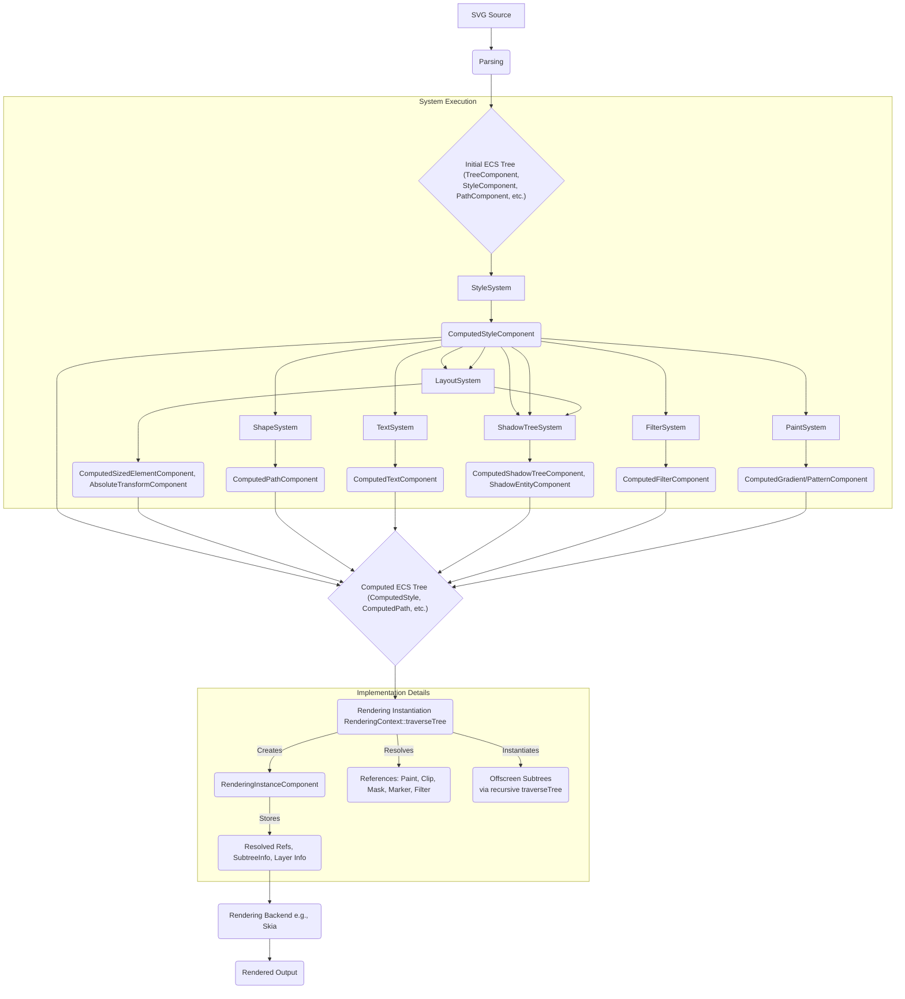

# Donner SVG Rendering Pipeline Summary

This document outlines the steps Donner takes to transform a parsed SVG document into rendered output, focusing on the Entity-Component-System (ECS) transformations involved.

## Overview

The rendering pipeline processes the initial ECS representation of the SVG, applies styling and layout, computes final shapes and effects, and then generates a list of rendering instructions suitable for a backend like Skia. The process involves several distinct stages executed by different ECS systems, culminating in the creation of `RenderingInstanceComponent` entities.

## Pipeline Stages

1.  **Parsing:**
    *   Input: SVG source (file or string).
    *   Output: An initial ECS tree populated with components representing the raw SVG structure and attributes (e.g., `donner::components::TreeComponent`, `donner::svg::components::StyleComponent`, `donner::svg::components::PathComponent`, `donner::svg::components::ElementTypeComponent`).

2.  **System Execution (Pre-computation):**
    *   These systems run sequentially (respecting dependencies) to compute derived values and prepare the ECS for rendering. They transform initial components into `Computed*` components.
    *   **`StyleSystem`:**
        *   Input: `StyleComponent`, CSS rules (`donner::css::Registry`), element hierarchy (`TreeComponent`).
        *   Output: `ComputedStyleComponent` attached to each entity, containing resolved style properties after applying CSS cascading, inheritance, and presentation attributes.
    *   **`LayoutSystem`:**
        *   Input: `ComputedStyleComponent`, `TreeComponent`, viewport information.
        *   Output:
            *   `ComputedSizedElementComponent`: Calculates bounding boxes based on styles and element type.
            *   `AbsoluteTransformComponent`: Computes the final world transformation matrix for each element.
            *   Handles viewport/viewBox transformations.
    *   **`ShapeSystem`:**
        *   Input: `PathComponent`, `RectComponent`, etc., `ComputedStyleComponent`.
        *   Output: `ComputedPathComponent` (containing `PathSpline`), `ComputedRectComponent`, etc. Calculates the final geometry based on computed styles (handling SVG2 features where geometry attributes like `d` or `x`/`y` can be defined in CSS).
    *   **`TextSystem`:**
        *   Input: `TextComponent`, `ComputedStyleComponent`.
        *   Output: `ComputedTextComponent` containing laid-out text information.
    *   **`ShadowTreeSystem`:**
        *   Input: Entities representing elements that create shadow trees (`<use>`, `<pattern>`, `<mask>`, `<marker>`), `ComputedStyleComponent`.
        *   Output:
            *   `ShadowTreeComponent`: Defines the structure of shadow trees.
            *   `ComputedShadowTreeComponent`: Contains the root entities for instantiated main and offscreen shadow branches (e.g., separate branches for a pattern's content, its mask, its fill). This system interacts with `LayoutSystem` to size shadow elements correctly.
            *   Attaches `ShadowEntityComponent` to entities within shadow trees, linking them back to their corresponding light DOM entity.
    *   **`FilterSystem`:**
        *   Input: `FilterComponent`, `ComputedStyleComponent`.
        *   Output: `ComputedFilterComponent` containing processed filter primitive information.
    *   **`PaintSystem`:**
        *   Input: `LinearGradientComponent`, `RadialGradientComponent`, `PatternComponent`, `ComputedStyleComponent`.
        *   Output: `ComputedGradientComponent`, `ComputedPatternComponent` containing processed paint server details.

3.  **Rendering Instantiation (`RenderingContext`):**
    *   Input: The ECS tree populated with `Computed*` components from the previous stage.
    *   Process: Traverses the main ECS tree (including shadow entities created by `ShadowTreeSystem`).
    *   For each visible, non-empty element:
        *   Creates a `RenderingInstanceComponent`.
        *   Calculates final `entityFromWorldTransform`.
        *   Resolves references specified in styles (e.g., `fill="url(#pattern)"`, `clip-path="url(#clipper)"`, `filter="url(#blur)"`). This involves looking up the referenced entity and potentially triggering the instantiation of *offscreen subtrees*.
        *   **Offscreen Subtree Instantiation:** If resolving a reference requires rendering content defined elsewhere (e.g., a `<pattern>`, `<mask>`, `<marker>`), `RenderingContext` recursively traverses the corresponding *offscreen shadow branch* (identified via `ComputedShadowTreeComponent`). This creates `RenderingInstanceComponent`s for the offscreen content. The main `RenderingInstanceComponent` stores `SubtreeInfo` pointing to the first and last instance components of this offscreen render tree.
        *   Stores resolved references (e.g., `ResolvedPaintServer`, `ResolvedClipPath`, `ResolvedMask`, `ResolvedMarker`, `ResolvedFilterEffect`) and `SubtreeInfo` within the `RenderingInstanceComponent`.
        *   Determines if an isolated layer is needed (due to opacity < 1, filters, masks, or clip-paths) and stores this in `RenderingInstanceComponent`.
        *   Assigns a `drawOrder`.
    *   Output: A flat list of `RenderingInstanceComponent` entities, ordered by `drawOrder`, representing the entire scene (including main and all necessary offscreen content).

4.  **Rendering Backend (e.g., Skia):**
    *   Input: The list of `RenderingInstanceComponent`s.
    *   Process: Iterates through the `RenderingInstanceComponent`s in `drawOrder`.
    *   For each instance:
        *   Sets up the canvas state (transform, clipping rectangle).
        *   Handles layers (e.g., `SkCanvas::saveLayer` / `restore`) if `isolatedLayer` is true, applying opacity, filters, masks, or clip-paths.
        *   Draws the element's shape (`ComputedPathComponent`, `ComputedTextComponent`, etc.).
        *   Configures paint based on `ResolvedPaintServer`. If it references an offscreen subtree (e.g., a pattern fill), it uses the `SubtreeInfo` to locate the corresponding `RenderingInstanceComponent`s and instructs the backend to render them (e.g., draw the pattern tiled).
        *   Applies markers by using the `ResolvedMarker` and its associated `SubtreeInfo` to render the marker content at the correct positions along the path.
    *   Output: The final rendered image or drawing commands.

## Summary Diagram

