# Donner SVG, a modern SVG rendering library in C++

[](https://github.com/jwmcglynn/donner/actions/workflows/main.yml) [](https://opensource.org/licenses/ISC) [](https://codecov.io/gh/jwmcglynn/donner)  


Donner SVG is an under-development modern C++20 SVG rendering library which provides full access to the SVG DOM, enabling browser-level functionality without the browser.

Donner is nearing a 0.1 release, which provides core static SVG functionality (without text or filter support). Text, filter, and animation support are on the roadmap.



Why Donner?

- Donner is security-first and extensively tested
- Donner provides an extensive and well-documented SVG API surface, which enables inspecting and modifying the SVG in-memory
- Donner implements the latest standards, SVG2 and CSS3 and aims for high-conformance

Donner supports:

- SVG2 core functionality, such as shapes, fills, strokes, and gradients
- CSS3 parsing and cascading support, with a hand-rolled library
- Detailed validation and diagnostics, errors point to the exact location
- A game-engine-inspired [EnTT](https://github.com/skypjack/entt) ECS-backed document tree, optimized for performance
- A SVG DOM-style API to traverse, inspect, and modify documents in memory
- A two-phase renderer, which builds and caches a rendering tree for efficient frame-based rendering

Donner renders with Skia, which provides the same high-quality rendering used by Chromium.

## Supported Elements

[`<circle>`](https://jwmcglynn.github.io/donner/xml_circle.html) [`<clipPath>`](https://jwmcglynn.github.io/donner/xml_clipPath.html) [`<defs>`](https://jwmcglynn.github.io/donner/xml_defs.html) [`<ellipse>`](https://jwmcglynn.github.io/donner/xml_ellipse.html) [`<g>`](https://jwmcglynn.github.io/donner/xml_g.html) [`<image>`](https://jwmcglynn.github.io/donner/group__xml__image.html) [`<line>`](https://jwmcglynn.github.io/donner/xml_line.html) [`<linearGradient>`](https://jwmcglynn.github.io/donner/xml_linearGradient.html) [`<marker>`](https://jwmcglynn.github.io/donner/xml_marker.html) [`<mask>`](https://jwmcglynn.github.io/donner/xml_mask.html) [`<path>`](https://jwmcglynn.github.io/donner/xml_path.html) [`<pattern>`](https://jwmcglynn.github.io/donner/xml_pattern.html) [`<polygon>`](https://jwmcglynn.github.io/donner/xml_polygon.html) [`<polyline>`](https://jwmcglynn.github.io/donner/xml_polyline.html) [`<radialGradient>`](https://jwmcglynn.github.io/donner/xml_radialGradient.html) [`<rect>`](https://jwmcglynn.github.io/donner/xml_rect.html) [`<stop>`](https://jwmcglynn.github.io/donner/xml_stop.html) [`<style>`](https://jwmcglynn.github.io/donner/group__xml__style.html) [`<svg>`](https://jwmcglynn.github.io/donner/xml_svg.html) [`<use>`](https://jwmcglynn.github.io/donner/xml_use.html)

**Not yet supported:** `<a>` `<filter>` `<switch>` `<symbol>` `<text>` `<textPath>` `<tspan>`

## Try it out: Render an SVG to PNG

```sh
bazel run --run_under="cd $PWD &&" //examples:svg_to_png -- donner_splash.svg
```

[](https://codespaces.new/jwmcglynn/donner)

How it works: [svg_to_png.cc](https://jwmcglynn.github.io/donner/svg_to_png_8cc-example.html)

## API Demo

```cpp
// This is the base SVG we are loading, a simple path containing a line
const std::string_view svgContents(R"(
  <svg xmlns="http://www.w3.org/2000/svg" width="200" height="200" viewBox="0 0 10 10">
    <path d="M 1 1 L 4 5" stroke="blue" />
  </svg>
)");

// Call ParseSVG to load the SVG file
donner::ParseResult<donner::svg::SVGDocument> maybeResult =
    donner::svg::parser::SVGParser::ParseSVG(svgContents);

if (maybeResult.hasError()) {
  std::cerr << "Parse Error " << maybeResult.error() << "\n";  // Includes line:column and reason
  std::abort();
  // - or - handle the error per your project's conventions
}

donner::svg::SVGDocument document = std::move(maybeResult.result());

// querySelector supports standard CSS selectors, anything that's valid when defining a CSS rule
// works here too, for example querySelector("svg > path[fill='blue']") is also valid and will
// match the same element.
std::optional<donner::svg::SVGElement> maybePath = document.querySelector("path");
UTILS_RELEASE_ASSERT_MSG(maybePath, "Failed to find path element");

// The result of querySelector is a generic SVGElement, but we know it's a path, so we can cast
// it. If the cast fails, an assertion will be triggered.
donner::svg::SVGPathElement path = maybePath->cast<donner::svg::SVGPathElement>();

if (std::optional<donner::svg::PathSpline> spline = path.computedSpline()) {
  std::cout << "Path: " << *spline << "\n";
  std::cout << "Length: " << spline->pathLength() << " userspace units\n";
} else {
  std::cout << "Path is empty\n";
}
```

Detailed docs: [svg_tree_interaction.cc](https://jwmcglynn.github.io/donner/svg_tree_interaction_8cc-example.html)

## API Demo 2: Rendering a SVG to PNG

```cpp
using namespace donner;
using namespace donner::svg;
using namespace donner::svg::parser;

std::ifstream file("test.svg");
if (!file) {
  std::cerr << "Could not open file\n";
  std::abort();
}

std::string fileData;
file.seekg(0, std::ios::end);
const std::streamsize fileLength = file.tellg();
file.seekg(0);

fileData.resize(fileLength);  
file.read(fileData.data(), fileLength);

ParseResult<SVGDocument> maybeDocument = SVGParser::ParseSVG(fileData);
if (maybeDocument.hasError()) {
  std::cerr << "Parse Error: " << maybeDocument.error() << "\n";
  std::abort();
}

RendererSkia renderer;
renderer.draw(maybeDocument.result());

const bool success = renderer.save("output.png");
```

Detailed docs: [svg_to_png.cc](https://jwmcglynn.github.io/donner/svg_to_png_8cc-example.html)

## API Demo 3: Interactive SVG Viewer using ImGui

```sh
bazel run --run_under="cd $PWD &&" //experimental/viewer:svg_viewer -- <filename>
```

This example demonstrates how to create an interactive SVG viewer using ImGui. The viewer allows you to load and display SVG files, and interact with SVG elements using ImGui.

See the source at: [experimental/viewer/svg_viewer.cc](./experimental/viewer/svg_viewer.cc)

## Documentation

- [Getting started](https://jwmcglynn.github.io/donner/GettingStarted.html)
- [API Documentation](https://jwmcglynn.github.io/donner/DonnerAPI.html)
- [System architecture](https://jwmcglynn.github.io/donner/SystemArchitecture.html)
- [Building Donner](https://jwmcglynn.github.io/donner/BuildingDonner.html)
- [Examples](https://jwmcglynn.github.io/donner/examples.html)

## Status

- [Project status](https://github.com/jwmcglynn/donner/issues/149)
- [Build report](docs/build_report.md)

## Other Libraries

- C++ | **[LunaSVG](https://github.com/sammycage/lunasvg)**: A lightweight library with an embedded renderer, suitable for embedded applications
- Rust | **[librsvg](https://gitlab.gnome.org/GNOME/librsvg)**: Provides a simple way to render SVGs one-shot, does not provide a DOM or animation
- Rust | **[resvg](https://github.com/RazrFalcon/resvg)**: Library that focuses on correctness, safety, and portability for static SVGs
