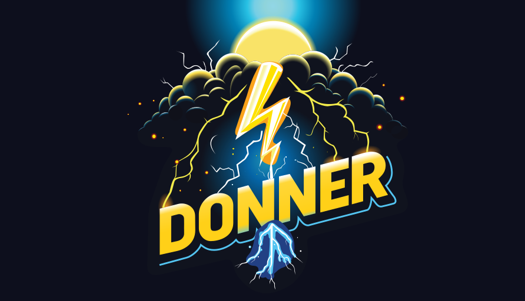

# Donner SVG: Embeddable browser-grade SVG2 engine for your application

[](https://github.com/jwmcglynn/donner/actions/workflows/main.yml) [](https://opensource.org/licenses/ISC) [](https://codecov.io/gh/jwmcglynn/donner)  


Donner SVG is an embeddable browser-grade SVG2 engine in C++20, providing full access to the SVG DOM. [Try it out online!](https://jwmcglynn.github.io/donner-editor/)



```cpp
ParseWarningSink warnings;
ParseResult<SVGDocument> maybeDocument = SVGParser::ParseSVG(
    loadFile("donner_splash.svg"), warnings);

if (maybeDocument.hasError()) {
  std::cerr << "Parse Error: " << maybeDocument.error() << "\n";
  std::abort();
}

Renderer renderer;
renderer.draw(maybeDocument.result());

const bool success = renderer.save("output.png");
```

## Why Donner?

- It's designed to be embeddable, and provides an exception-free API surface
- For malformed files, it produces detailed parse errors, which includes file/line information
- Donner provides an extensive and well-documented SVG API surface, which enables inspecting and modifying the SVG in-memory
- Donner implements the latest standards, SVG2 and CSS3 and aims for high-conformance

Donner supports:

- SVG2 core functionality, such as shapes, fills, strokes, and gradients
- Text rendering with `<text>`, `<tspan>`, and `<textPath>`, including WOFF2 web fonts and optional HarfBuzz shaping
- All 17 SVG filter primitives (feGaussianBlur, feColorMatrix, feComposite, etc.)
- CSS3 parsing and cascading support, with a hand-rolled library
- Detailed validation and diagnostics, errors point to the exact location
- A game-engine-inspired [EnTT](https://github.com/skypjack/entt) ECS-backed document tree, optimized for performance
- A SVG DOM-style API to traverse, inspect, and modify documents in memory
- A two-phase renderer, which builds and caches a rendering tree for efficient frame-based rendering
- Two renderer backends: **tiny-skia** (default, a lightweight software renderer) and **Skia** (Chromium's renderer)

## Supported Elements

[`<circle>`](https://jwmcglynn.github.io/donner/xml_circle.html) [`<clipPath>`](https://jwmcglynn.github.io/donner/xml_clipPath.html) [`<defs>`](https://jwmcglynn.github.io/donner/xml_defs.html) [`<ellipse>`](https://jwmcglynn.github.io/donner/xml_ellipse.html) [`<feBlend>`](https://jwmcglynn.github.io/donner/xml_feBlend.html) [`<feColorMatrix>`](https://jwmcglynn.github.io/donner/xml_feColorMatrix.html) [`<feComponentTransfer>`](https://jwmcglynn.github.io/donner/xml_feComponentTransfer.html) [`<feComposite>`](https://jwmcglynn.github.io/donner/xml_feComposite.html) [`<feConvolveMatrix>`](https://jwmcglynn.github.io/donner/xml_feConvolveMatrix.html) [`<feDiffuseLighting>`](https://jwmcglynn.github.io/donner/xml_feDiffuseLighting.html) [`<feDisplacementMap>`](https://jwmcglynn.github.io/donner/xml_feDisplacementMap.html) [`<feDistantLight>`](https://jwmcglynn.github.io/donner/xml_feDistantLight.html) [`<feDropShadow>`](https://jwmcglynn.github.io/donner/xml_feDropShadow.html) [`<feFlood>`](https://jwmcglynn.github.io/donner/xml_feFlood.html) [`<feFuncA>`](https://jwmcglynn.github.io/donner/xml_feFuncA.html) [`<feFuncB>`](https://jwmcglynn.github.io/donner/xml_feFuncB.html) [`<feFuncG>`](https://jwmcglynn.github.io/donner/xml_feFuncG.html) [`<feFuncR>`](https://jwmcglynn.github.io/donner/xml_feFuncR.html) [`<feGaussianBlur>`](https://jwmcglynn.github.io/donner/xml_feGaussianBlur.html) [`<feImage>`](https://jwmcglynn.github.io/donner/xml_feImage.html) [`<feMerge>`](https://jwmcglynn.github.io/donner/xml_feMerge.html) [`<feMergeNode>`](https://jwmcglynn.github.io/donner/xml_feMergeNode.html) [`<feMorphology>`](https://jwmcglynn.github.io/donner/xml_feMorphology.html) [`<feOffset>`](https://jwmcglynn.github.io/donner/xml_feOffset.html) [`<fePointLight>`](https://jwmcglynn.github.io/donner/xml_fePointLight.html) [`<feSpecularLighting>`](https://jwmcglynn.github.io/donner/xml_feSpecularLighting.html) [`<feSpotLight>`](https://jwmcglynn.github.io/donner/xml_feSpotLight.html) [`<feTile>`](https://jwmcglynn.github.io/donner/xml_feTile.html) [`<feTurbulence>`](https://jwmcglynn.github.io/donner/xml_feTurbulence.html) [`<filter>`](https://jwmcglynn.github.io/donner/xml_filter.html) [`<g>`](https://jwmcglynn.github.io/donner/xml_g.html) [`<image>`](https://jwmcglynn.github.io/donner/group__xml__image.html) [`<line>`](https://jwmcglynn.github.io/donner/xml_line.html) [`<linearGradient>`](https://jwmcglynn.github.io/donner/xml_linearGradient.html) [`<marker>`](https://jwmcglynn.github.io/donner/xml_marker.html) [`<mask>`](https://jwmcglynn.github.io/donner/xml_mask.html) [`<path>`](https://jwmcglynn.github.io/donner/xml_path.html) [`<pattern>`](https://jwmcglynn.github.io/donner/xml_pattern.html) [`<polygon>`](https://jwmcglynn.github.io/donner/xml_polygon.html) [`<polyline>`](https://jwmcglynn.github.io/donner/xml_polyline.html) [`<radialGradient>`](https://jwmcglynn.github.io/donner/xml_radialGradient.html) [`<rect>`](https://jwmcglynn.github.io/donner/xml_rect.html) [`<stop>`](https://jwmcglynn.github.io/donner/xml_stop.html) [`<style>`](https://jwmcglynn.github.io/donner/group__xml__style.html) [`<svg>`](https://jwmcglynn.github.io/donner/xml_svg.html) [`<symbol>`](https://jwmcglynn.github.io/donner/xml_symbol.html) [`<text>`](https://jwmcglynn.github.io/donner/xml_text.html) [`<textPath>`](https://jwmcglynn.github.io/donner/xml_textPath.html) [`<tspan>`](https://jwmcglynn.github.io/donner/xml_tspan.html) [`<use>`](https://jwmcglynn.github.io/donner/xml_use.html)

**Not yet supported:** `<a>` `<switch>`

## CLI Tool: donner-svg

Donner also ships an end-user CLI for rendering and previewing SVG files.

```sh
# Render to PNG
tools/donner-svg donner_splash.svg --output output.png

# Show terminal preview
tools/donner-svg donner_splash.svg --preview

# Interactive terminal mode with mouse selection
tools/donner-svg donner_splash.svg --interactive
```

Tool docs: [`donner/svg/tool/README.md`](donner/svg/tool/README.md)

[](https://codespaces.new/jwmcglynn/donner)

## Simplified Example: Saving an SVG to PNG

```sh
bazel run //examples:svg_to_png -- donner_splash.svg
```

How it works: [svg_to_png.cc](https://jwmcglynn.github.io/donner/svg_to_png_8cc-example.html)

## API Demo

```cpp
// This is the base SVG we are loading, a simple path containing a line
const std::string_view svgContents(R"(
  <svg xmlns="http://www.w3.org/2000/svg" width="200" height="200" viewBox="0 0 10 10">
    <path d="M 1 1 L 4 5" stroke="blue" />
  </svg>
)");

// Call ParseSVG to load the SVG file
donner::ParseWarningSink disabled = donner::ParseWarningSink::Disabled();
donner::ParseResult<donner::svg::SVGDocument> maybeResult =
    donner::svg::parser::SVGParser::ParseSVG(svgContents, disabled);

if (maybeResult.hasError()) {
  std::cerr << "Parse Error " << maybeResult.error() << "\n";  // Includes line:column and reason
  std::abort();
  // - or - handle the error per your project's conventions
}

donner::svg::SVGDocument document = std::move(maybeResult.result());

// querySelector supports standard CSS selectors, anything that's valid when defining a CSS rule
// works here too, for example querySelector("svg > path[fill='blue']") is also valid and will
// match the same element.
std::optional<donner::svg::SVGElement> maybePath = document.querySelector("path");
UTILS_RELEASE_ASSERT_MSG(maybePath, "Failed to find path element");

// The result of querySelector is a generic SVGElement, but we know it's a path, so we can cast
// it. If the cast fails, an assertion will be triggered.
donner::svg::SVGPathElement path = maybePath->cast<donner::svg::SVGPathElement>();

if (std::optional<donner::svg::PathSpline> spline = path.computedSpline()) {
  std::cout << "Path: " << *spline << "\n";
  std::cout << "Length: " << spline->pathLength() << " userspace units\n";
} else {
  std::cout << "Path is empty\n";
}
```

Detailed docs: [svg_tree_interaction.cc](https://jwmcglynn.github.io/donner/svg_tree_interaction_8cc-example.html)

## API Demo 2: Rendering a SVG to PNG

```cpp
using namespace donner;
using namespace donner::svg;
using namespace donner::svg::parser;

std::ifstream file("test.svg");
if (!file) {
  std::cerr << "Could not open file\n";
  std::abort();
}

std::string fileData;
file.seekg(0, std::ios::end);
const std::streamsize fileLength = file.tellg();
file.seekg(0);

fileData.resize(fileLength);  
file.read(fileData.data(), fileLength);

ParseWarningSink warnings;
ParseResult<SVGDocument> maybeDocument = SVGParser::ParseSVG(fileData, warnings);
if (maybeDocument.hasError()) {
  std::cerr << "Parse Error: " << maybeDocument.error() << "\n";
  std::abort();
}

Renderer renderer;
renderer.draw(maybeDocument.result());

const bool success = renderer.save("output.png");
```

Detailed docs: [svg_to_png.cc](https://jwmcglynn.github.io/donner/svg_to_png_8cc-example.html)

## API Demo 3: Interactive SVG Viewer using ImGui

```sh
bazel run //experimental/viewer:svg_viewer -- donner_icon.svg
```

This example demonstrates how to create an interactive SVG viewer using ImGui. The viewer allows you to load and display SVG files, and interact with SVG elements using ImGui.

See the source at: [experimental/viewer/svg_viewer.cc](./experimental/viewer/svg_viewer.cc)

## Documentation

- [Getting Started](https://jwmcglynn.github.io/donner/GettingStarted.html)
- [API Documentation](https://jwmcglynn.github.io/donner/DonnerAPI.html)
- [System Architecture](https://jwmcglynn.github.io/donner/SystemArchitecture.html)
- [Building Donner](https://jwmcglynn.github.io/donner/BuildingDonner.html)
- [donner-svg CLI tool](https://jwmcglynn.github.io/donner/DonnerSvgTool.html)
- [Examples](https://jwmcglynn.github.io/donner/examples.html)

## Status

- [Project Status](https://github.com/jwmcglynn/donner/issues/149)
- [Build Report](docs/build_report.md)

## CMake Support

CMake support is available for integrating Donner into CMake-based projects. The CMake build fetches dependencies and builds the library. Both the Skia and tiny-skia backends are supported.

See the [CMake Documentation](https://jwmcglynn.github.io/donner/BuildingDonner.html#cmake-build) for more details.

## Other Libraries

- C++ | **[LunaSVG](https://github.com/sammycage/lunasvg)**: A lightweight library with an embedded renderer, suitable for embedded applications
- Rust | **[librsvg](https://gitlab.gnome.org/GNOME/librsvg)**: Provides a simple way to render SVGs one-shot, does not provide a DOM or animation
- Rust | **[resvg](https://github.com/RazrFalcon/resvg)**: Library that focuses on correctness, safety, and portability for static SVGs
