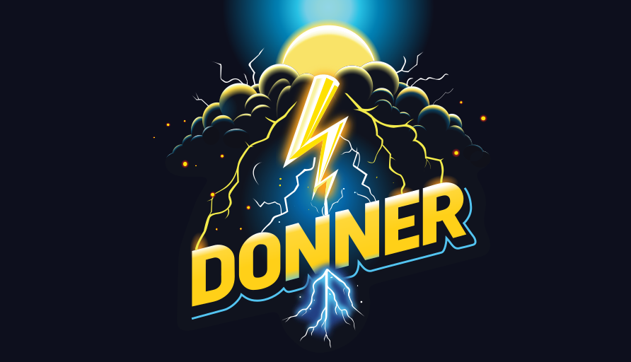

# Donner SVG Editor & Engine

[](https://github.com/jwmcglynn/donner/actions/workflows/main.yml) [](https://opensource.org/licenses/ISC)
[](https://deepwiki.com/jwmcglynn/donner)
[](https://www.codefactor.io/repository/github/jwmcglynn/donner)
<br>
[](https://codecov.io/gh/jwmcglynn/donner)


A native SVG editor built on its own SVG2 and CSS3 engine, written from scratch in C++20.

The engine underneath the editor targets browser-grade correctness, security, and
performance, and it can be embedded in other applications as either a GPU-rendered canvas or a
size-optimized software renderer.



[Try it out online!](https://jwmcglynn.github.io/donner-editor/)

## Why Donner

- SVG-native editing. Selection and transform tools with oriented bounding boxes, a pen
  tool, rich text editing with real fonts, and layers. The document you edit is the SVG
  file itself.
- Spec conformance. Rendering is checked against the resvg test suite in CI, with visual
  regression tests on every push.
- Feature coverage. SVG2 rendering with CSS3 styling, text with a full font stack (FreeType,
  HarfBuzz, WOFF2) or a compact built-in stack, and filters.
- Performance. Geode, a GPU renderer, drives the editor canvas. A
  tiny_skia-based CPU backend serves the size-optimized embeddable build.
- Security. Donner is designed for untrusted input and is fuzzed continuously.
- Embedding. A C++20 Bazel module with an exception-free, RTTI-free API. The tiny
  variant is tuned for binary size.

## The editor

The editor ships with the engine and is under active development. Open a file, edit it visually or in the built-in XML view (the two stay in sync), and export the result as SVG.

## Supported SVG elements and features

Donner targets the SVG 2 static rendering subset. The tables below describe what the engine
parses and renders today.

Legend: **Yes** = parsed and rendered; **Partial** = supported with the noted gaps;
**Parsed only** = retained on the DOM but not drawn (by design); **No** = not recognized (parses to
an unknown element).

### Elements

| Category                  | Elements                                                                                                                                                                                                                                                                                                                                                                                                                                                           | Support                                                                                                                                                                                                                                                                                                                                                                                                                           |
| :------------------------ | :----------------------------------------------------------------------------------------------------------------------------------------------------------------------------------------------------------------------------------------------------------------------------------------------------------------------------------------------------------------------------------------------------------------------------------------------------------------- | :-------------------------------------------------------------------------------------------------------------------------------------------------------------------------------------------------------------------------------------------------------------------------------------------------------------------------------------------------------------------------------------------------------------------------------- |
| Structural                | [`<svg>`](https://jwmcglynn.github.io/donner/xml_svg.html) [`<g>`](https://jwmcglynn.github.io/donner/xml_g.html) [`<defs>`](https://jwmcglynn.github.io/donner/xml_defs.html) [`<symbol>`](https://jwmcglynn.github.io/donner/xml_symbol.html) [`<use>`](https://jwmcglynn.github.io/donner/xml_use.html) [`<style>`](https://jwmcglynn.github.io/donner/xml_style.html) [`<switch>`](https://jwmcglynn.github.io/donner/xml_switch.html)                         | Yes                                                                                                                                                                                                                                                                                                                                                                                                                               |
| Hyperlink                 | [`<a>`](https://jwmcglynn.github.io/donner/xml_a.html)                                                                                                                                                                                                                                                                                                                                                                                                             | Yes. Renders as a transparent group (its children draw in place); the link target (`href` / `xlink:href`) is retained on the DOM.                                                                                                                                                                                                                                                                                                 |
| Shapes                    | [`<circle>`](https://jwmcglynn.github.io/donner/xml_circle.html) [`<ellipse>`](https://jwmcglynn.github.io/donner/xml_ellipse.html) [`<line>`](https://jwmcglynn.github.io/donner/xml_line.html) [`<path>`](https://jwmcglynn.github.io/donner/xml_path.html) [`<polygon>`](https://jwmcglynn.github.io/donner/xml_polygon.html) [`<polyline>`](https://jwmcglynn.github.io/donner/xml_polyline.html) [`<rect>`](https://jwmcglynn.github.io/donner/xml_rect.html) | Yes                                                                                                                                                                                                                                                                                                                                                                                                                               |
| Raster image              | [`<image>`](https://jwmcglynn.github.io/donner/xml_image.html)                                                                                                                                                                                                                                                                                                                                                                                                     | Partial. Embedded (data URI) images render, and file references load through a host-supplied resource loader; network URLs are not fetched ([#1183](https://github.com/jwmcglynn/donner/issues/1183)).                                                                                                                                                                                                                                                                                                                                |
| Text                      | [`<text>`](https://jwmcglynn.github.io/donner/xml_text.html) [`<tspan>`](https://jwmcglynn.github.io/donner/xml_tspan.html) [`<textPath>`](https://jwmcglynn.github.io/donner/xml_textPath.html)                                                                                                                                                                                                                                                                   | Partial. See Text features below. Text requires a text-enabled build; the size-optimized build can omit it.                                                                                                                                                                                                                                                                                                                       |
| Paint servers and markers | [`<linearGradient>`](https://jwmcglynn.github.io/donner/xml_linearGradient.html) [`<radialGradient>`](https://jwmcglynn.github.io/donner/xml_radialGradient.html) [`<stop>`](https://jwmcglynn.github.io/donner/xml_stop.html) [`<pattern>`](https://jwmcglynn.github.io/donner/xml_pattern.html) [`<marker>`](https://jwmcglynn.github.io/donner/xml_marker.html)                                                                                                 | Yes. Linear and radial gradients (all spread methods, radial focal point) and patterns are supported; conic/sweep gradients are not.                                                                                                                                                                                                                                                                                              |
| Masking and clipping      | [`<mask>`](https://jwmcglynn.github.io/donner/xml_mask.html) [`<clipPath>`](https://jwmcglynn.github.io/donner/xml_clipPath.html)                                                                                                                                                                                                                                                                                                                                  | Partial. Core masking and clipping, `mask-type`, and vector text children in clip paths work; bitmap text silhouettes, some nested clip-path intersections, and a few mask-unit edge cases are not yet handled ([#1179](https://github.com/jwmcglynn/donner/issues/1179), [#1180](https://github.com/jwmcglynn/donner/issues/1180), [#1231](https://github.com/jwmcglynn/donner/issues/1231)).                                                                                                                                                                                                                   |
| Filters                   | [`<filter>`](https://jwmcglynn.github.io/donner/xml_filter.html) and the full `<fe*>` primitive suite                                                                                                                                                                                                                                                                                                                                                              | Partial. All 17 filter primitives have DOM wrappers and renderer support. Some CSS `filter:` function-list cases, `enable-background` / `BackgroundImage`, and some `feImage` subregion cases are not yet handled ([#1169](https://github.com/jwmcglynn/donner/issues/1169), [#1170](https://github.com/jwmcglynn/donner/issues/1170)). See the [filter element reference](https://jwmcglynn.github.io/donner/elements_filters.html). |
| Descriptive               | [`<title>`](https://jwmcglynn.github.io/donner/xml_title.html) [`<desc>`](https://jwmcglynn.github.io/donner/xml_desc.html) [`<metadata>`](https://jwmcglynn.github.io/donner/xml_metadata.html)                                                                                                                                                                                                                                                                   | Parsed only (retained, never drawn, per spec).                                                                                                                                                                                                                                                                                                                                                                                    |

Elements outside this list (for example `<foreignObject>`, `<tref>`, SVG 1.1 `<font>` / `<glyph>`,
`<cursor>`, `<view>`, `<script>`) are not recognized and parse to an unknown element. See
[unsupported SVG 1.x features](docs/unsupported_svg1_features.md) for the SVG 1.1 details.

### Presentation attributes and CSS properties

| Support                        | Properties                                                                                                                                                                                                                                                                                                                                                                                                                                                                                                                                                                                                                                    |
| :----------------------------- | :-------------------------------------------------------------------------------------------------------------------------------------------------------------------------------------------------------------------------------------------------------------------------------------------------------------------------------------------------------------------------------------------------------------------------------------------------------------------------------------------------------------------------------------------------------------------------------------------------------------------------------------------- |
| Honored                        | `fill` / `fill-rule` / `fill-opacity`, `stroke` and all `stroke-*`, `opacity`, `color`, `display`, `visibility`, `overflow`, `transform` / `transform-origin`, `clip-path` / `clip-rule`, `mask` / `mask-type`, `filter`, `color-interpolation-filters`, `image-rendering` (including distinct `pixelated`, `crisp-edges`, smooth, quality, and legacy-alias policies for `<image>` and `<feImage>`), `marker-start` / `-mid` / `-end`, `mix-blend-mode` (all 16 modes), `isolation`, `paint-order`, and the text properties (`font-*`, `text-anchor`, `text-decoration`, baseline family, `letter-spacing`, `word-spacing`, `writing-mode`). |
| Partial                        | `vector-effect`: `non-scaling-stroke` is exact for uniform scale and rotation; non-uniform transforms use a scalar approximation, and the other at-risk SVG 2 values parse but render as `none` ([#1207](https://github.com/jwmcglynn/donner/issues/1207), [#1232](https://github.com/jwmcglynn/donner/issues/1232)). `pointer-events` (including `auto`) drives hit-testing, with text, image, and clip-path edge cases still incomplete ([#1233](https://github.com/jwmcglynn/donner/issues/1233)). `cursor` supports every CSS Basic UI keyword, ordered `url()` candidates with optional hotspots, inheritance, and `DonnerController::cursorAt`; CSS `image-set()`, declaration-base URL resolution, resource loading, and platform cursor mapping are not yet implemented ([#1234](https://github.com/jwmcglynn/donner/issues/1234)).                 |
| Recognized but not implemented | The rendering hints `color-rendering`, `shape-rendering`, `text-rendering`, and `color-interpolation` are retained as raw properties but have no typed cascade or runtime behavior yet ([#1235](https://github.com/jwmcglynn/donner/issues/1235)).                                                                                                                                                                                                                                                                                                                                                                                                                                                   |
| Not implemented                | `direction` / `unicode-bidi` (bidirectional text; [#1171](https://github.com/jwmcglynn/donner/issues/1171)), `text-orientation` ([#1172](https://github.com/jwmcglynn/donner/issues/1172)), and `font-size-adjust` ([#1173](https://github.com/jwmcglynn/donner/issues/1173)). SVG 1.1-only features such as `<tref>`, `glyph-orientation-horizontal`, and CSS2 `clip: rect(...)` are intentionally unsupported; see [unsupported SVG 1.x features](docs/unsupported_svg1_features.md).                                                                                                                                                                                                                                                                                                                                       |

### Text features

Text layout supports fills and strokes (including gradient and pattern paints), per-glyph
positioning, `text-anchor`, `textPath` along a path, and a full font stack (FreeType, HarfBuzz,
WOFF2) or a compact built-in stack. Known gaps: bidirectional text and `direction` / `unicode-bidi`
([#1171](https://github.com/jwmcglynn/donner/issues/1171)), `textLength` / `lengthAdjust`
([#1174](https://github.com/jwmcglynn/donner/issues/1174)), several SVG 2 `<textPath>` features
(`side`, `method=stretch`, `spacing=auto`, the `path` attribute;
[#1175](https://github.com/jwmcglynn/donner/issues/1175)), full SVG 2 `text-decoration` (independent
line, style, and color; [#1177](https://github.com/jwmcglynn/donner/issues/1177)), and some
`vertical-rl` / `vertical-lr` and `text-orientation` cases
([#1172](https://github.com/jwmcglynn/donner/issues/1172)). `<tref>` is intentionally unsupported
because SVG 2 removed it.

### Renderers

Donner ships two backends behind one renderer interface. The tiny_skia CPU backend is the default.
The Geode GPU backend drives the editor canvas. Both backends honor
`paint-order` for shapes, markers, text, and tspans, and share the same DOM, layout, paint
resolution, markers, and filter graph.

## CLI Tool: donner-svg

Donner also ships a command-line tool for rendering and previewing SVG files.

```sh
# Render to PNG
bazel run //donner/svg/tool:donner-svg -- donner_splash.svg --output output.png

# Show a terminal preview
bazel run //donner/svg/tool:donner-svg -- donner_splash.svg --preview

# Interactive terminal mode with mouse selection
bazel run //donner/svg/tool:donner-svg -- donner_splash.svg --interactive
```

Tool docs: [donner-svg CLI tool](https://jwmcglynn.github.io/donner/DonnerSvgTool.html)

## Example: Saving an SVG to PNG

```sh
bazel run //examples:svg_to_png -- donner_splash.svg
```

How it works: [svg_to_png.cc](https://jwmcglynn.github.io/donner/svg_to_png_8cc-example.html)

## API Demo

```cpp
// This is the base SVG we are loading, a simple path containing a line
const std::string_view svgContents(R"(
  <svg xmlns="http://www.w3.org/2000/svg" width="200" height="200" viewBox="0 0 10 10">
    <path d="M 1 1 L 4 5" stroke="blue" />
  </svg>
)");

// Call ParseSVG to load the SVG file
donner::ParseWarningSink disabled = donner::ParseWarningSink::Disabled();
donner::ParseResult<donner::svg::SVGDocument> maybeResult =
    donner::svg::parser::SVGParser::ParseSVG(svgContents, disabled);

if (maybeResult.hasError()) {
  std::cerr << "Parse Error " << maybeResult.error() << "\n";  // Includes line:column and reason
  std::abort();
  // - or - handle the error per your project's conventions
}

donner::svg::SVGDocument document = std::move(maybeResult.result());

// querySelector supports standard CSS selectors, anything that's valid when defining a CSS rule
// works here too, for example querySelector("svg > path[fill='blue']") is also valid and will
// match the same element.
std::optional<donner::svg::SVGElement> maybePath = document.querySelector("path");
UTILS_RELEASE_ASSERT_MSG(maybePath, "Failed to find path element");

// The result of querySelector is a generic SVGElement, but we know it's a path, so we can cast
// it. If the cast fails, an assertion will be triggered.
donner::svg::SVGPathElement path = maybePath->cast<donner::svg::SVGPathElement>();

if (std::optional<donner::Path> computedPath = path.computedPath()) {
  std::cout << "Path: " << *computedPath << "\n";
  std::cout << "Length: " << computedPath->pathLength() << " userspace units\n";
} else {
  std::cout << "Path is empty\n";
}
```

Detailed docs: [svg_tree_interaction.cc](https://jwmcglynn.github.io/donner/svg_tree_interaction_8cc-example.html)

## API Demo 2: Rendering an SVG to PNG

```cpp
using namespace donner;
using namespace donner::svg;
using namespace donner::svg::parser;

std::ifstream file("test.svg");
if (!file) {
  std::cerr << "Could not open file\n";
  std::abort();
}

std::string fileData;
file.seekg(0, std::ios::end);
const std::streamsize fileLength = file.tellg();
file.seekg(0);

fileData.resize(fileLength);  
file.read(fileData.data(), fileLength);

ParseWarningSink warnings;
ParseResult<SVGDocument> maybeDocument = SVGParser::ParseSVG(fileData, warnings);
if (maybeDocument.hasError()) {
  std::cerr << "Parse Error: " << maybeDocument.error() << "\n";
  std::abort();
}

Renderer renderer;
renderer.draw(maybeDocument.result());

const bool success = renderer.save("output.png");
```

Detailed docs: [svg_to_png.cc](https://jwmcglynn.github.io/donner/svg_to_png_8cc-example.html)

## Documentation

- [Getting Started](https://jwmcglynn.github.io/donner/GettingStarted.html)
- [API Documentation](https://jwmcglynn.github.io/donner/DonnerAPI.html)
- [System Architecture](https://jwmcglynn.github.io/donner/SystemArchitecture.html)
- [Building Donner](https://jwmcglynn.github.io/donner/BuildingDonner.html)
- [donner-svg CLI tool](https://jwmcglynn.github.io/donner/DonnerSvgTool.html)
- [Examples](https://jwmcglynn.github.io/donner/examples.html)

## Status

- [Project Status](https://github.com/jwmcglynn/donner/issues/149)
- [Build Report](docs/build_report.md)

## CMake Support

Donner can also be integrated into CMake-based projects. The CMake build fetches dependencies and builds the library. Both the tiny_skia (CPU) and Geode (GPU) backends can be selected with `DONNER_RENDERER_BACKEND`; the default is `tiny_skia`.

See the [CMake Documentation](https://jwmcglynn.github.io/donner/BuildingDonner.html#cmake-build) for more details.

## Other Libraries

- C++ | **[LunaSVG](https://github.com/sammycage/lunasvg)**: A lightweight library with an embedded renderer, suitable for embedded applications
- C++ | **[ThorVG](https://github.com/thorvg/thorvg)**: A production vector graphics engine with software, OpenGL/ES, and WebGPU backends and Lottie support; targets SVG Tiny 1.2 rather than full SVG
- C | **[NanoSVG](https://github.com/memononen/nanosvg)**: A minimal single-header SVG parser and rasterizer, widely embedded where footprint matters; supports a small subset of SVG
- Rust | **[librsvg](https://gitlab.gnome.org/GNOME/librsvg)**: Renders SVGs in one shot; does not provide a DOM or animation
- Rust | **[resvg](https://github.com/RazrFalcon/resvg)**: Library that focuses on correctness, safety, and portability for static SVGs
- Rust | **[Vello](https://github.com/linebender/vello)**: A GPU compute-centric 2D renderer from the Linebender ecosystem; renders SVG through companion crates rather than natively
- Java | **[Apache Batik](https://xmlgraphics.apache.org/batik/)**: A full dynamic SVG implementation with DOM, scripting, and declarative animation; the closest reference for browser-style dynamic SVG outside a browser engine
