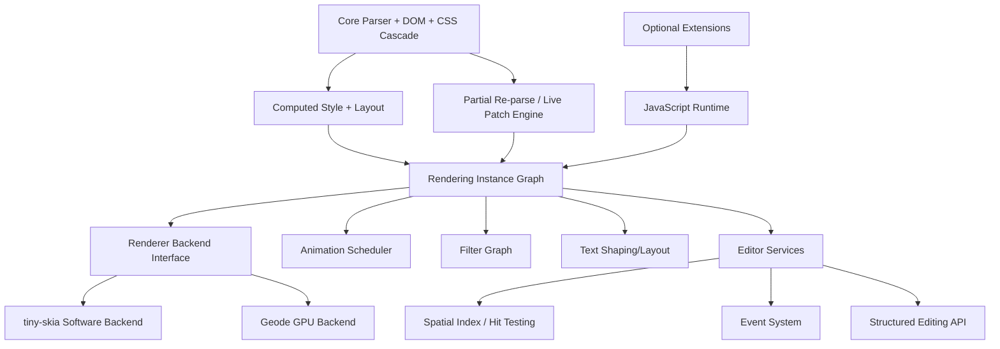

# Donner SVG Editor & Toolkit Project Roadmap {#DonnerProjectRoadmap}

**Status:** Active
**Updated:** 2026-05-30

## Summary

Donner is now positioned as **Donner SVG Editor & Toolkit**: an SVG editor application plus the
rendering, geometry, parsing, and authoring libraries needed to build SVG tooling.

After v0.1 established the static rendering baseline, a large body of work landed covering renderer
abstraction, a complete software rasterizer, text shaping, and all 17 SVG filter primitives. This is
collected as **v0.5**, skipping intermediate milestones that were overtaken by the pace of
development.

The next release target is **v0.8: Donner SVG Editor & Toolkit**. Its scope is everything completed
since v0.5, plus the editor showcase work needed to honestly demonstrate Donner authoring its own
new splash: a complete Layers panel, shape cut/copy/paste, a tuned Pen tool, text creation,
text-to-outline conversion, viewport SVG export, and optional editor overlay export. The broader
production-quality v1.0 milestone remains the follow-up release for animation, scripting,
conformance completion, parser hardening, and ecosystem integration.

---

## v0.1 — Static Rendering Baseline (shipped)

Core static SVG path/shape rendering and CSS cascade foundation. Established the ECS architecture,
XML parser, CSS parser, and Skia-based renderer.

---

## v0.5 — Rendering Engine (shipped)

Renderer abstraction, software rasterizer, text rendering, and filter effects.

### Renderer Architecture

- **Renderer interface abstraction** — `RendererInterface` split from the original full-Skia renderer with
  `RendererDriver` traversing a flat render tree. Enables future backend swaps.
  ([design](design_docs/0003-renderer_interface_design.md))
- **tiny-skia software renderer** — Full software rasterizer (fill, stroke, gradients, patterns,
  shaders, lowp/highp pipeline) as an alternative to Skia. All render operations within 1.5× of
  Skia performance.

### Text Rendering

- Phases 1–5: stb_truetype font loading, glyph outlines, `TextLayout`, WOFF2 support,
  `dominant-baseline`.
- Phase 6: Optional HarfBuzz text shaping tier (`--config=text-full`).
- `<textPath>` element support for text rendered along arbitrary paths.
- ([design](design_docs/0010-text_rendering.md))

### SVG Filter Effects

- All 17 SVG filter primitives implemented in the current tiny-skia backend; the former full-Skia
  path provided native `SkImageFilter` lowering before its removal.
- Float-precision filter pipeline with SIMD optimizations (NEON): Gaussian blur, morphology,
  color matrix, turbulence, convolution, blend, composite, lighting, displacement map, component
  transfer, flood, offset, merge, tile.
- All 23 filter benchmarks within 1.5× of Skia; 21 of 23 are faster.
- ([perf](design_docs/0014-filter_performance.md))

### Infrastructure

- Auto-detect font backends, crash handling hardening.
- Filter and render benchmark suites with perf regression tests (1.5× threshold enforcement).
- resvg test suite integration for golden image validation.

---

## v0.8 — Donner SVG Editor & Toolkit (next release)

Focus: rebrand Donner around the editor and toolkit, release the accumulated editor/Geode/path work,
and ship a self-authored SVG showcase.

### Release Positioning

- Product name: **Donner SVG Editor & Toolkit**.
- Public story: Donner is both a native SVG editor and a reusable C++ SVG toolkit.
- Showcase story: the v0.8 splash is made in Donner Editor, exported by Donner Editor, and checked
  in as SVG.
- Compatibility story: the final splash does not depend on system fonts because the visible `SVG`
  lettering is converted to path outlines.
- Usability story: the editor can perform the basic shape authoring operations needed to create the
  splash without source-pane surgery or external design tools.

### Completed Work Included in v0.8

The release collects all completed editor/toolkit work since v0.5, including:

- In-tree Donner Editor application, source pane, selection, undo, save, and structured command
  plumbing.
- Editor source focus, source-reference links, style chips, and source/canvas selection sync.
- Geode editor path as the default direction for editor performance work.
- Fluid editor canvas rendering: composited presentation, immediate rendering, viewport-bounded
  rendering, overview infill, telemetry, and frame/memory profiler improvements.
- Direct overlay rendering requirements: path overlay must match the presented document pixels in
  the same frame.
- Path authoring and boolean path operations: Pen tool fixes, pathfinder backed by in-tree PathOps,
  compound path unbundle, and selection/drag stability fixes.
- Group-aware editor groundwork and the Layers panel design for SVG group/shape hierarchy.

### Showcase-Gating Scope

These items remain required before the v0.8 release can be cut:

- [ ] **Shape cut/copy/paste** — duplicate, cut, and paste selected SVG shapes/groups with source
      sync, undo, selection restoration, default paste offset, Paste in Front, and deterministic ID
      handling.
- [ ] **Tuned Pen tool** — path creation that supports line/curve anchors, close/cancel, live
      preview, immediate bounds/overlay updates, root-contained source insertion, and undo/redo.
- [ ] **Complete Layers panel** — replace the tree view with an editable group/shape hierarchy.
      Show previews and stable names at each tier and sync selection with canvas/source.
- [ ] **Text authoring UI** — create and edit short SVG text from the editor.
- [ ] **Convert Text to Outlines** — convert selected `<text>` into deterministic path geometry
      using Donner text layout and glyph outlines.
- [ ] **Viewport SVG export** — export the current editor viewport as cropped SVG.
- [ ] **Overlay SVG export** — optional export of selected path outlines, bounds, and handles as
      vector editor chrome.
- [ ] **v0.8 splash asset** — create the new Donner splash in the editor, add `SVG`, convert it to
      outlines, select the outlined letters, and export the viewport with overlay enabled.
- [ ] **Provenance** — include a concise record of the editor operations used to create the final
      showcase asset.
- [ ] **Rebrand updates** — update public docs, release notes, and user-facing labels to
      **Donner SVG Editor & Toolkit**.

### v0.8 Release Criteria

- The checked-in v0.8 showcase SVG parses and renders in Donner.
- The editor can cut/copy/paste representative showcase shapes without losing source/canvas sync or
  selection/undo state.
- The Pen tool can author and close a path for the showcase with bounds and overlay matching the
  rendered path in the same visible frame.
- The complete Layers panel can navigate the splash from document to groups to individual shapes
  with previews, names, expansion state, and synchronized canvas/source selection.
- The visible `SVG` lettering in the final showcase is path geometry, not live `<text>`.
- The showcase export includes the selected outlined `SVG` letters and editor overlay chrome when
  the overlay variant is requested.
- The editor can reproduce the showcase workflow without external design tools.
- Existing editor responsiveness regressions for zoom, drag, selection, and overlay lockstep remain
  covered by tests.
- The roadmap, README/release notes, and Doxygen-facing docs use the new product positioning.

See [v0_8_showcase](design_docs/0047-v0_8_showcase.md) for the detailed execution plan.

---

## v1.0 — Production Release (future)

The production-quality milestone that follows the v0.8 **Donner SVG Editor & Toolkit** release.

Focus: interactive editing, conformance, parser hardening, and ecosystem integration.

### SVG Animation

- Phases 1–9: timing model, interpolation engine, sandwich composition, attribute targeting,
  `<animate>`, `<animateTransform>`, `<animateMotion>`, `<set>`, event-based timing.

### Composited Rendering

- Layer-based caching architecture for animation and editing performance.

### Interactivity

- Phases 1–6: `EventSystem` with `SpatialGrid`-accelerated hit testing, event dispatch (mouse,
  pointer), CSS cursor property, `DonnerController` public API (`addEventListener`,
  `elementFromPoint`, `findIntersectingRect`, `getWorldBounds`), incremental spatial index updates.

### Incremental Invalidation

- **Partial computed tree invalidation** — When DOM mutations occur, only invalidate the
  affected subtree of the computed style/layout tree rather than recomputing the entire
  document. CSS restyling performs differential updates: identify which elements' computed
  styles are affected by a change and re-resolve only those, propagating inherited property
  changes down the affected subtree.

### Interactive SVG Editing

Production editor scope: a hybrid structured/freeform SVG editor workflow beyond the v0.8 showcase.

- [ ] **Import donner-editor** — Move the `donner-editor` project into this repository and polish
      for release.
- [ ] **Structured editing API** — Programmatic DOM mutations that propagate through ECS with
      incremental re-render (building on composited rendering + interactivity).
- [ ] **Partial re-parsing** — Parser support for updating a document in-place from modified SVG
      source. When a user edits source text, parse only the changed region and splice updates into
      the live document.
- [ ] **Reverse serialization** — From interactive editor operations, surgically splice updated
      SVG content back into the source text, preserving surrounding structure and formatting. Enables
      round-trip editing: source → DOM → visual edit → source.
- [ ] **Invalid-region tolerance** — Graceful handling of temporarily invalid SVG during freeform
      text editing. The editor should not crash or lose state when the user is mid-keystroke. This is
      a hybrid approach — not a "true" structured editor, but a text editor with syntax-aware support.

### Parser Improvements

- [ ] **`ParseWarning` type** — Introduce a first-class `ParseWarning` type (or `ParseWarnings`
      container) replacing the current `vector<ParseError>` pattern. Warnings vs errors should be
      distinct at the type level.
- [ ] **Source location audit** — Review all current parse errors to verify correct source
      locations are reported.
- [ ] **Full source ranges** — Extend parse errors/warnings to carry full source ranges
      (start + end), not just the start index.
- [ ] **CSS parser update** — Consider making the CSS parser streaming, potentially using C++20
      coroutines (`co_await`). Reduce places where we tokenize to a vector. Add support for source
      ranges and incremental updates matching the XML parser's capabilities.
- [ ] **XML parser conformance** — Fix bugs like non-conforming `Name` token acceptance
      ([#304](https://github.com/jwmcglynn/donner/issues/304)).
- [ ] **CSS3 gap closure** — Audit CSS3 property and selector support against the properties
      used by SVG2. Close gaps in selectors, cascading, specificity, shorthand expansion, and
      value parsing for properties referenced by the SVG2 spec.

### Entity Lifecycle

- [ ] **Node removal cleanup** — Implement proper cleanup for nodes removed from the document
      graph. Currently removed entities are leaked in the ECS registry. Add destruction hooks that
      tear down components, release resources, and remove entities from spatial indices and caches.

### DOM Support

- [ ] **SVG2 DOM gap analysis** — Audit current DOM implementation against the full SVG2 DOM
      specification. Identify missing interfaces, attributes, and methods across all element types.
- [ ] **Close DOM gaps** — Implement missing DOM interfaces and properties identified by the audit,
      prioritizing those needed for interactive editing and JavaScript integration.

### Conformance & Testing

- [ ] **SVG2 conformance pass** — Systematic audit of SVG2 spec coverage. Identify and close
      high-impact gaps across all element categories.
- [ ] **90% code coverage** — Achieve and maintain ≥90% line coverage across all production code.
      Identify under-covered subsystems and add targeted tests.
- [ ] **Animation test suite** — Comprehensive test coverage for the animation system
      (Phases 1–9), including timing edge cases, interpolation correctness, and event-based triggers.
- [x] **Update resvg test suite** — Shipped in #500. Vendored the post-Great-Rename
      `linebender/resvg-test-suite`, migrated all test entries via a rename-map codemod, and
      introduced a reason-string Skip/RenderOnly/WithThreshold API. Follow-up feature gaps and
      bugs tracked in
      [resvg_feature_gaps.md](design_docs/0021-resvg_feature_gaps.md).
- [x] **Enable text resvg tests** — Shipped as part of the v0.5 text-rendering work: 37
      `e-textPath-*` tests passing plus per-character positioning, letter-spacing, baseline-shift,
      writing-mode, and alignment-baseline coverage. Remaining gaps (e.g. bidi, complex emoji)
      tracked in the feature-gaps doc.
- [ ] **Add Donner to resvg test harness** — Contribute Donner as a backend in the upstream resvg
      test suite repository (external repo contribution).

### SVG Feature Gaps

- [ ] **`<symbol>` refX/refY units** — Support `<length>` values and keyword tokens
      (left/center/right, top/center/bottom) per SVG2 spec
      ([#318](https://github.com/jwmcglynn/donner/issues/318)).
- [ ] **`<marker>` attribute units** — Support `<length-percentage>`, `<number>`, and keyword
      tokens for refX/refY/markerWidth/markerHeight per SVG2
      ([#316](https://github.com/jwmcglynn/donner/issues/316)).
- [x] **`<clipPath>` `<use>` support** — Shipped in v0.5. `<use>` children referencing path/shape
      elements inside `<clipPath>` now resolve correctly per CSS Masking spec
      ([#238](https://github.com/jwmcglynn/donner/issues/238)).

### Security

- [ ] **AI-assisted security pass** — Comprehensive security audit using AI-assisted analysis.
      Add new fuzzers for under-covered parser surfaces (CSS, filter parameters, animation timing,
      edit/patch paths). Scan for vulnerabilities across all input-handling code (XML, CSS, SVG
      attributes, external references).

### Optional Extensions

- [ ] **JavaScript support** — Identify a small embeddable JavaScript engine and integrate as an
      optional feature (similar to how filters are optional). Enable scripted SVG content for
      interactive applications.

### Optimization

- [ ] **Performance profiling** — Profile end-to-end render paths and identify remaining
      bottlenecks. Target hot paths in parsing, style resolution, layout, and rasterization.
- [ ] **Code size reduction** — Audit binary size contributions by subsystem. Reduce template
      bloat, eliminate dead code, and ensure optional features (text, filters, JS) compile out cleanly.
- [ ] **Memory usage** — Reduce peak and steady-state memory consumption. Audit ECS component
      sizes, pixmap allocations, and intermediate buffers in filter/render pipelines.
- [ ] **Compile time** — Reduce build times. Audit heavy template instantiations, consider
      explicit template instantiation, forward declarations, and pimpl patterns where header
      fan-out is excessive.
- [ ] **"Donner Tiny" build profile** — A minimal-footprint tier that strips text, filters,
      animation, and JavaScript, producing the smallest possible binary for embedded/constrained
      environments. Each feature is independently opt-in via build flags (CMake options / Bazel
      configs), so users can compose exactly the feature set they need. Document the size impact of
      each optional module and provide pre-defined profiles: `tiny` (core rendering only), `standard`
      (current default), `full` (everything including JS).

### Ecosystem

- [ ] **Comparison with other SVG libraries** — Publish a detailed comparison of Donner against
      lunasvg and resvg, covering feature support, conformance, performance, API design, binary size,
      and build complexity. Include reproducible benchmarks and conformance test results.

### Documentation

- [ ] **Design docs → developer docs** — Convert all shipped design documents into
      developer-facing architecture documentation. Remove planning/status artifacts, focus on
      how-it-works descriptions for contributors and embedders.
- [ ] **In-code documentation cleanup** — Review and update code comments, Doxygen annotations,
      and API documentation across public headers. Ensure all public APIs have clear documentation
      ready for consumption.
- [ ] **Embedding guide** — End-to-end guide for integrating Donner into applications, covering
      build configuration, feature toggles, rendering setup, and common workflows.

### v1.0 Release Criteria

- All v1.0 issues closed.
- SVG2 conformance report published with known limitations documented.
- Stable API surface for rendering, editing, and authoring operations.
- ≥90% code coverage across production code.
- CSS3 gap analysis complete, all SVG2-referenced properties supported.
- Performance and binary-size profiles documented.
- Release documentation complete for embedders.

---

## Future Work (post-v1.0)

- **"Geode" GPU-accelerated renderer** — Custom GPU rendering backend targeting modern graphics
  APIs for high-performance and embedded use cases.
- **Multithreading** — Thread-safe access to documents and rendering. Define ownership and
  concurrency model for ECS registry access, enable parallel rendering and background parsing.
- Boolean path operations and geometry mutation APIs for graphical editors.
- Multi-user collaboration patch protocol.
- Game-runtime suitability profile (latency, frame pacing, memory budgets).

---

## Architecture

## Design Documents

| Document                                                                             | Status                                   |
| ------------------------------------------------------------------------------------ | ---------------------------------------- |
| [Renderer Interface](design_docs/0003-renderer_interface_design.md)                  | Shipped (Phases 1–2a)                    |
| [Text Rendering](design_docs/0010-text_rendering.md)                                 | Shipped (Phases 1–6)                     |
| [Filter Performance](design_docs/0014-filter_performance.md)                         | Shipped (all 17 primitives, within 1.5×) |
| [v0.5 Release](design_docs/0011-v0_5_release.md)                                     | Shipped                                  |
| [Editor Fluid Canvas Rendering](design_docs/0044-2-editor_fluid_canvas_rendering.md) | v0.8 scope                               |
| [Editor Group Layers](design_docs/0046-editor_group_layers.md)                       | v0.8 showcase scope                       |
| [v0.8 Showcase](design_docs/0047-v0_8_showcase.md)                                   | Next release                             |
| [External SVG References](design_docs/0004-external_svg_references.md)               | Design                                   |
