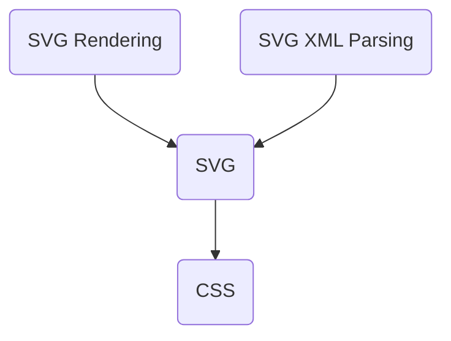

# Donner API {#DonnerAPI}

\tableofcontents

## Overview

Donner provides several standalone APIs for core functionality which can be used in any project.

- SVG Object Model (\ref donner::svg)
- CSS Parsing and Cascading (\ref donner::css)
- SVG Rendering (\ref donner::svg::RendererSkia)
- SVG XML Parsing (\ref donner::svg::parser::SVGParser)

Each library has minimal dependencies and can be used in external projects. For example, the CSS API may be used to add CSS support to your project using an adapter that satisfies the \ref donner::ElementLike concept.



## Principles

### Minimal memory allocations

- API invocations do not incur memory allocations unless required, and internally memory allocations are kept to a minimum. Supporting constructs such as \ref donner::RcString and \ref donner::SmallVector are used to reduce the number of allocations.

### Value types

- Implementation details about memory allocation are hidden, and the API is designed to be used with value types. For example, \ref donner::svg::SVGElement is can be copied and passed by value.

### Error handling

- Donner does not use C++ exceptions.

- `std::optional` and \ref donner::ParseResult are used to return values from functions. This allows the caller to check for errors and handle them as needed. `ParseResult` behaves similarly to `std::expected` (new in C++23), and may be replaced with it in the future.

- Callers can `if` init-statements to check for success:

  ```cpp
  if (ParseResult<int> maybeInt = NumberParser::parse("123"); maybeInt.hasResult()) {
    int intValue = maybeInt.result();
  }
  ```

### C++20 design patterns

- Donner uses C++20 features such as concepts when possible to improve usability and readability.

- For example, the \ref donner::ElementLike concept is used to make the CSS library usable without depending on the SVG library, or within a test context with \ref donner::FakeElement.

  ```cpp
  template <typename T>
  concept ElementLike = requires(const T t, const T otherT, const XMLQualifiedNameRef attribName) {
    { t.operator==(otherT) } -> std::same_as<bool>;
    { t.parentElement() } -> std::same_as<std::optional<T>>;
    // ...
  };
  ```

- Coroutine-based generators are used to implement tree traversal, see \ref ElementTraversalGenerators.h.

### String handling

- \ref donner::RcString is used to store strings. This is a reference counted string, which allows cheap copy and move operations. `RcString` implements the small-string optimization and does not allocate memory for strings shorter than 31 characters (on 64-bit platforms).

- Use `std::string_view` for APIs that only need to read the input string and not store it.

- For APIs that want to store the string, use \ref donner::RcStringOrRef which can hold either a `std::string_view` or a \ref donner::RcString, and is used to avoid unnecessary copies. This allows string literals to be used at the API surface while still allowing RcString references to be transferred.

## Limitations

- Donner is **NOT** thread-safe, the caller must ensure they are not accessing the same document from multiple threads.

## Details

### Namespace hierarchy

- \ref donner - top-level namespace
  - \ref donner::base::parser - common parsing utilities used by both CSS and SVG
  - \ref donner::css - CSS parsing and cascading logic
    - \ref donner::css::parser - the CSS parser
  - \ref donner::svg - SVG parsing and rendering
    - \ref donner::svg::parser - the SVG parser

### Parsing an SVG

To parse an SVG document, use the `SVGParser` class:

\snippet svg_tree_interaction.cc svg_parse

\ref donner::ParseResult contains either the document or an error, which can be checked with `hasError()` and `error()`:

\snippet svg_tree_interaction.cc error_handling

\ref donner::svg::parser::SVGParser::ParseSVG accepts a string containing SVG data.

\snippet svg_to_png.cc load_file

Store the resulting \ref donner::svg::SVGDocument to keep the document in-memory, and use it to inspect or modify the document.

For example, to get the \ref donner::svg::SVGPathElement for a \ref xml_path element:

\snippet svg_tree_interaction.cc get_path

### Using the DOM

\ref donner::svg::SVGElement implements a DOM-like API for querying and modifying the SVG document.

The document tree is traversable with `firstChild()`, `lastChild()`, `nextSibling()`, and `previousSibling()`. The element's tag name can be retrieved with `tagName()`.

Example iterating over children:

```cpp
for (std::optional<SVGElement> child = element.firstChild(); child;
      child = child->nextSibling()) {
  std::cout << "Child tag name: " << child->tagName() << "\n";
}
```

Every SVG element has its own DOM type:

- Use \ref donner::svg::SVGElement::isa<Derived>() to check if the element is of a specific type.
- Use \ref donner::svg::SVGElement::cast<Derived>() to cast to a derived type. This will assert if the element is not of the correct type.

```cpp
SVGElement element = ...;
if (element.isa<SVGCircleElement>()) {
  SVGCircleElement circle = element.cast<SVGCircleElement>();
  // Use circle
}
```

#### Full list of DOM types

| DOM Type                                   | XML Tag Name            |
| ------------------------------------------ | ----------------------- |
| \ref donner::svg::SVGCircleElement         | \ref xml_circle         |
| \ref donner::svg::SVGClipPathElement       | \ref xml_clipPath       |
| \ref donner::svg::SVGDefsElement           | \ref xml_defs           |
| \ref donner::svg::SVGElement               | (none, base class)      |
| \ref donner::svg::SVGEllipseElement        | \ref xml_ellipse        |
| \ref donner::svg::SVGFEGaussianBlurElement | \ref xml_feGaussianBlur |
| \ref donner::svg::SVGFilterElement         | \ref xml_filter         |
| \ref donner::svg::SVGGElement              | \ref xml_g              |
| \ref donner::svg::SVGGeometryElement       | (none, base class)      |
| \ref donner::svg::SVGGradientElement       | (none, base class)      |
| \ref donner::svg::SVGGraphicsElement       | (none, base class)      |
| \ref donner::svg::SVGLinearGradientElement | \ref xml_linearGradient |
| \ref donner::svg::SVGLineElement           | \ref xml_line           |
| \ref donner::svg::SVGMaskElement           | \ref xml_mask           |
| \ref donner::svg::SVGPathElement           | \ref xml_path           |
| \ref donner::svg::SVGPatternElement        | \ref xml_pattern        |
| \ref donner::svg::SVGPolygonElement        | \ref xml_polygon        |
| \ref donner::svg::SVGPolylineElement       | \ref xml_polyline       |
| \ref donner::svg::SVGRadialGradientElement | \ref xml_radialGradient |
| \ref donner::svg::SVGRectElement           | \ref xml_rect           |
| \ref donner::svg::SVGStopElement           | \ref xml_stop           |
| \ref donner::svg::SVGStyleElement          | \ref xml_style          |
| \ref donner::svg::SVGSVGElement            | \ref xml_svg            |
| \ref donner::svg::SVGUnknownElement        | _any unknown tag_       |
| \ref donner::svg::SVGUseElement            | \ref xml_use            |

#### Manipulating the tree

To add a child to an element, use one of these methods:

- \ref donner::svg::SVGElement::insertBefore "SVGElement::insertBefore(SVGElement child, SVGElement before)"
- \ref donner::svg::SVGElement::appendChild "SVGElement::appendChild(SVGElement child)"
- \ref donner::svg::SVGElement::replaceChild "SVGElement::replaceChild(SVGElement newChild, SVGElement oldChild)"

To remove an element from the tree:

- \ref donner::svg::SVGElement::remove() "SVGElement::remove()"
- \ref donner::svg::SVGElement::removeChild "SVGElement::removeChild(SVGElement child)"

NOTE: The `remove()` method will remove the element from the tree, but the underlying data storage is not currently cleaned up.

To create an element, use the element-specific `Create` method:

\snippet svg_tree_interaction.cc add_circle

### Rendering

To render an SVG document, use the \ref donner::svg::RendererSkia class.

\snippet svg_to_png.cc render

`RendererSkia` is prototype-level, and has limited documentation and may be subject to change.

The output size is determined by \ref donner::svg::SVGDocument, which can either be detected from the file itself or overridden with SVGDocument APIs:

- \ref donner::svg::SVGDocument::setCanvasSize(int width, int height)
- \ref donner::svg::SVGDocument::useAutomaticCanvasSize()

### Using the CSS API

The CSS API is used internally within the SVG library, but can be used standalone.

To parse CSS stylesheets, style strings, or selectors, use the \ref donner::css::CSS wrapper API.

#### Parsing a stylesheet

- \ref donner::css::CSS::ParseStylesheet can parse a `.css` file into a \ref donner::css::Stylesheet "Stylesheet", which contains a list of \ref donner::css::SelectorRule "SelectorRule".

  \snippet custom_css_parser.cc parse_stylesheet

- `style="..."` attributes can be parsed with \ref donner::css::CSS::ParseStyleAttribute.

#### Matching selectors

- To use Selectors, implement the \ref donner::ElementLike concept for your own element type. This allows the CSS library to traverse your document tree.

- Selectors are available within a parsed stylesheet, or can be parsed from a string using \ref donner::css::CSS::ParseSelector(std::string_view).

  \snippet custom_css_parser.cc parse_selector

- Use \ref donner::css::Selector::matches "Selector::matches(const ElementLike& target)" to see if a selector matches against a specific element. This can be repeatedly applied to all elements of a document to find all matches.

  \snippet custom_css_parser.cc match_rules

<div class="section_buttons">

| Previous                               |                                           Next |
| :------------------------------------- | ---------------------------------------------: |
| [Getting started](GettingStarted.html) | [System architecture](SystemArchitecture.html) |

</div>
