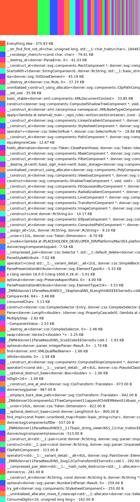

# Donner build report

Generated with: tools/generate_build_report.py --all --save docs/build_report.md

Git revision: [48cd8bba4bf27ad700a797adc5254a1fe94e9966](https://github.com/jwmcglynn/donner/commit/48cd8bba4bf27ad700a797adc5254a1fe94e9966)

## Lines of code
```
$ tools/cloc.sh
Lines of source code:       28.7k
Lines of comments:          10.6k
Comment percentage:         37.0%
Product lines of code:      17.2k
Test lines of code:          9.8k
```

## Binary size
Generated by `tools/binary_size.sh`
```
Total binary size of xml_tool
1.2M	build-binary-size/xml_tool

Total binary size of renderer_tool
3.7M	build-binary-size/renderer_tool
```

### Detailed analysis of `xml_tool`


Saved report to build-binary-size/binary_size_report.html

`bloaty -d compileunits -n 20` output
```
    FILE SIZE        VM SIZE    
 --------------  -------------- 
  70.0%   827Ki  69.9%   827Ki    donner
    21.4%   177Ki  21.4%   177Ki    [58 Others]
    19.5%   161Ki  19.5%   161Ki    donner/svg/properties/PropertyRegistry.cc
     9.3%  77.3Ki   9.3%  77.3Ki    donner/svg/SVGElement.cc
     6.0%  49.3Ki   6.0%  49.3Ki    donner/css/parser/ColorParser.cc
     5.6%  46.5Ki   5.6%  46.5Ki    donner/svg/SVGCircleElement.cc
     5.3%  43.8Ki   5.3%  43.8Ki    donner/svg/xml/XMLParser.cc
     4.7%  38.7Ki   4.7%  38.7Ki    donner/svg/SVGPatternElement.cc
     4.2%  34.5Ki   4.2%  34.5Ki    donner/css/parser/SelectorParser.cc
     3.1%  25.6Ki   3.1%  25.6Ki    donner/svg/SVGGradientElement.cc
     3.1%  25.2Ki   3.1%  25.2Ki    donner/svg/xml/AttributeParser.cc
     2.4%  19.8Ki   2.4%  19.8Ki    donner/css/parser/details/Tokenizer.cc
     2.3%  19.4Ki   2.3%  19.4Ki    donner/svg/SVGStopElement.cc
     1.8%  14.7Ki   1.8%  14.7Ki    donner/svg/SVGDocument.cc
     1.6%  13.0Ki   1.6%  13.0Ki    donner/svg/SVGStyleElement.cc
     1.5%  12.7Ki   1.5%  12.7Ki    donner/css/parser/DeclarationListParser.cc
     1.5%  12.4Ki   1.5%  12.4Ki    donner/svg/SVGUseElement.cc
     1.5%  12.2Ki   1.5%  12.2Ki    donner/svg/SVGFilterPrimitiveStandardAttributes.cc
     1.4%  11.2Ki   1.4%  11.2Ki    donner/svg/SVGPolygonElement.cc
     1.3%  11.2Ki   1.3%  11.2Ki    donner/svg/SVGRadialGradientElement.cc
     1.3%  10.8Ki   1.3%  10.8Ki    donner/svg/SVGFilterElement.cc
     1.3%  10.8Ki   1.3%  10.8Ki    donner/svg/SVGRectElement.cc
  20.8%   246Ki  20.9%   247Ki    [__LINKEDIT]
   2.2%  25.7Ki   2.2%  25.7Ki    [__DATA_CONST,__const]
   1.5%  17.4Ki   1.5%  17.5Ki    [__TEXT]
   1.3%  15.0Ki   1.3%  15.0Ki    [__TEXT,__const]
   1.2%  14.3Ki   1.2%  14.3Ki    [__DATA]
   0.9%  11.1Ki   0.9%  11.1Ki    [__TEXT,__cstring]
   0.8%  9.58Ki   0.8%  9.58Ki    third_party/abseil
    36.3%  3.48Ki  36.3%  3.48Ki    external/abseil-cpp~/absl/strings/internal/charconv_bigint.cc
    32.7%  3.13Ki  32.7%  3.13Ki    external/abseil-cpp~/absl/strings/charconv.cc
    29.4%  2.82Ki  29.4%  2.82Ki    external/abseil-cpp~/absl/strings/internal/charconv_parse.cc
     1.7%     162   1.7%     162    external/abseil-cpp~/absl/strings/internal/memutil.cc
   0.5%  5.62Ki   0.5%  5.62Ki    [__DATA_CONST]
   0.3%  3.01Ki   0.3%  3.01Ki    [__TEXT,__text]
   0.1%  1.77Ki   0.1%  1.67Ki    [Mach-O Headers]
   0.1%  1.68Ki   0.1%  1.68Ki    [__DATA,__data]
   0.1%  1.46Ki   0.1%  1.46Ki    [__TEXT,__gcc_except_tab]
   0.1%     852   0.1%     852    [__TEXT,__stubs]
   0.1%     688   0.1%     688    [__DATA_CONST,__got]
   0.0%     552   0.0%     552    [__TEXT,__unwind_info]
   0.0%     220   0.0%     220    [__TEXT,__init_offsets]
 100.0%  1.16Mi 100.0%  1.16Mi    TOTAL
```



## Code coverage
```
$ tools/coverage.sh --quiet
Analyzing coverage for: //donner/...
Overall coverage rate:
  lines......: 91.8% (20117 of 21916 lines)
  functions......: 88.3% (3587 of 4060 functions)
  branches......: 66.1% (4775 of 7224 branches)
Coverage report saved to coverage-report/index.html
```

## Public targets
```
$ bazel query "kind(library, set(//donner/... //:*)) intersect attr(visibility, public, //...)"
//:donner
//donner/css:css
//donner/svg:svg
//donner/svg/renderer:renderer
//donner/svg/xml:xml
```

## External dependencies

- stb
- frozen
- com_google_absl
- entt
- skia
- rapidxml_ns


