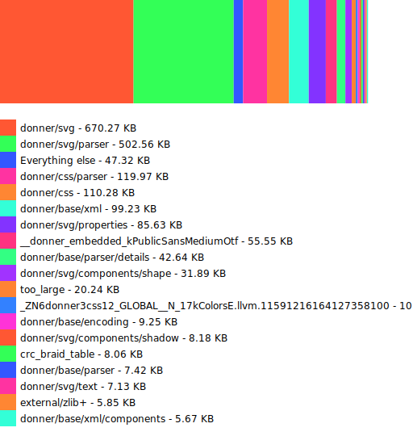

# Donner Build Report

Generated with: tools/generate_build_report.py --all --save docs/build_report.md

## Summary

- Platform: Linux aarch64
- Git revision: [ba7f6fc408957bd3789d25e831612595f45fbc7e](https://github.com/jwmcglynn/donner/commit/ba7f6fc408957bd3789d25e831612595f45fbc7e)
- Working tree: clean
- Lines of Code: success (3.5s)
- Binary Size: success (132.3s)
- Code Coverage: success (577.6s)
- Tests: success (194.1s)
- Public Targets: success (1.0s)
- External Dependencies: success (6.3s)

## Lines of Code
```
$ tools/cloc.sh
Lines of source code:      111.6k
Lines of comments:          35.3k
Comment percentage:         31.0%
Product lines of code:      63.3k
Test lines of code:         43.9k
```

## Binary Size
Generated with: `tools/binary_size.sh`

Full report: [binary_size_report.html](reports/binary-size/binary_size_report.html)

```
Total binary size of svg_parser_tool
2.1M	build-binary-size/svg_parser_tool

Total binary size of donner-svg
3.5M	build-binary-size/donner-svg
```

### Detailed analysis of `svg_parser_tool`


Saved report to build-binary-size/binary_size_report.html

`bloaty -d compileunits -n 20` output
```
    FILE SIZE        VM SIZE    
 --------------  -------------- 
  83.3%  1.69Mi  82.0%   943Ki    donner
    25.7%   442Ki  27.2%   256Ki    [99 Others]
    19.8%   341Ki  20.3%   191Ki    donner/svg/parser/SVGParser.cc
     6.2%   107Ki   3.8%  35.7Ki    donner/css/CSS.cc
     5.8%   100Ki   5.5%  52.1Ki    donner/svg/SVGDocument.cc
     5.6%  96.4Ki   8.0%  75.4Ki    donner/svg/parser/svg_parser_tool.cc
     4.6%  79.0Ki   6.3%  59.2Ki    donner/svg/properties/PropertyParsing.cc
     3.8%  65.2Ki   3.1%  29.4Ki    donner/css/parser/DeclarationListParser.cc
     3.2%  56.0Ki   1.3%  12.7Ki    donner/svg/SVGFETurbulenceElement.cc
     3.0%  52.5Ki   4.3%  41.0Ki    donner/base/xml/XMLEscape.cc
     2.5%  42.6Ki   3.1%  29.3Ki    donner/base/parser/details/ParserBase.cc
     2.4%  42.2Ki   2.3%  21.5Ki    donner/svg/SVGDefsElement.cc
     2.4%  41.7Ki   1.3%  12.0Ki    donner/svg/SVGRectElement.cc
     2.3%  39.9Ki   2.1%  20.3Ki    donner/base/xml/XMLDocument.cc
     2.2%  37.9Ki   1.9%  18.3Ki    donner/svg/parser/AttributeParser.cc
     2.0%  34.4Ki   1.9%  18.0Ki    donner/svg/SVGTSpanElement.cc
     1.7%  28.6Ki   1.5%  14.1Ki    donner/svg/SVGGeometryElement.cc
     1.5%  25.6Ki   1.3%  12.0Ki    donner/svg/SVGGraphicsElement.cc
     1.4%  23.9Ki   1.2%  11.6Ki    donner/svg/SVGLinearGradientElement.cc
     1.4%  23.7Ki   1.2%  11.4Ki    donner/svg/SVGSVGElement.cc
     1.3%  22.9Ki   1.2%  11.3Ki    donner/svg/components/shape/ShapeSystem.cc
     1.2%  20.3Ki   1.0%  9.70Ki    donner/svg/SVGPathElement.cc
   9.2%   190Ki   7.4%  84.7Ki    [860 Others]
   2.7%  55.5Ki   4.8%  55.5Ki    __donner_embedded_kPublicSansMediumOtf
   1.0%  20.9Ki   1.8%  20.9Ki    [section .rodata]
   1.0%  20.2Ki   0.4%  4.28Ki    too_large
   0.5%  10.0Ki   0.9%  9.91Ki    _ZN6donner3css12_GLOBAL__N_17kColorsE.llvm.11591216164127358100
   0.5%  9.42Ki   0.0%       0    [section .symtab]
   0.4%  8.06Ki   0.7%  8.00Ki    crc_braid_table
   0.3%  5.85Ki   0.4%  5.05Ki    third_party/zlib
    25.5%  1.49Ki  20.6%  1.04Ki    external/zlib+/zutil.c
    21.2%  1.24Ki  23.3%  1.18Ki    external/zlib+/adler32.c
    19.2%  1.12Ki  20.9%  1.05Ki    external/zlib+/inffast.c
    16.0%     960  17.5%     904    external/zlib+/inflate.c
    15.0%     898  16.2%     840    external/zlib+/crc32.c
     3.1%     187   1.5%      76    external/zlib+/inftrees.c
   0.2%  3.52Ki   0.3%  3.41Ki    _ZN6donner3svg12_GLOBAL__N_128kValidPresentationAttributesE
   0.2%  3.46Ki   0.3%  3.37Ki    _ZN6donner3svg12_GLOBAL__N_111kPropertiesE
   0.1%  2.73Ki   0.2%  2.73Ki    [section .dynstr]
   0.1%  2.54Ki   0.0%       0    [section .strtab]
   0.1%  2.30Ki   0.2%  2.30Ki    [section .dynsym]
   0.1%  2.08Ki   0.2%  2.00Ki    lenfix.llvm.6948300587551570009
   0.1%  2.04Ki   0.2%  2.04Ki    [section .rela.plt]
   0.1%  2.00Ki   0.0%       0    [ELF Section Headers]
   0.1%  1.50Ki   0.1%     864    _ZNSt8__detail9__variant12__gen_vtableINS0_20__variant_idx_cookieEOZNS0_15_Move_ctor_baseILb0EJN6donner3css5Token5IdentENS6_8FunctionENS6_9AtKeywordENS6_4HashENS6_6StringENS6_9BadStringENS6_3UrlENS6_6BadUrlENS6_5DelimENS6_6NumberENS6_10PercentageENS6_9DimensionENS6_10WhitespaceENS6_3CDOENS6_3CDCENS6_5ColonENS6_9SemicolonENS6_5CommaENS6_13SquareBracketENS6_11ParenthesisENS6_12CurlyBracketENS6_18CloseSquareBracketENS6_16CloseParenthesisENS6_17CloseCurlyBracketENS6_10ErrorTokenENS6_8EofTokenEEEC1EOSX_EUlOT_T0_E_JOSt7variantIJS7_S8_S9_SA_SB_SC_SD_SE_SF_SG_SH_SI_SJ_SK_SL_SM_SN_SO_SP_SQ_SR_SS_ST_SU_SV_SW_EEEE9_S_vtableE
   0.1%  1.50Ki   0.1%     864    _ZNSt8__detail9__variant12__gen_vtableINS0_20__variant_idx_cookieEOZNS0_17_Copy_assign_baseILb0EJN6donner3css5Token5IdentENS6_8FunctionENS6_9AtKeywordENS6_4HashENS6_6StringENS6_9BadStringENS6_3UrlENS6_6BadUrlENS6_5DelimENS6_6NumberENS6_10PercentageENS6_9DimensionENS6_10WhitespaceENS6_3CDOENS6_3CDCENS6_5ColonENS6_9SemicolonENS6_5CommaENS6_13SquareBracketENS6_11ParenthesisENS6_12CurlyBracketENS6_18CloseSquareBracketENS6_16CloseParenthesisENS6_17CloseCurlyBracketENS6_10ErrorTokenENS6_8EofTokenEEEaSERKSX_EUlOT_T0_E_JRKSt7variantIJS7_S8_S9_SA_SB_SC_SD_SE_SF_SG_SH_SI_SJ_SK_SL_SM_SN_SO_SP_SQ_SR_SS_ST_SU_SV_SW_EEEE9_S_vtableE
   0.1%  1.50Ki   0.1%     864    _ZNSt8__detail9__variant12__gen_vtableINS0_20__variant_idx_cookieEOZNS0_15_Copy_ctor_baseILb0EJN6donner3css5Token5IdentENS6_8FunctionENS6_9AtKeywordENS6_4HashENS6_6StringENS6_9BadStringENS6_3UrlENS6_6BadUrlENS6_5DelimENS6_6NumberENS6_10PercentageENS6_9DimensionENS6_10WhitespaceENS6_3CDOENS6_3CDCENS6_5ColonENS6_9SemicolonENS6_5CommaENS6_13SquareBracketENS6_11ParenthesisENS6_12CurlyBracketENS6_18CloseSquareBracketENS6_16CloseParenthesisENS6_17CloseCurlyBracketENS6_10ErrorTokenENS6_8EofTokenEEEC1ERKSX_EUlOT_T0_E_JRKSt7variantIJS7_S8_S9_SA_SB_SC_SD_SE_SF_SG_SH_SI_SJ_SK_SL_SM_SN_SO_SP_SQ_SR_SS_ST_SU_SV_SW_EEEE9_S_vtableE
   0.1%  1.50Ki   0.1%     864    _ZNSt8__detail9__variant12__gen_vtableINS0_20__variant_idx_cookieEOZNS0_17_Move_assign_baseILb0EJN6donner3css5Token5IdentENS6_8FunctionENS6_9AtKeywordENS6_4HashENS6_6StringENS6_9BadStringENS6_3UrlENS6_6BadUrlENS6_5DelimENS6_6NumberENS6_10PercentageENS6_9DimensionENS6_10WhitespaceENS6_3CDOENS6_3CDCENS6_5ColonENS6_9SemicolonENS6_5CommaENS6_13SquareBracketENS6_11ParenthesisENS6_12CurlyBracketENS6_18CloseSquareBracketENS6_16CloseParenthesisENS6_17CloseCurlyBracketENS6_10ErrorTokenENS6_8EofTokenEEEaSEOSX_EUlOT_T0_E_JRSt7variantIJS7_S8_S9_SA_SB_SC_SD_SE_SF_SG_SH_SI_SJ_SK_SL_SM_SN_SO_SP_SQ_SR_SS_ST_SU_SV_SW_EEEE9_S_vtableE
 100.0%  2.02Mi 100.0%  1.12Mi    TOTAL
```



## Code Coverage
Full report: [coverage-report/index.html](https://jwmcglynn.github.io/donner/reports/coverage/index.html)

```
$ tools/coverage.sh --quiet
Analyzing coverage for: //donner/...
Overall coverage rate:
  lines......: 80.6% (27684 of 34347 lines)
  functions......: 87.7% (5902 of 6733 functions)
  branches......: 70.0% (10756 of 15374 branches)
Coverage report saved to coverage-report/index.html
```

## Tests
```
$ bazel test //donner/...
//donner/base/fonts:woff2_parser_tests                                  SKIPPED
//donner/benchmarks:filter_perf_compare                                 SKIPPED
//donner/benchmarks:render_perf_compare                                 SKIPPED
//donner/svg/renderer/geode:geo_encoder_tests                           SKIPPED
//donner/svg/renderer/geode:geode_device_tests                          SKIPPED
//donner/svg/renderer/geode:geode_shaders_tests                         SKIPPED
//donner/svg/renderer/tests:renderer_ascii_tests                        SKIPPED
//donner/svg/renderer/tests:renderer_geode_golden_tests                 SKIPPED
//donner/svg/renderer/tests:renderer_geode_tests                        SKIPPED
//donner/svg/renderer/tests:text_backend_tests                          SKIPPED
//donner/svg/renderer/tests:text_engine_tests                           SKIPPED
//donner/base:base_lint                                                  PASSED in 0.2s
//donner/base:base_test_utils_lint                                       PASSED in 0.2s
//donner/base:base_tests_lint                                            PASSED in 0.3s
//donner/base:base_tests_ndebug                                          PASSED in 1.2s
//donner/base:base_tests_ndebug_lint                                     PASSED in 0.3s
//donner/base:base_utils_h_ndebug_lint                                   PASSED in 0.2s
//donner/base:bezier_utils_fuzzer                                        PASSED in 0.1s
//donner/base:bezier_utils_fuzzer_10_seconds                             PASSED in 11.1s
//donner/base:bezier_utils_fuzzer_10_seconds_lint                        PASSED in 0.2s
//donner/base:bezier_utils_fuzzer_lint                                   PASSED in 0.2s
//donner/base:diagnostic_renderer_lint                                   PASSED in 0.2s
//donner/base:failure_signal_handler_lint                                PASSED in 0.2s
//donner/base:path_fuzzer                                                PASSED in 0.1s
//donner/base:path_fuzzer_10_seconds                                     PASSED in 11.1s
//donner/base:path_fuzzer_10_seconds_lint                                PASSED in 0.2s
//donner/base:path_fuzzer_lint                                           PASSED in 0.2s
//donner/base:rcstring_tests_with_exceptions                             PASSED in 0.1s
//donner/base:rcstring_tests_with_exceptions_lint                        PASSED in 0.2s
//donner/base/element:element_lint                                       PASSED in 0.2s
//donner/base/element:element_tests                                      PASSED in 0.1s
//donner/base/element:element_tests_lint                                 PASSED in 0.3s
//donner/base/element:fake_element_lint                                  PASSED in 0.3s
//donner/base/encoding:base64_lint                                       PASSED in 0.2s
//donner/base/encoding:base64_tests                                      PASSED in 0.1s
//donner/base/encoding:base64_tests_lint                                 PASSED in 0.2s
//donner/base/encoding:decompress_fuzzer                                 PASSED in 0.1s
//donner/base/encoding:decompress_fuzzer_10_seconds                      PASSED in 11.1s
//donner/base/encoding:decompress_fuzzer_10_seconds_lint                 PASSED in 0.2s
//donner/base/encoding:decompress_fuzzer_lint                            PASSED in 0.2s
//donner/base/encoding:decompress_lint                                   PASSED in 0.2s
//donner/base/encoding:decompress_tests                                  PASSED in 0.1s
//donner/base/encoding:decompress_tests_lint                             PASSED in 0.2s
//donner/base/encoding:url_decode_lint                                   PASSED in 0.2s
//donner/base/encoding:url_decode_tests                                  PASSED in 0.1s
//donner/base/encoding:url_decode_tests_lint                             PASSED in 0.2s
//donner/base/fonts:fonts_lint                                           PASSED in 0.3s
//donner/base/fonts:fonts_tests                                          PASSED in 0.1s
//donner/base/fonts:fonts_tests_lint                                     PASSED in 0.2s
//donner/base/fonts:woff2_parser_lint                                    PASSED in 0.3s
//donner/base/fonts:woff2_parser_tests_lint                              PASSED in 0.2s
//donner/base/fonts:woff_parser_fuzzer                                   PASSED in 0.1s
//donner/base/fonts:woff_parser_fuzzer_10_seconds                        PASSED in 11.1s
//donner/base/fonts:woff_parser_fuzzer_10_seconds_lint                   PASSED in 0.2s
//donner/base/fonts:woff_parser_fuzzer_lint                              PASSED in 0.2s
//donner/base/parser:line_offsets_lint                                   PASSED in 0.2s
//donner/base/parser:number_parser_fuzzer                                PASSED in 0.1s
//donner/base/parser:number_parser_fuzzer_10_seconds                     PASSED in 11.1s
//donner/base/parser:number_parser_fuzzer_10_seconds_lint                PASSED in 0.2s
//donner/base/parser:number_parser_fuzzer_lint                           PASSED in 0.2s
//donner/base/parser:parser_lint                                         PASSED in 0.2s
//donner/base/parser:parser_tests_lint                                   PASSED in 0.3s
//donner/base/xml:xml_lint                                               PASSED in 0.2s
//donner/base/xml:xml_parser_fuzzer                                      PASSED in 0.1s
//donner/base/xml:xml_parser_fuzzer_10_seconds                           PASSED in 11.1s
//donner/base/xml:xml_parser_fuzzer_10_seconds_lint                      PASSED in 0.2s
//donner/base/xml:xml_parser_fuzzer_lint                                 PASSED in 0.2s
//donner/base/xml:xml_parser_structured_fuzzer                           PASSED in 0.1s
//donner/base/xml:xml_parser_structured_fuzzer_10_seconds                PASSED in 11.1s
//donner/base/xml:xml_parser_structured_fuzzer_10_seconds_lint           PASSED in 0.2s
//donner/base/xml:xml_parser_structured_fuzzer_lint                      PASSED in 0.2s
//donner/base/xml:xml_qualified_name_lint                                PASSED in 0.2s
//donner/base/xml:xml_tests                                              PASSED in 0.1s
//donner/base/xml:xml_tests_lint                                         PASSED in 0.2s
//donner/base/xml/components:components_lint                             PASSED in 0.3s
//donner/base/xml/components:components_tests                            PASSED in 4.1s
//donner/base/xml/components:components_tests_lint                       PASSED in 0.2s
//donner/benchmarks:css_parse_perf_bench_lint                            PASSED in 0.2s
//donner/benchmarks:skia_filter_perf_bench_lint                          PASSED in 0.2s
//donner/benchmarks:skia_render_perf_bench_lint                          PASSED in 0.2s
//donner/benchmarks:structured_editing_perf_bench_lint                   PASSED in 0.2s
//donner/benchmarks:tinyskia_render_perf_bench_lint                      PASSED in 0.2s
//donner/css:core_lint                                                   PASSED in 0.3s
//donner/css:css_lint                                                    PASSED in 0.2s
//donner/css:css_tests_lint                                              PASSED in 0.3s
//donner/css:selector_test_utils_lint                                    PASSED in 0.2s
//donner/css/parser:anb_microsyntax_parser_fuzzer                        PASSED in 0.1s
//donner/css/parser:anb_microsyntax_parser_fuzzer_10_seconds             PASSED in 11.1s
//donner/css/parser:anb_microsyntax_parser_fuzzer_10_seconds_lint        PASSED in 0.2s
//donner/css/parser:anb_microsyntax_parser_fuzzer_lint                   PASSED in 0.2s
//donner/css/parser:color_parser_fuzzer                                  PASSED in 0.1s
//donner/css/parser:color_parser_fuzzer_10_seconds                       PASSED in 11.1s
//donner/css/parser:color_parser_fuzzer_10_seconds_lint                  PASSED in 0.2s
//donner/css/parser:color_parser_fuzzer_lint                             PASSED in 0.2s
//donner/css/parser:css_parsing_tests                                    PASSED in 0.1s
//donner/css/parser:css_parsing_tests_lint                               PASSED in 0.2s
//donner/css/parser:declaration_list_parser_fuzzer                       PASSED in 0.2s
//donner/css/parser:declaration_list_parser_fuzzer_10_seconds            PASSED in 11.1s
//donner/css/parser:declaration_list_parser_fuzzer_10_seconds_lint       PASSED in 0.2s
//donner/css/parser:declaration_list_parser_fuzzer_lint                  PASSED in 0.3s
//donner/css/parser:parser_lint                                          PASSED in 0.2s
//donner/css/parser:parser_tests                                         PASSED in 0.1s
//donner/css/parser:parser_tests_lint                                    PASSED in 0.2s
//donner/css/parser:selector_parser_fuzzer                               PASSED in 0.1s
//donner/css/parser:selector_parser_fuzzer_10_seconds                    PASSED in 11.1s
//donner/css/parser:selector_parser_fuzzer_10_seconds_lint               PASSED in 0.2s
//donner/css/parser:selector_parser_fuzzer_lint                          PASSED in 0.2s
//donner/css/parser:stylesheet_parser_fuzzer                             PASSED in 0.1s
//donner/css/parser:stylesheet_parser_fuzzer_10_seconds                  PASSED in 11.1s
//donner/css/parser:stylesheet_parser_fuzzer_10_seconds_lint             PASSED in 0.2s
//donner/css/parser:stylesheet_parser_fuzzer_lint                        PASSED in 0.2s
//donner/editor:async_renderer_lint                                      PASSED in 0.2s
//donner/editor:async_svg_document_lint                                  PASSED in 0.2s
//donner/editor:attribute_writeback_lint                                 PASSED in 0.2s
//donner/editor:change_classifier_lint                                   PASSED in 0.2s
//donner/editor:clipboard_interface_lint                                 PASSED in 0.3s
//donner/editor:command_queue_lint                                       PASSED in 0.2s
//donner/editor:editor_app_lint                                          PASSED in 0.2s
//donner/editor:editor_lint                                              PASSED in 0.2s
//donner/editor:imgui_clipboard_lint                                     PASSED in 0.2s
//donner/editor:overlay_renderer_lint                                    PASSED in 0.2s
//donner/editor:render_pane_gesture_lint                                 PASSED in 0.2s
//donner/editor:select_tool_lint                                         PASSED in 0.2s
//donner/editor:selection_aabb_lint                                      PASSED in 0.2s
//donner/editor:source_sync_lint                                         PASSED in 0.2s
//donner/editor:text_buffer_lint                                         PASSED in 0.2s
//donner/editor:text_editor_core_lint                                    PASSED in 0.2s
//donner/editor:text_editor_lint                                         PASSED in 0.2s
//donner/editor:text_patch_lint                                          PASSED in 0.2s
//donner/editor:tool_lint                                                PASSED in 0.2s
//donner/editor:tracy_wrapper_lint                                       PASSED in 0.3s
//donner/editor:undo_timeline_lint                                       PASSED in 0.2s
//donner/editor:viewport_geometry_lint                                   PASSED in 0.2s
//donner/editor:viewport_state_lint                                      PASSED in 0.2s
//donner/editor/app:donner_editor_lint                                   PASSED in 0.2s
//donner/editor/app:editor_app_lint                                      PASSED in 0.2s
//donner/editor/app:editor_repl_lint                                     PASSED in 0.2s
//donner/editor/app/tests:editor_app_tests                               PASSED in 0.7s
//donner/editor/app/tests:editor_app_tests_lint                          PASSED in 0.2s
//donner/editor/sandbox:donner_parser_child_lint                         PASSED in 0.3s
//donner/editor/sandbox:frame_inspector_lint                             PASSED in 0.2s
//donner/editor/sandbox:pipelined_renderer_lint                          PASSED in 0.2s
//donner/editor/sandbox:replaying_renderer_lint                          PASSED in 0.2s
//donner/editor/sandbox:rnr_file_lint                                    PASSED in 0.2s
//donner/editor/sandbox:sandbox_codecs_lint                              PASSED in 0.2s
//donner/editor/sandbox:sandbox_diff_lib_lint                            PASSED in 0.2s
//donner/editor/sandbox:sandbox_diff_lint                                PASSED in 0.2s
//donner/editor/sandbox:sandbox_hardening_lint                           PASSED in 0.3s
//donner/editor/sandbox:sandbox_host_lint                                PASSED in 0.2s
//donner/editor/sandbox:sandbox_inspect_lint                             PASSED in 0.2s
//donner/editor/sandbox:sandbox_protocol_lint                            PASSED in 0.3s
//donner/editor/sandbox:sandbox_render_lint                              PASSED in 0.2s
//donner/editor/sandbox:sandbox_replay_lint                              PASSED in 0.2s
//donner/editor/sandbox:serializing_renderer_lint                        PASSED in 0.3s
//donner/editor/sandbox:svg_source_lint                                  PASSED in 0.3s
//donner/editor/sandbox:wire_lint                                        PASSED in 0.3s
//donner/editor/sandbox/tests:pipelined_renderer_tests                   PASSED in 0.3s
//donner/editor/sandbox/tests:pipelined_renderer_tests_lint              PASSED in 0.2s
//donner/editor/sandbox/tests:record_replay_tests                        PASSED in 0.3s
//donner/editor/sandbox/tests:record_replay_tests_lint                   PASSED in 0.2s
//donner/editor/sandbox/tests:sandbox_diff_tests                         PASSED in 0.2s
//donner/editor/sandbox/tests:sandbox_diff_tests_lint                    PASSED in 0.2s
//donner/editor/sandbox/tests:sandbox_hardening_tests                    PASSED in 0.1s
//donner/editor/sandbox/tests:sandbox_hardening_tests_lint               PASSED in 0.2s
//donner/editor/sandbox/tests:sandbox_host_tests                         PASSED in 1.8s
//donner/editor/sandbox/tests:sandbox_host_tests_lint                    PASSED in 0.2s
//donner/editor/sandbox/tests:sandbox_pipeline_tests                     PASSED in 0.2s
//donner/editor/sandbox/tests:sandbox_pipeline_tests_lint                PASSED in 0.2s
//donner/editor/sandbox/tests:sandbox_wire_fuzzer                        PASSED in 0.1s
//donner/editor/sandbox/tests:sandbox_wire_fuzzer_10_seconds             PASSED in 11.1s
//donner/editor/sandbox/tests:sandbox_wire_fuzzer_10_seconds_lint        PASSED in 0.3s
//donner/editor/sandbox/tests:sandbox_wire_fuzzer_lint                   PASSED in 0.2s
//donner/editor/sandbox/tests:svg_source_tests                           PASSED in 0.2s
//donner/editor/sandbox/tests:svg_source_tests_lint                      PASSED in 0.2s
//donner/editor/sandbox/tests:wire_format_tests                          PASSED in 0.3s
//donner/editor/sandbox/tests:wire_format_tests_lint                     PASSED in 0.3s
//donner/editor/tests:async_svg_document_tests                           PASSED in 0.2s
//donner/editor/tests:async_svg_document_tests_lint                      PASSED in 0.2s
//donner/editor/tests:attribute_writeback_tests                          PASSED in 0.2s
//donner/editor/tests:attribute_writeback_tests_lint                     PASSED in 0.2s
//donner/editor/tests:change_classifier_tests                            PASSED in 0.2s
//donner/editor/tests:change_classifier_tests_lint                       PASSED in 0.2s
//donner/editor/tests:clipboard_interface_tests                          PASSED in 0.1s
//donner/editor/tests:clipboard_interface_tests_lint                     PASSED in 0.7s
//donner/editor/tests:command_queue_tests                                PASSED in 0.2s
//donner/editor/tests:command_queue_tests_lint                           PASSED in 0.2s
//donner/editor/tests:editor_app_tests                                   PASSED in 0.2s
//donner/editor/tests:editor_app_tests_lint                              PASSED in 0.3s
//donner/editor/tests:editor_sync_tests                                  PASSED in 0.3s
//donner/editor/tests:editor_sync_tests_lint                             PASSED in 0.2s
//donner/editor/tests:overlay_renderer_tests                             PASSED in 0.2s
//donner/editor/tests:overlay_renderer_tests_lint                        PASSED in 0.2s
//donner/editor/tests:render_pane_click_tests                            PASSED in 0.3s
//donner/editor/tests:render_pane_click_tests_lint                       PASSED in 0.2s
//donner/editor/tests:render_pane_gesture_tests                          PASSED in 0.1s
//donner/editor/tests:render_pane_gesture_tests_lint                     PASSED in 0.2s
//donner/editor/tests:render_pane_viewport_tests                         PASSED in 0.1s
//donner/editor/tests:render_pane_viewport_tests_lint                    PASSED in 0.2s
//donner/editor/tests:select_tool_tests                                  PASSED in 0.3s
//donner/editor/tests:select_tool_tests_lint                             PASSED in 0.2s
//donner/editor/tests:selection_aabb_tests                               PASSED in 0.2s
//donner/editor/tests:selection_aabb_tests_lint                          PASSED in 0.2s
//donner/editor/tests:text_buffer_tests                                  PASSED in 0.1s
//donner/editor/tests:text_buffer_tests_lint                             PASSED in 0.2s
//donner/editor/tests:text_editor_core_tests                             PASSED in 0.1s
//donner/editor/tests:text_editor_core_tests_lint                        PASSED in 0.2s
//donner/editor/tests:text_editor_tests                                  PASSED in 0.4s
//donner/editor/tests:text_editor_tests_lint                             PASSED in 0.2s
//donner/editor/tests:text_patch_tests                                   PASSED in 0.1s
//donner/editor/tests:text_patch_tests_lint                              PASSED in 0.2s
//donner/editor/tests:undo_timeline_tests                                PASSED in 0.2s
//donner/editor/tests:undo_timeline_tests_lint                           PASSED in 0.2s
//donner/editor/tests:viewport_geometry_tests                            PASSED in 0.1s
//donner/editor/tests:viewport_geometry_tests_lint                       PASSED in 0.2s
//donner/svg:element_type_lint                                           PASSED in 0.2s
//donner/svg:svg_core_lint                                               PASSED in 0.3s
//donner/svg:svg_document_handle_lint                                    PASSED in 0.2s
//donner/svg:svg_lint                                                    PASSED in 0.2s
//donner/svg/components:components_core_lint                             PASSED in 0.2s
//donner/svg/components:svg_document_context_lint                        PASSED in 0.2s
//donner/svg/components/filter:components_lint                           PASSED in 0.2s
//donner/svg/components/filter:filter_component_tests                    PASSED in 0.2s
//donner/svg/components/filter:filter_component_tests_lint               PASSED in 0.2s
//donner/svg/components/filter:filter_effect_lint                        PASSED in 0.2s
//donner/svg/components/filter:filter_system_lint                        PASSED in 0.2s
//donner/svg/components/filter:filter_system_tests                       PASSED in 0.3s
//donner/svg/components/filter:filter_system_tests_lint                  PASSED in 0.2s
//donner/svg/components/layout:components_lint                           PASSED in 0.2s
//donner/svg/components/layout:layout_system_lint                        PASSED in 0.2s
//donner/svg/components/layout:layout_system_tests                       PASSED in 0.4s
//donner/svg/components/layout:layout_system_tests_lint                  PASSED in 0.2s
//donner/svg/components/paint:components_lint                            PASSED in 0.2s
//donner/svg/components/paint:paint_component_tests                      PASSED in 0.2s
//donner/svg/components/paint:paint_component_tests_lint                 PASSED in 0.2s
//donner/svg/components/paint:paint_system_lint                          PASSED in 0.2s
//donner/svg/components/paint:paint_system_tests                         PASSED in 0.3s
//donner/svg/components/paint:paint_system_tests_lint                    PASSED in 0.2s
//donner/svg/components/resources:components_lint                        PASSED in 0.2s
//donner/svg/components/resources:font_resource_lint                     PASSED in 0.2s
//donner/svg/components/resources:resource_manager_context_lint          PASSED in 0.2s
//donner/svg/components/resources/tests:sub_document_cache_tests         PASSED in 0.2s
//donner/svg/components/resources/tests:sub_document_cache_tests_lint    PASSED in 0.2s
//donner/svg/components/shadow:components_lint                           PASSED in 0.2s
//donner/svg/components/shadow:shadow_tree_system_lint                   PASSED in 0.2s
//donner/svg/components/shadow:shadow_tree_system_tests                  PASSED in 0.2s
//donner/svg/components/shadow:shadow_tree_system_tests_lint             PASSED in 0.2s
//donner/svg/components/shape:circle_ellipse_component_tests             PASSED in 0.2s
//donner/svg/components/shape:circle_ellipse_component_tests_lint        PASSED in 0.2s
//donner/svg/components/shape:rect_component_tests                       PASSED in 0.2s
//donner/svg/components/shape:rect_component_tests_lint                  PASSED in 0.2s
//donner/svg/components/shape:shape_system_tests                         PASSED in 0.3s
//donner/svg/components/shape:shape_system_tests_lint                    PASSED in 0.2s
//donner/svg/components/style:style_system_tests                         PASSED in 0.2s
//donner/svg/components/style:style_system_tests_lint                    PASSED in 0.2s
//donner/svg/components/text:text_system_tests                           PASSED in 0.4s
//donner/svg/components/text:text_system_tests_lint                      PASSED in 0.2s
//donner/svg/core/tests:core_test_utils_lint                             PASSED in 0.2s
//donner/svg/core/tests:core_tests_lint                                  PASSED in 0.3s
//donner/svg/graph/tests:reference_tests                                 PASSED in 0.1s
//donner/svg/graph/tests:reference_tests_lint                            PASSED in 0.2s
//donner/svg/parser:attribute_parser_lint                                PASSED in 0.3s
//donner/svg/parser:list_parser_fuzzer                                   PASSED in 0.1s
//donner/svg/parser:list_parser_fuzzer_10_seconds                        PASSED in 11.1s
//donner/svg/parser:list_parser_fuzzer_10_seconds_lint                   PASSED in 0.2s
//donner/svg/parser:list_parser_fuzzer_lint                              PASSED in 0.2s
//donner/svg/parser:parser_core_lint                                     PASSED in 0.2s
//donner/svg/parser:parser_details_lint                                  PASSED in 0.2s
//donner/svg/parser:parser_header_lint                                   PASSED in 0.2s
//donner/svg/parser:parser_lint                                          PASSED in 0.2s
//donner/svg/parser:parser_tests                                         PASSED in 0.5s
//donner/svg/parser:parser_tests_lint                                    PASSED in 0.2s
//donner/svg/parser:path_parser_fuzzer                                   PASSED in 0.1s
//donner/svg/parser:path_parser_fuzzer_10_seconds                        PASSED in 11.1s
//donner/svg/parser:path_parser_fuzzer_10_seconds_lint                   PASSED in 0.2s
//donner/svg/parser:path_parser_fuzzer_lint                              PASSED in 0.3s
//donner/svg/parser:svg_parser_fuzzer                                    PASSED in 0.1s
//donner/svg/parser:svg_parser_fuzzer_10_seconds                         PASSED in 11.1s
//donner/svg/parser:svg_parser_fuzzer_10_seconds_lint                    PASSED in 0.2s
//donner/svg/parser:svg_parser_fuzzer_lint                               PASSED in 0.2s
//donner/svg/parser:svg_parser_structured_fuzzer                         PASSED in 0.1s
//donner/svg/parser:svg_parser_structured_fuzzer_10_seconds              PASSED in 11.1s
//donner/svg/parser:svg_parser_structured_fuzzer_10_seconds_lint         PASSED in 0.2s
//donner/svg/parser:svg_parser_structured_fuzzer_lint                    PASSED in 0.2s
//donner/svg/parser:svg_parser_tool_lint                                 PASSED in 0.2s
//donner/svg/parser:transform_parser_fuzzer                              PASSED in 0.1s
//donner/svg/parser:transform_parser_fuzzer_10_seconds                   PASSED in 11.1s
//donner/svg/parser:transform_parser_fuzzer_10_seconds_lint              PASSED in 0.2s
//donner/svg/parser:transform_parser_fuzzer_lint                         PASSED in 0.2s
//donner/svg/properties:properties_lint                                  PASSED in 0.2s
//donner/svg/properties:property_lint                                    PASSED in 0.2s
//donner/svg/properties:property_parsing_lint                            PASSED in 0.3s
//donner/svg/properties/tests:properties_tests                           PASSED in 0.2s
//donner/svg/properties/tests:properties_tests_lint                      PASSED in 0.2s
//donner/svg/properties/tests:property_parsing_tests                     PASSED in 0.2s
//donner/svg/properties/tests:property_parsing_tests_lint                PASSED in 0.2s
//donner/svg/renderer:renderer_geode_lint                                PASSED in 0.2s
//donner/svg/renderer:renderer_image_io_lint                             PASSED in 0.2s
//donner/svg/renderer:renderer_interface_lint                            PASSED in 0.2s
//donner/svg/renderer:renderer_skia_lint                                 PASSED in 0.3s
//donner/svg/renderer:renderer_utils_lint                                PASSED in 0.2s
//donner/svg/renderer:resolved_gradient_lint                             PASSED in 0.3s
//donner/svg/renderer:stroke_params_lint                                 PASSED in 0.2s
//donner/svg/renderer:terminal_image_viewer_lint                         PASSED in 0.3s
//donner/svg/renderer/geode:geo_encoder_lint                             PASSED in 0.2s
//donner/svg/renderer/geode:geo_encoder_tests_lint                       PASSED in 0.2s
//donner/svg/renderer/geode:geode_device_lint                            PASSED in 0.2s
//donner/svg/renderer/geode:geode_device_tests_lint                      PASSED in 0.2s
//donner/svg/renderer/geode:geode_image_pipeline_lint                    PASSED in 0.3s
//donner/svg/renderer/geode:geode_path_encoder_lint                      PASSED in 0.2s
//donner/svg/renderer/geode:geode_path_encoder_tests                     PASSED in 0.1s
//donner/svg/renderer/geode:geode_path_encoder_tests_lint                PASSED in 0.2s
//donner/svg/renderer/geode:geode_pipeline_lint                          PASSED in 0.2s
//donner/svg/renderer/geode:geode_shaders_lint                           PASSED in 0.2s
//donner/svg/renderer/geode:geode_shaders_tests_lint                     PASSED in 0.2s
//donner/svg/renderer/geode:geode_texture_encoder_lint                   PASSED in 0.2s
//donner/svg/renderer/geode:geode_wgpu_util_lint                         PASSED in 0.2s
//donner/svg/renderer/tests:filter_graph_executor_tests                  PASSED in 0.2s
//donner/svg/renderer/tests:filter_graph_executor_tests_lint             PASSED in 0.2s
//donner/svg/renderer/tests:image_comparison_terminal_preview_tests      PASSED in 0.2s
//donner/svg/renderer/tests:image_comparison_terminal_preview_tests_lint PASSED in 0.2s
//donner/svg/renderer/tests:image_comparison_test_fixture_lint           PASSED in 0.2s
//donner/svg/renderer/tests:renderer_ascii_tests_lint                    PASSED in 0.2s
//donner/svg/renderer/tests:renderer_driver_tests                        PASSED in 0.4s
//donner/svg/renderer/tests:renderer_driver_tests_lint                   PASSED in 0.2s
//donner/svg/renderer/tests:renderer_error_paths_tests                   PASSED in 0.3s
//donner/svg/renderer/tests:renderer_error_paths_tests_lint              PASSED in 0.2s
//donner/svg/renderer/tests:renderer_geode_golden_tests_lint             PASSED in 0.2s
//donner/svg/renderer/tests:renderer_geode_tests_lint                    PASSED in 0.3s
//donner/svg/renderer/tests:renderer_image_test_utils_lint               PASSED in 0.2s
//donner/svg/renderer/tests:renderer_public_api_tests                    PASSED in 0.5s
//donner/svg/renderer/tests:renderer_public_api_tests_impl               PASSED in 0.5s
//donner/svg/renderer/tests:renderer_public_api_tests_impl_lint          PASSED in 0.2s
//donner/svg/renderer/tests:renderer_public_api_tests_skia               PASSED in 1.0s
//donner/svg/renderer/tests:renderer_test_utils_lint                     PASSED in 0.2s
//donner/svg/renderer/tests:renderer_tests                               PASSED in 4.2s
//donner/svg/renderer/tests:renderer_tests_lint                          PASSED in 0.2s
//donner/svg/renderer/tests:resvg_test_suite_default_text                PASSED in 76.3s
//donner/svg/renderer/tests:resvg_test_suite_impl_lint                   PASSED in 0.2s
//donner/svg/renderer/tests:resvg_test_suite_max                         PASSED in 77.2s
//donner/svg/renderer/tests:resvg_test_suite_skia_ref                    PASSED in 79.8s
//donner/svg/renderer/tests:terminal_image_viewer_tests                  PASSED in 0.1s
//donner/svg/renderer/tests:terminal_image_viewer_tests_lint             PASSED in 0.2s
//donner/svg/renderer/tests:text_backend_tests_lint                      PASSED in 0.2s
//donner/svg/renderer/tests:text_engine_helpers_tests                    PASSED in 0.1s
//donner/svg/renderer/tests:text_engine_helpers_tests_lint               PASSED in 0.3s
//donner/svg/renderer/tests:text_engine_tests_lint                       PASSED in 0.2s
//donner/svg/resources:font_loader_lint                                  PASSED in 0.2s
//donner/svg/resources:font_manager_lint                                 PASSED in 0.3s
//donner/svg/resources:font_manager_tests                                PASSED in 0.1s
//donner/svg/resources:font_manager_tests_lint                           PASSED in 0.2s
//donner/svg/resources:font_metadata_lint                                PASSED in 0.2s
//donner/svg/resources:image_loader_lint                                 PASSED in 0.2s
//donner/svg/resources:image_resource_lint                               PASSED in 0.2s
//donner/svg/resources:resource_loader_interface_lint                    PASSED in 0.2s
//donner/svg/resources:resource_loader_tests                             PASSED in 0.3s
//donner/svg/resources:resource_loader_tests_lint                        PASSED in 0.2s
//donner/svg/resources:sandboxed_file_resource_loader_lint               PASSED in 0.2s
//donner/svg/resources:url_loader_fuzzer                                 PASSED in 0.1s
//donner/svg/resources:url_loader_fuzzer_10_seconds                      PASSED in 11.1s
//donner/svg/resources:url_loader_fuzzer_10_seconds_lint                 PASSED in 0.2s
//donner/svg/resources:url_loader_fuzzer_lint                            PASSED in 0.2s
//donner/svg/resources:url_loader_lint                                   PASSED in 0.2s
//donner/svg/resources:url_loader_tests                                  PASSED in 0.1s
//donner/svg/resources:url_loader_tests_lint                             PASSED in 0.2s
//donner/svg/tests:parser_test_utils_lint                                PASSED in 0.3s
//donner/svg/tests:svg_tests_impl_lint                                   PASSED in 0.3s
//donner/svg/tests:svg_tests_skia                                        PASSED in 3.1s
//donner/svg/text:text_backend_full_lint                                 PASSED in 0.7s
//donner/svg/text:text_backend_lint                                      PASSED in 0.2s
//donner/svg/text:text_backend_simple_lint                               PASSED in 0.3s
//donner/svg/text:text_engine_lint                                       PASSED in 0.3s
//donner/svg/text:text_layout_params_lint                                PASSED in 0.2s
//donner/svg/text:text_types_lint                                        PASSED in 0.2s
//donner/svg/tool:donner-svg_lint                                        PASSED in 0.3s
//donner/svg/tool:donner_svg_tool_lib_lint                               PASSED in 0.2s
//donner/svg/tool:donner_svg_tool_tests                                  PASSED in 0.2s
//donner/svg/tool:donner_svg_tool_tests_lint                             PASSED in 0.2s
//donner/svg/tool:donner_svg_tool_utils_lint                             PASSED in 0.2s
//donner/svg/tool:donner_svg_tool_utils_tests                            PASSED in 0.2s
//donner/svg/tool:donner_svg_tool_utils_tests_lint                       PASSED in 0.2s
//donner/css:css_tests                                                   PASSED in 0.4s
  Stats over 3 runs: max = 0.4s, min = 0.1s, avg = 0.2s, dev = 0.1s
//donner/svg/core/tests:core_tests                                       PASSED in 0.4s
  Stats over 4 runs: max = 0.4s, min = 0.1s, avg = 0.2s, dev = 0.1s
//donner/base/parser:parser_tests                                        PASSED in 0.1s
  Stats over 5 runs: max = 0.1s, min = 0.1s, avg = 0.1s, dev = 0.0s
//donner/base:base_tests                                                 PASSED in 1.9s
  Stats over 10 runs: max = 1.9s, min = 0.1s, avg = 0.7s, dev = 0.6s
//donner/svg/tests:svg_tests                                             PASSED in 0.4s
  Stats over 10 runs: max = 0.4s, min = 0.3s, avg = 0.3s, dev = 0.0s
//donner/svg/tests:svg_tests_impl                                        PASSED in 0.4s
  Stats over 10 runs: max = 0.4s, min = 0.3s, avg = 0.3s, dev = 0.0s
//donner/svg/renderer/tests:resvg_test_suite                             PASSED in 5.7s
  Stats over 16 runs: max = 5.7s, min = 5.2s, avg = 5.5s, dev = 0.1s
//donner/svg/renderer/tests:resvg_test_suite_impl                        PASSED in 5.7s
  Stats over 16 runs: max = 5.7s, min = 5.2s, avg = 5.5s, dev = 0.1s

Executed 377 out of 388 tests: 377 tests pass and 11 were skipped.
There were tests whose specified size is too big. Use the --test_verbose_timeout_warnings command line option to see which ones these are.
```

## Public Targets
```
$ bazel query 'kind(library, set(//donner/... //:*)) intersect attr(visibility, public, //...)'
//:donner
//donner/base:base
//donner/base:diagnostic_renderer
//donner/base:failure_signal_handler
//donner/css:css
//donner/editor:async_renderer
//donner/editor:async_svg_document
//donner/editor:attribute_writeback
//donner/editor:change_classifier
//donner/editor:clipboard_interface
//donner/editor:command_queue
//donner/editor:editor_app
//donner/editor:editor_icon
//donner/editor:editor_notice_inputs
//donner/editor:editor_splash
//donner/editor:imgui_clipboard
//donner/editor:notice
//donner/editor:overlay_renderer
//donner/editor:pinch_event_monitor
//donner/editor:pinch_event_monitor_macos
//donner/editor:render_pane_gesture
//donner/editor:select_tool
//donner/editor:selection_aabb
//donner/editor:source_sync
//donner/editor:text_buffer
//donner/editor:text_editor
//donner/editor:text_editor_core
//donner/editor:text_patch
//donner/editor:tool
//donner/editor:tracy_wrapper
//donner/editor:undo_timeline
//donner/editor:viewport_geometry
//donner/editor:viewport_state
//donner/editor/wasm:notice_inputs
//donner/svg:svg
//donner/svg/parser:parser
//donner/svg/renderer:renderer
//donner/svg/renderer:renderer_driver
//donner/svg/renderer:renderer_geode
//donner/svg/renderer:renderer_interface
//donner/svg/renderer:renderer_tiny_skia
//donner/svg/renderer:resolved_gradient
//donner/svg/resources:sandboxed_file_resource_loader
```

## External Dependencies
### Default (tiny-skia)
Generated with: `bazel cquery 'deps(//examples:svg_to_png)'`
Licenses aggregated from: `//third_party/licenses:notice_default` (embed the generated NOTICE.txt for attribution).

- [entt](https://github.com/skypjack/entt) — MIT
- [stb](https://github.com/nothings/stb) — MIT
- [tiny-skia-cpp](https://github.com/jwmcglynn/tiny-skia-cpp) — BSD-3-Clause
- [zlib](https://zlib.net/) — Zlib

### tiny-skia + text-full
Generated with: `bazel cquery 'deps(//examples:svg_to_png)' --config=text-full`
Licenses aggregated from: `//third_party/licenses:notice_text_full` (embed the generated NOTICE.txt for attribution).

- [brotli](https://github.com/google/brotli) — MIT
- [entt](https://github.com/skypjack/entt) — MIT
- [freetype](https://freetype.org/) — FTL
- [harfbuzz](https://github.com/harfbuzz/harfbuzz) — MIT
- [libpng](http://www.libpng.org/pub/png/libpng.html) — libpng-2.0
- [stb](https://github.com/nothings/stb) — MIT
- [tiny-skia-cpp](https://github.com/jwmcglynn/tiny-skia-cpp) — BSD-3-Clause
- [woff2](https://github.com/google/woff2) — MIT
- [zlib](https://zlib.net/) — Zlib

### skia + text-full
Generated with: `bazel cquery 'deps(//examples:svg_to_png)' --config=skia --config=text-full`
Licenses aggregated from: `//third_party/licenses:notice_skia_text_full` (embed the generated NOTICE.txt for attribution).

- [brotli](https://github.com/google/brotli) — MIT
- [entt](https://github.com/skypjack/entt) — MIT
- [freetype](https://freetype.org/) — FTL
- [harfbuzz](https://github.com/harfbuzz/harfbuzz) — MIT
- [libpng](http://www.libpng.org/pub/png/libpng.html) — libpng-2.0
- [skia](https://skia.org/) — BSD-3-Clause
- [stb](https://github.com/nothings/stb) — MIT
- [woff2](https://github.com/google/woff2) — MIT
- [zlib](https://zlib.net/) — Zlib

### editor (tiny-skia + imgui/glfw/tracy + editor fonts)
Generated with: `bazel cquery 'deps(//donner/editor:editor)'`
Licenses aggregated from: `//third_party/licenses:notice_editor` (embed the generated NOTICE.txt for attribution).

- brotli
- [entt](https://github.com/skypjack/entt) — MIT
- [glfw](https://www.glfw.org/) — Zlib
- harfbuzz
- imgui
- libpng
- python_3_11_aarch64-unknown-linux-gnu
- skia
- [stb](https://github.com/nothings/stb) — MIT
- [tiny-skia-cpp](https://github.com/jwmcglynn/tiny-skia-cpp) — BSD-3-Clause
- tracy
- woff2
- [zlib](https://zlib.net/) — Zlib
