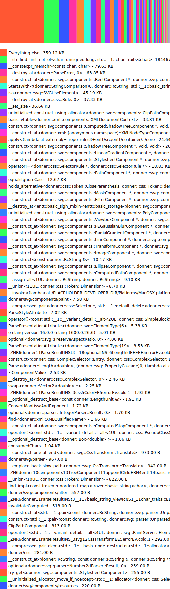

# Donner Build Report

Generated with: tools/generate_build_report.py --all --save docs/build_report.md

Git revision: [a25401264fe94b800d95ce46129e529121a5cf55](https://github.com/jwmcglynn/donner/commit/a25401264fe94b800d95ce46129e529121a5cf55)

## Lines of code
```
$ tools/cloc.sh
Lines of source code:       35.3k
Lines of comments:          14.8k
Comment percentage:         41.0%
Product lines of code:      21.3k
Test lines of code:         12.1k
```

## Binary size
Generated by `tools/binary_size.sh`
```
Total binary size of svg_parser_tool
1.4M	build-binary-size/svg_parser_tool

Total binary size of renderer_tool
4.6M	build-binary-size/renderer_tool
```

### Detailed analysis of `svg_parser_tool`


Saved report to build-binary-size/binary_size_report.html

`bloaty -d compileunits -n 20` output
```
    FILE SIZE        VM SIZE    
 --------------  -------------- 
  25.3%   353Ki  25.1%   353Ki    [78 Others]
  19.8%   276Ki  20.4%   286Ki    [__LINKEDIT]
   8.5%   118Ki   8.4%   118Ki    __str_find_first_not_of<char, unsigned long, std::__1::char_traits<char>, 18446744073709551615UL>
   5.7%  79.6Ki   5.7%  79.6Ki    __constexpr_memchr<const char, char>
   4.4%  61.0Ki   4.3%  61.0Ki    __destroy_at<donner::ParseError, 0>
   4.1%  57.4Ki   4.1%  57.4Ki    __construct_at<donner::svg::components::RectComponent *, donner::svg::components::RectComponent **>
   3.9%  55.2Ki   3.9%  55.2Ki    StartsWith<(donner::StringComparison)0, donner::RcString, std::__1::basic_string_view<char, std::__1::char_traits<char> > >
   3.2%  45.2Ki   3.2%  45.2Ki    isa<donner::svg::SVGUseElement>
   2.7%  37.3Ki   2.7%  37.3Ki    __destroy_at<donner::css::Rule, 0>
   2.6%  36.2Ki   2.6%  36.2Ki    uninitialized_construct_using_allocator<donner::svg::components::ClipPathComponent, std::__1::allocator<donner::svg::components::ClipPathComponent> >
   2.6%  36.0Ki   2.6%  36.0Ki    __set_size
   2.4%  33.8Ki   2.4%  33.8Ki    basic_vtable<donner::xml::components::XMLDocumentContext>
   2.2%  30.6Ki   2.2%  30.6Ki    construct<donner::svg::components::ComputedShadowTreeComponent *, void, void>
   2.1%  29.9Ki   2.1%  29.9Ki    [__DATA_CONST,__const]
   1.8%  25.8Ki   1.8%  25.8Ki    __construct_at<donner::xml::(anonymous namespace)::XMLNodeTypeComponent *, donner::xml::(anonymous namespace)::XMLNodeTypeComponent **>
   1.7%  24.1Ki   1.7%  24.1Ki    apply<(lambda at external/_main~_repo_rules~entt/src/entt/container/../core/memory.hpp:278:23), std::__1::tuple<donner::svg::components::PathLengthComponent &&> >
   1.5%  20.5Ki   1.5%  20.5Ki    construct<donner::svg::components::ShadowTreeComponent *, void, void>
   1.5%  20.4Ki   1.5%  20.4Ki    __construct_at<donner::svg::components::LinearGradientComponent *, donner::svg::components::LinearGradientComponent **>
   1.4%  19.2Ki   1.4%  19.2Ki    __construct_at<donner::svg::components::StylesheetComponent *, donner::svg::components::StylesheetComponent **>
   1.3%  18.8Ki   1.3%  18.8Ki    operator!=<donner::css::SelectorRule *, donner::css::SelectorRule *>
   1.3%  18.2Ki   1.3%  18.2Ki    __construct_at<donner::svg::components::PathComponent *, donner::svg::components::PathComponent **>
 100.0%  1.37Mi 100.0%  1.38Mi    TOTAL
```



## Code coverage
```
$ tools/coverage.sh --quiet
Analyzing coverage for: //donner/...
Overall coverage rate:
  lines......: 86.2% (13708 of 15905 lines)
  functions......: 87.6% (3436 of 3924 functions)
  branches......: 67.8% (6038 of 8908 branches)
Coverage report saved to coverage-report/index.html
```

## Public targets
```
$ bazel query "kind(library, set(//donner/... //:*)) intersect attr(visibility, public, //...)"
//:donner
//donner/base:base
//donner/css:css
//donner/svg:svg
//donner/svg/parser:parser
//donner/svg/renderer:renderer
//donner/svg/resources:sandboxed_file_resource_loader
```

## External dependencies

- com_google_absl
- entt
- frozen
- skia
- stb


