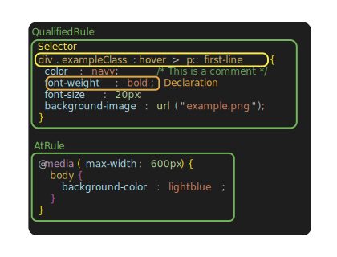
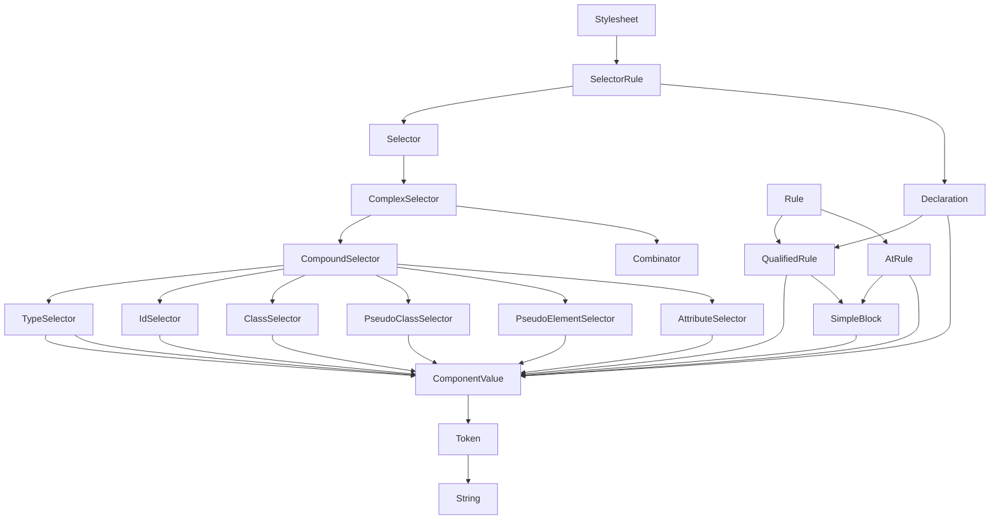
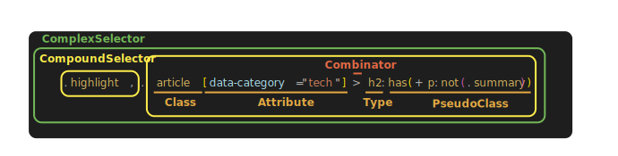
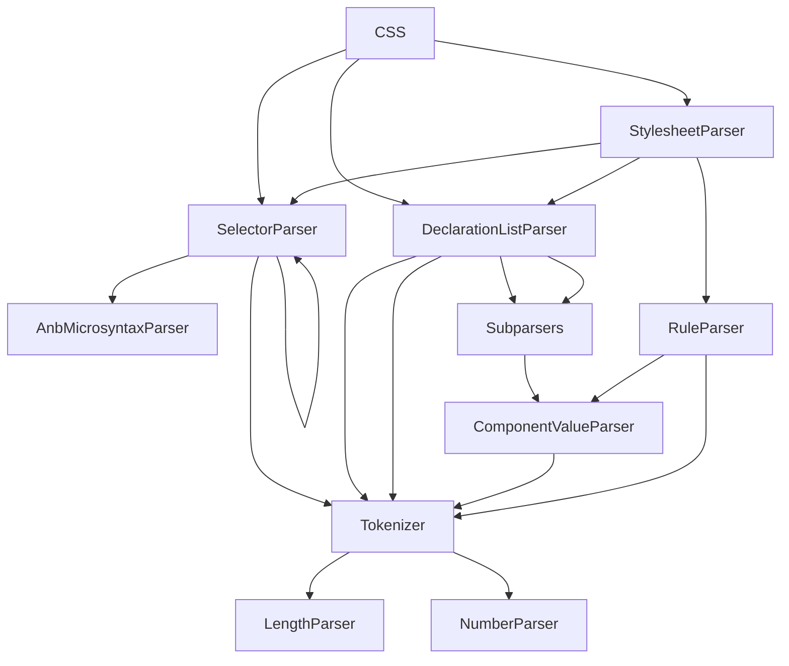

# CSS

Donner implements CSS3 through a hand-rolled CSS library, \ref donner::css. Donner's CSS library is designed to have minimal dependencies and to be easy to integrate into other projects by using an adapter that satisfies the \ref donner::ElementLike concept.

\ref donner::css::CSS provides a high-level API surface for parsing CSS constructs, which is implemented on top of lower-level parser APIs which provide finer-grained control over the parsing process and better error handling.

## Anatomy of CSS strings

A CSS Stylesheet is composed of a list of rules, each of which contains a selector and a list of declarations.

There are two main rule types:
| Rule type | Example |
| --- | --- |
| Qualified rule | `div { color: red; }` |
| At-rule | `@media (max-width: 600px) { ... }` |

Qualified rules are the most common and are used to apply styles to elements that match a selector. At-rules are used for media queries, keyframes, and other special constructs.

Within qualified rules, there is a selector and a list of declarations. The selector is used to match elements in the DOM, and the declarations are a list of key-value pairs that apply styles to the matched elements.

### Class structure

- \ref donner::css::Stylesheet "Stylesheet" is the top-level element in a stylesheet, and contains a list of \ref donner::css::SelectorRule "SelectorRule" for each block (e.g. `div { color: red; }`)
- \ref donner::css::SelectorRule "SelectorRule" represents a single CSS rule, such as `div { color: red; }`
- \ref donner::css::Selector "Selector" represents a single CSS selector, such as `div` or `#id`
- \ref donner::css::Declaration "Declaration" represents a single CSS declaration, such as `color: red;`
- \ref donner::css::ComponentValue "ComponentValue" represents a single CSS value, such as `10px` or `#ff0000`
- \ref donner::css::Token "Token" represents a single CSS token, such as `10px` or `color`

### Selectors

Selectors provide many ways to match elements in the DOM. Selectors can be chained together to create complex matching rules.

| Selector                                                        | Example        | Description                                                                  |
| --------------------------------------------------------------- | -------------- | ---------------------------------------------------------------------------- |
| \ref donner::css::TypeSelector "TypeSelector"                   | `div`          | Matches all `div` elements                                                   |
| \ref donner::css::ClassSelector "ClassSelector"                 | `.class`       | Matches all elements with the class `class`                                  |
| \ref donner::css::IdSelector "IdSelector"                       | `#id`          | Matches the element with the ID `id`                                         |
| \ref donner::css::AttributeSelector "AttributeSelector"         | `[attr=value]` | Matches elements with the attribute `attr` set to `value`                    |
| \ref donner::css::PseudoClassSelector "PseudoClassSelector"     | `:first-child` | Matches elements in a special state, such as the first child of their parent |
| \ref donner::css::PseudoElementSelector "PseudoElementSelector" | `::first-line` | Not yet supported, matches special elements in the tree, mostly for text     |

Attribute, pseudo-class, and combinators provide several ways to match elements based on their state or relationships with other elements.

Selectors can be chained with combinators to create complex matching rules. For example, `div > p` matches `p` elements that are children of `div` elements.

- (whitespace) - Descendant: Space-separated, finds descendants in the tree, ex: `div img`
- `>` **Child**: Finds direct children in the tree.
- `+` **NextSibling**: Finds the next sibling in the tree.
- `~` **SubsequentSibling**: Finds all subsequent siblings in the tree.
- `||` **Column**: Finds the next column in the tree. Note that this is a new feature in CSS Selectors Level 4, but isn't applicable to SVG.

#### Attribute selectors

Attribute selectors are used within square brackets on the selector list, such as `a[href^="https://"]` or `h1[title]`. Different match modes are available, which are specified by \ref donner::css::AttrMatcher "AttrMatcher".

| Matcher | Enum           | Description                                                                                                         |
| ------- | -------------- | ------------------------------------------------------------------------------------------------------------------- |
| `~=`    | Includes       | Interprets the attribute value as a space-separated list of values. Matches if the any value of the list is equal   |
| `\|=`   | DashMatch      | Matches if the attribute value either exactly matches, or begins with the value immediately followed by a dash, `-` |
| `^=`    | PrefixMatch    | Matches if the attribute value begins with the matcher value                                                        |
| `$=`    | SuffixMatch    | Matches if the attribute value ends with the matcher value                                                          |
| `*=`    | SubstringMatch | Matches if the attribute value contains the matcher value                                                           |
| `=`     | Eq             | Matches if the attribute value exactly matches the matcher value                                                    |

If no matcher is specified, the attribute is matched if it is set to any value, for example, `a[href]`.

##### Examples

| Selector              | Matches                                                                                              |
| --------------------- | ---------------------------------------------------------------------------------------------------- |
| `a[href]`             | All `a` elements with an `href` attribute                                                            |
| `a[href^="https://"]` | All `a` elements with an `href` attribute that begins with "https://"                                |
| `a[href$=".pdf"]`     | All `a` elements with an `href` attribute that ends with `.pdf`                                      |
| `a[href*=".pdf"]`     | All `a` elements with an `href` attribute that contains `.pdf`                                       |
| `a[class~="link"]`    | A fun second way of writing `a.link`, which has no purpose other than illustrating the `~=` matcher. |

#### Pseudo-class selectors

Pseudo-classes are used to match elements in special states, such as the first child of their parent or whether a child element matches a selector.

| Pseudo-class                   | Description                                                                                                                                                                                                                                     |
| ------------------------------ | ----------------------------------------------------------------------------------------------------------------------------------------------------------------------------------------------------------------------------------------------- |
| `:root`                        | Matches the root element of the document.                                                                                                                                                                                                       |
| `:empty`                       | Matches elements that have no children.                                                                                                                                                                                                         |
| `:first-child`                 | Matches elements that are the first child of their parent.                                                                                                                                                                                      |
| `:last-child`                  | Matches elements that are the last child of their parent.                                                                                                                                                                                       |
| `:only-child`                  | Matches elements that are the only child of their parent.                                                                                                                                                                                       |
| `:nth-child(An+B [of S])`      | Matches elements that are the `An+B`-th child of their parent. `S` is a \ref donner::css::Selector "Selector" that should match child elements to count.                                                                                        |
| `:nth-last-child(An+B [of S])` | Matches elements that are the `An+B`-th child of their parent, counting from the last child. `S` is a \ref donner::css::Selector "Selector" that should match child elements to count.                                                          |
| `:is(S)`                       | Matches elements that match any of the selectors inside the parentheses, where `S` is a \ref donner::css::Selector "Selector" parsed as a forgiving selector list (invalid selectors removed).                                                  |
| `:not(S)`                      | Matches elements that do not match the \ref donner::css::Selector "Selector" inside the parentheses.                                                                                                                                            |
| `:where(S)`                    | Matches elements that match any of the selectors inside the parentheses, where `S` is a \ref donner::css::Selector "Selector" parsed as a forgiving selector list (invalid selectors removed). Same as `:is(S)`, except has a specificity of 0. |
| `:has(S)`                      | Matches elements that have a descendant that matches the selector inside the parentheses, where `S` is a _relative_ forgiving selector list. These may start with a combinator, such as `:has(> .highlighted)`                                  |
| `:nth-of-type(An+B)`           | Matches elements that are the `An+B`-th child of their parent, counting only elements of the same type.                                                                                                                                         |
| `:nth-last-of-type(An+B)`      | Matches elements that are the `An+B`-th child of their parent, counting from the last child and only elements of the same type.                                                                                                                 |
| `:first-of-type`               | Matches elements that are the first child of their parent and are of the same type.                                                                                                                                                             |
| `:last-of-type`                | Matches elements that are the last child of their parent and are of the same type.                                                                                                                                                              |
| `:only-of-type`                | Matches elements that are the only child of their parent and are of the same type.                                                                                                                                                              |
| `:defined`                     | Matches if the element is supported by the runtime. For SVG this would match \ref xml_path and not `
`.                                                                                                                                     |

## High-level CSS Parsing API

- \ref donner::css::CSS::ParseStylesheet "CSS::ParseStylesheet" can parse a `.css` file into a \ref donner::css::Stylesheet "Stylesheet", which contains a list of \ref donner::css::SelectorRule "SelectorRule".

  \snippet custom_css_parser.cc parse_stylesheet

- \ref donner::css::CSS::ParseStyleAttribute "CSS::ParseStyleAttribute" parses `style="..."` attributes values, which are a list of `key: value;` pairs.

  \snippet custom_css_parser.cc parse_style_attribute

- \ref donner::css::CSS:ParseSelector "ParseSelector" parses a CSS selector, and may be used for implementing `querySelector`.

  \snippet custom_css_parser.cc parse_selector

## Low-level CSS Parsing

\ref donner::css::CSS wraps the low-level parsing APIs to parse a stylesheet and selectors:

- \ref donner::css::parser::StylesheetParser
- \ref donner::css::parser::SelectorParser
- \ref donner::css::parser::DeclarationListParser
