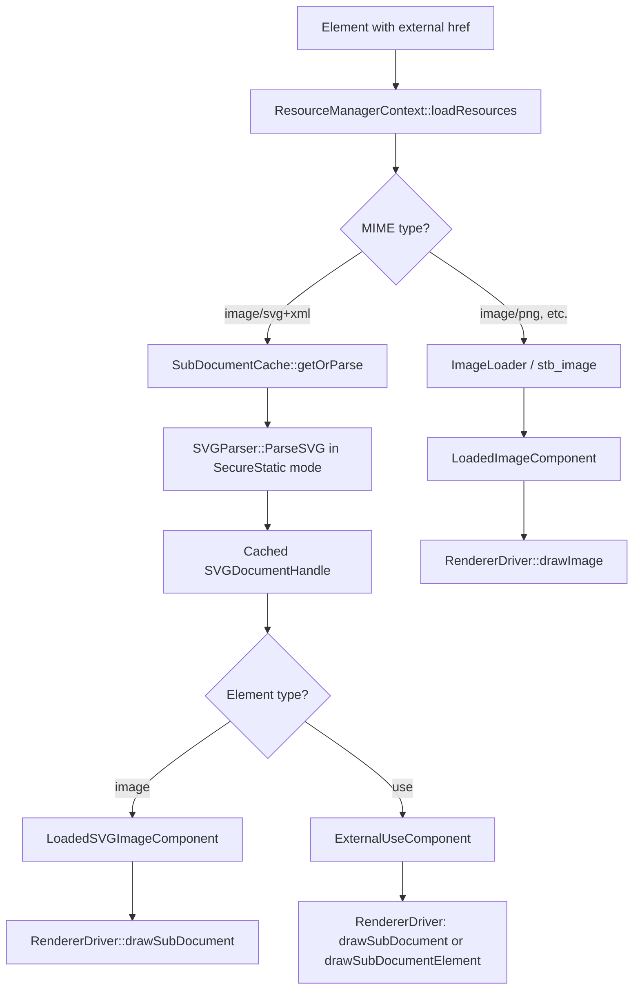
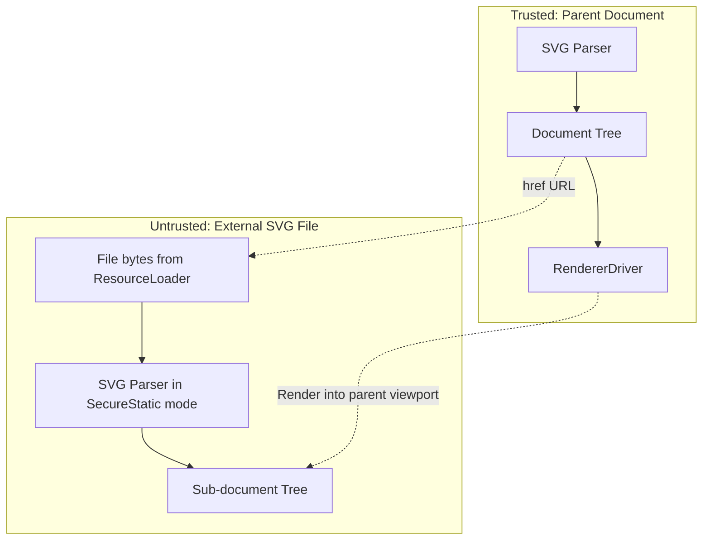

# External SVG Document References

## Overview

Donner supports loading and rendering external `.svg` files referenced by `<image>`, `<use>`, and
`<feImage>` elements. Each element type uses a different rendering strategy:

- **`<image href="file.svg">`**: Renders the external SVG as an atomic image into the `<image>`
  viewport, respecting `preserveAspectRatio`. No CSS inheritance crosses the document boundary.
- **`<use href="file.svg">`**: Renders the entire external SVG as a nested sub-document.
  `context-fill` and `context-stroke` from the `<use>` element propagate into the sub-document.
- **`<use href="file.svg#id">`**: Renders only the element with the given ID from the external
  document, positioned at the `<use>` element's location.
- **`<feImage href="file.svg">`**: Renders the external SVG into the filter primitive subregion.

Sub-documents are parsed in `ProcessingMode::SecureStatic` mode (SVG2 §2.7.1), which prevents
them from loading their own external resources or executing scripts. This enforces a strict
document boundary and prevents infinite recursion.

### Key guarantees

1. Sub-documents never load their own external resources.
2. Circular references (`A → B → A`) are detected and rejected by `SubDocumentCache`.
3. `<image>` rendering does not inherit CSS state from the parent document.
4. `<use>` fragment rendering resolves against the external document, not the parent.

## Architecture Snapshot

### Data flow



### Components

**`SubDocumentCache`** (`donner/svg/components/resources/SubDocumentCache.h`)

Stored on `Registry::ctx()`. Caches parsed sub-documents by resolved URL and guards against
circular loads via a `loading_` set. When `getOrParse` is called for a URL that is already in the
loading set, it returns `std::nullopt`.

**`Reference`** (`donner/svg/graph/Reference.h`)

Parses href strings into their document URL and fragment components. Supports same-document
(`#id`), external whole-document (`file.svg`), and external fragment (`file.svg#id`) references.
Data URLs are treated as non-external.

**`ProcessingMode`** (`donner/svg/core/ProcessingMode.h`)

Controls feature availability per SVG2 §2.7.1. Sub-documents use `SecureStatic`, which disables
external resource loading, script execution, and animations.

**`ResourceManagerContext`** (`donner/svg/components/resources/ResourceManagerContext.h`)

Detects `image/svg+xml` content during resource loading (by MIME type or `.svg` file extension)
and routes SVG content to `SubDocumentCache` instead of raster image decoding.

**`RendererDriver`** (`donner/svg/renderer/RendererDriver.cc`)

Handles three sub-document rendering paths:
- `LoadedSVGImageComponent`: renders into the `<image>` viewport with `preserveAspectRatio`.
- `ExternalUseComponent` without fragment: renders the whole external SVG.
- `ExternalUseComponent` with fragment: renders only the referenced element, positioned at the
  `<use>` element's transform.

Context paint (`context-fill`/`context-stroke`) is passed from the `<use>` element into the
sub-document's rendering context via `RenderingContext::setInitialContextPaint`.

## API Surface

### ECS components

| Component | Stored on | Purpose |
|-----------|-----------|---------|
| `LoadedSVGImageComponent` | `<image>` entity | Holds `SVGDocumentHandle` for an external SVG image |
| `ExternalUseComponent` | `<use>` entity | Holds `SVGDocumentHandle` + optional fragment ID |
| `LoadedImageComponent` | `<image>` entity | Holds decoded raster image (existing, unchanged) |

### `SubDocumentCache` API

```cpp
// Get or parse a sub-document from raw SVG bytes. Returns nullopt on
// failure or circular reference.
std::optional<SVGDocumentHandle> getOrParse(
    const RcString& resolvedUrl,
    const std::vector<uint8_t>& svgContent,
    const ParseCallback& parseCallback,
    std::vector<ParseError>* outWarnings);

// Look up a previously cached sub-document.
std::optional<SVGDocumentHandle> get(const RcString& resolvedUrl) const;

// Check if a URL is currently being loaded (recursion detection).
bool isLoading(const RcString& resolvedUrl) const;
```

### `Reference` API

```cpp
bool isExternal() const;                   // true for "file.svg" or "file.svg#id"
std::string_view documentUrl() const;      // "file.svg" from "file.svg#id"
std::string_view fragment() const;         // "id" from "file.svg#id" or "#id"

// Resolve same-document "#id" references.
std::optional<ResolvedReference> resolve(Registry& registry) const;

// Resolve fragment against an external document's registry.
std::optional<ResolvedReference> resolveFragment(Registry& registry) const;
```

## Security and Safety

### Trust boundaries



### Threat mitigations

| Threat | Mitigation |
|--------|------------|
| Path traversal (`../../etc/passwd`) | `SandboxedFileResourceLoader` rejects escaping paths |
| Infinite recursion (A→B→A) | `SubDocumentCache::isLoading()` recursion guard |
| Resource exhaustion | Sub-documents inherit existing parser and loader limits |
| Information leak via sub-document | `SecureStatic` mode blocks nested external resource loading |
| Cross-origin escalation | Only local file loading is supported; no network fetching |

## Testing and Observability

### Golden tests (`donner/svg/renderer/testdata/`)

| Test file | Coverage |
|-----------|----------|
| `image-external-svg-basic.svg` | Basic external SVG image rendering |
| `image-external-svg-viewbox.svg` | External SVG with viewBox scaling |
| `image-external-svg-par.svg` | External SVG with `preserveAspectRatio` |
| `use-external-svg.svg` | Whole-document external `<use>` |
| `use-external-svg-fragment.svg` | Fragment reference through `<use>` |
| `use-external-context-paint.svg` | `context-fill`/`context-stroke` inheritance |
| `feimage-external-svg.svg` | External SVG through `<feImage>` |

### Unit tests

- **`SubDocumentCache_tests.cc`** (`donner/svg/components/resources/tests/`): cache hit/miss,
  recursion detection, secure mode enforcement, parse failure handling.
- **`Reference_tests.cc`** (`donner/svg/graph/tests/`): URL and fragment parsing for
  same-document, external, and data URL references.
- **`UrlLoader_tests.cc`** (`donner/svg/resources/tests/`): MIME type detection for SVG and raster
  file extensions.

To add a new golden test: create an SVG test file in `testdata/`, add a reference SVG in
`testdata/` for the external resource, render the expected output to `testdata/golden/`, and add
an `INSTANTIATE_TEST_SUITE_P` entry in `Renderer_tests.cc`.

## Limitations and Future Extensions

- **SVG view specification fragments** (`file.svg#svgView(...)`) are not supported.
- **Network fetching** is not supported; only local files and data URLs work.
- **Recursive external loading** from within sub-documents is blocked by `SecureStatic` mode.
- **Interactive sub-documents** and event propagation into referenced SVGs are not supported.
