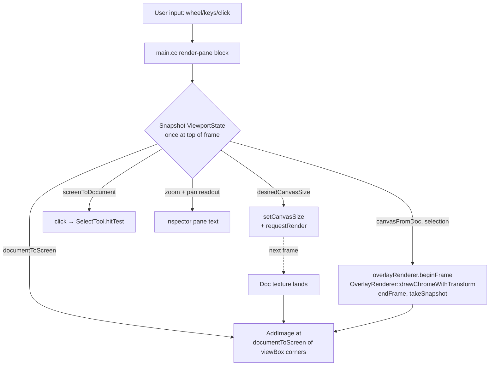

# Design: Editor Render Pane — Viewport, Zoom, Pan, and Click Math

**Status:** Design
**Author:** Claude Sonnet 4.6
**Created:** 2026-04-13

## Summary

The Donner editor's render pane currently has multiple cooperating pieces of state — `view.zoom`, `view.pan`, the cached `documentViewBox`, the canvas size set on the SVG document, the texture dimensions of the most recently completed async render, and the `displayScale` we apply to that texture during zoom transients — and these pieces routinely disagree with each other for one to several frames at a time. The result is a steady drip of UX glitches: zoom no longer preserves the point under the cursor, clicks land on the wrong element when zoomed, the image briefly shrinks/grows on edits, and the path-outline overlay drifts away from the AABB during drags.

This doc proposes (a) the **target UX** for the entire render pane interaction surface — viewport, zoom, pan, click-to-select, marquee select, multi-select, drag, touch and gesture input — (b) a **single source of truth** for the screen↔document coordinate transform that makes every reader on every frame agree about where things are, (c) the **menu bar and command surface** that exposes those commands at parity with the donner-editor prototype, and (d) a **headless test plan** that pins every glitch-prone invariant before we touch main.cc.

The scope is everything inside the render pane window in `donner/editor/main.cc`, plus the main menu bar, plus the input plumbing (mouse, keyboard, touch, trackpad gesture) that drives them. It does not touch the source pane internals, undo, save, structured-editing, or the renderer backends.

## Goals

1. **Zoom preserves the point under the cursor / focal point.** Cmd+wheel zoom, Cmd+Plus / Cmd+Minus, pinch-to-zoom on a trackpad, and menu zoom all keep the focal document point stationary on screen, to within sub-pixel rounding error.
2. **Cmd+0 returns to 100% (1 document unit = 1 screen pixel)**, centered in the pane. 100% is also the *initial* state when the editor opens — not "fit to pane". The user can scroll/pan freely if the document doesn't fit the window. This matches Illustrator's "Actual Size" command and the way Figma opens new files.
3. **Click math is exact at any zoom, pan, and device pixel ratio.** Clicking on a visible pixel of an element selects that element, end of story. Tested headlessly for zoom levels {0.25, 1, 4, 16}, with non-zero pan, with mismatched aspect ratios, and with `devicePixelRatio ∈ {1, 2, 3}`.
4. **No size-flicker on edit.** The on-screen image size and position stay constant across a frame in which only the document content changed. Only canvas-size changes (pane resize, zoom step) are allowed to change the on-screen image size.
5. **Selection chrome (path outline + AABB) tracks the element through drags and zoom.** The outline must follow the element's transform within one frame of the underlying SVG content updating.
6. **Multi-select.** Shift+click adds an element to the current selection; Shift+click on an already-selected element removes it. Cmd+click on empty space clears the selection. The inspector pane shows "N elements selected" with a combined AABB when N > 1.
7. **Marquee selection.** Click-and-drag on empty pane space draws a translucent marquee rectangle; releasing the mouse selects every geometry element whose AABB intersects the marquee. Shift+marquee adds to the current selection instead of replacing.
8. **Touch and gesture input.** Two-finger pinch on a trackpad zooms around the gesture centroid using the same focal-preservation math as Cmd+wheel. Two-finger drag on a trackpad pans. Single-finger touch on touch-screen platforms drives the same select/drag flow as a left-click. The exact GLFW input plumbing for trackpad gestures lives in this doc's *Input Pipeline* section.
9. **Per-DPR / Retina handling.** On a 2x or 3x display, the SVG rasterizes at `canvasSize × dpr` and the on-screen rect is scaled back down by `dpr` so the user sees full-fidelity pixels at native resolution. The donner-editor prototype already handles this; we should match it.
10. **Frame-time graph has a fixed ms-to-pixel scale** so the user can compare frame times across snapshots without "did the budget line move?" confusion.
11. **A complete menu bar at parity with the donner-editor prototype.** File / Edit / View / Help, with all commands keyboard-accessible and consistently labeled. The bar is the canonical place to discover commands; keyboard shortcuts are convenience accelerators on top.
12. **Drags are smooth.** Dragging a selected element follows the cursor with no visible lag, no "rubber-banding" between the cursor and the element, and no overlay-vs-content drift mid-drag. Targeted at 60 fps + on a typical M-series laptop with a complex SVG; the underlying renderer's per-frame cost dominates, but the editor must not add its own pipeline lag on top. The 1-frame "overlay-lags-the-drag" delay that exists today is in scope for this doc and must be eliminated as part of the ViewportState port.
13. **Single source of truth for viewport state.** All readers — async render dispatch, click math, overlay re-render, image draw, inspector text, marquee hit-test, multi-select bounds — derive their answers from the same `ViewportState` value, snapshotted once per frame.

## Non-Goals

- A proper "fit to selection" / "fit to drawing" / "zoom to rect" command. Possible follow-up; not in this doc.
- Smooth animated zoom transitions. Snap-on-step is fine; this doc only requires *correct* end-states.
- Replacing the async render thread.
- Any change to the SVG renderer backends, `OverlayRenderer`'s drawing primitives, or the `canvasFromDocumentTransform` API rename.
- Snapping (snap-to-grid, snap-to-other-elements). Separate doc.
- Lasso / freehand selection (only marquee rectangles in this doc).
- Sandboxing / process isolation for the editor. Covered by the separate [editor_sandbox](0023-editor_sandbox.md) design doc.
- Source pane internals — text editor, syntax highlighting, autocomplete, structured-edit dispatch. Out of scope; this doc only touches the source pane to the extent that it sets `setText(text, preserveScroll=true)` on writeback.

## Next Steps

- Land the `ViewportState` struct + `donner/editor/ViewportState.{h,cc}` with no caller changes — pure code, fully unit-tested. (Milestone 1)
- Stand up the headless test file `donner/editor/tests/RenderPaneViewport_tests.cc` covering every invariant in the Goals section. Tests should fail against the *current* main.cc behavior where applicable (regression-style). (Milestone 1)
- Then, and only then, port main.cc over to consume `ViewportState`. (Milestone 2)

## Implementation Plan

- [ ] **Milestone 1: ViewportState + headless invariants**
  - [ ] Add `donner/editor/ViewportState.{h,cc}` with the fields and methods described in *Proposed Architecture* below.
  - [ ] Add `donner/editor/tests/RenderPaneViewport_tests.cc` with the property-style tests in *Testing and Validation*. They run against `ViewportState` only (no main.cc dependency).
  - [ ] Wire the new test into `donner/editor/tests/BUILD.bazel`.
  - [ ] Verify the test target passes.
- [ ] **Milestone 2: Replace main.cc viewport handling and fix drag overlay lag**
  - [ ] Replace the ad-hoc `view.zoom` / `view.pan` / `cachedDocViewBox` / `displayScale` quartet in `donner/editor/main.cc` with a single `ViewportState viewport;` snapshotted once per frame.
  - [ ] Default `viewport.zoom` to 1.0 — *and* with the new pixels-per-doc-unit definition, that means 100% (1 doc unit = 1 screen pixel), not "fit to pane".
  - [ ] Route the async render request, the overlay re-render, the `AddImage` call, and click handling through `viewport.documentToScreen` / `viewport.screenToDocument` exclusively.
  - [ ] Delete the obsolete `lastRenderedZoom`, `lastRenderedCanvasSize` mismatch handling, and the `displayScale` math.
  - [ ] Eliminate the 1-frame overlay-after-drag delay. The overlay re-render block consumes the post-`flushFrame` document state in the same frame the drag mutation lands, by running *after* `flushFrame` and gating on the document's frame version number — see *Drag pipeline* below.
  - [ ] Update `EditorAppTest.CenterClickOnPaneHitsCenterOfDocumentViewBox` and the existing ViewportGeometry tests to construct `ViewportState` directly.
- [ ] **Milestone 3: End-to-end pinning + drag smoothness**
  - [ ] Add headless click-math tests that drive `EditorApp` + `ViewportState` together: load donner_splash.svg, apply each combination of (zoom, pan, dpr), assert hit-test results match expected element ids at known screen positions.
  - [ ] Add headless drag-smoothness regression: simulate N consecutive `onMouseMove` events with linearly increasing positions, assert that the element's transform after each frame matches the expected linear progression with no skipped or duplicated frames.
  - [ ] Manual smoke test: zoom in/out at the cursor, drag-pan, click-to-select at extreme zoom, drag a complex element through hundreds of pixels, verify nothing drifts.
- [ ] **Milestone 4: Multi-select + marquee**
  - [ ] Generalize `EditorApp::setSelection(std::optional<SVGElement>)` to `setSelection(std::vector<SVGElement>)`. Audit every callsite. (Existing single-element callers wrap their argument in a 1-element vector; downstream code that assumed at most one element needs to gracefully handle N.)
  - [ ] Wire Shift+click in `SelectTool` to add/remove from selection. Cmd+click on empty space clears.
  - [ ] Add a marquee tool path in `SelectTool::onMouseDown`/`onMouseMove`/`onMouseUp` that triggers when the mouse-down lands on empty pane space (no hit-test result). The marquee renders as a translucent rect via the overlay renderer.
  - [ ] Hit-test resolution: on `onMouseUp`, query every geometry element whose `worldBounds()` intersects the marquee's document-space rect, and add them all to the selection.
  - [ ] Update `OverlayRenderer::drawChromeWithTransform` to accept a vector and draw chrome for every element. Selection chrome for multi-select is a single combined AABB plus per-element path outlines.
  - [ ] Tests: marquee selecting 0/1/2/N elements, marquee with shift-modifier, marquee that intersects partially-clipped elements.
- [ ] **Milestone 5: Per-DPR / Retina handling**
  - [ ] Read the GLFW window's content scale (`glfwGetWindowContentScale`) and surface it as `ViewportState::devicePixelRatio`.
  - [ ] Multiply `desiredCanvasSize` by `dpr` so the SVG rasterizer produces full-fidelity pixels at native resolution. The on-screen rect width/height in `documentToScreen` stays in screen coordinates; the texture upload picks up the higher-resolution bitmap automatically because `imageOrigin..imageOrigin+imageSize` is in screen pixels regardless.
  - [ ] The overlay renderer follows the same path: its `RenderViewport.devicePixelRatio = dpr`.
  - [ ] Test that click math still rounds correctly when dpr=2 — clicks are still in screen pixels, so nothing else has to change.
- [ ] **Milestone 6: Touch and trackpad gestures**
  - [ ] Hook GLFW's scroll callback to detect two-finger pinch on macOS trackpads (GLFW reports it as a scroll event with the magnify modifier flag, surfaced through `glfwSetScrollCallback`). Translate to `viewport.zoomAround(newZoom, gestureCentroid)`.
  - [ ] Two-finger pan: trackpad scroll without modifier → `viewport.panBy(scrollDelta)`.
  - [ ] Touch-screen single-finger drag on Linux/Wayland: GLFW touch events → existing left-click/drag pipeline, no special path needed.
  - [ ] Tests: simulated gesture event sequence, assert viewport state matches expected end state.
- [ ] **Milestone 7: Menu bar polish + parity audit**
  - [ ] Audit the existing main menu against the donner-editor prototype's menu (File / Edit / View / Windows). Add missing items: File→Open, File→Recent, View→"Actual Size" (Cmd+0 alias), View→"Zoom to Fit", View→"Show Inspector".
  - [ ] Make all menu items respect `enabled` based on app state (e.g. Cut/Copy require a non-empty text selection; Save requires `currentFilePath()`).
  - [ ] Confirm the frame graph already uses a fixed scale (already done in a previous fix; verify with a code read).
  - [ ] Rename `ViewTransform` → remove (replaced by `ViewportState`).

## Background

### Current state (March-April 2026, as of this writing)

`donner/editor/main.cc` currently maintains five overlapping pieces of viewport state:

```cpp
struct ViewTransform {
  float zoom = 1.0f;
  ImVec2 pan = ImVec2(0.0f, 0.0f);
};
ViewTransform view;
donner::Box2d cachedDocViewBox;        // snapshotted at render request time
donner::Vector2i lastRenderedCanvasSize;
float lastRenderedZoom;
int textureWidth, textureHeight;       // updated when async render lands
```

Each frame, four independent computations happen:

1. **Canvas-size dispatch.** `setCanvasSize(baseW * zoom, baseH * zoom)`, capped.
2. **`cachedDocViewBox` snapshot.** Computed from `canvasFromDocumentTransform().inverse().transformBox(canvasBox)`.
3. **Display layout.** `ComputeDrawingViewportLayout(paneOrigin, contentRegion, textureSize * displayScale, view.pan, cachedDocViewBox)`, where `displayScale = currentZoom / lastRenderedZoom`.
4. **Zoom-around-focal pan adjustment.** `applyZoom` recomputes `view.pan` from `(focal - view.pan) / view.zoom`.

(1) and (2) only run in frames where the doc render is actually triggered. (3) runs every frame from the texture state. (4) runs whenever the user zooms.

The model `applyZoom` uses for `view.pan` ("offset of image origin from paneOrigin") does not match the model `ComputeDrawingViewportLayout` uses ("offset added to the centered image position"). They differ by `(availableRegion - imageSize) / 2`, which is itself a function of `imageSize` which is a function of `view.zoom`. So zooming changes the disagreement, and the pan drifts.

### Why click math is wrong when zoomed

Click math goes through `viewportLayout.screenToDocument`, which is correct *given* its inputs, but its inputs (`imageOrigin`, `imageSize`, `documentViewBox`) come from up to three different frames:

- `imageSize = textureSize * (currentZoom / lastRenderedZoom)`. During a zoom transient, `lastRenderedZoom` lags the user input by 1–2 frames; `imageSize` is therefore an interpolation, not the size of the next render.
- `cachedDocViewBox` is updated at *render request* time, but the texture being displayed is from the *previous* render. So the document-space bounds we map to are for the in-flight render, while the visible pixels belong to the previous one.
- During the same transient frame, `view.pan` was just updated by `applyZoom` using the *new* zoom but the *old* image size.

In steady state everything agrees. During any input event that changes zoom or canvas size, three different "current" frames are mixed.

### Why the path outline lags AABB on drag

The overlay re-render is gated on `selection != lastOverlaySelection || canvasChanged || overlayDirty`. `overlayDirty` is set when the doc render trigger fires, which happens *after* the overlay block has already run for the current frame, so the overlay's selection-chrome bitmap is always one frame behind a drag-driven mutation. The AABB and path outline are both in that bitmap, so this should affect them equally — but the AABB is then redrawn on the live spline-free path each frame from `worldBounds()` directly through `paneDrawList->AddRect`... oh, wait, it isn't anymore (we removed the ImGui-side draw). So the user's "AABB moves but path doesn't" report is actually about something else, almost certainly the local-vs-world spline transform that was just patched. The 1-frame overlay lag is a separate, smaller issue.

## Requirements and Constraints

- **Coordinate-system invariants:**
  - `documentToScreen(screenToDocument(p)) == p` for any `p` inside the displayed image, to within `1e-6` pixels.
  - `screenToDocument(documentToScreen(d)) == d` for any document point `d` inside the document viewBox, to the same tolerance.
  - Zoom-around-focal: after `applyZoom(factor, focal)`, `documentToScreen(focalDocPointBefore) == focal`.
  - Pan: after `pan(delta)`, every previously-visible document point is at its previous screen position + `delta`.
- **Frame consistency:** every reader within a single frame sees the same `ViewportState`. No reader is allowed to query "live" zoom/pan/canvas state outside of `ViewportState`.
- **No silent rounding loss:** `ViewportState` stores `double` for everything. The conversion to integer canvas size happens at exactly one place: when calling `setCanvasSize`.
- **Backward compatibility:** zoom hotkeys, the menu, and the inspector readout continue to work. The user-visible behavior at zoom=1.0 / pan=(0,0) is identical to today.

## Proposed Architecture

### A single source of truth: `ViewportState`

```cpp
namespace donner::editor {

/// All viewport state for a single frame of the render pane. Fully
/// value-typed and side-effect-free — main.cc constructs one of these
/// at the top of the render-pane block and every reader consults it.
///
/// Coordinate spaces:
///   - "document" / "world": SVG viewBox coordinates (e.g. 0..892 for
///     a `viewBox="0 0 892 512"`).
///   - "screen": ImGui screen-pixel coordinates in *logical pixels*,
///     (0,0) at the top-left of the OS window. On a Retina display, a
///     mouse position of (100, 100) is the same logical screen pixel
///     regardless of devicePixelRatio.
///   - "device pixel": physical pixels in the rasterized bitmap.
///     Equal to screen * `dpr`. Only the SVG renderer's bitmap output
///     and OpenGL texture upload care about this distinction.
///   - "pane-local": (0,0) at the render pane's top-left.
struct ViewportState {
  // ---- Inputs (set by main.cc once per frame from user state). ----

  /// Top-left of the render pane's content region in screen pixels.
  Vector2d paneOrigin;
  /// Size of the render pane's content region in screen pixels.
  Vector2d paneSize;
  /// SVG document viewBox in document coordinates.
  Box2d documentViewBox;
  /// OS device pixel ratio (1.0 on standard displays, 2.0 on Retina).
  /// Read via `glfwGetWindowContentScale`.
  double devicePixelRatio = 1.0;

  /// Zoom factor in *screen pixels per document unit*. 1.0 means
  /// "100%": one SVG `viewBox` unit takes exactly one screen pixel
  /// (regardless of how many physical device pixels that is). Default.
  double zoom = 1.0;
  /// Document point that should appear at `panScreenPoint`.
  Vector2d panDocPoint;
  /// Screen point at which `panDocPoint` is anchored.
  Vector2d panScreenPoint;

  // ---- Derived getters. ----

  /// Screen pixels per document unit at the current zoom. With the
  /// "zoom is in screen-pixels-per-doc-unit" definition above, this is
  /// just `zoom`. Method exists so callers don't reach in for the raw
  /// field and so the definition can grow if we ever decide that "100
  /// percent" should mean something other than "1:1".
  [[nodiscard]] double pixelsPerDocUnit() const { return zoom; }

  /// Device pixels per document unit. Used by `desiredCanvasSize` and
  /// the renderer's `RenderViewport.devicePixelRatio`. Equal to
  /// `pixelsPerDocUnit() * devicePixelRatio`.
  [[nodiscard]] double devicePixelsPerDocUnit() const {
    return pixelsPerDocUnit() * devicePixelRatio;
  }

  /// Map document → screen (in logical pixels) and back. Both
  /// invertible for any non-degenerate input.
  [[nodiscard]] Vector2d documentToScreen(const Vector2d& docPoint) const;
  [[nodiscard]] Vector2d screenToDocument(const Vector2d& screenPoint) const;

  /// Box-version helpers that AABB-transform a Box2d through the
  /// point-version transform. Used by the overlay AABB, click-test hit
  /// boxes, and marquee selection bounds.
  [[nodiscard]] Box2d documentToScreen(const Box2d& docBox) const;
  [[nodiscard]] Box2d screenToDocument(const Box2d& screenBox) const;

  /// Bounding box of the visible document area on screen, in screen
  /// pixels. Used by the `AddImage` call. Equal to
  /// `documentToScreen(documentViewBox)`.
  [[nodiscard]] Box2d imageScreenRect() const {
    return documentToScreen(documentViewBox);
  }

  /// Canvas size (in *device* pixels) the SVG renderer should produce,
  /// given the current zoom and DPR. Capped at `kMaxCanvasDim` per
  /// axis so a 32x zoom on a large pane can't trigger multi-gigabyte
  /// renders. The width/height match `documentViewBox.size() * zoom *
  /// dpr`, *not* the pane size — the renderer rasterizes the
  /// document, not the pane.
  [[nodiscard]] Vector2i desiredCanvasSize() const;

  // ---- Mutating helpers. ----

  /// Set zoom, holding `focalScreen` fixed: after this call, the
  /// document point that was under `focalScreen` is still under
  /// `focalScreen`. Use for Cmd+wheel, Cmd+Plus / Cmd+Minus, menu
  /// zoom, and pinch-to-zoom.
  void zoomAround(double newZoom, const Vector2d& focalScreen);

  /// Pan by `screenDelta` screen pixels.
  void panBy(const Vector2d& screenDelta);

  /// Reset to 100% (1 doc unit = 1 screen pixel), with the *document
  /// center* anchored at the *pane center*. After this call,
  /// `documentToScreen(viewBoxCenter) == paneCenter` and
  /// `pixelsPerDocUnit() == 1.0`. This is the initial state on editor
  /// open and the target of Cmd+0.
  void resetTo100Percent();
};

}  // namespace donner::editor
```

### Why `(panDocPoint, panScreenPoint)` instead of `(zoom, pan)`?

The Illustrator-style invariant we want is *"a specific document point is anchored at a specific screen point"*. The current code expresses this as a screen-pixel `pan` offset, but that representation has to be re-derived against the centered image origin every time `imageSize` changes, and `imageSize` changes whenever zoom changes. Storing `(panDocPoint, panScreenPoint)` directly means **zoom changes leave the anchor untouched** — the scale changes, but the document point stays glued to the screen point.

The math falls out cleanly:

```cpp
Vector2d ViewportState::documentToScreen(const Vector2d& d) const {
  const double s = pixelsPerDocUnit();
  return panScreenPoint + (d - panDocPoint) * s;
}

Vector2d ViewportState::screenToDocument(const Vector2d& p) const {
  const double s = pixelsPerDocUnit();
  return panDocPoint + (p - panScreenPoint) / s;
}

void ViewportState::zoomAround(double newZoom, const Vector2d& focalScreen) {
  // Document point currently under `focalScreen`.
  const Vector2d focalDoc = screenToDocument(focalScreen);
  zoom = std::clamp(newZoom, kMinZoom, kMaxZoom);
  // Re-anchor: that doc point should still be under that screen point.
  panDocPoint = focalDoc;
  panScreenPoint = focalScreen;
}

void ViewportState::panBy(const Vector2d& screenDelta) {
  panScreenPoint += screenDelta;
}

void ViewportState::resetTo100Percent() {
  zoom = 1.0;
  panDocPoint = documentViewBox.center();
  panScreenPoint = paneOrigin + paneSize * 0.5;
}
```

`zoomAround` is three lines and obviously preserves the focal invariant by construction. Compare to today's `applyZoom`, which has to back out the centered image origin to recover something it can rescale.

### Initial state and Cmd+0

The editor opens with `ViewportState` constructed by `resetTo100Percent()`. That guarantees:

- `pixelsPerDocUnit() == 1.0` — one SVG `viewBox` unit = one screen pixel = one (or `dpr`) device pixel.
- The center of the document viewBox sits at the center of the render pane.
- The user can pan freely if the document is bigger than the pane, and large empty space surrounds it if smaller.

Cmd+0, View → Reset Zoom, and View → Actual Size all call `resetTo100Percent()`. There is no separate "Fit to pane" command in this doc; if you need it, that's a follow-up View menu item.

### Frame data flow



The critical property: **all five readers consult the same `ViewportState` value**. Today they each do their own computation from `view.zoom`, `view.pan`, `cachedDocViewBox`, etc., and disagree at the seams.

### Texture display when canvas size lags zoom

Same principle as today: the displayed on-screen rectangle of the document image is computed from `viewport.imageScreenRect()` (which is `documentToScreen(viewBox.topLeft)` and `documentToScreen(viewBox.bottomRight)`). The texture is stretched into that rectangle, regardless of how many pixels it currently has. During a zoom transient before the new render lands, the old, lower-resolution texture is shown stretched to the new on-screen rectangle — this is the "transient pixelation" we already accept. One or two frames later the new texture arrives at full fidelity.

The key shift: **the on-screen rectangle is computed from `ViewportState`, not from the texture dimensions**. The texture dimensions only determine sampling fidelity, not layout.

### Click math

```cpp
const Vector2d docPoint = viewport.screenToDocument(Vector2d(mouse.x, mouse.y));
selectTool.onMouseDown(app, docPoint, modifiers);
```

That's the entire click path. No `cachedDocViewBox`, no `lastRenderedZoom`, no `displayScale`. By construction: if the user clicked screen pixel `S`, the document point we hand to `SelectTool` is the same one that `documentToScreen` would map back to `S`.

### Drag pipeline (smoothness)

Today's drag flow:

```
F1: mouse moves → onMouseMove → applyMutation(SetTransformCommand)
F2: flushFrame → version++ → request async render → overlayDirty=true
F3: async render lands; overlay block sees overlayDirty → re-renders overlay
```

Three frames between cursor motion and visible chrome update. Visible as the path outline lagging behind the AABB during fast drags.

The new flow runs flushFrame *before* the overlay block, and triggers the overlay block on `currentVersion != lastOverlayVersion` directly:

```
F1 top:    drainAsyncRender → texture update (if landed)
F1 mid:    flushFrame → applies mutation → version increments
F1 mid:    overlay block sees version != lastOverlayVersion → re-renders
F1 mid:    doc-render block sees version change → kicks worker (async)
F1 bottom: AddImage(texture) + AddImage(overlay)
```

The overlay re-render sees the post-mutation document state, so the AABB and the path outline both reflect the drag mutation in the same frame the user moved the mouse. The async SVG render still lags by one or two frames — but the chrome is what the user is looking at during the drag, and the chrome is sharp.

### Selection, multi-select, and marquee

The `EditorApp` selection becomes a *set* (`std::vector<SVGElement>` with set semantics) instead of `std::optional<SVGElement>`. Single-element call sites wrap their argument; size-1 selections render exactly the same chrome as today. The inspector pane shows "1 element" or "N elements" depending on the size; the AABB is the union of the per-element world-space bounds.

`SelectTool` grows three input modes:

1. **Click** (no modifier) — replaces the selection with the hit element, or clears it if the hit landed on empty space.
2. **Shift+click** — toggles the hit element in the current selection. Hits on empty space are no-ops.
3. **Drag from empty space** — marquee mode. The first `onMouseMove` after a `onMouseDown` that hit empty space starts a marquee; subsequent moves update its rect; `onMouseUp` resolves the rect to a set of hit elements (every geometry element whose `worldBounds()` *intersects* the marquee rect — not strict containment, matching Illustrator's behavior) and assigns / appends them to the selection.

Marquee rendering: the overlay renderer gets a new `drawMarquee(canvasFromDoc, marqueeRect)` entry point that draws a translucent fill + dashed stroke. `OverlayRenderer::drawChromeWithTransform` is generalized to take both the selection vector and an optional marquee rect.

### Per-DPR / Retina handling

Screen pixel coordinates everywhere in the editor are *logical* pixels (what GLFW reports for mouse positions). Device pixels only enter the pipeline when:

1. **Canvas sizing.** `desiredCanvasSize` returns `viewBoxSize * zoom * dpr` so the rasterized bitmap has one bitmap pixel per physical screen pixel at native zoom.
2. **Renderer viewport.** `RenderViewport.devicePixelRatio = dpr` (we already have this field; it's just been hard-coded to 1.0). The renderer scales its drawing accordingly.
3. **Texture upload.** `glTexImage2D` uploads the device-pixel bitmap unchanged. The OpenGL coordinate system is in physical pixels, but `ImDrawList::AddImage` takes screen-pixel coordinates and maps them to physical pixels internally — so we feed it `imageScreenRect()` (in screen pixels) and the texture (in physical pixels) and it Just Works.

The overlay renderer uses the same `dpr` so its bitmap matches the document bitmap's resolution.

GLFW reports DPR via `glfwGetWindowContentScale(window, &xScale, &yScale)`. We assume isotropic scaling (`xScale == yScale`), since every supported platform uses isotropic content scale; if that assumption breaks we error out rather than producing weird non-square pixels.

### Input pipeline

Input arrives via three channels:

| Source | GLFW callback | ImGui surface | Editor handler |
| --- | --- | --- | --- |
| Mouse buttons / position | `glfwSetMouseButtonCallback` | `ImGui::IsMouseClicked` etc. | `SelectTool::onMouseDown/Move/Up`, marquee, pan |
| Keyboard | `glfwSetKeyCallback` | `ImGui::IsKeyPressed` | menu shortcuts, `applyZoom`, undo |
| Trackpad scroll / pinch | `glfwSetScrollCallback` | `ImGui::GetIO().MouseWheel{,H}` | `viewport.zoomAround` (with modifier) or `panBy` |
| Touch | (no direct GLFW touch API; comes through as mouse-emulated events on supported platforms) | as mouse | as mouse |

ImGui already handles the routing — `ImGui::GetIO().MouseWheel` is non-zero on a two-finger trackpad scroll, and the `KeyCtrl`/`KeySuper` modifier flags surface the magnify-modifier from a pinch on macOS. The editor's job is just to dispatch correctly:

```cpp
if (paneHovered && wheel != 0.0f && !panning) {
  if (modHeld) {
    // Cmd+wheel or pinch-to-zoom: zoom around the cursor.
    viewport.zoomAround(viewport.zoom * std::pow(kWheelZoomStep, wheel), mouse);
  } else {
    // Two-finger scroll: pan the view.
    viewport.panBy(Vector2d(io.MouseWheelH, io.MouseWheel) * kPanStep);
  }
}
```

Touch input on Linux/Wayland comes through as synthesized mouse events, so the existing click path covers single-finger taps and drags. Multi-touch gestures route through `glfwSetScrollCallback`'s ScrollEventModifier on platforms that support it, which is the same code path as the trackpad pinch.

### Menu bar

The main menu lives inside `BeginMainMenuBar` and spans the full window width above all panes. Items follow the donner-editor prototype layout, with one-shot "requested" flags consumed in the main loop so menu and shortcut paths share their dispatch logic.

```
File
  Open...                Cmd+O
  Save                   Cmd+S
  Save As…               Cmd+Shift+S

Edit
  Undo                   Cmd+Z
  Redo                   Cmd+Shift+Z
  ─────
  Cut                    Cmd+X
  Copy                   Cmd+C
  Paste                  Cmd+V
  Select All             Cmd+A
  ─────
  Deselect               Cmd+Shift+A     (clears the canvas selection)

View
  Zoom In                Cmd++
  Zoom Out               Cmd+-
  Actual Size            Cmd+0           (alias for Reset Zoom = 100%)
  ─────
  Show Inspector                          (toggle, default on)
  Show Source                             (toggle, default on)

Help
  About Donner Editor
```

Every item with a keyboard shortcut maps to the same `viewport.*` / `app.*` / `textEditor.*` calls the keyboard path uses. Items that depend on app state (`Save`, `Undo`, `Cut`/`Copy`/`Paste`) pass a fourth `enabled` argument to `MenuItem` so they grey out when not applicable.

### Overlay re-render details

`canvasFromDocumentTransform` and `currentCanvasSize` come from the SVG document at the moment the overlay block runs (which is gated on the worker being idle, same as today). The overlay's geometric content is unchanged — `OverlayRenderer::drawChromeWithTransform` already takes a `canvasFromDoc` transform; we just pass the value the document reports.

The overlay re-render trigger now also includes `currentVersion != lastOverlayVersion`, and the overlay block runs *after* `flushFrame` but *before* the doc-render trigger — so a drag's mutation reflects in the overlay the very same frame it lands in `flushFrame`. This eliminates the 1-frame outline-lags-AABB visible during continuous drags.

## API / Interfaces

The full public surface of `ViewportState` is in *Proposed Architecture* above. No other API changes. `OverlayRenderer`, `SelectTool`, `EditorApp`, and `AsyncRenderer` are untouched.

## Data and State

- `ViewportState` is plain old data — copyable, no allocations, ~80 bytes.
- Lifetime: one instance per frame, on the stack. No persistence between frames except through the `view` field on the editor, which holds the *previous* frame's state and is re-snapshotted at the top of the next frame.
- Threading: UI-thread only. The async render worker never sees `ViewportState`; it just receives a `RenderRequest` whose `document` pointer the worker owns until it drains.
- Persistence: not stored to disk. The view resets on every editor launch.

## Error Handling

- Degenerate inputs (`paneSize` zero, `documentViewBox` zero, `zoom` zero or negative) clamp to safe defaults instead of crashing or producing NaN. `ViewportState::pixelsPerDocUnit` returns 1.0 in any degenerate case.
- `desiredCanvasSize` always returns at least `(1, 1)` and at most `(kMaxCanvasDim, kMaxCanvasDim)`. The cap is the same 8192 px/axis we already use.
- All `ViewportState` methods are total — they return *something* sensible for any input. There is no "invalid `ViewportState`" state to check for; readers call freely.

## Performance

The ViewportState methods are 5–10 floating-point ops each. They run a handful of times per frame; the cost is in the noise. The frame budget is dominated by the SVG rasterize (a few ms when the canvas is 1440×800) and the overlay rasterize (sub-millisecond). The viewport math is 0.0% of that.

## Testing and Validation

A new test file, `donner/editor/tests/RenderPaneViewport_tests.cc`, drives `ViewportState` directly through a battery of property-style assertions. The whole file is headless — no GLFW, no ImGui, no GL.

### Round-trip invariants

```cpp
TEST(ViewportStateTest, ScreenToDocumentRoundTripsAtZoomOne) {
  ViewportState v = MakeFitState(/*viewBox=*/{0, 0, 200, 200},
                                 /*pane=*/{800, 600});
  for (auto p : {Vector2d(0, 0), Vector2d(50, 70), Vector2d(199, 199)}) {
    EXPECT_NEAR_VEC(v.screenToDocument(v.documentToScreen(p)), p, 1e-9);
  }
}

TEST(ViewportStateTest, ScreenToDocumentRoundTripsUnderZoomAndPan) {
  for (double zoom : {0.25, 1.0, 2.0, 4.0, 16.0}) {
    for (Vector2d focal : {Vector2d(120, 80), Vector2d(0, 0), Vector2d(800, 600)}) {
      ViewportState v = MakeFitState({0, 0, 892, 512}, {1280, 720});
      v.zoomAround(zoom, focal);
      v.panBy({37.5, -12.0});
      for (auto p : DocPointsCornerPlusCenter(v.documentViewBox)) {
        EXPECT_NEAR_VEC(v.screenToDocument(v.documentToScreen(p)), p, 1e-6);
      }
    }
  }
}
```

### Zoom focal-point preservation

```cpp
TEST(ViewportStateTest, ZoomAroundCursorPreservesFocalPoint) {
  ViewportState v = MakeFitState({0, 0, 892, 512}, {1280, 720});
  // Pick any screen point inside the rendered image.
  const Vector2d focal(900.0, 320.0);
  const Vector2d docBefore = v.screenToDocument(focal);
  v.zoomAround(2.5, focal);
  EXPECT_NEAR_VEC(v.documentToScreen(docBefore), focal, 1e-9);
}

TEST(ViewportStateTest, ZoomAroundCursorIsRepeatable) {
  // Zoom in 5 times then out 5 times around the same point — should
  // land within rounding distance of the start state.
  ViewportState v = MakeFitState({0, 0, 200, 200}, {800, 800});
  const Vector2d focal(420, 380);
  const Vector2d docBefore = v.screenToDocument(focal);
  for (int i = 0; i < 5; ++i) v.zoomAround(v.zoom * 1.5, focal);
  for (int i = 0; i < 5; ++i) v.zoomAround(v.zoom / 1.5, focal);
  EXPECT_NEAR_VEC(v.documentToScreen(docBefore), focal, 1e-6);
  EXPECT_NEAR(v.zoom, 1.0, 1e-9);
}
```

### Pan invariants

```cpp
TEST(ViewportStateTest, PanByMovesEveryPointByDelta) {
  ViewportState v = MakeFitState({0, 0, 892, 512}, {1280, 720});
  v.zoomAround(3.0, {640, 360});
  const Vector2d delta(50.0, -25.0);
  const Vector2d docPoint(446.0, 256.0);
  const Vector2d screenBefore = v.documentToScreen(docPoint);
  v.panBy(delta);
  EXPECT_NEAR_VEC(v.documentToScreen(docPoint), screenBefore + delta, 1e-9);
}
```

### Reset

```cpp
TEST(ViewportStateTest, ResetReturnsToFitToPane) {
  ViewportState v = MakeFitState({0, 0, 200, 200}, {1000, 800});
  v.zoomAround(7.0, {300, 250});
  v.panBy({200, -150});
  v.resetToFit();
  EXPECT_NEAR(v.zoom, 1.0, 1e-9);
  // Document corners should map to the centered image rect inside the pane.
  // For a 200×200 viewBox in a 1000×800 pane, fit scale = min(5, 4) = 4,
  // so the image is 800×800 centered → top-left at (100, 0).
  EXPECT_NEAR_VEC(v.documentToScreen({0, 0}), Vector2d(100, 0), 1e-9);
  EXPECT_NEAR_VEC(v.documentToScreen({200, 200}), Vector2d(900, 800), 1e-9);
}
```

### End-to-end click correctness

A second test file, `donner/editor/tests/RenderPaneClick_tests.cc`, drives `EditorApp` + `ViewportState` together to assert that click-at-screen-position picks the right element under various viewport states. These tests directly cover the user's "clicks land wrong when zoomed" report.

```cpp
// Loads a doc with two non-overlapping geometry elements at known
// document positions, sets up a ViewportState at zoom=N, and asserts
// that hit-testing the screen position of each element's center
// returns that element's id. Parameterized over zoom levels and pan
// offsets.
TEST(RenderPaneClickTest, ClickAtElementCenterHitsElementAtAnyZoom) {
  for (double zoom : {0.5, 1.0, 2.0, 4.0}) {
    for (Vector2d pan : {Vector2d(0, 0), Vector2d(75, -40)}) {
      EditorApp app;
      ASSERT_TRUE(app.loadFromString(kTwoRectSvg));
      ViewportState v = MakeFitState({0, 0, 200, 200}, {800, 600});
      v.zoomAround(zoom, {400, 300});
      v.panBy(pan);

      const Vector2d r1Center(40, 40);
      const Vector2d r1Screen = v.documentToScreen(r1Center);
      auto hit = app.hitTest(v.screenToDocument(r1Screen));
      ASSERT_TRUE(hit.has_value());
      EXPECT_EQ(hit->id(), "r1");
    }
  }
}
```

### Frame-graph regression

A small unit test in `donner/editor/tests/FrameGraph_tests.cc` (lift the function into a header, or just test the constants) confirms that `scaleMs` is fixed at `2 * kTargetFrameMs` and never autoscales. Optional, low-priority.

### What we are *not* testing

- ImGui or GLFW behavior. Tests run headless against `ViewportState` and `EditorApp` only.
- Pixel-level rendering correctness. The existing `renderer_tests` golden suite already covers that.
- Performance — separate target.

## Dependencies

No new dependencies. `ViewportState` uses only `donner/base/Box.h`, `donner/base/Vector2.h`, and `<cmath>`.

## Rollout Plan

This is internal-only editor refactoring. No flag, no migration. Land as one PR per milestone:

1. PR 1: `ViewportState` header + cc + headless property tests. No main.cc changes.
2. PR 2: main.cc port to `ViewportState`, drag-overlay-lag fix, end-to-end click-math integration tests.
3. PR 3: Multi-select + marquee selection (`EditorApp::setSelection` generalization, `SelectTool` shift/marquee paths, `OverlayRenderer` multi-element chrome).
4. PR 4: Per-DPR / Retina handling (`glfwGetWindowContentScale` plumbing, renderer DPR field, click math validation).
5. PR 5: Trackpad gestures (pinch-to-zoom, two-finger pan).
6. PR 6: Menu bar polish + parity audit.

Each PR is reviewable in isolation and reverts cleanly. PRs 3–6 don't depend on each other; they can land in any order after PR 2 has shipped, in parallel review threads.

## Alternatives Considered

### Keep `(zoom, pan)` and fix `applyZoom`

Could fix the focal-preservation math by accounting for the centered-image offset. Tried this implicitly in the current code; the bug recurred because *every* reader has to do the same offset accounting and they drift. The whole point of `ViewportState` is that the offset accounting happens once, in `documentToScreen` / `screenToDocument`, and every reader uses those.

### Use a single 3×3 affine matrix per frame

Equivalent in expressive power to `(zoom, panDocPoint, panScreenPoint)`. Slightly less ergonomic for the zoom-around-focal operation (you'd write `M = T(focal) · S(z) · T(-focalDoc) · M_old`), and harder to read off "what is the current zoom?" for the inspector. We can switch to a matrix representation later if `ViewportState` grows enough fields to make the explicit storage awkward; for now the named fields are clearer.

### Render at fit-to-pane resolution always; let ImGui upscale

Simpler renderer pipeline, but the user explicitly complained about pixelation when zoomed in, which is exactly what this gives you. Already rejected.

## Open Questions

- Should `panBy` be measured in screen pixels (current proposal) or document units? Screen pixels match the user's mouse drag delta, which is the only caller that matters today, so I'm proposing screen pixels.
- When a pane resize happens, what should the viewport do? Today the visible region jumps. Cleanest: re-fit while keeping `zoom` the same, anchoring the pane center to whatever doc point was at the pane center before the resize. Out of scope for this doc; track as Future Work.
- Should `ViewportState` be a class with private fields and accessors? I'm proposing a struct with public fields because every method on it is small and pure, and tests want direct field access for setup. We can tighten encapsulation later if it grows.

## Future Work

- [ ] Pane-resize anchoring (see Open Questions).
- [ ] Smooth animated zoom transitions (`zoom` becomes a target, lerped over a handful of frames).
- [ ] "Zoom to selection" / "Zoom to fit" / "Fit drawing to pane" menu commands.
- [ ] Lasso / freehand selection.
- [ ] Snap-to-grid and snap-to-element during drag.
- [ ] Touch-screen multi-touch gestures beyond what GLFW reports as scroll-with-modifier.
