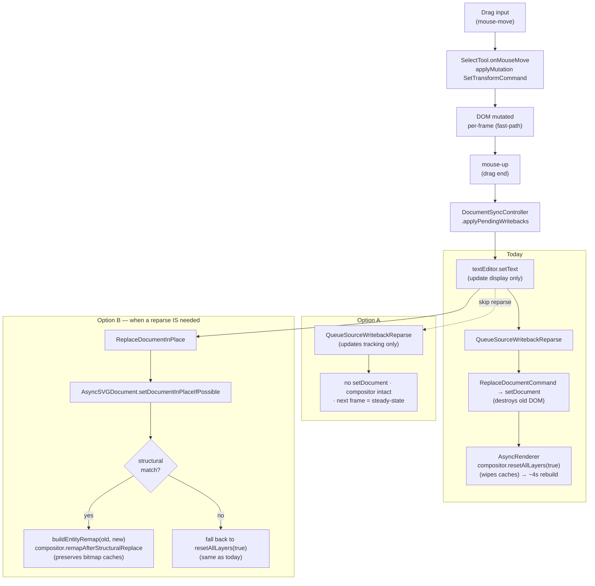

# Design: Drag-end latency elimination

**Status:** Design
**Author:** Claude Opus 4.7
**Created:** 2026-04-18

## Summary

On `donner_splash.svg` (892×512, 112 paths, 4 mandatory-promoted filter groups), mouse-up after a drag freezes the editor for ~4 seconds on real-Skia / ~400 ms on TinySkia. The freeze is the compositor rebuilding every cached bitmap from scratch after `AsyncSVGDocument::setDocument` — which fires because the editor's drag-end source-writeback path round-trips through a full `ReplaceDocumentCommand` reparse. This doc proposes a two-layer fix:

- **Option A (editor):** drop the drag-end `ReplaceDocumentCommand`. Source text has already been patched to match the live DOM; the reparse only refreshes source-offset pointers and destroys the compositor state in the process.
- **Option B (compositor):** give the compositor a way to survive a structurally-identical `setDocument` via entity remapping, so any path that unavoidably triggers a reparse (other source-pane edits, loading a saved file with same structure) gets the same perf preservation.

Both options are needed. Option A handles the self-generated writeback — the common case that caused the user-reported freeze. Option B handles everything else (source-pane edits, future features) and makes the compositor robust against a class of "DOM churn" that today destroys caches.

## Goals

- **Drag-end freeze under 50 ms on TinySkia / under 500 ms on real-Skia** for the splash document. Currently ~400 ms / ~4000 ms.
- **No crash regression** against the existing `ResetAllLayersAfterPromoteDoesNotCrash` test. The compositor must remain safe even if Option B's remapping heuristic gives up and falls back to the existing `resetAllLayers(documentReplaced=true)` path.
- **Layered fixes remain independent**: Option A can ship first with its own tests; Option B lands later without redoing Option A's work.
- **No compositor-correctness regression** against the `SplashDragWithBucketingAndMultipleFilterGroups` pixel test and the `DragEntityMutationKeepsMandatoryFilterLayerCached` test.

## Non-Goals

- Reducing the **first-drag-frame latency** (currently ~400 ms TinySkia / ~3200 ms real-Skia). That's a separate prewarm-ordering problem tracked separately.
- Cross-document entity remapping — Option B only handles "same SVG file re-parsed" cases. Swapping to a different document still triggers the full reset.
- Refactoring source-offset tracking to be cheap to refresh without reparse. Option A accepts that DOM source-offsets drift from patched source text; offset-driven features (click-element → jump-to-source-line) degrade gracefully.
- Eliminating the `setDocument` call itself from the editor. Source-pane edits legitimately need to reparse; we just don't want drag-end to masquerade as one.

## Next Steps

- Land Option A behind the existing regression tests (`SplashDragEndReplaceDocumentReplayLatency`). Tighten its budget once the reparse is gone. This is the fastest path to user relief.
- Scope Option B against a test that exercises "re-parse same bytes → compositor state preserved". That test doesn't exist yet; write it before the implementation so we know the success criterion.

## Implementation Plan

- [ ] Milestone A1: Drop the drag-end reparse
  - [ ] Step 1: Change `QueueSourceWritebackReparse` (donner/editor/SourceSync.cc) to update tracking state only — remove the `app.applyMutation(EditorCommand::ReplaceDocumentCommand(...))` call.
  - [ ] Step 2: Wire a new `DocumentSyncStats` counter (or extend an existing one) so tests can assert "N drag frames produced 0 setDocument calls."
  - [ ] Step 3: Retighten the `SplashDragEndReplaceDocumentReplayLatency` budget from 5000 ms to 50 ms on the TinySkia path; expect it to pass because the reset branch is never hit.
  - [ ] Step 4: Add an editor-level test exercising "drag → release → drag again" that asserts no setDocument call between drags.
  - [ ] Step 5: Run `bazelisk test //donner/editor/tests:all` and fix anything that depends on the reparse. Expected breakage: source-offset-driven features. Mark their tests with a TODO + link to Milestone A2.

- [ ] Milestone A2 (follow-on, post-A1): Source-offset refresh without reparse
  - [ ] Step 1: Identify the source-offset consumers (`donner::xml::XMLDocument` annotations, error-marker line mapping, element-to-source-line jumping). Grep for `SourceLocation` / `sourceOffset` / `xml::ParseOffset`.
  - [ ] Step 2: Add a lightweight "patch applied; bytes at [start, end) changed from len X to len Y" API that adjusts downstream offsets by `(Y - X)` from `start` onwards, without re-parsing.
  - [ ] Step 3: Wire `DocumentSyncController::applyPendingWritebacks` to call the offset-patch API for each transform writeback patch, so offsets stay correct without a reparse.
  - [ ] Step 4: Remove the A1 TODOs. Source-offset features work again.

- [ ] Milestone B1: Plumb a `ReplaceDocumentInPlace` signal
  - [ ] Step 1: Add `AsyncSVGDocument::setDocumentInPlaceIfPossible(SVGDocument newDoc)` — checks whether the new tree is structurally equivalent to the current one (same element count, same XML tag tree, same `id` attributes on all id-bearing elements). If yes, remaps entity data and bumps `documentGeneration` to a new sentinel class (`structurallyEquivalent=true`). If no, falls back to the existing `setDocument` path.
  - [ ] Step 2: Extend `RenderRequest` with a `documentReplaceKind` enum: `{None, FullReplace, StructurallyEquivalent}`. `AsyncRenderer` uses the enum to choose between full reset, remap-reset, or no-op.
  - [ ] Step 3: Editor's `QueueSourceWritebackReparse` (when A1 is not applied — i.e. the non-drag reparse cases) dispatches the "in-place if possible" variant.

- [ ] Milestone B2: Compositor entity remapping
  - [ ] Step 1: Extract a `buildEntityRemap(oldRegistry, newRegistry) -> flat_map<Entity, Entity>` helper that walks both trees in lockstep and matches by (tag name, id attribute, tree position). Fail (return empty) if any mismatch.
  - [ ] Step 2: Add `CompositorController::remapAfterStructuralReplace(const flat_map<Entity, Entity>& remap)`. Updates:
    - `activeHints_`: rebuild the map with new entity keys, and rebuild each `ScopedCompositorHint` in place against the new registry + new entity id.
    - `mandatoryDetector_` / `complexityBucketer_`: same treatment via their existing `releaseAllHintsNoClean` path + rebuild.
    - `layers_`: update each `CompositorLayer::entity_`, `firstEntity_`, `lastEntity_` through the remap. Preserve bitmap caches (they're entity-agnostic pixels) and `bitmapEntityFromWorldTransform_`.
    - `staticSegments_` / `staticSegmentsLayerCount_` / `backgroundBitmap_` / `foregroundBitmap_` / `splitStaticLayers*_`: preserved untouched; segment boundaries are recomputed from updated `layers_` on next `renderFrame`.
  - [ ] Step 3: `AsyncRenderer::workerLoop` switches on `RenderRequest::documentReplaceKind`: for `StructurallyEquivalent`, call `compositor_->remapAfterStructuralReplace(remap)` instead of `resetAllLayers(true)`.
  - [ ] Step 4: If `remapAfterStructuralReplace` fails an invariant check mid-remap (should not happen given A1 rejects mismatched structures, but defense-in-depth), fall back to `resetAllLayers(true)` automatically.

- [ ] Milestone B3: Tests
  - [ ] Step 1: `CompositorGolden_tests`: `SplashReparseSameBytesPreservesCaches` — parse splash, promote drag target, render drag frames, re-parse same bytes into a new document, remap, assert every cached bitmap pointer stable and the next render is steady-state-fast.
  - [ ] Step 2: `CompositorGolden_tests`: `ReparseDifferentStructureFallsBackToFullReset` — parse, promote, then parse a structurally-different doc. Remap must return empty; compositor must detect and fall back to full reset; no crash, correct pixels on next render.
  - [ ] Step 3: Editor integration test: simulate a non-drag source-pane edit that changes a transform attribute. Assert `remapAfterStructuralReplace` ran (not `resetAllLayers`).

## Background

Before this design:

- Drag frames apply `SetTransformCommand` each mouse-move, mutating the DOM incrementally. DOM is always the source of truth for the dragged element's position.
- Drag-end queues a "source writeback": patch the source text to reflect the final DOM transforms so the two stay in sync. The patch is applied via `textEditor.setText(...)`, which updates the displayed text only.
- Immediately after `setText`, `QueueSourceWritebackReparse` fires `EditorCommand::ReplaceDocumentCommand(patchedSource, preserveUndoOnReparse=true)`. This reparses the patched source into a brand-new `SVGDocument` and swaps it into the `AsyncSVGDocument::document_` optional — same storage address, new contents.
- The `AsyncRenderer` worker detects `documentGeneration` bumped, calls `compositor_->resetAllLayers(/*documentReplaced=*/true)`, and the next render rebuilds every segment, every layer bitmap, and bg/fg from scratch. Everything that survived drag steady-state is thrown away.

The compositor's caches are entity-keyed (`CompositorLayer::entity_`, `activeHints_` map keys, etc.). After `setDocument`, the old entity ids point into a destroyed `entt::registry`. The `documentReplaced=true` path defuses the hints to avoid SIGSEGV in `~ScopedCompositorHint`, then clears everything. Correctness is preserved; latency is catastrophic.

The two classes of `setDocument` calls:

1. **User-authored source-pane edits.** The DOM genuinely needs to be rebuilt because the source text has arbitrary changes. The compositor reset is unavoidable here (Option B addresses it with remapping when the new tree happens to match).
2. **Self-generated drag-end writebacks.** The DOM was already updated per-drag-frame via `SetTransformCommand`. The reparse is purely to refresh DOM source-offset pointers that downstream features rely on. Option A drops the reparse entirely for this case.

## Proposed Architecture



**Key structural insight for Option B:** the compositor's bitmap caches (segment bitmaps, layer bitmaps, bg/fg composites) are entity-agnostic — they're pixel buffers keyed by layer position in draw order. The only entity-dependent state is a set of integer ids (keys in `activeHints_`, fields inside `CompositorLayer` and `ScopedCompositorHint`). If two registries describe the same SVG tree, we can atomically substitute the new id set in for the old id set and keep the pixels.

**Structural-equivalence check** (Milestone B1 step 1): a new doc is "structurally equivalent" to the current one iff, walking both trees in preorder lockstep:
- Both visit the same number of elements.
- At every step the elements have the same XML tag name.
- At every step the elements have the same `id` attribute (or both have no `id`).
- `<defs>` subtrees match similarly (same resource ids + types).

Note that we deliberately do **not** require attribute values to match. The `transform` attribute will differ (that's the whole point of the writeback). Class lists, presentation attributes, and content can all change. Only the tree shape and id-based anchoring need to be stable.

If the check fails (new element, removed element, renamed id, restructured filter), we fall back to `resetAllLayers(true)` automatically. No correctness risk from an optimistic remap.

## API / Interfaces

### Option A

```cpp
// donner/editor/SourceSync.cc  — Option A changes
void QueueSourceWritebackReparse(EditorApp& app, std::string_view newSource,
                                 std::string* previousSourceText,
                                 std::optional<std::string>* lastWritebackSourceText) {
  *previousSourceText = std::string(newSource);
  *lastWritebackSourceText = *previousSourceText;
  // Self-generated writebacks update source text only; the DOM already
  // reflects the new state (via SetTransformCommand each drag frame).
  // No ReplaceDocumentCommand → no setDocument → no compositor reset.
  // Source-offset pointers in the DOM drift until Milestone A2 lands
  // an offset-patch path.
}
```

No public API changes. The function name stays (legacy), but the "Reparse" suffix becomes a misnomer — could rename to `RecordSourceWriteback` in a follow-up.

### Option B

```cpp
// donner/editor/AsyncSVGDocument.h  — new method
class AsyncSVGDocument {
 public:
  // Replace the inner SVGDocument with `newDoc`. If `newDoc` is
  // structurally equivalent to the current doc (same XML shape, same
  // ids), bumps `documentGeneration` with the StructurallyEquivalent
  // flag set so downstream consumers can remap rather than reset.
  // Returns the kind of replacement that occurred.
  enum class ReplaceKind { NoOp, Structural, FullReplace };
  ReplaceKind setDocumentInPlaceIfPossible(svg::SVGDocument newDoc);
};

// donner/editor/AsyncRenderer.h  — new field on RenderRequest
struct RenderRequest {
  enum class ReplaceKind : uint8_t { None, FullReplace, StructurallyEquivalent };
  ReplaceKind documentReplaceKind = ReplaceKind::None;
  // ... existing fields ...
};

// donner/svg/compositor/CompositorController.h  — new method
class CompositorController {
 public:
  // Remap cached state from old entity ids to new ones after a structurally-
  // equivalent setDocument. Returns true iff remap succeeded. On false, the
  // caller must fall back to resetAllLayers(true) — the compositor is in an
  // indeterminate state and must be rebuilt.
  //
  // Preconditions:
  //   - Every (old → new) pair in `remap` is a valid entity in the NEW
  //     registry (the one document_->registry() now points to).
  //   - The compositor's activeHints_, detectors, and layers_ only reference
  //     entities that appear as keys in `remap` — anything outside is an
  //     invariant violation and triggers the fallback.
  [[nodiscard]] bool remapAfterStructuralReplace(
      const donner::base::flat_map<Entity, Entity>& remap);
};
```

### Structural-equivalence + remap builder

```cpp
// donner/editor/DocumentStructure.h  — new helper
namespace donner::editor {

/// Walks two SVG document trees in lockstep and builds an entity id
/// remap (`oldEntity → newEntity`). Empty map means the trees are not
/// structurally equivalent and the caller must fall back to a full
/// document replacement.
donner::base::flat_map<Entity, Entity> BuildStructuralEntityRemap(
    const svg::SVGDocument& oldDoc, const svg::SVGDocument& newDoc);

}  // namespace donner::editor
```

## Data and State

### Threading invariants (unchanged)

- UI thread owns `AsyncSVGDocument` and produces `RenderRequest`s.
- Worker thread owns `CompositorController` and is the only caller of `remapAfterStructuralReplace` / `resetAllLayers`.
- The `documentReplaceKind` flag on `RenderRequest` is produced on the UI thread (by `setDocumentInPlaceIfPossible`'s return value, which the editor stashes) and consumed on the worker.
- `BuildStructuralEntityRemap` runs on the UI thread before the request is posted. The remap is serialized into `RenderRequest` as a `flat_map<Entity, Entity>`. Both registries are accessible on the UI thread (the old doc is about to be destroyed by the swap; the new doc hasn't been given to the worker yet).

### Lifetime of the remap map

Produced on UI thread. Stored in `RenderRequest::structuralRemap`. Read once on the worker in `remapAfterStructuralReplace`, then dropped with the rest of the request. ~tens of bytes per entity, ~200 entities for splash = ~4 KB. Not a concern.

### Cached bitmap ownership

Unaffected. `CompositorLayer::bitmap_` is a `RendererBitmap` (owns its pixel vector). Remap updates the layer's entity id and firstEntity/lastEntity fields; the bitmap stays bit-identical. Same for segments and bg/fg.

## Error Handling

### Option A

No new error paths. The removed `applyMutation` call could previously fail in `AsyncSVGDocument::applyOne` (e.g., parse error on the patched source). Removing it means we no longer detect a patch that produces invalid SVG. That's acceptable: the patch is a pure byte-level transform-attribute edit, and the DOM was already correctly mutated. The worst failure mode is the source text showing valid-looking text that would fail to reparse cleanly — but we're not reparsing, so it doesn't matter at runtime.

### Option B

`remapAfterStructuralReplace` is defensive. Every lookup that fails an invariant check (missing entry in the remap, new entity id invalid in the new registry, etc.) short-circuits the remap and returns `false`. The caller (`AsyncRenderer`) treats `false` as "fall back to full reset":

```cpp
if (request.documentReplaceKind == ReplaceKind::StructurallyEquivalent) {
  if (!compositor_->remapAfterStructuralReplace(request.structuralRemap)) {
    // Remap hit an invariant — compositor may be partially updated, so
    // fall back to the safe path. No worse than the pre-B1 behavior.
    compositor_->resetAllLayers(/*documentReplaced=*/true);
  }
}
```

## Performance

### Option A numbers

- **Today:** drag-end = ~400 ms TinySkia / ~4000 ms real-Skia (measured via `SplashDragEndReplaceDocumentReplayLatency`).
- **With A1:** drag-end = 0 compositor work (no reset, no rebuild). Editor-side work is just the text patch application, which is sub-ms for a few-byte change. Budget: under 10 ms end-to-end on TinySkia.

### Option B numbers

- **`remapAfterStructuralReplace` cost:** O(entities-with-compositor-state). For the splash: 1 drag entity + 3 mandatory filter layers + their subtree bookkeeping = a few dozen id rewrites. Sub-millisecond.
- **Next render after remap:** steady-state fast path. Caches are valid, segments unchanged, bg/fg composites unchanged. Should match the ~0.06 ms/frame the `SplashPrewarmMakesFirstDragFree` test records after a warmed-up drag.

### Measurement plan

- Extend the existing `SplashDragEndReplaceDocumentReplayLatency` test with two new variants keyed on the `ReplaceKind`:
  - `NoReparse`: drops the reparse (Option A). Budget: < 50 ms TinySkia.
  - `StructurallyEquivalent`: uses the remap path (Option B). Budget: < 100 ms TinySkia.
- Keep the existing `FullReplace` variant as the worst-case gate (5000 ms budget) so a regression that accidentally forces everyone through the full-reset path gets loud.

## Testing and Validation

### Unit tests

- `CompositorGolden_tests::SplashReparseSameBytesPreservesCaches` — parse, promote, drag, re-parse same bytes, verify: (a) `layerBitmapOf(glowA).pixels.data()` stable across the reparse, (b) next render is < 1 ms, (c) rendered pixels match what they were before the reparse.
- `CompositorGolden_tests::ReparseDifferentStructureFallsBackToFullReset` — parse, promote, drag, re-parse structurally-different bytes (added a `<rect>`), verify the fallback path ran (via `resetAllLayers(true)`), no crash, next render is correct.
- `CompositorGolden_tests::RemapPreservesBitmapsOnTransformOnlyChange` — equivalent to the above but with a transform-attribute change (the actual drag-end writeback case).

### Integration tests

- `AsyncRenderer_tests::SplashShapeDragDoesNotTriggerResetAllLayers` — drive drag + mouse-up + writeback flow; assert `compositorResetCountForTesting() == 0`.
- `editor_sync_tests`: new test that distinguishes `ReplaceKind::Structural` vs `ReplaceKind::FullReplace` on the document-generation boundary.

### Crash tests

- Existing `ResetAllLayersAfterPromoteDoesNotCrash` stays as-is — validates the fallback path is still safe.
- New: `RemapAfterStructuralReplaceCrashSafe` — exercises a remap followed by a drag frame, plus an adversarial variant where the remap builder receives corrupted input (nullptr new entities for some keys) to verify the invariant checks trigger cleanly and fall back to reset.

### Performance gates

- Extend the perf matrix in `compositor_golden_tests`:
  - `SplashDragEndReplaceDocumentReplayLatency_NoReparse`: < 50 ms TinySkia.
  - `SplashDragEndReplaceDocumentReplayLatency_Structural`: < 100 ms TinySkia.
  - `SplashDragEndReplaceDocumentReplayLatency_FullReplace`: < 5000 ms TinySkia (existing, renamed for clarity).

## Rollout Plan

1. **Option A first (self-contained editor change):** land Milestone A1 behind a feature flag (`donner.configure(disable_drag_end_reparse = True)`), default off. Run it in local dev for a week. No compositor changes. Once we've verified source-offset-dependent features degrade gracefully (not catastrophically), flip the default on.
2. **Milestone A2 (offset patch):** address the remaining source-offset drift from A1. No flag needed; purely additive.
3. **Option B (multi-PR):** land the `AsyncSVGDocument::setDocumentInPlaceIfPossible` machinery first (Milestone B1), then the compositor `remapAfterStructuralReplace` (B2). Each of these is testable in isolation via the new golden tests. No flag needed; wired through `RenderRequest::documentReplaceKind` so behavior is explicit per-request.

## Alternatives Considered

- **"Cache bitmap on SVGDocument itself"**: make the compositor's cached bitmaps survive `setDocument` because they're attached to the new document too. Requires entities to map across documents, which is the same problem Option B solves more directly. Rejected for being fuzzier.
- **"Defer the reparse to an idle time"**: keep the reparse but run it in the background so drag-end is responsive. Rejected: the compositor reset still happens eventually, and the user feels it as a freeze the moment they do anything non-trivial after drag.
- **"Don't update the source text on drag-end at all"**: would eliminate the reparse but means source-pane becomes stale indefinitely. Cross-pane consistency is a user expectation; this breaks it. Rejected.
- **"Reparse but preserve entity ids"**: would require the XML parser + DOM builder to honor "use these specific entity ids for these elements." Deep refactor of entt integration. Rejected in favor of Option B's post-hoc remap, which only touches the compositor.

## Open Questions

- **A2 viability**: is the source-offset adjustment algorithm as trivial as "shift all offsets >= patch.start by (patch.newLen - patch.oldLen)"? If elements nested inside the patched region also carry offsets, we need per-element recalculation. Need to inspect the actual downstream consumers before committing to an approach.
- **id-less elements in B1**: the structural-equivalence check uses `id` attributes as an anchor. Elements without ids get matched purely by tree position. Is that stable enough across a self-generated writeback? The writeback only changes attribute values, not tree shape, so it should be — but worth a test that explicitly covers no-id elements.
- **B2 interaction with `ComplexityBucketer`**: buckets are selected by cost thresholds. A structurally-identical reparse should produce identical bucketing decisions, so the bucket set should be stable. But the bucketer's hint set is keyed by entity id and holds `ScopedCompositorHint`s. The remap needs to rebuild each hint in place against the new registry, not just rename keys. Confirm the approach handles this cleanly.

# Future Work

- [ ] **P1**: Teach `CompositorController` to detect "nothing about this entity's subtree changed semantically" across a reparse — if true, skip even the per-layer dirty-mark that `remapAfterStructuralReplace` doesn't protect against. Would let structurally-identical reparses produce pixel-identical output with zero compositor work.
- [ ] **P2**: Generalize Option A's pattern to other editor mutations that currently round-trip through `ReplaceDocumentCommand` (element removal, attribute edits). Each can potentially skip the reparse if the DOM mutation already happened through a targeted command.

- [ ] **P1: Incremental GL-upload discipline via `snapshotTilesForUpload`** ALREADY LANDED. The compositor exposes segments + promoted layers as a paint-ordered list of `CompositorTile`s, each carrying a stable `tileId` (encoded from boundary entities for segments, entity id for layers) and a monotonic `generation` counter. Editor's GL texture cache keys on `tileId`, re-uploads only when `generation` advances. On click-to-drag this is ≤ 3 uploads (the two split-segment halves + the new drag-target layer). See the `ClickToDragAdvancesAtMostThreeTileGenerations` test for the invariant gate. REMAINING: wire `snapshotTilesForUpload` through `AsyncRenderer::RenderResult` to replace the bg / drag / fg triple; rewrite `GlTextureCache` as a `tileId → GL texture` map; update `RenderPanePresenter` to iterate tiles in paint order. Once that's done, `recomposeSplitBitmaps` goes away (no CPU-side bg/fg composite) — drag-start drops another ~175 ms on the splash.

- [ ] **P1: Deferred tile regeneration via per-tile `Transform2d`** — for scale / rotate interactions, allow a tile's cached bitmap to be displayed with a GPU-side transform applied (the previous texture scaled or rotated to roughly match the new DOM state) while the correct bitmap rasterizes asynchronously on a background thread. When the async rasterize lands, the transform snaps back to identity and the editor swaps to the sharp texture. Requires:
  1. Extending `CompositorTile` with a `deferredTransform: Transform2d` field (identity when the tile's bitmap is up-to-date; a delta when the tile is showing stale content with a GPU correction). The current `compositionTransform` field — which we already return per tile — is the seam this builds on. For drag-translate today the delta is a pure translation; scale/rotate just extends the delta's degrees of freedom.
  2. A background rasterization queue in `CompositorController` (or a worker pool) that picks up dirty tiles and hands back fresh bitmaps without blocking `renderFrame`. Fits the existing `rasterizeLayer` / `rasterizeDirtyStaticSegments` codepaths — they become the "eagerly now" mode; the background queue is "eagerly later."
  3. An artifact budget per interaction kind — translation can tolerate up to ~2 px of slop before the user notices, scale up to ~5% of texel size, rotate ~2° — that gates how long we're willing to display the pre-corrected texture before forcing a synchronous re-rasterize.

- [ ] **P2: Immediate-mode spans within the tile list** — not every range of entities benefits from the render-to-texture cache. A span of cheap-to-render content (simple rects, a short frequently-mutated subtree, or non-filter content wedged between two filter layers) pays the offscreen-creation + memory-bandwidth tax without compensating savings, because we re-rasterize it on most interactions anyway. Introduce a per-span policy:
  1. **Cached** (current default) — render-to-texture, cache the bitmap, upload to GL, blit at compose time. Pays fixed per-tile overhead; amortizes across frames.
  2. **Immediate** — let the compositor keep this span in the draw-order traversal for the main render call, rendering it inline every frame. No tile, no texture, no cache invalidation bookkeeping. Costs one traversal per frame; wins when the content is cheap or changes constantly.
  The policy decision is a function of span complexity (entity count, filter/mask presence) + mutation frequency (dirty-entity samples over the last N frames). `ComplexityBucketer` and `MandatoryHintDetector` already produce similar signals; extend them to emit an `ImmediateSpan` policy hint the resolver respects. Editor-facing API: `snapshotTilesForUpload` interleaves `CompositorTile`s for cached spans with `ImmediateSpan` markers for direct-render spans; the editor's composition step either blits a texture or delegates to `RendererDriver::drawEntityRange` for the immediate range.

- [ ] **P1: Geode-backend prep (only cache filter layers, immediate-render everything else)** — the Geode renderer's GPU architecture makes most non-filter content free-to-redraw, so the render-to-texture caching overhead is net-negative for anything cheaper than a filter. Wire the policy machinery above so Geode flips the default from "cache everything" to "cache only filter/mask/clip-path layers," with the rest rendered immediately from the DOM on each frame. Should preserve the ≤ 3-upload discipline on click-to-drag (a filter layer split still needs the texture update) while dramatically cutting the compositor's memory footprint and upload bandwidth on Geode. Expected Geode-specific tiles per frame: O(number of filter effects), not O(paint-order spans).
