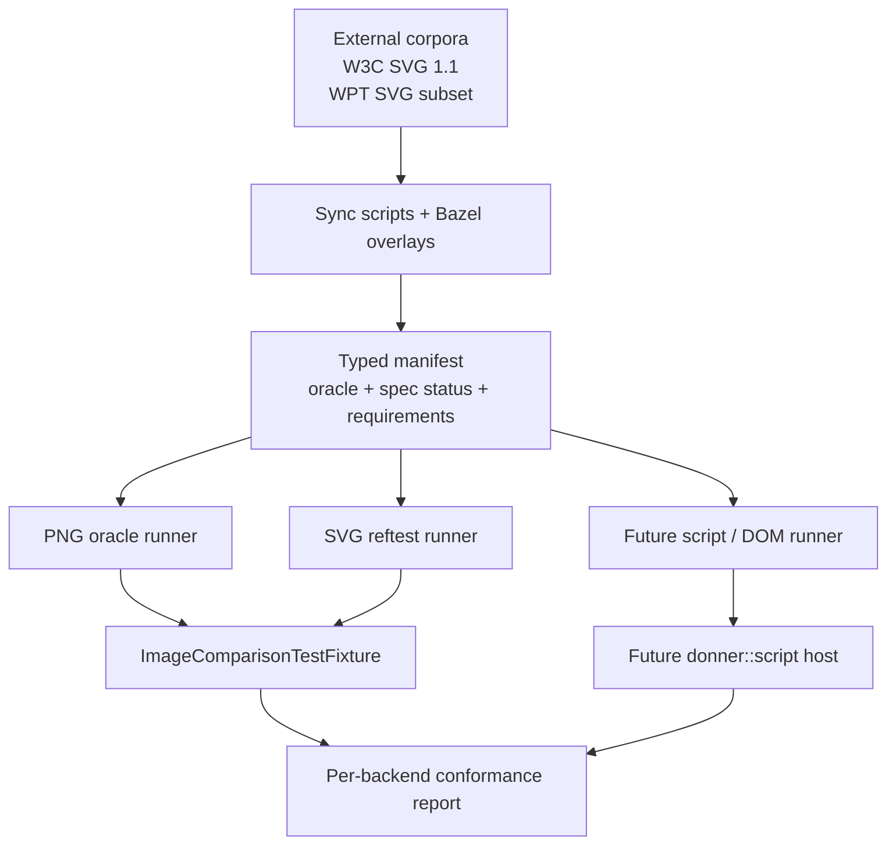

# Design: SVG Conformance Testing

**Status:** Draft
**Author:** GPT-5 Codex
**Created:** 2026-04-16

## Summary

Donner already has strong renderer regression coverage: unit tests, fuzzers,
hand-authored golden tests, and the upstream `resvg-test-suite`. What it does
not yet have is a broader **spec-oriented conformance program** that combines
multiple external suites and cleanly separates:

- static rendering cases we can run today,
- legacy SVG 1.1 cases we intentionally do **not** plan to pass under SVG 2,
- and future DOM / animation / event / script cases that only make sense once
  the `origin/scripting` branch lands.

This design adds a manifest-driven conformance layer on top of the existing
`ImageComparisonTestFixture` infrastructure. Phase 1 starts with the W3C SVG
1.1 filter corpus because it is easy to wire into Donner's current
golden-image runner and exercises the exact feature area the user asked about.
Phase 2 adds curated SVG 2 era tests from web-platform-tests (WPT) that are
still purely static. Phase 3, on top of the scripting design in
`origin/scripting`, adds a separate harness for WPT-style scripted, DOM, and
animation tests.

The core design rule is:

**Treat conformance suites as typed inputs, not as one giant bag of SVG
files.** Each case records its oracle type (`png`, `svg-ref`, `script-harness`,
`manual`), spec status (`current SVG 2`, `legacy-but-still-supported`,
`removed-from-SVG-2`), and runtime requirements (`filters`, `text`, `script`,
`animation`, `browser-host`). That keeps CI honest and prevents deprecated SVG
1.1 features from quietly turning into misleading release blockers.

## Goals

- Add an external conformance lane beyond `resvg-test-suite`, starting with the
  SVG 1.1 filter tests that are runnable with Donner's current renderer-only
  harness.
- Reuse Donner's existing golden-image test fixture and Bazel patterns instead
  of inventing a second unrelated rendering test stack.
- Model conformance cases explicitly enough that deprecated SVG 1.1 features
  like `enable-background`, `BackgroundImage`, and `BackgroundAlpha` remain
  visible but do not count as SVG 2 regressions.
- Establish a practical answer to "what is the SVG 2 equivalent?":
  WPT is the living SVG 2 era corpus, but only a subset is static and
  renderer-only.
- Define a future scripted-test lane that matches the architecture in
  `origin/scripting:docs/design_docs/scripting.md` without blocking the
  immediate static test work on that branch landing first.
- Produce conformance outputs that are meaningful per backend (`tiny-skia`,
  `skia`, later `geode`) and per feature tier (`text`, `text-full`, `script`).

## Non-Goals

- Replacing `resvg-test-suite`. It remains Donner's primary upstream
  cross-engine rendering regression suite.
- Running the entire WPT repository inside Donner.
- Claiming support for SVG 1.1 features that SVG 2 removed, such as
  `enable-background`, just because an old suite contains them.
- Building a browser engine on `main`. Script, DOM, event, and animation
  conformance stays out of scope for the immediate work and depends on the
  separate scripting design.
- Making browser screenshot comparison a mandatory part of every PR gate.
- Solving manual-test authoring or WPT upstream contribution workflow in the
  first milestone.

## Next Steps

- Land a pilot suite for the static SVG 1.1 filter corpus using a new
  manifest-driven conformance runner that reuses `ImageComparisonTestFixture`.
- Add a curated WPT SVG snapshot plan for static reftests only; do not vendor
  the whole WPT repo.
- Keep the future script/animation lane explicitly gated on the milestones in
  `origin/scripting:docs/design_docs/scripting.md`.

## Implementation Plan

- [ ] **M1** — Manifest format, Bazel overlays, and the SVG 1.1 filter pilot
- [ ] **M2** — Static SVG 2 / WPT reftest lane
- [ ] **M3** — CI policy, reporting, and documentation
- [ ] **M4** — Scripted / DOM / animation conformance on top of `donner::script`

## Background

### Current Donner state

Donner currently validates rendering through four main layers:

- focused unit tests,
- fuzzers for parser and hostile-input surfaces,
- hand-authored renderer goldens under `donner/svg/renderer/testdata/`,
- and the vendored upstream `resvg-test-suite`.

That last suite is already valuable, but it is not the same thing as a spec
conformance program:

- it is authored around `resvg`'s corpus and naming,
- it reflects `resvg`'s choices about what to test,
- it includes intentional skips and golden overrides that are specific to
  Donner's current implementation history,
- and it does not cover future DOM / script behavior.

### External suites relevant to Donner

The [SVG 2 testing requirements](https://www.w3.org/Graphics/SVG/WG/wiki/Testing_Requirements)
document explicitly calls out three test forms that matter here: SVG-vs-SVG
references, SVG-vs-PNG references, and non-static tests for animation and the
DOM driven by JavaScript. It also notes that filters and gradients are examples
where PNG references are appropriate.

WPT's
[`svg/README.md`](https://github.com/web-platform-tests/wpt/blob/master/svg/README.md)
says its `import/` directory contains tests imported from the SVG 1.1 Second
Edition test suite, and that the old suite shipped reference PNGs which are
especially useful for filters. The same README also explains that current SVG
tests are organized into reftests and scripted tests under the SVG chapter
directories.

That gives Donner a clear split:

1. **Immediate static opportunity**:
   add the SVG 1.1 filter corpus, because it already fits Donner's
   renderer-only model.
2. **SVG 2 era static opportunity**:
   add curated WPT SVG reftests whose reference side is still renderable by
   Donner.
3. **Future dynamic opportunity**:
   add WPT scripted / animation / DOM tests only after Donner's scripting,
   event, and virtual-time models exist.

### Answer to "is there an equivalent for SVG 2?"

Not as one tidy "34 SVG files + reference PNGs" package.

The SVG 2 era equivalent is the **living WPT SVG corpus**, which mixes:

- imported SVG 1.1 manual tests,
- static reftests,
- script-driven DOM tests,
- animation timing tests,
- and chapter-specific reference resources.

So the right design is not "vendor one more monolithic suite". The right design
is "vendor typed subsets with different runners".

## Requirements and Constraints

- **Deterministic and offline after fetch**: once the test repositories are
  fetched by Bazel, all runs must be local-only. No network access during test
  execution.
- **No giant dependency blast radius**: avoid vendoring the entire WPT repo.
  Prefer a curated snapshot containing only the SVG paths and resources Donner
  actually consumes.
- **Works with existing runner infrastructure**: the new static suites should
  use `ImageComparisonTestFixture` and the same threshold / skip machinery used
  by `resvg_test_suite`.
- **Per-case metadata must be explicit**:
  oracle type, SVG-version status, backend requirements, optional feature
  requirements, and expected triage state all need to be declared in data, not
  rediscovered ad hoc from filenames.
- **SVG 2 positioning must stay honest**:
  removed SVG 1.1 features remain documented and runnable as informational
  legacy cases, but they must not silently become "Donner failing SVG 2".
- **Presubmit cost must be controlled**:
  the initial PR gate should be small enough to run on every change affecting
  rendering, while the broader conformance matrix can shard or run in slower
  lanes.
- **Backend-aware**:
  Geode, text tiers, and future script support should be modeled as feature
  gates, not hard-coded special cases in each test file.

## Proposed Architecture

### High-level structure



### Data model

Add a generated manifest-backed `ConformanceCase` table. The checked-in source
of truth is JSON plus codegen to a C++ `.inc`, so the test binary has zero new
runtime parsing dependencies.

```cpp
enum class ConformanceOracle {
  PngReference,
  SvgReference,
  ScriptHarness,
  Manual,
};

enum class ConformanceSpecStatus {
  Svg2Current,
  Svg11LegacySupported,
  Svg11RemovedFromSvg2,
};

enum class ConformanceRequirement {
  Filters,
  Text,
  TextFull,
  Animation,
  Script,
  BrowserHost,
  ExternalResources,
};

struct ConformanceCase {
  std::string id;                  // stable ID: suite/category/name
  std::string suite;               // svg11-w3c, wpt-svg, resvg-adjacent
  std::string category;            // filters, text, struct, ...
  std::string inputPath;           // primary SVG or HTML resource
  ConformanceOracle oracle;
  std::string referencePath;       // .png or ref.svg when applicable
  std::vector<std::string> resources;
  std::vector<ConformanceRequirement> requirements;
  ConformanceSpecStatus specStatus;
  ImageComparisonParams params;    // threshold / skip / feature gates
  std::string note;                // reason string for legacy / skip / TODO
};
```

### Why a typed manifest instead of another giant C++ map

`resvg_test_suite.cc` can afford to keep overrides inline because it targets a
single upstream repository with one runner shape. That does not scale to a
multi-source conformance program where:

- some cases compare SVG to PNG,
- some compare SVG to reference SVG,
- some are future script harness cases,
- and some are intentionally legacy-only.

The manifest makes the runner generic and pushes suite-specific policy into
data instead of test-binary code.

### Suite layout

#### 1. `svg11_w3c_png_conformance`

Purpose: immediate pilot for the SVG 1.1 filter corpus.

- Input: SVG from the W3C SVG 1.1 suite (or the matching WPT import snapshot).
- Oracle: reference PNG.
- Runner: existing image-comparison fixture.
- Initial scope: accepted filter cases first.
- Expected legacy handling:
  cases depending on `enable-background`, `BackgroundImage`, or
  `BackgroundAlpha` are present in the manifest with
  `Svg11RemovedFromSvg2` status and `Params::Skip(...)`.

This lane answers the user's immediate question with the lowest engineering
risk.

#### 2. `svg2_wpt_static_reftests`

Purpose: curated SVG 2 era coverage without requiring JS.

- Input: selected WPT SVG tests whose reference side is another SVG Donner can
  render.
- Oracle: render test input and reference input through the same backend and
  compare the resulting images.
- Inclusion criteria:
  - no JavaScript required,
  - no HTML-only reference page,
  - no manual pass criteria,
  - deterministic under Donner's current virtual-document model.

This becomes the actual SVG 2 era conformance lane for renderer-only behavior.

#### 3. `svg2_wpt_scripted`

Purpose: future DOM / event / animation / script conformance.

- Input: selected WPT scripted tests, plus Donner-authored compatibility tests
  for gaps where WPT assumes a full browser shell.
- Oracle: pass/fail result from a scripted harness, optionally plus reference
  rendering when the test is a script-driven reftest.
- Dependencies:
  `origin/scripting:docs/design_docs/scripting.md`, especially M1-M7 around
  context limits, DOM exposure, event dispatch, and corpus testing.

This runner is intentionally separate from the static image-comparison lane.

### Repository and Bazel layout

Add two new test-only external snapshots:

- `@svg11-test-suite`
- `@wpt-svg`

Both are wired the same way `@resvg-test-suite` is wired today:

- test-only overlay BUILD files in `third_party/`,
- filegroups for test inputs and resources,
- fetched only as non-BCR development dependencies.

Do **not** point Bazel at the full WPT repository. Instead, keep a sync script
under `tools/conformance/` that exports a minimal SVG-only snapshot:

- selected `svg/` test directories,
- required shared resources,
- matching metadata files where needed.

This keeps repository fetches and CI output manageable.

### Runner behavior

#### PNG oracle runner

Uses `ImageComparisonTestFixture` directly:

1. Load the input SVG.
2. Render through the active backend.
3. Compare against the reference PNG.
4. Apply existing `ImageComparisonParams` semantics for thresholds, backend
   gates, and explicit skips.

This is nearly identical to today's `resvg_test_suite`.

#### SVG reference runner

Also uses `ImageComparisonTestFixture`, but renders **both** the test and the
reference through Donner:

1. Render the candidate file.
2. Render the reference SVG.
3. Compare the two outputs with the same pixel matcher.

This matches WPT reftest semantics more closely than freezing browser
screenshots, while staying deterministic and backend-local.

The runner only accepts cases where the reference side is SVG (or another
format Donner already renders, such as standalone image references resolved by
the test loader). HTML reference pages remain out of scope for the static lane.

#### Future scripted runner

The scripted runner does **not** share the static runner's execution model.
Instead it needs:

- a deterministic document host with `donner::script::Context`,
- resource serving for WPT-style local assets,
- a virtual clock for animation and event timing,
- pass/fail reporting compatible with testharness-style assertions,
- and optional image comparison for script-driven reftests.

That work belongs on top of the scripting branch, not ahead of it.

## CI and Reporting

### Presubmit policy

Phase 1 should keep PR gating conservative:

- run the SVG 1.1 filter pilot on the default backend in presubmit,
- run the larger matrix (`tiny-skia`, `skia`, text tiers, later geode) in
  slower or sharded lanes,
- only promote new suites into `tools/presubmit.sh` once their failure modes
  are stable and their skips are intentionally triaged.

### Reporting

Each suite should emit a machine-readable summary:

- total cases,
- passing cases,
- skipped legacy cases,
- skipped known feature gaps,
- backend-specific failures,
- and counts split by `ConformanceSpecStatus`.

This keeps "we fail 12 SVG 2 tests" separate from
"we intentionally skip 7 removed SVG 1.1 features".

The roadmap and release checklist can then reference a concrete conformance
report rather than an informal test run.

## Security / Privacy

These suites are untrusted inputs and must be treated like fuzz corpus inputs:

- test execution is local-only after fetch,
- external resource access stays under the existing sandboxed loader rules,
- the static runners never execute JavaScript,
- and the future scripted runner inherits the hard limits from the scripting
  design (`memory`, `wall-clock`, `call depth`, no network, no filesystem).

For the future browser-hosted / script-harness lane, the trust boundary is much
sharper:

- WPT resources must be served from a local test server only,
- no live internet dependencies,
- and Donner's script host must preserve the same "untrusted input never
  crashes or escapes" invariant the scripting doc requires.

## Testing and Validation

### Immediate validation for M1

- Unit-test the manifest codegen so a malformed case fails at generation time,
  not halfway through a Bazel test.
- Add runner self-tests covering:
  - PNG oracle case loading,
  - legacy skip classification,
  - missing resource detection,
  - and suite/category filtering.
- Run the SVG 1.1 filter pilot on both `tiny-skia` and `skia`.
- Verify legacy `enable-background` / `BackgroundImage` /
  `BackgroundAlpha` cases are present and explicitly skipped with
  `Svg11RemovedFromSvg2` status.

### Validation for M2

- Add a small curated WPT static subset first, not a large dump.
- Include at least one test from each runner shape:
  - pure SVG reftest,
  - SVG + external resource reftest,
  - and a case intentionally rejected because it requires HTML or JS.
- Confirm the runner reports reftest-specific diagnostics cleanly:
  input path, reference path, backend, pixel diff.

### Validation for M4

On the scripting branch:

- reuse the corpus and release-gate model from
  `origin/scripting:docs/design_docs/scripting.md`,
- add a minimal WPT-scripted smoke subset first,
- and only then grow into broader DOM/event/animation conformance.

## Alternatives Considered

### A1: Keep relying on `resvg-test-suite` only

Pros:

- zero new infrastructure,
- already integrated,
- already understood by contributors.

Cons:

- no independent external conformance lane,
- no direct answer for the W3C filter corpus,
- no structured path toward SVG 2 / WPT / scripted testing.

Rejected because it does not solve the user's request or the roadmap's
conformance goals.

### A2: Vendor the full WPT repository

Pros:

- simplest story from a provenance perspective,
- all SVG tests available immediately.

Cons:

- repository and fetch size explosion,
- most tests irrelevant to Donner,
- many cases unusable without a full browser environment.

Rejected because the cost is too high for a renderer library.

### A3: Use browser screenshots as the oracle for all SVG 2 tests

Pros:

- no need to interpret WPT reftest metadata locally,
- easy to explain.

Cons:

- heavier and flakier,
- makes renderer-only tests depend on a browser stack,
- hides whether a failure is in Donner or in the screenshot-generation step.

Rejected for the initial phases. Browser-driven or browser-adjacent oracles may
still be useful later for scripted compatibility work.

## Open Questions

- Should the SVG 1.1 filter pilot use the original W3C archive directly, or a
  curated WPT import snapshot that preserves the same files plus metadata?
- Do we want the manifest source of truth to live entirely in JSON, or split
  into generated "inventory JSON" plus a small hand-authored C++ override table
  for thresholds and legacy classifications?
- For WPT static reftests, what is the exact allowlist policy for HTML
  reference files and CSS-heavy harness files that Donner cannot interpret as a
  document?
- When the scripting lane lands, do we want a Donner-native testharness
  adapter, or a smaller compatibility layer that only supports the WPT SVG
  subsets we actually plan to run?

## Dependencies

- Existing:
  `ImageComparisonTestFixture`, `Runfiles`, `ImageComparisonParams`,
  `@resvg-test-suite` patterns, sandboxed resource loading.
- New test-only external data snapshots:
  `@svg11-test-suite`, `@wpt-svg`.
- Future scripted lane:
  `donner::script` from `origin/scripting:docs/design_docs/scripting.md`.

## Future Work

- [ ] Expand beyond filters into other SVG 1.1 SVG-vs-PNG categories where the
      references are still meaningful for SVG 2 behavior.
- [ ] Add curated WPT SVG text, structure, masking, and painting reftests as
      static coverage.
- [ ] Add animation reftests driven by Donner's virtual clock once the
      animation system lands.
- [ ] Add WPT-style DOM and event tests once `donner::script` exposes the
      required interfaces and event dispatch semantics.
- [ ] Publish a backend-by-backend conformance dashboard and reference it from
      `docs/ProjectRoadmap.md` and release criteria.
