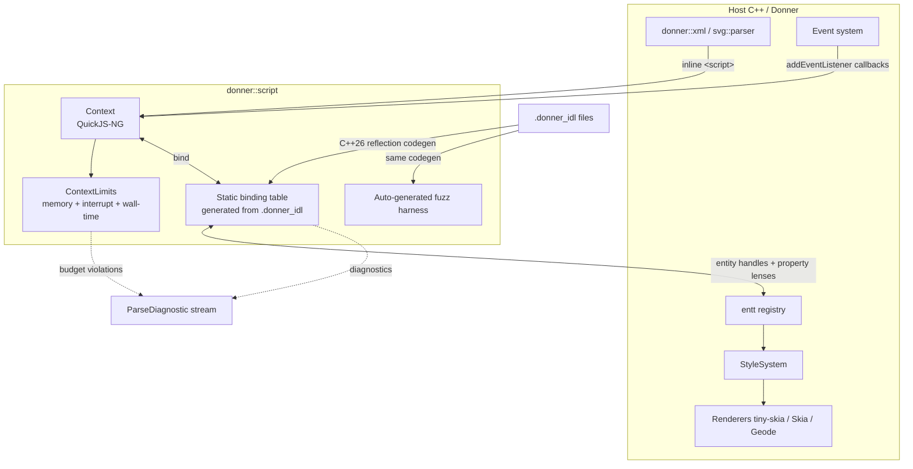
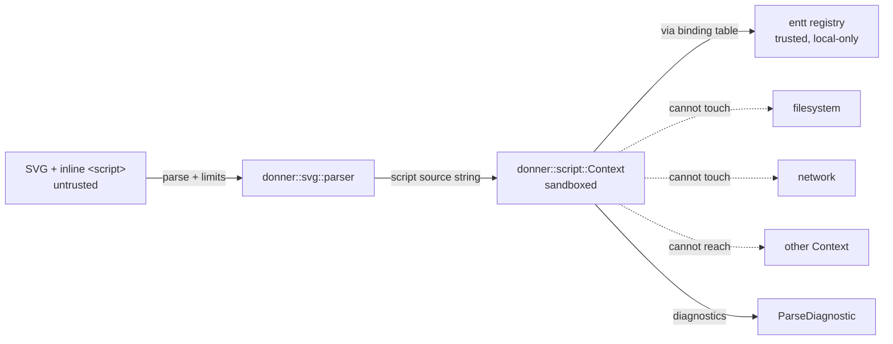

# Design: Donner Scripting (`donner::script`)

**Status:** Draft
**Author:** Claude Opus 4.6
**Created:** 2026-04-12

## Summary

SVG2 defines inline `<script>`, DOM scripting, and event handlers. Every
parallel SVG engine (resvg, librsvg, batik when used as a renderer) punts on
these, creating the largest functional gap between Donner and a real browser
for SVG. Adding scripting *well* is the single most differentiating feature
Donner can ship — and Donner is uniquely positioned to do it, because the DOM
in Donner is already an ECS.

This doc proposes `donner::script`: an embedded QuickJS-NG runtime, a
compile-time IDL codegen pipeline (built on C++26 static reflection) that
projects the ECS as the DOM, and a hard sandbox that extends Donner's
"never crash on untrusted input" invariant across the scripting boundary.

The design invariant is that **the DOM is a projection of the ECS, not a
parallel object graph**. Script handles are entity references with type
information; `NodeList` liveness comes from entt views, not from
hand-maintained mirrors; `element.style.foo` and CSS `--foo` share one storage
representation; events dispatch along entt parent links.

## Goals

- Donner executes inline `<script>`, `on<Event>=` attribute handlers, and
  SMIL-triggered scripts in a deterministic, sandboxed context — suitable for
  rendering untrusted SVGs from the web with the same safety posture as the
  parser.
- A curated subset of DOM Core + SVG IDL, chosen to cover real-world SVG
  interaction scripts (see §Non-Goals for what is explicitly out), is
  reachable from JS.
- Per-document CPU and memory budgets are **hard caps** enforced by the
  runtime. Exceeding either surfaces a `ParseDiagnostic` and terminates the
  script cleanly — no crash, no leak, no progress.
- Every IDL-exposed interface ships with a fuzz target emitted by the same
  codegen that emits the binding — new API surface and new coverage land
  together.
- ECS components become scriptable via one `donner::script::expose<C>()`
  call. There is no hand-written marshalling layer.
- CSS custom properties, SMIL attribute animations, and script property
  writes share one backing representation so the style cascade resolves them
  uniformly.
- Integration with existing Donner systems:
  - `StyleSystem` sees script mutations through the same invalidation path as
    CSS changes (`incremental_invalidation.md`).
  - `donner::css::PropertyRegistry` is the single source of truth for property
    definitions; IDL codegen reads it.
  - Parser errors, style errors, and script errors all flow through
    `ParseDiagnostic`.
  - The existing fuzzer harness pattern (`//donner/.../*_fuzzer`) extends to
    the new binding surface.

## Non-Goals

- **No HTML**. Donner is an SVG engine. There is no HTML parser, no
  `innerHTML` / `outerHTML`, no `contentEditable`, no `document.write`.
- **No network or filesystem I/O**: `fetch`, `XMLHttpRequest`, `WebSocket`,
  `FileReader`, `localStorage`, IndexedDB, `import()` of remote modules —
  none of it. Script runs in a hermetic context.
- **No Shadow DOM, Selection, Range**, or the CSSOM beyond `element.style` +
  `getComputedStyle`.
- **No `MutationObserver`/`MutationRecord`** in v1. The invalidation graph is
  a C++-side concept; exposing it as a script-visible change feed is a
  separate design.
- **No JIT**. QuickJS-NG is interpreter-only, by choice — it removes a major
  class of sandbox escapes and keeps binary size predictable.
- **No long-running workers, no `SharedArrayBuffer`, no `Atomics`.** There is
  exactly one JS context per document; it lives as long as the document.
- **No cross-document scripting.** A script cannot reach outside its own
  `Context`.
- **No layout-box API** (`getBoundingClientRect`, `offsetWidth`, …). These
  require a layout engine Donner does not have. `SVGGraphicsElement.getBBox()`
  is in scope because it maps to Donner's existing bounding-box computations.
- **No `requestAnimationFrame` tied to a real clock**. `rAF` callbacks fire
  against Donner's SMIL/animation clock, which is explicitly virtual and
  under host control. Deterministic rendering is a hard requirement for
  golden-image tests and fuzzing.

## Next Steps

- Socialize this doc with DesignReviewBot, then freeze the goals + non-goals
  before any C++ lands.
- Spike **M1** (QuickJS-NG + sandbox + diagnostics + fuzz harness) in a
  throwaway branch to validate the cost model before committing to the IDL
  codegen work.
- Draft the `.donner_idl` grammar end-to-end by piping one interface
  (`SVGRectElement`) from IDL → C++ bindings → QuickJS object → fuzz target,
  so the pipeline is proven on a single vertical slice before expanding.

## Implementation Plan

### High-level milestones

- [ ] **M1** — Runtime spike: QuickJS-NG integration, sandbox, diagnostics,
      fuzz harness.
- [ ] **M2** — `.donner_idl` compiler and the first generated interface.
- [ ] **M3** — `Node`, `Element`, `Document`, `getElementById`, `querySelector*`.
- [ ] **M4** — Style object and CSS custom property unification.
- [ ] **M5** — Event dispatch (capture/bubble, pointer + load + SMIL events).
- [ ] **M6** — SVG geometry IDL types (`SVGLength`, `SVGPoint`, `SVGMatrix`,
      `SVGNumber`, `SVGRect`).
- [ ] **M7** — Real-world corpus + release gate.

### M1 — Runtime spike (current focus)

- [ ] Add `quickjs-ng` as a `non_bcr_deps` dependency alongside harfbuzz and
      imgui. Pin to a specific release; keep a vendored `licenses/` entry.
- [ ] Extend `build_defs/licenses.bzl` with a `quickjs-ng` overlay
      (`MIT`, upstream URL, short name `quickjs`).
- [ ] Extend `generate_build_report.py`'s `_DEPENDENCY_VARIANTS` to include a
      variant that pulls scripting in, so binary-size tracking covers it from
      day one.
- [ ] New target `//donner/script:script` (enabled by a `--config=script`
      config flag, `donner_script` feature gate).
- [ ] `class donner::script::Context` — RAII wrapper over `JSContext*`, owns
      exactly one document's JS state. Non-copyable, move-only.
- [ ] `struct donner::script::ContextLimits` — hard caps:
  - `memory_bytes` (default 16 MiB),
  - `interrupt_tick_ms` (default 5 ms cooperative check),
  - `wall_time_budget_ms` (default 2000 ms per top-level invocation),
  - `call_depth_max` (default 256).
- [ ] Wire `JS_SetMemoryLimit`, `JS_SetMaxStackSize`, and
      `JS_SetInterruptHandler` in the `Context` constructor. The interrupt
      handler reads an atomic clock set by a host-side deadline.
- [ ] Route all `JSException` bubbling out of `Eval` into a
      `ParseDiagnostic` (same struct the parser already uses). JS errors
      thus appear in the existing diagnostic stream and fuzz triage tooling.
- [ ] Module loader: intercepted and denied by default. A later milestone can
      add a `ModuleResolver` callback for in-tree resources (e.g. resolving
      `import 'donner:svg-constants'` to a pre-registered module), but no
      filesystem lookup, ever.
- [ ] Baseline bring-up tests:
  - Eval `1 + 1` → 2.
  - Eval `new Uint8Array(2_000_000_000)` → OOM, surfaced as diagnostic,
    context remains usable for subsequent evals.
  - Eval `while(true) {}` → wall-clock budget fires, diagnostic raised,
    context torn down cleanly.
  - Eval `throw new Error('boom')` → diagnostic carries the JS stack.
- [ ] Fuzzer: `//donner/script:script_context_fuzzer` — libfuzzer-style entry
      that feeds the input as JS source into an `Eval` under default limits.
      Must not crash, leak, or exceed budgets. Added to the existing presubmit
      fuzz panel.
- [ ] Doc: `docs/building.md` gets a one-line note on `--config=script`.

### M2 — `.donner_idl` compiler and first interface

- [ ] Write the `.donner_idl` grammar. It is a **trimmed subset of WebIDL**,
      not a reimplementation. Supported: `interface`, `attribute`,
      `readonly attribute`, `getter`/`setter`, `const`, enumerated string
      types, nullable types, sequence types. Unsupported: `partial interface`,
      `mixin`, union types, typedefs across interfaces, async return types.
- [ ] Grammar lives in `donner/script/idl/grammar.md` and has a bespoke
      parser in `donner/script/idl/Parser.{h,cc}`. Parser is itself fuzzed
      alongside other Donner parsers.
- [ ] Each `interface` compiles to a C++26 reflected record whose members are
      declared with attributes like
      `[[= donner::script::idl::getter(&SVGRectElement::x)]]`. Reflection
      walks these at compile time to emit a `static constexpr` binding table
      consumed by the runtime at context creation.
- [ ] Binding table entry shape:
      `{ name, tag, getter, setter, arity, fuzz_hook }`. The `fuzz_hook` is
      a stable ID used by the auto-emitted fuzz target to enumerate reachable
      properties from any given entity.
- [ ] First IDL file: `donner/script/idl/SVGRectElement.donner_idl`. End-to-end
      test: an eval of
      `document.getElementById('r').x.baseVal.value = 42`
      moves the entity's rect x-coordinate, and the invalidation path triggers
      a re-render.
- [ ] Codegen emits **two** artifacts per IDL file:
      `SVGRectElement_bindings.inc` (the static binding table) and
      `SVGRectElement_fuzz.inc` (a libfuzzer harness covering every
      getter/setter at least once per run). Both are `genrule`'d in Bazel
      and visible in the generated-sources dir for audit.
- [ ] **Invariant:** adding an IDL file is the *only* way to expose an
      interface. Hand-written `JS_NewCFunction` binding calls are banned in
      presubmit via `check_banned_patterns.py`.

### M3 — Core DOM: `Node`, `Element`, `Document`, selectors

- [ ] IDL for `Node`, `Element`, `Document`, `Attr`.
- [ ] `getElementById(id)` — O(1) via a new `IdIndexComponent` component
      stored on the document entity (built lazily, invalidated by `id`
      attribute writes).
- [ ] `querySelectorAll(selector)`:
  - Parse once through `donner::css::parser::SelectorParser`.
  - Materialize a `view<Matches<SelectorRule>>` entt view.
  - Wrap the view in a JS Proxy that presents `NodeList` semantics
    (`length`, indexed access, `item(i)`, iteration).
  - Snapshot semantics: `querySelectorAll` returns a **static** NodeList; the
    underlying view is consumed once into a `std::vector<Entity>` held by the
    JS object. Live semantics are reserved for `getElementsByTagName` and
    friends.
- [ ] `getElementsByTagName(tag)` / `getElementsByClassName(cls)`:
  - Backed by a permanently-live entt view keyed on tag component and class
    component respectively.
  - The JS Proxy queries the view on each indexed access, so the NodeList is
    "live" in the DOM sense for free, with no additional bookkeeping.
- [ ] `setAttribute(name, value)` / `getAttribute(name)` / `removeAttribute`:
      write through `AttributeParser` → the element's presentation-attribute
      component → style invalidation. This is the same code path the SVG
      parser takes for inline attributes; reuse is mandatory.
- [ ] `classList` — backed by a `ClassListComponent`; `add`/`remove`/`toggle`
      are one-line entt mutations.
- [ ] Tree mutation: `appendChild`, `insertBefore`, `removeChild`. These
      touch the parent-link components. **This is the riskiest surface in
      M3**; exhaustive randomized-tree tests and a mutation fuzzer are
      required before sign-off.
- [ ] **Invariant**: every tree mutation must go through one seam
      (`donner::svg::components::TreeMutation`) so the editor, the parser,
      and the script layer all feed into the same invalidation pipe.

### M4 — Style object + CSS custom-property unification

- [ ] `CSSStyleDeclaration` IDL as implemented by `element.style`. Only a
      subset of properties is exposed — those that the `PropertyRegistry`
      already knows about. Unknown names are silently stored as custom
      properties (`--foo`).
- [ ] `element.style.fill = 'red'` writes an `InlineStyleComponent` override
      with author-level specificity. `getComputedStyle` reads
      `ComputedStyleComponent` after the style system has resolved the
      cascade. Both target the same storage, different mangling of the key.
- [ ] **CSS customs unification**: `--foo` in CSS and `element.style['--foo']`
      from JS land in the same `CustomPropertyStore` entt component. SMIL
      `animate` targeting `--foo` also routes here. This means one update
      path for three data sources.
- [ ] `getComputedStyle(el).getPropertyValue(prop)` becomes a direct component
      read; no recomputation is triggered by script reads (the style system
      runs on the next tick / render call, same as a CSS mutation).
- [ ] Golden tests: for each property in the registry, write a test that
      verifies a script write behaves identically to a CSS rule write with
      the same specificity. The test harness iterates `PropertyRegistry`
      automatically, so new properties inherit coverage.

### M5 — Event dispatch

- [ ] `Event`, `EventTarget`, `EventListenerOptions` IDL.
- [ ] `EventListenerComponent` stored per-element, keyed on `(eventType, phase)`.
      Contains a `JSValue` (the handler), the `once` flag, the `passive`
      flag, and a weak pointer back to the `Context` so a destroyed context
      cleanly disarms its listeners.
- [ ] Dispatcher walks the entt parent chain twice:
      first capture (root → target), then bubble (target → root). This is a
      single `TraverseUp()` utility pulled from the existing
      `donner::svg::components` traversal helpers.
- [ ] Events in scope for v1: `click`, `pointerdown`, `pointerup`,
      `pointermove`, `load` (fired after parse), plus SMIL-driven `beginEvent`
      / `endEvent` / `repeatEvent`. That list matches the 80/20 of
      interaction-script usage.
- [ ] Microtasks: QuickJS's job queue is drained after each top-level
      dispatch. The interrupt handler guards both top-level eval and the
      microtask drain loop — **a runaway `queueMicrotask` is indistinguishable
      from a runaway `while(true)` and trips the same budget.**
- [ ] `addEventListener` with `{ once: true }` removes the listener
      automatically after firing (this is trivially an entt lifecycle hook).
- [ ] **Design question:** what happens when a handler mutates the tree
      mid-dispatch? See §Open Questions.

### M6 — SVG geometry IDL types

- [ ] `SVGLength`, `SVGLengthList`, `SVGPoint`, `SVGPointList`, `SVGMatrix`,
      `SVGNumber`, `SVGRect`, `SVGAnimatedLength` (as a pass-through wrapper).
- [ ] These are mostly "structured value holders" — no liveness issues. Each
      maps to a small `struct` already present in `donner::svg::parser`.
- [ ] The `baseVal` / `animVal` split is implemented. `baseVal` writes to the
      base storage; `animVal` reads from the animated storage when SMIL is
      driving the property. This replaces the "plain number" shortcut
      everyone else cuts.

### M7 — Corpus + release gate

- [ ] Assemble a corpus of real-world SVGs with script:
      demos, interactive infographics, and hand-authored test files. Target:
      at least 25 unique SVGs covering click-to-reveal, pointer-drag,
      SMIL-driven animation, and custom-property toggles.
- [ ] For each corpus entry, verify:
  - Parse succeeds.
  - Script runs under default limits without raising a diagnostic.
  - Golden render matches an expected PNG (pixel-diff against the Skia
    backend as the reference).
- [ ] Fuzzer corpus: add each script blob as a seed to the script fuzzer.
- [ ] Release gate: `docs/release_checklist.md` gains a line
      "Script corpus renders byte-identically on `--config=script`,
      and the fuzzer has run ≥ 30 minutes without crashes" before the v0.6
      cut.

## Background and prior art

Existing SVG engines that chose not to implement scripting:
- **resvg** — explicit non-goal; focused on pure rendering.
- **librsvg** — historically supported very limited scripting via libgjs,
  removed as security risk.
- **Inkscape** — has a separate scripting engine tied to its editor, not its
  renderer.
- **Batik** — uses Rhino; not suitable as a library because Rhino's footprint
  is larger than all of Donner.

Engines that do implement SVG scripting live inside full browsers (Blink,
WebKit, Gecko) and pay the cost in binary size and attack surface. The
opportunity here is to **ship a credible subset in a small package**, not to
ship a browser.

The ECS/DOM duality is the specific differentiator that makes this project
finite instead of infinite. Every other engine that tried had to write
thousands of binding functions by hand; Donner writes one reflection macro
and lets the IDL compiler do the rest.

## Proposed architecture

### Component diagram



### Data flow: a script write to `element.style.fill`

1. JS: `rect.style.fill = 'red'`.
2. QuickJS resolves `rect` to an opaque entity handle (a `u32` entity ID +
   type discriminant).
3. The `.style` proxy intercepts the `fill` set, consults the binding table
   for the `CSSStyleDeclaration` interface's `fill` setter.
4. The setter parses `'red'` through `donner::css::parser::ColorParser`
   (exactly the code path the CSS parser uses), producing a
   `donner::css::Color`.
5. The entt component `InlineStyleComponent` on the target entity is written
   with the new value, author-level specificity.
6. The write dirties the style graph via `incremental_invalidation`.
7. On the next render tick, `StyleSystem` re-resolves the cascade; the
   renderer sees the new fill.

At no point does the script runtime allocate outside the QuickJS arena, and
at no point does control leave the sandbox. The parsing of `'red'` reuses
battle-tested CSS code with its own fuzzer coverage.

### Data flow: a `click` event

1. Host delivers a pointer-down → pointer-up pair to `EventSystem`.
2. Hit-testing walks the rendered scene, resolves a target entity.
3. `EventSystem::dispatch(target, "click", …)` walks the entt parent chain:
   - **Capture phase** (root → target), firing each `EventListenerComponent`
     with `phase == capture`.
   - **At-target** and **bubble phase** (target → root), firing listeners
     with `phase == target / bubble`.
4. For each listener, the `Context` is entered (pushing the deadline clock),
   the `JSValue` handler is invoked with an `Event` object (itself a binding
   over an entt-backed `EventRecord` component), and the `Context` is exited
   on return.
5. Microtasks drain; the interrupt handler guards the drain.
6. Any thrown JS exception is captured as a `ParseDiagnostic` and dispatch
   continues for remaining listeners (matches browser behaviour).

## API / interfaces (sketch)

```cpp
namespace donner::script {

struct ContextLimits {
  size_t memory_bytes = 16 * 1024 * 1024;
  std::chrono::milliseconds interrupt_tick{5};
  std::chrono::milliseconds wall_time_budget{2000};
  size_t call_depth_max = 256;
};

class Context {
 public:
  explicit Context(entt::registry& registry, ContextLimits limits = {});
  ~Context();

  // Non-copyable, move-only.
  Context(const Context&) = delete;
  Context(Context&&) noexcept;

  // Evaluate a top-level script. Diagnostics on failure are appended to
  // `diagnostics`. Never throws; never leaks context state.
  bool Eval(std::string_view source,
            std::string_view origin,
            std::vector<ParseDiagnostic>& diagnostics);

  // Expose an ECS component type through the script. Registers getters /
  // setters via C++26 reflection over the component's public members.
  template <typename Component>
  void Expose(std::string_view interface_name);

  // Dispatch an event along the target entity's parent chain.
  void DispatchEvent(entt::entity target, const EventRecord& event);
};

}  // namespace donner::script
```

`Expose<Component>()` is one of ~20 call sites total, registered once per
Donner component type in a central `RegisterBuiltinBindings()` function.
**This function is the ONLY place hand-written binding registrations may
appear** — everything else comes from `.donner_idl` files.

## Data and state

- **Lifetime**: A `Context` is owned by the `SVGDocument`. On document
  teardown, QuickJS GC runs, the arena is freed, and the `entt::registry`
  remains untouched — the script cannot outlive its document.
- **Threading**: Donner is currently single-threaded per document. QuickJS is
  not thread-safe, matching this model. Multi-document rendering runs one
  context per document, never sharing state.
- **Entity handles**: exposed to JS as opaque numeric IDs (entity generation
  + index packed into an `f64` using `(generation << 32) | index`). The
  binding layer re-unpacks and validates on every access; accessing a stale
  handle throws a JS `TypeError`, not a C++ crash.

## Error handling

- Parser errors, style errors, and script errors all route through
  `ParseDiagnostic` with a `source` discriminator (`parser`, `css`, `script`).
- JS stack traces are captured via `JS_GetException` and attached to the
  diagnostic's `context` field. The existing fuzz-triage tooling already
  groups by diagnostic class, so script crashes surface in the same
  dashboard as parser crashes.
- **Budget violations** (memory, wall time, call depth) produce a
  dedicated diagnostic class `ScriptBudgetExceeded` with the tripped budget
  named in the diagnostic. Users can tune limits per document via
  `ContextLimits`.

## Performance

- **Target**: A QuickJS context cold-start should add ≤ 1 ms per document
  on the reference Linux runner. Measured under `PerfBot`'s existing
  document-load benchmark, as part of M1 sign-off.
- **Script eval**: JS is interpreted, so hot-loop performance is ~100× slower
  than native. Real SVG scripts are not hot loops (one-off interaction
  handlers, small animation tick functions), so this is accepted.
- **Binding dispatch**: Because the binding table is `static constexpr`,
  every getter/setter is a direct function pointer call with zero hashmap
  lookup. QuickJS's property lookup is itself a hashmap but it's the
  runtime's, not ours.
- **ECS views for `getElementsByTagName`**: entt views are
  compile-time-specialised and iterate in densely-packed storage. A "live
  NodeList" access is a pointer-index step, not a tree walk.
- **Allocation discipline**: No binding path may allocate a C++ heap object
  per call. All transient state lives in the QuickJS arena or in the
  existing per-document arena. `PerfBot` enforces this via allocation
  counters in M7's release gate.

## Security / privacy

Donner's most important invariant is "untrusted input never crashes or
escapes". The script layer is, by an enormous margin, the widest new attack
surface Donner has taken on. Security is therefore **not a milestone** —
it's a floor every milestone has to meet before merging.

### Trust boundaries



Everything left of the `Context` box is untrusted. Everything right of the
binding table is trusted, in-process state. **There is no trust boundary
inside the binding table** — it is compile-time generated from audited IDL,
with auto-generated fuzz coverage, and any hand-written C++ binding
function is a presubmit failure.

### Defensive measures

- **Memory cap** via `JS_SetMemoryLimit`. Default 16 MiB; exceeding it causes
  `Eval` to fail and the context to be safely torn down.
- **Wall-clock budget** via `JS_SetInterruptHandler` reading a host-side
  deadline. Default 2 s per top-level invocation. Applies to event handlers,
  microtask drain, and module loading equally.
- **Stack depth** via `JS_SetMaxStackSize`. Default 256 frames.
- **No I/O surface**. No `fetch`, `XHR`, `WebSocket`, `localStorage`,
  `FileReader`, `import()` of remote modules. `Context` intentionally does
  not register these globals.
- **Module loader denies by default**. A future callback may allow
  pre-registered in-tree modules (e.g. `import 'donner:svg-constants'`), but
  there is no filesystem resolution, ever.
- **Entity handle validation** on every binding call. Stale handles raise
  JS `TypeError`; they never dereference a freed entity.
- **Tree mutation single seam**. `appendChild` / `removeChild` share the
  editor's `TreeMutation` path, which is already fuzzed in `//donner/editor`.
- **Fuzz harness per IDL**. Codegen emits a libfuzzer target alongside the
  binding table; every getter/setter is touched on every run. Added to
  presubmit fuzz panel.
- **Randomised-tree stress**. M3 ships with a stress test that performs
  millions of random mutation sequences against the tree and verifies no
  invariant in the `donner::svg::components` world breaks.
- **Continuous fuzzing**. The existing `continuous_fuzzing.md` infra picks up
  the script corpus at zero additional cost.

### Invariants to preserve

- No path from `Context::Eval` to a C++ `abort()`, `std::terminate`, or
  segfault under *any* input. Enforced by the fuzzer at presubmit.
- No path from `Context::Eval` to host memory outside the QuickJS arena and
  the per-document `entt::registry`. Enforced by ASan in nightly.
- No path from one document's `Context` to another document's state.
  Enforced by a cross-context access test in M1 bring-up.
- No allocation of a C++-heap object per binding call, outside transient
  `std::string` / `RcString` copies that go back to the arena by the end of
  the call. Enforced by a `PerfBot` allocation-count assertion in M7.
- Every IDL `interface` has a paired fuzz target. Enforced by a presubmit
  grep: every `.donner_idl` file must have a corresponding `_fuzz.inc` in
  its `genrule` outputs.

## Testing and validation

- **Unit tests** per IDL: getter returns expected value, setter writes
  through to the entt component, validation errors raise JS exceptions not
  C++ crashes.
- **Golden tests** for each corpus SVG: parse → run script → render →
  pixel-diff against reference. New corpus entries gate on pixel-diff parity
  across `tiny-skia`, `skia`, and `geode` backends. The cross-backend
  pixel-diff story already exists; scripting inherits it.
- **Randomised tree mutation stress**: generate a random sequence of
  appendChild/insertBefore/removeChild/setAttribute calls and assert tree
  invariants after each step. Runs in the `bazel test //donner/script/...`
  set as a parameterised test with 10 000 iterations at presubmit, 10 M
  iterations nightly.
- **Fuzzing**:
  - Auto-generated IDL fuzz targets (one per interface).
  - Free-form script eval fuzzer (`script_context_fuzzer`).
  - Existing SVG fuzzer is extended to include scripts in the input corpus.
  - All three plug into `continuous_fuzzing.md` infrastructure.
- **Budget enforcement tests**: verify that each of the three budgets
  (memory, wall time, call depth) produces the right diagnostic class and
  that the context is usable afterwards.
- **Regression test for cross-doc isolation**: two contexts, mutate state in
  one, verify zero visibility from the other.

## Dependencies

- **QuickJS-NG** — `non_bcr_deps`, MIT. ~1 MB compiled, ES2023, no JIT, no
  JavaScriptCore-style sandbox escapes. Upstream is actively maintained
  (the primary Bellard QuickJS is less active). Only dependency new to
  Donner.
- **entt** — already in-tree.
- **C++26 reflection** — compiler-gated. The IDL codegen requires it;
  targets that need scripting are fenced behind a `--config=script` +
  compiler-version check. Early builds may ship the IDL compiler as a
  host-side tool that produces `.inc` files, which don't themselves require
  C++26 at consumer sites.
- `donner::css` (existing) for property parsing.
- `donner::svg::parser::AttributeParser` (existing) for `setAttribute`
  write-through.

## Rollout plan

- `--config=script` is **off by default** through M5.
- M5 flips it on by default on Linux x86_64.
- M7 extends the on-default list to macOS arm64.
- BCR consumers are unaffected: QuickJS-NG is a `dev_dependency = True`
  entry, not pulled by default.
- A CMake-side opt-in flag (`DONNER_ENABLE_SCRIPT`) mirrors the Bazel config
  for CMake consumers, gated on the same compiler-version check.
- The editor (`//donner/editor`) explicitly does **not** execute scripts in
  its canvas — author-time DOM mutation only. Scripts run in a preview pane
  with the same `ContextLimits` as the embedder, to keep the editor safe
  against its own content.

## Alternatives considered

### Duktape
- **Pro**: ~250 KB, very small.
- **Con**: ES5-only, slower, weaker exception story, and less active
  upstream. The ES2023 feature set in QuickJS-NG matters because real-world
  scripts use `let` / `const` / arrow functions / destructuring / async
  handlers as a matter of course.
- **Verdict**: rejected; the binary-size delta is not worth the JS-feature
  delta.

### JerryScript
- **Pro**: IoT-targeted, very small, ES5.
- **Con**: awkward C API for binding against a C++ ECS, and no clear story
  for exception-based budget enforcement.
- **Verdict**: rejected.

### V8 or SpiderMonkey
- **Pro**: brings a complete, well-fuzzed engine.
- **Con**: binary size is an order of magnitude over Donner's entire current
  binary. Build complexity is enormous. Both are JIT-first and "JITless
  mode" is not a security guarantee. Sandbox escapes have been a regular
  feature of both over the last decade.
- **Verdict**: rejected on binary size alone.

### WebAssembly instead of JS
- **Pro**: sandboxing is simpler, GC integration via Wasm-GC may become
  viable.
- **Con**: authors do not write SVG scripts in Wasm. The compatibility
  target is inline `<script>` with ECMAScript syntax. Wasm could live as a
  **second** runtime behind the same `Context` interface for users who want
  it, but it does not replace JS for SVG script compatibility.
- **Verdict**: deferred; revisit if a user actually asks.

### Implement WebIDL by hand
- **Pro**: full control.
- **Con**: every other engine that tried has either died or turned into a
  browser. The IDL surface is large enough that hand-writing is a multi-year
  commitment that is permanently out of sync with the spec.
- **Verdict**: rejected. The `.donner_idl` + reflection approach is the
  whole point of this design.

### Parse the official WebIDL spec files directly
- **Pro**: no bespoke grammar.
- **Con**: WebIDL the full language is far larger than we need (union types,
  partial interfaces, mixins, callback interfaces, promises, sequences of
  sequences of unions of …). A trimmed subset grammar is genuinely simpler
  than a WebIDL parser.
- **Verdict**: rejected. `.donner_idl` owns its own grammar, deliberately
  smaller.

## Open questions

- **Mid-dispatch tree mutation semantics.** If an event handler calls
  `removeChild` on a node that's still pending a bubble-phase listener,
  what is the expected behaviour? Browser behaviour is nuanced; the spec
  prescribes some of it but not all. Needs a call with SpecBot before M5.
- **`animVal` write path.** WebIDL says `animVal` is read-only but some
  authors rely on reading it while SMIL is running. Does Donner's SMIL
  engine keep a separate storage, or is `animVal` just a view over the
  base storage plus the current animation sample? Revisit with
  `incremental_invalidation` folks.
- **Character encoding at the script boundary.** Script source is UTF-8;
  QuickJS supports it. Attribute-handler source (`onclick="…"`) may go
  through the XML entity decoder first. Are there cases where a script's
  byte offsets in a diagnostic disagree with the XML parser's?
- **C++26 reflection portability.** As of 2026-04, compilers' C++26
  reflection support is partial. Which compiler version is the floor for
  M2? Do we ship a host-side IDL compiler to decouple consumer-side
  compiler requirements?
- **Module loader policy for in-tree modules.** Should `import
  'donner:svg-constants'` be allowed post-M5? What's the registration
  story? Needs a follow-up design before any host-registered module ships.
- **`requestAnimationFrame` clock source.** Confirmed: SMIL clock, virtual.
  But what does `performance.now()` return? A monotonic clock frozen at
  document-open time, or live? Golden tests want frozen.

## Future work

- [ ] `MutationObserver` backed by the existing invalidation graph.
- [ ] Multi-document context sharing for `use`-referenced external SVGs
      (carefully — needs a fresh security review).
- [ ] A pre-registered "standard library" module exposing Donner-specific
      helpers (`donner:constants`, `donner:math`) with a fuzz-audited API.
- [ ] Script debugging: attach QuickJS's debugger protocol to the editor's
      preview pane, so authors can step through SVG scripts in-place.
- [ ] Wasm as a second runtime behind the same `Context` interface.
- [ ] Speculative: `ScriptExecutionProfile` component — every script
      exposes how much of its budget it used, visible in the editor for
      hot-path discovery.
