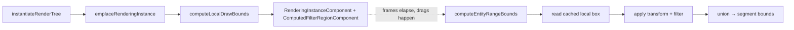

# Design: Tight-Bounded Segment Rasterization

**Status:** Implementing
**Author:** Claude Opus 4.7
**Created:** 2026-04-19
**Last revised:** 2026-04-19 (v2 — RIC-instantiation pivot + premul-skip + filter
pre-compute; CTM composition-order bug fixed + transform naming audit)

## Summary

Shrink each cached compositor segment bitmap from canvas-sized to the tight
rectangle its contents actually paint into. Reduces per-click-drag-frame
allocation + memcpy by ~10× on `donner_splash.svg` (1784×1024 HiDPI), avoids
re-rasterizing huge mostly-transparent surfaces, and matches the invariant the
GPU backend (Geode) will need anyway: know each layer's draw extent before
allocating a texture.

The critical constraint: bounds must be computed **before** rendering, must
match the renderer's **actual** write extent (filter regions, isolation
halos, strokes, markers — all things `SVGGeometryElement::worldBounds()`
misses), and must not require reading back pixels from the rasterized bitmap
(blocks GPU pipelining, incompatible with Geode).

### v1 → v2 pivot

v1 (landed in `74bbcf26`) implemented bounds as a **post-hoc traversal** in
`RendererDriver::computeEntityRangeBounds` that mirrors `drawEntityRange`.
Correct, and it's what's in the tree today, but:

1. Every call redoes the full traversal (transform resolution, filter-region
   recompute, isolated-layer subtree walk) even though the inputs change only
   on style/structural mutations, not on every drag transform.
2. The bounds visitor is a parallel copy of the draw visitor, with no
   compiler-enforced invariant that the two stay in sync. Any new
   bound-expander added to draw-only is a latent shift/crop bug.

v2 moves bounds into **RIC (RenderingInstanceComponent) instantiation time**,
where they're computed once per structural/style change and cached as
**local-space** bounds on `RenderingInstanceComponent`. Per-frame cost drops
from "full traversal" to "iterate range, transform cached local box, union."
The shared-traversal refactor becomes a prerequisite, not a follow-up — it's
the mechanism that guarantees the bounds-writer and the draw-writer can't
drift.

## Goals

- Segment offscreens allocated at ≤ the renderer's true draw extent + small
  safety padding, sized per segment.
- No pixel difference from the current full-canvas rasterize output, on the
  real `donner_splash.svg`, on any drag frame. Gated at `isExact()` pixel
  equality in a splash-based dual-path golden.
- No GPU readback anywhere in the hot path; the same API works on Geode.
- Landed without a regression in any existing compositor test, including
  `DualPathVerifier`-based goldens already on the books.
- **v2-specific:** per-frame bounds cost drops to O(entities in range) with
  a ~1 cache-line read per entity, no filter-region recompute, no transform
  chain walk — because all three are resolved at instantiation time.
- **v2-specific:** runtime kill-switch (`CompositorConfig::tightBoundedSegments`
  + editor View-menu toggle) so a visual regression can be bisected without
  rebuild.

## Non-Goals

- Per-entity scissor optimization inside a single segment — the segment's
  union bounds is the unit of granularity.
- Tight-bounding promoted layer bitmaps (those live through `rasterizeLayer`,
  which already sizes itself to a single entity; separate concern).
- Text bounds precision — start by trusting the renderer's own shaping
  metrics; refine if splash-equivalent text scenes drift in follow-up.
- Backwards-compatible behavior for entities that the renderer can't
  bound-estimate at all (unknown non-geometry); those fall back to full
  canvas. We track how often this happens and shrink the fallback surface
  later.

## Reversibility

Runtime gate: `CompositorConfig::tightBoundedSegments` (default `true`). Flip
to `false` — or toggle via the editor's **View → Tight-Bounded Segments
(debug)** menu item — and `rasterizeDirtyStaticSegments` bypasses the bounds
path entirely, rasterizing every segment full-canvas. The setter
(`CompositorController::setTightBoundedSegmentsEnabled`) marks all cached
segments dirty so the next frame re-rasterizes under the new policy; the
editor plumbs through `AsyncRenderer::setTightBoundedSegmentsEnabled(bool)`
with an `std::atomic<bool>` that the worker reads once per iteration.

If v2 cached bounds on `RenderingInstanceComponent` introduce a correctness
bug that the runtime gate can't bisect (e.g., cached bounds are wrong, but
the downstream compose still works — silent drift), the in-code escape
hatch is a compile-time fallback: ignore the cached field and force the
v1-style on-demand traversal. That's a 3-line change at the call site.

## Implementation Plan

- [x] **Milestone 0 (v1, landed in `74bbcf26`):** post-hoc
      `RendererDriver::computeEntityRangeBounds` + compositor integration +
      splash drag golden.
- [x] **Milestone 0.5 (this change):** `CompositorConfig::tightBoundedSegments`
      runtime gate + editor View-menu toggle + golden
      (`SetTightBoundedSegmentsEnabledTogglesAtRuntime`).
- [x] **Milestone 0.6:** CTM composition-order fix + transform naming audit.
      v1 shipped with `drawEntityRange`'s `setTransform(layerBaseTransform_ *
      instance.entityFromWorldTransform)` in the wrong order for donner's
      left-first `operator*` convention (`A * B` = "apply A, then B"). For
      full-canvas segments (`layerBase = Identity`) and pure-translation
      element transforms (translations commute) the bug was invisible. For
      rotated elements inside tight-bounded segments the final CTM pushed
      the path entirely outside the tight bitmap — splash's `cls-43`
      ellipse vanished when another cloud orb was promoted. Fixed to
      `instance.worldFromEntityTransform * surfaceFromCanvasTransform_`
      and regression-guarded by
      `CompositorGoldenTest.TightBoundsRotatedEllipseWithRotatingGradient`.
      The root cause was ambiguous naming — "layerBase" and
      "entityFromWorld" told you nothing about composition order — so
      while the lights were on, renamed throughout the renderer/compositor:
      `layerBaseTransform_` → `surfaceFromCanvasTransform_`,
      `entityFromWorldTransform` → `worldFromEntityTransform`,
      `entityFromWorld` → `worldFromEntity`, `entityFromParent` →
      `parentFromEntity` (~90 callsites, 20 files). All follow
      `destFromSource` convention now.
- [ ] **Milestone 1:** Shared-traversal refactor. Extract
      `traverseEntityRange(registry, first, last, viewport, baseTransform,
      Visitor&)`. `drawEntityRange` and `computeEntityRangeBounds` become thin
      wrappers that instantiate the right visitor. Behavior-preserving,
      gated at `isExact()` on all existing goldens.
- [ ] **Milestone 2:** Add `std::optional<Box2d> localDrawBounds` to
      `RenderingInstanceComponent`. Compute in
      `RenderingContextImpl::emplaceRenderingInstance` (see § RIC
      Integration below). Local-space (pre-transform) so transform-only
      mutations don't invalidate it. `nullopt` = "not yet modeled"
      (markers, masks, text-not-in-scope-yet) and downstream treats it
      as "fall back to full canvas."
- [ ] **Milestone 3:** Precomputed filter region. Cache a
      `FilterRegionDescriptor` on RIC at instantiation time with the
      static part of `computeFilterRegion` resolved; at render time only
      the `filterUnits=objectBoundingBox` anchor and shape-bounds lookup
      remain dynamic.
- [ ] **Milestone 4:** `computeEntityRangeBounds` rewritten to read
      cached `localDrawBounds`, apply
      `instance.worldFromEntityTransform * surfaceFromCanvas`, union.
      (Note: left-first `operator*` — apply entity-to-world first, then
      surface-from-canvas. Easy to flip; see Milestone 0.6.) O(entities)
      lookups, no filter recompute, no subtree walk beyond what
      `SubtreeInfo` already encodes.
- [ ] **Milestone 5 (optional, scored separately in § Premul-Skip
      Addendum):** direct-blit fast path for simple segments —
      bypass the `compositePixmapInto` premul round-trip when the
      segment has no isolation-group semantics.
- [ ] **Milestone 6:** Text / markers / masks / sub-documents / images
      modeled one-by-one in the bounds visitor. Each is a
      "narrow-the-fallback" wedge that lands independently.

## RIC Integration

### Where bounds get computed

`donner/svg/components/RenderingContext.cc`, inside
`RenderingContextImpl::emplaceRenderingInstance` (~line 208). This is the
one point every render instance flows through during tree instantiation.
At that point the paint servers are resolved, the absolute transform
component is looked up, `clipRect` is set, filters are attached. The
insertion point is after `instance.clipRect = clipRect` (~line 218) and
before the end of the builder.

```cpp
// In RenderingContextImpl::emplaceRenderingInstance, after existing setup:
instance.localDrawBounds = computeLocalDrawBounds(registry_, instance, style);
```

### What `computeLocalDrawBounds` resolves

Local (entity-space, pre-transform) bounds of every pixel the eventual
`drawEntityRange` traversal will write for this single entity. Specifically:

- **Path / shape entities:** `ComputedPathComponent::spline.bounds()`,
  expanded by `strokeWidth / 2` when stroked. Miter spikes: conservative
  expansion to `strokeWidth × miterLimit / 2` when `stroke-linejoin: miter`
  (the same conservative pad v1 falls back to today).
- **Image entities:** `ImageParams::targetRect` (already static —
  `LoadedImageComponent::image->dimensions` doesn't change, and
  `ComputedSizedElementComponent::bounds` is resolved at instantiation).
- **Text entities:** `ComputedTextComponent` shaped-run extent. Static
  once shaping is done.
- **Clip-rect intersection:** if `instance.clipRect` is set, intersect
  (shrink only — clip never expands bounds).
- **Filter region:** handled by a parallel `filterRegionDescriptor`
  field (see § Filter Pre-Compute below), not folded into
  `localDrawBounds` directly, because filter units may depend on runtime
  shape-bounds lookup.
- **Markers:** punt. Set `localDrawBounds = std::nullopt` if the entity
  has any `markerStart / markerMid / markerEnd`. Markers depend on path
  vertex positions + marker-shape bounds — not feasible to pre-compute
  in full generality. Future work: if splash-equivalent marker content
  ever regresses, add a conservative "path bounds + max marker dimension"
  cache.
- **Masks:** punt. Set `localDrawBounds = std::nullopt` if the entity
  has a mask. Mask extent depends on what the mask content renders to,
  which is itself transform-dependent.
- **Isolated layers / subtrees:** the *instance* of an isolated-layer
  parent doesn't get its own `localDrawBounds` expanded for its subtree
  — the bounds visitor at query time unions the subtree's cached
  child-bounds into the parent's accumulator. Storage stays per-entity.

### Why local-space bounds survive transform mutations

The drag fast path in `CompositorController::renderFrame` mutates
`instance.worldFromEntityTransform` **in place** on the existing
`RenderingInstanceComponent` (`CompositorController.cc` ~line 600). RIC
itself is never re-instantiated on a transform-only change — that's
gated behind `DirtyFlagsComponent::RenderInstance` /
`StyleCascade`, neither of which drag sets.

So caching bounds in local space (before `worldFromEntityTransform` is
applied) means the cache stays valid through every drag frame. At query
time:

```cpp
const Transform2d finalTransform = baseTransform * instance.worldFromEntityTransform;
Box2d canvasBounds = finalTransform.transformBox(*instance.localDrawBounds);
```

Full rebuild (which re-fills the cache) happens only on structural or
style mutations. This is the invariant the v2 plan rests on, and it's
already how the pipeline behaves today — we're just reading a cached
field instead of recomputing from scratch.

### Invalidation rules

`RenderingInstanceComponent` is recreated wholesale on structural /
`RenderInstance` dirty. So:

| Mutation | Is RIC rebuilt? | Local-bounds validity |
|---|---|---|
| Drag transform (`setTransform`) | No — in-place `worldFromEntityTransform` write | Valid — local-space, transform-independent |
| Style change (class/fill/stroke-width/etc.) | If `StyleCascade` dirty | Invalidated when RIC is rebuilt ✓ |
| Structural (element added/removed) | Yes | Invalidated ✓ |
| Attribute write-back (drag end commits `transform="…"`) | Via `ReplaceDocumentCommand` → full rebuild | Invalidated ✓ |

No separate dirty flag needed on `localDrawBounds` — it piggybacks on
the existing instance-lifetime guarantees.

## Filter Pre-Compute

`computeFilterRegion` (`donner/svg/renderer/RendererDriver.cc` ~line 591) is
called every frame during bounds computation today. Its inputs split:

**Static (resolvable at instantiation):**
- `filterUnits` (userSpaceOnUse vs objectBoundingBox)
- Explicit `x / y / width / height` on the `<filter>` element (or their
  default percentages)
- `primitiveUnits`
- Filter graph structure (chain of primitives)

**Dynamic (per-frame):**
- `shapeBounds` via `ShapeSystem::getShapeBounds` — only used when
  `filterUnits=objectBoundingBox`. For `userSpaceOnUse` (the common case
  in hand-authored SVGs + the splash), shape bounds aren't consulted.
- Percent-based length resolution anchored on the bounding box — only
  active under `objectBoundingBox`.

### What to cache

A new component — tentatively `ComputedFilterRegionComponent` — created
alongside `ComputedFilterComponent` at instantiation. It stores:

```cpp
struct ComputedFilterRegionComponent {
  FilterUnits units;                  // userSpaceOnUse or objectBoundingBox
  // Under userSpaceOnUse: fully resolved box in user-space units — use as-is
  // at query time. Under objectBoundingBox: percentages resolved against a
  // unit box; query-time code scales by the live shape bounds.
  Box2d regionInUnits;
  // Primitive subregions for the filter chain, similarly resolved.
  std::vector<Box2d> primitiveSubregionsInUnits;
};
```

Query-time code at render/bounds-compute time is then:

```cpp
if (filterRegionDescriptor.units == FilterUnits::UserSpaceOnUse) {
  return filterRegionDescriptor.regionInUnits;  // already in local space
} else {
  Box2d shapeBounds = shapeSystem.getShapeBounds(instance);  // the only dynamic call
  return scaleOBB(filterRegionDescriptor.regionInUnits, shapeBounds);
}
```

**Corpus evidence:** 6 test-corpus filter defs — only 1 (`feimage-external-svg`)
has explicit OBB with explicit x/y/w/h. The splash's 3 filters use
`userSpaceOnUse`. So the common case is "fully static, one cache read"; the
OBB fallback keeps the feature general.

### Other pipeline-earlier moves (scoped, not all in scope for this design)

From the audit of `drawEntityRange` / `computeEntityRangeBounds`:

| Work | Static? | Caching target |
|---|---|---|
| Path spline bounds | Static | `localDrawBounds` (this design) |
| Stroke padding (width + miter) | Static | `localDrawBounds` (this design) |
| `clipRect` | Static | Already on `RenderingInstanceComponent` |
| Isolated-layer structure (opacity, blend, isolation) | Static | Already resolved on RIC |
| Image target rect | Static | `localDrawBounds` (this design) |
| Text shaped-run extent | Static | `localDrawBounds` (this design, milestone 6) |
| Filter region (userSpaceOnUse) | Static | `ComputedFilterRegionComponent` |
| Filter region (objectBoundingBox) | Mixed — static descriptor + dynamic shape bounds | `ComputedFilterRegionComponent` + on-demand scale |
| Marker placement | Dynamic (path vertices) | **Not** cached; entities with markers fall back |
| Mask extent | Dynamic (mask content render) | **Not** cached; entities with masks fall back |

The three "Static" rows that aren't yet cached (path, stroke, image, text)
all consolidate into `localDrawBounds`. Filter becomes its own descriptor.
Markers + masks stay dynamic with a cheap bail-out (`nullopt` from
`localDrawBounds`).

## Proposed Architecture (v2)

### Instantiation

```
RenderingContext::instantiateRenderTree
  for each entity in render tree:
    emplaceRenderingInstance(entity):
      instance.worldFromEntityTransform = ...       (existing)
      instance.clipRect = ...                        (existing)
      instance.resolvedFilter = ...                  (existing)
      instance.localDrawBounds = computeLocalDrawBounds(...)  (NEW)
      if instance.resolvedFilter:
        registry.emplace<ComputedFilterRegionComponent>(
            entity, resolveStaticFilterRegion(...))   (NEW)
```

### Per-frame (drag)

```
CompositorController::renderFrame
  for each dirty entity:
    instance.worldFromEntityTransform = new transform  (existing in-place write)
    // instance.localDrawBounds is untouched — still valid.

CompositorController::rasterizeDirtyStaticSegments
  if config.tightBoundedSegments:
    tightBoundsCanvas = driver.computeEntityRangeBounds(...)  (NEW: reads cached)
      for each instance in range:
        if instance.localDrawBounds:
          accumulate(baseTransform * worldFromEntity, *instance.localDrawBounds)
          if instance.filterRegion:
            expand(filterRegion)
        else:
          return nullopt  (falls back to full canvas)
  // rest of the compositor decision (75% threshold, snap, etc.)
  //   unchanged from v1.
```

### Bounds visitor mental model (v2 version)



The draw path runs the same local-bounds lookup as part of its own
traversal (to know its own write extent for downstream filters), so the
bounds-writer and the draw-writer read from the same cached field — which
is the v2 answer to "how do we keep them in sync." The
shared-traversal refactor (Milestone 1) extracts the common iteration
skeleton; the cached fields remove the chance of drift inside the
per-entity work.

## Premul-Skip Addendum (Milestone 5, scored separately)

### Problem

Every compositor segment bitmap is stored **unpremultiplied** RGBA8
(`RendererTinySkia.cc:1937-1943`). When the compositor blits a segment
onto the canvas in `composeLayers` / `recomposeSplitBitmaps`, it calls
`RendererInterface::drawImage`, which internally:

1. Premultiplies the source bitmap (`PremultiplyRgba` at
   `RendererTinySkia.cc:1340`).
2. Runs `tiny_skia::Painter::drawPixmap` with premul blend math.
3. Unpremultiplies the result back to RGBA8 storage.

For a 200×150 tight segment, that's ~120k pixels × ~5-10 ALU ops ≈
0.5-1 ms of per-segment premul round-trip cost. Splash has 6-8 segments
per drag frame → ~1-2 ms of premul overhead, purely as quantization
noise.

### The opportunity

If a segment is being composed onto the canvas with **opacity=1, blend
mode = source-over, no mask, no clip beyond the segment's own bounds,
and an integer-translation-only composition transform**, then the blit
degenerates to "copy pixels where alpha > 0." Both source and
destination are unpremul RGBA8, so the copy is bit-identical to the
premul round-trip output. No quantization loss.

The compositor already ensures most splash segments fit these invariants
by construction: segments never span an isolation group boundary
(opacity <1, blend mode, filter, mask all force layer promotion at the
compositor level, which splits the containing segment). So the *segment
itself* has trivial compose semantics; only *its output pixels* carry
any internal alpha-composited content, which is already baked in.

### Required API change

Add `RendererInterface::blitImageSrcOver(image, intPixelOffset)` — or
equivalent — that asserts "no opacity, no blend, no mask, integer
translation" and does a direct unpremul→unpremul copy with per-pixel
alpha compositing (no premul round-trip). Route the simple-segment
blits through it.

Alternative: detect the invariants inside `drawImage` and branch. Less
API surface, more branching inside a hot path. Needs benchmarking.

### Estimated win

On splash at 892×512 60 fps drag: ~1-2 ms per frame. Small compared to
the 10-55 MB allocation cut v1 already landed, but it's the kind of
multi-segment overhead that shows up cumulatively in the Tracy
`composeLayers` span. Worth doing *after* Milestones 1-4 are stable;
doing it alongside risks pattern-matching a premul bug as a
tight-bounds bug.

### Risks

- **Overlapping semi-transparent shapes *inside* a segment:** safe. The
  segment's offscreen was painted through tiny-skia's internal premul
  blend, then stored unpremul. A direct unpremul→unpremul copy is
  bit-identical to the premul round-trip output for the same pixels.
- **Non-identity, non-integer composition transform:** fall back to
  `drawImage`. Segments are composed with pure translations today
  (identity, or `Translate(topLeft)` from tight-bound offsets), so the
  filter is easy.
- **A future change that introduces per-segment opacity or blend:**
  would break the direct-blit path silently. Gate with a
  `UTILS_RELEASE_ASSERT` that the compose parameters match the claimed
  invariants.

## Testing and Validation

Existing goldens (kept):

- `TightBoundedSegmentsProducePixelIdentityWithMultipleLayers` — must
  pass at `isExact()`.
- `TightBoundedSegmentsSurviveExplicitDragTargetPromote` — must pass at
  `isExact()`.
- `TightBoundedSegmentsPixelIdentityOnRealSplash` — must pass at
  `isExact()`.
- `TightBoundedSegmentsPixelIdentityOnRealSplashWithDrag` — kept at
  `isWithinTolerance(5)` for the layer-composite premul round-trip (see
  § Premul-Skip Addendum). Flip to `isExact()` once Milestone 5 lands.
- `SetTightBoundedSegmentsEnabledTogglesAtRuntime` — v1.5 toggle
  regression (flip off at runtime must produce same pixels as
  constructor-time off).

New goldens (Milestone 2):

- `CachedLocalDrawBoundsSurvivesTransformOnlyDrag` — assert that a
  drag frame doesn't invalidate `localDrawBounds`. Populate instance,
  snapshot field, issue transform-only mutation, re-render, assert
  field pointer/value unchanged.
- `CachedLocalDrawBoundsInvalidatedByStyleChange` — opposite: a style
  mutation (fill → stroke change) must invalidate the field because
  RIC rebuilds.
- `CachedBoundsHandlesFilterUnitsOBB` — filter with
  `filterUnits="objectBoundingBox"` — confirm query-time scaling
  against live shape bounds matches v1's on-demand computation.

New goldens (Milestone 3):

- `PrecomputedFilterRegionHandlesUserSpaceOnUse` — the splash case.
- `PrecomputedFilterRegionHandlesOBBWithTransformChange` — drag a
  filtered entity; confirm the descriptor + shape-bounds lookup path
  matches v1's behavior.

Perf gate (Milestone 4):

- `MultiShapeClickDragHiDpiRepro` click-D / click-O wall-clock — v1's
  projected ~30 ms drop didn't fully materialize (splash content
  bails to full-canvas often due to markers / text). With v2's
  unified bounds-from-cache approach and the filter pre-compute, the
  projected savings should finally land. Tighten the budget when the
  new baseline stabilizes.

## Alternatives Considered

1. **Pre-render bounds via `SVGGeometryElement::worldBounds()`** (first
   v1 attempt, reverted in `bf28831e`). Failed: no knowledge of filter
   regions, markers, isolated-layer halos, clip-path shapes, or strokes.
   Produced the visible shift-and-crop bug on splash.

2. **v1 (post-hoc `computeEntityRangeBounds` traversal).** Landed in
   `74bbcf26`, correct, but recomputes everything per frame and risks
   draw/bounds visitor drift. v2 supersedes.

3. **Post-rasterize alpha-scan crop.** Correct by construction but
   requires GPU readback. Allocation savings impossible. Geode-
   incompatible. Rejected.

4. **Parallel segment rasterization.** Orthogonal — doesn't shrink
   allocations, spreads them across cores. Larger win on render phase,
   but doesn't address "don't upload large textures." Tracked as
   follow-up.

5. **Bake bounds into *world*-space on RIC, not local-space.** Rejected:
   every transform mutation (each drag frame) would have to invalidate
   the cache. World-space is just as recomputable as v1's on-demand
   approach, so the cache buys nothing.

## Open Questions

- **Text bounds precision on real fonts.** Planned in Milestone 6;
  fall back to `nullopt` until modeled.
- **Markers — conservative expansion vs always-fallback.** Start with
  always-fallback; measure how often splash-equivalent content exercises
  marker paths. If common, add a "path bounds + max marker dimension"
  conservative pad.
- **Does `ComputedFilterRegionComponent` belong on the same entity as
  `RenderingInstanceComponent`, or on the filter's own shadow-tree
  target?** Leaning toward same-entity — `RenderingInstanceComponent`
  already carries the resolved filter reference, so the descriptor is a
  sibling field conceptually. Needs a concrete prototype to confirm the
  component-scoping doesn't fight the existing resolver.
- **Premul-skip: how much noise does the premul round-trip contribute
  to the splash dual-path tolerance today?** Measured at 1-3 channels;
  tolerance 5 absorbs it. After Milestone 5, re-run the drag golden at
  `isExact()` and see if any other drift source surfaces.

## Future Work

- [ ] Parallel segment rasterization (orthogonal; tight-bounds reduces
      each thread's allocation so pool pressure is bounded).
- [ ] Tight-bound for promoted layer bitmaps (`rasterizeLayer`) — the
      single-entity case should be easy via the same cached
      `localDrawBounds`.
- [ ] Geode integration: drive GPU texture sizing from the same cached
      field.
- [ ] Marker / clip-path-shape bounds refinement if real content
      exercises those edge cases.
- [ ] Premul-skip (Milestone 5) — lands after v2 is stable.
