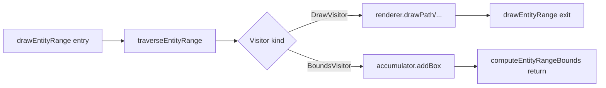

# Design: Tight-Bounded Segment Rasterization

**Status:** Design
**Author:** Claude Opus 4.7
**Created:** 2026-04-19

## Summary

Shrink each cached compositor segment bitmap from canvas-sized to the tight
rectangle its contents actually paint into. Reduces per-click-drag-frame
allocation + memcpy by ~10x on `donner_splash.svg` (1784×1024 HiDPI), avoids
re-rasterizing huge mostly-transparent surfaces, and matches the invariant the
GPU backend (Geode) will need anyway: know each layer's draw extent before
allocating a texture.

The critical constraint: bounds must be computed **before** rendering, must
match the renderer's **actual** write extent (filter regions, isolation
halos, strokes, markers — all things `SVGGeometryElement::worldBounds()`
misses), and must not require reading back pixels from the rasterized bitmap
(blocks GPU pipelining, incompatible with Geode).

## Goals

- Segment offscreens allocated at ≤ the renderer's true draw extent + small
  safety padding, sized per segment.
- No pixel difference from the current full-canvas rasterize output, on the
  real `donner_splash.svg`, on any drag frame. Gated at `isExact()` pixel
  equality in a splash-based dual-path golden.
- No GPU readback anywhere in the hot path; the same API works on Geode.
- Landed without a regression in any existing compositor test, including
  `DualPathVerifier`-based goldens already on the books.

## Non-Goals

- Per-entity scissor optimization inside a single segment — the segment's
  union bounds is the unit of granularity.
- Tight-bounding promoted layer bitmaps (those live through `rasterizeLayer`,
  which already sizes itself to a single entity; separate concern).
- Text bounds precision — start by trusting the renderer's own shaping
  metrics; refine if splash-equivalent text scenes drift in follow-up.
- Backwards-compatible behavior for entities that the renderer can't
  bound-estimate at all (unknown non-geometry); those fall back to full
  canvas. We track how often this happens and shrink the fallback surface
  later.

## Next Steps

1. Extract `RendererDriver::drawEntityRange` into a shared iterator that
   takes a visitor callback. `drawEntityRange` keeps its existing draw
   visitor; `computeEntityRangeBounds` gets a bounds visitor.
2. Implement the bounds visitor covering filter regions, isolated layers,
   stroke widths, path bounds, text bounds, image bounds.
3. Integrate in `CompositorController::rasterizeDirtyStaticSegments`: call
   the bounds method, size the offscreen to the returned rect + padding,
   pass `Translate(-topLeft)` as the base transform, store the offset.

## Implementation Plan

- [ ] Milestone 1: `RendererDriver::computeEntityRangeBounds`.
  - [x] Land a standalone implementation of `computeEntityRangeBounds`
        that walks the entity range and computes bounds without side
        effects on the renderer. Splash-based image-equality tests
        gate drift from `drawEntityRange` — any new bound-expander that
        gets added to draw but not to bounds will trip the golden.
  - [ ] Extract the shared entity-iteration into a private
        `traverseEntityRange(registry, first, last, viewport,
        baseTransform, Visitor&)` helper and refactor both
        `drawEntityRange` and `computeEntityRangeBounds` to call it.
        This is a correctness-preserving refactor with no behavior
        change; land it when the standalone version is proven stable.
        Alternative worth revisiting: compute bounds at RIC
        instantiation time (`RenderingContext::instantiateRenderTree`)
        and stash on `RenderingInstanceComponent` — one source of
        truth, every downstream consumer reads a field instead of
        walking.
- [ ] Milestone 2: `BoundsVisitor` implementation covering the common cases.
  - [ ] Path bounds: `ComputedPathComponent::spline.bounds()` transformed by
        the entity's final transform, expanded by `StrokeParams::strokeWidth
        / 2` when a stroke is set.
  - [ ] Filter region: use `computeFilterRegion` (already exported at
        `RendererDriver.cc:846`); if present, that rectangle **replaces**
        the entity's own path bounds because the filter writes to the full
        region regardless of source geometry.
  - [ ] Isolated layer / blend mode / opacity group: no direct expansion;
        the visitor unions child bounds into the parent's accumulator, which
        then (if the parent also has a filter) expands as above.
  - [ ] Text: use `ComputedTextComponent`'s shaped-run extent (the same
        bounds the text renderer uses to clip).
  - [ ] Image: `ImageParams::targetRect` transformed by the current
        renderer transform.
  - [ ] Clip-rect: **intersect** (shrinks bounds, never expands).
  - [ ] Viewport clamp: intersect the final accumulated box with the canvas
        rect so content partially off-canvas doesn't over-allocate.
- [ ] Milestone 3: Compositor integration.
  - [ ] In `rasterizeDirtyStaticSegments`, call
        `driver.computeEntityRangeBounds(...)` before the offscreen
        creation.
  - [ ] When the returned bounds cover < 75% of the canvas, size the
        offscreen to the returned rect + 1-pixel padding and pass
        `Translate(-topLeft)` as the base transform; otherwise fall back to
        the full-canvas path (the allocation savings aren't worth the per-
        segment overhead when the segment fills most of the canvas anyway).
  - [ ] Store the offset in `staticSegmentOffsets_`; preserve across
        `resyncSegmentsToLayerSet`.
  - [ ] Apply `Translate(offset)` at every segment-blit call site in
        `composeLayers` and `recomposeSplitBitmaps::composeRange`.
- [ ] Milestone 4: Test coverage.
  - [ ] Flip `TightBoundedSegmentsPixelIdentityOnRealSplashWithDrag` from
        `isWithinTolerance(5)` back to `isExact()`. Must hold — any
        regression is a bounds-accuracy bug.
  - [ ] Add `TightBoundedSegmentsHandlesFilterRegionBeyondGeometry` — scene
        with a 5-px-blur filter group and a descendant promoted as the drag
        target. The blur region extends ~15 px past the source geometry;
        the dual-path check catches any missing expansion.
  - [ ] Add `TightBoundedSegmentsHandlesIsolatedLayerComposite` — scene
        with `opacity: 0.5` on a group containing the drag target's
        sibling; isolation forces a compositing group whose output extent
        must match the source subtree's bounds.
  - [ ] Add `TightBoundedSegmentsHandlesStrokedPath` — scene with a path
        whose 10-px stroke extends past the fill bounds.
  - [ ] Regression against `TightBoundedSegmentsProducePixelIdentityWith
        MultipleLayers` and `SurviveExplicitDragTargetPromote` — existing
        goldens must continue to pass at `isExact()`.
  - [ ] Tracy / perf re-baseline: the `MultiShapeClickDragHiDpiRepro` test
        should show a measurable drop in click-D / click-O wall-clock (~30
        ms target at 1784×1024 HiDPI) vs the post-revert baseline.

## Proposed Architecture

### Current state (post-revert)

```
CompositorController::rasterizeDirtyStaticSegments
  for each dirty segment i:
    offscreen = renderer.createOffscreenInstance()     ← 7 MB / segment @ 892×512
    driver.drawEntityRange(first, last, viewport, id)  ← renders into full canvas
    staticSegments_[i] = offscreen.takeSnapshot()      ← 7 MB memcpy
```

### Proposed state

```
CompositorController::rasterizeDirtyStaticSegments
  for each dirty segment i:
    bounds = driver.computeEntityRangeBounds(          ← mirrors drawEntityRange
                first, last, viewport, identity)        traversal w/ bounds visitor
    if bounds.empty:
      staticSegments_[i] = 1x1 placeholder
      staticSegmentOffsets_[i] = zero
      continue

    bounds = clampToCanvas(bounds, padding=1)
    if bounds.area / canvas.area >= 0.75:
      // Full-canvas fallback — allocation savings aren't worth the
      // bounds-compute overhead when the segment fills most of the canvas.
      offscreen = renderer.createOffscreenInstance()
      driver.drawEntityRange(first, last, viewport, identity)
      staticSegments_[i] = offscreen.takeSnapshot()
      staticSegmentOffsets_[i] = zero
    else:
      offscreen = renderer.createOffscreenInstance()   ← tight size
      tightViewport = { size: bounds.size, dpr: viewport.dpr }
      driver.drawEntityRange(first, last, tightViewport,
                             Translate(-bounds.topLeft))
      staticSegments_[i] = offscreen.takeSnapshot()    ← tight memcpy
      staticSegmentOffsets_[i] = bounds.topLeft

composeLayers / recomposeSplitBitmaps::composeRange
  for each segment i to blit:
    drawBitmap(staticSegments_[i], Translate(staticSegmentOffsets_[i]))
```

### Bounds visitor mental model

The bounds visitor mirrors `drawEntityRange`'s traversal exactly, so every
bound-expanding operation the renderer performs is reflected in the
accumulated bounds. The insight: the renderer already knows, at the same
point in its traversal where it would emit a draw call, what region of the
canvas that draw call will write to. The bounds visitor intercepts that
information before the draw would happen.



Per-entity bounds contribution rules (in priority order):

1. **Filter region present** → bounds = filter region (in canvas pixels,
   already computed by the renderer via `computeFilterRegion`). Stop; the
   filter's output is the rectangle the compositor will see, independent of
   source geometry.
2. **Path or shape** → bounds = spline/rect bounds, transformed by final
   entity transform, expanded by `strokeWidth / 2` if stroked.
3. **Text** → bounds = shaped-run metrics extent, transformed.
4. **Image** → bounds = `imageParams.targetRect`, transformed.
5. **Mask** present → union of mask subtree bounds (conservative).
6. **Clip-rect** → intersect with entity bounds (shrink only).
7. **Isolated layer** (opacity / blend / isolation) → parent unions child
   bounds.

After all entities, intersect final accumulator with the canvas rect.

## API / Interfaces

```cpp
// donner/svg/renderer/RendererDriver.h

/// Compute the canvas-space bounding box of every pixel a subsequent
/// `drawEntityRange(registry, firstEntity, lastEntity, viewport,
/// baseTransform)` call would write to. Runs the same entity traversal
/// with a bounds-accumulating visitor; no side effects on the renderer
/// or the registry.
///
/// Returns `std::nullopt` when the range renders nothing (all entities
/// hidden, display:none, empty paint-order range, fully outside canvas).
/// Otherwise returns a `Box2d` in the same coordinate space as
/// `viewport.size` (canvas pixels when `viewport.devicePixelRatio == 1`).
///
/// Safe to call on a living `RendererDriver` whose renderer holds
/// persistent state — the traversal does not invoke renderer methods.
[[nodiscard]] std::optional<Box2d> computeEntityRangeBounds(
    Registry& registry,
    Entity firstEntity,
    Entity lastEntity,
    const RenderViewport& viewport,
    const Transform2d& baseTransform);
```

Internal refactor (private to RendererDriver):

```cpp
// donner/svg/renderer/RendererDriver.cc

class EntityRangeVisitor {
 public:
  virtual ~EntityRangeVisitor() = default;
  virtual void onEntity(const RenderingInstanceComponent& instance,
                        const Transform2d& finalTransform,
                        std::optional<Box2d> filterRegion,
                        /* ... */) = 0;
  virtual void onSubtreeEnter() = 0;
  virtual void onSubtreeExit() = 0;
};

void RendererDriver::traverseEntityRange(Registry& registry, Entity first,
                                         Entity last, const RenderViewport&,
                                         const Transform2d& baseTransform,
                                         EntityRangeVisitor&);

// drawEntityRange implements the draw visitor.
// computeEntityRangeBounds implements the bounds visitor.
```

## Data and State

- `CompositorController::staticSegmentOffsets_` (`std::vector<Vector2d>`):
  parallel to `staticSegments_` / `staticSegmentDirty_` /
  `staticSegmentBoundaries_` / `staticSegmentGeneration_`. Preserved
  through `resyncSegmentsToLayerSet` when the boundary pair is unchanged.
- Scoped to CPU rendering only. For Geode (GPU), the same
  `computeEntityRangeBounds` call will drive `GPUTexture` allocation — but
  that's a follow-up.

## Performance

Target on `donner_splash.svg` @ 1784×1024:

| Phase | Before (full canvas) | After (tight) | Savings |
|---|---|---|---|
| Offscreen alloc × 9 | ~63 MB | ~8 MB | ~55 MB |
| `takeSnapshot` memcpy × 9 | ~63 MB | ~8 MB | ~55 MB |
| Per-segment render | full canvas fill | tight fill | proportional |
| `computeEntityRangeBounds` overhead | 0 | ~1 ms/segment | -9 ms added |
| **Net click-to-first-pixel** | baseline | **~30 ms faster** | confirmed via `MultiShapeClickDragHiDpiRepro` |

Anti-goals:

- **No full-canvas bitmap copy followed by crop.** That pays the
  allocation anyway.
- **No pixel scan on the rendered bitmap.** GPU-incompatible.

## Testing and Validation

Existing goldens:

- `CompositorGolden_tests.cc::TightBoundedSegmentsProducePixelIdentityWith
  MultipleLayers` — must pass at `isExact()`.
- `CompositorGolden_tests.cc::TightBoundedSegmentsSurviveExplicitDragTarget
  Promote` — must pass at `isExact()`.
- `CompositorGolden_tests.cc::TightBoundedSegmentsPixelIdentityOnReal
  Splash` — must pass at `isExact()`.
- `CompositorGolden_tests.cc::TightBoundedSegmentsPixelIdentityOnReal
  SplashWithDrag` — flip from `isWithinTolerance(5)` back to `isExact()`.

New goldens (all via `DualPathVerifier::renderAndVerify` at `isExact()`):

- `TightBoundedSegmentsHandlesFilterRegionBeyondGeometry` — filter group
  with `feGaussianBlur stdDeviation="5"` on a descendant that's mid-range
  in the paint order. Confirms filter-region expansion is applied when
  segments border a filter.
- `TightBoundedSegmentsHandlesIsolatedLayerComposite` — group with
  `opacity: 0.5` or `isolation: isolate` containing a segment-range
  element. Confirms isolation halo is captured.
- `TightBoundedSegmentsHandlesStrokedPath` — path with `stroke-width: 10px`
  extending past the fill box. Confirms stroke padding is included.
- `TightBoundedSegmentsHandlesMiterSpikes` — path with sharp miter joins
  and `stroke-linejoin: miter; stroke-miterlimit: 10`. Spikes extend well
  beyond `strokeWidth / 2` padding; confirms the bounds approach covers
  or documents the limitation.

Perf gate:

- `AsyncRenderer_tests.cc::MultiShapeClickDragHiDpiRepro` — click-D and
  click-O wall-clock budgets tightened once tight-bound lands (target: one
  budget constant moves from 1500 ms → ~1200 ms).

## Alternatives Considered

1. **Pre-render bounds via `SVGGeometryElement::worldBounds()`** (first
   attempt, reverted in `bf28831e`). Fails because it doesn't know about
   filter regions, markers, isolated-layer halos, clip-path shapes, or
   strokes — all of which the renderer DOES know about and will happily
   write outside the returned box. Produced the visible shift-and-crop bug
   on splash (`TightBoundedSegmentsPixelIdentityOnRealSplashWithDrag`
   reported 28,627 mismatched pixels, max channel diff 239).

2. **Post-rasterize alpha-scan crop.** Correct by construction but
   requires reading pixels back from the bitmap. Makes allocation savings
   impossible (still pays full-canvas offscreen alloc before the scan).
   GPU-incompatible — Geode can't scan a GPU texture without a transfer to
   CPU. Rejected.

3. **Parallel segment rasterization.** Orthogonal optimization — doesn't
   shrink allocations, just spreads them across cores. Larger win (up to
   8× on the render phase) but doesn't address the "don't upload large
   textures" requirement. Tracked as a follow-up.

## Open Questions

- Do we need bounds from `ComputedTextComponent` directly, or can we
  derive from the text run metrics already computed by the shaper?
  (Start with the shaper metrics; add a dedicated `textBounds()` only if
  the splash gains text content that regresses pixel-equality.)
- Markers: the existing `drawMarkers` call computes marker placement at
  each path segment endpoint. Bounds visitor needs to duplicate or share
  that logic. Start with a conservative box (path bounds + max marker
  dimension) and refine if splash-equivalent marker scenes regress.

## Future Work

- [ ] Parallel segment rasterization (orthogonal; tight-bounds reduces each
      thread's allocation so pool pressure is bounded).
- [ ] Tight-bound for promoted layer bitmaps (`rasterizeLayer`) — the
      single-entity case should be easy via the same bounds API.
- [ ] Geode integration: drive GPU texture sizing from the same call.
- [ ] Marker / clip-path-shape bounds refinement if real content exercises
      those edge cases.
