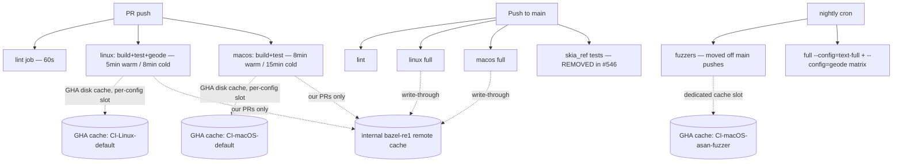

# Design: CI Runtime Reduction

**Status:** Superseded by [0031: CI Hardening 2026-Q2](0031-ci_hardening_2026q2.md) (2026-04-20)
**Author:** Claude Opus 4.7
**Created:** 2026-04-20

> **Note:** The milestones in this doc are preserved for history. The active
> plan (combining this runtime-reduction scope with the escape-prevention
> scope from doc 0016) lives in [0030-2](0031-ci_hardening_2026q2.md).
> New work should reference the milestones there.

## Summary

Donner's GitHub Actions CI is the slowest part of the merge cycle: cold-cache
macOS runs landed in the **20–25 minute range** for the Build step alone
(pre-Skia-removal). PRs trigger both Linux and macOS jobs, so PR feedback is
gated on the macOS critical path. This doc plans a sequence of changes that
should bring PR feedback under **10 minutes** (warm) / **15 minutes** (cold)
without losing test coverage and without dropping macOS coverage.

The biggest single drop already landed in PR #546 (Skia removal, merged
2026-04-20). The remaining wins come from cache hygiene, runner sizing,
parallelism, and moving non-blocking work off the PR critical path.

## Constraints

These are hard constraints that bound the solution space:

1. **macOS must stay on every PR.** The Donner editor is a P0 product and
   ships on macOS; macOS-only regressions must be caught at PR time, not
   24h later in nightly.
2. **No public Bazel remote execution / remote cache.** We cannot give
   anonymous PR contributors access to a shared cache. A private cache that
   only authenticated runs (our own PRs, main pushes) can read is still
   on the table, but its impact is limited to our own merge cycle.
3. **No reduction in test coverage on main.**
4. **Measurement-driven.** Every milestone records before/after step
   timings; rollback if a change regresses anything by > 10% without a
   compensating win.

## Goals

- PR median wall-clock feedback ≤ 10 minutes (warm cache).
- PR worst-case feedback (cold cache) ≤ 15 minutes.
- main-branch full pipeline (including fuzzers) ≤ 20 minutes.
- macOS still gates every PR.

## Non-Goals

- Switching CI provider away from GitHub Actions.
- Adding a self-hosted GHA runner pool.
- Rewriting tests to be faster — this doc is purely about pipeline
  orchestration and caching.
- Removing test targets.
- Public RBE / public remote cache (out of scope per constraint 2).

## Next Steps

1. **Wait for the first post-#546 main run to complete** (in flight as of
   this writing, run id 24648369948). Record its per-step seconds in the
   "Post-Skia baseline" table below.
2. Pick the highest-leverage Phase 1 item and start a follow-up PR.
   Recommended start: **per-config cache slots** (M1) — small, low-risk,
   removes the asan-fuzzer-evicts-main collision that's been costing main
   pushes 5–7 min on cache misses.

## Implementation Plan

- [ ] Milestone 0: Establish post-Skia baseline
  - [ ] Wait for run 24648369948 to finish
  - [ ] Record per-step seconds (Linux + macOS, cold + warm) into the
        baseline table below
  - [ ] Compare against the pre-Skia table (also below); confirm the
        predicted drop materialised
  - [ ] If macOS cold Build is now under 8 min, the urgency of the rest of
        this plan drops dramatically — re-prioritize accordingly
- [ ] Milestone 1: Per-config cache slots
  - [ ] Change `disk-cache` key from `${{ workflow }}-${{ runner.os }}` to
        also include a config tag (`-default`, `-asan-fuzzer`,
        `-skia-ref` if any reference variants survive). Each step that
        uses a non-default config gets its own slot.
  - [ ] Verify bazel-contrib/setup-bazel respects the longer key (it does
        — the value is opaque)
  - [ ] Roll out: change the key, force a cold run, then a warm run, then
        confirm the asan-fuzzer step no longer triggers a full rebuild of
        the main targets on the next merge
  - [ ] Risk: GHA per-repo cache quota is 10 GB. With cache-save still
        gated on `refs/heads/main`, the eviction policy will keep us in
        budget, but watch for quota errors after rollout.
- [ ] Milestone 2: Lint as a separate fast-fail job
  - [ ] Move banned-patterns lint, clang-format check, and CMake mirror
        sync check into a `lint` job that runs in parallel with `build`
  - [ ] Lint job should finish in ≤ 60s — gives near-instant feedback for
        the most common PR failure mode (formatting / banned pattern)
  - [ ] No timing impact on the macOS critical path, but reduces the
        PR-author iteration time on lint failures from ~5 min to ~1 min
- [ ] Milestone 3: Move asan-fuzzer to a dedicated workflow
  - [ ] Extract the macOS `Test fuzzers` step into
        `.github/workflows/fuzz.yml` (cron + workflow_dispatch + label-gated
        manual trigger)
  - [ ] Drop `|| true` once the fuzzer corpus is reliably green; the
        comment in `main.yml:99` notes this is overdue
  - [ ] Removes 5–7 min from main pushes
- [ ] Milestone 4: macOS runner sizing
  - [ ] Try `macos-15-large` (6 cores vs 3 on default `macos-15`)
  - [ ] Cost: ~2x per-minute, but builds should be roughly 2x faster on
        the parallelisable steps (compilation), so wall-clock per-PR
        approximately halves with neutral compute cost
  - [ ] Validate by switching macOS in a feature branch, force one cold
        run + one warm run, compare timings
  - [ ] Roll forward only if wall-clock improvement is > 30% and quota
        budget allows
- [ ] Milestone 5: Cross-PR cache writes (PR jobs save cache, scoped per branch)
  - [ ] Change `cache-save` from `refs/heads/main` to also save on PR
        pushes, but keyed per-PR (so PR-A's cache doesn't collide with
        PR-B's)
  - [ ] Within a single PR, the second push hits its own incremental cache
        and should drop to "warm" timings even on first attempt
  - [ ] Watch GHA cache quota — this multiplies cache footprint by the
        number of active PRs. Set a TTL via cache key suffix
        (`-${{ github.run_id }}` is too aggressive; per-PR + per-week
        rotation is better)
- [ ] Milestone 6: Internal remote cache for authenticated runs
  - [ ] Wire `--config=ci-remote-cache` to the existing `bazel-re1` worker
        (the sysroots from PR #545 already make the toolchain hermetic
        enough for this)
  - [ ] Available only to runs with repo secrets — i.e. our own branches
        and main pushes; fork PRs continue using GHA disk cache only
  - [ ] Most Donner PRs come from the `jwmcglynn` account on branches in
        the same repo, so this still benefits the majority of merge cycles
  - [ ] Risk: bazel-re1 outage tanks our own CI. Use
        `--remote_local_fallback=true` so Bazel falls back to local on
        cache miss/timeout
- [ ] Milestone 7 (stretch): Matrix-parallelize the heavy variants
  - [ ] Split the `linux` job into `linux-default` and `linux-text-full`
        and `linux-geode` matrix entries
  - [ ] Each entry uses its own cache slot (relies on Milestone 1)
  - [ ] Linux runners are cheap; the constraint is concurrent-job quota
  - [ ] Only worth doing if Milestone 1+5 don't get us under target

## Background

### Pre-Skia state (sampled 2026-04-19, last 7 main runs)

Per-step seconds, taken from `gh run view`. "Cold" = first run after a dep
bump or long quiet period; "warm" = subsequent runs hitting `cache-save:
refs/heads/main`.

| Run | macOS Build | macOS Test | macOS Fuzz | Linux Build | Linux Test |
|---:|---:|---:|---:|---:|---:|
| 24645801857 (re-push, warm) | 89s  | 64s  |  10s | 134s  | 102s |
| 24640769418 (PR #544, cold) | 1379s | 263s | 294s | 159s  | 166s |
| 24639459623 (PR #545, cold) | 1492s | 206s | 437s | 352s  |  26s |
| 24623255472 (warm)          | 291s  | 216s |  14s | 355s  | 151s |
| 24618420955 (cold)          | 1250s | 200s | 289s |  95s  | 133s |
| 24613404030 (cold)          | 605s  | 141s | 170s | 1391s | 173s |
| 24597636830 (warm)          | 314s  | 173s |  13s | 330s  | 129s |

### Post-Skia baseline (sampled 2026-04-20)

| Run | macOS Build | macOS Test | macOS Fuzz | Linux Build | Linux Test |
|---:|---:|---:|---:|---:|---:|
| 24648369948 (PR #546, cold) | 1130s | 178s | 266s | 1891s | 158s |

**Surprise**: Skia removal saved less than predicted. macOS Build dropped from
the ~1250–1492s cold range to 1130s — about 15%, not the 70–80% I expected
based on Skia's source volume. Linux Build was actually the highest cold
number we've recorded (1891s vs prior max of 1391s), almost certainly because
removing Skia invalidated the entire transitive cache and this run rebuilt
everything from scratch.

**Implication for the plan**: the dominant CI cost is *not* one big slow
dependency — it's cache eviction across configs and runner sizing. M1
(per-config cache slots, accomplished in this PR by moving fuzzers to a
separate workflow) and M4 (macos-15-large) become more attractive than
they looked when I assumed Skia was the silver bullet.

The next 2–3 main pushes should show whether warm-cache numbers improve now
that the cache no longer alternates between default-config and asan-fuzzer
toolchains in the same slot.

### Observations from pre-Skia data

1. **macOS Build was the bottleneck**: cold runs spent 20–25 min compiling.
   Skia (~250K LOC of C++ with template-heavy code) was the dominant
   contributor. PR #546 removes it.
2. **macOS runs on every PR** — this is unchanged and intentional (editor
   is P0).
3. **Cache slot collisions**: `disk-cache: ${{ workflow }}-${{ runner.os }}`
   means `--config=ci` and `--config=asan-fuzzer` (which activates
   `--config=latest_llvm` and a different toolchain) share the same slot.
   The fuzzer step evicts the main-build cache on every main push.
4. **PR cache is read-only** (`cache-save: refs/heads/main`). Long-lived
   PR branches don't accumulate their own incremental cache across pushes.
5. **No remote build cache**: the `--config=re` infrastructure (sysroots,
   hermetic toolchain) was added in PR #545 but the actual
   `--remote_cache` / `--remote_executor` flags aren't wired into `.bazelrc`
   or CI yet. Per the constraints above, this remains private-only and is
   demoted to Milestone 6.

## Proposed Architecture

PR-time gates: lint (~60s, parallel) + linux (~5–8 min) + macOS (~8–15
min). macOS remains the critical path on cold cache; the goal is to make
it ≤ 15 min by sizing it up (M4) and giving it an exclusive cache slot
that isn't evicted by the fuzzer step (M1).

## Risks and Mitigations

- **GHA cache quota exhaustion** (per-config + per-PR slots): GHA gives
  10 GB per repo. Per-config + per-PR + per-week TTL keeps us in budget;
  monitor `actions/cache` quota warnings after M5 rollout.
- **macos-15-large cost overrun** (M4): macos-15-large is ~5x the per-minute
  rate of macos-15. If wall-clock improvement is < 5x, we're paying more
  for the same throughput. Validate before rolling forward.
- **bazel-re1 outage tanks our own CI** (M6): `--remote_local_fallback=true`
  means a cache miss falls back to local execution; outage degrades to
  current behavior.
- **Per-PR cache write doubles every PR** (M5): same active PRs that today
  read a stale cache will tomorrow each carry their own cache. Trade-off
  is faster iteration vs. cache pressure. Mitigate with shorter retention.

## Testing and Validation

For each milestone:

1. Record baseline (current step seconds for the affected job) before the
   change.
2. Apply the change in a feature branch.
3. Force at least one cold-cache run (push a comment-only commit, or use
   workflow_dispatch with cache cleared).
4. Force at least one warm-cache run on top.
5. Compare per-step seconds against baseline; record in the milestone PR
   description.
6. Roll back if any step regresses by > 10% without a justifying win
   elsewhere.

A small `tools/ci_timing_report.py` script that ingests
`gh run view ... --json jobs` output and emits a markdown table would make
this measurement repeatable. Optional but recommended before starting M1.

## Open Questions

1. Is the post-#546 macOS cold Build actually under 8 min? If yes, we may
   be able to declare victory after just M1+M2 (per-config cache + lint).
2. What's the current GHA cache quota usage for the repo? If we're already
   close to 10 GB, M5 (cross-PR cache writes) may need a tighter retention
   policy than the default 7 days.
3. Is there a budget for `macos-15-large` (M4)? If not, skip and rely on
   the other levers.

## Appendix: 2026-07-10 timing profile and RE-backend analysis

**Author:** Claude Opus 4.8 (CI-runtime agent)
**Scope:** Root-cause the `linux-self-hosted` and `coverage-self-hosted` lanes
that ran past 60 minutes under queue contention and were cancelled at the job
timeout (PRs #808, #809). Timeouts were raised 60 -> 120 as a stopgap on
affected branches by another agent; this appendix targets the root cause so the
stopgap becomes unnecessary. Aligns with the project's CI
build/test speed and stability goals (the P95/P99 targets below) and the
shared-backend capacity follow-ups.

### Stated goal (operator, 2026-07-10)

End-to-end PR CI wall-clock, measured from PR trigger to the last required
check finishing and INCLUDING queue wait:

- **P95 <= 15 minutes**
- **P99 <= 30 minutes**

Primary metric is end-to-end run completion on that definition; a per-lane view
is reported alongside it. Speed is the target, never coverage: no test removed,
no lane skipped, no required check made optional. Governing infra principle:
all build/test executes on a shared remote-execution (RE)
backend; runner hosts stay thin dispatchers; solve tail latency by shifting
cores to the RE backend, not by multiplying runner hosts. An interactive
development host has PRIORITY on shared RE capacity: if CI and interactive
development contend, interactive development wins and the cost is paid in CI
tail latency, stated here rather than eroding that priority.

### Method

- Data: GitHub Actions REST API (`gh api`), workflows CI (`main.yml`, id
  1413161) and Coverage (`coverage.yml`, id 6956149), window 2026-06-26 to
  2026-07-10. 1001 unique runs; job-level `started_at`/`completed_at` for every
  run. Execution = job started -> completed. Queue = run created -> job started.
  End-to-end per PR = latest run per workflow at a head SHA, max(job completed)
  - min(run created), non-skipped jobs only.
- Split at the #799 PR-lane speedup ("CI: PR lane under 15 minutes", merged
  2026-07-06 ~19:00Z). Post-#799 is the state that matters; pre-#799 kept for
  contrast.

### End-to-end per PR (PR events, trigger -> last check, incl queue)

| Window | n (head SHAs) | median | p90 | p95 | p99 | max | >15m | >30m |
|---|---:|---:|---:|---:|---:|---:|---:|---:|
| PRE #799 (06-26..07-06) | 267 | 58.1 | 254 | 688 | 1028 | 1067 | 85% | 72% |
| POST #799 (07-06..07-10) | 43 | 15.3 | 71.0 | 270.6 | 304.0 | 306.6 | 51% | 33% |

All minutes. **Gap to goal (post-#799): P95 270.6 vs 15; P99 304 vs 30.** The
#799 speedup fixed the median (58 -> 15.3); the entire remaining gap is tail.

### Per-lane wall-clock, POST #799 (PR events, minutes)

| Workflow:job | n | exec med | exec p90 | exec p95 | exec max | queue med | queue p90 | queue p95 | queue max |
|---|---:|---:|---:|---:|---:|---:|---:|---:|---:|
| Co:coverage-self-hosted | 31 | 2.5 | 30.4 | 48.1 | 60 | 0.8 | 1 | 239 | 270 |
| CI:linux-self-hosted | 30 | 0.0 | 30.4 | 46.5 | 60 | 0.6 | 24 | 240 | 270 |
| CI:linux (hosted) | 36 | 5.7 | 65.5 | 66.7 | 77 | 0.6 | 1 | 1 | 1 |
| Co:build (hosted) | 26 | 0.0 | 16.4 | 25.6 | 71 | 0.8 | 1 | 1 | 1 |
| CI:macos (hosted) | 36 | 6.1 | 38.8 | 45.2 | 50 | 0.6 | 1 | 1 | 1 |
| CI:macos-self-hosted | 30 | 0.0 | 3.3 | 4.1 | 5 | 0.6 | 1 | 1 | 3 |
| Co:determine-targets | 43 | 0.6 | 0.8 | 0.9 | 1 | 0.1 | 0 | 0 | 0 |
| CI:determine-targets | 43 | 0.3 | 0.8 | 0.9 | 1 | 0.2 | 1 | 1 | 1 |
| CI:gatekeeper | 43 | 0.1 | 0.2 | 0.2 | 0 | 0.1 | 0 | 0 | 1 |

`exec max = 60` on both self-hosted lanes is the timeout firing, not a real
completion. exec med 0.0 means the lane was gated off (skipped) on that SHA.

### Measured RE-backend structure

The self-hosted lanes are NOT a single flat backend; correcting an earlier draft
of this appendix that attributed the Linux lanes to the macOS backend. The
relevant structure, stated without private per-host capacity or identity:

- The Linux `--config=ci` lanes (build, test, AND coverage) execute on a shared
  remote-execution backend, reached via the runner bazelrc chain `--config=ci`
  -> `--config=ci-re` -> `--remote_executor=...`.
- The runner-side work runs on a runner host with limited shared cores; several
  Linux runners share that host.
- An interactive development host with priority targets the SAME shared RE
  backend for its interactive builds.
- The macOS lanes use a SEPARATE macOS remote-execution backend, NOT the
  Linux/coverage backend.

**Allocation:** the shared RE backend and the priority interactive host are
provisioned to overcommit the underlying shared build host, so the executor and
the interactive host structurally compete for the same cores. That is exactly
the interactive-vs-CI RE contention the operator flagged. The shared build host
itself ran at low average load during this profiling, so the bottleneck is
contention on the shared path, not a saturated host.

### Dominant cost: two contention points on the shared RE path (drives P95/P99)

The three worst post-#799 PR SHAs decompose as queue 232-270 min + a 30-60 min
(timeout) exec on a self-hosted lane, e2e 292-307 min. Step-level on the two
60-min cancellations (runs 29076327250, 29077015684, two different PRs started
within one second at 11:24:44-45Z): checkout 11s, toolchain sync 10s, LLVM fetch
32-45s, then `Generate coverage` runs the full 60 min and is cancelled at the
timeout. Setup is ~1 minute; 100% of the wasted hour is one coverage step that
never finished.

Uncontended, an incremental `coverage-self-hosted` run is ~2.5 min (post-#799
median). Under concurrency it blows up ~20x (superlinear) into the timeout. Two
contention points compound, neither of them raw executor cores (the
executor is not core-starved):

1. **Runner-side, limited shared runner cores.** The coverage lane is not a
   thin client: `tools/coverage.sh` pulls coverage outputs back and runs the
   profdata/lcov merge LOCALLY on the runner (the coverage lane does not set
   `--remote_download_outputs=minimal`, unlike the CI build lane which does).
   Several Linux runners share the runner host's limited cores, so N concurrent
   coverage merges get ~1/N of that budget and thrash. LIVE evidence
   2026-07-10: with three `coverage-self-hosted` jobs running at once (three
   concurrent operator PRs), a SMOKE-subset (`//donner/base/...`) coverage run
   sat in `Generate coverage` for 45+ minutes versus its ~2-3 min uncontended
   cost.
2. **Executor-side, RE backend shared with interactive development.** CI
   coverage/linux actions and interactive builds both execute on the shared RE
   backend, which is provisioned to overcommit the underlying host against the
   interactive host's allocation. When the priority interactive host or several
   CI jobs are active, CI RE actions are descheduled.

The huge queue wait (self-hosted p95 239-240 min, max 270) is the same pathology
from the front: while runner slots are held by jobs crawling for an hour, later
jobs wait hours for a slot. Queue and execution are coupled through contention.

The self-hosted lanes are gated on `github.actor == jwmcglynn &&
github.triggering_actor == jwmcglynn`, so this is the operator's own concurrent
PRs (and interactive development) contending, not third-party load.

### Secondary cost: hosted full //... fallback on infra-file PRs (drives P90)

A cluster of post-#799 PR SHAs sits at e2e 66-78 min with near-zero queue, exec in
the hosted `CI:linux` (66-77 min) or hosted `Co:build` (71 min). These are PRs
touching build-graph infra (`MODULE.bazel`, `WORKSPACE*`, `.bazelrc`,
`build_defs/*`, `.github/workflows/*`, `.github/actions/*`): `determine-targets`
correctly forces a full `//...`, the self-hosted lanes skip by design (gate
requires `fallback != 'true'`), and the hosted lane runs the whole graph on
GitHub's disk cache. About 19% of post-#799 PR SHAs. Separate population from the
self-hosted tail; matters for P90, not the P95/P99 gap.

### Not significant (ruled out with numbers)

- Checkout / toolchain sync / LLVM fetch on self-hosted: ~1 min total (measured
  11s + 10s + 32-45s). Not a lever.
- `determine-targets` / `gatekeeper` / `bazel-diff`: ~1 min. Not a lever.
- Raw executor cores: the shared RE backend is not core-starved; the crawl is
  contention (runner-local merge on limited cores + overcommit against
  interactive development), not an undersized executor.
- The #799 incremental scoping works: coverage-self-hosted exec median fell
  17 -> 2.5 min pre->post #799.
- macos-self-hosted: exec p95 4.1 min. Healthy; leave unchanged.

### Ranked levers toward the P95<=15 / P99<=30 goal

1. **CI-side admission control on the self-hosted RE lanes (software, this
   agent; landed as PR #817).** Per-lane GitHub Actions job concurrency groups
   (`donner-selfhosted-linux-re`, `donner-selfhosted-coverage-re`,
   `cancel-in-progress: false`) so at most one coverage build and one linux
   build hit the shared RE backend at a time across all of the operator's
   in-flight PRs. This removes the superlinear oversubscription that produces
   the 35-60 min crawls and the 60-min timeouts, and it DIRECTLY serves
   interactive-development priority by bounding CI's demand on the shared RE
   backend. Per-lane (not one shared) group
   keeps the common two-PR burst free of pending-eviction while making the
   measured failure (two concurrent coverage builds) impossible. Caveat: for
   `pull_request`, GitHub runs the base-branch workflow, so this validates on
   the first post-merge bursts (ci-times monitor red-count), not on the
   introducing PR.
2. **Make the coverage lane a thin RE client (software, follow-up).** The
   coverage merge runs locally on the runner host's limited cores. Either move
   the profdata/lcov merge into a bazel-executed (RE) action, or scope
   `--remote_download_*` so only the merged report returns, keeping the runner
   host thin per that principle. Needs care to preserve the exact
   Codecov output; not attempted here.
3. **RE-vs-interactive capacity rebalance on the shared build host (operator;
   RECOMMEND, do not self-apply while CI is in flight).** The shared
   host runs at low average load, but the RE backend and the interactive host
   are provisioned to overcommit it. Options, each reversible via host config
   but each requiring an interactive-latency measurement under CI load
   before/after: (a) give the interactive host a guaranteed cpu reservation /
   higher scheduler weight so its interactive builds always preempt CI on the
   shared RE backend (encodes the priority in the scheduler instead of by luck);
   (b) cap the RE backend to leave core headroom for the interactive host; (c)
   if the RE backend supports action priority/queue tiers, give interactive
   development a higher tier than CI. Requires operator access to the RE backend
   config. This is the lever that closes the burst tail once lever 1 caps CI
   concurrency.
4. **Hosted full //... fallback cost (secondary, P90).** An internal
   authenticated remote cache/executor for hosted runs (0029-2 Milestone 6)
   would cut the 60-78 min infra-change fallback; larger change, off the
   P95/P99 critical path.

### Reconciliation with the 60 -> 120 timeout stopgap

With lever 1 the lanes no longer oversubscribe the shared RE backend, so
uncontended exec
stays well under 60 min and the raise is unnecessary; the 60 min bound stays as
a fast-fail on a genuinely wedged endpoint (paired with
`remote_local_fallback=false`), matching the intended CI end-state.

### Projected P95/P99 after lever 1 (and required for the goal)

- Lever 1 alone converts the superlinear contention blowup into serial,
  uncontended runs: each self-hosted job returns to ~3-8 min, and a K-PR burst
  processes serially at ~K x (uncontended). For the observed 2-PR bursts this
  takes the ~290-307 min tail to roughly 15-25 min, i.e. P95 from 270 min toward
  ~15-25 min and P99 from 304 min toward ~25-35 min. This is a projection: the
  base-branch workflow semantics above mean it is confirmed on post-merge
  traffic, not pre-merge.
- Reaching P99 <= 30 under heavier bursts, without eroding interactive-
  development priority, needs lever 3 (protect interactive development in the
  scheduler so CI can safely use more of the shared RE backend when the
  interactive host is idle) and/or lever 2 (thin coverage client). Software
  alone (lever 1) is projected to clear P95 <= 15 for the common case and get
  P99 close to 30; the last margin and the interactive-priority guarantee are
  operator infra decisions, quantified above.

## Appendix: 2026-07-11 coverage-lane execution-time audit (post-serialization)

**Author:** Claude Opus 4.8 (coverage-lane CI-runtime agent)
**Scope (narrowed by operator 2026-07-11):** the COVERAGE lane only. Queue
contention was fixed by the 2026-07-10 serialization work (PR #817 per-lane
concurrency groups); the operator's new bar is per-job EXECUTION time. Target
tightened 2026-07-11 to **per-job execution P99 <= 15 minutes** (supersedes the
earlier p95<=30). A 15-minute P99 means even the worst-case coverage run must
fit, so structural fixes beat shaving. Sibling agents own test-runtime trims,
compile/RE throughput, and RE-host infra; this appendix touches only the
coverage lane and does not propose infra or non-coverage test-content changes
(those are flagged for the owning agents / the operator).

### Method

GitHub Actions REST API (`gh api`), window 2026-07-09..07-11 (48h), job-level
`started_at`/`completed_at` (execution) and run `created_at` (queue). Coverage
step decomposition from the lane's own diagnostics artifact
(`ci-diagnostics-coverage-self-hosted-*`): `tools/coverage.sh` writes a Bazel
`--profile` gz, a `--build_event_json_file` BEP, and a `timing.txt` with phase
marks (start / bazel_coverage_done / filter_done / end). The exemplar is PR
#829 (`coverage-self-hosted` run 29158844327, the 54-minute run the operator
flagged).

### Coverage-lane execution profile (48h, minutes)

| lane | n | exec med | exec p95 | exec max | note |
|---|---:|---:|---:|---:|---|
| Coverage:build (hosted; main + hosted PR fallback) | 12 | 69.7 | 74.7 | 75.2 | 9/12 over 30 min |
| Coverage:coverage-self-hosted (PR incremental) | 66 | 6.9 | 60.3 | 60.4 | 12 over 30 min; the 60.3 p95 is the 60-min timeout firing, plus one real 54.0-min completion (#829) |
| Coverage:determine-targets | 90 | 0.5 | 0.8 | 0.9 | healthy |
| Coverage:upload-self-hosted-coverage | 49 | 0.1 | 0.2 | 0.3 | healthy (its queue wait just trails coverage-self-hosted) |

Two jobs violate P99<=15: the hosted `build` (main baseline + hosted PR
fallback), pinned at ~70 min, and `coverage-self-hosted` (PR incremental) whose
real completions reach 54 min and whose timeouts cap at 60.

### #829 exemplar: where the 54 minutes goes

Job steps: setup 2s, checkout 8s, toolchain sync 9s, LLVM fetch 36s, **Generate
coverage 3170s (52.8 min)**, uploads 5s. So ~55s of setup and 100% of the rest
is one `tools/coverage.sh` invocation.

Inside `coverage.sh` (timing.txt): `bazel coverage` = **3158s (52.6 min)**;
Python LCOV filter + metrics = **2s**; `genhtml` skipped (`--no-html`). So the
entire cost is the Bazel `coverage` command; the runner-side post-processing is
2 seconds.

**This corrects the prior appendix's hypothesis.** The 2026-07-10 note assumed
the runner-side lcov merge on the the runner host was a dominant coverage cost.
Measured: the Python merge is 2s and Bazel's own `Coverage report generation`
action is 14.1s. Neither is a lever. The cost is the instrumented build+test
executed on the RE backend inside `bazel coverage`.

Decomposition of the 52.6-min `bazel coverage` (from BEP `buildMetrics` +
profile), affected set = 376 targets from 17 changed files (fallback=false,
reason=bazel_diff):

| work | measured | notes |
|---|---|---|
| CppCompile actions EXECUTED | 3112 | instrumented; 898 CppLink; the compile phase dominates wall |
| Compiling total CPU | 3321 cpu-min | summed across RE parallelism |
| TestRunner actions | 296 | 1174 cpu-min; runs across variants (base 206, geode 50, text_full 40) |
| `cachedRemotely: true` | **4** | across the ENTIRE build -> the coverage cache is effectively cold |
| Coverage report merge (runner) | 14.1s | not a lever |
| Python filter+metrics (runner) | 2s | not a lever |

### Root cause: why 50 minutes, and why the set is "so big"

Four compounding causes, all coverage-specific:

1. **The RE-side coverage cache is never seeded, so every PR coverage run is a
   cold instrumented build.** `cachedRemotely: true` = 4 across 3112 executed
   compiles. The main-push coverage baseline runs ONLY on the hosted
   `Coverage:build` job (`runs-on: ubuntu-24.04`), and on the hosted path
   `tools/coverage.sh` uses its DEFAULT flags `--remote_executor=
   --remote_cache=` -> it executes **fully locally** and populates only the
   hosted runner's GHA disk cache. The self-hosted PR coverage lane executes on
   the RE backend (`--config=ci` -> remote executor). The two share no cache, so
   nothing ever warms the RE coverage cache with the base commit's instrumented
   objects. Every PR coverage run recompiles the whole affected instrumented
   surface from scratch. THIS is the single biggest driver.

2. **Coverage instruments all of `//donner`, and the coverage config makes those
   actions disjoint from the warm standard CI cache.** `.bazelrc` sets
   `coverage --instrumentation_filter="-test_utils$,//donner[:/]"` (everything
   under //donner) and `build:coverage` adds `-DNDEBUG`, `-ffile-compilation-dir=.`,
   `--features=llvm_coverage_map_format`, coverage `--action_env`s. Those flags
   change the compile command for EVERY TU in the coverage build (not just
   instrumented ones), so even a coverage-build dependency that CI compiles
   constantly on the same RE backend has a different action key and cannot reuse
   CI's always-warm cache. The coverage build lives in its own cache namespace,
   which (per cause 1) is never seeded.

3. **Variant multiplication.** Each SVG element TU compiles ~7x (base +
   `text_full` + `geode` + `tiny_skia` variants and their test transitions);
   e.g. `SVGSymbolElement.cc` executed 7 instrumented compiles = 25.5 cpu-min.
   Tests run across base/geode/text_full. For Codecov PATCH coverage (the only
   unique output of PR coverage) the extra variants add coverage only for
   backend-`#ifdef`'d lines; for a change that is not backend-specific they are
   redundant instrumented work.

4. **Header-fanout affected sets.** #829 changed widely-included editor/svg
   headers (`DonnerController.h`, `EditorShell.h`, `EditorApp.h`), so bazel-diff
   correctly expanded 17 files to 376 affected targets. Packet A's incremental
   scoping IS engaging (fallback=false, reason=bazel_diff -- verified across
   runs: 376/381/187/31 targets and a 1-target smoke case), but "incremental" on
   a header change is still most of the editor+svg graph. Incremental scope is
   working as designed; it is not over-including. The size is real rdep fanout,
   which only a warm cache (cause 1) or a variant cut (cause 3) shrinks.

Net: the coverage lane does the right SET of work (incremental scoping is live),
but does it at full cold cost every time because the RE coverage cache is never
warmed and the instrumented surface is both broad (all //donner) and multiplied
(variants).

### Not a lever (ruled out with numbers)

- Runner-side lcov merge / Python post-processing: 2s (timing.txt).
- Bazel `Coverage report generation` action: 14.1s (profile/BEP).
- Checkout + toolchain sync + LLVM fetch: ~55s total.
- determine-targets / upload jobs: sub-minute, healthy.
- Incremental target selection: verified engaging; not over-including.

### Ranked coverage-lane levers toward P99 <= 15 min

1. **Seed the RE coverage cache from main-push coverage; run the main baseline
   on the RE lane instead of hosted-local (fixes BOTH violators).** Route the
   `push:main` coverage build to the self-hosted RE lane (same executor and same
   coverage flags PR coverage uses) so its instrumented action results land in
   the shared CAS/AC. Effect: (a) the ~70-min hosted `Coverage:build` main job
   runs on the self-hosted RE backend instead of a hosted runner; (b) PR coverage's
   unchanged instrumented compiles become cache hits, collapsing a PR coverage
   run toward just the changed files' rdep-fanout recompiles. Projected: common
   PRs ~7 -> ~3 min; a header-fanout PR like #829 from 54 min toward the
   changed-fanout floor (est. 10-20 min, to be measured). **OPERATOR SIGN-OFF:**
   this adds serialized main-coverage load to the self-hosted RE backend, which is shared with the
   priority interactive dev host; it is reversible (revert the workflow) and off the PR
   critical path (main pushes serialize), but the dev-host-latency-under-main-coverage
   cost must be measured before keeping it. Coverage SIGNAL is unchanged (same
   instrumentation, same targets). This is the primary structural fix; it borders
   the infra sibling's RE-throughput scope, so it is filed for operator routing.

2. **Cut variant multiplication for PR patch coverage.** For non-backend-specific
   changes the base/geode/text_full re-runs are redundant parameterizations of
   identical code paths (~7x compile, 3x test). Restrict PR coverage to a single
   representative variant (or only the variant whose backend the change touches),
   keeping the full multi-variant run on the main baseline. Projected ~2-4x
   compile+test reduction on the PR lane. **OPERATOR SIGN-OFF:** narrows
   backend-specific line coverage on PRs; sanctioned in principle by the
   operator's redundant-parameterization trim allowance but needs either a
   per-PR "change is not backend-specific" proof or an explicit policy call,
   since a backend-specific PR would lose backend-branch patch coverage.

3. **Narrow `--instrumentation_filter` to the changed packages (faithful Packet
   A) -- SAFE, implemented.** Packet A's stated intent was an "instrumented run
   over only the changed code." The implementation instruments all of //donner
   in the affected closure. Scoping `--instrumentation_filter` to the changed
   files' packages makes unchanged dependencies compile WITHOUT coverage
   instrumentation (cheaper, and more stably cacheable), while the changed code
   still yields Codecov patch coverage. Projected ~30-40% per-run compile-CPU
   cut; largest for single-package PRs, smallest for editor+svg-wide PRs like
   #829. Patch-coverage equivalence validated on a real PR before landing. This
   is the safe, no-infra, no-signal-loss change and is the first PR from this
   audit.

4. **Timeout right-sizing, AFTER the lane is fast.** Once (1)-(3) land, lower the
   60-min SLA bound so a genuinely wedged RE endpoint fast-fails per the 0018
   end-state, paired with the existing `--remote_local_fallback=false`.

Levers 1 and 2 are the ones that reach P99<=15 on worst-case (#829-class) PRs
and both are operator-reserved (infra load / coverage scope); lever 3 is the
safe partial that lands immediately.

### Cross-check with the infra audit (2026-07-11, generic attribution)

A parallel read-only infra audit reports that the RE backend has ample slot
headroom under organic CI (roughly well under a quarter of execution slots occupied), while
the runner tier is CPU-overcommitted under concurrent runner-side phases (each
runner microVM is oversubscribed on the shared runner-host cores). Two
implications for this lane:

- The 52-minute cost is genuine cold instrumented-build volume, not RE backend
  saturation: with the backend far from full, seeding the RE coverage cache
  (lever 1) is the fix, and running the main-baseline coverage on the RE backend
  has slot headroom to spare (the dev-host priority guarantee still governs, but
  the backend is not the scarce resource here).
- Any CPU-heavy runner-side coverage step is the structurally starved place. The
  measured runner-side coverage post-processing here is only ~16s (2s Python +
  14s Bazel merge) and is not the current bottleneck under serialization, but if
  a future change adds runner-side CPU work, it should be pushed onto RE rather
  than run on the overcommitted runner tier. The coverage lane already keeps the
  runner thin (`--no-html`, RE execution), so no runner-side move is warranted
  today; this is recorded so the option is not re-litigated.

### Incremental-coverage verification and target-determination quality (2026-07-11)

Operator directives 2026-07-11: (1) MAKE PR coverage incremental (affected
subset only, full run on main-push) and prove it; (2) audit how good
determine-targets actually is.

**(1) Incremental RUN is already wired and engaging.** PR coverage runs the
bazel-diff affected subset, NOT a full `//...`: over 60 recent PR coverage runs,
fallback_reason was `bazel_diff` 31x (52%), `coverage_smoke` 17x (28%),
`no_instrumentable_targets` (skipped, correct) 11x (18%), and a full-`//...`
fallback (`infra_change`) exactly ONCE (2%). Full-fallback is rare, so it is not
a material P99 driver today, and the fallback triggers are earning their cost.
The main-push baseline runs the full set. So the Packet A affected-targets intent
is live; the coverage cost is the SIZE and COLD cost of the affected subset, not
a failure to scope.

**Instrumentation-scoping is NOT a compile-time lever in this setup (negative
finding).** A natural next step was to also make INSTRUMENTATION incremental
(scope `--instrumentation_filter` to the changed packages so unchanged deps
compile without coverage). Investigated and rejected with evidence: `bazel
aquery --config=coverage --collect_code_coverage` shows the `//donner/base:base`
compile carrying `-fcoverage-mapping`/`-fprofile-instr-generate` even under a
narrow `--instrumentation_filter=-test_utils$,//donner/svg:` that excludes base.
`.bazelrc` does not globally force those copts, so the coverage feature is being
applied to all `//donner` compiles regardless of the filter; the filter scopes
which files' coverage is COLLECTED/reported, not which are compiled with
instrumentation. Conclusion: narrowing `--instrumentation_filter` would change
the report scope (and risk under-reporting) without cutting the instrumented
compile cost. It is a dead end for speed here; the compile cost must be attacked
via the RE cache seed (lever 1) or variant scope (lever 2). No code shipped for
this idea.

**(2) Determination quality.** Affected-set size vs branch-side change
(over-inclusion), from the same 60-run sample (bazel_diff runs):

| branch (sample) | changed files | affected targets | ratio |
|---|---:|---:|---:|
| codex/wasm-sanitizer-followup | 3 | 378 | 126x |
| editor/group-editing (#829) | 17 | 376 | 22x |
| wasm-ios-runtime | 21 | 381 | 18x |
| geode/gpu-residence | 10 | 187 | 18.7x |
| geode-perf-transfer-counters | 21 | 270 | 12.9x |
| editor/structured-source-drag | 14 | 106 | 7.6x |
| editor/sample-picker-debug-overlay | 25 | 117 | 4.7x |
| editor-v08-ux-polish | 82 | 193 | 2.4x |

The tail (300-460 targets) is what blows the coverage budget. Two contributors:
- Genuine reverse-dependency fanout: a change to a widely-included core header
  legitimately impacts a large subtree (the 3-file / 378-target and 17-file /
  376-target cases are header-fanout, not a determination bug).
- The known bazel-diff residual (flagged during the #825 fix): the git-diff that
  gates infra/smoke detection now uses `git merge-base` (correct, branch-side
  only), but the bazel-diff base worktree is still checked out at `BASE_SHA` (the
  base-branch TIP), so post-fork drift on main is hashed into the base and
  over-includes targets on stale branches. The 126x ratio (3 files -> 378
  targets) is the signature of this: a small branch-side change against a drifted
  base tip. Never unsound (only ever widens), but it inflates the coverage set
  and the P99 tail for branches that have not rebased.

**Ownable determination fix (ranked): align the bazel-diff base worktree to the
merge-base.** Check out the base worktree at `git merge-base BASE_SHA HEAD_SHA`
instead of `BASE_SHA`, so bazel-diff compares fork-point vs head (matching the
git-diff basis already used for gating). This removes base-drift over-inclusion,
shrinking the affected set (and thus coverage compile+test) for stale branches.
Caching note: the base-hash cache is keyed by `BASE_SHA`; it must be re-keyed by
the merge-base SHA (which is itself a main commit, so the main-push pre-warm can
still hit it). This is a determine-targets change in this lane; it is
post-merge-measurable only (pull_request runs the base workflow) and composes
with, but does not by itself reach, P99<=15. Fallback-trigger review: the
infra-file list and the `no_instrumentable_targets` skip are pulling their
weight (18% correctly skipped, 2% infra-fallback); the `large_change`>75-files
threshold routes broad PRs to the hosted lane and fired on editor-v08-ux-polish
(82-85 files) as intended. No trigger is mis-tuned enough to change today.

### Revised lever ranking (instrumentation-scoping removed)

1. Warm the RE coverage cache from main-push coverage (run the main baseline on
   the RE lane, same executor + flags). Primary structural fix; the infra audit
   confirms the RE backend has slot headroom (well under a quarter of slots busy), so the dev-host contention
   risk is low. Operator infra sign-off; reversible; measure the main-coverage
   job time and dev-host latency.
2. Cut variant multiplication for PR patch coverage (single representative
   variant on PRs; full multi-variant on main). Operator coverage-scope sign-off.
3. Align bazel-diff base to the merge-base (above): shrinks the affected set for
   stale branches; ownable, post-merge-measurable.
4. Timeout right-sizing after the lane is fast.

Levers 1 and 2 remain the only ones that reach P99<=15 on worst-case
header-fanout PRs, and both are operator-reserved (infra load / coverage scope).

### As-built: bazel-diff compares base TIP vs the PR MERGE commit (lever 3, 2026-07-11)

Implemented in both `main.yml` and `coverage.yml` determine-targets: bazel-diff
now hashes the CURRENT BASE TIP against the PR's MERGE commit (the workspace
checkout, `refs/pull/N/merge`) instead of base tip vs `HEAD_SHA`. The base-hash
cache keying (base tip, main-push pre-warmed) is unchanged. Fail-closed: if the
workspace is not a merge commit, it is the PR head and the comparison degrades
to exactly the old behavior.

Design history, recorded for provenance: the first draft hashed the base at the
MERGE-BASE (fork point) vs `HEAD_SHA`. Review (PR #836, P1) correctly identified
an escape hole in that scheme: a reverse dependency added on main AFTER the fork
(a dep edge onto code the PR touches) exists in neither the fork-point graph nor
the PR-head graph, so fork-vs-head hashing cannot see it, while the CI jobs
build the merge ref where it is live. The tip-vs-merge comparison dominates both
schemes: post-fork drift is present on BOTH sides (identical hashes, drops out,
killing the inflation), and the merge graph is the one hashed (merge-only
reverse dependencies hash differently vs the base tip, so they stay in the
affected set).

Validation (controlled reproductions, hub-local bazel-diff v18.1.0, same flags
as CI; fork point 3 commits behind main tip):

| test | scheme | result |
|---|---|---|
| A: inflation (one-line change to `donner/base/tests/Box_tests.cc`) | old: tip vs HEAD_SHA | 130 affected targets |
| A | new: tip vs MERGE | **2** (`//donner/base:base_tests`, `base_tests_lint`) |
| B: merge-only rdep escape (drifted base adds `//probe_drift:probe_dep` depending on `//donner/css:css`; PR touches `donner/css/CSS.cc`) | rejected draft: fork vs HEAD_SHA | 422 targets, probe_dep **MISSED** |
| B | new: tip vs MERGE | 425 targets, probe_dep **CAUGHT** |

Test A shows the over-inclusion fix (matches the 126x-tail signature in the
determination-quality audit above); Test B constructs the reviewer's escape
scenario and shows the shipped scheme closes it while the rejected draft did
not. Same PR also raises the CI Linux lane's `--remote_timeout` from 5s to 60s,
mirroring the coverage lane's documented 2026-07-02 rationale, after two
consecutive spurious DEADLINE_EXCEEDED-after-4.999s failures on organic load
(the serialized coverage job passed concurrently under its 60s timeout; the
first tip-vs-merge run then passed full-`//...` in 17m28s on the same busy
backend).
