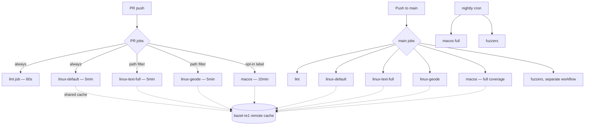

# Design: CI Runtime Reduction

**Status:** Design
**Author:** Claude Opus 4.7
**Created:** 2026-04-20

## Summary

Donner's GitHub Actions CI is the slowest part of the merge cycle: cold-cache
macOS runs land in the **20–25 minute range** for the Build step alone, and
PRs trigger both Linux and macOS jobs, so PR feedback is gated on the macOS
critical path. This doc plans a sequence of changes that should bring PR
feedback under **10 minutes** (warm) / **15 minutes** (cold) without losing
test coverage.

The biggest single drop is already in flight: PR #546 removes the full-Skia
backend, which is the dominant contributor to cold-cache build time. After
that lands, the remaining wins come from infrastructure (remote cache,
matrix splitting) and policy (which jobs gate PRs vs. main).

## Goals

- PR median wall-clock feedback ≤ 10 minutes (warm cache).
- PR worst-case feedback (cold cache) ≤ 15 minutes.
- main-branch full pipeline (including fuzzers) ≤ 20 minutes.
- No reduction in test coverage on main.
- No regression in the ability to catch macOS-specific bugs before release.

## Non-Goals

- Switching CI provider away from GitHub Actions.
- Adding a self-hosted GitHub runner pool (the existing `bazel-re1` worker is
  for remote execution, not for hosting GHA jobs).
- Rewriting tests to be faster — this doc is purely about pipeline
  orchestration and caching.
- Removing any test target (other than what PR #546 already removes with the
  Skia backend).

## Next Steps

1. Land PR #546 (Skia removal) — biggest single drop, no further design work.
2. Measure post-Skia baseline by triggering a fresh CI run on `main` after
   #546 merges; record cold + warm timings into this doc as the new baseline.
3. Pick the highest-leverage Phase 1 item from the implementation plan below
   and start a follow-up PR. Recommended start: enable bazel-remote disk
   cache via the existing `bazel-re1` worker (low risk, large win for
   incremental builds).

## Implementation Plan

- [ ] Milestone 0: Establish baseline and re-measure
  - [ ] Wait for PR #546 to merge
  - [ ] Force a cold-cache CI run on main (push a cache-busting comment) and
        record per-step seconds for both Linux and macOS in this doc
  - [ ] Diff against current numbers (table below); confirm the predicted
        drop materialised
- [ ] Milestone 1: Wire CI to the existing bazel-re1 cache (build-cache only,
      not full RBE — lower-risk first cut)
  - [ ] Add `build:ci-remote-cache` config in `.bazelrc` that points at the
        bazel-re1 instance, sets `--remote_cache=...` and
        `--remote_upload_local_results=true` only on main pushes
  - [ ] Add an `actions/setup-bazel` GitHub action input (or env var) that
        injects credentials from a repo secret
  - [ ] Update `.github/workflows/main.yml` so PR jobs read the cache and
        main pushes write it (mirrors current `cache-save: refs/heads/main`
        policy)
  - [ ] Validate locally: `bazel build --config=ci-remote-cache //...` from
        a clean cache should populate bazel-re1 and a second build should
        hit it
  - [ ] Roll out to Linux first (lower variance), then macOS
- [ ] Milestone 2: Move macOS off the PR critical path
  - [ ] Decide policy: macOS runs on `main` only, OR macOS runs on PRs only
        if they touch macos-flavored files (workflow path filter), OR macOS
        is a non-blocking informational job that posts a status without
        gating merge
  - [ ] Implement chosen policy in `.github/workflows/main.yml`
  - [ ] Add a nightly cron job that runs full `bazel test //...` on macOS so
        Apple-specific regressions are caught within 24h
- [ ] Milestone 3: Move asan-fuzzer to a dedicated workflow
  - [ ] Extract the macOS `Test fuzzers` step into
        `.github/workflows/fuzz.yml` (cron + workflow_dispatch + label-gated
        manual trigger)
  - [ ] Drop `|| true` once the fuzzer corpus is reliably green; the
        comment in `main.yml:99` notes this is overdue
- [ ] Milestone 4: Per-config cache slots
  - [ ] Change `disk-cache` key from `${{ workflow }}-${{ runner.os }}` to
        also include a config hash (e.g. `text-full` vs `default` vs
        `geode` vs `asan-fuzzer`) so different configs don't evict each
        other's outputs
  - [ ] Confirm bazel-contrib/setup-bazel respects the longer key
- [ ] Milestone 5: Matrix-parallelize the heavy variants
  - [ ] Split the `linux` job into `linux-default` (fast, gates merge) and
        `linux-text-full` / `linux-geode` (parallel matrix entries)
  - [ ] Each matrix entry uses its own cache slot (relies on Milestone 4)
  - [ ] Linux runners are ~$0.008/min on GHA — the parallelism is essentially
        free; the constraint is concurrent-job quota
- [ ] Milestone 6: Lint as a separate fast-fail job
  - [ ] Move banned-patterns lint, clang-format check, and CMake mirror sync
        check into a `lint` job that runs in parallel with `build`
  - [ ] Lint job should finish in ≤ 60s — gives near-instant feedback for
        the most common PR failure mode

## Background

### Current state (sampled 2026-04-19, last 7 main runs)

Per-step seconds, taken from `gh run view` for the most recent successful
runs on main. "Cold" = first run after a dep bump or long quiet period;
"warm" = subsequent runs hitting `cache-save: refs/heads/main`.

| Run | macOS Build | macOS Test | macOS Fuzz | Linux Build | Linux Test |
|---:|---:|---:|---:|---:|---:|
| 24645801857 (re-push, warm) | 89s  | 64s  |  10s | 134s  | 102s |
| 24640769418 (PR #544, cold) | 1379s | 263s | 294s | 159s  | 166s |
| 24639459623 (PR #545, cold) | 1492s | 206s | 437s | 352s  |  26s |
| 24623255472 (warm)          | 291s  | 216s |  14s | 355s  | 151s |
| 24618420955 (cold)          | 1250s | 200s | 289s |  95s  | 133s |
| 24613404030 (cold)          | 605s  | 141s | 170s | 1391s | 173s |
| 24597636830 (warm)          | 314s  | 173s |  13s | 330s  | 129s |

Observations:
1. **macOS Build is the bottleneck**: cold runs spend 20–25 min compiling.
   Skia (the full Google Skia tree, ~7,500 deletions in PR #546) is the
   dominant contributor. After removal, macOS cold should fall to ~5–8 min.
2. **macOS runs on every PR** (`if: github.ref == 'refs/heads/main' ||
   github.event_name == 'pull_request'`), so PR feedback is ≥ macOS cold
   time when the PR-side cache is empty.
3. **Cache slot collisions**: `disk-cache: ${{ workflow }}-${{ runner.os }}`
   means `--config=ci`, `--config=asan-fuzzer`, and the future
   `--config=re` all share the same slot. The fuzzer step
   (`--config=asan-fuzzer` → `--config=latest_llvm`) compiles with a
   different toolchain and evicts the main-build cache.
4. **PR cache is read-only** (`cache-save: refs/heads/main`). Long-lived
   PR branches don't accumulate their own incremental cache across pushes.
5. **No remote build cache yet**: the `--config=re` infrastructure (sysroots,
   hermetic toolchain) was added in PR #545 but the actual
   `--remote_cache` / `--remote_executor` flags aren't wired into `.bazelrc`
   or CI yet.

### Why Skia removal is so impactful

Skia is ~250K LOC of C++ that pulls in pathops, fontmgr, color management,
and platform-specific font managers (CoreText on macOS, fontconfig on
Linux). Even with `cache-save` to populate the cache between main runs, any
PR touching anything `skia_deps` reaches transitively triggers a partial
rebuild. The macOS toolchain happens to be slowest at compiling Skia's
template-heavy code.

### Why bazel-remote is the next big lever

After Skia, the remaining slow paths on macOS are tracy, harfbuzz, woff2,
and Geode's `wgpu-native` integration. These aren't individually huge, but
they re-build every time the GHA disk cache misses (which is whenever a PR
runs against a fresh runner). A persistent remote disk cache backed by
bazel-re1 means every action's output is keyed by content hash and shared
across all CI runs, including PRs.

## Proposed Architecture

PR fast path (lint + linux-default) gates merge in ~5–10 min. Heavier
variants run in parallel and provide additional signal but don't gate.
macOS gates only main pushes (and PRs that opt in). The remote cache
collapses incremental work across all jobs.

## Requirements and Constraints

- **No regression in coverage**: every test currently in the matrix must
  still run somewhere — even if it moves to nightly, every commit eventually
  gets the full suite.
- **Macos-specific bugs caught within 24h**: nightly cron must alert on
  failure (existing GHA email-on-failure suffices).
- **No new mandatory infrastructure**: bazel-re1 already exists; we're not
  taking on new ops burden.
- **Cache invalidation must be deterministic**: a content-addressed remote
  cache satisfies this; per-config disk-cache keys help on the GHA side.
- **PR throughput >= 1 PR / 10 min during peak**: don't blow GHA concurrency
  budget with too many parallel matrix entries.

## Risks and Mitigations

- **bazel-re1 outage tanks all CI**: mitigate with `--remote_local_fallback`
  so Bazel falls back to local execution on cache miss/timeout.
- **PR contributors can't read the remote cache** (auth): the cache must be
  read-public, write-authenticated. Most bazel-remote installations support
  this. Verify before rollout.
- **macOS-only regression slips into main**: if macOS is moved off PR gating,
  the nightly cron job is the safety net. Risk window is ≤ 24h. If this is
  unacceptable, alternative is "macOS as informational, not gating" —
  visible status, no merge block.
- **Per-config cache key proliferation blows GHA cache quota**: GHA's
  per-repo cache budget is 10 GB. Per-config slots could push us over. Plan
  is to evict aggressively via `cache-save: refs/heads/main` only, plus
  shorter retention for non-default configs.

## Testing and Validation

For each milestone:

1. Measure baseline (current step seconds) before the change.
2. Apply the change in a feature branch.
3. Force at least one cold-cache run (push a comment-only commit, or use
   workflow_dispatch with cache cleared).
4. Force at least one warm-cache run on top.
5. Compare per-step seconds against baseline; record in a follow-up PR
   description.
6. Roll back if any step regresses by > 10% without a justifying win
   elsewhere.

A small `tools/ci_timing_report.py` script that ingests
`gh run view ... --json jobs` output and emits a markdown table would make
this measurement repeatable. Optional but recommended for Milestone 1.

## Open Questions

1. Does bazel-re1 have spare capacity to serve as a public read cache for
   anonymous PR contributors? If not, fall back to GHA-native caching.
2. Should the nightly macOS job also run `--config=text-full` and
   `--config=geode` matrix entries, or rely on the Linux matrix to cover
   those?
3. Is there appetite to drop macOS from CI entirely, given Donner is
   primarily a library shipped via BCR (Linux-first ecosystem) and the
   editor/sandbox is the only macOS-leaning consumer? This would cut PR
   feedback dramatically but is a policy call beyond this doc.
