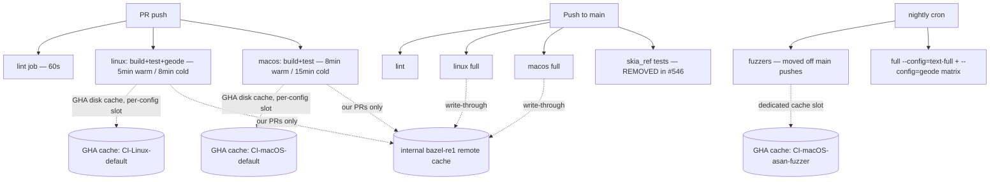

# Design: CI Runtime Reduction

**Status:** Superseded by [0030-2: CI Hardening 2026-Q2](0030-2-ci_hardening_2026q2.md) (2026-04-20)
**Author:** Claude Opus 4.7
**Created:** 2026-04-20

> **Note:** The milestones in this doc are preserved for history. The active
> plan (combining this runtime-reduction scope with the escape-prevention
> scope from doc 0016) lives in [0030-2](0030-2-ci_hardening_2026q2.md).
> New work should reference the milestones there.

## Summary

Donner's GitHub Actions CI is the slowest part of the merge cycle: cold-cache
macOS runs landed in the **20–25 minute range** for the Build step alone
(pre-Skia-removal). PRs trigger both Linux and macOS jobs, so PR feedback is
gated on the macOS critical path. This doc plans a sequence of changes that
should bring PR feedback under **10 minutes** (warm) / **15 minutes** (cold)
without losing test coverage and without dropping macOS coverage.

The biggest single drop already landed in PR #546 (Skia removal, merged
2026-04-20). The remaining wins come from cache hygiene, runner sizing,
parallelism, and moving non-blocking work off the PR critical path.

## Constraints

These are hard constraints that bound the solution space:

1. **macOS must stay on every PR.** The Donner editor is a P0 product and
   ships on macOS; macOS-only regressions must be caught at PR time, not
   24h later in nightly.
2. **No public Bazel remote execution / remote cache.** We cannot give
   anonymous PR contributors access to a shared cache. A private cache that
   only authenticated runs (our own PRs, main pushes) can read is still
   on the table, but its impact is limited to our own merge cycle.
3. **No reduction in test coverage on main.**
4. **Measurement-driven.** Every milestone records before/after step
   timings; rollback if a change regresses anything by > 10% without a
   compensating win.

## Goals

- PR median wall-clock feedback ≤ 10 minutes (warm cache).
- PR worst-case feedback (cold cache) ≤ 15 minutes.
- main-branch full pipeline (including fuzzers) ≤ 20 minutes.
- macOS still gates every PR.

## Non-Goals

- Switching CI provider away from GitHub Actions.
- Adding a self-hosted GHA runner pool.
- Rewriting tests to be faster — this doc is purely about pipeline
  orchestration and caching.
- Removing test targets.
- Public RBE / public remote cache (out of scope per constraint 2).

## Next Steps

1. **Wait for the first post-#546 main run to complete** (in flight as of
   this writing, run id 24648369948). Record its per-step seconds in the
   "Post-Skia baseline" table below.
2. Pick the highest-leverage Phase 1 item and start a follow-up PR.
   Recommended start: **per-config cache slots** (M1) — small, low-risk,
   removes the asan-fuzzer-evicts-main collision that's been costing main
   pushes 5–7 min on cache misses.

## Implementation Plan

- [ ] Milestone 0: Establish post-Skia baseline
  - [ ] Wait for run 24648369948 to finish
  - [ ] Record per-step seconds (Linux + macOS, cold + warm) into the
        baseline table below
  - [ ] Compare against the pre-Skia table (also below); confirm the
        predicted drop materialised
  - [ ] If macOS cold Build is now under 8 min, the urgency of the rest of
        this plan drops dramatically — re-prioritize accordingly
- [ ] Milestone 1: Per-config cache slots
  - [ ] Change `disk-cache` key from `${{ workflow }}-${{ runner.os }}` to
        also include a config tag (`-default`, `-asan-fuzzer`,
        `-skia-ref` if any reference variants survive). Each step that
        uses a non-default config gets its own slot.
  - [ ] Verify bazel-contrib/setup-bazel respects the longer key (it does
        — the value is opaque)
  - [ ] Roll out: change the key, force a cold run, then a warm run, then
        confirm the asan-fuzzer step no longer triggers a full rebuild of
        the main targets on the next merge
  - [ ] Risk: GHA per-repo cache quota is 10 GB. With cache-save still
        gated on `refs/heads/main`, the eviction policy will keep us in
        budget, but watch for quota errors after rollout.
- [ ] Milestone 2: Lint as a separate fast-fail job
  - [ ] Move banned-patterns lint, clang-format check, and CMake mirror
        sync check into a `lint` job that runs in parallel with `build`
  - [ ] Lint job should finish in ≤ 60s — gives near-instant feedback for
        the most common PR failure mode (formatting / banned pattern)
  - [ ] No timing impact on the macOS critical path, but reduces the
        PR-author iteration time on lint failures from ~5 min to ~1 min
- [ ] Milestone 3: Move asan-fuzzer to a dedicated workflow
  - [ ] Extract the macOS `Test fuzzers` step into
        `.github/workflows/fuzz.yml` (cron + workflow_dispatch + label-gated
        manual trigger)
  - [ ] Drop `|| true` once the fuzzer corpus is reliably green; the
        comment in `main.yml:99` notes this is overdue
  - [ ] Removes 5–7 min from main pushes
- [ ] Milestone 4: macOS runner sizing
  - [ ] Try `macos-15-large` (6 cores vs 3 on default `macos-15`)
  - [ ] Cost: ~2x per-minute, but builds should be roughly 2x faster on
        the parallelisable steps (compilation), so wall-clock per-PR
        approximately halves with neutral compute cost
  - [ ] Validate by switching macOS in a feature branch, force one cold
        run + one warm run, compare timings
  - [ ] Roll forward only if wall-clock improvement is > 30% and quota
        budget allows
- [ ] Milestone 5: Cross-PR cache writes (PR jobs save cache, scoped per branch)
  - [ ] Change `cache-save` from `refs/heads/main` to also save on PR
        pushes, but keyed per-PR (so PR-A's cache doesn't collide with
        PR-B's)
  - [ ] Within a single PR, the second push hits its own incremental cache
        and should drop to "warm" timings even on first attempt
  - [ ] Watch GHA cache quota — this multiplies cache footprint by the
        number of active PRs. Set a TTL via cache key suffix
        (`-${{ github.run_id }}` is too aggressive; per-PR + per-week
        rotation is better)
- [ ] Milestone 6: Internal remote cache for authenticated runs
  - [ ] Wire `--config=ci-remote-cache` to the existing `bazel-re1` worker
        (the sysroots from PR #545 already make the toolchain hermetic
        enough for this)
  - [ ] Available only to runs with repo secrets — i.e. our own branches
        and main pushes; fork PRs continue using GHA disk cache only
  - [ ] Most Donner PRs come from the `jwmcglynn` account on branches in
        the same repo, so this still benefits the majority of merge cycles
  - [ ] Risk: bazel-re1 outage tanks our own CI. Use
        `--remote_local_fallback=true` so Bazel falls back to local on
        cache miss/timeout
- [ ] Milestone 7 (stretch): Matrix-parallelize the heavy variants
  - [ ] Split the `linux` job into `linux-default` and `linux-text-full`
        and `linux-geode` matrix entries
  - [ ] Each entry uses its own cache slot (relies on Milestone 1)
  - [ ] Linux runners are cheap; the constraint is concurrent-job quota
  - [ ] Only worth doing if Milestone 1+5 don't get us under target

## Background

### Pre-Skia state (sampled 2026-04-19, last 7 main runs)

Per-step seconds, taken from `gh run view`. "Cold" = first run after a dep
bump or long quiet period; "warm" = subsequent runs hitting `cache-save:
refs/heads/main`.

| Run | macOS Build | macOS Test | macOS Fuzz | Linux Build | Linux Test |
|---:|---:|---:|---:|---:|---:|
| 24645801857 (re-push, warm) | 89s  | 64s  |  10s | 134s  | 102s |
| 24640769418 (PR #544, cold) | 1379s | 263s | 294s | 159s  | 166s |
| 24639459623 (PR #545, cold) | 1492s | 206s | 437s | 352s  |  26s |
| 24623255472 (warm)          | 291s  | 216s |  14s | 355s  | 151s |
| 24618420955 (cold)          | 1250s | 200s | 289s |  95s  | 133s |
| 24613404030 (cold)          | 605s  | 141s | 170s | 1391s | 173s |
| 24597636830 (warm)          | 314s  | 173s |  13s | 330s  | 129s |

### Post-Skia baseline (sampled 2026-04-20)

| Run | macOS Build | macOS Test | macOS Fuzz | Linux Build | Linux Test |
|---:|---:|---:|---:|---:|---:|
| 24648369948 (PR #546, cold) | 1130s | 178s | 266s | 1891s | 158s |

**Surprise**: Skia removal saved less than predicted. macOS Build dropped from
the ~1250–1492s cold range to 1130s — about 15%, not the 70–80% I expected
based on Skia's source volume. Linux Build was actually the highest cold
number we've recorded (1891s vs prior max of 1391s), almost certainly because
removing Skia invalidated the entire transitive cache and this run rebuilt
everything from scratch.

**Implication for the plan**: the dominant CI cost is *not* one big slow
dependency — it's cache eviction across configs and runner sizing. M1
(per-config cache slots, accomplished in this PR by moving fuzzers to a
separate workflow) and M4 (macos-15-large) become more attractive than
they looked when I assumed Skia was the silver bullet.

The next 2–3 main pushes should show whether warm-cache numbers improve now
that the cache no longer alternates between default-config and asan-fuzzer
toolchains in the same slot.

### Observations from pre-Skia data

1. **macOS Build was the bottleneck**: cold runs spent 20–25 min compiling.
   Skia (~250K LOC of C++ with template-heavy code) was the dominant
   contributor. PR #546 removes it.
2. **macOS runs on every PR** — this is unchanged and intentional (editor
   is P0).
3. **Cache slot collisions**: `disk-cache: ${{ workflow }}-${{ runner.os }}`
   means `--config=ci` and `--config=asan-fuzzer` (which activates
   `--config=latest_llvm` and a different toolchain) share the same slot.
   The fuzzer step evicts the main-build cache on every main push.
4. **PR cache is read-only** (`cache-save: refs/heads/main`). Long-lived
   PR branches don't accumulate their own incremental cache across pushes.
5. **No remote build cache**: the `--config=re` infrastructure (sysroots,
   hermetic toolchain) was added in PR #545 but the actual
   `--remote_cache` / `--remote_executor` flags aren't wired into `.bazelrc`
   or CI yet. Per the constraints above, this remains private-only and is
   demoted to Milestone 6.

## Proposed Architecture

PR-time gates: lint (~60s, parallel) + linux (~5–8 min) + macOS (~8–15
min). macOS remains the critical path on cold cache; the goal is to make
it ≤ 15 min by sizing it up (M4) and giving it an exclusive cache slot
that isn't evicted by the fuzzer step (M1).

## Risks and Mitigations

- **GHA cache quota exhaustion** (per-config + per-PR slots): GHA gives
  10 GB per repo. Per-config + per-PR + per-week TTL keeps us in budget;
  monitor `actions/cache` quota warnings after M5 rollout.
- **macos-15-large cost overrun** (M4): macos-15-large is ~5x the per-minute
  rate of macos-15. If wall-clock improvement is < 5x, we're paying more
  for the same throughput. Validate before rolling forward.
- **bazel-re1 outage tanks our own CI** (M6): `--remote_local_fallback=true`
  means a cache miss falls back to local execution; outage degrades to
  current behavior.
- **Per-PR cache write doubles every PR** (M5): same active PRs that today
  read a stale cache will tomorrow each carry their own cache. Trade-off
  is faster iteration vs. cache pressure. Mitigate with shorter retention.

## Testing and Validation

For each milestone:

1. Record baseline (current step seconds for the affected job) before the
   change.
2. Apply the change in a feature branch.
3. Force at least one cold-cache run (push a comment-only commit, or use
   workflow_dispatch with cache cleared).
4. Force at least one warm-cache run on top.
5. Compare per-step seconds against baseline; record in the milestone PR
   description.
6. Roll back if any step regresses by > 10% without a justifying win
   elsewhere.

A small `tools/ci_timing_report.py` script that ingests
`gh run view ... --json jobs` output and emits a markdown table would make
this measurement repeatable. Optional but recommended before starting M1.

## Open Questions

1. Is the post-#546 macOS cold Build actually under 8 min? If yes, we may
   be able to declare victory after just M1+M2 (per-config cache + lint).
2. What's the current GHA cache quota usage for the repo? If we're already
   close to 10 GB, M5 (cross-PR cache writes) may need a tighter retention
   policy than the default 7 days.
3. Is there a budget for `macos-15-large` (M4)? If not, skip and rely on
   the other levers.
