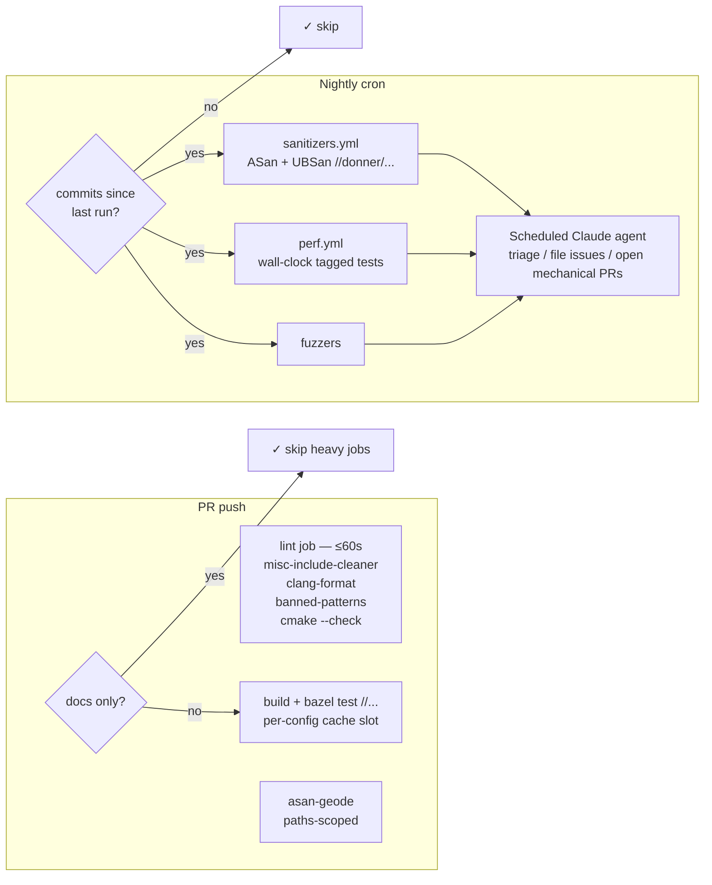

# Design: CI Hardening — April 2026 (Escape Prevention + Runtime Reduction)

**Status:** Design
**Author:** Claude Opus 4.7 (MiscBot)
**Created:** 2026-04-20
**Supersedes:** [0029](0029-ci_runtime.md) (runtime reduction scope folded in here)
**Related:** [0016](0016-ci_escape_prevention.md) (Phase 1 escape-prevention taxonomy)

## Summary

This doc is the consolidated plan for CI work in 2026-Q2. It merges two
streams:

1. **Escape prevention** (new post-0016 categories, issue #552 class): heap
   UAFs, iterator invalidation, perf-test flakes, CMake drift that `--check`
   misses.
2. **Runtime reduction** (originally [0029](0029-ci_runtime.md)): cache
   hygiene, runner sizing, parallelism, moving non-blocking work off the PR
   critical path.

Both streams point at the same north star — **`bazel test //...` is the
single source of truth for local validation**, and `main` is always green.
Any regression CI catches that `bazel test //...` did not is itself a gap
we need to close. As of M2.3, `tools/presubmit.sh` has been retired —
the `tiny`, `text-full`, and `geode` variant lanes now run as
`*_tiny` / `*_text_full` / `*_geode` wrappers under default
`bazel test //...`.

## Goals

- PR median wall-clock feedback ≤ 10 min (warm cache), ≤ 15 min (cold).
- `main` always green: no "preexisting failures", no opt-out-to-land.
- Catch the #552 class (sanitizer-only heap UB) at PR time.
- Header-graph divergence between Apple Clang and Linux GCC surfaced
  locally (`misc-include-cleaner`).
- Perf-test flakes on shared runners stop blocking PRs.
- Nightly jobs skip themselves when no commits landed that day.
- A scheduled triage agent opens issues / PRs for nightly failures.

## Non-Goals

- Switching CI provider.
- Self-hosted runner pool.
- Rewriting tests for speed (separate effort).
- Public RBE / public remote cache.
- Reducing test coverage on `main`.

## Next Steps

1. Land Milestone 1 (fast wins) as child PRs into `feature/ci-hardening-2026q2`.
2. Once M1 is green, cut a first integration PR from the feature branch to
   `main` — batches child PRs to reduce review churn.
3. Start Milestone 2 (cache + nightly infra) in parallel with M1 review.

## Constraints (inherited from 0029)

1. **macOS must stay on every PR.** Editor is P0 on macOS.
2. **No public remote cache.** Private cache (authenticated runs only) is OK.
3. **No reduction in test coverage on `main`.**
4. **Measurement-driven.** Every milestone records before/after timings;
   roll back if a change regresses anything >10% without a compensating win.
5. **`bazel test //...` is the single-source local gate.** New coverage
   must be reachable from that command by default (no flags), unless it
   genuinely can't be (e.g., sanitizer variants).

## Implementation Plan

- [ ] **Milestone 1 — Fast wins (S effort)**
  - [x] M1.1: Land `misc-include-cleaner` in `.clang-tidy` + required `lint.yml` job. Fixes 0016 Category 2 (header-graph divergence); prevents the #520 `<ostream>` hotfix chain. _(Landed with diff-only enforcement; historical debt tracked in [#559](https://github.com/jwmcglynn/donner/issues/559).)_
  - [x] M1.2: Paths-scoped `asan-geode` PR gate for `donner/svg/renderer/geode/**` + `RendererDriver.*`. Catches issue #552 class. _(Delegated, PR in flight.)_
  - [x] M1.3: Add `tools/presubmit.sh --variants` running `tiny`/`text-full`/`geode` tiers. **Retired by M2.3** — `bazel test //...` now covers all variant lanes by default, and `tools/presubmit.sh` has been deleted.
  - [x] M1.4: Add Category 8 (wall-clock perf) + Category 9 (sanitizer-only) to doc 0016. _(Landed as commit 0e51a695 on this feature branch.)_
  - [x] M1.5: Lint as a dedicated fast-fail parallel job. Pull `misc-include-cleaner`, `clang-format`, `check_banned_patterns`, and the `gen_cmakelists.py --check` step into a `lint` job that returns in ≤60s. (Subsumes 0029 M2.)
  - [x] M1.6: `concurrency: cancel-in-progress: true` on PR workflows — cancels superseded runs when a PR is rebased/force-pushed. Near-zero cost, eliminates wasted CI minutes.
  - [x] M1.7: Docs-only path skip. If a PR touches only `docs/**`, `*.md`, `CHANGELOG*`, or similar, short-circuit the heavy build+test jobs with a `paths-ignore:` filter or a first "gatekeeper" job. Design-doc PRs currently pay the full 10–15 min budget for zero code change.
  - [x] M1.8a: `CLAUDE.md` always-green blurb. _(Landed in commit bbdd6c81 on this feature branch.)_
  - [ ] M1.8b: Branch-protection update — make the new `lint`, `asan-geode`, and core test jobs required on `main`. User action (requires admin).

- [ ] **Milestone 2 — Cache and nightly infrastructure (M effort)**
  - [x] M2.1: Per-config cache slots. Extend `disk-cache` key with a config tag (`-default`, `-asan`, `-geode`). Prevents the asan-fuzzer-evicts-main collision observed pre-Skia-removal. (Subsumes 0029 M1.)
  - [x] M2.2: Extend `tools/cmake/gen_cmakelists.py --check` to optionally `cmake --build` the generated CMake via `--build`, while keeping plain `--check` fast and static. Catches drift that the static validator missed in commits 19d41df8, 398d312b, 89448ad7, a7d682fe.
  - [x] M2.3: `bazel test //...` now covers every variant by default. `donner_cc_test(variants=…)` (in `build_defs/rules.bzl`) auto-emits `*_tiny` / `*_text_full` / `*_geode` wrappers for opted-in renderer-sensitive tests, and `tools/presubmit.sh` has been deleted. The 1 tiny-tier + 17 Geode-tier test failures the prior prototype hit are now skipped via runtime `GTEST_SKIP()` guards (tiny: `ActiveRendererSupportsFeature(Text)` check; Geode: `ActiveRendererBackend() == RendererBackend::Geode` check) — all 18 are tracked in [#566](https://github.com/jwmcglynn/donner/issues/566) for un-skip once the underlying backend bugs are fixed.
  - [x] M2.4: Introduce `donner_perf_cc_test` macro splitting correctness counters (PR-gate) from wall-clock thresholds (nightly, tagged `perf`). Retires 5 recent threshold-widening hotfixes (8043ad7b, 1f147f2f, 43f42cf7, ab68092b, 8cd89ef7). Absorbs doc 0016 Category 8.
  - [x] M2.5: Nightly `sanitizers.yml` running ASan+UBSan across `//donner/...`. **Skip-idle**: first job compares `origin/main` HEAD against the last successful `workflow_run` SHA; if unchanged, exit 0 and short-circuit. Monitoring signal only (not PR-blocking).
  - [ ] M2.6: Scheduled Claude triage agent (`/schedule` → `CronCreate`). Runs daily after nightly jobs complete. If the nightly skipped (skip-idle), exit quietly. Otherwise: fetch failure logs, classify (infra vs real bug), file a 🤖-prefixed tracking issue or — for mechanical fixes (missing `target_compatible_with`, threshold widening) — open a PR. Depends on M2.5.
  - [x] M2.7: **Target determinator** via [bazel-diff](https://github.com/Tinder/bazel-diff). A fast `determine-targets` job hashes the PR base + HEAD, emits an affected-target set, and `main.yml`'s build/test jobs run `bazel test <affected>` instead of `//...`. Fallback to `//...` when the PR touches `MODULE.bazel`, `.bazelrc`, `WORKSPACE*`, `build_defs/**`, or `.github/workflows/**`. Typical single-file PR: 15 min → ~3–5 min. (Promotes/replaces old M3.3 "`bazel query rdeps`" sketch — bazel-diff handles `select()` and macro changes more robustly.)
  - [x] M2.8: **Codecov patch-coverage on every PR.** Initial design dropped the `pull_request` trigger from `coverage.yml` thinking Codecov could patch-annotate without a PR-side run, but Codecov's patch coverage requires the PR head's own `coverage.dat` upload to compute "X% of changed lines covered" against the main-branch baseline. Restored the PR trigger (post-merge fixup); the `codecov.yml` `patch.target` / `patch.threshold` config from the original work still applies.

- [ ] **Milestone 3 — Runtime wins (M effort)**
  - [ ] M3.1: Cross-PR cache writes. Change `cache-save` from `refs/heads/main` to also save on PR pushes, keyed per-PR + per-week rotation. Monitor 10 GB GHA quota. (From 0029 M5.)
  - [ ] M3.2: macOS runner sizing trial. Try `macos-15-large` (6 cores vs 3) on a feature branch, force cold+warm runs, compare. Roll forward only if wall-clock improvement >30% and quota allows. (From 0029 M4.)

- [ ] **Milestone 4 — Process (S effort)**
  - [ ] M4.1: Quarantine lint — any PR that adds `flaky = True` must link a tracking issue. Enforce via GH Action.
  - [ ] M4.2: ReadabilityBot / GeodeBot review rule — raw pointers into objects owned by a different `shared_ptr` chain flag for review. Narrow but prevents #552 twin.

- [ ] **Milestone 5 — Stretch (L effort)**
  - [ ] M5.1: Internal remote cache (`bazel-re1`) for authenticated runs. Fork PRs keep GHA disk cache. `--remote_local_fallback=true` so outage degrades gracefully. (From 0029 M6.)
  - [ ] M5.2: Matrix-parallelize heavy variants (`linux-default`, `linux-text-full`, `linux-geode`). Only if M1+M2+M3 don't hit target. (From 0029 M7.)

## Background

### Taxonomy (merged view across 0016 + 0029 + post-0016 escapes)

Categories 1–7 are defined in [0016](0016-ci_escape_prevention.md); 8–9
were added in commit 0e51a695 on this branch.

**Post-0016 escape evidence (since 2026-04-07):**

| Commit / PR | Escape | Category | Mitigation |
|---|---|---|---|
| 80c33ef8 → 13fcd20d | `<ostream>` missing after #520 EnTT modular headers | 2 | M1.1, M1.5 |
| 64ab81f0 | `text_engine` conditional dep broke `tiny` variant | new variant-mode | M1.3 / M2.3 |
| 5f66ea4f, 469bf576 | Linux-only sandbox tests missing `target_compatible_with` | 2 | M1.5 |
| 19d41df8, 398d312b, 89448ad7, a7d682fe | CMake drift `--check` didn't catch | 1 | M2.2 |
| feed4260, f306a846, 26c5f683 | #514 transform-origin broken pixel diffs | 4 | M4 / future |
| 8043ad7b, 1f147f2f, 43f42cf7, ab68092b, 8cd89ef7 | Perf-test wall-clock flakes on shared runners | **8** | M2.4 |
| 79b819ac, 8059ac55, 1b8c85f7 | Geode resvg variants disabled (Mesa / Metal watchdog) | 5 | future |
| #552 | feImage heap UAF + iterator invalidation | **9** | M1.2 + M2.5 |
| dfc7ccad | `PersistentChild` Tracy-linkage flake | 5 | M4.1 |

### Runtime baseline (from 0029 §Post-Skia baseline)

| Run | macOS Build | macOS Test | macOS Fuzz | Linux Build | Linux Test |
|---:|---:|---:|---:|---:|---:|
| 24648369948 (PR #546, cold, post-Skia) | 1130s | 178s | 266s | 1891s | 158s |

0029's surprise: Skia removal saved ~15% on macOS cold Build, not the 70%
hoped. Dominant cost is cache eviction across configs + runner sizing, not
one big dep. M2.1 (per-config slots) and M3.2 (runner size) are therefore
higher-leverage than expected.

### Main health (last 25 runs)

11 of 25 `main.yml` runs red, dominated by `geode-dev` (Mesa llvmpipe,
Metal) and `mac-re` (remote-execution env vars). The always-green policy
announced in `CLAUDE.md` means the next instance of red-on-main is
addressed before the next feature PR lands.

## Proposed Architecture

## Open Questions

- **Docs-only detection (M1.7)** — GHA `paths-ignore:` is simple but
  doesn't compose with required checks. May need a gatekeeper job that
  reports success with a stable name. Trade-off is complexity for
  branch-protection compatibility.
- **Selective testing (M3.3)** — when the diff touches a header, `rdeps`
  can explode. Define a size limit: if query result >N targets, fall
  back to `//...`. Pick N empirically.
- **Perf-gate escalation (M2.4)** — start nightly with issue-only
  (`continue-on-error: true`); escalate to `main`-blocking once stable.
- **Skip-idle heuristic (M2.5)** — "no commits today" misses
  dependency auto-updates (Bazel registry, Dawn). Acceptable start;
  revisit if we miss a regression.

## Testing and Validation

Per-milestone:

1. Record baseline step seconds (`tools/ci_timing_report.py` from 0029).
2. Apply change on the feature branch.
3. Force one cold run + one warm run.
4. Roll back if any step regresses >10% without compensating win.

Specific acceptance gates:

- M1.1: reverting PR #520's `<ostream>` on a dry-run PR → lint fails.
- M1.2: reverting `geode-dev@beadf3893` on a dry-run PR → `asan-geode`
  fails with UAF in `GeodeDevice::counters_`.
- M2.2: pre-fix state of 19d41df8 → `gen_cmakelists.py --check --build`
  fails.
- M2.4: threshold-widening hotfix commits no longer need to exist
  (perf flakes land on nightly; correctness counters stay on PR gate).
- M2.5: skip-idle — `sanitizers.yml` skips the `asan` / `ubsan` jobs on days
  with no commits.

## Rollout Plan

- All work lands on feature branch `feature/ci-hardening-2026q2`.
- Each milestone opens a child PR targeting that branch.
- Child PRs land via squash-merge (per `CLAUDE.md`).
- Feature branch merges to `main` via a single integration PR per
  milestone (or per stable-green batch).
- Policy change in `CLAUDE.md` (always-green) lands with M1 to set
  expectations before new gates tighten.

## Dependencies

- `clang-tidy` 19+ for `misc-include-cleaner`.
- Existing Bazel configs: `--config=asan`, `--config=ubsan`,
  `--config=geode`, `--config=tiny`, `--config=text-full`.
- `actions/cache` 10 GB repo quota (watch for exhaustion after M3.1).
- `gh` CLI for the triage agent.

## Future Work

- [ ] Historical `misc-include-cleaner` debt tracked in [#559](https://github.com/jwmcglynn/donner/issues/559); clear it in directory-scoped waves while the diff-only gate keeps new debt from growing.
- [ ] ThreadSanitizer nightly once threaded code lands.
- [ ] Per-backend pixel-diff threshold auto-calibration (0016 Category 4).
- [ ] Un-skip the 18 tests guarded under [#566](https://github.com/jwmcglynn/donner/issues/566) (1 tiny-tier text assumption, 17 Geode-tier real backend bugs) once the underlying issues are fixed.
