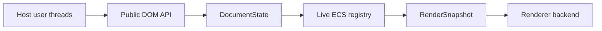

# Design: DOM Lifetime and Concurrent Rendering Snapshots

**Status:** Draft
**Author:** Codex (GPT-5)
**Created:** 2026-05-16

## Summary

Donner's public DOM-style API is already shaped like a dynamic SVG engine:
`SVGElement` values can be copied, held by user code, removed from the tree,
and inserted elsewhere. Internally, however, an element is currently just an
`entt` entity in a shared registry. Removing an element detaches it from the
tree but does not destroy the entity or its components. That keeps old handles
usable, but it also means detached subtrees leak until the whole document is
destroyed.

At the same time, rendering and DOM mutation both access the same live
registry. `SVGDocument` explicitly says it is not thread-safe today, and the
renderer assumes the tree and computed components do not change while a frame
is being prepared and drawn.

This design treats those two problems as one ownership problem:

- The document root owns attached nodes.
- Public DOM handles retain detached nodes while user code can still reach
  them.
- Render snapshots retain exactly the data needed by an in-flight frame.

The proposed architecture adds `DocumentState`, an access coordinator,
element-lifetime anchors for public DOM handles, a central tree-mutation
service, deferred detached-subtree collection, and immutable render snapshots.
The user-facing result is browser-like: a removed node stays valid while the
caller holds it, is collected after it is no longer attached or referenced, and
mutations made during a render appear on the next frame.

After the premortem, the design's course is stricter: `DocumentState` and
scoped access come before further public-handle compatibility work, raw ECS
mutation bypasses are mechanically banned, and diagnostics plus performance
budgets are release requirements rather than follow-up tasks.

## Goals

- Support `appendChild`, `insertBefore`, `replaceChild`, `removeChild`, and
  `remove` as first-class graph mutations with one shared implementation path
  for parser, editor, scripting, and C++ DOM callers.
- Destroy detached entities and all of their ECS components once they are not
  reachable from the document tree, not retained by public DOM handles, and
  not needed by an active render snapshot.
- Preserve DOM handle semantics: an `SVGElement` value held by user code keeps
  the removed element usable while it is detached.
- Make the public `SVGDocument`, `SVGElement`, and XML/DOM wrapper API safe to
  call from multiple threads. Concurrent writes are serialized into a single
  document order; concurrent reads may run together when they do not lazily
  compute derived state.
- Let rendering run from an immutable snapshot. Mutations made while a backend
  is drawing do not affect that frame and become visible on the next snapshot.
- Keep the single-threaded hot path efficient: no per-component atomics, no
  full-registry clone per frame, no backend render loop locking, and no
  mandatory concurrent-mode cost for users that keep the current single-thread
  contract.
- Keep raw ECS access available for advanced users, but document it as outside
  the thread-safety and lifetime guarantees unless the caller uses an explicit
  document access guard.

## Non-Goals

- A lock-free DOM. v1 serializes mutations with a document-level coordinator.
- Parallel execution of independent DOM writes. The contract is deterministic
  thread-safe mutation, not parallel mutation throughput.
- Making `Registry& SVGDocument::registry()` safe for arbitrary concurrent
  direct access. Raw registry access remains an expert escape hatch.
- A JavaScript garbage collector or JS wrapper lifetime model. This design
  provides the C++ DOM lifetime substrate that scripting can later consume.
- Immediate mid-frame visual updates. Rendering observes a snapshot; writes
  after snapshot capture intentionally appear on the next frame.
- Rewriting every system into a pure functional snapshot builder in v1. The
  initial implementation may still update computed ECS components under the
  document write lock before copying render data into a snapshot.
- Cross-document adoption semantics in the first milestone. Moving a node from
  one document to another remains an explicit later decision.

## Next Steps

- Finish routing public DOM APIs through `DocumentState` access guards. Public
  handles now retain document state, but many compatibility paths still resolve
  directly to `EntityHandle`.
- Keep the explicit banned-pattern gate for production direct
  `TreeComponent::{appendChild,insertBefore,replaceChild,remove*}` calls outside
  low-level XML internals and `TreeMutation`.
- Add detached-lifetime diagnostics before render snapshots: detached root
  count, roots retained by public handles, roots retained by snapshots, and
  collection attempts.
- Rework detached-subtree retention toward root-level aggregate counts after
  detach, so handle release does not require repeated subtree scans.
- Prototype render snapshots only after the access model can enforce that
  backend drawing does not touch the live registry.

## Six-Month Premortem

Assume this shipped, users adopted it in editor and server-rendering workloads,
and six months have passed. The likely outcome is mixed: the ownership model
worked, but the migration and concurrency boundaries exposed weak spots that
were visible in this design.

### What Worked

- **Central tree mutation paid for itself.** Bugs stopped scattering across
  `SVGElement`, parser cleanup, XML wrappers, editor operations, and future
  scripting paths once they all shared one mutation service. Dirtying,
  detached-state updates, and collection became testable as one invariant.
- **DOM handle retention matched user expectations.** Users could remove an
  element, mutate it while detached, and reinsert it later without special
  lifetime rules. This was the right model; immediate destruction would have
  been unusable for editor workflows.
- **Reference resolution got more correct.** Treating detached nodes as absent
  from graph and render lookups fixed a class of stale `url(#id)` bugs that
  previously looked like rendering bugs.
- **The snapshot boundary was conceptually right.** The rule "mutations after
  snapshot capture appear next frame" was easy to document and matched how
  users expected render concurrency to behave.
- **The tests became real design constraints.** Tree mutation, detached
  lifetime, duplicate ID lookup, and XML hook tests caught regressions that
  would otherwise have reintroduced leaks through side paths.

### What Fell Over

- **Raw ECS escape hatches kept bypassing the model.** `registry()`,
  `entityHandle()`, direct `TreeComponent` calls, and system-owned synthetic
  trees remained powerful enough to violate lifetime and concurrency
  assumptions. Every unguarded direct mutation became a potential leak,
  stale-ID bug, or data race.
- **The first `SVGElement` anchor was too close to `EntityHandle`.** Keeping
  compatibility operators made the migration easier, but it also let internal
  code keep resolving anchors outside an access scope. In retrospect this
  delayed the hard but necessary split between public handles and scoped ECS
  handles.
- **Per-entity public reference counts were noisy.** Copy-heavy traversal and
  selector APIs created more retain/release traffic than expected. The
  overhead was acceptable for small documents, but large editor selections and
  repeated query results made the single-threaded hot path look worse than the
  design intended.
- **Lazy reads became hidden writes.** APIs that looked like reads, especially
  computed style/layout queries, still mutated computed components. Under a
  read/write coordinator this either forced write locks for "read" methods or
  exposed races. This was obvious in retrospect from the current rendering
  pipeline.
- **Snapshots exposed accidental live-registry reads.** Renderer helpers,
  resource resolution, text layout, filters, markers, and shadow trees had
  convenience paths that reached back into the registry. The snapshot project
  only worked once CI had a test-only guard that failed any backend draw that
  touched live ECS storage.
- **Snapshot memory had cliffs.** Copying renderable data was cheaper than
  cloning the registry, but filters, text runs, images, and repeated paint
  servers produced large frame-local allocations. The first version probably
  needed an arena and resource interning earlier than planned.
- **Epoch-delayed collection looked like leaks.** During active rendering or
  mutation-observer delivery, detached subtrees were correctly retained, but
  users saw memory rise and blamed leaks. The design needed visible diagnostics:
  counts of detached roots, retained-by-handle roots, and retained-by-snapshot
  roots.
- **Duplicate IDs stayed subtle.** Falling back from a detached ID-map entry to
  an attached tree lookup fixed one class of bugs, but the underlying map still
  encoded "first created" rather than "first in document order." More dynamic
  DOM editing made that mismatch increasingly visible.
- **Cross-document movement blocked real users.** Editors naturally want to
  drag nodes between documents, symbols, snippets, and clipboards. Deferring
  adoption semantics was fine for the first milestone, but it became an early
  product limitation.
- **Lock ordering became the concurrency bug factory.** Resource loaders,
  parse callbacks, mutation observers, and renderer callbacks all tempted code
  to call user-controlled logic while holding document access. Deadlocks and
  long write-lock holds were the most likely concurrency failures.
- **Sanitizer coverage lagged.** ASan/TSan caught important issues, but local
  toolchain friction and platform-specific sanitizer support meant the design
  could not rely on "we will run sanitizers later" as a safety net.

### Obvious In Retrospect

- **`DocumentState` should come before more anchor work.** Retrofitting access
  guards onto `std::shared_ptr<Registry>` after public handles have spread is
  harder than introducing the coordinator early and making anchors retain it
  from the start.
- **`entityHandle()` needs a stricter story.** Keeping it as a naked escape
  hatch undermines the concurrency guarantee. The design should require an
  access scope for raw ECS use in concurrent mode and should make unsafe direct
  access visually noisy in code.
- **Every tree mutation path needs enforcement, not convention.** A central
  service helps, but the repo also needs a lint or banned-pattern test for
  production `TreeComponent::{appendChild,insertBefore,replaceChild,remove*}`
  calls outside the low-level XML component and `TreeMutation`.
- **Reference counting should probably be per detached root after detach.**
  Per-entity counts are simple, but once a subtree is detached the collector
  only needs to know whether any handle in that detached root exists. A root
  aggregate can reduce release-time subtree scans and copy churn.
- **The snapshot schema is the hard API.** `RenderSnapshot` must be designed as
  a stable renderer-facing data model, not as a dump of today's components.
  Otherwise every backend or SVG system change leaks live-registry assumptions
  back into rendering.
- **Diagnostics are part of the feature.** Without counters and debug dumps for
  detached roots, external refs, snapshot epochs, lock waits, and snapshot
  allocation size, users and maintainers cannot distinguish correct retention
  from leaks or races.
- **Thread-safe does not mean fast enough.** The design needs explicit budgets
  for lock hold time, wrapper retain/release cost, snapshot allocations, and
  mutation throughput before `ConcurrentDom` can become the default.
- **Invalid tree operations need recoverable errors.** Release assertions are
  useful for internal invariants, but user-driven concurrent DOM editing needs
  `try*` APIs or equivalent recoverable failures for wrong-document nodes,
  stale anchors, invalid reference children, and cycles.
- **Callbacks must be outside locks by construction.** The coordinator should
  make it difficult to invoke resource loading, parse callbacks, mutation
  observers, or user hooks while holding document write access.

### Premortem-Driven Changes To The Plan

The implementation plan below has been reordered around these corrections:

- `DocumentState`/`DocumentAccess` is now the next foundation, not a later
  concurrency milestone.
- `ElementAnchor` compatibility with raw `EntityHandle` is transitional. The
  final API requires scoped access to touch ECS storage.
- Direct tree mutation is enforced by a banned-pattern test, not left to code
  review convention.
- Detached-lifetime diagnostics and performance benchmarks are release gates,
  not follow-up polish.
- Snapshot rendering must ship with a test-only live-registry access guard.

## Implementation Plan

- [x] Milestone 1: Central tree mutation and detached-state tracking.
  - [x] Add a `TreeMutation` service that is the only public path for
        attach, detach, replace, and remove.
  - [x] Move `SVGElement::{insertBefore,appendChild,replaceChild,removeChild,remove}`
        from direct `TreeComponent` calls to `TreeMutation`.
  - [x] Route parsed SVG `XMLNode` DOM mutations through SVG tree mutation
        hooks so parser/editor XML handles share lifetime and invalidation
        behavior. _Landed 2026-05-16._
  - [x] Add release assertions and tests that reject cycles and invalid
        reference children before mutating links.
  - [x] Add `NodeLifetimeComponent` with attached/detached/destroying state,
        entity generation, and detached-root metadata.
  - [x] Add `//donner/svg/tests:svg_tree_mutation_tests` cases for dirty
        propagation, id lookup updates, and sibling/parent link integrity.

- [x] Milestone 2: DocumentState and access foundation.
  - [x] Introduce `DocumentState` as the owner of `Registry`, document
        coordinator, mutation revision, lifetime queues, diagnostics, and
        threading mode. _Initial state/revision/threading-mode shell landed
        2026-05-16._
  - [x] Change `SVGDocumentHandle` from `std::shared_ptr<Registry>` to a
        `std::shared_ptr<DocumentState>` or equivalent internal state handle.
        _Landed 2026-05-16._
  - [x] Add `DocumentReadAccess` and `DocumentWriteAccess`, with a no-op
        release fast path for `SingleThreaded` and a shared mutex for
        `ConcurrentDom`. _Landed 2026-05-16._
  - [x] Add debug owner-thread checks for `SingleThreaded`.
        _Landed 2026-05-16._
  - [x] Change `ElementAnchor` to retain `DocumentState` and resolve only with
        an explicit access object. _Anchors retain `DocumentState` and guarded
        resolution is enforced in `ConcurrentDom` as of 2026-05-16._
  - [x] Route public handle retain/release through `DocumentState` access in
        `ConcurrentDom`. _Landed 2026-05-16._
  - [x] Remove or quarantine implicit `ElementAnchor` to `EntityHandle`
        compatibility from production paths. _Implicit conversion now routes
        through guarded resolution in `ConcurrentDom`; intentionally unguarded
        paths use `unsafeResolve()` / `unsafeRegistry()`._
  - [x] Add a mutation revision counter. _Landed 2026-05-16._
  - [x] Add lock-held diagnostics. _Initial access counters and active lock
        state landed 2026-05-16._
  - [x] Add initial document-level concurrency tests.
        _Landed 2026-05-16._
  - [x] Add a rule that no resource loader, parser callback, mutation observer,
        or user hook may run while document write access is held. _Resource
        loader and SVG parse callback guards landed 2026-05-16; future
        observer/user-hook APIs must use the same guard boundary._

- [x] Milestone 3: Public DOM anchors and scoped ECS access.
  - [x] Add initial registry-retaining `ElementAnchor` scaffolding and per-node
        external DOM wrapper counts. _Landed 2026-05-16._
  - [x] Replace raw `EntityHandle` storage in `SVGElement` wrappers with a
        lifetime-aware anchor. _Landed 2026-05-16._
  - [x] Rebase the initial anchor implementation onto `DocumentState` and
        access guards from Milestone 2.
        _Anchors retain DocumentState as of 2026-05-16. Explicit
        `SVGElement::withReadAccess` / `withWriteAccess` scoped resolution
        helpers landed 2026-05-16._
  - [x] Track external DOM references per detached root after detach, while
        keeping attached-node handle accounting cheap in the single-threaded
        case. _Detached-root aggregate public-handle counts landed
        2026-05-16._
  - [x] Replace public `entityHandle()` with scoped raw-ECS access in
        concurrent mode; keep any unsafe compatibility API visibly named and
        documented as outside thread-safety guarantees. _Initial
        `unsafeEntityHandle()` and `unsafeRegistry()` compatibility names
        landed 2026-05-16. Legacy `entityHandle()` and `registry()` now
        require an active access guard in `ConcurrentDom`._
  - [x] Add `//donner/svg/tests:svg_element_lifetime_tests` cases where removed
        elements remain mutable while held by C++ variables.

- [x] Milestone 4: Deferred collection hardening and enforcement.
  - [x] Add a detached-root queue in document state. _Landed 2026-05-16._
  - [x] When a subtree is detached, retain it if any public handle points into
        it; otherwise collect it after the last handle is released.
        _Landed 2026-05-16._
  - [x] Move detached-root queue and collection state into `DocumentState`.
        _Landed 2026-05-16._
  - [x] Add detached-lifetime diagnostics: queued roots, retained roots,
        collected roots, collection skips by reason, and max retained epoch.
        _Public-handle skip counts, last-pass retained/collected counts, max
        public handles on a retained root, active collection, and reserved
        snapshot/observer epoch counters landed 2026-05-16. Snapshot epoch
        values remain zero until snapshot/observer retainers exist._
  - [x] Add a production banned-pattern test for direct `TreeComponent`
        mutation outside approved low-level files and tests.
        _Landed 2026-05-16._
  - [x] Defer collection for active render snapshots and future mutation
        observers in the current epoch. _The `DetachedNodeCollectionDeferral`
        guard and collector skip path landed 2026-05-16; render snapshots and
        future observers should hold this guard while their epoch can still
        reference detached data._
  - [x] Destroy collected subtrees in post-order with `registry.destroy(entity)`
        so `on_destroy` hooks remove ids, resource refs, render instances, and
        backend cache components. _Landed 2026-05-16._
  - [x] Filter same-document reference and renderer fragment ID resolution so
        detached-but-held nodes do not participate in graph/render lookups.
        _Landed 2026-05-16._
  - [x] Fall back to attached document-tree ID lookup when the legacy ID map is
        masked by a detached duplicate ID. _Landed 2026-05-16._
  - [x] Add tests that count live entities/components before detach, after
        detach while a handle is held, and after the handle is dropped.
        _Landed 2026-05-16._
  - [x] Add ASan coverage for repeated create/remove/reinsert cycles:
        `bazel test --config=asan //donner/svg/tests:svg_element_lifetime_tests`.
        _Landed 2026-05-16 with a repeated create/remove/reinsert regression
        test and macOS LLVM 21 sanitizer runtime rpaths in the shared C++ rule
        helpers._

- [x] Milestone 5: Full public API access routing and concurrency tests.
  - [x] Route every public DOM API method through read or write access. Methods
        that lazily compute derived components, such as `getComputedStyle`,
        are write operations until those computations are snapshot-local.
        _Base attribute and tree-mutation methods route through write access as
        of 2026-05-16. `SVGSVGElement` and core circle/ellipse/rect geometry
        accessors are also routed. Line/path/poly geometry and graphics
        transform accessors are routed as well. Gradient paint-server and
        stop accessors are routed too. Core filter and filter-primitive
        region/offset/blur accessors are routed. Image/use, clipPath, and
        marker/mask/pattern/symbol resource accessors are routed. Text
        content, positioning, textPath, style, and known public filter
        primitive accessors are routed. Scoped document/element access helpers
        are available. Document-level typed mutation helpers are available.
        Snapshot APIs are folded into Milestone 6._
  - [x] Add scoped batching APIs so high-volume callers do not pay one lock and
        one revision increment per attribute. _Initial `SVGDocument::withReadAccess`
        and `withWriteAccess` helpers landed 2026-05-16. `SVGDocumentMutation`
        typed helpers for canvas, attribute, and tree mutations landed
        2026-05-16 while preserving the raw `DocumentWriteAccess` callback
        shape for advanced ECS callers._
  - [x] Add mutation-log hooks for renderer, editor, scripting, and future
        mutation observers. _A bounded polling log of committed mutation
        revisions landed 2026-05-16. Callers can track a sequence cursor and
        detect if older records were truncated; callbacks still must be
        delivered outside document write access._
  - [x] Add `//donner/svg/tests:svg_document_concurrency_tests` with
        multi-threaded read/write stress cases and deterministic final-state
        assertions. _The suite now includes derived API serialization,
        mutation-log coverage, and a concurrent reader/writer stress test with
        per-element deterministic final geometry._

- [x] Milestone 6: Immutable render snapshots.
  - [x] As an interim safety step, live-registry `RendererDriver::draw`
        takes document write access while rendering in `ConcurrentDom`.
        This prevents render-vs-DOM data races before snapshots exist, but it
        intentionally does not satisfy the final "mutate while backend drawing"
        goal. _Landed 2026-05-16._
  - [x] Replace the interim write-lock bridge with snapshot replay outside
        document access. _Landed with command-stream snapshots: normal
        `RendererDriver::draw(SVGDocument&)` now captures under write access and
        replays backend callbacks after release._
  - [x] Add `RenderSnapshot`, an immutable value graph containing canvas size,
        draw order, resolved render instances, paths, paints, text runs,
        filter graphs, shadow-tree expansions, and snapshot-owned resources.
        _V1 stores a renderer command stream. Path, image, text, filter, layer,
        clip, and paint commands are value-copied; text replay uses a
        snapshot-owned text registry, and resource references inside paint,
        clip, text, and filter payloads are remapped to snapshot-owned data._
  - [x] Add `SnapshotBuilder`: acquire document write access, update dirty
        computed components, copy the renderable data into `RenderSnapshot`,
        record the source revision, then release the document before backend
        drawing begins. _Implemented by `RendererDriver::captureRenderSnapshot`
        and `RenderSnapshotRecorder`._
  - [x] Change `RendererDriver` to traverse `RenderSnapshot` rather than the
        live registry for normal document rendering. _`draw(SVGDocument&)`
        captures a snapshot, then replays it._
  - [x] Keep source entity ids in snapshots only for diagnostics and cache keys;
        backend rendering must not dereference the live registry. _Path and text
        replay remove live source-entity lookups; paint and resource payloads
        now use snapshot-owned handles._
  - [x] Add replay-boundary tests that fail if backend callbacks run while
        document access is held after snapshot capture. _A deeper
        component-storage access guard is deferred to M7 with the resource-ref
        audit._
  - [x] Add tests where one thread mutates attributes and tree structure while
        another renders; assert each frame is internally consistent and later
        frames observe later revisions. _`renderer_snapshot_tests` covers old
        snapshot immutability, later-snapshot visibility, and DOM mutation
        completing while backend replay is blocked._

- [x] Milestone 7: Performance and CI gates.
  - [x] Audit and deep-decouple legacy resource references inside snapshot
        payloads, including gradient paint servers, masks, clip-path masks,
        filter feImage sub-documents, markers, and patterns, so replay never
        depends on live ECS storage even for complex resource paints.
        _Landed by adding a snapshot-owned resource registry plus a replay
        invariant test that counts live document handles in captured command
        payloads. Since replay payloads no longer retain live ECS handles,
        snapshots also no longer defer detached-subtree collection._
  - [x] Add `SVGElementHandleBench` to measure wrapper copy/destruction,
        traversal, querySelector, and remove/reinsert overhead in
        `SingleThreaded` and `ConcurrentDom` modes. _Added as
        `//donner/benchmarks:svg_element_handle_bench`._
  - [x] Add `DetachedSubtreeCollectionBench`, including retained-by-descendant
        and reinsert-before-collection cases. _Added as
        `//donner/benchmarks:detached_subtree_collection_bench`._
  - [x] Add `RenderSnapshotBench` fixtures for 1k, 10k, and 100k element
        documents; budget snapshot capture separately from backend draw. _Added
        as `//donner/benchmarks:render_snapshot_bench`, with capture and
        TinySkia replay measured separately._
  - [x] Add a repeatable DOM lifetime performance capture runner that records
        benchmark JSON artifacts for handle overhead, detached collection, and
        snapshot capture/replay. _Added as
        `//donner/benchmarks:dom_lifetime_perf_capture` and
        `donner/benchmarks/run_dom_lifetime_perf_bench.sh`._
  - [x] Gate `ConcurrentDom` default eligibility on lock hold time,
        retain/release cost, snapshot allocation volume, and mutation
        throughput budgets. _The capture runner can enforce budget JSON files.
        `dom_lifetime_default_eligibility_budget.json` is the draft release
        gate for making `ConcurrentDom` the default. The first optimization pass
        made the strict gate green by removing document locks from ordinary
        handle copy/destruction, batching read-only traversal under one read
        access, keeping selector traversal inside a single guarded scan, and
        asserting final attached-handle release does not take a document lock
        while final detached-handle release performs at most one collection
        write lock.
        `dom_lifetime_perf_smoke_budget.json` validates the budget plumbing
        without asserting release eligibility._
  - [x] Add a thread-sanitizer build config if the supported toolchains can
        run it reliably, then gate the concurrency tests under that config.
        _Added `--config=tsan`; verified
        `//donner/svg/tests:svg_document_concurrency_tests`,
        `//donner/svg/renderer/tests:renderer_snapshot_tests`, and
        `//donner/svg/renderer/tests:renderer_driver_tests`. This also required
        widening the LLVM 21 macOS sanitizer runtime rpaths for deeper test
        package paths._
  - [x] Update `docs/developer_docs.md`, `docs/architecture.md`, and public
        API Doxygen once the design ships. _Developer and architecture docs now
        describe opt-in `ConcurrentDom`, detached-node collection, render
        snapshots, TSan checks, and the budget capture target. Public API
        comments on `SVGDocument`, `SVGElement`, `DocumentState`, and
        `RenderSnapshot` document the new contracts._

## Background

Current public wrappers are lightweight value types around `EntityHandle`.
`SVGDocument` owns `std::shared_ptr<Registry>`, while `SVGElement` holds only
an `entt::basic_handle<Registry>`. This creates three important constraints:

- A copied `SVGElement` does not tell the document that user code is retaining
  the entity.
- `TreeComponent::remove` clears parent/sibling links but leaves the entity and
  every component in the registry.
- A raw `EntityHandle` can become stale if the registry destroys and recycles
  that entity generation.

`RendererDriver::draw` already snapshots the draw-order entity list before a
filter pre-pass mutates render-instance storage. That is a useful local fix,
but it is not a full concurrency boundary: the draw still reads the live
registry, computed components, resources, and tree-derived references.

## Proposed Architecture

```
SVGDocument / SVGElement / XMLNode
        |
        v
DocumentAccess guard
        |
        v
DocumentState  ---- mutation revision ----> SnapshotBuilder
        |                                             |
        v                                             v
Live ECS Registry                              RenderSnapshot
        |                                             |
        v                                             v
TreeMutation + LifetimeCollector          RendererDriver + backend
```

`DocumentState` is the unit of ownership. It owns the live registry, document
coordinator, mutation revision, lifetime queues, diagnostics, and threading
mode. `SVGDocument`, `SVGElement`, and XML wrappers are value facades that
retain or reference this state.

The live registry remains the authoritative mutable DOM/ECS store. All public
DOM methods enter through `DocumentState`, which supplies the correct access
guard, resolves element anchors, performs the mutation or read, and bumps the
document revision for writes.

Rendering first builds a `RenderSnapshot`. Backend drawing consumes only that
snapshot. Once snapshot capture releases the document lock, user threads may
continue mutating the live registry while the current frame draws.

### Ownership Model

Entity lifetime is governed by three independent roots:

- **Document tree:** the entity is reachable from `SVGDocumentContext::rootEntity`
  through `TreeComponent` links. This root is released when the entity or an
  ancestor is detached.
- **Public DOM handle:** user code holds `SVGElement`, XML node, or a future
  DOM wrapper that resolves to the entity. This root is released when the last
  wrapper copy is destroyed or reassigned.
- **Render snapshot:** an in-flight frame owns copied render data or
  snapshot-owned resource references derived from the entity. This root is
  released when the `RenderSnapshot` is destroyed after rendering.

This is not pure reference counting over ECS components. The tree is structural
reachability, public handles use reference counts, and render snapshots use
snapshot ownership. A detached subtree is collectible only when all three roots
are gone.

After detach, public-handle accounting should aggregate at the detached root.
Individual anchors may still know their source entity, but the collector should
be able to answer "does this detached root have any public handle?" without
rescanning the subtree on every release.

### Element Anchors

`SVGElement` should stop storing only `EntityHandle`. Instead it should store a
small `ElementAnchor` handle:

```cpp
class ElementAnchor {
 public:
  Entity entity() const;
  std::uint32_t generation() const;
  DocumentState& documentState() const;

  EntityHandle resolve(DocumentAccess& access) const;
};
```

The exact pointer type is an implementation detail, but the requirements are:

- The anchor retains the document state so an element handle cannot outlive its
  registry storage.
- The anchor records the entity generation observed at creation time.
- `resolve()` validates that the entity still exists at that generation before
  exposing an `EntityHandle`.
- Copies of public wrappers update an external-reference counter. In
  `SingleThreaded` mode this can be a plain intrusive counter; in
  `ConcurrentDom` mode it must be atomic or protected by the document
  coordinator.
- Anchor destruction notifies the lifetime collector when the released element
  is in a detached subtree.

The design intentionally counts public DOM handles, not every internal ECS
reference. Renderer and systems should pass `Entity`/`EntityHandle` internally
within an access scope rather than manufacturing public anchors for hot loops.

The final API should not allow implicit conversion from a public anchor to a
raw `EntityHandle`. Transitional compatibility may exist while migrating the
repo, but production code should resolve anchors only through
`DocumentReadAccess` or `DocumentWriteAccess`. This is the main correction from
the premortem: if raw ECS handles remain easy to obtain, the concurrency
contract is not enforceable.

### Tree Mutation

All tree edits should flow through a single service:

```cpp
class TreeMutation {
 public:
  static void InsertBefore(DocumentAccess& access, Entity parent,
                           Entity newNode, Entity referenceNode);
  static void AppendChild(DocumentAccess& access, Entity parent, Entity child);
  static void ReplaceChild(DocumentAccess& access, Entity parent,
                           Entity newChild, Entity oldChild);
  static void RemoveChild(DocumentAccess& access, Entity parent, Entity child);
  static void Remove(DocumentAccess& access, Entity entity);
};
```

`TreeComponent` can remain the low-level link container, but it should no
longer be the public mutation API. `TreeMutation` is responsible for:

- validating parent/reference relationships and rejecting cycles;
- separating detach from destroy;
- marking dirty flags and `RenderTreeState` exactly once;
- updating detached-root lifetime metadata;
- preserving internal subtree links for detached nodes;
- queuing candidate roots for collection;
- bumping the document mutation revision.

This gives parser, editor, future scripting, and direct C++ callers one place
to enforce graph invariants.

This must be enforced mechanically. Production calls to
`TreeComponent::{appendChild,insertBefore,replaceChild,removeChild,remove}`
outside the low-level XML component implementation, shadow-tree internals that
are explicitly audited, and `TreeMutation` should fail a banned-pattern test.
Code review alone is not strong enough for this invariant.

### Detached-Subtree Collection

Removing a node detaches the entire subtree from the document tree but keeps
the subtree internally linked. The removed root enters a detached-root table.

Collection runs at safe points:

- after a DOM write completes;
- before or after snapshot capture;
- during document destruction.

The collector checks whether the detached root has any public-handle references
inside the subtree and whether any active snapshot epoch still needs data from
the subtree. If not, it destroys the subtree in post-order.

Post-order destruction matters because parent components often reference
children, and `entt` `on_destroy` signals must observe a still-coherent local
subtree while each node is removed. Tests should cover `IdComponent` removal,
resource-reference release, render-instance cleanup, and backend cache cleanup.

Diagnostics are part of this component, not a later debug tool. At minimum,
`DocumentState` should expose or log:

- queued detached roots;
- detached roots retained by public handles;
- detached roots retained by snapshot or observer epochs;
- roots collected in the last collection pass;
- collection skips grouped by reason.

Initial `DetachedNodeDiagnostics` counters for queued roots, public-handle
retention, public-handle skips in the last pass, max public handles on a
retained root, future snapshot/observer epochs, active collection, and last-pass
collection landed 2026-05-16. `DetachedNodeCollectionDeferral` now gives future
snapshot and observer code a concrete RAII hook; the collector reports roots
skipped while a deferral epoch is active.

Initial `DocumentAccessDiagnostics` counters landed 2026-05-16. They record
`ConcurrentDom` read/write guard creation, shared/unique lock acquisition,
reentrant guards nested under a write guard, active read-lock count, and whether
a write lock is currently held. `SingleThreaded` mode intentionally does not
touch those counters.

Resource loader and SVG parse callback invocations are guarded as of
2026-05-16: if a document context is present, those user callbacks assert that
the current thread does not hold document write access. This keeps the
coordinator contract concrete while future mutation observers and scripting
hooks are still unimplemented.

## Concurrency Model

### Public API Contract

The supported thread-safe surface is the DOM-style API:

- `SVGDocument` value facades;
- `SVGElement` and derived element wrappers;
- XML node wrappers used by the DOM layer;
- future scripting bindings that call through the same wrappers.

Raw ECS access via `registry()` and `entityHandle()` is conditionally safe only
inside an explicit access guard. Existing advanced users can still use it, but
the documentation must be clear that direct concurrent registry mutation is
outside Donner's guarantees.

As of 2026-05-16, the legacy `registry()` and `entityHandle()` names enforce
that rule in `ConcurrentDom`: they require `withReadAccess()`,
`withWriteAccess()`, `readAccess()`, or `writeAccess()` to be active on the
current thread. The visibly named `unsafeRegistry()` and `unsafeEntityHandle()`
compatibility APIs remain available for callers that intentionally bypass the
thread-safety contract.

`ElementAnchor` follows the same rule: implicit conversion to `EntityHandle`,
component helpers, and `registry()` use guarded resolution in `ConcurrentDom`.
Only `unsafeResolve()` / `unsafeRegistry()` bypass the check.

### Access Guards

`DocumentState` owns the coordinator and must land before full anchor
migration:

```cpp
enum class ThreadingMode {
  SingleThreaded,
  ConcurrentDom,
};

class DocumentState {
 public:
  DocumentReadAccess read();
  DocumentWriteAccess write();
  std::uint64_t revision() const;
};
```

In `SingleThreaded` mode the guard implementation is a debug ownership check
plus a no-op release build fast path. In `ConcurrentDom` mode:

- read access enters a lightweight shared gate, with nested reads under an
  active read/write guard reusing the existing access;
- write access takes exclusive ownership, blocks new readers, and waits for
  active readers to drain;
- writes bump a monotonic revision counter;
- no callbacks into user code run while holding the write lock;
- renderer backend drawing runs without any document lock.

The coordinator must make callbacks outside locks the default shape. Resource
loading, parser callbacks, mutation observers, user hooks, and any future
scripting callbacks should receive copied inputs or deferred work items after
write access is released.

Most current DOM methods become straightforward:

- attribute getters and tree navigation use read access;
- setters and tree mutation use write access;
- lazy computed-style/layout reads use write access until those computations
  move fully into snapshots.

For high-volume callers, add scoped batching APIs:

```cpp
document.withWriteAccess([](SVGDocumentMutation& mutation) {
  mutation.setAttribute(rect, "x", "10");
  mutation.setAttribute(rect, "y", "20");
});
```

Batching avoids lock/unlock and revision increments per attribute while still
using the same mutation implementation.

## Rendering Snapshot Model

Rendering becomes a two-step operation:

1. Capture a snapshot from the live document.
2. Render the immutable snapshot.

Snapshot capture is allowed to block DOM writers briefly. Backend drawing is
not.

The first implementation can keep today's computed components in the registry:

- acquire document write access;
- run `RendererUtils::prepareDocumentForRendering`;
- copy the renderable state into `RenderSnapshot`;
- release access;
- render from `RenderSnapshot`.

This is intentionally less invasive than immediately making every SVG system
pure. It still provides the key user-visible behavior: after snapshot capture,
DOM mutations can proceed while the backend draws, and those mutations are not
visible until the next snapshot.

`RenderSnapshot` should own or share immutable data, not borrow live component
storage. A normal render item should contain value data such as:

- source entity id for diagnostics only;
- resolved transform;
- opacity, clip, mask, filter, marker, and paint parameters;
- path geometry or a snapshot-owned pointer to immutable path data;
- text layout data and resolved per-span styles;
- image and resource references through snapshot-owned resource handles.

Renderer backends must not call back into `Registry` while drawing a snapshot.
The CI target `//donner/svg/renderer/tests:renderer_snapshot_tests` should
include a test-only registry guard that fails if snapshot rendering touches the
live registry.

The snapshot schema is a renderer-facing API, not a serialization of today's
components. It should be reviewed as such. If a snapshot item contains a
pointer into the live registry or requires a helper that takes `Registry&`, the
snapshot boundary has failed.

## API / Interfaces

Likely public additions:

```cpp
struct SVGDocument::Settings {
  ThreadingMode threadingMode = ThreadingMode::SingleThreaded;
};

class SVGDocument {
 public:
  RenderSnapshot captureRenderSnapshot();

  template <typename Func>
  decltype(auto) withReadAccess(Func&& func) const;

  template <typename Func>
  decltype(auto) withWriteAccess(Func&& func);
};
```

Raw ECS access should move behind explicit scopes:

```cpp
document.withWriteAccess([](DocumentWriteAccess& access) {
  EntityHandle rect = access.resolve(rectElement);
  rect.get<components::DirtyFlagsComponent>().mark(...);
});
```

The default threading mode is an open question. The conservative rollout is:

1. ship `SingleThreaded` as the default to preserve current performance;
2. add `ConcurrentDom` as an opt-in setting;
3. flip the default only after handle-copy and DOM-mutation benchmarks show
   acceptable overhead.

Existing `Renderer::draw(SVGDocument&)` can keep its signature. Internally it
captures a snapshot and delegates to `Renderer::draw(RenderSnapshot&)`.

`entityHandle()` should not remain the normal escape hatch in concurrent mode.
The migration path can keep an unsafe compatibility method for advanced users,
but safe raw ECS use must be tied to a visible access scope.

## Error Handling

Invalid tree operations should become recoverable API errors where possible
instead of undefined behavior:

- inserting an ancestor into its descendant;
- inserting a reference node that is not a child of the target parent;
- mutating an element whose anchor no longer resolves;
- moving nodes across documents before adoption semantics exist.

The current API returns `void` for many mutation methods, so v1 may keep release
asserts for impossible internal states and add `try*` variants for recoverable
user errors:

```cpp
ParseResult<void> SVGElement::tryAppendChild(const SVGElement& child);
ParseResult<void> SVGElement::tryRemoveChild(const SVGElement& child);
```

The non-`try` methods can call the `try` methods and release-assert on errors,
matching current Donner style.

## Performance

Performance risks are concentrated in four places:

- public wrapper copies;
- snapshot capture;
- lock contention during multi-threaded mutation;
- detached-subtree diagnostics and collection bookkeeping.

Targets:

- `SVGElement` copy/destruction overhead in `SingleThreaded` mode stays within
  10% of the current raw-handle wrapper on `SVGElementHandleBench`.
- Removing and collecting a detached subtree is O(subtree size), not O(document
  size), verified by `DetachedSubtreeCollectionBench`.
- Capturing a render snapshot is O(rendered entity count) with no backend draw
  lock contention. `RenderSnapshotBench` records capture and draw separately.
- A backend render of an already-captured snapshot performs zero document-lock
  operations, asserted by `renderer_snapshot_tests`.
- `DocumentAccessDiagnostics` reports total and maximum read/write lock hold
  time. `SVGElementHandleBench` includes lock counters in ConcurrentDom cases
  so budget reviews can inspect lock count and hold time from benchmark JSON.
  Traversal and selector scans are measured as scoped read operations because
  performance-sensitive callers should batch repeated DOM reads under one guard.
  The strict budget asserts traversal and selector scans take one read lock per
  scan and no write locks.
- Final public-handle release is measured separately for attached and detached
  elements. Attached release must not take a document lock; detached release may
  take one write lock to collect an eligible subtree.
- Snapshot allocation volume and peak memory are tracked as first-class
  metrics, not inferred from wall-clock render time. The first landed proxy is
  `RenderSnapshot::estimatedCommandStorageBytes()`, reported by
  `RenderSnapshotBench`; nested allocations inside path/text/filter payloads
  remain to be accounted before a final threshold is enforced.
- `ConcurrentDom` cannot become the default until lock hold time,
  retain/release overhead, mutation throughput, and snapshot allocation budgets
  are green on representative documents.

Budget capture workflow:

- Run the manual benchmark target to capture JSON artifacts:

  ```sh
  bazel test -c opt //donner/benchmarks:dom_lifetime_perf_capture --test_output=all
  ```

- Run `donner/benchmarks/run_dom_lifetime_perf_bench.sh [out_dir]` for local
  artifact capture under `.benchmarks/dom_lifetime/`.
- The default capture excludes the 100k-element snapshot cases to keep routine
  runs tractable; set `DOM_LIFETIME_BENCH_FULL=1` before baseline collection.
- Use `DOM_LIFETIME_BENCH_SMOKE=1` only for script and target validation, not
  for budget setting.
- Establish the first thresholds from repeated opt-mode captures on a quiet
  representative host. The initial gate should compare ratios and algorithmic
  shape, not a single absolute wall-clock number.
- To enforce the draft default-eligibility budget manually:

  ```sh
  DOM_LIFETIME_BENCH_ENFORCE_BUDGETS=1 \
    bazel test -c opt //donner/benchmarks:dom_lifetime_perf_capture --test_output=all
  ```

- The strict budget must stay green before `ConcurrentDom` can be considered
  for default eligibility. If a future change regresses it, that failure is the
  release gate that prevents flipping `ConcurrentDom` to the default
  prematurely.

The main design choice for low overhead is mode specialization. `SingleThreaded`
documents use debug owner-thread checks and avoid document access locks.
Public element wrappers retain per-node shared control blocks, so ordinary
copy/destruction does not take a document write lock in either mode.
`ConcurrentDom` documents pay for synchronization when reading or mutating the
document graph, or if the project later decides to make concurrent DOM the
default.

## Security / Privacy

This design does not add new external inputs, but it changes memory-safety and
thread-safety boundaries for untrusted SVG processing.

Trust boundary:



Security-relevant guarantees and planned enforcement:

- Public DOM handles do not produce use-after-free when nodes are detached and
  collected. Enforced by `//donner/svg/tests:svg_element_lifetime_tests` under
  normal and `--config=asan` runs.
- Snapshot rendering does not read live registry component storage after
  snapshot capture. Enforced by
  `//donner/svg/renderer/tests:renderer_snapshot_tests`.
- Concurrent DOM API use does not data-race through the supported public API.
  Enforced by `//donner/svg/tests:svg_document_concurrency_tests` and a
  thread-sanitizer CI target once `--config=tsan` exists.
- Tree mutations preserve parent/child/sibling consistency. Enforced by
  `//donner/svg/tests:svg_tree_mutation_tests` and a randomized mutation
  fuzzer added in Milestone 7.
- Production code cannot bypass SVG lifetime handling through direct
  `TreeComponent` mutation. Enforced by the banned-pattern test described in
  Milestone 4.

Raw `Registry&` access remains outside these guarantees unless the caller uses
the documented access guards. In concurrent mode, safe raw ECS use must be
scoped by `DocumentReadAccess` or `DocumentWriteAccess`.

## Testing and Validation

- Unit tests:
  - `svg_tree_mutation_tests`: cycle rejection, valid reparenting, sibling
    links, dirty propagation, id-map updates.
  - `svg_element_lifetime_tests`: remove while held, remove with descendant
    held, drop last handle and collect, reinsert before collection, document
    destruction while element handles exist.
  - `svg_document_concurrency_tests`: concurrent reads, serialized writes,
    writer/readers during snapshot capture, deterministic final state.
  - `renderer_snapshot_tests`: snapshot immutability, no live-registry access
    during backend draw, mutation appears next frame.
- Lints:
  - Banned-pattern test for production direct `TreeComponent` mutation outside
    approved low-level files and `TreeMutation`.
- Fuzzing:
  - Random tree-mutation fuzzer over append/remove/replace/reinsert with
    invariant checks after every operation.
  - Concurrent stress fuzzer that runs random DOM reads/writes around snapshot
    capture with bounded threads and deterministic seeds.
- Sanitizers:
  - ASan for detached-subtree collection.
  - TSan via `--config=tsan` for DOM concurrency and snapshot-rendering
    targets.
- Performance:
  - `SVGElementHandleBench`.
  - `DetachedSubtreeCollectionBench`.
  - `RenderSnapshotBench`.
  - `dom_lifetime_perf_capture` manual benchmark target for JSON artifact
    capture and ratio reporting.
  - Existing renderer benchmarks report snapshot capture and backend draw as
    separate timings.
- Diagnostics:
  - Tests assert detached-root counters and collection skip reasons for
    retained-by-handle, retained-by-snapshot, and collectible roots.

## Alternatives Considered

### Leave detached entities in the registry forever

This is today's effective behavior. It preserves removed-node handles but leaks
every removed subtree until document destruction. It also makes long-running
editor and scripting sessions unbounded in memory.

### Destroy immediately on `removeChild`

Immediate destruction fixes memory leaks but breaks DOM semantics. User-held
`SVGElement` values would become invalid as soon as the node is removed, making
remove/edit/reinsert flows impossible and creating use-after-free risks for
existing callers.

### Pure reference counting

Reference counting public handles is necessary, but not sufficient. Attached
nodes may have zero public handles and still must remain alive because the
document tree owns them. Render snapshots may need data derived from entities
after a subtree has been detached. The design therefore combines graph
reachability, public-handle reference counts, and snapshot ownership.

### Mark-and-sweep detached nodes

A periodic mark-and-sweep collector can find nodes reachable from the document
root, but C++ cannot scan arbitrary user stack variables to discover
`SVGElement` handles. It still needs explicit public-handle accounting.

### Epoch reclamation only

Epoch reclamation protects concurrent readers, but it does not protect a
long-lived removed element handle after the reader leaves its access scope.
Epochs are useful for snapshot handoff; they do not replace DOM handle
retention.

### Full registry clone per frame

Cloning the registry for every render gives strong snapshot semantics but has
the wrong cost model for large documents and frequent frames. `RenderSnapshot`
copies only renderable data and lets the live registry keep serving DOM calls.

### Coarse render lock

Holding a document lock for the entire render is simple and safe, but it
violates the goal that user threads can mutate the DOM while rendering occurs.
The design only blocks writers during snapshot capture, not during backend
drawing.

## Open Questions

- Should `ConcurrentDom` be opt-in permanently, or should it become the default
  after performance work lands?
- Should `removeChild` gain a return value matching browser DOM semantics, or
  should Donner keep the current `void` method and add `tryRemoveChild` for
  errors?
- What migration path should replace existing `entityHandle()` callers with
  scoped raw-ECS access, and what unsafe compatibility API name makes remaining
  direct access visually obvious?
- How much of `RendererUtils::prepareDocumentForRendering` should remain as
  live-registry mutation under the snapshot-builder lock, and which systems
  should move to snapshot-local computed data first?
- Should cross-document insertion be rejected in v1 or implemented as
  `adoptNode` plus recursive component migration?

## Future Work

- [ ] JavaScript wrapper integration: map JS object lifetime onto
      `ElementAnchor` instead of inventing a separate script-side retention
      model.
- [ ] `MutationObserver` design on top of the mutation revision log.
- [ ] Persistent immutable component chunks for cheaper snapshot capture after
      heavy editor workloads prove where copying is expensive.
- [ ] Parallel snapshot building for independent render subtrees.
