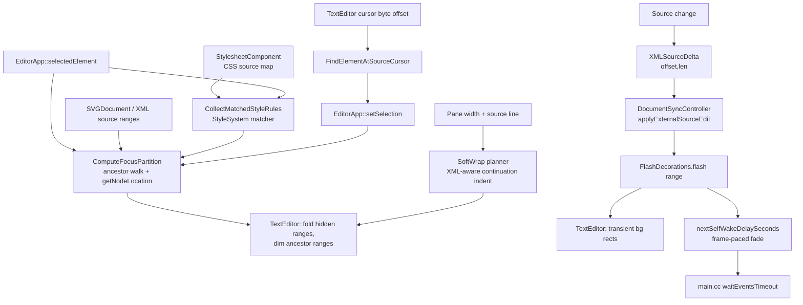

# Design: Text Editor Revamp — Focus View + Change Flash + Context Wrap

**Status:** Draft
**Author:** Claude Opus 4.7
**Created:** 2026-05-23

## Summary

Five source-pane features for `//donner/editor`'s `TextEditor`, all built
on the XML-owned source store that
[`structured_text_editing.md`](structured_text_editing.md) already ships:

1. **Relevant-nodes focus view** — an opt-in mode that, given the current
   selection, hides the source of every element that is neither the selected
   element, one of its referenced resource elements, nor one of their ancestors.
   The selected element and referenced paint/resource elements are shown in full
   color; ancestor opening/closing tags are dimmed (grayed) as structural
   context; everything else is folded away. This makes a deep SVG legible: you
   see the thing you're editing, the resources it depends on, and the path to
   them, not 4,000 sibling lines.

2. **CSS selector/style provenance focus** — focus mode also follows the author
   CSS rules that participate in styling the selected element. Selecting
   `<rect class="cls-92">` keeps the matching `.cls-92 { ... }` rule visible,
   draws a dependency line from the `class` token to the matched selector, and
   continues following same-document refs used by those declarations such as
   `fill: url(#paint)` or `clip-path: url(#clip)`.

3. **Changed-character flash** — when source bytes change (a canvas writeback,
   an autocomplete/paste, an incremental edit), the inserted span gets a
   transient background highlight that fades out over a few hundred milliseconds,
   so the user can see _what just changed_ — especially edits the canvas made on
   their behalf during a drag.

4. **Context-aware soft wrap** — the source pane eliminates horizontal scrolling
   by wrapping long logical lines at word/attribute boundaries. Wrapped XML
   attribute lists align continuations to the first attribute column (the column
   after the element-name space), while non-element text keeps the previous
   line's leading indent. This is a view-layer wrap only: source bytes, offsets,
   undo, and save output remain unchanged.

5. **Source-cursor selection sync** — moving the cursor in the source pane
   selects the deepest SVG element containing that source offset. Moving from a
   leaf element up into its parent `<g>` makes that group the active canvas/tree
   selection, and focus mode recomputes against the group immediately.

Focus, CSS provenance, flash, and soft wrap are **view-layer decorations**.
Source-cursor selection sync is a UI selection bridge; it changes `EditorApp`
selection but not the document, the XML source store, parsing, or the DOM. They
consume data the editor already has: the selection (`EditorApp::selectedElement()`),
element↔source-range mapping (`XMLNode::getNodeLocation()` /
`XMLDocument::nodeAtSourceOffset`), parsed stylesheet rules, and the
`XMLSourceDelta` stream `DocumentSyncController` already mirrors into the
`TextEditor`. CSS provenance adds missing source ranges to the CSS model and
records how `<style>` text maps back into the SVG source; it does not add an
editor-only selector scanner. The flash fade reuses the event-driven self-wake
seam (`EditorShell::nextSelfWakeDelaySeconds()` / event-loop wake callback) so
the animation runs without busy-looping the on-demand render loop. Soft wrap
consumes only the visible text buffer and current pane width.

Scope boundary: this is polish on top of structured editing, enabled by default
but controlled by runtime toggles in the View menu and source text context menu,
fully reversible. It is **not** a rewrite of the `TextEditor` widget and adds no
new source-of-truth.

## Goals

- **Focus view shows exactly the selected element, referenced resources, and
  ancestor context.** With an element selected and focus mode on, the source pane
  renders the selected element's full span normally, recursively follows
  same-document `url(#...)` and `href="#..."` / `xlink:href="#..."` references
  from the selected subtree, renders those referenced elements normally, dims
  each focused element's ancestor opening and closing tags, and folds every other
  line. The source pane draws pastel, angled, rounded-corner connector lines from
  each visible reference token through staggered left-gutter lanes to the opening
  `<` of the referenced element.
  _Verified by:_ a pure-function unit test mapping `(SVGDocument, selected element) → {fullColorLineRanges, dimmedLineRanges, hiddenLineRanges}` over a
  nested fixture plus reference fixtures for paint/compositing attributes,
  `style="...url(#...)"`, and descendant `xlink:href`, asserting the exact line
  partition. Lives in a new `//donner/editor/tests:focus_view_tests`.

- **Focus view follows matched author CSS.** With a selected element and focus
  mode on, the source pane renders the matching author stylesheet rules that
  participate in styling that element. A `class`, `id`, or selector-relevant
  attribute token links to the matched selector branch; matching declaration
  blocks remain visible; same-document refs inside those declarations are
  recursively added to the focus set. User-agent stylesheet rules remain hidden
  because they have no source location.
  _Verified by:_ CSS parser range tests for rule/selector/declaration spans,
  style-trace tests over class/id/attribute selectors, and focus-view tests that
  assert a selected `<rect class="cls-92">` reveals the `.cls-92` rule and any
  `url(#...)` paint resources referenced by that rule.

- **CSS provenance lives in the CSS/style layers, not in `TextEditor`.** The CSS
  parser records selector/rule source ranges, `StylesheetComponent` records how
  local CSS offsets map back into the SVG document source, and the style system
  exposes a trace helper that reuses the same selector-matching path as
  `computePropertiesInto`.
  _Verified by:_ a unit test that feeds the same fixture through style
  computation and style tracing and asserts that every traced match has the same
  specificity and stylesheet priority that style computation used.

- **Focus view never desyncs source↔DOM offsets.** Folding/dimming is a render
  filter only; `TextEditor::getText()` and every source offset are byte-identical
  whether focus mode is on or off, and edits made while focused map to the same
  XML scopes as when unfocused.
  _Verified by:_ a test that toggles focus mode around an edit and asserts
  `getText()` and the resulting `XMLSourceDelta`/`ReparseScope` are identical to
  the unfocused path.

- **Focus view follows selection changes** and scrolls external canvas/tree
  selections into view. When the selection originated from source-cursor
  movement, focus recomputes without overriding the user's cursor or text
  selection. When selection clears, focus mode reveals the whole document.
  _Verified by:_ a test driving selection changes through `EditorApp::setSelection`
  and asserting the focus partition updates, plus that source-originated
  selection suppresses the canvas/tree→source range push.

- **Flash highlights the inserted span of any source change.** An `XMLSourceDelta`
  with `insertedLength > 0` produces a flash over `[offset, offset+insertedLength)`
  at full intensity, decaying to zero over the configured duration, then removed.
  _Verified by:_ a `FlashDecorations` time-model unit test asserting intensity at
  `t=0`, `t=duration/2`, `t≥duration`, and that the decoration set is empty after
  expiry.

- **Flash animates without burning the event loop.** While any flash is active,
  the editor reports a frame-paced self-wake; once all flashes expire it reports
  none and the loop returns to blocking in `waitEvents()`.
  _Verified by:_ a test asserting `nextSelfWakeDelaySeconds()` (or the
  `FlashDecorations` wake accessor it composes) returns a small positive value
  during a flash and `nullopt` after expiry — same self-wake contract the
  source-pane debounce uses (`EditorShell::nextSelfWakeDelaySeconds`,
  `donner/editor/main.cc`).

- **The decorations degrade safely on adversarial source.** Out-of-range or
  multi-byte-straddling deltas/ranges are clamped, never indexing past the buffer;
  the number of simultaneous flashes is capped; focus over a huge document is
  line-range work, not per-character.
  _Verified by:_ unit tests with deltas past EOF, zero-length and whole-buffer
  ranges, multi-byte UTF-8 boundaries, and a flash-count cap.

- **The source pane does not require horizontal scroll.** Long XML elements wrap
  at spaces between attributes, continuation rows align under the first
  attribute, and selection/cursor hit-testing resolves back to the original
  logical line and byte offsets.
  _Verified by:_ pure `SoftWrap` tests for XML attribute-list alignment,
  non-element indentation, and empty lines, plus existing `TextEditor` selection
  and source-sync tests to guard offset stability.

- **The source cursor drives UI selection.** When the cursor moves in the source
  pane, the editor resolves its byte offset to the deepest containing SVG
  element and replaces the canvas/tree selection with that element. If focus mode
  is enabled, the focus partition recomputes for the newly selected element
  without reselecting the source range and moving the cursor away from the
  user's edit location.
  _Verified by:_ source-selection unit tests for offset→deepest-element mapping
  and cursor→element mapping, plus `TextEditor` cursor-change tests that ensure
  keyboard and mouse navigation produce a consumable cursor-change signal.

## Non-Goals

- **No new document state or source-of-truth.** Focus, flash, and wrap are per-view
  ephemeral state. They do not persist, serialize, or affect Save.
- **No `TextEditor` widget rewrite.** We extend the existing folding, palette,
  and per-line decoration paths; we do not replace ImGuiColorTextEdit internals.
- **No semantic diffing.** The flash highlights the _byte_ range a delta reports.
  It does not compute a semantic/word-level diff of what changed.
- **No multi-selection focus.** Initial scope focuses the primary selected
  element only; multi-select uses the first element (full behavior is Future Work).
- **No persisted user theme work** beyond one dim color + one flash color added
  to the existing `Palette`.
- **No animation framework.** The flash uses a minimal time-decay model, not a
  general easing/tween system.
- **No source reformatter.** Soft wrap does not insert newlines or rewrite
  attributes. Automatic physical reflow can be a later command once undo, blame,
  and save semantics are explicit.
- **No full browser DevTools cascade panel.** Initial CSS provenance shows the
  matched source rules and declaration refs needed for focus mode. It does not
  yet explain every overridden declaration, cascade layer, or inherited winning
  value as a separate UI panel.
- **No external stylesheet fetch.** Initial scope covers inline `<style>` author
  stylesheets and style/presentation attributes already present in the SVG
  source. `@import` and linked external stylesheets need a separate loading and
  trust model.

## Next Steps

1. Land `FlashDecorations` (the simplest, most self-contained piece): a per-view
   transient-highlight store fed by `XMLSourceDelta`, drawn as background rects,
   wired into `nextSelfWakeDelaySeconds()`.
2. Land the focus-partition pure function (`SVGDocument` + selection → line
   ranges) with exhaustive unit tests, before any rendering.
3. Extend focus partition with CSS style provenance: source ranges for matched
   author rules, dependency links from class/id/attribute tokens to selectors,
   and declaration refs to resources.
4. Wire the partition into `TextEditor` rendering (fold hidden ranges, dim
   ancestor ranges) behind a runtime toggle.
5. Replace horizontal source scrolling with context-aware soft wrap so focus mode
   and flash remain readable in the fixed-width source pane.

## Implementation Plan

- [ ] **M1: Changed-character flash**
  - [ ] Add `FlashDecorations` (per-view): `flash(SourceRange, now)`, `tick(now)`,
        `activeBackgrounds() → spans+intensity`, `nextWakeSeconds(now)`.
  - [ ] Feed it from `DocumentSyncController` where it already applies
        `XMLSourceDelta`s into the editor (`applyExternalSourceEdit` /
        `mirrorSourceDeltas`), flashing `[offset, offset+insertedLength)`.
  - [ ] Draw active flashes as background rects in `TextEditor`'s line-draw path
        (same layer as line-highlight/error markers), color from `Palette`.
  - [ ] Compose `FlashDecorations::nextWakeSeconds()` into
        `EditorShell::nextSelfWakeDelaySeconds()`.
  - [ ] Tests: time model, delta→flash enqueue, count cap, out-of-range clamp,
        wake integration.
- [ ] **M2: Focus partition (pure function)**
  - [ ] `ComputeFocusPartition(const SVGDocument&, const SVGElement& selected) → FocusPartition {fullColor, dimmed, hidden}` as resolved line ranges via
        `parentElement()` walk + `getNodeLocation()`.
  - [ ] Follow same-document fragment references from XML attributes: `url(#...)`
        paint/compositing values, `style` values, and `href` / `xlink:href`
        chains from the selected subtree and referenced resources.
  - [ ] Emit connector metadata from each reference token to the referenced
        element's opening tag so the source pane can draw arrowed dependency
        lines.
  - [ ] Tests: nested fixtures, referenced paint/compositing resources, href
        chains, root selected, leaf selected, mixed-line elements,
        no-source-location fallback.
- [ ] **M2.5: CSS selector/style provenance**
  - [ ] Add source ranges to parsed CSS rules: rule range, selector prelude
        range, selector-list branch ranges, and declaration ranges. Declaration
        source ranges already exist; this milestone makes selector/rule ranges
        first-class and keeps them in `css::SelectorRule`.
  - [ ] Teach `RuleParser`/`StylesheetParser` to preserve those ranges from the
        token stream instead of reconstructing them from strings.
  - [ ] Add a `StylesheetSourceMap` to `StylesheetComponent` that maps local CSS
        offsets to SVG document offsets. `ProjectStyleContents` builds this map
        while concatenating text/CDATA children; programmatic
        `SVGStyleElement::setContents` and the user-agent stylesheet parse with
        no document source map.
  - [ ] Factor the stylesheet loop in `StyleSystem::computePropertiesInto` into
        a reusable matcher/trace helper so diagnostics and editor focus use the
        same `ShadowedElementAdapter`, specificity handling, and UA priority
        rules as style computation.
  - [ ] Extend `ComputeFocusPartition` to include matched author CSS rule ranges
        in the full-color set, add dependency links from selector-relevant XML
        tokens to matched selector ranges, and parse same-document refs from
        matched declarations into the existing recursive focus-resource walk.
  - [ ] Tests: parser source ranges, `<style>` local→document source-map
        segments, style trace specificity parity, direct class/id/attribute
        selector focus, selector-list branch targeting, and CSS declaration
        `url(#...)` resource following.
- [ ] **M3: Focus rendering + toggle**
  - [ ] `TextEditor::setFocusPartition(...)` / `clearFocusPartition()`: hide
        `hidden` line ranges (extend the fold path), apply a dim `ColorIndex`
        over `dimmed` ranges, leave `fullColor` normal.
  - [ ] Draw focus reference connectors as angled lines with rounded bends and an
        arrowhead at the referenced element.
  - [ ] Recompute the partition when selection changes (View-mode only); clear
        on no selection.
  - [ ] Menu items in both View and the source text context menu to toggle focus
        mode (default on).
  - [ ] Tests: offset-stability across toggle, partition-follows-selection,
        focus recompute does not push text selection.
- [ ] **M4: Context-aware soft wrap**
  - [ ] Add a pure `SoftWrap` planner that maps a logical line + pane width to
        visual rows without changing source offsets.
  - [ ] XML element continuations align after the element name's following space;
        other lines use leading indent.
  - [ ] Disable the horizontal scrollbar by default and route cursor, selection,
        flash, and mouse hit-testing through the visual-row mapping.
  - [ ] Tests: XML attribute alignment, leading-indent fallback, empty-line row,
        plus existing `TextEditor` selection/source-sync regressions.
- [ ] **M5: Source-cursor selection sync**
  - [ ] Add a source-offset lookup helper that maps text-editor cursor byte
        offsets to the deepest containing SVG element.
  - [ ] Consume `TextEditor::isCursorPositionChanged()` from `EditorShell` and
        replace the active `EditorApp` selection when the cursor lands inside a
        different element.
  - [ ] Suppress the canvas/tree→source highlight push for selections that
        originated in the source pane so cursor-driven selection does not yank
        the cursor back to the element start.
  - [ ] Recompute focus mode for the new source-driven selection.
  - [ ] Tests: deepest-offset lookup, cursor lookup, cursor-change signaling,
        and focus recompute without source range reselection.
- [ ] **M6: Polish**
  - [ ] Per-keystroke-flash policy decision (see Open Questions) + setting.
  - [ ] Reduced-motion / disable-flash setting.
  - [ ] Dim color + flash color in both light/dark palettes.

## Background

### Current state

- The `TextEditor` (ImGui widget) wraps a headless `TextEditorCore`
  ([`text_editor_behavior.md`](text_editor_behavior.md),
  [`text_editor_refactor.md`](text_editor_refactor.md)). It already supports
  code folding (`foldBegin_`/`foldEnd_`, `setFoldEnabled`), a `Palette` of
  `ColorIndex` colors, per-line highlighting (`setHighlightedLines`), error
  markers, and XML-aware syntax colorization.
- The XML source store owns bytes and anchors; edits emit
  `XMLSourceDelta {offset, removedLength, insertedLength, sourceVersion}`
  (`donner/base/xml/XMLSourceStore.h`). `DocumentSyncController` already mirrors
  these deltas into the `TextEditor` via `applyExternalSourceEdit`
  ([`structured_text_editing.md`](structured_text_editing.md) M5.5).
- Element↔source mapping exists: `XMLNode::getNodeLocation()` →
  `FileOffsetRange`, `XMLDocument::nodeAtSourceOffset(offset)`, and
  `SourceSelection.cc`'s `HighlightElementSource`. `SVGElement::parentElement()`
  walks ancestors.
- The editor is **event-driven**: `main.cc` blocks in `waitEvents()` and
  produces no frames between inputs; time-based animation must self-schedule
  frames via `EditorShell::nextSelfWakeDelaySeconds()` →
  `EditorWindow::waitEventsTimeout()` (see
  [`0033-editor_design_tool_responsiveness.md`](0033-editor_design_tool_responsiveness.md)).
- CSS style computation already has the right architectural choke point:
  `StyleSystem::computePropertiesInto` iterates `StylesheetComponent`, calls
  `Selector::matches(...)` with `ShadowedElementAdapter`, adjusts specificity
  for the user-agent stylesheet, then parses declarations into `PropertyRegistry`.
  The editor should trace that same path rather than separately interpreting
  selectors.
- CSS declarations already carry local CSS source offsets/ranges
  (`css::Declaration::sourceOffset` / `sourceRange`). Selector/rule ranges and
  local-CSS-offset → SVG-source-offset mapping are the missing pieces. Today
  `ProjectStyleContents` concatenates `<style>` text/CDATA children before
  parsing, which loses the source mapping that focus mode needs.

### Why now

Structured editing made the source pane a real editing surface, so its
_legibility_ matters: deep documents are unreadable, long attribute lists waste
horizontal space, and canvas-driven source writebacks are invisible. These
features address all three with view-only decorations and no new invariants.

## Proposed Architecture

Four view-only subsystems and one selection bridge hang off data the editor already produces.



**Focus view** is stateless-per-frame: a pure function maps the DOM + selection
to a line partition; `TextEditor` renders that partition. It recomputes only on
selection change (View-mode on), so it's cheap. Hiding reuses the existing fold
machinery; dimming is a color override pass on the ancestor ranges.

**CSS provenance** is split across Donner's existing layers. The CSS parser owns
local rule/selector/declaration ranges. `StylesheetComponent` owns stylesheet
source provenance, including segment maps from concatenated `<style>` CSS bytes
back to SVG document source bytes. `StyleSystem` owns selector matching and
specificity, so it exposes a trace helper built from the same matching loop as
style computation. `FocusView` consumes that trace, maps CSS ranges back to
source lines, and follows refs found in matched declaration values.

**Flash decorations** is a tiny per-view animation store. Each flash is a
`{SourceRange, startTime}` with a fixed duration; intensity is
`1 - clamp((now-start)/duration, 0, 1)`. It is fed by the same delta stream that
already updates the editor view, drawn as background rects, and — because the
editor is event-driven — exposes a `nextWakeSeconds()` that
`EditorShell::nextSelfWakeDelaySeconds()` folds in so the fade actually advances.

**Soft wrap** is a line-local visual layout pass. It breaks logical lines at
word/attribute boundaries to fit the source-pane width. XML element lines align
continuations under the first attribute, while other lines keep their leading
indent. Cursor, selection, flash, and mouse hit-testing map through the visual
rows back to the original logical line and column.

Together they fit the existing draw order: background fills (line highlight,
error marker, **flash**) → colorized glyphs (with **dim** override on ancestor
ranges) → visual-row layout (**soft wrap**) → folded-line elision (**focus
hidden** ranges).

## API / Interfaces

```cpp
// donner/css/Stylesheet.h
struct SelectorRule {
  Selector selector;
  std::vector<Declaration> declarations;
  SourceRange ruleSourceRange;      // local CSS offsets
  SourceRange selectorSourceRange;  // local CSS offsets
};

// donner/svg/components/StylesheetComponent.h
struct StylesheetSourceMapSegment {
  std::size_t cssStartOffset;
  std::size_t cssEndOffset;
  FileOffset documentStartOffset;
};

class StylesheetSourceMap {
public:
  std::optional<SourceRange> mapToDocumentSource(SourceRange localCssRange) const;
};

// donner/svg/components/style/StyleSystem.h
struct MatchedStyleRule {
  Entity stylesheetEntity;
  std::size_t ruleIndex;
  std::size_t selectorEntryIndex;
  css::Specificity specificity;
  SourceRange selectorSourceRange;              // document source when available
  SourceRange ruleSourceRange;                  // document source when available
  std::vector<SourceRange> declarationRanges;   // document source when available
};
std::vector<MatchedStyleRule> CollectMatchedStyleRules(EntityHandle handle);

// donner/editor/FocusView.h  (pure, no ImGui)
struct FocusPartition {
  std::vector<LineRange> fullColor;  // selected element's span
  std::vector<LineRange> dimmed;     // ancestor opening/closing tags
  std::vector<LineRange> hidden;     // everything else
  std::vector<FocusReferenceLink> referenceLinks;
};
// Walks selected.parentElement()* and resolves getNodeLocation() ranges to
// lines. Returns an empty partition (== "show everything") when no source
// location is available.
FocusPartition ComputeFocusPartition(const svg::SVGDocument& document,
                                     const svg::SVGElement& selected);

// donner/editor/FlashDecorations.h  (per-view)
class FlashDecorations {
public:
  void flash(SourceRange byteRange, std::chrono::steady_clock::time_point now);
  void tick(std::chrono::steady_clock::time_point now);   // drops expired
  // Visible background spans + intensity in [0,1] for the current frame.
  std::vector<ActiveFlash> activeBackgrounds() const;
  // Seconds until the next frame is worth drawing, or nullopt if idle.
  std::optional<float> nextWakeSeconds(std::chrono::steady_clock::time_point now) const;
private:
  static constexpr std::size_t kMaxFlashes = 64;        // resource cap
  static constexpr float kDurationSeconds = 0.4f;       // tunable
};

// donner/editor/TextEditor.h  (new view hooks)
void setFocusPartition(const FocusPartition& partition);
void clearFocusPartition();
void flashSourceRange(SourceRange byteRange);  // delegates to FlashDecorations
std::size_t getByteOffsetAtCoordinates(Coordinates coordinates) const;

// donner/editor/SoftWrap.h  (pure, no ImGui)
struct SoftWrapSegment {
  int startColumn;
  int endColumn;
  int indentColumns;
  bool continuation;
};
std::vector<SoftWrapSegment> ComputeSoftWrapSegments(std::string_view line, int maxColumns);

// donner/editor/SourceSelection.h
std::optional<svg::SVGElement> FindElementAtSourceOffset(const svg::SVGDocument& document,
                                                         std::string_view source,
                                                         std::size_t offset);
std::optional<svg::SVGElement> FindElementAtSourceCursor(const svg::SVGDocument& document,
                                                         const TextEditor& textEditor);
```

`EditorShell::nextSelfWakeDelaySeconds()` gains one clause:
`min(existing, flashDecorations_.nextWakeSeconds(now))`.

## Data and State

- All new state is per-`TextEditor`/per-`EditorShell`, UI-thread only, never
  serialized. No cross-thread access (the async renderer is untouched).
- CSS range/provenance state lives with parsed CSS, not with the editor:
  `css::Stylesheet` stores local CSS ranges, and `StylesheetComponent` stores the
  optional source map that makes those ranges meaningful in an SVG source file.
  The user-agent stylesheet and programmatic `setContents` stylesheets simply
  have no document source map, so focus mode can skip their source decorations.
- Flash ranges are byte offsets into the live buffer. Because a flash may
  outlive subsequent edits, flashes are adjusted by later `XMLSourceDelta`s with
  the same shift logic the editor view already uses (or simply dropped if an
  edit overlaps them). Anchoring to source-store anchors is an option but
  overkill for a 400 ms decoration — see Alternatives.
- Focus partition is recomputed from scratch on selection change; no incremental
  maintenance across edits (selection rarely changes per frame).
- Soft-wrap rows are per-view layout state derived from the current visible
  buffer and pane width. They are discarded/rebuilt as view state and never
  written back to the XML source store.

## Performance

- Focus: one `parentElement()` walk (depth-bounded) + N range resolutions on
  selection change; rendering hides whole line ranges (existing fold cost). No
  per-keystroke work.
- CSS provenance: one stylesheet-rule scan on selection change, using the same
  selector matcher style computation already uses. For normal editor workloads
  this is cheaper than a render pass and avoids any per-frame or per-keystroke
  selector work. If a document has very large stylesheets, cache the most recent
  `(sourceVersion, selectedEntity)` trace result in `EditorShell`.
- Flash: O(active flashes ≤ 64) per frame; fade frames only occur while a flash
  is live (self-wake), then the loop idles. No steady-state cost.
- Soft wrap: O(visible logical line length) when pane width or text changes.
  Segment generation is line-local and produces a compact visual-row list; no
  duplicate text buffer is allocated.
- None of these features touches the async render worker or the frame budget for
  canvas rendering.

## Security / Privacy

Source text is untrusted SVG (Donner's "never crash on adversarial input"
invariant). These features do pure offset arithmetic over that text:

- **Trust boundary:** `XMLSourceDelta` offsets/lengths and resolved
  `SourceRange`s are treated as untrusted. Every range is clamped to
  `[0, buffer.size()]` and snapped to UTF-8 boundaries before indexing; an
  out-of-range or stale-version delta is dropped, never dereferenced. This
  mirrors the `GetAttributeLocation` hardening in
  [`structured_text_editing.md`](structured_text_editing.md) M−1.
- **Resource caps:** simultaneous flashes are capped (`kMaxFlashes`); excess
  coalesce/evict oldest, so a rapid edit storm can't grow unbounded view state.
  Focus partition is line-range data (bounded by line count), not per-character.
- **CSS source maps are advisory:** invalid or unmappable CSS ranges produce no
  source decoration instead of falling back to text search. Local CSS offsets and
  mapped document offsets are clamped before they are used by focus rendering.
- **No new parsing/protocol surface**, so no fuzzer is strictly required; the
  clamp/boundary paths are covered by the negative unit tests in Goals. If the
  flash offset-adjustment logic grows complex, add it to the existing source-edit
  fuzzer corpus.
- **No sensitive data**: decorations derive only from the document already shown.

## Testing and Validation

- **Unit (pure):** `ComputeFocusPartition` line partition over nested fixtures
  and reference fixtures; CSS selector/rule source ranges and stylesheet source
  maps; `FlashDecorations` time model + cap + clamp; `SoftWrap` XML continuation
  alignment and indent fallback. These are the red→green core and run without
  ImGui.
- **Style provenance:** trace helper tests for class, id, type, attribute,
  selector-list, and descendant selectors; specificity parity against
  `computePropertiesInto`; no-source behavior for user-agent stylesheets.
- **Integration:** offset-stability across focus toggle; partition follows
  `setSelection`; source-originated selection does not push a source range back
  over the user's cursor; matched CSS rules and CSS declaration refs enter the
  focus set; delta→flash enqueue through `DocumentSyncController`.
- **Wake integration:** `nextSelfWakeDelaySeconds()` returns a positive value
  during a flash and `nullopt` after expiry (same harness style as
  `TextPaneTypingRender_tests`).
- **Adversarial:** deltas past EOF, whole-buffer/zero-length ranges, multi-byte
  boundaries, flash-count overflow.
- **Optional golden:** one pixel test that an inserted span renders the flash
  background color at `t=0` and clean after expiry — only if the time-model unit
  test proves insufficient (avoid pixel flakiness for an animation).

Build/run:
`bazel test //donner/css/parser:parser_tests //donner/svg/components/style:style_system_tests //donner/editor/tests:focus_view_tests //donner/editor/tests:flash_decorations_tests //donner/editor/tests:soft_wrap_tests`
(and the full `//...` gate).

## Alternatives Considered

- **Anchor-backed flashes** (register each flash as a source anchor so it moves
  with edits): correct but heavyweight for a 400 ms decoration; chosen approach
  shifts/drops flashes on overlapping deltas instead. Revisit if flashes are made
  long-lived.
- **Dim descendants of the selected element too** (only the selected element's
  _own_ tag full-color, its children dimmed): arguably cleaner "focus," but the
  user asked for the selected element "in full color," which most naturally
  includes its subtree. Captured as an Open Question / setting.
- **Per-character semantic diff for flash** (highlight only the changed glyphs
  within a replaced token): nicer but needs a diff; the byte-range from
  `XMLSourceDelta` is already exact and free.
- **Hiding via a filtered virtual buffer** instead of folding: would duplicate
  the buffer and risk offset desync; folding keeps one buffer and one offset
  space (a hard requirement).
- **Editor-side CSS text search** for `.class`/`#id`: fast to prototype but
  wrong for selector semantics, specificity, selector lists, comments, escaping,
  generated/programmatic styles, and source maps. Native parser ranges plus the
  style-system matcher keep focus behavior aligned with rendering.

## Open Questions

- **Flash on every keystroke?** Flashing each typed character is likely
  distracting. Proposal: flash external/structured changes (canvas writeback,
  paste, autocomplete, multi-char) by default; gate per-keystroke flashing behind
  a setting (default off). Needs a UX call.
- **Focus: dim or also hide ancestor _bodies_?** Show only ancestor open/close
  tags (proposed) vs. also showing ancestor attributes inline. Proposed: open tag
  (with attributes) + close tag, dimmed.
- **Focus + active editing in a hidden region** (e.g. an edit lands outside the
  focused set via canvas writeback): auto-reveal the changed range, or leave it
  folded and rely on the flash? Proposed: briefly reveal + flash.
- **Toggle scope:** is focus mode global, or remembered per document? Proposed:
  global editor setting.
- **Matched CSS scope:** initial proposal shows every matched author rule for
  the selected element. A future cascade/provenance pass can compact this to only
  declarations that survive the cascade, plus inherited declarations from
  ancestors when they affect the selected element's computed style.

## Future Work

- [ ] Multi-selection focus (union of selected elements + their ancestor chains).
- [ ] Full cascade explanation: winning/overridden declarations, inherited
      values, and property-level provenance for a selected element.
- [ ] Breadcrumb header showing the dimmed ancestor chain as clickable crumbs.
- [ ] Smooth fold/unfold transition when focus follows selection.
- [ ] Configurable flash color per change-origin (canvas vs. text vs. paste).
