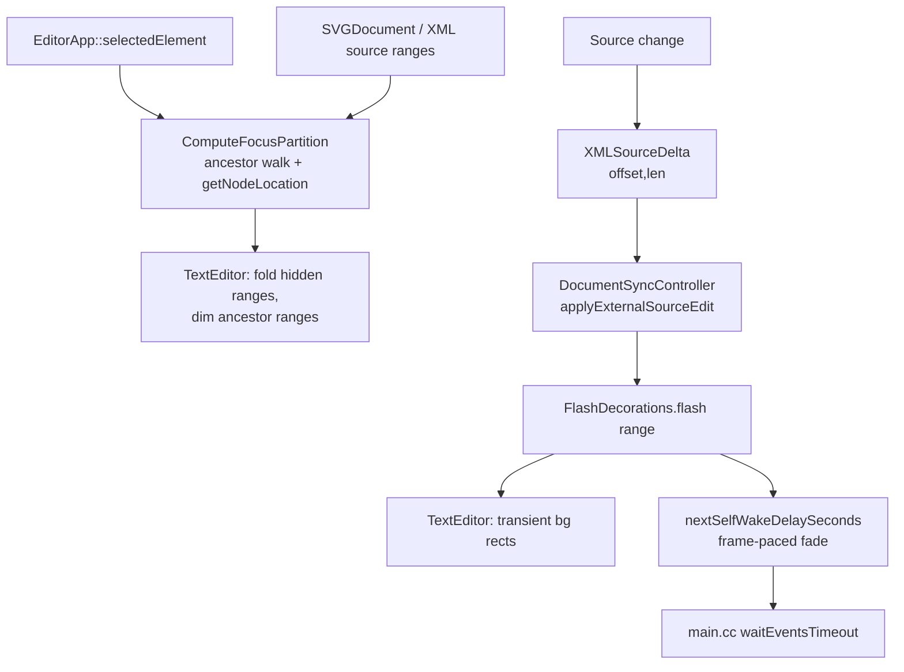

# Design: Text Editor Revamp — Relevant-Nodes Focus View + Changed-Character Flash

**Status:** Draft
**Author:** Claude Opus 4.7
**Created:** 2026-05-23

## Summary

Two source-pane view features for `//donner/editor`'s `TextEditor`, both built
on the XML-owned source store that
[`structured_text_editing.md`](structured_text_editing.md) already ships:

1. **Relevant-nodes focus view** — an opt-in mode that, given the current
   selection, hides the source of every element that is neither the selected
   element nor one of its ancestors. The selected element's source is shown in
   full color; ancestor opening/closing tags are dimmed (grayed) as structural
   context; everything else is folded away. This makes a deep SVG legible: you
   see the thing you're editing and the path to it, not 4,000 sibling lines.

2. **Changed-character flash** — when source bytes change (a canvas writeback,
   an autocomplete/paste, an incremental edit), the inserted span gets a
   transient background highlight that fades out over a few hundred milliseconds,
   so the user can see *what just changed* — especially edits the canvas made on
   their behalf during a drag.

Both are **view-layer decorations**. Neither changes the document, the XML
source store, parsing, or the DOM. Both consume data the editor already has:
the selection (`EditorApp::selectedElement()`), element↔source-range mapping
(`XMLNode::getNodeLocation()` / `XMLDocument::nodeAtSourceOffset`), and the
`XMLSourceDelta` stream `DocumentSyncController` already mirrors into the
`TextEditor`. The flash fade reuses the event-driven self-wake seam
(`EditorShell::nextSelfWakeDelaySeconds()`) so the animation runs without
busy-looping the on-demand render loop.

Scope boundary: this is polish on top of structured editing, gated behind a
runtime toggle, fully reversible. It is **not** a rewrite of the `TextEditor`
widget and adds no new source-of-truth.

## Goals

- **Focus view shows exactly the selected element + ancestor chain.** With an
  element selected and focus mode on, the source pane renders the selected
  element's full span normally, each ancestor's opening and closing tag dimmed,
  and folds every other line.
  *Verified by:* a pure-function unit test mapping `(SVGDocument, selected
  element) → {fullColorLineRanges, dimmedLineRanges, hiddenLineRanges}` over a
  nested fixture, asserting the exact line partition. Lives in a new
  `//donner/editor/tests:focus_view_tests`.

- **Focus view never desyncs source↔DOM offsets.** Folding/dimming is a render
  filter only; `TextEditor::getText()` and every source offset are byte-identical
  whether focus mode is on or off, and edits made while focused map to the same
  XML scopes as when unfocused.
  *Verified by:* a test that toggles focus mode around an edit and asserts
  `getText()` and the resulting `XMLSourceDelta`/`ReparseScope` are identical to
  the unfocused path.

- **Focus view follows selection changes** without overriding the user's text
  selection (the GUI→text-selection push in `EditorShell::highlightSelectionSourceIfNeeded`
  is being narrowed to canvas mouse-down under separate work). When selection
  clears, focus mode reveals the whole document.
  *Verified by:* a test driving selection changes through `EditorApp::setSelection`
  and asserting the focus partition updates, plus that focus recompute does not
  call `textEditor_.setSelection`.

- **Flash highlights the inserted span of any source change.** An `XMLSourceDelta`
  with `insertedLength > 0` produces a flash over `[offset, offset+insertedLength)`
  at full intensity, decaying to zero over the configured duration, then removed.
  *Verified by:* a `FlashDecorations` time-model unit test asserting intensity at
  `t=0`, `t=duration/2`, `t≥duration`, and that the decoration set is empty after
  expiry.

- **Flash animates without burning the event loop.** While any flash is active,
  the editor reports a frame-paced self-wake; once all flashes expire it reports
  none and the loop returns to blocking in `waitEvents()`.
  *Verified by:* a test asserting `nextSelfWakeDelaySeconds()` (or the
  `FlashDecorations` wake accessor it composes) returns a small positive value
  during a flash and `nullopt` after expiry — same self-wake contract the
  source-pane debounce uses (`EditorShell::nextSelfWakeDelaySeconds`,
  `donner/editor/main.cc`).

- **Both features degrade safely on adversarial source.** Out-of-range or
  multi-byte-straddling deltas/ranges are clamped, never indexing past the buffer;
  the number of simultaneous flashes is capped; focus over a huge document is
  line-range work, not per-character.
  *Verified by:* unit tests with deltas past EOF, zero-length and whole-buffer
  ranges, multi-byte UTF-8 boundaries, and a flash-count cap.

## Non-Goals

- **No new document state or source-of-truth.** Focus and flash are per-view
  ephemeral state. They do not persist, serialize, or affect Save.
- **No `TextEditor` widget rewrite.** We extend the existing folding, palette,
  and per-line decoration paths; we do not replace ImGuiColorTextEdit internals.
- **No semantic diffing.** The flash highlights the *byte* range a delta reports.
  It does not compute a semantic/word-level diff of what changed.
- **No multi-selection focus.** Initial scope focuses the primary selected
  element only; multi-select uses the first element (full behavior is Future Work).
- **No new selection-sync direction.** This doc consumes the existing selection;
  text-cursor→canvas selection is out of scope (tracked separately).
- **No persisted user theme work** beyond one dim color + one flash color added
  to the existing `Palette`.
- **No animation framework.** The flash uses a minimal time-decay model, not a
  general easing/tween system.

## Next Steps

1. Land `FlashDecorations` (the simplest, most self-contained piece): a per-view
   transient-highlight store fed by `XMLSourceDelta`, drawn as background rects,
   wired into `nextSelfWakeDelaySeconds()`.
2. Land the focus-partition pure function (`SVGDocument` + selection → line
   ranges) with exhaustive unit tests, before any rendering.
3. Wire the partition into `TextEditor` rendering (fold hidden ranges, dim
   ancestor ranges) behind a runtime toggle.

## Implementation Plan

- [ ] **M1: Changed-character flash**
  - [ ] Add `FlashDecorations` (per-view): `flash(SourceRange, now)`, `tick(now)`,
        `activeBackgrounds() → spans+intensity`, `nextWakeSeconds(now)`.
  - [ ] Feed it from `DocumentSyncController` where it already applies
        `XMLSourceDelta`s into the editor (`applyExternalSourceEdit` /
        `mirrorSourceDeltas`), flashing `[offset, offset+insertedLength)`.
  - [ ] Draw active flashes as background rects in `TextEditor`'s line-draw path
        (same layer as line-highlight/error markers), color from `Palette`.
  - [ ] Compose `FlashDecorations::nextWakeSeconds()` into
        `EditorShell::nextSelfWakeDelaySeconds()`.
  - [ ] Tests: time model, delta→flash enqueue, count cap, out-of-range clamp,
        wake integration.
- [ ] **M2: Focus partition (pure function)**
  - [ ] `ComputeFocusPartition(const SVGDocument&, const SVGElement& selected) →
        FocusPartition {fullColor, dimmed, hidden}` as resolved line ranges via
        `parentElement()` walk + `getNodeLocation()`.
  - [ ] Tests: nested fixtures, root selected, leaf selected, mixed-line
        elements, no-source-location fallback.
- [ ] **M3: Focus rendering + toggle**
  - [ ] `TextEditor::setFocusPartition(...)` / `clearFocusPartition()`: hide
        `hidden` line ranges (extend the fold path), apply a dim `ColorIndex`
        over `dimmed` ranges, leave `fullColor` normal.
  - [ ] Recompute the partition when selection changes (View-mode only); clear
        on no selection.
  - [ ] Menu item / shortcut to toggle focus mode (default off).
  - [ ] Tests: offset-stability across toggle, partition-follows-selection,
        focus recompute does not push text selection.
- [ ] **M4: Polish**
  - [ ] Per-keystroke-flash policy decision (see Open Questions) + setting.
  - [ ] Reduced-motion / disable-flash setting.
  - [ ] Dim color + flash color in both light/dark palettes.

## Background

### Current state

- The `TextEditor` (ImGui widget) wraps a headless `TextEditorCore`
  ([`text_editor_behavior.md`](text_editor_behavior.md),
  [`text_editor_refactor.md`](text_editor_refactor.md)). It already supports
  code folding (`foldBegin_`/`foldEnd_`, `setFoldEnabled`), a `Palette` of
  `ColorIndex` colors, per-line highlighting (`setHighlightedLines`), error
  markers, and XML-aware syntax colorization.
- The XML source store owns bytes and anchors; edits emit
  `XMLSourceDelta {offset, removedLength, insertedLength, sourceVersion}`
  (`donner/base/xml/XMLSourceStore.h`). `DocumentSyncController` already mirrors
  these deltas into the `TextEditor` via `applyExternalSourceEdit`
  ([`structured_text_editing.md`](structured_text_editing.md) M5.5).
- Element↔source mapping exists: `XMLNode::getNodeLocation()` →
  `FileOffsetRange`, `XMLDocument::nodeAtSourceOffset(offset)`, and
  `SourceSelection.cc`'s `HighlightElementSource`. `SVGElement::parentElement()`
  walks ancestors.
- The editor is **event-driven**: `main.cc` blocks in `waitEvents()` and
  produces no frames between inputs; time-based animation must self-schedule
  frames via `EditorShell::nextSelfWakeDelaySeconds()` →
  `EditorWindow::waitEventsTimeout()` (see
  [`0033-editor_design_tool_responsiveness.md`](0033-editor_design_tool_responsiveness.md)).

### Why now

Structured editing made the source pane a real editing surface, so its
*legibility* matters: deep documents are unreadable, and canvas-driven source
writebacks are invisible. These two features address both with view-only
decorations and no new invariants.

## Proposed Architecture

Two independent, view-only subsystems hang off data the editor already produces.



**Focus view** is stateless-per-frame: a pure function maps the DOM + selection
to a line partition; `TextEditor` renders that partition. It recomputes only on
selection change (View-mode on), so it's cheap. Hiding reuses the existing fold
machinery; dimming is a color override pass on the ancestor ranges.

**Flash decorations** is a tiny per-view animation store. Each flash is a
`{SourceRange, startTime}` with a fixed duration; intensity is
`1 - clamp((now-start)/duration, 0, 1)`. It is fed by the same delta stream that
already updates the editor view, drawn as background rects, and — because the
editor is event-driven — exposes a `nextWakeSeconds()` that
`EditorShell::nextSelfWakeDelaySeconds()` folds in so the fade actually advances.

Both fit the existing draw order: background fills (line highlight, error marker,
**flash**) → colorized glyphs (with **dim** override on ancestor ranges) →
folded-line elision (**focus hidden** ranges).

## API / Interfaces

```cpp
// donner/editor/FocusView.h  (pure, no ImGui)
struct FocusPartition {
  std::vector<LineRange> fullColor;  // selected element's span
  std::vector<LineRange> dimmed;     // ancestor opening/closing tags
  std::vector<LineRange> hidden;     // everything else
};
// Walks selected.parentElement()* and resolves getNodeLocation() ranges to
// lines. Returns an empty partition (== "show everything") when no source
// location is available.
FocusPartition ComputeFocusPartition(const svg::SVGDocument& document,
                                     const svg::SVGElement& selected);

// donner/editor/FlashDecorations.h  (per-view)
class FlashDecorations {
public:
  void flash(SourceRange byteRange, std::chrono::steady_clock::time_point now);
  void tick(std::chrono::steady_clock::time_point now);   // drops expired
  // Visible background spans + intensity in [0,1] for the current frame.
  std::vector<ActiveFlash> activeBackgrounds() const;
  // Seconds until the next frame is worth drawing, or nullopt if idle.
  std::optional<float> nextWakeSeconds(std::chrono::steady_clock::time_point now) const;
private:
  static constexpr std::size_t kMaxFlashes = 64;        // resource cap
  static constexpr float kDurationSeconds = 0.4f;       // tunable
};

// donner/editor/TextEditor.h  (new view hooks)
void setFocusPartition(const FocusPartition& partition);
void clearFocusPartition();
void flashSourceRange(SourceRange byteRange);  // delegates to FlashDecorations
```

`EditorShell::nextSelfWakeDelaySeconds()` gains one clause:
`min(existing, flashDecorations_.nextWakeSeconds(now))`.

## Data and State

- All new state is per-`TextEditor`/per-`EditorShell`, UI-thread only, never
  serialized. No cross-thread access (the async renderer is untouched).
- Flash ranges are byte offsets into the live buffer. Because a flash may
  outlive subsequent edits, flashes are adjusted by later `XMLSourceDelta`s with
  the same shift logic the editor view already uses (or simply dropped if an
  edit overlaps them). Anchoring to source-store anchors is an option but
  overkill for a 400 ms decoration — see Alternatives.
- Focus partition is recomputed from scratch on selection change; no incremental
  maintenance across edits (selection rarely changes per frame).

## Performance

- Focus: one `parentElement()` walk (depth-bounded) + N range resolutions on
  selection change; rendering hides whole line ranges (existing fold cost). No
  per-keystroke work.
- Flash: O(active flashes ≤ 64) per frame; fade frames only occur while a flash
  is live (self-wake), then the loop idles. No steady-state cost.
- Neither feature touches the async render worker or the frame budget for canvas
  rendering.

## Security / Privacy

Source text is untrusted SVG (Donner's "never crash on adversarial input"
invariant). Both features do pure offset arithmetic over that text:

- **Trust boundary:** `XMLSourceDelta` offsets/lengths and resolved
  `SourceRange`s are treated as untrusted. Every range is clamped to
  `[0, buffer.size()]` and snapped to UTF-8 boundaries before indexing; an
  out-of-range or stale-version delta is dropped, never dereferenced. This
  mirrors the `GetAttributeLocation` hardening in
  [`structured_text_editing.md`](structured_text_editing.md) M−1.
- **Resource caps:** simultaneous flashes are capped (`kMaxFlashes`); excess
  coalesce/evict oldest, so a rapid edit storm can't grow unbounded view state.
  Focus partition is line-range data (bounded by line count), not per-character.
- **No new parsing/protocol surface**, so no fuzzer is strictly required; the
  clamp/boundary paths are covered by the negative unit tests in Goals. If the
  flash offset-adjustment logic grows complex, add it to the existing source-edit
  fuzzer corpus.
- **No sensitive data**: decorations derive only from the document already shown.

## Testing and Validation

- **Unit (pure):** `ComputeFocusPartition` line partition over nested fixtures;
  `FlashDecorations` time model + cap + clamp. These are the red→green core and
  run without ImGui.
- **Integration:** offset-stability across focus toggle; partition follows
  `setSelection`; focus recompute does not push text selection; delta→flash
  enqueue through `DocumentSyncController`.
- **Wake integration:** `nextSelfWakeDelaySeconds()` returns a positive value
  during a flash and `nullopt` after expiry (same harness style as
  `TextPaneTypingRender_tests`).
- **Adversarial:** deltas past EOF, whole-buffer/zero-length ranges, multi-byte
  boundaries, flash-count overflow.
- **Optional golden:** one pixel test that an inserted span renders the flash
  background color at `t=0` and clean after expiry — only if the time-model unit
  test proves insufficient (avoid pixel flakiness for an animation).

Build/run: `bazel test //donner/editor/tests:focus_view_tests
//donner/editor/tests:flash_decorations_tests` (and the full `//...` gate).

## Alternatives Considered

- **Anchor-backed flashes** (register each flash as a source anchor so it moves
  with edits): correct but heavyweight for a 400 ms decoration; chosen approach
  shifts/drops flashes on overlapping deltas instead. Revisit if flashes are made
  long-lived.
- **Dim descendants of the selected element too** (only the selected element's
  *own* tag full-color, its children dimmed): arguably cleaner "focus," but the
  user asked for the selected element "in full color," which most naturally
  includes its subtree. Captured as an Open Question / setting.
- **Per-character semantic diff for flash** (highlight only the changed glyphs
  within a replaced token): nicer but needs a diff; the byte-range from
  `XMLSourceDelta` is already exact and free.
- **Hiding via a filtered virtual buffer** instead of folding: would duplicate
  the buffer and risk offset desync; folding keeps one buffer and one offset
  space (a hard requirement).

## Open Questions

- **Flash on every keystroke?** Flashing each typed character is likely
  distracting. Proposal: flash external/structured changes (canvas writeback,
  paste, autocomplete, multi-char) by default; gate per-keystroke flashing behind
  a setting (default off). Needs a UX call.
- **Focus: dim or also hide ancestor *bodies*?** Show only ancestor open/close
  tags (proposed) vs. also showing ancestor attributes inline. Proposed: open tag
  (with attributes) + close tag, dimmed.
- **Focus + active editing in a hidden region** (e.g. an edit lands outside the
  focused set via canvas writeback): auto-reveal the changed range, or leave it
  folded and rely on the flash? Proposed: briefly reveal + flash.
- **Toggle scope:** is focus mode global, or remembered per document? Proposed:
  global editor setting.

## Future Work

- [ ] Multi-selection focus (union of selected elements + their ancestor chains).
- [ ] Breadcrumb header showing the dimmed ancestor chain as clickable crumbs.
- [ ] Smooth fold/unfold transition when focus follows selection.
- [ ] Configurable flash color per change-origin (canvas vs. text vs. paste).
