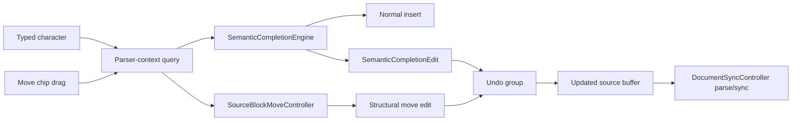

# Design: Semantic Text Editing

**Status:** Implementing
**Author:** GPT-5
**Created:** 2026-05-25

## Summary

Donner's text editor should graduate from token autocomplete to semantic text editing:
parser-backed edits that keep XML, SVG, and embedded CSS syntactically stable while the user types,
plus source-pane affordances that manipulate whole SVG elements instead of raw character spans. The
core idea is that Donner's deeply integrated parser gives the text editor superpowers. The editor
already knows the SVG document, source locations, attributes, style rules, parser diagnostics, and
DOM order; semantic editing can use that context to insert missing structure or move structural
blocks in ways an ordinary string editor cannot.

Examples:

- Typing `"` after an attribute name inserts the matching closing quote and leaves the cursor inside
  the value.
- Typing `<g` expands to `<g></g>` and keeps the cursor after the `g`, so typing attributes remains
  natural.
- Typing `{` or `"` inside a `<style>` block or `style=""` attribute inserts the matching CSS
  delimiter without changing the user's intended cursor position.
- Selecting an element's source shows a small move chip anchored just above the top-left of the
  source selection; dragging that chip moves the entire XML block in the document tree.

The result is a source pane that treats malformed intermediate states as avoidable editor friction,
not as inevitable parser fallout, and treats source ranges as live document structure rather than
anonymous text.

## Goals

- Preserve typing flow: semantic completion must keep the cursor where the user expects and avoid
  surprising jumps, scroll changes, or selection changes.
- Prefer syntactically valid intermediate source when a local completion can make that true.
- Use parser context to choose completions: XML element names, attribute names, quoted values,
  CSS strings, CSS blocks, `url(...)`, and comments should not share one blind bracket matcher.
- Keep completions reversible with normal undo and compatible with focus mode, source selection,
  canvas writebacks, and diagnostics.
- Let users reorder elements from source without manually cutting/pasting XML ranges.
- Follow the existing in-UI chip pattern: small anchored affordance, hover/drag preview, no layout
  surprise, and an action that operates on the selected structural object.
- Enforce key guarantees in `//donner/editor/tests:text_editor_tests` and parser-integration
  coverage in `//donner/editor/tests:document_sync_controller_tests`.

## Non-Goals

- This is not a full language server, schema validator, or pretty-printer.
- This does not reformat source or canonicalize attributes.
- This does not invent missing semantic values, such as choosing a path `d` or style declaration for
  the user.
- This does not replace existing autocomplete suggestions; it complements them with small structural
  edits.
- Source dragging starts with moving one selected element among legal sibling positions; arbitrary
  text drag/drop and cross-document moves are out of scope.

## Next Steps

- Add a `SemanticCompletionEngine` design spike behind a `TextEditor` option, initially disabled.
- Implement XML quote-pair and element-pair completions with targeted unit tests.
- Prototype the selected-element move chip and source-range drop targets after completion behavior is
  stable.

## Implementation Plan

- [ ] Milestone 1: Completion decision model.
  - [ ] Add a parser-context query that classifies the cursor as XML tag name, attribute name,
        attribute value, text content, CSS declaration, CSS selector, CSS string, or comment.
  - [ ] Define a `SemanticCompletionEdit` with inserted text, cursor delta, selection preservation,
        and undo grouping metadata.
- [ ] Milestone 2: XML semantic completions.
  - [ ] Insert closing quotes for XML attributes only when the parser context says the cursor is
        starting an attribute value.
  - [ ] Expand start tags such as `<g` to paired elements without moving the cursor away from the
        in-progress start tag.
  - [ ] Skip completions inside comments, processing instructions, existing quoted strings, and
        malformed contexts where the local intent is ambiguous.
- [ ] Milestone 3: CSS semantic completions.
  - [ ] Pair CSS strings, braces, parentheses, and comments in `<style>` and inline `style=""`.
  - [ ] Use CSS tokenizer state to avoid pairing delimiters inside existing CSS strings/comments.
- [x] Milestone 4: Source block movement.
  - [x] Render a compact gutter handle beside source-backed element lines.
  - [x] Drag the handle over legal source drop targets and preview the insertion point without
        changing text selection mid-drag. Focus mode temporarily reveals the complete source while
        the gesture is active.
  - [x] Apply the move as a revision-bound DOM/source operation that preserves the moved element
        selection and mirrors the new source order in place.
- [ ] Milestone 5: Editor integration and verification.
  - [ ] Route completions through the same undo path as normal typing.
  - [ ] Add regression tests for focus-mode scrolling, selection preservation, and parseable
        intermediate source after each completion or source block move.

## Proposed Architecture

Semantic completion sits between raw text input and `TextEditorCore::insertText`. It receives the
current source, cursor byte offset, pending character, and current focus/selection state. It returns
either "insert the character normally" or a small replacement edit.

The context query should reuse the existing XML source locations and lightweight tokenization rather
than reparsing the whole document on every keypress. When the current buffer is temporarily invalid,
the engine uses the last good parse plus local token scanning around the cursor. If those disagree,
it declines to complete rather than guessing.

Cursor preservation is part of the edit contract. For `<g`, the applied text may be `"></g>` or
`></g>` depending on the typed sequence, but the cursor remains in the start tag so attributes can be
typed fluidly. For `style="`, the inserted closing quote is marked as completion-owned so typing the
matching `"` can step over it instead of creating a duplicate.

Source block movement uses the same semantic contract for selection. When the active source
selection maps to a single XML node, the editor renders a compact chip at the top-left of the
selection using the same visual language as render-pane chips. The chip contains a move icon and
acts as the drag handle for the whole node. During drag, the text editor shows valid drop positions
between sibling nodes and rejects drops that would move a node into itself, into a descendant, or
across non-representable source ranges. On drop, the editor moves the entire serialized block,
preserves the selected element, and scrolls the moved block into view.

## Security / Privacy

Inputs are the already-open source buffer, typed characters, and local source drag gestures. No
external data is fetched and no completion or drag content is logged. The relevant safety concern is
denial-of-service from running parser logic on every keypress or drag frame; completion queries and
drop-target discovery must be bounded to local token windows or cached source maps unless a cached
parse result is already available.

## Testing and Validation

- `//donner/editor/tests:text_editor_tests`: quote pairing, tag pairing, CSS delimiter pairing,
  cursor placement, undo behavior, and "type matching delimiter to step over" behavior.
- `//donner/editor/tests:document_sync_controller_tests`: source edits remain compatible with focus
  mode, selection preservation, temporary invalid states, parser resync, and structural source
  moves.
- UI/replay coverage: moving an element through the source chip changes document order, keeps the
  moved element selected, and leaves both canvas and source pane synchronized.
- Parser fuzzers remain the backstop for XML/CSS tokenizer robustness; semantic completion should
  add malformed-context tests that assert "decline to complete" rather than crash or rewrite broadly.

## Open Questions

- Should semantic completion be always on, or gated by an editor preference until it has enough
  coverage?
- How should completion-owned delimiters be represented so they survive small edits but disappear
  from state once the user moves away?
- Should paired element completion cover all SVG tags immediately, or start with container elements
  such as `<g>`, `<defs>`, `<clipPath>`, `<mask>`, `<pattern>`, and gradients?
- Should the source move chip appear only for the active canvas selection, or also for a manually
  highlighted XML node that is not yet selected on the canvas?
