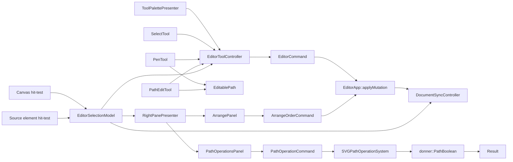

# Design: Path Authoring and Boolean Operations

**Status:** Prototype
**Author:** Codex GPT-5
**Created:** 2026-05-25

## Summary

Donner's editor should support designer-grade path authoring: a centered top toolbar with Select,
Pen, and Path Edit tools; an Illustrator-like Pen flow for drawing paths; and a Path Edit tool for
editing anchors, handles, and open-path continuation. The same workstream should add unified
multi-selection across the canvas and source pane, plus right-side pane controls for boolean shape
operations such as Union, Intersect, Subtract Front, Subtract Back, and Exclude, and arrange controls
such as Bring Forward and Send to Back.

The editor UX should feel familiar to users of vector design tools without forcing Donner's core
geometry model into editor-only code. Path editing lives in `//donner/editor`; path boolean math
lives at the Donner geometry/SVG layer so rendering, scripting, tests, and future command surfaces
can use the same operation engine.

## Goals

- Add a centered horizontal tool palette at the top of the render pane with three icon buttons:
  Select, Pen, and Path Edit.
- Let the Pen tool create new `<path>` elements with straight and cubic segments.
- Let the Pen tool append to a selected pre-existing unclosed path.
- Let users close a path by clicking near its start point.
- Keep Pen tool interaction responsive and low latency. Drafting, handle drags, and pointer previews
  must not require whole-document reparses on each frame; the UI should update immediately from local
  editor state and commit through structured DOM/source deltas.
- Let Path Edit mode select, move, delete, and modify anchors and cubic control handles on existing
  paths.
- Visualize anchors, control points, and handle lines while editing. In Path Edit mode, anchors are
  small solid rectangles in document space.
- Support three handle coupling modes: Symmetric, Aligned, and Independent.
- Support key modifiers for standard path-tool behavior without creating a modal maze.
- Add unified multi-select support for canvas and source-pane element selection.
- Add a right-side pane Path Operations section over selected path-convertible SVG elements, rendered
  as icon-only operation buttons with tooltips.
- Add a right-side pane Arrange section for moving selected elements forward/backward in paint order,
  also rendered as icon-only operation buttons with tooltips.
- Add keyboard shortcuts for tool switching, path operations, and arrange operations.
- Introduce a Donner-level boolean path operation API with deterministic results and editor-facing
  source writeback.
- Pin interaction guarantees in editor tests and geometry guarantees in base/SVG tests.

## Non-Goals

- This does not replace the existing Select tool's drag/resize/rotate behavior.
- This does not implement freehand pencil drawing, brush strokes, calligraphy, or pressure input.
- This does not implement smart snapping, grids, guides, or magnetic alignment.
- This does not add text-to-path, image tracing, or outline-font conversion.
- This does not initially preserve editable cubic curves through boolean operations. The boolean MVP
  may output flattened line segments; curve reconstruction is future work.
- This does not implement non-destructive live Pathfinder stacks. Boolean operations are destructive
  document edits with undo support in the first version.
- This does not make boolean operations available for arbitrary SVG nodes such as `<text>`,
  `<image>`, or unresolved `<use>` references in the first version.
- This does not add a top-level Path menu in the first version; path operations live in the
  right-side pane with keyboard shortcuts.

## Next Steps

- Replace the prototype bounds-based Union / Intersect path operations with a Donner-level boolean
  path backend.
- Design and test the editable path model that maps SVG `d` commands to anchors and handles.
- Add arrange controls next to the Path Operations panel.

## Implementation Plan

- [ ] Milestone 1: Tool palette and tool dispatch.
  - [ ] Add `EditorToolId` with `Select`, `Pen`, and `PathEdit`.
  - [ ] Add a centered render-pane toolbar presenter with icon buttons and selected/hover states.
  - [ ] Route render-pane pointer events through the active tool while preserving `SelectTool`.
  - [ ] Define unified multi-selection semantics for canvas clicks, marquee selection, and source
        pane element clicks.
  - [ ] Draw source-pane multi-selection as semantic element decorations instead of native text
        selection ranges.
  - [ ] Add tests for tool switching, keyboard shortcuts, and source-pane focus interactions.
- [ ] Milestone 2: Editable path model.
  - [ ] Add `EditablePath`/`EditableAnchor` types that round-trip SVG path data.
  - [ ] Convert `M/L/C/Q/Z` commands into anchors, incoming handles, outgoing handles, and close
        state.
  - [ ] Preserve unsupported commands by normalizing them through existing path parsing and
        serialization rules.
  - [ ] Add unit tests for parse, edit, serialize, and undo snapshots.
- [ ] Milestone 3: Pen tool.
  - [ ] Create a new `<path>` on first click using the active style defaults.
  - [ ] Append line anchors on click and cubic anchors on click-drag.
  - [ ] Close the active path when clicking within a screen-stable tolerance of the start anchor.
  - [ ] Append to a selected open path by clicking either endpoint.
  - [ ] Add modifier behavior for constrained angles, handle breaking, and temporary Path Edit.
- [ ] Milestone 4: Path Edit tool.
  - [ ] Hit-test anchors, control handles, handle lines, and segments in screen-pixel-stable
        tolerances.
  - [ ] Draw solid rectangle anchors, circular control handles, and thin handle lines in overlay
        chrome.
  - [ ] Support moving anchors, moving handles, deleting anchors, and clearing handles by clicking
        the active last point.
  - [ ] Add contextual handle mode controls for Symmetric, Aligned, and Independent.
- [ ] Milestone 5: Right-side path operations, arrange controls, and command plumbing.
  - [x] Add right-side pane Path Operations actions and enabled-state checks for selected
        path-convertible elements.
  - [ ] Add right-side pane Arrange actions for Bring Forward, Send Backward, Bring to Front, and
        Send to Back.
  - [ ] Add keyboard shortcuts for tool selection, path operations, and arrange commands.
  - [x] Add initial editor command plumbing for destructive path operations with source writeback.
  - [ ] Add undo snapshots for destructive path operations.
  - [ ] Add editor commands for paint-order moves with undo and source writeback.
  - [ ] Preserve selection on the result path and scroll its source range into view.
- [ ] Milestone 6: Donner-level boolean path operations.
  - [ ] Add a path boolean API over `donner::Path`, transforms, fill rules, and tolerance options.
  - [ ] Implement or wrap a robust polygon clipping backend behind the API.
  - [ ] Add SVG conversion helpers that turn selected geometry elements into document-space paths.
  - [ ] Add base/SVG/editor tests and visual regressions for each operation.

## User Stories

- As a designer, I can select the Pen tool, click to place points, drag to create smooth curves, and
  close a shape by clicking back on the start point.
- As a designer, I can select an open path, choose Pen, click one endpoint, and continue drawing from
  that path instead of creating a new one.
- As a designer, I can choose Path Edit, see the anchors as solid rectangles, drag handles to refine
  curves, and change a selected point from symmetric handles to aligned or independent handles.
- As a designer, I can Shift-click shapes on canvas or source ranges in the text view to build the
  multi-selection needed for path operations.
- As a designer, I can select overlapping shapes and click Union, Intersect, Subtract Front, or
  Exclude in the right pane to create a new editable SVG path.
- As a designer, I can select one or more elements and bring them forward, send them backward, or
  move them to the front/back of their local paint-order scope.

## Requirements and Constraints

- Tool hit-testing is screen-pixel-stable. Anchor and handle hit boxes stay usable at every zoom and
  device pixel ratio by using `MouseModifiers::pixelsPerDocUnit` / `ViewportState`.
- Path edits are document mutations. They must flow through `EditorApp::applyMutation()` and
  `UndoTimeline`, not direct DOM writes from a tool.
- Pen drafting is latency-sensitive. Pointer-move feedback should render from an editor-owned
  preview/elevated path model; the live DOM and source pane are updated at semantic commit points
  using `InsertElementCommand` / `SetAttributeCommand` source deltas, not by `ReplaceDocument` or
  repeated full-document reparses.
- Canvas edits update the source pane through the existing source writeback path where a source range
  exists. If a path cannot be patched locally, the document sync layer may replace the whole element
  source range.
- Canvas and source-pane element selection share one ordered selection model. There must not be
  separate canvas-only and source-only selection sets.
- Path authoring should not require a full async raster before chrome updates. Overlay chrome uses
  the same snapshot/chrome priority lane described in `0033-editor_design_tool_responsiveness.md`.
- Boolean operations must be deterministic for the same input paths, transforms, fill rules, and
  tolerance options. `//donner/base:path_boolean_tests` should fail if operation output changes
  unexpectedly.
- Boolean operations must be bounded. Segment counts, recursion depth, and result complexity must
  have explicit caps tested by `//donner/base:path_boolean_tests` and negative editor tests.

## Proposed Architecture



## Prototype Status

The first in-editor path operation slice is intentionally conservative:

- The right-side Inspector pane now renders an icon-only Path Operations row for Union, Intersect,
  Subtract Front, Subtract Back, and Exclude.
- Union and Intersect are enabled for multi-selections made entirely of bounded SVG geometry.
- The initial operation result is a replacement `<path>` generated from document-space AABBs:
  Union emits the selected bounds' enclosing rectangle; Intersect emits the overlapping rectangle.
- Subtract Front, Subtract Back, and Exclude are present but disabled until the Donner-level boolean
  path backend exists.
- The operation queues `InsertElementCommand` for the result path followed by `DeleteElementCommand`
  for the original selection, so DOM mutation and source mirroring stay on the existing editor
  command path.

This deliberately trades geometric completeness for a working UI and source-sync path. The
production boolean backend should replace only the result-geometry computation, not the editor
selection, command, or panel plumbing.

### Multi-Selection Model

Path operations need a first-class selection set, not a single active element with ad hoc extras.
`EditorApp` should remain the owner of selection state, but the contract should be explicit:

- The selection is an ordered list of SVG elements with no duplicates.
- The first selected element remains the primary element for existing single-selection callers and
  style-source fallback.
- Plain canvas click replaces the selection with the hit element.
- Shift-click on an unselected canvas element adds it to the current selection.
- Shift-click on an already selected canvas element removes it, unless it is the only selected
  element; the last element stays selected to avoid accidental empty selections.
- Plain click on empty canvas clears the selection.
- Shift-click on empty canvas keeps the existing selection unchanged.
- Plain marquee replaces the selection with the marquee hits.
- Shift-marquee adds marquee hits to the existing selection, preserving existing order and appending
  new elements in document order.

Dragging a selected element moves the whole selection. Transform handles operate on the combined
selection bounds when multiple selected elements are transformable. Operations that require a single
element, such as direct XML attribute inspection, should disable themselves or show a compact
multi-selection summary rather than guessing.

Source-pane selection uses the same selection model. This should be semantic element selection, not
multiple native text selections:

- Plain click on an element source range selects that element and leaves the caret at the clicked
  text position.
- Shift-click on an element source range adds/removes that element using the same toggle rules as
  canvas Shift-click.
- Shift-drag still performs normal text range selection; the semantic toggle happens only for
  click-like source gestures.
- Selected source ranges render as decorations behind the text. The primary selected element uses
  the brightest selected style, and additional selected elements use the same selected style with a
  less prominent primary marker.
- Source focus mode treats all selected elements as brightest, referenced elements as medium
  brightness, and unrelated source as the existing gray out-of-focus text.
- Typing inside any selected element's source range should preserve the current selection unless the
  edit deletes that element or moves the caret outside all selected/focused ranges.

This keeps text editing fluid: users can build a geometry selection from source without turning the
text editor into a discontiguous text-selection widget.

### Tool Palette

The toolbar is a small horizontal button bar centered at the top of the render pane, slightly below
the main menu bar and above document content. It is part of the editor chrome, not document content.
It should use the same UI font and icon scale as the rest of the editor.

The initial buttons are:

| Tool      | Icon intent                         | Behavior                                    |
| --------- | ----------------------------------- | ------------------------------------------- |
| Select    | Current arrow/select icon           | Existing select, drag, resize, rotate tool  |
| Pen       | Pen nib                             | Create new paths and append to open paths   |
| Path Edit | Open triangle/direct-selection icon | Edit anchors, handles, segments, open paths |

The toolbar owns only active-tool state and presentation. Pointer behavior stays in tool classes.
This keeps `EditorShell` from becoming a large gesture switch statement.

### Editable Path Model

`EditablePath` is the editor's manipulation model for one SVG path. It is not a replacement for
`donner::Path`; it is a source-preserving editing view that can serialize back to `d`.

```cpp
enum class HandleMode {
  Symmetric,
  Aligned,
  Independent,
};

struct EditableAnchor {
  Vector2d point;
  std::optional<Vector2d> inHandle;
  std::optional<Vector2d> outHandle;
  HandleMode handleMode = HandleMode::Independent;
};

struct EditablePath {
  std::vector<EditableAnchor> anchors;
  bool closed = false;
};
```

The model should treat a cubic segment as:

- previous anchor `outHandle`
- current anchor `inHandle`
- current anchor `point`

Straight segments have no handles on the endpoint pair. Quadratic segments can be represented as
derived cubic handles when first edited; serialization may normalize edited quadratic segments to
cubic commands. The editor should preserve unedited path data where possible, but editing a segment
is allowed to normalize that local segment.

### Pen Tool Behavior

The Pen tool has one active drafting path. A click without drag adds a corner anchor. A click-drag
adds a smooth anchor with a visible outgoing handle; the incoming handle for the next segment is
determined by the selected handle mode.

Core behaviors:

- Click empty document: create a new `<path>` and place the first anchor.
- Click while drafting: add the next anchor and segment.
- Click-drag while drafting: add a cubic anchor and set its outgoing control handle.
- Click near the first anchor: close the path by adding `Z`.
- Press Escape/Enter: finish the active path without closing it.
- Press Backspace/Delete while drafting: remove the last anchor.
- Click an endpoint of a selected unclosed path: enter append mode from that endpoint.
- Click the last anchor of the active path: clear that anchor's control handles and convert it to a
  corner point.

Append mode should support both open endpoints. If the user starts from the first point, the editor
prepends anchors and reverses segment orientation only as needed to keep serialization simple. The
selected path remains selected during append mode, and the active endpoint is highlighted.

### Path Edit Behavior

Path Edit mode exposes the editable skeleton for selected paths:

- Anchors render as small solid rectangles.
- Control points render as small circles or diamonds.
- Handle lines render as thin lines from anchor to control point.
- Selected anchors/handles use the active selection color; unselected editable points use the
  secondary chrome color.
- Hovered points expand hit tolerance but do not resize the visual rect.

Actions:

- Click anchor: select that anchor.
- Shift-click anchor: add/remove anchor from the anchor selection.
- Drag anchor: move selected anchors.
- Drag control point: update that handle according to the anchor's handle mode.
- Click segment: insert a new anchor at the nearest curve parameter.
- Delete: delete selected anchors and reconnect adjacent segments when possible.
- Click the last anchor of an open path: clear both handles on that anchor.

Handle modes:

- **Symmetric:** opposite handles stay collinear and equal length.
- **Aligned:** opposite handles stay collinear but can have different lengths.
- **Independent:** handles move independently.

The UI exposes these modes through a compact contextual segmented control near the selected anchor
or in the toolbar when one or more anchors are selected. Modifier keys can temporarily override the
mode during a drag, but the persistent mode is explicit and visible.

### Modifier Keys

Modifier behavior should match common vector design tools while staying learnable:

| Input            | Pen tool behavior                                      | Path Edit behavior                                     |
| ---------------- | ------------------------------------------------------ | ------------------------------------------------------ |
| Shift            | Constrain segment/handle angle to 45-degree increments | Constrain anchor/handle drag angle                     |
| Option/Alt       | Temporarily break handle coupling                      | Temporarily use Independent handles                    |
| Cmd/Ctrl         | Temporarily switch to Path Edit                        | Temporarily switch to Select for whole-object movement |
| Space            | Temporarily pan using the existing hand cursor mode    | Temporarily pan                                        |
| Escape           | Finish current path without closing                    | Clear anchor/handle selection                          |
| Backspace/Delete | Remove last drafted point                              | Delete selected anchors                                |
| Enter/Return     | Finish current path                                    | Commit current edit and keep path selected             |

The exact Cmd/Ctrl mapping can be platform-adjusted, but the behavior should be expressed in tests
as semantic modifiers rather than raw key codes.

### Keyboard Shortcuts

Tool shortcuts should be active when the render pane or right-side pane has focus. Source-pane text
editing wins while the source pane has keyboard focus, so typing `p` in source never switches tools.

| Shortcut | Command   |
| -------- | --------- |
| `V`      | Select    |
| `P`      | Pen       |
| `A`      | Path Edit |

Path operation shortcuts use `Cmd+Option` on macOS and `Ctrl+Alt` on Windows/Linux:

| Shortcut             | Command         |
| -------------------- | --------------- |
| `Cmd+Option+U`       | Union           |
| `Cmd+Option+I`       | Intersect       |
| `Cmd+Option+-`       | Subtract Front  |
| `Cmd+Option+Shift+-` | Subtract Back   |
| `Cmd+Option+X`       | Exclude Overlap |
| `Cmd+Option+D`       | Divide          |
| `Cmd+Option+O`       | Outline Stroke  |

Arrange shortcuts should match common vector/design tools:

| Shortcut      | Command        |
| ------------- | -------------- |
| `Cmd+]`       | Bring Forward  |
| `Cmd+[`       | Send Backward  |
| `Cmd+Shift+]` | Bring to Front |
| `Cmd+Shift+[` | Send to Back   |

## Right-Side Path Operations and Arrange Pane

Path and arrange commands live in the right-hand inspector pane. The pane may use text section
headings, but each command control is an icon-only button: no visible text inside the button. Buttons
should be square, visually align with other inspector controls, expose accessible names, and show
tooltips with the command name, keyboard shortcut, and disabled reason when unavailable.

The initial Path Operations section is a compact icon-button list:

| Operation      | Icon intent                    | Operation enum  | Selection requirement                         |
| -------------- | ------------------------------ | --------------- | --------------------------------------------- |
| Union          | Merged overlapping shapes      | `Union`         | Two or more closed path-convertible elements  |
| Intersect      | Overlap lens                   | `Intersect`     | Two or more closed path-convertible elements  |
| Subtract Front | Back shape with front cut away | `SubtractFront` | Two or more closed path-convertible elements  |
| Subtract Back  | Front shape with back cut away | `SubtractBack`  | Two or more closed path-convertible elements  |
| Exclude        | Alternating overlap            | `Xor`           | Two or more closed path-convertible elements  |
| Divide         | Split regions                  | `Divide`        | Two or more closed path-convertible elements  |
| Outline Stroke | Stroke converted to fill       | `OutlineStroke` | One or more stroked path-convertible elements |

`Outline Stroke` can land after the main boolean set because `Path::strokeToFill` already exists
but style/writeback semantics need care. `Divide` can also be delayed if the boolean backend returns
multiple output contours later than single-path operations.

Operation semantics:

- **Union:** result fill is the union of all selected fill regions.
- **Intersect:** result fill is the area common to every selected fill region.
- **Subtract Front:** base is the backmost selected element in SVG paint order; subtract the union of
  every selected element painted above it.
- **Subtract Back:** base is the frontmost selected element; subtract the union of every selected
  element painted below it.
- **Exclude Overlap:** result fill toggles each selected fill region; areas covered by an odd number
  of inputs remain.
- **Divide:** split the selected shapes at all intersections and emit separate path pieces.

The result element should be inserted at the paint-order position of the operation's base element.
For Union, Intersect, and Exclude, the active selection's primary element is the style source; if the
selection has no primary, use the frontmost selected element. For Subtract Front/Back, the base
element provides paint style and insertion position. The original selected elements are removed by
the command, not hidden.

The Arrange section sits near Path Operations because both affect selected geometry. It is also a
compact icon-button list with tooltips, not text buttons:

| Operation      | Icon intent                | Command enum   | Behavior                           |
| -------------- | -------------------------- | -------------- | ---------------------------------- |
| Bring Forward  | Layer moving up one slot   | `BringForward` | Move selection one paint step up   |
| Send Backward  | Layer moving down one slot | `SendBackward` | Move selection one paint step down |
| Bring to Front | Layer at top               | `BringToFront` | Move selection to front            |
| Send to Back   | Layer at bottom            | `SendToBack`   | Move selection to back             |

SVG paint order is document order within the same parent: later siblings paint above earlier
siblings. The MVP should enable arrange commands only when every selected movable element shares the
same parent and is not inside a resource-only container such as `<defs>`, `<clipPath>`, `<mask>`,
`<marker>`, or gradient content. Multi-selection moves as one stable block and preserves relative
order. Bring Forward/Send Backward skip selected neighbors, so repeated shortcut presses move the
selected block one unselected sibling at a time.

Proposed arrange command surface:

```cpp
enum class ArrangeOrderOp {
  BringForward,
  SendBackward,
  BringToFront,
  SendToBack,
};
```

`ArrangeOrderCommand` stores stable DOM/source locators, the original sibling order, and the target
sibling order. Undo restores the original order. Source writeback should move whole XML node ranges
when source locations are available; if the document sync layer cannot patch the affected ranges, the
command should either fall back to whole-document serialization or refuse with a status message. It
must not silently desynchronize canvas order from source order.

## Donner-Level Boolean Path Operations

Boolean operations should be available below the editor so they can be tested independently and used
later by scripting or command-line tools.

Proposed base API:

```cpp
namespace donner {

enum class PathBooleanOp {
  Union,
  Intersect,
  Difference,
  Xor,
  Divide,
};

struct PathBooleanInput {
  Path path;
  FillRule fillRule = FillRule::NonZero;
  Transform2d outputFromPath = Transform2d();
};

struct PathBooleanOptions {
  double flattenTolerance = 0.01;
  std::size_t maxInputSegments = 100000;
  std::size_t maxOutputSegments = 200000;
};

struct PathBooleanResult {
  std::vector<Path> paths;
  std::vector<ParseDiagnostic> warnings;
};

PathBooleanResult ApplyPathBoolean(PathBooleanOp op, std::span<const PathBooleanInput> inputs,
                                   const PathBooleanOptions& options);

}  // namespace donner
```

The editor-facing SVG layer then provides:

```cpp
namespace donner::svg {

struct SVGPathOperationOptions {
  PathBooleanOptions booleanOptions;
  bool removeOriginals = true;
};

std::optional<SVGElement> ApplySVGPathOperation(SVGDocument& document,
                                                std::span<const SVGElement> elements,
                                                PathBooleanOp op,
                                                const SVGPathOperationOptions& options);

}  // namespace donner::svg
```

### Geometry Backend Strategy

The first implementation should not hand-roll a full Bezier arrangement algorithm. The pragmatic
MVP is:

1. Convert every input shape to a document-space `Path`.
2. Flatten curves to polylines using `PathBooleanOptions::flattenTolerance`.
3. Run polygon clipping through a robust backend hidden behind `ApplyPathBoolean`.
4. Convert output contours back to `Path` using `MoveTo`, `LineTo`, and `ClosePath`.

This produces deterministic SVG paths and gets the editor workflow online. It does not preserve
original cubic handles through boolean results; that is explicitly future work. A later backend can
replace the polygon clipping layer with exact Bezier intersections or curve fitting without
changing editor command semantics or right-pane UI.

The backend should be selected behind a small adapter. Candidate dependencies can be evaluated for
license, determinism, integer scaling behavior, and robustness on self-intersections. If no
dependency fits, implement a limited in-tree polygon clipping engine only after base tests cover
degenerate intersections, coincident edges, holes, winding, and near-zero areas.

### SVG Conversion Rules

Supported in the first version:

- `<path>` with closed subpaths.
- `<rect>`, `<circle>`, `<ellipse>`, `<line>`, `<polyline>`, and `<polygon>` after conversion through
  `ShapeSystem` computed paths, when the fill region is well-defined.
- Groups whose descendants are all supported path-convertible shapes.
- Per-element transforms, including ancestor transforms, baked into document-space input paths.

Deferred:

- Text, images, unresolved `<use>`, filters, masks, and clip paths.
- Boolean operations over live strokes unless the user first chooses Outline Stroke.
- Non-destructive compound path objects.

Fill rules must be respected per input. The result should serialize with an explicit `fill-rule`
when the operation requires `evenodd` semantics or when preserving `nonzero` would change the
rendered region.

## Data and State

`PenTool` and `PathEditTool` keep only gesture-local state: active path entity, selected anchors,
active handle, and draft preview. Durable document state remains SVG source/DOM.

Multi-selection state remains in `EditorApp` as SVG elements, with source and canvas views acting as
different input surfaces for the same state. Source decorations should store byte ranges derived
from the current source map and be recomputed after document remaps; they should not become durable
selection identifiers.

Path edit previews should be value snapshots:

```cpp
struct PathEditChromeSnapshot {
  std::vector<Vector2d> anchorsDoc;
  std::vector<Vector2d> handlesDoc;
  std::vector<std::pair<Vector2d, Vector2d>> handleLinesDoc;
  std::optional<std::size_t> hoveredAnchor;
  std::vector<std::size_t> selectedAnchors;
};
```

The overlay renderer can draw this snapshot without reading the registry, matching the race-free
selection chrome model from design doc 0033.

## Error Handling

Path tool edits should fail closed: if a selected element cannot be represented as `EditablePath`,
Path Edit mode shows no anchors for that element and logs a compact diagnostic in the editor status
surface. Path operation buttons should be disabled unless the current selection is path-convertible.
Arrange buttons should be disabled unless the selected elements share a supported paint-order scope.

If a boolean operation exceeds segment caps or produces an empty result, the command should leave
the document unchanged and surface a user-visible status message. It should not partially remove
input elements before the result is ready.

## Performance

Path editing is interactive and must not wait on full document rasterization. Anchor/handle chrome
updates should be cheap value snapshots. The path's `d` update can be applied on mouse-up for large
paths, with a live overlay preview during drag; small paths may update live if tests show no stutter.

Boolean operations are command-style, not per-frame. They may take longer than a pointer move, but
they should still be cancellable or bounded. The MVP target is sub-100 ms for typical icon/logo
operations under 2,000 flattened segments and graceful refusal for pathological inputs.

## Security / Privacy

Inputs are local SVG documents and local pointer/key events. No network access or external file
access is introduced.

The risk is denial-of-service from adversarial path data: huge coordinate values, dense curves,
self-intersections, coincident edges, or flattening that explodes segment count. The boolean layer
must validate finite coordinates, enforce input/output segment caps, clamp recursion depth, and
return diagnostics rather than hanging. These limits are enforced by `//donner/base:path_boolean_tests`
and malformed SVG integration tests in `//donner/svg/tests:svg_tests`.

## Testing and Validation

- `//donner/editor/tests:path_tool_tests`: Pen create/append/close behavior, modifier semantics,
  handle mode transitions, clearing handles by clicking the active last point, and path edit anchor
  movement.
- `//donner/editor/tests:select_tool_tests`: canvas Shift-click add/remove behavior, Shift-marquee
  additive behavior, empty-canvas behavior, group drag, and combined transform handles.
- `//donner/editor/tests:source_selection_tests`: source plain click replacement, source Shift-click
  add/remove behavior, selected source range decoration generation, and remapping after source edits.
- `//donner/editor/tests:render_pane_presenter_tests`: toolbar layout, centered placement, icon
  hit-testing, hover/active states, and no overlap with render content at small pane sizes.
- `//donner/editor/tests:sidebar_presenter_tests`: Path Operations and Arrange section visibility,
  icon-only buttons, tooltip labels, disabled reasons, and shortcut hints.
- `//donner/editor/tests:editor_app_tests`: path operation command routing, arrange command routing,
  multi-selection order preservation, primary-element preservation, unsupported arrange scopes, undo,
  and source writeback.
- `//donner/editor/tests:overlay_renderer_tests`: anchor rectangles, control handles, handle lines,
  close-point hover state, and stable screen-pixel sizes across zoom.
- `//donner/editor/tests:document_sync_controller_tests`: canvas path edits update source without
  losing selection, undo history, or source scroll.
- `//donner/base:path_boolean_tests`: union/intersect/difference/xor/divide on rectangles, curves
  after flattening, holes, coincident edges, self-intersections, empty results, and segment caps.
- `//donner/svg/tests:svg_tests`: SVG element conversion to boolean inputs and result serialization.
- `.rnr` replay coverage: draw a path, close it, reopen Path Edit mode, move anchors, append to an
  open path, Shift-click two shapes from canvas and source, run a right-pane boolean command, and
  move the result backward/forward in paint order.

## Dependencies

No dependency should be added for the editor UI itself. Boolean operations may justify a small,
well-tested geometry backend, but it must be hidden behind `ApplyPathBoolean` and evaluated for
license compatibility, deterministic output, integer scaling behavior, and maintenance cost.

## Alternatives Considered

- **Editor-only boolean operations.** Rejected because scripting, tests, and future CLI tooling
  would need the same math, and editor-only geometry would be harder to validate.
- **Exact Bezier boolean operations first.** Attractive long term, but too much algorithmic risk for
  the first UI milestone. Flattened polygon clipping gives predictable behavior and isolates the
  backend behind an API that can improve later.
- **Use SVG `<clipPath>`/`mask>` instead of destructive path results.** This is non-destructive but
  does not produce the editable geometry users expect from a path operation.
- **Top-level Path menu for operations.** Deferred because the current editor puts object-specific
  actions in the right-hand pane, and icon-only operation buttons make the available operations more
  discoverable while still allowing shortcuts.
- **Use native multi-range text selection for source multi-select.** Rejected because it conflicts
  with normal caret editing, Shift-drag text selection, clipboard behavior, and IME expectations.
  Semantic element decorations give the source pane structural multi-select without compromising
  text editing.
- **Path Edit as part of Select.** Rejected because selection and direct anchor editing have
  different hit targets, modifier behavior, and chrome density.

## Open Questions

- Should the default new-path style inherit from the current selection, use a global active style,
  or use fixed editor defaults?
- Should Path Edit mode support editing multiple selected paths at once in the first milestone, or
  start with one path plus multi-path visualization?
- Should source multi-select also support Cmd/Ctrl-click as a platform-native toggle alias, or keep
  Shift-click as the only additive selection gesture?
- What exact tolerance should close-point hit-testing use: fixed screen pixels only, or fixed screen
  pixels with a document-space maximum?
- Should boolean results use the active selection order or pure SVG paint order when those differ?
- Which polygon clipping backend, if any, is acceptable for Donner's dependency policy?
- Should the Pen tool live-update `d` during drag for small paths, or always preview until mouse-up?

## Future Work

- [ ] Curve reconstruction after boolean operations.
- [ ] Compound paths and non-destructive Pathfinder stacks.
- [ ] Smart snapping to anchors, tangents, grid, and nearby geometry.
- [ ] Shape Builder tool for painting union/subtract regions directly.
- [ ] Convert text and strokes to editable paths.
- [ ] Keyboard-accessible anchor navigation and editing.
