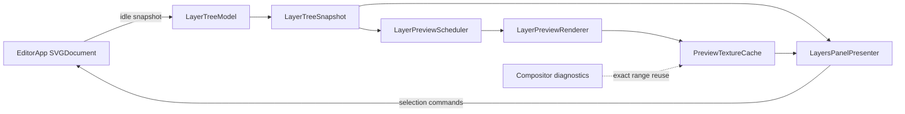
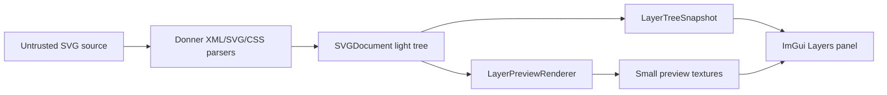

# Design: Editor Group Layers

**Status:** Design
**Author:** Codex
**Created:** 2026-05-30
**Related:** [0033-editor_design_tool_responsiveness](0033-editor_design_tool_responsiveness.md),
[0044-editor_fluid_canvas_rendering](0044-editor_fluid_canvas_rendering.md),
[0045-editor_geode_chrome_migration](0045-editor_geode_chrome_migration.md)

## Summary

The editor needs a layer-centric view of SVG structure. Today the right sidebar has an XML-shaped
tree view and a separate compositor diagnostic panel. Neither is the design-tool concept of a
layer: a selectable object, group, or shape with a name, preview, hierarchy, and source-backed
identity.

This design replaces the current tree view with a Layers panel that reflects SVG groups and shapes
as a navigable tree. Every tier has its own preview: the document row previews the whole document, a
group row previews that group's rendered subtree, and a shape row previews the leaf shape. Expanding
the tree lets the user move from high-level groups down to individual shapes without losing
selection sync with the canvas or source pane.

The panel is editor UI, not renderer diagnostics. It can reuse compositor thumbnails when they
exactly match a row, but its data model is DOM-shaped and stable across renderer backend choices.

## Goals

- Show SVG groups as first-class editor layers.
- Redesign the tree view into a Layers panel with rows for document root, groups, and renderable
  leaves.
- For each row, show a bounded preview of that row's own rendered content and a human-readable name.
- Support nested disclosure: document -> groups -> subgroups -> shapes.
- Keep canvas selection, source selection, and layer-row selection synchronized.
- Allow selecting a group row to manipulate the group as one object, while expanding it exposes
  descendants for direct selection.
- Keep the existing compositor tile panel available as render diagnostics, but stop calling it the
  user-facing layer model.
- Keep the panel responsive on large SVGs by snapshotting, virtualizing, and rendering previews
  lazily.

## Non-Goals

- Full drag-to-reorder in the first milestone.
- Full Group / Ungroup commands in the first milestone. The panel must represent existing groups
  correctly first; structural editing commands can land after the model is stable.
- Replacing the source pane or making the Layers panel a lossless XML editor.
- Showing shadow-tree clones as editable layers. `<use>` and rendered resource references are shown
  as editable light-tree elements, with referenced content exposed through source navigation later.
- Replacing the compositor performance diagnostics. Those remain a separate Render Diagnostics view.
- Moving all sidebar UI from ImGui to Geode. Preview pixels may come from Geode, but interaction
  remains ImGui-owned for this design.

## Next Steps

- Add the layer-tree snapshot model and tests, independent of ImGui rendering.
- Replace the current XML tree view with a read-only Layers panel that shows names, kind, selection,
  and expansion state.
- Add lazy per-row previews after the row model is stable.

## Implementation Plan

- [ ] **Milestone 1: Layer tree model**
  - [ ] Add `LayerTreeModel` / `LayerTreeSnapshot` types under `donner/editor/`.
  - [ ] Build rows from the SVG light tree, classifying document root, groups, and renderable
        leaves.
  - [ ] Generate display names from `id`, `<title>`, semantic label attributes, then tag fallback.
  - [ ] Preserve stable expansion and scroll-target keys across idle snapshot refreshes.
  - [ ] Add model tests for nested groups, unnamed groups, hidden/non-renderable resource subtrees,
        compound paths, and multi-selection.
- [ ] **Milestone 2: Layers panel UI**
  - [ ] Replace `SidebarPresenter::renderTreeView` with a Layers panel presenter backed by
        `LayerTreeSnapshot`.
  - [ ] Render rows with disclosure arrow, thumbnail slot, layer name, element kind, and selection
        state.
  - [ ] Sync row clicks with `EditorApp::setSelection` / `toggleInSelection`.
  - [ ] Auto-expand and scroll to the selected row when selection changes from the canvas or source
        pane.
  - [ ] Rename the current compositor `LayerInspectorPanel` surface to Render Diagnostics in the UI
        so users do not confuse render cache tiles with editable layers.
- [ ] **Milestone 3: Per-tier previews**
  - [ ] Add `LayerPreviewRenderer` that renders a single row's entity range into a fixed-size
        thumbnail.
  - [ ] Use lazy preview requests only for visible rows and rows entering the overscan band.
  - [ ] Cache previews by row key, document version, style/layout generation, preview size, DPR, and
        color theme.
  - [ ] Reuse compositor tile thumbnails only when the compositor tile's entity range exactly
        matches the layer row.
  - [ ] Add preview tests for root, nested group, transformed group, filtered group, compound path
        with a hole, transparent content, and clipping.
- [ ] **Milestone 4: Interaction polish**
  - [ ] Add keyboard navigation for expand/collapse and selection.
  - [ ] Add context-menu entries for Select, Add to Selection, Expand All, Collapse All, and Reveal
        in Source.
  - [ ] Add a compact multi-selection state that shows partially selected groups.
  - [ ] Keep row hover/selection highlights in lockstep with canvas overlay selection.
- [ ] **Milestone 5: Structural group editing**
  - [ ] Add Group Selection: wrap compatible selected siblings in a `<g>` while preserving paint
        order and visual output.
  - [ ] Add Ungroup: splice children into the parent while preserving effective transforms and
        styles.
  - [ ] Add drag-to-reorder after group/ungroup source writeback is covered by undo, source sync,
        and preview invalidation tests.

## User Stories

- As a designer, I can select a top-level group from the Layers panel without needing to click a
  small visible part of it on the canvas.
- As a designer, I can expand a group and select one child shape when I need direct editing.
- As a designer, I can identify `#Background`, `#Blue_center_burst`, and individual letter paths by
  both name and preview.
- As a developer debugging performance, I can still inspect render cache tiles separately from the
  editable layer hierarchy.

## Background

The current sidebar tree is XML-shaped:

- It labels nodes as `<tag> #id`.
- It mirrors all children, including nodes that are not meaningful user-facing layers.
- It has no preview and no design-tool layer affordances.
- It is captured by `SidebarPresenter` only when the async renderer is idle, then replayed while the
  worker owns the document.

The current compositor panel is paint-tile-shaped:

- It shows background, foreground, segments, and cached/immediate compositor tiles.
- Its thumbnails describe render payloads, not editable SVG group identity.
- It is valuable for performance telemetry and should remain available.

The new Layers panel sits between these: DOM-shaped like the editor, visual like a design tool, and
implemented with the same idle snapshot discipline as the existing sidebar.

## Requirements and Constraints

- The layer tree is based on the editable SVG light tree.
- A row maps to one editable `svg::SVGElement`; it does not expose EnTT entities or renderer
  internals as public UI concepts.
- Group rows include `<g>` and nested `<svg>` elements that have renderable descendants.
- Leaf rows include renderable SVG content such as geometry, text, image, and `<use>` elements.
- Non-rendered resource subtrees (`<defs>`, gradients, filters, clip paths, masks, patterns,
  markers, symbols, styles) are hidden from the default Layers panel. A future Resources section can
  expose them explicitly.
- Row order is visual stack order by default: later-painted siblings appear above earlier-painted
  siblings. The source pane remains the canonical source-order view.
- Each preview is clipped to the preview cell and fit to the row's own rendered bounds.
- Empty rows, display-none rows, and unresolved references get deterministic placeholder previews.
- The panel must not read live DOM state while the async renderer owns the document.
- No new feature flags. Ship incrementally by replacing the tree view once tests cover the model.

## Proposed Architecture

### Terminology

- **Editor layer:** A user-facing row in the Layers panel. It represents one editable SVG light-tree
  element.
- **Group layer:** An editor layer whose element is a grouping/container element and whose preview
  is the rendered subtree.
- **Shape layer:** An editor layer whose element is a leaf renderable object.
- **Compositor layer/tile:** A render-cache artifact owned by `CompositorController`. It is not the
  same thing as an editor layer.

### Data Flow



The snapshot boundary mirrors the existing `SidebarPresenter`: live DOM reads only happen on idle UI
frames. While the renderer worker is busy, the panel replays the last snapshot and drops mutating row
clicks.

### Layer Tree Snapshot

`LayerTreeSnapshot` is a pure value snapshot:

```cpp
struct LayerTreeRow {
  LayerNodeKey key;
  svg::ElementType elementType;
  LayerRowKind kind;  // Document, Group, Shape, ResourcePlaceholder.
  std::string name;
  std::string detail;
  bool selected = false;
  bool partiallySelected = false;
  bool visible = true;
  bool locked = false;  // Reserved for future UI; false in V1.
  std::optional<Box2d> renderedBoundsDoc;
  std::vector<LayerTreeRow> children;
};
```

`LayerNodeKey` is stable enough for UI state:

- Prefer the retained `ElementAnchor` when the live document has not been replaced.
- Include source range or structural path fallback for refreshes after source sync.
- Include tag/id/ordinal as a diagnostic string for test failures and telemetry.

The model walks the light tree and filters rows through an editor-layer predicate:

- Include the root `<svg>`.
- Include group-like nodes that have renderable descendants or are selected.
- Include renderable leaves.
- Skip non-rendered resources from the main layer tree.

Compound paths remain a single shape layer. If the user wants separate rows for each contour, they
use the existing Unbundle Compound Shape action first; after unbundling, the resulting paths appear
as separate shape layers.

### Names

Display names come from the first available source:

1. `id`
2. `aria-label`
3. first direct `<title>` text
4. tag-specific fallback, such as `Group 3`, `Path 12`, `Ellipse 2`

The row detail text shows the element kind, for example `group`, `path`, `rect`, or `use`. The
source pane remains the place to inspect raw attributes.

### Preview Rendering

Every tier has its own preview:

- Document row: whole document.
- Group row: rendered subtree for that group, including child transforms, inherited style, clips,
  masks, opacity, filters, and descendants.
- Shape row: that element's rendered output.

The preview renderer uses the renderer's existing entity-range machinery:

1. Build or reuse rendering instances for the current document version.
2. Resolve the row's `firstEntity` / `lastEntity` range.
3. Compute tight bounds with `RendererDriver::computeEntityRangeBounds`.
4. Construct a thumbnail viewport that fits those bounds into a fixed preview size.
5. Render with `RendererDriver::drawEntityRange` into a small offscreen target.

This keeps previews faithful to actual renderer output and avoids inventing a second shape drawing
path. For Geode builds, the offscreen preview can produce a `RendererTextureSnapshot` and present it
directly through ImGui. For non-Geode builds, it uploads a small RGBA thumbnail texture.

The preview cache key includes:

- `LayerNodeKey`
- document frame version
- style/layout/render-tree generation
- preview size in pixels
- device pixel ratio
- row bounds generation
- UI theme bits needed for placeholders or checkerboard background

Previews are requested lazily for visible rows plus a small overscan window. Large collapsed
subtrees do not render every descendant preview.

### UI Layout

The right sidebar becomes three conceptual surfaces:

- **Layers:** the user-facing editable hierarchy.
- **Inspector:** attributes, computed style, path operations, and selection details.
- **Render Diagnostics:** compositor tiles, immediate/cached mode, frame misses, and heuristic
  telemetry.

The Layers row layout:

```text
[disclosure] [48x48 preview]  Layer Name
                           kind / status
```

Rows use fixed preview and row heights so thumbnail loading cannot shift layout. Long names elide in
the middle with a tooltip containing the full name and source tag.

### Selection Semantics

- Clicking a row selects that element.
- Cmd/Ctrl-click toggles that element in the selection.
- Shift-click extends selection in visible row order.
- Selecting a group row selects the group element, not every descendant.
- Partially selected groups show an indeterminate visual state when some descendants are selected.
- Canvas selection expands ancestors and scrolls the selected row into view.

Group manipulation uses the existing selection and drag path: selecting a group row means the canvas
overlay, bounding box, transforms, and writeback target all point at the group element. Descendant
selection remains available by expanding the group and selecting a child row.

### Source Sync

Layer selection and source selection stay linked:

- Row selection updates the editor selection and source focus target.
- Source focus or canvas selection updates the row highlight.
- Source edits that preserve structure keep expansion state through structural path remapping.
- Source edits that replace structure keep the most recent expansion state where row keys can be
  remapped and drop only rows that no longer exist.

## Error Handling

- If a row's preview render fails, the row shows a deterministic placeholder and records the failure
  in diagnostics.
- If source remapping cannot match a row after document replacement, expansion state for that row is
  dropped rather than guessed.
- If an SVG subtree exceeds preview budget, the preview scheduler marks it stale and retries during
  idle instead of blocking the UI thread.
- If a row maps to an invalid element handle, the snapshot is discarded and refreshed on the next
  idle frame.

## Performance

Targets for `donner_splash.svg` on an M-series Mac:

| Operation                             | Target                                |
| ------------------------------------- | ------------------------------------- |
| Snapshot layer tree after idle        | <= 4 ms for typical documents         |
| Render visible layer rows             | <= 1 ms excluding thumbnail uploads   |
| First preview for one visible row     | <= 8 ms budgeted background work      |
| Scroll through layer list             | Sustained 120 fps with stale previews |
| Selection update from canvas to panel | Next UI frame after renderer idle     |
| Preview memory                        | <= 32 MiB default soft cap            |

The panel must prefer stale previews over blocking interaction. If a preview is missing or stale,
the row still renders with name, kind, selection state, and placeholder.

## Security / Privacy

The layer panel renders previews from the loaded SVG, which may be untrusted input. It must reuse
Donner's existing parser, resource, and renderer validation paths rather than introducing a separate
SVG interpreter.

Trust boundary:



Defensive measures:

- Preview rendering uses existing renderer resource policies. It must not fetch new external
  resources beyond what the document renderer already allows.
- Preview work has per-row time and memory budgets.
- Preview dimensions are capped and power-of-two allocation reuse can be applied inside the cache,
  but texture coordinates must crop to the logical preview bounds.
- Names and details are displayed as text only; they are not interpreted as markup.
- Telemetry must not write SVG source text or attribute values unless explicitly requested by a
  future debug export.

## Testing and Validation

CI targets for core invariants:

- `//donner/editor/tests:layer_tree_model_tests`
  - Nested groups appear as expandable group rows.
  - Leaves appear under the right group in visual stack order.
  - Non-rendered resources are excluded from the default layer tree.
  - Names resolve from `id`, `aria-label`, `<title>`, then fallback.
  - Canvas/source selection maps to the expected row key.
- `//donner/editor/tests:layer_preview_tests`
  - Root, group, subgroup, and shape rows each render distinct previews.
  - Group previews include descendants and inherited/transformed style.
  - Compound path previews preserve holes.
  - Filtered group previews include filter expansion without bleeding outside the preview cell.
  - Empty or invalid rows produce deterministic placeholders.
- `//donner/editor/tests:sidebar_presenter_tests`
  - Layer rows render from snapshots while the async renderer is busy.
  - Mutating clicks are dropped while live access is unavailable.
  - Expansion state survives snapshot refresh and is removed only for unmatched rows.
  - Selection from a row updates `EditorApp` selection.
- `//donner/svg/renderer/tests:renderer_driver_tests`
  - Entity-range rendering continues to match full-document rendering for subtrees used as previews.
- `//donner/editor/tests:editor_sync_tests`
  - Row selection focuses the corresponding source range.
  - Source edits that preserve structure keep layer expansion and selection remapped.

Manual validation:

- Open `donner_splash.svg`, verify `#Background`, `#Blue_center_burst`, letters, and nested groups
  are recognizable by name and preview.
- Expand from document root down to an individual letter path and select it from the Layers panel.
- Select a group from the Layers panel and drag it on the canvas; overlay and rendered shape remain
  in lockstep.
- Scroll the Layers panel quickly with all major groups expanded; the panel remains fluid while
  previews fill in asynchronously.

## Dependencies

- Existing `SidebarPresenter` snapshot discipline.
- Existing `SelectionAabb` renderable-descendant helpers.
- Existing `RendererDriver::drawEntityRange` and `computeEntityRangeBounds`.
- Existing Geode `RendererTextureSnapshot` / ImGui texture presentation path where available.
- Existing `LayerInspectorPanel` thumbnail upload code can be factored into a reusable thumbnail
  texture cache, but the editable layer model must not depend on compositor tile state.

## Rollout Plan

1. Land model and tests with no UI replacement.
2. Replace the XML tree view with the Layers panel using placeholders instead of previews.
3. Add lazy previews.
4. Rename current compositor layer UI to Render Diagnostics.
5. Add group/ungroup and reorder only after row identity, undo, source sync, and previews are
   stable.

No feature flags are needed. Each milestone is small enough to land behind existing UI structure and
covered by targeted tests.

## Alternatives Considered

- **Use the existing XML tree and add thumbnails.** Rejected because the XML tree exposes resources
  and implementation detail nodes as peers of editable artwork. It also lacks visual stack order and
  group/shape semantics.
- **Use compositor tiles as layers.** Rejected because compositor segmentation is a performance
  artifact. One user-facing group can be several tiles, and several user-facing shapes can be one
  tile.
- **Render previews by manually drawing path geometry.** Rejected because it would become a second
  renderer and would miss filters, masks, clips, text, `<use>`, inherited style, and backend parity.
- **Show only leaf shapes.** Rejected because the requested workflow starts at groups and drills
  down.

## Open Questions

- Should the panel offer a source-order mode in addition to visual stack order?
- Should row names be editable in V1, and if so should rename write `id`, `<title>`, or both?
- Should hidden resource subtrees have a separate Resources tab in the same sidebar?
- How much preview fidelity is useful for very small paths where the thumbnail is mostly empty?
- Should preview stale/fresh state be visible to users or only available in diagnostics?

## Future Work

- [ ] Drag-to-reorder rows with source writeback and undo.
- [ ] Group / Ungroup commands with visual output preservation.
- [ ] Visibility and lock controls per row.
- [ ] Layer search/filter by name, type, and selection state.
- [ ] Optional resource tree for gradients, filters, symbols, masks, and clip paths.
- [ ] Geode-rendered decorative chrome for row previews and selection highlights.
