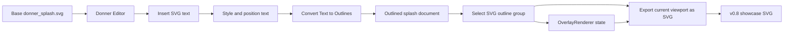
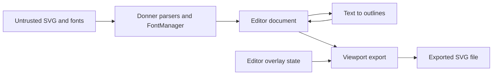

# Design: Donner v0.8 Showcase and Rebrand

**Status:** Design
**Author:** Codex
**Created:** 2026-05-30
**Related:** [0010-text_rendering](0010-text_rendering.md),
[0033-2-editor_design_tool_responsiveness](0033-2-editor_design_tool_responsiveness.md),
[0041-2-path_authoring_and_boolean_operations](0041-2-path_authoring_and_boolean_operations.md),
[0044-2-editor_fluid_canvas_rendering](0044-2-editor_fluid_canvas_rendering.md)

## Summary

v0.8 is the next Donner release. It combines the accumulated editor, Geode, path, and performance
work with a rebrand to **Donner SVG Editor & Toolkit**.

The v0.8 showcase should be a new Donner splash SVG produced with the Donner Editor itself. The
showcase image is not just a refreshed logo; it is proof that the editor can author visible SVG
content, convert text into editable vector outlines, preserve selection chrome, and export the
current editor viewport as a static SVG "screenshot".

The editor also needs the everyday authoring affordances required to make that workflow credible:
shape cut/copy/paste and a tuned Pen tool. The showcase should not require source-pane surgery,
external duplication, or a fragile path-authoring workflow to place and refine the new artwork.

The target artifact is a cropped SVG export of the editor viewport showing the new Donner splash
with the letters `SVG` added to the design, converted to outlines, selected, and rendered with the
editor's path overlay UI visible. The final public splash is therefore both artwork and product
demo: it shows Donner editing Donner's own logo.

## Goals

- Rebrand the release around **Donner SVG Editor & Toolkit**: an editor application plus reusable SVG
  rendering/geometry/toolkit libraries.
- Treat v0.8 as the next release, not a side quest after v1.0 work.
- Include all completed work since the previous release plus the showcase-specific editor
  capabilities listed below.
- Create a new v0.8 Donner splash using the existing `donner_splash.svg` as a starting point.
- Make all artwork changes through Donner Editor commands, not by hand-editing SVG source in an
  external tool.
- Add text authoring UI sufficient to place and style the text `SVG`.
- Add Convert Text to Outlines, using Donner's text layout and glyph outline pipeline.
- Convert the showcase `SVG` text into path outlines before saving the final artwork.
- Add an editor export command that saves the current viewport as a cropped SVG file.
- Let viewport SVG export optionally include editor path overlay UI: selected path outlines,
  bounds, and handles.
- Add shape cut/copy/paste for selected SVG elements, including undoable Cut and deterministic
  pasted source insertion.
- Include Paste in Front with `Cmd+F` for exact-position duplication; default Paste offsets the
  result from the copied location so the new shapes are visible.
- Tune the Pen tool enough for release-authoring use: reliable point placement, handle editing,
  closure, preview, undo, and same-frame bounds/overlay updates.
- Complete the user-facing Layers panel so the showcase can navigate the splash by document,
  groups, subgroups, and shapes with previews at every tier.
- Produce a final showcase SVG where the outlined `SVG` letters are selected and the overlay UI is
  visible.
- Keep the showcase reproducible enough that future releases can update it without guessing which
  manual steps were used.

## Non-Goals

- Full rich text editing. V0.8 needs enough UI for placing and styling short SVG text, not a
  paragraph editor.
- Font browser parity with design tools. The showcase can use a checked-in or embedded font.
- Editable live text after Convert Text to Outlines. The conversion is destructive and undoable.
- Exporting the full ImGui editor UI as SVG. V0.8 export includes document content and optional
  vector overlay chrome only.
- PNG screenshot export. The v0.8 showcase is an SVG output.
- Replacing the normal Save / Save As document path. Viewport export is a separate Export command.
- Making the final showcase depend on installed system fonts.
- Full Illustrator/Figma parity for path editing. V0.8 needs a dependable Pen tool for authored
  showcase paths, not every advanced path editing mode.
- Cross-application rich clipboard interoperability beyond sensible SVG/text payloads. Internal
  editor round-trip correctness comes first.

## Next Steps

- Update public copy and release metadata for the **Donner SVG Editor & Toolkit** rebrand.
- Add shape clipboard and Pen tool polish to the editor implementation plan.
- Make the group-aware Layers panel a showcase-gating editor deliverable.
- Add the text authoring and text-to-outline design slice to the editor plan.
- Implement viewport SVG export with an overlay inclusion option.
- Use the editor to create and export the v0.8 showcase asset, then check in the final SVG and its
  provenance notes.

## Implementation Plan

- [ ] **Milestone 1: Showcase asset plan and provenance**
  - [ ] Add target asset names and locations for the editable source, final outlined splash, viewport
        export, and optional repro/provenance log.
  - [ ] Add a manual release checklist describing the editor-only operations used to create the
        asset.
  - [ ] Add a test fixture that loads the planned source asset and fails if it is missing or invalid.
- [ ] **Milestone 2: Core shape authoring affordances**
  - [ ] Add Edit -> Cut / Copy / Paste behavior for selected shapes, groups, and compound paths.
  - [ ] Use an SVG-native clipboard payload for copied elements, with plain text fallback where
        platform clipboard APIs require it.
  - [ ] Paste into the current document inside the appropriate parent/root `<svg>`, not after the
        root close tag.
  - [ ] Offset pasted shapes visibly from the source selection while preserving transforms and paint
        order semantics.
  - [ ] Add Paste in Front with `Cmd+F` for exact-position duplication when the user needs a
        perfectly aligned copy in front of the copied artwork.
  - [ ] Regenerate conflicting IDs and update internal references where possible, or fail without
        mutating when safe ID/reference repair is not possible.
  - [ ] Make Cut a single undoable operation that restores the original selection and source text.
  - [ ] Tune the Pen tool for predictable release use: click-to-line, click-drag handles, close
        path, cancel/commit, live preview, immediate selection bounds, and overlay lockstep.
  - [ ] Ensure Pen-created paths enter the document inside the root `<svg>` and participate in
        undo/source sync like other editor commands.
- [ ] **Milestone 3: Complete Layers panel**
  - [ ] Replace the user-facing tree view with the Layers panel from
        [0046-editor_group_layers](0046-editor_group_layers.md).
  - [ ] Show the document root, groups, subgroups, and leaf shapes as an expandable hierarchy.
  - [ ] Show a preview thumbnail and stable display name for every visible layer row.
  - [ ] Keep Layers selection, canvas selection, and source selection synchronized.
  - [ ] Support group-row selection for manipulating a group as one object, while expansion exposes
        child shapes for direct editing.
  - [ ] Include keyboard navigation, context-menu selection actions, and partial-selection state.
  - [ ] Keep render diagnostics separate as Compositor Debug so the showcase UI exposes editable
        layers, not compositor cache tiles.
- [ ] **Milestone 4: Text authoring UI**
  - [ ] Add a Text tool or Insert Text command that creates a `<text>` element at the current
        viewport/click position.
  - [ ] Add inspector controls for text content, font family, font size, fill, stroke, and basic
        transform.
  - [ ] Route text creation and edits through `EditorCommand` and undo snapshots.
  - [ ] Keep text source insertion rooted inside the current `<svg>` element.
- [ ] **Milestone 5: Convert Text to Outlines**
  - [ ] Add a `ConvertTextToOutlinesCommand` for selected text elements.
  - [ ] Reuse `TextEngine` placed glyph geometry so conversion matches Donner rendering.
  - [ ] Emit deterministic `<path>` elements or a grouped outline subtree in document space.
  - [ ] Preserve visual style, transforms, fill rule, opacity, and paint order.
  - [ ] Delete or replace the original `<text>` only after outline generation succeeds.
  - [ ] Select the new outline group/paths and restore the original selection on undo.
- [ ] **Milestone 6: Viewport SVG export**
  - [ ] Add File -> Export Viewport as SVG.
  - [ ] Compute the export crop from `ViewportState` and the render pane content rect.
  - [ ] Save an SVG whose `viewBox` is the visible document rect and whose viewport dimensions match
        the editor pane's logical pixel size by default.
  - [ ] Clip exported document content to the viewport crop.
  - [ ] Add options for content only, content plus selection overlay, and transparent/background
        handling.
  - [ ] Ensure export does not trigger a full document reparse or cache clear in the active editor
        session.
- [ ] **Milestone 7: Overlay-to-SVG serialization**
  - [ ] Factor overlay chrome into backend-neutral vector primitives or add an SVG serialization
        target for `OverlayRenderer`.
  - [ ] Serialize selected path outlines, selection AABBs, handles, and optional labels/chips as an
        `id="donner-editor-overlay"` group.
  - [ ] Keep overlay styling deterministic and independent of ImGui theme drift.
  - [ ] Clip overlay primitives to the exported viewport.
- [ ] **Milestone 8: Produce the v0.8 showcase**
  - [ ] Open the base splash in Donner Editor.
  - [ ] Use the complete Layers panel to navigate and select document groups and shapes while
        authoring the showcase.
  - [ ] Use Pen tool and shape clipboard operations where needed instead of external SVG edits.
  - [ ] Add and style the `SVG` text using the new text UI.
  - [ ] Convert the `SVG` text to outlines.
  - [ ] Select the outlined `SVG` letters and frame the viewport.
  - [ ] Export the viewport SVG with overlay enabled.
  - [ ] Check in the final asset and provenance notes.
- [ ] **Milestone 9: Rebrand and release packaging**
  - [ ] Update public docs, README text, release notes, and app labels to use
        `Donner SVG Editor & Toolkit`.
  - [ ] Audit places that describe Donner only as a rendering library and update them to reflect
        the editor/toolkit scope.
  - [ ] Update roadmap status so v0.8 is the next release and v1.0 remains the later production
        release.
  - [ ] Add release validation that the checked-in showcase asset loads and renders in Donner.

## User Stories

- As a user evaluating v0.8, I can look at the splash and immediately see Donner editing SVG.
- As a designer, I can copy, cut, paste, and reposition shapes without switching to source text or
  another editor.
- As a designer, I can create and refine path geometry with the Pen tool without fighting stale
  bounds, lagging overlays, or source insertion bugs.
- As a designer, I can navigate the splash structure through a complete Layers panel with previews
  for the document, groups, subgroups, and shapes.
- As a designer, I can add text to an SVG, tune its placement, and convert it to normal editable
  paths.
- As a release author, I can export the exact current canvas view as SVG without using a browser or
  external screenshot tool.
- As a developer, I can verify that the showcase was generated through the editor workflow and still
  renders correctly in Donner.

## Showcase Artifacts

The exact filenames can change during implementation, but the release should distinguish:

- `donner_splash.svg`: current stable splash, kept until the new asset is ready.
- `donner_splash_v0_8_editable.svg`: optional intermediate editor-authored source before viewport
  export. It may contain editable text while the asset is in progress.
- `donner_splash_v0_8.svg`: final public splash. It contains outlined `SVG` letters, no dependency
  on system fonts, and optional exported editor overlay chrome.
- `donner_splash_v0_8.provenance.md` or `.donner-repro`: concise record of the editor operations
  used to produce the final asset.

The final public asset should not require live text shaping to render as intended. Text support is
showcased by the creation workflow and text-to-outline conversion, while the checked-in final splash
is stable path geometry.

## Release Scope

v0.8 is a release cut of everything completed so far on the editor-focused branch plus the minimum
additional work needed to make the showcase honest and reproducible:

- Geode-backed editor rendering as the default editor path.
- Fluid canvas rendering work that keeps zoom, drag, overlay, and large selections responsive.
- Direct/immediate rendering paths needed by the editor.
- In-tree path operations and editor pathfinder fixes.
- Compound path unbundle support.
- Complete user-facing Layers panel with group/shape hierarchy, previews, and selection sync.
- Shape cut/copy/paste for authoring and duplicating artwork in the editor.
- A tuned Pen tool suitable for authoring release artwork.
- Text authoring UI for placing `SVG`.
- Convert Text to Outlines.
- Viewport SVG export with optional selection overlay chrome.
- The v0.8 splash/showcase asset and provenance.

The release intentionally does not claim full design-tool parity. It should demonstrate a credible
SVG editor and a solid SVG toolkit foundation, with v1.0 remaining the broader production-quality
milestone.

## Requirements and Constraints

- All showcase artwork edits are performed through editor commands.
- Shape clipboard operations use editor commands, preserve source synchronization, and are undoable.
- Paste inserts new elements inside the destination root or selected parent, never outside the root
  `<svg>`.
- Default Paste offsets pasted elements from their source location for visibility; Paste in Front
  preserves the copied geometry's document-space placement exactly.
- Pen tool point placement updates the live path, selection bounds, and overlay in the same visible
  frame.
- The Layers panel is complete enough for the showcase workflow: expandable groups, row previews,
  stable names, canvas/source selection sync, and visible distinction from Compositor Debug.
- The final asset is an SVG file, not a raster image embedded in SVG.
- The final `SVG` lettering is path geometry, not live `<text>`.
- Text-to-outline output is deterministic for the same text, font, style, and transform.
- Viewport export uses `ViewportState` as the source of truth for crop and scale.
- Overlay export samples the same selection state as the visible editor overlay; it cannot be one
  frame behind the exported document content.
- Exported overlay primitives are clipped to the same viewport crop as document content.
- The normal document save path remains unchanged.
- The export path must support both Geode and non-Geode editor builds.

## Proposed Architecture

### End-to-End Flow



### Text Authoring

V0.8 text UI should be intentionally small:

- Create text at a clicked document point.
- Edit the text string in the inspector.
- Edit font family, font size, fill, stroke, opacity, and transform using existing style controls
  where possible.
- Reuse existing selection, drag, resize, rotate, undo, and source-sync behavior.

The created element is a normal SVG `<text>` element. The editor does not need a full in-canvas text
caret for v0.8; inspector-based content editing is enough for the showcase. A future text tool can
add direct text editing once source/selection semantics are designed.

### Shape Clipboard

Shape clipboard operations are structural SVG edits, not screenshots:

- **Copy** serializes the selected elements as SVG fragment text plus enough metadata to preserve
  paint order, selection order, and paste offset.
- **Cut** performs Copy and then deletes the selected elements as one undoable editor command.
- **Paste** parses the clipboard fragment into the current document, repairs IDs when needed,
  inserts inside the current root or selected compatible parent, offsets the pasted selection, and
  selects the pasted elements.
- **Paste in Front** (`Cmd+F`) uses the same parsing, repair, insertion, undo, and selection path
  as Paste, but suppresses the visibility offset so the duplicated elements stay exactly aligned
  with and painted in front of the source geometry.
- Paste from Donner's own clipboard payload is expected to preserve groups, compound paths,
  transforms, styles, and internal references when they can be repaired deterministically.
- Paste from generic SVG text is allowed as a best-effort import path, but failures must leave the
  open document unchanged.

Initial v0.8 support can reject payloads with unresolved external resources or references that
cannot be rewritten safely. That is preferable to pasting broken geometry into the showcase source.

### Pen Tool Quality Bar

The Pen tool must be good enough to author the showcase without source edits:

- Click places line anchors.
- Click-drag places a smooth anchor with handles.
- Modifier behavior for corner/smooth conversion is documented and covered by tests.
- Hover/drag preview shows the segment that will be committed.
- Closing a path is predictable and creates a valid closed contour.
- Escape/cancel leaves the document unchanged; commit produces one undoable path operation.
- Every placed point updates the path bounds and overlay immediately.
- Source insertion places the new `<path>` inside the root `<svg>` and preserves source sync.

The Pen tool does not need full node-edit mode for existing arbitrary paths in v0.8, but the paths
it creates must be normal editable geometry that selection, drag, path operations, and viewport
export can consume.

### Convert Text to Outlines

Text-to-outline conversion should use Donner's renderer-facing text geometry, not a separate font
path:

1. Resolve computed style and layout for each selected text element.
2. Ask `TextEngine` for placed glyph outlines in the same document-space positions used by
   rendering.
3. Convert each glyph outline into a `Path` with the correct glyph transform.
4. Emit paths in paint order under a replacement `<g>` or as sibling `<path>` elements.
5. Preserve fill/stroke style at the closest equivalent level.
6. Remove the original `<text>` after outline paths are ready.
7. Select the outline result.

For the showcase, the preferred output is one group:

```xml
<g id="SVG_outlines" data-donner-converted-from="text">
  <path id="SVG_outlines_S" .../>
  <path id="SVG_outlines_V" .../>
  <path id="SVG_outlines_G" .../>
</g>
```

The exact grouping can vary when shaping produces multiple glyphs or contours, but the result should
be ordinary path geometry that path edit, path operations, selection bounds, and viewport export can
handle.

### Viewport SVG Export

Viewport export produces a static SVG with the current visible document region as its viewport:

- `width` / `height`: render pane logical pixel size by default.
- `viewBox`: document-space rect visible in the render pane.
- Document content: copied from the current SVG document into the exported root.
- Crop: enforced by the root viewport and an explicit clip path for importer consistency.
- Metadata: includes Donner version, source document name, viewport crop, and export options.

The export command should support at least:

- **Content only:** cropped document content, no editor UI.
- **Content + selection overlay:** document content plus path outlines, AABBs, and handles.
- **Transparent background:** preserve transparency instead of adding editor checkerboard.

The export should be vector-first. It should not snapshot the document content as a PNG and wrap it
in `<image>`. If an element cannot be represented because of an unsupported external resource, the
export reports that explicitly rather than silently rasterizing.

### Overlay SVG Export

Overlay export must serialize editor chrome as SVG primitives:

- path outlines as stroked paths
- selected element bounds as stroked rectangles or paths
- resize handles as small filled rectangles/circles
- rotation handles and handle lines where visible
- optional selection labels/chips only if they can be serialized deterministically

The overlay group is separate from document content:

```xml
<g id="donner-editor-overlay" data-donner-export-role="editor-overlay"
   pointer-events="none">
  ...
</g>
```

Overlay styling should be stable across platforms and themes. The showcase should not change because
the editor theme changed locally.

### Provenance

The showcase should carry lightweight proof that it was made in Donner Editor:

- The final SVG metadata records `created-by="Donner Editor"` and the Donner version/commit.
- The release commit includes either an `.rnr` replay or a short provenance Markdown file listing
  the editor commands used.
- Tests validate the final asset loads in Donner and does not contain live `<text>` for the `SVG`
  letters.

## Error Handling

- Text-to-outline conversion leaves the document unchanged if font resolution, layout, or outline
  extraction fails.
- If only some selected text elements can be converted, the command fails as a whole and reports the
  blocking element.
- Viewport export fails loudly if the document has unresolved external resources that cannot be
  embedded or referenced safely.
- If overlay serialization fails, the export dialog offers to export content only rather than
  writing a partial overlay.
- Failed exports do not mutate the open document or clear editor render caches.

## Performance

This work is not on the interactive drag hot path, but it must not make the editor feel stuck:

| Operation                        | Target                                        |
| -------------------------------- | --------------------------------------------- |
| Copy/cut selected shapes         | visible next frame                            |
| Paste selected shapes            | visible next frame for showcase-sized payload |
| Place Pen point                  | visible same frame                            |
| Insert short text                | visible next frame                            |
| Edit text content in inspector   | visible next frame after command commit       |
| Convert `SVG` to outlines        | <= 100 ms for three glyphs on an M-series Mac |
| Export viewport SVG without UI   | <= 250 ms for the splash viewport             |
| Export viewport SVG with overlay | <= 350 ms for the splash viewport             |

Longer exports may show progress, but they should not trigger a full active-session reparse or
clear the compositor cache.

## Security / Privacy

Inputs include user-authored SVG, text strings, font data, and export paths. The export path writes
files to user-selected locations and can serialize document metadata.

Trust boundary:



Defensive measures:

- Text-to-outline uses existing font loading and text layout validation.
- Export does not fetch new network resources.
- Export paths come from the user's save dialog or explicit CLI/test path.
- Metadata must not include absolute local paths unless the user opts into debug provenance.
- Overlay export serializes geometry and stable labels only; it does not serialize transient input
  state such as mouse position history.
- Fuzz text-to-outline and viewport export against malformed SVG/text/font combinations once the
  core commands land.

## Testing and Validation

CI targets for core invariants:

- `//donner/editor/tests:text_tool_tests`
  - Creates a `<text>` element inside the root `<svg>`.
  - Updates text content through an editor command and undo/redo.
  - Preserves source sync and selection after insertion.
- `//donner/editor/tests:shape_clipboard_tests`
  - Copy serializes selected shapes as SVG fragment data.
  - Cut deletes selected shapes and restores them with selection on undo.
  - Paste inserts inside the root `<svg>` or selected compatible parent.
  - Paste offsets the new selection and regenerates conflicting IDs deterministically.
  - Paste in Front preserves the copied document-space placement and places the result in front.
  - Failed paste leaves source, DOM, selection, and undo stack unchanged.
- `//donner/editor/tests:pen_tool_tests`
  - Places line and curve anchors with deterministic path data.
  - Inserts new paths inside the root `<svg>`.
  - Updates bounds and overlay state as soon as each point is placed.
  - Supports close, cancel, undo, and redo without stale selection chrome.
- `//donner/editor/tests:layer_tree_model_tests`
  - Builds rows for document root, groups, subgroups, compound paths, and leaf shapes.
  - Produces stable display names and visual stack ordering for the splash structure.
  - Preserves expansion and selection state across snapshot refreshes.
- `//donner/editor/tests:layers_panel_tests`
  - Syncs row clicks with canvas/source selection and multi-selection state.
  - Shows row previews for root, group, subgroup, and shape tiers.
  - Separates the editable Layers panel from Compositor Debug diagnostics.
- `//donner/editor/tests:text_outline_tests`
  - Converts `SVG` to path geometry with no live `<text>` in the result.
  - Pixel-compares text rendering before conversion and outlined rendering after conversion.
  - Preserves fill, opacity, transform, and paint order.
  - Restores the original text element and selection on undo.
  - Leaves the document unchanged on missing-font or empty-outline failure.
- `//donner/editor/tests:viewport_svg_export_tests`
  - Exported `viewBox` matches `ViewportState::screenToDocument(renderPaneRect)`.
  - Exported content is clipped to the viewport.
  - Overlay group is absent by default and present when requested.
  - Overlay paths align with selected document geometry in the exported coordinate space.
  - Export does not mutate the source document.
- `//donner/editor/tests:showcase_asset_tests`
  - The final v0.8 showcase SVG parses and renders in Donner.
  - The final v0.8 showcase contains outlined `SVG` paths and no live `SVG` text element.
  - The exported overlay group exists and is clipped when the showcase overlay variant is used.

Manual validation:

- Create the `SVG` text in the editor, convert it to outlines, and verify the letter shapes remain
  visually unchanged.
- Duplicate, cut, and paste representative splash shapes, then undo/redo and verify source/canvas
  stay in sync.
- Author a small path with the Pen tool, close it, edit the viewport, and verify bounds/overlay
  stay locked to the rendered geometry.
- Navigate the splash from the Layers panel, expanding from document to groups to shapes, and verify
  each tier has a useful preview and selection syncs with canvas/source.
- Select the outlined `SVG` letters and export the viewport with overlay enabled.
- Open the exported showcase in Donner and a browser to verify the crop, overlay, and transparency.
- Confirm the final asset still looks correct when system fonts are unavailable.

## Dependencies

- Existing SVG text layout and glyph outline extraction in the text engine.
- Existing editor command, undo, and source-sync infrastructure.
- Existing clipboard abstraction used by the text editor, extended for SVG shape payloads.
- Existing Pen tool path creation and source insertion flow from the path authoring workstream.
- Existing group-layer design in [0046-editor_group_layers](0046-editor_group_layers.md).
- Existing `OverlayRenderer` path outline and selection bounds logic.
- Existing `ViewportState` coordinate conversion.
- Existing file save/export UI in `MenuBarPresenter`.
- Existing renderer entity/path serialization helpers where available.

## Rollout Plan

1. Land shape cut/copy/paste with source-sync and undo coverage.
2. Land Pen tool polish needed for release artwork.
3. Land the complete Layers panel with previews and selection sync.
4. Land text insertion and inspector editing.
5. Land text-to-outline conversion with tests.
6. Land viewport SVG export content-only.
7. Land overlay SVG export.
8. Create the v0.8 showcase asset in the editor and check it in with provenance.
9. Update docs and release notes to use the new splash.

## Alternatives Considered

- **Draw `SVG` directly as paths by hand.** Rejected because it would not demonstrate text UI or
  text-to-outline conversion.
- **Export a PNG screenshot.** Rejected because the showcase should remain SVG-native and inspectable.
- **Embed live `<text>` in the final splash.** Rejected because the release asset would depend on
  font resolution and would not exercise outline conversion.
- **Capture the entire ImGui window.** Rejected because the requested artifact is an SVG viewport
  screenshot of the artwork and path overlay, not a full app UI screenshot.
- **Use browser screenshot tooling.** Rejected because all changes and the final export should come
  from Donner Editor.

## Open Questions

- Should the final checked-in splash be only the overlay screenshot, or should we also check in a
  clean content-only v0.8 splash?
- Should text-to-outline output one path per glyph, one path per contour, or one compound path for
  the whole text element?
- Should viewport export embed external image/font resources or fail unless the document is already
  self-contained?
- Should overlay export include selection-size chips, source-reference ropes, and labels, or only
  path outlines, bounds, and handles for v0.8?
- Where should showcase provenance live: `.rnr`, Markdown checklist, SVG metadata, or all three?

## Future Work

- [ ] Direct in-canvas text editing with caret and range selection.
- [ ] Font picker with checked-in release-safe font presets.
- [ ] Export viewport to PNG and PDF in addition to SVG.
- [ ] Export full editor chrome as SVG/HTML for documentation screenshots.
- [ ] Non-destructive "convert copy to outlines" command.
