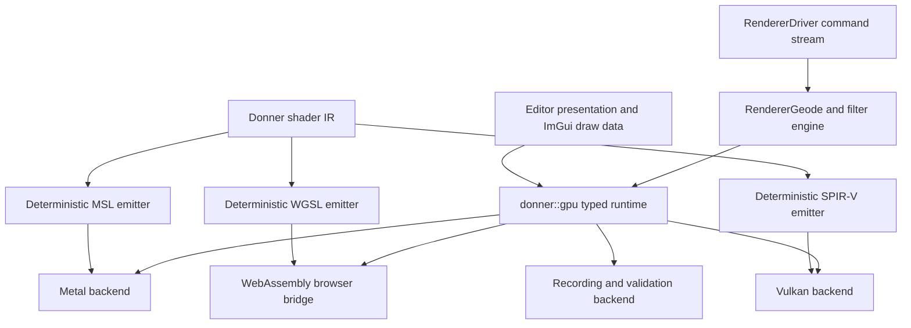

# Design: Donner Native GPU Runtime and Rust-Independent Build

**Status:** Design\
**Created:** 2026-07-05\
**Updated:** 2026-07-10\
**Author:** GPT-5.6 Sol

## Summary

Donner will replace its native `wgpu-native` dependency with an original C++20 GPU runtime built
inside Donner. The runtime will expose a narrow Donner-owned rendering hardware interface, not the
WebGPU C ABI. It will target Metal on Apple platforms, Vulkan on Linux and Windows, and the browser's
WebGPU service through a small Donner-owned WebAssembly bridge.

This is a clean-room, specification-led implementation. It must not copy, translate, vendor, link,
or ship implementation code from `wgpu`, `wgpu-native`, Naga, Dawn, or Tint. Those projects may not
become source, build, runtime, or test dependencies of the completed implementation. During the
transition, the current renderer may be exercised as a black-box baseline, but it has a mandatory
sunset and cannot remain in Donner's final dependency graph.

The completion boundary is repository-wide. Bazel and CMake graphs, CI toolchains, generated build
state, and shipped artifacts must contain no Rust compiler, Cargo invocation, Rust-built library, or
transitive Rust requirement. Inert upstream Rust source and Cargo metadata may remain only in an
explicitly allowlisted resvg/tiny-skia third-party reference snapshot. That material cannot be
compiled, linked, executed, or treated as a Donner implementation dependency. The active Rust FFI
cross-validation fixture and `rules_rust` toolchain graph are removed.

The result is not a general WebGPU implementation. It is the smallest coherent GPU runtime that
supports Geode, editor presentation, deterministic replay, and Donner's embedding requirements at
Donner's safety and code-quality bar.

## Decision

- Build an internal `donner::gpu` module with typed C++20 value descriptors, move-only resource
  handles, explicit errors, deterministic command recording, and platform backends.
- Do not preserve the WebGPU C ABI or expose `wgpu::`/`WGPU*` types in Donner APIs.
- Replace WGSL translation with an original, typed Donner shader IR and deterministic WGSL, MSL,
  and SPIR-V emitters. Do not add Naga, Tint, Dawn, or another third-party shader translator.
- Build an original ImGui renderer on `donner::gpu`; do not keep the patched ImGui WebGPU backend as
  a hidden dependency.
- Keep the current implementation only as a bounded transition baseline. Remove it, its headers,
  its prebuilts, its patches, and its build rules before completion.
- Add a repository-wide no-Rust-dependency verifier with a narrow inert-reference allowlist and make
  it a release gate.

## Why This Shape

The current Geode surface is much smaller than WebGPU. The 2026-07-10 inventory found approximately
40 distinct GPU operations across 35 Geode and editor files. Geode uses 23 WGSL shaders totaling
3,687 lines and creates a fixed set of render and compute pipelines. It does not need a public
browser-compatible device API, runtime shader reflection, render bundles, indirect draws, timestamp
queries, or a general shader compiler.

Implementing the WebGPU C ABI would force Donner to reproduce compatibility behavior it does not use
and would preserve API and ownership assumptions inherited from the dependency being removed. A
narrow Donner API lets the implementation express actual requirements: fixed pipeline layouts,
premultiplied 2D rendering, explicit texture hand-offs, deterministic captures, bounded readback,
and predictable embedding into native render loops.

The prior draft proposed Naga at build time and an indefinitely buildable `wgpu-native` oracle.
Both violate the final invariant. This revision replaces them with original shader emitters and a
sunsetted, output-only transition baseline.

## Goals

- Ship native Geode through Donner-owned Metal and Vulkan implementations.
- Preserve browser rendering through a Donner-owned bridge to `navigator.gpu`, without a native
  Rust implementation or Dawn-generated C wrapper in Donner's dependency graph.
- Preserve Geode image quality, filter behavior, compositor behavior, editor responsiveness,
  deterministic replay, and existing performance counters.
- Make resource ownership, thread affinity, device loss, synchronization, and memory budgets
  explicit and testable.
- Improve embedding by accepting carefully scoped native platform objects instead of requiring a
  WebGPU device.
- Remove every Rust toolchain edge, Rust-built binary, Cargo execution path, and active Rust test or
  implementation dependency from the release tree.
- Ensure the new implementation is original Donner code whose implementation license does not
  derive from `wgpu`, Naga, Dawn, or Tint.

## Non-Goals

- Implementing WebGPU-the-standard or passing the WebGPU CTS.
- Providing a drop-in replacement for `webgpu.h`, `wgpu.h`, `webgpu.hpp`, or `wgpu-native`.
- Supporting arbitrary user-provided shaders or runtime shader parsing.
- Adding GPU features that Geode and the editor do not use.
- Rewriting Slug coverage, filter math, the compositor, or SVG traversal as part of the HAL swap.
- Rewriting the C++ tiny-skia renderer or deleting inert upstream resvg/tiny-skia reference source.
  This design removes the Rust FFI oracle and Rust build graph; the existing C++ implementation and
  allowlisted upstream reference snapshot remain separate from the GPU runtime.
- Rewriting Git history. The requirement applies to the checked-out release tree, generated source
  archives, build dependency closure, and shipped artifacts.

## Clean-Room and Provenance Rules

### Permitted implementation inputs

- Donner's own renderer requirements, call sites, tests, captures, design docs, and shader
  algorithms.
- Normative public specifications: the
  [WebGPU specification](https://gpuweb.github.io/gpuweb/),
  [WGSL specification](https://www.w3.org/TR/WGSL/),
  [Vulkan specification](https://registry.khronos.org/vulkan/), and
  [SPIR-V specification](https://registry.khronos.org/SPIR-V/).
- Official Apple Metal documentation and platform SDK interfaces.
- Black-box outputs from the current Donner renderer: pixels, public error outcomes, counters,
  command captures, and timing measurements produced from Donner-owned test inputs.

### Prohibited implementation inputs

- Copying or line-by-line translating source from `wgpu`, `wgpu-native`, Naga, Dawn, Tint, or their
  internal tests.
- Importing their internal object model, private algorithms, generated headers, state trackers,
  shader IR, or backend workarounds.
- Linking those implementations into the completed runtime, shader toolchain, tests, or CI.
- Keeping an in-tree compatibility backend after the native cutover.

### Provenance evidence

Every implementation packet records:

- the Donner requirement or normative specification section it implements;
- original design notes for nontrivial algorithms and state machines;
- the tests that establish the behavior;
- all third-party headers, tools, or SDKs used to build or validate it;
- confirmation that no prohibited implementation source was used.

An independent provenance and license audit is a blocking release gate. This design does not claim
that Donner as a whole has no third-party license obligations. It requires that the new GPU
implementation does not inherit code or licensing obligations from the implementations it replaces.

## Current-State Inventory

The implementation starts with a checked-in, reproducible inventory rather than the estimates in
this document. The inventory must cover at least:

- all `wgpu::`, `WGPU*`, `webgpu.hpp`, `wgpu.h`, and `wgpuDevicePoll` use sites;
- all adapter, device, queue, surface, buffer, texture, sampler, bind-group, pipeline, pass,
  copy, map, readback, submission, callback, and destruction operations;
- all 23 WGSL shaders, their entry points, stage inputs and outputs, bindings, storage classes,
  texture formats, workgroup sizes, and language features;
- all C++ structs whose layout is shared with shaders;
- editor surface creation, texture handoff, ImGui rendering, worker ownership, and WebAssembly
  object-table constraints;
- Bazel, CMake, WebAssembly, packaging, and CI dependency edges;
- Rust material. At the time of this revision, the inert tiny-skia upstream reference snapshot
  contains 93 tracked `.rs` files plus six Cargo manifests/locks present in the checkout but
  excluded from Git tracking. Those files are allowed as third-party reference material, but the
  surrounding module also introduces an active Rust FFI test, `rules_rust`, and Rust toolchains into
  `MODULE.bazel.lock`; those active edges are prohibited;
- prebuilt `wgpu-native` archives and platform overlay rules in the non-BCR dependency extension;
- generated and patched ImGui/WebGPU integration code.

The inventory becomes a machine-readable manifest. New GPU operations or shader features cannot be
added without updating the manifest and the corresponding backend conformance tests.

## Proposed Architecture

### Module boundary

The runtime lives under `donner/gpu/`, not under a third-party directory and not inside the SVG
public API. `RendererInterface` remains the SVG-level backend contract. `RendererGeode` consumes
`donner::gpu` internally.

The initial API is private to Donner. Native embedding is exposed only after ownership, threading,
device-loss, and compatibility contracts have survived the backend cutover.

### Build and packaging

Bazel remains the primary implementation and CI build. CMake gains equivalent native GPU targets
as each backend reaches production; it may not silently remain TinySkia-only while release docs
claim native Geode support. Generated CMake metadata stays derived from the same target inventory so
backend sources, shader artifacts, platform libraries, and feature flags cannot drift between build
systems.

Platform SDK compilers and validators are discovered explicitly and recorded in provenance. Build
rules do not download opaque compiler binaries. The Tiny profile excludes the GPU module cleanly,
while Geode profiles link exactly one platform backend plus the recording/validation code selected
for that configuration.

The browser's own WebGPU implementation and native platform drivers are host services outside
Donner's source and binary dependency closure. Donner owns and audits the bridge code that talks to
those services.

### Core types and ownership

- `Device`, `Queue`, `Surface`, `Buffer`, `Texture`, `TextureView`, `Sampler`, `BindGroup`,
  `PipelineLayout`, `RenderPipeline`, `ComputePipeline`, and `CommandBuffer` are move-only RAII
  handles.
- Descriptors are immutable value types with validated sizes, formats, usages, and labels.
- APIs return explicit `Result<T, GpuError>` or status values. The module uses no exceptions.
- Handles carry backend and generation identity in checked builds. Cross-device and use-after-free
  use fail before reaching a driver.
- Destruction is deferred by submission serial where required. No backend object is destroyed while
  referenced by an in-flight command buffer.
- Thread-affinity rules are explicit. The current async renderer's worker ownership remains the
  default; cross-thread presentation transfers only documented snapshot or external-texture forms.
- Host-provided native objects are a trusted embedding boundary with explicit borrowed lifetime.
  Untrusted SVG data can never supply or reinterpret native handles.

### Command model

The command surface covers only operations present in the inventory:

- resource creation and bounded writes;
- render and compute pipeline creation from generated artifacts plus explicit layout metadata;
- render and compute pass encoding;
- vertex and storage buffers, sampled and storage textures, samplers, and bind groups;
- direct and instanced draws, compute dispatch, and required copy/readback operations;
- queue submission, completion serials, device polling, and surface presentation;
- debug labels and capture markers.

There is no public command-stream deserializer. The recording backend stores validated Donner value
objects, never raw pointers or native handles, and feeds deterministic replay and debugger tooling.

### Validation layer

Validation is not debug-only for memory-safety invariants. Descriptor ranges, row pitches, texture
extents, binding compatibility, copy bounds, dispatch limits, and resource-device identity are
checked before backend calls. Expensive diagnostics and full state histories may be build-gated,
but invalid input must fail closed in release builds.

## Shader System

### Donner shader IR

Geode's shaders migrate from hand-authored WGSL strings into a typed, immutable IR under
`donner/gpu/shader/`. The IR contains only features proven necessary by the inventory. It owns:

- scalar, vector, matrix, array, and struct types;
- explicit host-shareable layout and alignment;
- functions, entry points, structured control flow, and supported built-ins;
- sampled textures, storage textures, samplers, uniform buffers, and storage buffers;
- render-stage inputs/outputs and compute workgroup sizes;
- binding and pipeline-layout metadata.

The IR builder rejects ill-typed programs and unsupported features. It is not a WGSL parser and does
not accept runtime input.

### Original emitters

- The WGSL emitter serves the browser backend.
- The MSL emitter serves Metal. Apple builds compile generated trusted MSL with the platform
  toolchain into a checked artifact when supported by the packaging target.
- The SPIR-V emitter writes the bounded Vulkan shader subset directly with deterministic IDs and
  decorations.
- All emitters consume the same binding and host-layout metadata. C++ host structs use generated
  `sizeof`, `alignof`, and `offsetof` assertions so layout drift fails at compile time.

No third-party shader compiler is linked or vendored. Platform compilers and validators may be run
as out-of-process verification tools; they are recorded in build provenance and are not part of
Donner's implementation source.

### Shader migration

Migration is vertical, one pipeline family at a time. Each packet introduces the IR program, checks
emitted artifacts, runs it through one native backend, compares pixels and counters to the frozen
baseline, and deletes the corresponding legacy shader path. There is no final bulk rewrite in which
all shaders change without per-family evidence.

## Platform Backends

### Metal

Metal is first because it is the primary development platform and requires less explicit hazard
management than Vulkan. The backend owns command queues, pipeline states, resource options, texture
views, completion handlers, drawable presentation, and API validation integration. It starts with a
single render triangle and proceeds through solid fills, gradients/images, clips/masks, filter
compute chains, readback, and editor presentation.

### Vulkan

Vulkan supports Linux and Windows. It owns instance/device selection, queue families, descriptor
pools, memory allocation, pipeline caches, surfaces/swapchains, submission fences, and device-loss
recovery.

The load-bearing subsystem is explicit synchronization. Every resource tracks its last writer,
stage/access state, image layout, queue ownership, and submission serial. Encoders derive barriers
from declared resource use. The first implementation is conservative and validation-clean; barrier
elision is permitted only after counter and timing evidence identifies a bottleneck.

The release matrix includes software Vulkan plus physical Intel, AMD, and NVIDIA coverage where
available. One software adapter cannot substitute for the real-driver matrix.

### WebAssembly browser bridge

The browser backend maps the Donner descriptor and command subset to `navigator.gpu`. It uses a
small, audited C++/JavaScript boundary owned by Donner, not the native WebGPU C ABI. It preserves
worker ownership, asynchronous adapter/device requests, device-loss propagation, canvas
configuration, and the editor's touch-oriented WebAssembly mode.

The bridge must not expose general JavaScript evaluation or accept source from SVG documents.
Generated WGSL is trusted build output. Browser-side IDs are range-checked generational handles,
not raw object-table indices accepted from untrusted input.

### Editor presentation

The editor receives an original ImGui renderer implemented over `donner::gpu`. This removes
`imgui_impl_wgpu`, its local patches, `EditorWgpuSurface`, and direct `WGPUTextureView` handoff.
The presentation layer uses backend-neutral texture snapshots and explicit synchronization with the
async render worker. Native zero-copy handoff is an optimization behind the same ownership contract,
not a separate UI path.

## Repository-Wide Rust Dependency Removal

The dependency purge is complete only when all of these are true:

- Rust source and Cargo metadata exist only under the reviewed, inert third-party reference
  allowlist. The initial allowlist covers `third_party/resvg-test-suite/**` and the tiny-skia
  upstream snapshot under `third_party/tiny-skia-cpp/third_party/tiny-skia/**`;
- no Rust FFI fixture, Rust-backed test target, Cargo workspace root, or Rust source exists outside
  that allowlist;
- `MODULE.bazel`, `MODULE.bazel.lock`, CMake, and all generated build metadata contain no
  `rules_rust`, `crate_universe`, Rust toolchain, or Rust crate graph;
- no build rule downloads a Rust-built `wgpu-native` or equivalent archive;
- `third_party/tiny-skia-cpp/tests/rust_ffi` is removed, with its useful comparison coverage
  replaced by committed C++ fixtures, property tests, and goldens. The inert upstream reference
  snapshot remains quarantined from all build targets;
- `third_party/webgpu-cpp`, emdawnwebgpu stubs/glue, native archive overlays, and obsolete ImGui
  WebGPU patches are removed once their last consumer is gone;
- Bazel, CMake, WebAssembly, source-package, and release-artifact provenance list no Rust compiler,
  Rust standard library, Cargo package, or Rust-built linked object;
- a checked-in verifier scans the tracked tree, allowlist boundaries, Bzlmod graph, generated source
  archive, link maps, release SBOM, and relevant vendored directories in the working tree. Any new
  Rust path, any Rust execution edge, or any build reference into the inert allowlist fails. It runs
  in presubmit and the release checklist.

Human-readable historical documentation may accurately say that a removed implementation was
written in Rust. Approved upstream reference source may remain in its inert third-party boundary.
The mechanical prohibition applies to Donner implementation source, executable dependencies,
toolchains, generated build state, and artifacts, not to truthful history or the approved corpus.

## Implementation Plan

The work is organized as reviewable packets. Packet boundaries are behavior boundaries, not large
directory drops.

### Phase 0: Freeze requirements and provenance

- [ ] Generate the GPU-operation, shader-feature, editor-integration, and Rust-dependency manifests.
- [ ] Freeze representative pixels, counters, captures, error outcomes, and performance baselines
      from the current implementation using Donner-owned inputs.
- [ ] Approve the clean-room input rules and provenance template.
- [ ] Add the no-Rust-dependency verifier and inert-reference allowlist in report-only mode.
- [ ] Define platform and driver release matrices plus binary-size budgets.

### Phase 1: Live RHI extraction

- [ ] Introduce `donner::gpu` descriptors, status types, ownership wrappers, and recording backend.
- [ ] Move Geode call sites behind the RHI in small families while keeping one production renderer
      path per build.
- [ ] Add model tests for lifetime, submission serials, descriptor validation, and device loss.
- [ ] Remove every migrated `wgpu` call and type in the same packet; temporary adapter code carries
      an explicit removal gate.

### Phase 2: Shader IR vertical slice

- [ ] Inventory and specify the required shader language subset.
- [ ] Implement typed IR validation, layout calculation, deterministic serialization, and source
      locations for diagnostics.
- [ ] Implement WGSL, MSL, and SPIR-V emitters for one solid-fill pipeline.
- [ ] Validate all three outputs with platform/browser validators and compare rendered pixels.
- [ ] Expand pipeline family by pipeline family, deleting each migrated WGSL-only path.

### Phase 3: Metal production path

- [ ] Implement device/resource management, render/compute commands, copies, readback, completion,
      and surface presentation.
- [ ] Port all Geode pipelines and filter chains.
- [ ] Replace editor WebGPU surface and ImGui integration on macOS.
- [ ] Pass Metal API validation, deterministic replay, goldens, fuzzing, performance, memory,
      device-loss, and physical-device tests.
- [ ] Cut macOS production builds to Metal and remove the macOS `wgpu-native` archive immediately.

### Phase 4: Vulkan production path

- [ ] Implement device selection, resource allocation, descriptors, pipelines, synchronization,
      submission, readback, and swapchains.
- [ ] Prove the resource-state model with model tests and Vulkan validation layers.
- [ ] Replace Linux and Windows editor presentation.
- [ ] Pass software and physical-driver matrices, deterministic replay, goldens, fuzzing,
      performance, memory, and device-loss tests.
- [ ] Cut Linux/Windows production builds to Vulkan and remove their `wgpu-native` archives.

### Phase 5: Browser bridge

- [ ] Replace the C WebGPU wrapper and generated bridge with the Donner descriptor/command bridge.
- [ ] Port surface configuration, queue completion, device loss, generated WGSL, readback, and
      browser editor presentation.
- [ ] Pass Chromium and WebKit browser suites, touch UI tests, worker-ownership tests, and physical
      iOS verification.
- [ ] Remove emdawnwebgpu and the remaining `webgpu-cpp`/ImGui WebGPU sources and patches.

### Phase 6: Rust-independent build cutover

- [ ] Remove tiny-skia's Rust FFI comparison target while retaining the approved inert upstream
      reference snapshot.
- [ ] Replace lost coverage with C++ fixtures, independent property tests, and durable pixel
      baselines before deleting the oracle.
- [ ] Remove `rules_rust`, Rust toolchain extensions, crate metadata, and all stale lockfile entries.
- [ ] Switch the no-Rust-dependency verifier from report-only to blocking.
- [ ] Verify clean Bazel and CMake builds from the release source archive on hosts without Rust or
      Cargo installed.

### Phase 7: Release qualification

- [ ] Complete security, provenance, licensing, architecture, and Doxygen audits.
- [ ] Publish backend architecture, ownership, synchronization, shader IR, embedding, diagnostics,
      and failure-mode documentation.
- [ ] Meet the numeric cutover gates below on the exact release candidate.
- [ ] Promote only the reviewed immutable artifacts; rollback uses retained reviewed artifacts and
      does not rebuild.

## Suggested Change Sequence

The expected sequence is 16 to 24 normal-sized pull requests:

1. Baseline manifests and report-only no-Rust-dependency verifier.
2. RHI value types, validation, and recording backend.
3. Resource lifetime and submission model.
4. Shader IR core and layout engine.
5. WGSL emitter plus browser validation fixture.
6. MSL emitter and solid-fill Metal vertical slice.
7. SPIR-V emitter and solid-fill Vulkan vertical slice.
8. Geode solid/gradient/image pipeline migration.
9. Geode clip/mask/layer pipeline migration.
10. Filter compute pipeline migrations in bounded families.
11. Metal readback, presentation, and editor integration.
12. Metal cutover and macOS dependency deletion.
13. Vulkan synchronization/resource manager.
14. Vulkan presentation and editor integration.
15. Linux cutover and dependency deletion.
16. Windows Vulkan enablement and physical-device qualification.
17. Browser bridge and generated WGSL path.
18. Donner ImGui renderer and WebGPU integration deletion.
19. Tiny-skia Rust FFI removal, inert-reference quarantine, and replacement tests.
20. Bzlmod/CMake/CI/source-package Rust dependency purge.
21. Security and provenance fixes from independent review.
22. Documentation, release qualification, and final size/performance report.

Packets may split when review surface becomes too large. They may not combine backend code,
shader migration, build-graph deletion, and broad golden updates into one unreviewable change.

## Cutover Gates

Each platform becomes native only when all applicable gates pass:

- zero unexpected pixel regressions across Donner goldens, resvg coverage, editor replay, and the
  v1.0 conformance suite;
- exact structural counter parity where backend-independent and reviewed per-backend expectations
  where platform APIs necessarily differ;
- no Metal API validation or Vulkan validation errors;
- no crashes, hangs, leaks, use-after-free, or out-of-bounds access under sanitizer, structured GPU
  fuzzing, device-loss injection, and repeated create/destroy stress;
- frame time no worse than 5% at the median and 10% at p95 versus the frozen baseline on the
  agreed corpus, unless the operator explicitly accepts a documented quality or size tradeoff;
- no unbounded per-frame allocation or submission growth; existing Geode steady-state counters stay
  within their budgets;
- native GPU runtime and shader artifacts fit the measured binary-size budget established in
  Phase 0. The prior 0.3-0.5 MB estimate is not accepted without measurement;
- browser bridge passes headed Chromium, WebKit, and physical iOS presentation checks;
- the blocking no-Rust-dependency verifier passes on the source tree and allowlist, module graph,
  source archive, link maps, SBOM, and release artifacts;
- independent security and provenance review has no unresolved critical or high findings.

## Testing Strategy

- Unit tests for every descriptor validator, state transition, layout rule, shader IR node, and
  emitter instruction family.
- Model-based tests compare resource-state transitions to a simple reference state machine.
- A recording backend snapshots canonical commands for deterministic replay and editor debugging.
- Shader tests validate emitted WGSL in browsers, MSL with Apple tools, and SPIR-V with Vulkan tools,
  then execute cross-backend pixel and compute-buffer cases.
- Renderer and editor goldens cover static output, repeated frames, transforms, clips, masks,
  gradients, patterns, images, text, filters, layers, readback, and presentation.
- Structured fuzzers generate only bounded, type-correct RHI sequences first, then inject one
  invalid property at a time to verify fail-closed behavior. Real-driver fuzzing has time and memory
  watchdogs.
- Fault injection covers allocation failure, device loss, surface loss, submission failure,
  callback reordering, worker shutdown, and stale external textures.
- Physical-device tests cover Apple Silicon generations and the agreed Intel/AMD/NVIDIA matrix.
- Dependency tests prove builds and tests do not discover or invoke Rust even when `rustc` and
  `cargo` are absent from `PATH`.

## Security and Reliability

Untrusted SVG does not provide shaders or raw GPU commands, but it controls geometry volume, image
sizes, filter graphs, render-target dimensions, and repetition. The GPU runtime therefore enforces:

- checked arithmetic for byte sizes, row pitches, offsets, workgroup counts, and allocation totals;
- per-document and per-frame limits for buffers, textures, command count, dispatch size, readback,
  and temporary memory;
- initialized resources before observable reads;
- deterministic rejection of invalid formats, usages, bindings, and cross-device handles;
- bounded waits and watchdog-visible submission progress;
- device-loss recovery that tears down backend state without invalidating DOM/editor ownership;
- no pointer values, native handles, private paths, or process addresses in captures;
- platform validation layers in qualification builds and negative tests for all failure paths.

GPU and shader inputs produced by Donner remain inside the editor sandbox boundary defined for
v1.0. Backend crashes, hangs, and driver resets are security findings, not ordinary rendering
differences.

## Documentation Deliverables

- A five-minute architecture page explaining the SVG-to-Geode-to-GPU flow.
- Doxygen module pages for `donner::gpu`, resource ownership, command encoding, synchronization,
  shader IR, and each backend.
- SVG diagrams for ownership, submission lifetime, Vulkan resource states, browser threading, and
  device-loss recovery.
- An embedding guide that distinguishes Donner-owned devices from trusted borrowed native devices.
- A migration note for embedders that currently pass WebGPU handles.
- A generated dependency and binary-size report demonstrating the Rust-independent final build.

## Rollback

Development packets keep the last known-good renderer selectable only while the transition requires
it. That compatibility path is not a release rollback mechanism and must be deleted by Phase 6.

Release rollback reactivates a retained, reviewed v0.8 or v1.0 candidate artifact and compatible
configuration by digest. It never rebuilds an old revision and never reintroduces a removed Rust
dependency into a new artifact.

## Open Questions

- Final `donner::gpu` public embedding surface: keep private through v1.0, or expose only native
  device adoption after platform cutover?
- Vulkan memory allocator scope: implement only the allocation patterns in the manifest, or add
  suballocation in the first production backend?
- Windows release floor and required Vulkan driver versions.
- Whether iOS uses the Metal backend natively in v1.0 or remains browser-only until a native host
  exists.
- Which exact physical GPUs are release-blocking rather than best-effort.
- Whether the allowlisted upstream reference snapshots stay in the default source package or move to
  a separate conformance-data archive. Either shape must keep them inert and out of the build graph.

## Related Designs

- [0017: Geode renderer](0017-geode_renderer.md)
- [0025: Composited rendering](0025-composited_rendering.md)
- [0028: v1.0 release](0028-v1_0_release.md)
- [0030: Geode performance](0030-geode_performance.md)
- [0041: Geode analytical AA](0041-geode_analytical_aa.md)
- [0042: Geode Slug conformance](0042-geode_slug_conformance.md)
- [0043: Deterministic replay testing](0043-deterministic_replay_testing.md)
