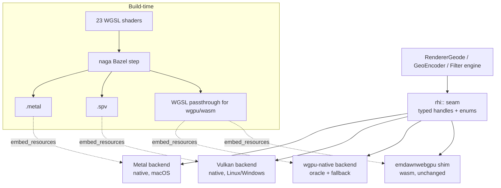

# Design: Donner Native GPU HAL (replacing wgpu-native)

**Status:** Draft
**Author:** Claude Opus 4.8
**Created:** 2026-07-05

## Summary

Donner's Geode GPU backend currently reaches the GPU through `wgpu-native` (the
Rust `wgpu` core with a C ABI; see [0017](0017-geode_renderer.md) for the
Dawn-to-wgpu-native swap, #510). For v1.0 (operator decision, superseding the
earlier "defer" recommendation) we replace `wgpu-native` with Donner's own thin
GPU hardware abstraction layer (HAL), talking Metal directly on macOS and Vulkan
directly on Linux and Windows. `wgpu-native` is demoted from the production path
to an in-tree **validation oracle** and transition fallback behind the same
interface, and the wasm path (emdawnwebgpu browser glue,
[0017](0017-geode_renderer.md)) is untouched.

Geode's usage of `wgpu` is narrow and stable: a scoping study measured roughly
**40 distinct API entry points across ~554 call-sites in 35 files** (24 in
`donner/svg/renderer/geode/`, ~10 in `donner/editor/`), driving **18 pipelines**
(5 render, 9 compute; the filter engine is compute-heavy) built from **23 WGSL
shaders (3,687 lines)** embedded at build time. Bind layouts are hand-written
(no runtime reflection), MSAA is retired in favor of analytic AA at
`sampleCount=1` ([0041](0041-geode_analytical_aa.md)), and none of timestamps,
indirect draw, or render bundles are used. The genuinely `wgpu-native`-specific
surface is tiny: **5 `wgpuDevicePoll` sites**, the synchronous adapter/device
request convenience, and `InstanceExtras`. Verified against the repo on
`v08/text-tool`: 5 `wgpuDevicePoll` sites, 24 geode files touching `wgpu`, 23
WGSL files / 3,687 lines.

That narrowness is why this is tractable. We are not re-implementing WebGPU; we
are re-implementing the ~40-entry-point slice of it Geode actually uses, plus the
one thing `wgpu` gives us for free that is hard to give up: **implicit
GPU synchronization** (barriers and image-layout transitions). Vulkan makes that
explicit and it is the load-bearing risk of the whole effort.

Scope boundary: this touches `donner/svg/renderer/geode/**` and the ~10 editor
embedding sites, plus a new Bazel toolchain step for offline shader translation.
It does not touch rendering algorithms (Slug, analytic AA), the filter math, or
any CPU backend.

## Goals

- **v1.0 ships Donner's own HAL as the production path** on macOS (Metal),
  Linux (Vulkan), and Windows (Vulkan). No `wgpu-native` in the shipped default
  build on those platforms.
- **`wgpu-native` demoted, not deleted (during transition):** it stays in-tree
  behind the same HAL interface as a build-time-selectable backend, used as a
  reference oracle for differential testing and as an escape-hatch fallback.
- **wasm path unchanged.** The browser build keeps emdawnwebgpu; the HAL's wasm
  backend is a thin shim over the same `RHI` seam that already exists there.
- **Improved native embeddability.** The embedder contract accepts native
  handles directly (`MTLDevice`, `VkDevice`/`VkInstance`) instead of forcing a
  WebGPU device on hosts that do not have one. This is a net win for embedding
  into Metal/Vulkan apps.
- **Every perf gate in [0030](0030-geode_performance.md) survives the swap**,
  and the analytic-AA output ([0041](0041-geode_analytical_aa.md)) stays
  bit-stable per backend within the existing golden tolerances.
- **Binary-size reduction.** `wgpu-native` is a 6.1 MB dylib on macOS / 8.5 MB
  on Linux, against 3.5 MB for the entire rest of `donner-svg`. Native backends
  are estimated at 0.3-0.5 MB each; the shipped binary drops the largest single
  dependency.

## Non-Goals

- **Not implementing WebGPU-the-spec.** No general-purpose WebGPU. We implement
  only the entry points Geode uses. If Geode later needs a new capability, the
  HAL grows by one method, deliberately.
- **No features Geode does not use:** no timestamp queries, no indirect draw, no
  render bundles, no MSAA resolve paths, no runtime bind-group reflection.
- **No runtime shader compilation.** WGSL is translated to MSL/SPIR-V
  **offline** at build time. There is no shipping WGSL compiler, no runtime
  `naga`/`tint`, and no runtime string-to-pipeline path.
- **Not rewriting the CPU backends, filter math, Slug pipeline, or AA.** Those
  are API-agnostic and stay byte-stable.
- **Not touching wasm's rendering path.** emdawnwebgpu stays.

## Next Steps

- Extract the **RHI seam** (typed handles/enums under `donner/svg/renderer/geode/rhi/`,
  lint-enforced no raw `wgpu::`/`WGPU*` outside it) with both `wgpu-native` and
  a Metal stub running behind it. This is the RHI seam packet already recommended
  and it is the prerequisite for everything else.
- Stand up the **naga Bazel toolchain step** (WGSL to MSL + SPIR-V) wired
  through the existing `embed_resources` flow, gated by a golden that diffs the
  translated artifacts.
- Pick the HAL name (see [Naming](#naming)); this doc uses **Bedrock** as the
  placeholder throughout.

## Implementation Plan

- [ ] **Milestone A: RHI seam extraction** (both backends behind one interface)
  - [ ] Define typed handles/enums (`rhi::Buffer`, `rhi::Texture`,
        `rhi::RenderPipeline`, `rhi::ComputePipeline`, `rhi::BindGroup`,
        `rhi::CommandEncoder`, `rhi::Queue`, formats/usages/load-store enums) in
        `donner/svg/renderer/geode/rhi/`.
  - [ ] Port the ~40 wgpu entry points Geode uses to `rhi::` calls; make
        `wgpu-native` the first backend implementing `rhi::`.
  - [ ] Add a lint/CI check: no raw `wgpu`/`WGPU`/`webgpu` identifiers outside
        `geode/rhi/` and the wasm shim (mirror the [0016](0016-ci_escape_prevention.md)
        escape-check pattern).
  - [ ] Move the embedder contract (native-handle interop) into `rhi::`; stop
        exposing `wgpu` types from `GeodeEmbedConfig`/`setTargetTexture`.
  - [ ] Green: full resvg `*_geode` suite passes with zero source outside
        `geode/rhi/` naming `wgpu`.
- [ ] **Milestone B: Offline shader toolchain** (naga as a Bazel step)
  - [ ] Add a `naga`(or `tint`) build-time rule: `.wgsl` to `.metal` + `.spv`,
        emitted through `embed_resources` as per-platform artifacts.
  - [ ] Encode the binding-index remapping table naga produces (MSL rebinds
        group/binding to flat Metal buffer/texture indices) as data the HAL
        reads, not hard-coded numbers.
  - [ ] Add a WGSL-dialect lint restricting shaders to the translate-clean
        subset.
  - [ ] Golden: translated MSL/SPIR-V artifacts diffed in CI so shader changes
        surface their translated form.
- [ ] **Milestone C: Metal backend** (smallest risk, primary dev platform)
  - [ ] Implement `rhi::` on Metal (`MTLDevice`/`MTLCommandQueue`/
        `MTLRenderPipelineState`/`MTLComputePipelineState`, argument tables from
        the bind-layout data).
  - [ ] Wire the 5 render + 9 compute pipelines; map the `wgpuDevicePoll` sites
        to Metal completion handlers.
  - [ ] Per-backend Metal goldens; differential test against the `wgpu-native`
        oracle (see [Validation](#validation-strategy-the-load-bearing-section)).
  - [ ] Green: resvg suite + Donner goldens + [0043](0043-deterministic_replay_testing.md)
        replay pass on Metal; [0030](0030-geode_performance.md) budgets hold.
- [ ] **Milestone D: Vulkan backend** (explicit sync design REQUIRED)
  - [ ] Implement `rhi::` on Vulkan; propose and implement the barrier /
        image-layout tracking model (see
        [Explicit synchronization](#explicit-synchronization-the-hard-part)).
  - [ ] Cover Geode's actual patterns: render passes, the filter engine's
        compute chains, and cross-frame texture-pool reuse
        ([0030](0030-geode_performance.md) pooling).
  - [ ] Validation-layer-clean under Vulkan validation + differential test vs.
        the oracle; driver-matrix run (Intel/Mesa, AMD, NVIDIA, llvmpipe).
  - [ ] Green on Linux and Windows.
- [ ] **Milestone E: Cutover + wgpu removal**
  - [ ] Flip the default backend to native on all three platforms; keep
        `wgpu-native` selectable behind a build flag.
  - [ ] Meet the numeric [cutover gates](#cutover-gates-numeric).
  - [ ] After a soak period, remove the `wgpu-native` dependency from the
        default build (keep the oracle path buildable for CI differential runs
        as long as it earns its keep).

## Proposed Architecture

### The RHI seam

Today Geode calls `wgpu` directly across 35 files. The seam replaces that with a
narrow, typed C++ interface under `donner/svg/renderer/geode/rhi/`. Everything
above the seam (encoders, the Slug pipeline, the filter engine, `RendererGeode`)
speaks only `rhi::` types; everything below is a backend.

The seam is intentionally not WebGPU. It exposes exactly Geode's vocabulary:
create buffer/texture, write buffer, create render/compute pipeline from an
embedded per-platform shader artifact + a bind-layout descriptor, begin a render
pass, dispatch compute, submit, and poll-for-completion. Hand-written bind
layouts (already the status quo, no reflection) become explicit `rhi::`
descriptors, which is exactly what the Metal argument tables and Vulkan
descriptor-set layouts need anyway.

### Backends

- **Metal (macOS, primary dev platform, lowest risk):** implicit-ish sync (Metal
  tracks most hazards automatically for the resource-heap model Geode uses), so
  this backend is close to a direct translation of the `rhi::` calls. Built
  first to shake out the seam.
- **Vulkan (Linux + Windows):** explicit everything. This is where the design
  work is (below). Windows rides Vulkan rather than adding a D3D12 backend, to
  keep the native-backend count at two.
- **wgpu-native (oracle + fallback):** the current implementation, kept behind
  the seam. Selectable via build flag; the differential-test reference.
- **emdawnwebgpu (wasm):** unchanged; a thin shim maps `rhi::` to the WebGPU the
  browser already provides.

### The embedder contract

`GeodeEmbedConfig`/`setTargetTexture` currently leak `wgpu` types into Donner's
public embedding API. The HAL redefines the contract around **native handles**:
an embedder hands Donner an existing `MTLDevice` (or `VkInstance`+`VkDevice`+
queue family) and a target texture/drawable in native terms. This removes the
"you must own a WebGPU device" requirement, which **improves** embeddability for
Metal- and Vulkan-native hosts (the common case for the editor and for third-party
integrators). The `wgpu` embedding shape remains available through the oracle
backend for hosts that genuinely have a WebGPU device.

## Shader Strategy

Single-source WGSL stays the authoring format (the 23 files / 3,687 lines are
unchanged as source). Translation moves **offline**, into a Bazel toolchain step:

- **naga** (Rust; the `wgpu` project's own front/back-end, already transitively
  in-tree) or **tint** (the Dawn compiler) translates each `.wgsl` to `.metal`
  (MSL) and `.spv` (SPIR-V) at build time. naga is the default choice because it
  matches the WGSL dialect the shaders already target under `wgpu-native` and is
  the lighter Bazel dependency; tint is the fallback if naga's MSL/SPIR-V output
  proves inadequate for a specific shader.
- Translated artifacts flow through the **existing `embed_resources`** mechanism
  as per-platform embedded blobs, exactly as the WGSL is embedded today. The
  Metal build embeds `.metal` (or precompiled `.metallib`), the Vulkan build
  embeds `.spv`, and the wgpu/wasm builds keep embedding WGSL.

Documented gotchas (these bite at build-integration time, not runtime):

- **naga MSL binding-index remapping.** MSL has no `(group, binding)` tuples;
  naga flattens them to per-stage buffer/texture/sampler indices and may reorder.
  The HAL must consume naga's emitted remapping table as data (embedded
  alongside the artifact), not assume WGSL binding numbers survive. Hard-coding
  Metal indices is the classic way to get silently-wrong bindings.
- **WGSL dialect subset discipline.** naga and tint do not accept identical WGSL
  supersets. Shaders must stay inside the intersection that both the runtime
  (`wgpu-native`/emdawnwebgpu) and the offline translator accept. A lint enforces
  the subset so a shader edit cannot pass the wgpu path while breaking
  translation.
- **Compute layout.** The 9 compute pipelines (filter engine) carry workgroup
  sizes and storage-texture access modes that must round-trip; these are the
  shaders most likely to expose translator differences and get first attention.

## Validation Strategy (the load-bearing section)

This is what makes the swap safe. `wgpu-native` stays in-tree during the entire
transition as a **reference oracle**, and every native backend is validated
against it before it can carry production traffic.

**Differential testing against the oracle.** The resvg suite, the Donner
goldens, and the coming donner-test-suite all run against **both** the
`wgpu-native` path and each native path, with **per-backend goldens** (the
established Geode pattern from [0041](0041-geode_analytical_aa.md)/
[0038](0038-geode_tinyskia_text_parity.md): analytic output is not forced to
bit-match a different sampler, but each backend gates against its own committed
golden). A native backend that diverges from the oracle beyond its committed
golden tolerance fails CI.

**GPU counter parity.** `GeodeCounters` ([0030](0030-geode_performance.md))
readings (draw counts, encode passes, target-pool hits, submit counts) must match
between oracle and native backends for the same scene. A counter mismatch means
the backend is doing structurally different work and is investigated before any
pixel comparison is trusted.

**Deterministic replay.** The [0043](0043-deterministic_replay_testing.md)
replay tests run on each backend, catching ordering/synchronization bugs that
single-frame goldens miss, especially on Vulkan.

**Fuzzing the HAL surface.** The `rhi::` API is fuzzed (sequence of
create/write/encode/submit calls with bounded random parameters) under the
[0012](0012-continuous_fuzzing.md) harness and under each platform's validation
layer (Metal API validation, Vulkan validation layers), so malformed usage trips
loudly rather than corrupting silently.

### Cutover gates (numeric)

A native backend replaces `wgpu-native` as the default on its platform only when
**all** hold:

- **Zero golden regressions:** resvg `*_geode` suite + Donner goldens +
  donner-test-suite fully green against the per-backend goldens.
- **Counter parity:** `GeodeCounters` identical to the oracle on the full suite
  (exact match; counters are integers).
- **Perf within budget:** every [0030](0030-geode_performance.md) budget
  assertion passes, and the native backend is within **5%** of the `wgpu-native`
  path on the perf harness (frame time and the drag-overhead budgets from
  [0025](0025-composited_rendering.md)); a native backend that is faster is fine.
- **Validation-layer-clean:** zero Metal-API-validation / Vulkan-validation
  errors across the full suite and the replay tests.
- **Fuzz soak:** the HAL fuzzer runs the standard [0012](0012-continuous_fuzzing.md)
  soak with no crashes/leaks under validation layers.

`wgpu-native` is removed from the default build only after all three platforms
pass and a soak period elapses; the oracle path stays buildable for CI
differential runs as long as it pays for itself.

## Sizing Honestly

Estimates are per-stage **agent-executable packets with acceptance criteria**
(the repo's operating model; the RHI seam is the already-recommended first
packet). These are effort/size estimates, not a schedule.

| Stage | Packet | Acceptance criteria |
| ----- | ------ | ------------------- |
| A | RHI seam extraction | Suite green through the seam; lint forbids `wgpu` outside `geode/rhi/`; embedder contract off `wgpu` types. |
| B | naga Bazel toolchain | `.wgsl` to `.metal`+`.spv` in-build; binding-remap table embedded; artifact golden in CI. |
| C | Metal backend | Suite + replay green on Metal per-backend goldens; counter parity; [0030](0030-geode_performance.md) budgets; validation-clean. |
| D | Vulkan backend (+ sync model) | Same gates on Linux+Windows; validation-layer-clean; driver-matrix green. |
| E | Cutover + removal | Numeric [cutover gates](#cutover-gates-numeric) met all platforms; default flipped; dependency removed post-soak. |

**The two genuinely hard problems** (called out so nobody underestimates them):

1. **Vulkan explicit synchronization.** See below. This is the single largest
   piece of net-new engineering and the highest-risk correctness surface.
2. **Driver quirks.** `wgpu` currently absorbs a long tail of per-driver
   workarounds we do not see. Owning Vulkan means owning that tail: the Intel
   Arc / Mesa class of problem ([0041](0041-geode_analytical_aa.md) history: the
   Intel-Arc adapter previously needed a distinct AA fallback path) is exactly
   the category of pain being signed up for. Expect per-vendor conformance
   deltas that only appear on real hardware in the driver matrix, not in CI's
   software rasterizer.

**Maintenance commitment.** After v1.0, Donner owns cross-API correctness, the
Vulkan sync model, and driver-quirk triage in perpetuity. This is the standing
cost that the earlier "defer" recommendation weighed against; the operator
decision to proceed accepts it in exchange for the binary-size win, the improved
native embeddability, and removing the largest external dependency. The oracle
path is a hedge, not a permanent second implementation to keep at feature parity.

### Explicit synchronization (the hard part)

`wgpu` inserts barriers and image-layout transitions implicitly. Vulkan does not.
The HAL must track resource state and emit `vkCmdPipelineBarrier` /
image-layout transitions for **Geode's actual usage patterns**, which are narrow
and known:

- **Render passes:** color-attachment writes followed by reads as a sampled
  texture (the layer/mask/filter intermediates). A render-target-to-sampled
  transition per hand-off.
- **Compute chains (filter engine, the compute-heavy 9 pipelines):** storage-
  texture write in one dispatch read in the next. This is where most barriers
  live; the chains are linear per-filter and knowable from the encode graph, so
  the tracker can be pattern-driven rather than a fully general hazard tracker.
- **Texture-pool reuse ([0030](0030-geode_performance.md)):** a pooled texture
  re-issued at the same size across frames needs its layout reset/tracked; stale
  layout assumptions here are a classic source of validation errors.

Proposed model: a **per-resource state record** (current layout + last-writer
stage/access) carried on the `rhi::Texture`/`rhi::Buffer` handle, with the
encoder inserting the minimal barrier at each pass/dispatch boundary from that
record. Because Geode's graph is small and mostly linear, we prefer a
conservative-but-correct barrier at each hand-off first (validation-clean by
construction), then tighten only where the perf harness shows a real cost. Metal
gets a near-trivial implementation of the same interface (it tracks most of this
itself), which is why Metal ships first and de-risks the seam before the Vulkan
sync work begins.

## Naming

The HAL layer needs a name consistent with Geode's mineral/geology theme. This
doc uses **Bedrock** as the placeholder throughout. Candidates:

- **Bedrock** (placeholder): the solid rock foundation beneath the surface;
  reads naturally as "the layer Geode is built on."
- **Lattice**: a crystal lattice; connotes the structured, regular grid of GPU
  resources the layer manages.
- **Facet**: a cut face of a crystal/gem; connotes a thin surface presenting the
  GPU to Geode.

The C++ namespace/directory stays `donner::svg::renderer::geode::rhi`
(`donner/svg/renderer/geode/rhi/`) regardless of the chosen brand name; the name
is for docs and the public embedder API.

## Relationship to Other Designs

- **[0017](0017-geode_renderer.md) (backend history):** documents the
  Dawn to `wgpu-native` swap (#510). This doc is the next swap in that lineage:
  `wgpu-native` to native HAL. 0017's Phase 5 GPU-resource caching and the wasm
  emdawnwebgpu path are preserved.
- **[0030](0030-geode_performance.md) (perf gates):** every budget assertion and
  the `GeodeCounters` infrastructure must survive the swap; counters double as a
  differential-test signal here. The texture-pool reuse is a first-class input to
  the Vulkan sync model.
- **[0041](0041-geode_analytical_aa.md) (analytic AA):** AA is API-agnostic
  math; it moves across the swap unchanged, gating per-backend as it already
  does. 0041's Intel-Arc history is the reference class for the driver-quirk risk.
- **Binary-size targets:** removing the 6.1 MB (macOS) / 8.5 MB (Linux)
  `wgpu-native` dylib against a 3.5 MB rest-of-`donner-svg` is the headline size
  win; native backends are estimated 0.3-0.5 MB each.
- **The RHI seam packet already recommended:** Milestone A **is** that packet,
  promoted here to the foundation of the v1.0 HAL rather than a standalone
  cleanup.

## Security / Privacy

Geode processes untrusted SVG, but the GPU inputs the HAL sees are Donner-
generated geometry and pipeline state, not raw SVG. The new external surface is:
(1) the **embedder contract** now accepting native device/texture handles, which
requires validating that a host-provided handle matches the expected type and
capabilities before use (a bad handle must fail closed, not crash); and (2) the
**offline shader toolchain**, which runs at build time on trusted in-repo WGSL
(no untrusted shader input at runtime, consistent with the no-runtime-compilation
non-goal). The HAL surface is fuzzed under validation layers
([0012](0012-continuous_fuzzing.md)) so malformed call sequences trip loudly.

## Testing and Validation

Covered in depth in
[Validation Strategy](#validation-strategy-the-load-bearing-section): differential
testing against the `wgpu-native` oracle with per-backend goldens, `GeodeCounters`
parity, [0043](0043-deterministic_replay_testing.md) deterministic replay, and
HAL-surface fuzzing under each platform's validation layer. Cutover is gated on
the numeric criteria in [Cutover gates](#cutover-gates-numeric).

## Open Questions

- **naga vs. tint** as the offline translator: default naga (dialect match,
  lighter Bazel dep), but does any of the 9 compute shaders need tint's MSL/SPIR-V
  output? Resolve empirically in Milestone B.
- **How long does the oracle live post-cutover?** Keep `wgpu-native` buildable
  for CI differential runs indefinitely, or set a sunset once the driver matrix
  is trusted? Trades CI cost/complexity against a permanent correctness hedge.
- **Windows on Vulkan vs. a future D3D12 backend:** v1.0 ships Windows on Vulkan
  to keep the backend count at two. Is a D3D12 backend ever in scope, or is
  Vulkan-on-Windows the permanent answer?
- **Metal shader form:** embed `.metal` source and compile at device-init, or
  precompile `.metallib` at build time? Trades startup cost against build
  complexity and Metal-version pinning.
- **Driver matrix scope for the cutover gate:** which exact GPU/driver
  combinations are release-blocking vs. best-effort? (Intel/Mesa, AMD, NVIDIA,
  llvmpipe at minimum; Apple Silicon generations for Metal.)
