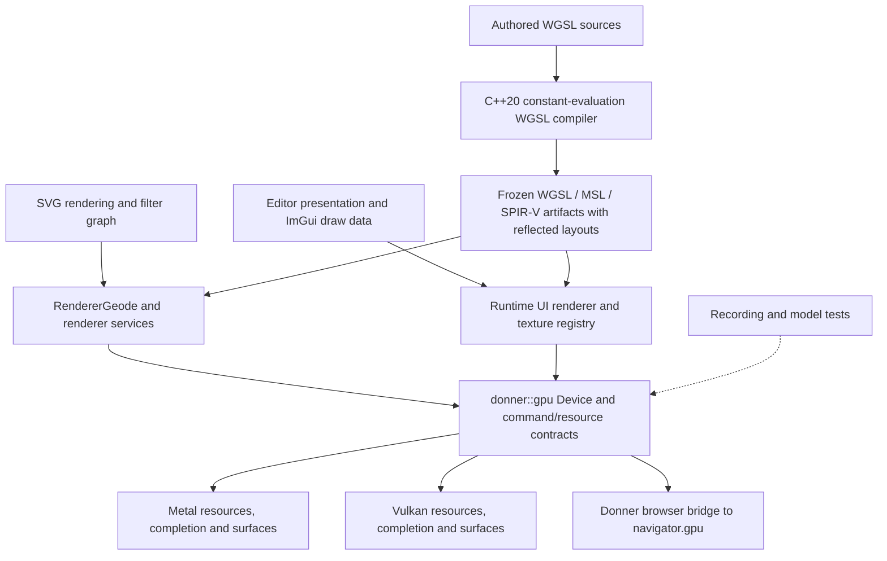

# Design: Donner Native GPU Runtime and Rust-Independent Build

**Status:** Implementing. Metal renderer/editor parity and Vulkan Geode/renderer parity are
qualified. The served and shipped editor and standalone Geode Wasm packages use the browser runtime
without linking the C WebGPU wrapper. Unconstrained macOS Geode/editor roots default to native Metal.
Linux editor presentation, the Linux native default, physical-browser qualification, and native
production dependency closure remain.
Cross-device registration works on Metal, the browser, the transitional adapter and Vulkan-owned
images; Vulkan acquired frames refuse export. The end state retains one Linux test-only wgpu-native resvg
comparison backend.\
**Created:** 2026-07-05\
**Updated:** 2026-09-25\
**Author:** Claude Fable 5.1\
**Drafted by:** GPT-5.6 Sol

## Summary

Donner's GPU runtime is the interface between Geode/editor rendering and Metal, Vulkan, or browser
WebGPU. The remaining work is to make production callers use that interface end to end, supply the
missing draw, mapping, upload, and presentation operations, and remove the transitional WebGPU
implementation from production dependency closures.
A pinned Linux test-only wgpu-native backend remains as a black-box resvg pixel comparison oracle;
it does not validate Donner's browser bridge.

`donner::gpu` provides the foundation for resource validation, command recording, submission,
backend execution, and compile-time shader artifacts: every production shader is authored as WGSL
and compiled during C++ constant evaluation into the WGSL, MSL, or SPIR-V projection its consumer
links, with the host interface reflected from the same compile
([WGSL shader compilation](../wgsl_compiler.md)). Native transitional `GeodeDevice` and editor
presentation paths still depend on concrete WebGPU objects. Native shader execution tests
therefore establish individual capabilities; they do not establish a complete
native editor or a Rust-independent build.

The target is an original C++20 runtime serving Donner's own rendering requirements. It is not a
WebGPU C ABI implementation, and its shader compiler accepts a documented WGSL profile at build time
rather than arbitrary shader text at runtime.

## Current State

The runtime validates resource origins and handle lifetimes, supports native buffer mapping and
surface presentation, and selects backend-owned devices over shared physical roots. Filter
commands, texture uploads, checkerboard targets, UI textures and compositor diagnostics use
validated runtime handles. Production shader constructors select WGSL, MSL or SPIR-V projections
from the same reflected program interfaces.

All 27 shipped WGSL artifact families are checked against the production target census, reparsed
and compared with their frozen host interfaces by the C++ validator, and compiled from their exact
emitted bytes by pinned Chromium WebGPU. Invalid WGSL, resource and entry-point mismatches fail the
named shader tests; a test-only rounding kernel still runs on the browser GPU against CPU values.
These shader gates do not replace browser editor pixels or physical-device qualification, and they
do not prove the remaining production dependency closure is free of Rust-built archives.

Metal renderer and editor parity and Vulkan renderer parity are qualified. macOS Geode and editor
roots default to native Metal while explicit WebGPU requests remain available. The served and
shipped editor and default standalone Geode WebAssembly packages select the browser runtime; their
configured dependency closures and link actions exclude the C WebGPU wrapper. Linux editor
presentation, its native default, physical-browser qualification, and removal of Rust-built GPU
archives remain. The implementation checklist identifies those open boundaries; git history carries
the delivery chronology.

### Native parity

The native backends replace the transitional adapter one platform at a time. The adapter remains
the production path on a platform until that platform's Geode, renderer and editor suites pass on
the native backend, and a separate change then flips that platform's default. Until then:

- `DONNER_GPU_BACKEND` (`wgpu`, `metal` or `vulkan`) sets the backend for every selection that
  does not name one, so a whole suite runs end to end on a backend that is not yet the default. A
  value that names no backend, or a requested backend the host cannot provide, halts instead of
  falling back, and a process that asks for a backend logs the one it selected, so a run shows
  which backend executed.
- A native Metal root reports the device's own limits and drains its queue with a bounded wait for
  the last submitted serial, and a Metal device reports failed work as the loss of the root it
  shares. Contexts hold the runtime device and count what it accepts and releases through its
  observer; the adapter accessor resolves only on the adapter.
- On Linux, a native Vulkan root reports its physical device's own limits without opening a
  second device for the query. Runtime devices over one selected root share its instance, logical
  device, graphics queue and loss condition, while each keeps its own handles and serials. Owned
  images can be registered on a sibling device, and capture-context snapshot readback returns
  their pixels, as checked by `//donner/gpu/vulkan/tests:vulkan_texture_registration_tests` and
  `//donner/svg/renderer/geode:geode_snapshot_readback_vulkan_tests`. An acquired swapchain frame still
  refuses export because the swapchain can recycle its borrowed image at presentation, as checked
  by `//donner/gpu/vulkan/tests:vulkan_surface_tests`
  ([#1407](https://github.com/jwmcglynn/donner/issues/1407)).
- The Geode, renderer and GPU-shader fixtures run on whichever backend the process selects. Cases
  whose subject is the adapter, or wgpu objects an embedder hands over, select the adapter by
  name, run under any override, and log why when the process default is another backend. The
  texture-cache cases install the editor's UI renderer on the selected device; only
  `GlTextureCacheTest.RetiredSnapshotsAgeByPresentationFrame` skips on a native backend, because
  it reads the adapter's wgpu backing-destroy counter. A snapshot that was not read back fails
  the shared Geode and renderer test helpers that read, count or compare its pixels, instead of
  reading as transparent, blank or identical.
- The editor window opens on the selected device. On Apple its Metal layer is attached before
  selection and constrains none, the surface settles BGRA8Unorm without an adapter, and the
  surface, UI renderer and UI texture registry take the runtime device. The frame clear and the
  framebuffer readback record through the runtime on every tier. The selected browser editor's
  asynchronous diagnostic copies and maps through `gpu::Device` on a later browser task; the
  transitional editor path retains its adapter-specific callback code.

On Metal, snapshot capture and cross-context snapshot drawing register their source across
runtime devices (see [Cross-device texture registration](#cross-device-texture-registration)).
Every Geode target and `renderer_geode_tests` now pass with `DONNER_GPU_BACKEND=metal`, and so do
the Geode editor integration targets listed under [Testing and Validation](#testing-and-validation)
and `editor_shell_tests`, under Metal API and shader validation. So do the renderer's other suites
with a Geode variant, among them the regression, public API, golden, text path and resvg suites:
the same cases pass and skip, with the same logged reasons, as on the transitional adapter, and
each image comparison differs from its reference by the same pixel count on both. Native Vulkan
passes the Geode and renderer parity suites on lavapipe and a discrete GPU. The browser editor
presents through the runtime when Browser is selected, and the served and shipped editor packages
select it. Hosted and physical-browser qualification remain required. A native wgpu reference is
not browser-backend evidence.

The shared fill, gradient, mask, image, snapshot, checkerboard, texture-cache, and compositor-debug
paths now use their reviewed runtime resource boundaries. Linux editor presentation and native
adapter consumers still need their production cutovers; the browser editor canvas and
diagnostic readback already use the selected runtime.

Strict Wasm-size qualification is deferred until production Rust removal. The browser-selected
WebAssembly packages now exclude emdawnwebgpu's C++ WebGPU C API implementation, its JavaScript
glue, and the transitional adapter from their configured dependencies and link actions.
The Rust-built libraries are native-only, so removing them does not change the WebAssembly
payload. The browser backend brings code and a
JavaScript bridge of its own, so the cutover alone is not expected to return the package to its
strict ceilings. Intermediate package growth does not block these migration units. Keep the
measurements and existing budgets for final acceptance; this deferral does not relax functional,
lifetime, synchronization, memory-residency, security or privacy requirements.

## Goals

- Run native Geode/editor rendering through Metal on macOS and Vulkan on Linux.
- Preserve browser rendering through a Donner-owned bridge to the browser's WebGPU service.
- Give renderer targets, snapshots, uploads, readback, and UI textures one runtime ownership model.
- Preserve pixels, frame ordering, alpha interpretation, bounded resource use, and editor behavior.
- Remove transitional adapters, raw WebGPU API dependencies, and Rust-built native GPU libraries
  from production source, builds, and shipped artifacts.
- Retain only a pinned Linux test-only wgpu-native reference for resvg GeodeGolden pixelmatch
  comparisons; use the same case IDs and reviewed golden/pixelmatch parameters as native Vulkan
  and Metal, allowing only documented per-driver numeric overrides. Do not add a macOS wgpu lane
  or repeat the TinyGolden half.
- Complete the remaining GPU audit acceptance on the exact integrated implementation.

## Non-Goals

- Implementing the WebGPU standard, its C ABI, or arbitrary runtime WGSL parsing.
- Treating native wgpu-native comparison results as proof that Donner's browser `navigator.gpu`
  bridge or complete production editor presentation works.
- Supporting user-supplied shaders or a public command-stream deserializer.
- Replacing SVG traversal, Slug coverage, or the compositor with a second rendering engine.
- Adding Windows or a native iOS host to this cutover; physical browser iOS qualification remains
  part of the browser presentation matrix.
- Expanding this plan into unrelated editor features or a project-wide release/audit backlog.
- Deleting the isolated tiny-skia Rust cross-validation fixture or inert upstream reference source.
  Their containment requirements are described below.

## Next Steps

1. Complete Linux Vulkan editor presentation and surface recovery. Metal renderer/editor and
   Vulkan Geode/renderer parity have passed; the Linux native default remains a separate cutover.
2. Move counters and the remaining shared renderer services behind backend-neutral ownership
   without merging logical tables, serials, caches, or retirement.
3. Remove remaining transitional snapshot/readback registrations and raw presentation-target
   binding, then select native Vulkan for the Linux production editor. The browser editor uses
   the selected runtime; hosted and physical-browser qualification remain.
4. Remove the transitional WebGPU implementation and Rust-built GPU dependencies from
   production while retaining only the Linux test-only resvg comparison backend. Enforce
   configured dependency closure in CI, then complete integrated native/browser pixels,
   physical-browser, memory, performance and artifact-size acceptance.

## Implementation Plan

Checked items identify integrated capabilities; unchecked items still require implementation or
qualification. A backend-only test does not close a production migration item. Keep regression
commits and their fixes together in a focused reviewable change.

### Native drawing

- [x] Metal supports all eight vertex-buffer slots, instancing and buffer/offset updates while
      retaining 29 shader-buffer bindings and refusing binding collisions.
      [PR #1139](https://github.com/jwmcglynn/donner/pull/1139) is merged; the native vertex-layout
      targets below cover these contracts.
- [x] `setIndexBuffer` and `drawIndexed` are part of the shared command contract and platform
      backends, with index formats, byte bounds, first-index/base-vertex semantics, resource
      retirement, empty-binding validation and texture-copy-to-index synchronization covered by the
      encoder contract tests and the Vulkan execution suite.
      [PR #1154](https://github.com/jwmcglynn/donner/pull/1154) is merged. Metal and browser
      execution of indexed geometry join the UI-rendering work below.

### Compiled shaders and production selection

- [x] Every production shader family is authored as WGSL under `donner/gpu/shader/programs/` and
      compiled during constant evaluation into frozen artifacts with a reflected host interface:
      blur, convolution, Slug mask/fill/gradients, offset, filter resolve, diffuse and specular
      lighting, turbulence, image blit, feBlend, feFlood, feMerge, feComposite, feColorMatrix, feMorphology, feComponentTransfer,
      feDisplacementMap, feDropShadow, feImage, feTile, subregion clipping, color-space conversion,
      snapshot unpremultiply and the transparency checkerboard. The filter engine, checkerboard
      pipeline and snapshot readback derive bindings, entry points and workgroup shapes from
      reflection, and the build-time emitter tool, generated descriptor headers and IR builders are
      removed. The typed IR remains only as an emitter and native-execution test fixture.
      Each production family uses its frozen artifact; typed test programs do not provide a
      second production selection path.
- [x] Descriptor construction can select the projection for the chosen backend:
      `MakeShaderDescriptor(view, device.shaderSourceKind(), label)` supplies WGSL text, MSL text or
      SPIR-V words, and a device refuses a descriptor whose projection is absent from the linked
      artifact instead of compiling nothing. The filter engine, the shared render pipeline and the
      checkerboard pipeline pass the device's kind, and so do the Slug fill, gradient, mask and
      image-blit module constructors in `GeodeShaders.cc`. The filter engine and shared render
      pipeline select the matching artifact view as well as passing the device kind.
- [x] The native artifact library (`<family>_native_artifact`, MSL on Apple platforms and SPIR-V
      on Linux) is linked into the Geode libraries for every production family, and every site
      that builds a shader module selects the projection its device consumes. Integrated
      in [PR #1279](https://github.com/jwmcglynn/donner/pull/1279): platform selection covers the
      Geode device, module constructors, geometry encoder, filter engine and shared render
      pipeline, while WebAssembly links WGSL-only artifacts.
      `//donner/gpu/shader/artifact_tests:geode_linkage_isolation_tests` proves the linked native
      projection is present and the other platform projection is absent;
      `//donner/svg/renderer/geode:geode_shader_projection_tests` covers per-device selection and
      refusal of unavailable projections. The linkage capability is complete; end-to-end native
      production pixel acceptance remains the separate item below.
- [ ] Qualify each family through the selected native backend with strict pixel acceptance:
      resvg filter cases, chained filters, fractional alpha, nonzero subregions, refusal paths and
      DPR2. The native Metal and Vulkan execution suites establish per-shader correctness today; they
      do not close this item on their own. Native artifact linkage and projection selection are
      merged; this item remains open until production device ownership and its callers use the
      selected native backend and pass the integrated pixel matrix.
- [ ] Shader profile additions follow the compiler's rules: a construct the v1 profile rejects is
      added to the compiler with tests across all three projections rather than worked around, and
      the UI renderer's shaders are authored as WGSL sources under the same contract.

### Snapshot and target identity

- [x] Owning snapshots retain their runtime texture identity for same-context drawing; adoption
      checks device identity, backing ownership, format and bounds before consuming the handle.
      Detached and frame-borrowed lifetime, producer teardown and retirement contracts are covered
      by the renderer snapshot tests.
      [PR #1141](https://github.com/jwmcglynn/donner/pull/1141) is merged.
- [x] Register a texture of one runtime device on another through the runtime contract instead of
      a transitional adapter operation. The contract is below. Metal, the browser backend and the
      transitional adapter implement it; Vulkan refuses it by name until its runtime devices can
      share a native device. Snapshot capture, cross-context snapshot drawing and UI snapshot
      registration all register the export a snapshot takes on its producer's thread at adoption,
      so no consumer reads the producer's tables, and the adapter's cross-device import is gone.
      Host-supplied render targets reach the renderer as runtime textures of its own device, and
      the adapter's external-texture import is left only to the baseline counter-capture tool.
- [ ] Replace raw target binding in `RendererGeode` and `EditorShellPresentation` with validated
      runtime textures or acquired surface textures, retaining embedder ownership where applicable.

#### Cross-device texture registration

Geode reads snapshots back on a capture context: a second runtime device over the same backend
device, so a capture cannot disturb the producer's handle table, submission serials or per-frame
limits. The editor also draws and registers textures one runtime device produced on another. A
texture of one runtime device is not a texture of another until it is registered there, and the
two devices may be driven from different threads and may submit to different native queues.

The operation spans both threads, so it has a producer half and a consumer half:

- `Device::exportTexture(texture)` runs on the producer's thread. It resolves the handle against
  the producer's own table and returns a `TextureExport`: an immutable, copyable token carrying the
  producer's descriptor, the identity of the backend device the memory belongs to, a reference to
  the allocation, and a thread-safe view of the producer's completion. It never blocks, never
  submits and allocates nothing a counter sees.
- `Device::registerTexture(export)` runs on the consumer's thread and reads only the token. It
  never touches the producer device, which is what keeps each device single-threaded.
- `Device::waitForTextureSource(registration, timeoutSeconds)` is the consumer's bounded host
  wait until work naming the registration may be submitted.

Identity:

- Export resolves the handle like every other operation: a null or stale handle fails with
  `InvalidHandle` and another device's handle with `DeviceMismatch`. A texture that is itself a
  registration cannot be exported.
- A frame a surface has out goes back to the surface at present. It is exported only where readers
  submit to the producer's own queue (the transitional adapter), so reads recorded before the
  present run before it; that is what lets a renderer capture a surface target it drew. Where a
  reader has its own queue (Metal), its read could land after the present, so the frame is refused.
  The runtime releases a frame's export when the surface takes the frame back, so the slot's next
  frame never exports as the previous one.
- Registration is refused for another backend, another native device (Metal additionally requires
  the texture's `MTLDevice` to be the consumer's own), the consumer's own export, and a texture
  whose producer has released its handle since the export.
- A registration occupies a fresh slot and generation of the consumer; stale registrations fail
  closed like any stale handle.

Lifetime:

- The token and every registration hold a reference to the native allocation, so a registration
  cannot outlive its backing, and the last reference can be released on any thread after either
  device is gone.
- A registration never owns backing: `ownsTextureBacking` is false and releasing its backing
  frees nothing. Its reference is dropped when the consumer recycles the slot, after the
  consumer's last submission naming it has completed.
- On the producer, `destroyTextureBacking` releases the allocation at once only while no token or
  registration is outstanding. Otherwise the release is recorded and runs when the last holder
  lets go, because a consumer's in-flight read must never see freed memory.
- A capture that ends before its readback completes (cancelled, past its deadline, or failed)
  still holds its source until that readback is recycled. The capture context is polled when each
  capture ends and whenever its owner releases textures, so the owner's release finds no stale
  holder once the GPU is done.
- That tail is still resident but no longer anyone's allocation, so the producer reports it:
  `Device::sharedTextureTailBytes` counts the bytes of its released textures that a token or
  registration still holds, and Geode surfaces it as `sharedTextureTailBytes` in the readback
  statistics, which working-set measurements add to allocation accounting. The producer's
  `DeviceObserver::onTextureReleased` fires once, on the producer's thread, when its own
  ownership ends, whether the backend frees the allocation then or a holder keeps it alive; the
  holder's final release reports nothing.
- Registrations are read-only: their usage is the producer's intersected with sampled and copy
  source.

Ordering:

- Consumer work that names a registration runs after the producer work that registration covers:
  every producer submission accepted before the registration that referenced the texture, and the
  producer's queue writes those submissions carried. The runtime keeps that serial current after
  export, so a texture adopted before it is written is still covered. A registration is refused
  while a producer write to the texture is queued and not yet carried by a submission; the
  runtime does not submit on the producer's behalf.
- Where the producer and consumer feed one native queue (the transitional adapter), submission
  order is sufficient and nothing waits.
- Where they do not (Metal gives each runtime device its own command queue, and submission order
  on one queue says nothing about another), the consumer's backend orders the work on the device
  (`SourceOrdering::WaitOnDevice`). Each Metal device signals a shared event with its completed
  serial from its completion path, failed work included, and a consumer submission that names a
  registration whose producer work has not completed begins its first command buffer with a GPU
  wait on that producer's event, one per producer at the latest serial it needs. `submit` accepts
  such work at once, and `waitForTextureSource` returns at once. The property relied on is that a
  completed command buffer's writes are visible to command buffers that run afterwards on another
  queue of the same device; the Metal ordering test below checks it on hardware.
- The device orders the work only when the producer shares the consumer's loss condition, as
  contexts over one selected root do. The producer's event is signalled for failed work too, and
  past every value when the producer's root is declared lost, so the GPU wait ends however the
  producer's work ends. A shared condition carries that failure or loss to the consumer, whose
  read of the result is then never trusted. A consumer over another condition would never learn
  of it and would show whatever the failed work left behind, so it is treated like a backend that
  cannot wait on the device: `submit` refuses the work until the producer's work has completed,
  and refuses it as lost once that work failed.
- A device-side wait covers only producer work already handed to the producer's queue. A wait on
  work still being recorded could hold the consumer's queue for a host thread that is itself
  waiting for the consumer, so `submit` refuses work naming a registration whose covered serial
  the producer has not committed, and `waitForTextureSource` waits for the commit. Because a
  registration covers only submissions the producer had made, and the Metal backend commits a
  submission before accepting it, that refusal is a guard rather than a path the editor takes.
- A backend whose contexts neither share a queue nor wait on the device refuses such a submission
  until the producer work has completed, and `waitForTextureSource` is then the bounded wait that
  satisfies it.
- Cost of the device-side wait: nothing waits on the host for the producer's work, with one
  exception. A consumer submission can sit on its queue for up to one producer frame, which the
  consumer's later frames absorb, and snapshot
  capture queues its readback behind the producer's frame on the GPU. A producer whose queue stops
  answering now holds the consumer's queue instead of the UI thread, until a bounded wait declares
  the root lost. The first such wait is usually the consumer's own present: a Metal present waits
  up to five seconds for its frame's work, and a present that spends that whole bound declares the
  root lost at the `Present` wait site, as the five-second queue-idle and readback-map bounds
  already do, so the first hang costs one bounded stall and every later frame fails at once: an
  acquire on the lost root reports `DeviceLost` and hands out no frame. This
  also makes an ordinary GPU stall of more than five seconds at present a lost root rather than a
  dropped frame. The system's own timeout for a command buffer that makes no progress, measured at
  about five seconds on the hosts these suites run on, can end the hang first, and the backend
  then reports the loss with no wait site. Declaring the loss signals every Metal device's event
  over that root past any value a consumer can wait for, after the loss's wait site is published.
  That releases the held command buffers, so the consumer's queue drains and publishes its
  completions instead of staying held behind a producer that stopped answering; the consumer's
  bounded waits and teardown end at once on a lost root either way. Later completions never lower
  the event's value. The exception: the consumer's queue holds at most 512 uncompleted command
  buffers, and once that many sit behind a held wait, asking the queue for another blocks the
  consumer's thread until the producer's work ends, the root is declared lost by another thread,
  or the system ends the stalled work.
- Producer work accepted after the registration is not ordered before the consumer. A producer
  must not write an exported texture while a registration of it may still be read, and must finish
  writing a texture before handing it to another thread. Detached snapshots are never rewritten,
  and a live-target capture runs on the renderer's own thread.

Loss:

- Export and registration fail with `DeviceLost` when the producer's or the consumer's loss
  condition is set, and the source wait returns false at once.
- A producer execution failure observed by the source wait declares the producer's condition lost
  without a wait site, because the backend reported it and no deadline expired. A wait that spends
  its budget declares nothing; the caller's deadline is policy, as with `waitForSerial`.
- The registration path never declares loss into the consumer's condition on the producer's
  behalf, so each condition keeps the attribution of the wait that first declared it. Contexts
  over one selected root share one condition.
- Geode's two consumers, cross-context snapshot drawing and UI texture registration, register
  through one helper whose wait, up to the default GPU wait bound, is the consumer's own; on Metal
  it returns at once, because the device orders the work. It
  follows the policy of every bounded wait over a Geode root: only a wait that spent its whole
  bound declares the consumer's condition lost, with the queue-idle wait site and the measured
  wait, so a producer queue that stopped answering fails later frames at once instead of stalling
  each one. A wait that ends sooner, because a device is lost or the producer failed, declares
  nothing and fails with `DeviceLost`, and a producer already lost is refused at registration.

Backends:

| Backend              | Registration                                      | Reason                                                                                                                                                                                                                                                                                                                                                                                                                  |
| -------------------- | ------------------------------------------------- | ----------------------------------------------------------------------------------------------------------------------------------------------------------------------------------------------------------------------------------------------------------------------------------------------------------------------------------------------------------------------------------------------------------------------- |
| Transitional adapter | Implemented; one shared queue orders it           | Re-expresses the adapter's existing sibling registration; stale and foreign refusals keep their error types.                                                                                                                                                                                                                                                                                                            |
| Metal                | Implemented; device-side shared-event wait        | Separate command queues per runtime device over one `MTLDevice`.                                                                                                                                                                                                                                                                                                                                                        |
| Vulkan               | Owned images implemented; acquired frames refused | A shared `VkDevice` and queue, reference-counted native image and shared committed layout state support sibling aliases; `//donner/gpu/vulkan/tests:vulkan_texture_registration_tests` enforces owned-image registration. The swapchain can recycle an acquired frame at present, so export returns `Unsupported`; `//donner/gpu/vulkan/tests:vulkan_surface_tests` enforces that refusal.                              |
| Browser              | Implemented; one shared queue orders it           | Snapshot capture opens a second runtime device over the same browser device on the producer's thread. Every runtime device in a worker runs over that worker's one `GPUDevice` and its queue, so a registration is a read-only alias of the same `GPUTexture`, ordered by submission order. WebGPU cannot share a texture across `GPUDevice`s, so textures never cross workers; worker-to-UI handoff stays CPU bitmaps. |

On Vulkan, producer, export and consumer records retain one reference-counted native image
allocation until the last in-flight use retires; that owner also retains the shared root.
`//donner/gpu/vulkan/tests:vulkan_texture_registration_tests` enforces this with
`ASubmittedReadRetainsTheImageAfterBothHandlesAreReleased`. Each runtime table stages its own
image transitions, but aliases share one committed layout record.
A root mutex spans barrier recording through queue submission and commit or rollback, so a sibling
cannot encode a barrier from a stale layout while another device is about to submit. The native
queue mutex remains nested inside it for Vulkan host synchronization. The
[Vulkan synchronization rules](https://docs.vulkan.org/spec/latest/chapters/synchronization.html)
require explicit memory dependencies in addition to single-queue submission order.
`//donner/gpu/vulkan/tests:vulkan_texture_registration_tests` enforces the root ordering rule:
`HoldsRootOrderFromBarrierEncodingThroughSubmission` fails if the mutex is absent even without a
validation layer, and `ConcurrentUploadAndRegisteredReadStayWhole` then exercises the shared
image under synchronization validation. Removing the lock makes that run report an invalid layout.

Accounting: exporting, registering and waiting perform no allocation, bind group or submission on
either device, so a native snapshot readback does exactly the work the adapter does, on the same
device: one registration, the pooled staging resources, one bind group and one submission, all on
the capture context.

Verification: `//donner/gpu:gpu_tests` (`TextureRegistration_tests.cc`) covers identity,
generation, read-only registration, lifetime across producer release and teardown, the tail
gauge, the submit refusal, content tracking after export, queued writes, loss attribution and
registration from a second thread, over a test backend whose completion the test drives. For
device-side ordering it covers work accepted while the producer runs with the wait handed to the
backend, one wait per texture at its latest serial, the refusal of uncommitted producer work,
recorded-only producer work not being waited for, loss and failure still refused, and a
producer over another loss condition waited for on the host instead; `DeviceLost_tests.cc` covers
the releases a declared loss runs and that they see the declaring wait's site.
`//donner/gpu/metal/tests:metal_texture_registration_tests` runs under Metal API and shader
validation and checks ordering on hardware by holding the producer's queue at a gate: the
consumer's read is accepted, does not complete while the gate is closed, and reads the producer's
pixels once it opens; with the gate still closed, declaring the shared root lost releases the
consumer's held read, which then completes. A consumer over another loss condition has its read
of a gated producer refused, and refused as lost once the producer's work fails. The adapter's
own registration tests, the renderer snapshot suites and `geode_perf_tests` pass on the transitional adapter, including a capture
cancelled after its readback was queued, which must release its source once the readback
completes. On native Metal, the Metal registration suite passes and snapshot readback returns the
rendered pixels. With the fixtures on the selected backend, every Geode target, including
`geode_snapshot_readback_tests` and `geode_perf_tests`, passes on native Metal, and so does
`renderer_geode_tests`. Its foreign-snapshot case builds the foreign owner from a device
registration refuses on the selected backend: a second headless device on the transitional
adapter, and an adapter context on Metal, where a second headless device shares the consumer's
`MTLDevice` and registers.

On Vulkan, `//donner/gpu/vulkan/tests:vulkan_texture_registration_tests` checks same-root
registration, foreign-root refusal, exact readback after producer destruction, retention while a
consumer fence is held behind a timeline gate, and concurrent producer uploads with sibling
reads. `//donner/gpu/vulkan/tests:vulkan_surface_tests` checks the acquired-frame export refusal.
`//donner/svg/renderer/geode:geode_snapshot_readback_vulkan_tests` forces native Vulkan on Linux
and checks exact capture pixels without a manual backend override. The native suite passes with
Khronos synchronization validation on lavapipe; focused registration and snapshot cases pass on
Intel Vulkan. The concurrent case also passes under ThreadSanitizer. The Geode/renderer variants and Geode
package pass on lavapipe and Intel Arc under validation. Linux editor presentation, root-lock
performance and final integrated gates remain open.

### Resource plumbing and uploads

- [x] `GeodeFilterEngine::FilterResourceArena` and its intermediates use runtime textures.
      [PR #1268](https://github.com/jwmcglynn/donner/pull/1268) also migrated color-space cache
      identity, transparent clears, tile copies, and explicit output detach/release through the
      issuing allocator. SourceGraphic and output ownership remain distinct.
- [x] Replace the filter engine's borrowed raw WebGPU command encoder with an owned runtime
      encoder. [PR #1298](https://github.com/jwmcglynn/donner/pull/1298) is merged as `9d65e188`.
      It preserves host-frame batching below the 64-pass boundary, exact owner/generation leases,
      source-render/filter/composite order, positive-completion retirement, terminal loss behavior,
      and sibling unsubmitted host ranges. Abandoned frames allocate and record nothing; uncertain
      accepted backing remains retained, and a browser task yield is not completion proof. Wasm-size
      qualification remains deferred until production Rust removal.
- [x] Shared fill, gradient, mask, image and snapshot pipeline resources and `GeoEncoder` use runtime
      handles and command recording.
- [x] Move the checkerboard pass's raw target import to `EditorShellPresentation`; accept a
      validated borrowed runtime texture and extent in the pass. [PR #1300](https://github.com/jwmcglynn/donner/pull/1300)
      is merged as `15364179`. General renderer target/readback ownership remains a separate caller
      migration.
- [x] Add a checked destination origin to `Device::writeTexture` and implement the same
      subrectangle semantics in each backend. Extent, row-stride, data-size and overflow validation
      are shared across Metal, Vulkan and browser execution.
      [PR #1262](https://github.com/jwmcglynn/donner/pull/1262) and
      [PR #1274](https://github.com/jwmcglynn/donner/pull/1274) are merged.
- [x] Move `GlTextureCache` bitmap/thumbnail uploads, border replication, clear operations, and
      allocation reuse onto runtime resources. [PR #1299](https://github.com/jwmcglynn/donner/pull/1299)
      is merged as `fc8692a7`; bounded staging, transactional replacement, and deferred retirement
      preserve exact pixels and consuming-frame lifetime.
- [x] Move `CompositorDebugPanel` bitmap replacement onto the shared bounded runtime upload path.
      [PR #1302](https://github.com/jwmcglynn/donner/pull/1302) is merged as `37716f09`; failed
      replacements preserve the prior registration, and superseded backing retires after use.

### Native mapping and completion

- [x] Implement native Metal and Vulkan hooks for `mapBufferAsync`, mapping readiness,
      `mappedBytes`, and unmap/invalidation using the existing public runtime contract.
      [PR #1264](https://github.com/jwmcglynn/donner/pull/1264) is merged. Both backends use the
      shared mapping table to tie readiness to the submission serial filling the buffer and enforce
      bounds, one open mapping per buffer, no reads before readiness, and invalidation when the
      buffer is destroyed. Metal and Vulkan execution passed, including Khronos synchronization
      validation.
- [ ] Route renderer readback and completion through those hooks, with the relevant submission
      serial, bounded waits, cancellation, and device-loss outcomes. `RendererGeode` already
      expresses its readback entirely in runtime mapping calls, with a caller-owned deadline, one
      slice per wait, a cancellation predicate and distinct device-loss handling, and those hooks
      now have native implementations. Explicit release of a handle's backend allocation, the
      ownership question that separates an allocation from a registration, a bounded wait for a
      submission serial, and the wait kind a mapping's slices used are runtime operations
      implemented on Metal, Vulkan, the browser bridge and the transitional adapter, so the
      renderer expresses them without naming a backend. The renderer no longer reaches the
      adapter's `importExternalTexture`, whose only remaining caller is the baseline
      counter-capture tool.
- [ ] Verify that cancelled mappings do not reenter the reusable readback pool while still active,
      and that unmap, retirement, and loss invalidate access at the documented boundary. Native
      cancellation, device-loss and invalidation tests pass with the merged mapping hooks. Renderer
      regressions cover abandoned capture, device loss during mapping, and subsequent pooled-buffer
      reuse through the current adapter. Production readback through a selected native device
      remains part of the ownership cutover.

### UI rendering

- [x] Replace raw WebGPU texture-view IDs in `GlTextureCache` and `CompositorDebugPanel` with runtime
      UI texture registrations carrying device identity, alpha mode, and frame lifetime.
      Integrated in [PR #1267](https://github.com/jwmcglynn/donner/pull/1267), including bounded
      registration, exact-generation retirement and retained backing lifetime. Follow-up
      [#1284](https://github.com/jwmcglynn/donner/pull/1284) repairs font-atlas invalidation within
      the same ownership contract.
- [x] Implement the ImGui renderer over compiled WGSL shaders, indexed draws, bounded vertex/index uploads,
      texture/sampler bindings, scissors, and renderer-state reset operations. Integrated in
      [PR #1267](https://github.com/jwmcglynn/donner/pull/1267); follow-up
      [#1284](https://github.com/jwmcglynn/donner/pull/1284) preserves retired atlas backing and
      bindings until exact release.
- [x] Remove the `imgui_wgpu_backend` dependency and its obsolete patches. The target had no C++
      consumer once the runtime ImGui renderer landed, so the vendored ImGui WebGPU backend target,
      the three patches that customized it, and the duplicated copy in the examples module are
      deleted.
- [ ] Migrate frame composition off the raw WebGPU frame encoder so the editor records its whole
      frame through the runtime. The clear, document underlay, chrome, UI and framebuffer readback
      do on every tier; the browser's asynchronous diagnostic readback also uses the runtime.
      Native transitional surface setup remains until its platform cutover.

### Native surfaces

- [x] Implement Metal surface creation/configuration, drawable acquisition, presentation, and
      abandonment through `Device` surface hooks.
      [PR #1265](https://github.com/jwmcglynn/donner/pull/1265) is merged.
- [x] Implement Vulkan platform surface and swapchain support, required queue/extension selection,
      acquisition/presentation synchronization, and recreation through the same hooks.
      [PR #1272](https://github.com/jwmcglynn/donner/pull/1272) is merged, including owner-lifetime,
      synchronization and failure-retention repairs. Native qualification passes 674 cases across
      12 targets, including 69 surface cases, with no skips or synchronization diagnostics.
      Production window integration remains a separate item.
- [x] Update `EditorWindow` to use acquired runtime textures directly. One presentation surface
      serves every platform through the `Device` surface hooks; a frame is carried as a runtime
      texture borrowed for that frame, and the surface reports its format and usage as runtime
      values. Resize, minimized windows, outdated/lost surfaces, timeout, device loss,
      frame-handle invalidation after present and abandon, and a second acquisition before either
      are covered by `//donner/editor/tests:editor_window_tests` and its `geode` variant. A real
      hidden window's resize and a declared device loss run on whichever backend the process
      selects, on the presented and the offscreen arm on Apple (a host without a display renders
      both offscreen); a lost surface and a minimized window are
      driven through a scripted surface only, because no real window on the hosts these suites run
      on produces either. The window still reaches the backend's wgpu objects for the platform
      surface object off Apple and for the browser's diagnostic readback; on Apple it opens and
      draws on the selected native device.
- [ ] Present the Linux editor through a native Vulkan window under
      [#1409](https://github.com/jwmcglynn/donner/issues/1409). Surface-result root-loss
      propagation ([PR #1532](https://github.com/jwmcglynn/donner/pull/1532)) and an opt-in
      presentation-capable shared root ([PR #1533](https://github.com/jwmcglynn/donner/pull/1533))
      are open foundations, not evidence that the editor presents yet. With GLFW initialized and
      a `GLFW_NO_API` window alive, copy `glfwGetRequiredInstanceExtensions` names into the root
      selection before creating its Vulkan instance. Require native Vulkan and an instance-only
      presentation probe, without committing to a physical device, queue family or logical device.
      Create the `VkSurfaceKHR` with `glfwCreateWindowSurface` against that exact instance, then
      enumerate physical devices and graphics queue families using
      `vkGetPhysicalDeviceSurfaceSupportKHR` for this surface. Select a candidate that can present
      and satisfies the swapchain extension and required runtime features before creating its
      logical device and completing the shared root. The opt-in #1533 root is a foundation; its
      first-graphics-queue selection needs this surface-aware, two-stage extension for editor
      windows. Do not reject a usable later queue or physical device because the first choice
      cannot present. If no candidate exists before root completion, destroy `VkSurfaceKHR` before
      the provisional instance, then the GLFW window and its runtime claim on the main thread;
      no logical device exists on this path. Before `GeodeDevice::CreateOverSelectedRoot` compiles
      its pipelines, query the selected device's actual surface formats and choose a supported
      runtime texture format.
      Fail if no compatible candidate or format exists; do not call the existing pre-Geode
      `chooseConfiguration(wgpu::Adapter&)` for a native root. Build the first Geode context for
      that format, then add a backend-neutral factory for a second logical Geode context over its
      `GeodePhysicalDeviceOwner` and the same format. The current framebuffer
      `CreateFromExternal(GeodeEmbedConfig)` path requires WebGPU handles and cannot serve native
      Vulkan. At runtime surface attachment, query capabilities again and require the configured
      format to match the already compiled pipelines; settle usage, extent and alpha mode there.
      A rejected capability, changed format or failed creation must refuse the native window path
      rather than silently select another backend. Resize/minimize and outdated/lost results
      rebuild or stop the surface through the runtime's existing frame contract; a replacement
      format change requires rebuilding both Geode contexts and their pipelines before any frame.

#### Linux Vulkan external-surface retirement gate

The editor owns the GLFW window and its `VkSurfaceKHR`; Vulkan owns the swapchain it builds over
that surface. `Device::destroySurface()` consuming a runtime handle is **not** proof that the
native swapchain was destroyed: an uncertain queue or failed completion proof can move it to
Vulkan's retained-surface list. Add a one-shot retirement disposition tied to the exact external
surface and owning shared root. It starts unattached, becomes live only on explicit backend
acceptance before any call that can create a swapchain or retain the surface. An error after
acceptance still requires a retirement disposition. It becomes retired only after all swapchain
objects and their pending submissions are destroyed. On an unproved native teardown it becomes
unproven, a terminal state for the editor's platform capsule. A later Vulkan-side proof may
release backend objects but cannot authorize asynchronous destruction of the quarantined GLFW
resources; the capsule stays until process exit. The backend publishes successful retirement
with release ordering after native destruction; the editor observes it with acquire ordering
before releasing platform prerequisites. Reject duplicate surface/signal ownership and reuse,
and define failed creation before backend acceptance separately so a never-attached surface can
be released without waiting for a swapchain that was never made.

On proven retirement, the editor stops frame work, returns any acquired frame, destroys the
runtime surface, verifies the native retirement disposition, then destroys `VkSurfaceKHR`, the
GLFW window, the process-wide GLFW runtime claim, and finally the selected root/instance. GLFW
window operations and destruction stay on the window's main thread. A bounded failure to prove
retirement retains a typed lease of the surface, window, root and GLFW claim for process lifetime;
no later window may call `glfwTerminate` while that lease exists, and a later incompatible
`GLFW_PLATFORM_NULL` initialization is refused. This path reports the failed close without
destroying native prerequisites or aborting the process. The order follows the
[Vulkan WSI surface lifetime](https://docs.vulkan.org/spec/latest/chapters/VK_KHR_surface/wsi.html)
and [GLFW Vulkan window contracts](https://www.glfw.org/docs/latest/group__vulkan.html).

Extend `//donner/gpu/vulkan/tests:vulkan_surface_tests` with deterministic native-retirement
proof, failed proof, acceptance-boundary and duplicate-ownership cases. Include a selection case
whose first graphics queue cannot present to the actual surface but a later queue or physical
device can, plus refusal when none can with pre-root cleanup order; no logical device is created
before the surface query. Extend `//donner/editor/tests:editor_window_tests_geode` with explicit
and destructor release order,
multiwindow GLFW shutdown, retained-window quarantine, concurrent retirement observation, and
pre-Geode format selection matching the runtime surface format at attach and rebuild. Extend
`//donner/svg/renderer/geode:geode_device_tests` to require the UI framebuffer's second logical
context to share the native Vulkan physical root and loss state without WebGPU embed handles.
Add a Linux `//donner/editor/tests:editor_window_vulkan_surface_tests` CI target for real
Xvfb/lavapipe present, resize/recreate and zero-extent window behavior, with deterministic
lost/timeout result injection at the surface boundary; qualify the same path on Intel Arc with
Khronos synchronization validation and no VUID or synchronization hazard. The Linux default
stays on the current path until these gates pass; the opt-in root permits qualification and a
later default flip without changing Metal or browser surface ownership.

### Browser bridge

- [x] Implement checked browser object IDs, worker ownership, asynchronous device requests, surface
      configuration, completion, mapping, and device-loss propagation behind the runtime contract.
      `donner/gpu/browser` supplies a `gpu::Device` whose hooks express validated operations to
      `navigator.gpu` through `library_donner_gpu.js`. Browser objects are named by identifiers
      drawn from a space that is never reused, and both sides check the identifier and its object
      kind; a device request settles asynchronously; presentation follows the browser's own frame
      loop, so an explicit present is refused and a frame ends by abandoning its acquired texture.
      The backend and its bridge contract carry no Emscripten dependency, so `browser_tests` covers
      identifier reuse, ownership, request outcomes, mapping, device loss and command-stream
      mirroring on every host. The served and shipped editor packages select this backend for their
      canvas and raster work.
- [x] Run several runtime devices over one browser GPU device in a worker, and register a texture
      of one on another. Snapshot capture opens exactly such a second runtime device on the
      producer's thread for every tile the raster worker reads back. Each device keeps its own
      identifiers, host mappings, recording and completed serial on the browser side, and all of
      them share the browser device, its queue and its loss; a refused or released device leaves
      the others' state alone, and the browser device goes with the last device over it. An
      exported texture registers on another device as a read-only alias of the same browser
      texture, ordered by the one shared queue, and the browser texture lives until the last export
      token or registration lets go. Covered by the `BrowserDeviceSharing` cases in
      `//donner/gpu/browser:browser_tests` and by
      `//donner/editor/wasm/tests:browser_bridge_device_tests`, which drives the real JavaScript
      library.
- [x] Select the browser backend for headless work in a WebAssembly build with the
      `//donner/svg/renderer/geode:browser_backend` build setting, since a page cannot set
      `DONNER_GPU_BACKEND`. A selection that names no backend, runs with no process request and
      has no surface provider takes it. A browser root keeps its worker's device open
      for the runtime devices over it and reports that device's texture limit; each runtime device
      waits for the browser with a bounded settle and fails with a named reason, and a loss the
      browser reports is declared into the loss condition the root's devices share. The headless
      context pool never hands a thread-bound device to another thread. The production editor
      package selects Browser; its Chromium boot lane pins the raster worker's selected backend.
- [x] Run the standalone Geode renderer WebAssembly module on the selected browser runtime.
      `//donner/editor/wasm/tests:standalone_geode_browser_renderer_test` serves its package in
      Chromium, confirms the browser backend was selected, and checks SVG document colors in the
      canvas. The normal `--config=wasm-geode` module also selects Browser; a configured audit
      fails if the browser device and bridge disappear from that package.
- [x] Run the browser editor's UI canvas through the selected runtime. Name the transferred
      `#canvas` with `CanvasSelector` after selecting the root, settle its preferred format before
      compiling Geode pipelines, and create a second logical UI context over that physical owner.
      Copy/map explicit diagnostic pixels and poll idle completions through `gpu::Device`, with
      bounded retries and no frame held during a diagnostic mapping wait. The selected Chromium
      editor's boot, pixels, presentation and catalog diagnostics pass; hosted and physical-browser
      qualification remain acceptance gates.
- [x] Select the browser runtime for the served and shipped editor package. The editor transition
      and `--config=editor-wasm` select Browser; configured audits check both roots. Production
      Chromium boot, pixels, presentation and catalog lanes pass.
- [x] Remove the C WebGPU wrapper from the browser-selected WebAssembly production path. The editor
      and default Geode renderer module select Browser; their configured dependency and linker-input
      audits pass without `emdawnwebgpu` or `webgpu-cpp`. The actual Wasm link actions name only
      `library_donner_gpu.js` among GPU JavaScript libraries. Negative fixtures in
      `//build_defs:configured_link_input_audit_negative_tests` prove that a forbidden linker input
      or option fails the audit. The compiled WGSL projections remain trusted build input.
- [ ] Qualify the complete browser editor path on Chromium, WebKit and the agreed physical iOS
      matrix. The Linux resvg test reference retains its separately isolated, test-only
      WebGPU-C++ API wrapper; native production dependency removal remains a separate gate.

### Device ownership and dependency closure

- [x] Share one physical WebGPU root and sticky loss state across native editor contexts while
      preserving their independent handle tables, serials, caches, counters, and retirement.
      Headless creation uses the same owner; borrowed embedders retain host ownership; under
      WebAssembly each worker's contexts share the browser device that worker obtained.
- [x] Register owned Vulkan images across runtime devices over one selected root. Registration,
      snapshot pixels, in-flight lifetime, acquired-frame refusal, synchronization validation and
      Geode renderer parity pass on lavapipe and a discrete GPU. Acquired swapchain frames remain
      unexportable; Linux editor presentation is separate work.
- [ ] Make the selected `gpu::Device` the backend owner. Turn `GeodeDevice` into backend-neutral
      renderer services for counters, caches, dummy resources, and deferred retirement; update
      headless and embedded construction. The selected device owns its backend root
      ([#1356](https://github.com/jwmcglynn/donner/pull/1356)) and contexts hold `gpu::Device`,
      whose observer feeds the counters on every backend
      ([#1371](https://github.com/jwmcglynn/donner/pull/1371)); the remaining services are open.
- [x] Select the backend by kind through the one root selection. A caller may name a kind;
      otherwise `DONNER_GPU_BACKEND` sets the process default, which fails closed on an
      unrecognized value or a backend the host cannot provide, and a process that asks for a
      backend logs the one it selected. A native Metal root takes its limits from the device
      through `MetalDevice::QuerySystemCapabilities` and drains its queue with a bounded serial
      wait. Covered by the `GeodeGpuRootSelection` and `GeodeNativeMetalRoot` cases;
      [#1366](https://github.com/jwmcglynn/donner/pull/1366) is merged.
- [x] Run the Geode, renderer and GPU-shader fixtures on whichever backend the process selects.
      Adapter-specific cases select the adapter by name and log why under another default; every
      pixel read, count and comparison fails loudly on an empty snapshot; and texture releases are
      counted through the device observer, so release checks hold on every backend.
- [x] Bring the native Metal backend to conformance with what Geode records, until the Geode and
      renderer suites pass with `DONNER_GPU_BACKEND=metal`. Every Geode target and every renderer
      suite with a Geode variant passes on native Metal under Metal API and shader validation,
      with the same case counts as the transitional adapter
      ([#1404](https://github.com/jwmcglynn/donner/issues/1404)).
- [ ] Flip each platform's default after its renderer and editor suites pass. macOS now selects
      native Metal for unconstrained Geode/editor roots; an explicit WebGPU request still selects
      the transitional adapter. The browser editor already selects Browser. Linux Vulkan editor
      presentation and its native default remain.
- [x] The Linux-only `resvg_test_suite_wgpu_reference_linux` target selects the test-only
      wgpu-native backend by name and fails closed if another backend is selected. It runs the
      same GeodeGolden case IDs and reviewed per-scene golden/pixelmatch rules as native Vulkan on
      Linux and native Metal on macOS, with the TinyGolden duplicate filtered out. The corpus
      registers 1,679 cases per comparison mode, including disabled registrations; its filtered
      GeodeGolden IDs match the native Vulkan variant at the same tree. The wrapper is tagged
      manual and CI selects it for relevant Linux changes; no macOS wgpu reference lane runs.
- [x] Validate every shipped WGSL projection without the native WebGPU-C++ wrapper or its
      Rust-built archive. `//donner/gpu/shader:wgsl_projection_census_tests` fails if a production
      artifact is omitted; `//donner/gpu/shader:wgsl_projection_validation_tests` reparses exact
      WGSL bytes and checks frozen reflection and negative controls; and
      `//donner/gpu/shader:wgsl_chromium_compilation_tests` uses the pinned browser compiler and
      retains a GPU/CPU rounding check. Browser editor pixels and physical-device qualification
      remain separate gates.
- [ ] Remove the transitional adapter, `wgpu-native` archives/overlays, WebGPU-C++ headers,
      obsolete rules and orphaned code from every production and non-test closure. Preserve only
      pinned Linux archive(s) and the API wrapper needed by the resvg comparison target. Their
      exported cc targets/aliases are `testonly`, Linux-compatible and visible only to the test
      package; after replacing the native wgpu WGSL validator, remove macOS archive aliases and
      prohibit any editor, Wasm or shipped-artifact edge. Pin the actual fetch rule and generated
      lock to reviewed bytes with nonempty matching SHA-256 checksums.
- [ ] Make unexpected Rust-built archives blocking in `check_no_rust_dependencies.py`. Add the
      `no-rust-configured-closure` aggregate job to `.github/workflows/main.yml` and make
      `CI / no-rust-configured-closure` a required branch-protection check ([#1530](https://github.com/jwmcglynn/donner/issues/1530)).
      The checked-in verifier must query declared Linux and macOS configured native/editor roots
      on those platforms (or a proven equivalent cross-platform configuration), plus Wasm roots,
      CMake install targets and packaged artifacts. Each platform receipt must bind the exact
      source revision/tree, platform configuration and declared product-root inventory under
      review. The aggregate must fail on an absent, stale or mismatched receipt, any production
      edge to the Linux test oracle, or an injected-edge negative fixture that passes. It must
      report on applicable PR and main candidates rather than satisfying branch protection
      through a conditional skip. Qualify clean production source
      archives without `rustc`, `cargo` or a Rust-built GPU library.

### Remaining GPU audit acceptance

- [ ] Inspect the integrated source/dependency graph for concrete adapter access, raw handles outside
      backend boundaries, duplicate ownership, shader compiler or emitter symbols in application
      binaries, and dead code.
- [ ] Compare logical allocation accounting with actual CPU RAM/GPU residency for pending uploads,
      scratch, parameter storage, cached textures, and deferred retirement under overlapping frames.
- [ ] Verify representative DPR2 filter/thumbnail workloads under the existing 128 MiB Wasm and
      256 MiB native working-set caps. Investigate regressions rather than raising the caps.
- [ ] Run paired rendering/overlap, startup, clean/incremental build, and artifact-size measurements
      on the same host and configuration; qualify the exact integrated candidate against the gates
      below and resolve actionable review findings.

## Proposed Architecture

```mermaid
flowchart TD
    SVG[SVG rendering and filter graph] --> GEODE[RendererGeode and renderer services]
    EDITOR[Editor presentation and ImGui draw data] --> UI[Runtime UI renderer and texture registry]
    GEODE --> GPU[donner::gpu Device and command/resource contracts]
    UI --> GPU
    GPU --> METAL[Metal resources, completion and surfaces]
    GPU --> VULKAN[Vulkan resources, completion and surfaces]
    GPU --> WEB[Donner browser bridge to navigator.gpu]
    WGSL[Authored WGSL sources] --> COMPILER[C++20 constant-evaluation WGSL compiler]
    COMPILER --> ARTIFACTS[Frozen WGSL / MSL / SPIR-V artifacts with reflected layouts]
    ARTIFACTS --> GEODE
    ARTIFACTS --> UI
    TESTS[Recording and model tests] -.-> GPU
```

The runtime stays under `donner/gpu/`; `RendererInterface` remains the SVG-level renderer contract.
Recording support is test-only. Production renderer and UI code consume the selected device rather
than a concrete transition adapter. The initial GPU interface remains internal to Donner; exposing
native device adoption to embedders is a separate API decision after lifetime and threading
contracts qualify.

### Resource and frame contracts

Resource handles are move-only values associated with a device and slot generation. `Device` owns
validation and backend dispatch; operations return `gpu::Result<T>` or status values. Backend
resources referenced by submitted work require retirement through completion serials.

The remaining migration must preserve three distinct texture roles:

| Role                       | Required ownership and validity                                                                                       |
| -------------------------- | --------------------------------------------------------------------------------------------------------------------- |
| Detached renderer snapshot | Own backing through sampling/readback and producer teardown; keep content extent distinct from allocation extent.     |
| Borrowed frame texture     | Borrow without taking backing ownership; validity ends at the documented frame boundary.                              |
| Acquired surface texture   | Belong to one surface acquisition; present, abandon, reconfigure, or surface destruction invalidates the acquisition. |

Host-provided native objects enter through a trusted embedding boundary with explicit ownership.
An imported registration does not imply ownership of its backing. Device, generation, format, usage,
and range checks remain necessary when replacing aliases with direct runtime handles. The test
matrix below is the acceptance boundary for each migration; this table is not a claim that every
remaining caller already enforces it.

### Command ordering and concurrency

A frame records render, compute, and copy work in the intended order through runtime encoders. The
migration must not introduce per-pipeline queue submissions or lose ordering around layer copies.
Completion of a recorded frame and completion of submitted GPU work are distinct events.

Thread affinity remains explicit. The async renderer retains worker-owned device operations;
cross-thread presentation passes only documented frame/snapshot forms. UI registrations and mapping
requests retain their resources until their consuming work or cancellation completes.

Native drawing and shader migration can proceed alongside resource migration and platform hooks.
UI migration depends on indexed drawing and runtime textures/uploads. Device ownership switches only
after shader selection, resources, mapping, UI, and platform presentation work together.

### Shader and build boundary

Production shaders are authored as inline WGSL and compiled by Donner's C++20 `consteval` compiler
into frozen artifacts during the ordinary C++ build ([WGSL shader compilation](../wgsl_compiler.md)).
Each artifact library retains exactly the projection its consumer uses: the WebGPU adapter links
WGSL-only artifacts, native Apple consumers link MSL-only artifacts, native Linux consumers link
SPIR-V-only artifacts, and all-projection artifacts are test controls. Linked-binary isolation
probes prove that a production artifact carries no other projection; the absence of compiler and
emitter symbols from application binaries is part of the audit acceptance below.
The compiler implements a documented v1 profile of WGSL; source outside the profile fails C++
compilation with a named diagnostic, and there is no runtime parser, generator or fallback.

Host parameter layouts, binding slots, entry names and workgroup shapes are reflected from the
same compile and checked against the host structures with `static_assert`, so an interface edit
fails the build instead of changing the bytes a shader reads. The shipped WGSL projection is the
authored source without comments, indentation or blank lines; MSL and SPIR-V are emitted from the
parsed module. Committed shader text is the authored source; emitted projections are never
committed as goldens. Verification uses the compiler's own tests, offline Metal and SPIR-V
validation, native execution, and strict renderer pixel comparisons. The typed IR and its emitters
remain as test fixtures only.

Bazel is the primary build. CMake must describe the same native sources, shader artifacts, platform
libraries, and feature flags. Tiny renderer profiles must remain independent of GPU backend linkage.
The browser WebGPU implementation and native drivers are host services outside Donner's source and
binary closure; the bridge and backend code calling them belong to Donner.

## Clean-Room and Dependency Requirements

Implementation inputs are Donner requirements, algorithms, tests and black-box renderer outputs;
the public [WebGPU](https://gpuweb.github.io/gpuweb/), [WGSL](https://www.w3.org/TR/WGSL/),
[Vulkan](https://registry.khronos.org/vulkan/), and [SPIR-V](https://registry.khronos.org/SPIR-V/)
specifications; and official Metal documentation/SDK interfaces.

Do not copy, translate or vendor implementation code or internal tests from `wgpu`,
`wgpu-native`, Naga, Dawn or Tint. The final dependency exception permits checksum-pinned Linux
`wgpu-native` release archives and their WebGPU-C++ API wrapper, linked only by a Linux-only
`testonly` resvg GeodeGolden comparison backend as a black box. The final configured graph must
have no edge from the runtime, shader tooling outside that test, macOS, Wasm, editor, other CI
targets or shipped artifacts to that reference. A planned
`//tools/gpu_inventory:check_no_rust_dependencies_tests` extension must check static visibility
and compatibility. The planned `CI / no-rust-configured-closure` aggregate job in
`.github/workflows/main.yml` must be required by branch protection and consume Linux and macOS
configured-query evidence for
product roots, and fail when either platform's receipt is absent, stale or mismatched to the
exact source tree, configuration and declared root inventory, or production reaches the archive
or wrapper. A conditional skip cannot count as this gate. The exception does not permit
copying the implementation or its internal tests. Record requirements, specifications, algorithm
choices, verification targets and SDK/tool inputs for each implementation change. Keep transition
reference pixels/counters as test data; remove legacy production callers as they migrate.

The no-Rust requirement applies to production build and artifact closure. No shipped artifact
or non-test closure may fetch/invoke Rust tooling or depend on a Rust-built GPU library. The explicit
Linux resvg test may link the pinned Rust-built archive without making it a production dependency.
Inert reference material is confined to the reviewed resvg/tiny-skia prefixes. The tiny-skia Rust
cross-validation fixture stays in the vendored workspace's own tests, with no consumers or
re-exports outside it. No Donner target, including tests, may reach that fixture or its objects.
A transitive module declaration alone is not evidence that a Rust toolchain executes.

`tools/gpu_inventory/check_no_rust_dependencies.py` and its tests enforce the tracked-tree rules;
`tools/cmake/gen_cmakelists.py --check` also validates generated CMake output. Final closure acceptance
requires every unexpected Rust-built archive to block, with only the exact Linux archive exported
through a `testonly` target allowlisted and inventoried. The planned verifier tests must check
Linux compatibility, narrow visibility and the fetch rule's matching SHA-256. The required
`CI / no-rust-configured-closure` aggregate must consume Linux and macOS configured Bazel
query receipts for product roots, inspect CMake install targets and scan packaged artifacts. It
must fail on a missing or mismatched platform receipt or any product, editor or Wasm reach to
the archive or wrapper; a negative edge fixture must prove that failure. Branch protection
must require the aggregate job, which must not pass through a conditional skip. Production source
archives must build without `rustc` or `cargo`. A lexical scan alone is not proof of transitive
closure or artifact contents.

## Security and Reliability

Untrusted SVG controls geometry, images, filter graphs, dimensions, and repetition. It does not
provide native handles, arbitrary shader source, or serialized GPU commands. The remaining runtime
operations must preserve release-build validation of sizes, arithmetic, usage, device identity,
resource generation, and binding/copy ranges, plus bounded allocations and waits.

New mapping, indexed-draw, upload-origin, surface, and browser-ID paths require negative cases for
invalid ranges, stale handles, cancellation, resource refusal, and loss. Use bounded structured
command tests and backend fault injection; do not rely on driver errors or optional diagnostic
assertions to enforce the contract. Capture output must not contain pointers, native handles, private paths, or
process addresses. Backend failures must propagate without corrupting editor/DOM ownership.

The Vulkan surface failure contract requires the swapchain-maintenance extension and its matching
feature, separate fences for presentation and runtime submissions, and completion proof for the
whole owner graph before any teardown releases shared prerequisites. If a proof fails, the runtime
retains that complete graph and refuses future Vulkan device creation until restart. This contract
is implemented in merged PR #1272 and qualified by the native Vulkan surface tests; it does
not use a process-abort path. Linux editor integration must also retain its external
`VkSurfaceKHR`, GLFW window, shared root and GLFW runtime claim until the native swapchain's
retirement is proved; releasing the runtime handle alone does not provide that proof.

The required owning tests and missing enforcement surfaces are listed below. Optional diagnostics
and physical-hardware observations are evidence with their stated limits, not universal guarantees.

## Testing and Validation

Extend existing targets where they own the changed behavior. The native mapping, Metal/Vulkan surface and
browser backend targets own their merged hooks. Linux production window integration, browser
hosted/physical-browser gates, and wrapper removal remain active. The GPU operation and
shader manifests must use the
complete repository input set, with
`//tools/gpu_inventory:manifest_freshness_tests` as the freshness gate.

| Contract / remaining work                                      | Owning verification                                                                                                                                                                                                                                                                                                                                                               |
| -------------------------------------------------------------- | --------------------------------------------------------------------------------------------------------------------------------------------------------------------------------------------------------------------------------------------------------------------------------------------------------------------------------------------------------------------------------- |
| Indexed draws, resource identity, command/lifetime validation  | `//donner/gpu:gpu_tests`; extend native Metal/Vulkan execution tests and browser contract tests for indexed draws.                                                                                                                                                                                                                                                                |
| Compiled shader artifacts, reflection and projection isolation | `//donner/gpu/shader/wgsl:wgsl_tests`, `//donner/gpu/shader:shader_tests`, `//donner/gpu/shader:wgsl_projection_census_tests`, `//donner/gpu/shader:wgsl_projection_validation_tests`, `//donner/gpu/shader:wgsl_chromium_compilation_tests`, and native projection validators.                                                                                                   |
| Native vertex layouts and pixels                               | `//donner/gpu/metal/tests:metal_solid_fill_tests`, `//donner/gpu/vulkan/tests:vulkan_solid_fill_tests`; add the matching browser execution cases.                                                                                                                                                                                                                                 |
| Resvg renderer pixel parity                                    | `//donner/svg/renderer/tests:resvg_test_suite_geode` on Linux native Vulkan and macOS native Metal; Linux-only `//donner/svg/renderer/tests:resvg_test_suite_wgpu_reference_linux` uses the same GeodeGolden cases and reviewed golden/pixelmatch rules. The default-text CPU variant already covers TinyGolden. Browser rendering remains separately qualified in browser lanes. |
| Snapshot/target lifetime, alpha, cropping, refusal             | `//donner/svg/renderer/tests:renderer_geode_tests`; replace adapter-only coverage with native runtime execution as each caller migrates.                                                                                                                                                                                                                                          |
| Filter resource ordering, scratch and working sets             | `//donner/svg/renderer/geode:geode_filter_engine_tests`, `//donner/svg/renderer/tests:renderer_geode_tests`, and native filter execution suites.                                                                                                                                                                                                                                  |
| Upload reuse, UI texture lifetime and thumbnails               | `//donner/editor/tests:gl_texture_cache_tests`, `//donner/editor/tests:layer_thumbnail_golden_tests`; extend them for runtime-backed resources.                                                                                                                                                                                                                                   |
| Mapping, loss, cancellation and native surfaces                | Shared `gpu_tests`, native mapping suites and owning Metal/Vulkan surface tests; Linux editor surface execution remains required. `//donner/gpu/browser:browser_tests` owns identifier, ownership, mapping and loss behavior; selected browser editor lanes exercise the runtime, with hosted and physical-browser gates remaining.                                               |
| Editor ordering and presentation                               | The explicit Geode editor lane below, plus the browser rendering/interaction lanes for the selected bridge.                                                                                                                                                                                                                                                                       |
| Structural counters, memory, timing and size                   | `//donner/gpu/baseline:baseline_counters_tests`, `//donner/svg/renderer/geode:geode_perf_tests`, and the paired measurements required by the cutover gates.                                                                                                                                                                                                                       |
| Dependency closure                                             | `//tools/gpu_inventory:check_no_rust_dependencies_tests`, the blocking lexical verifier, planned required `CI / no-rust-configured-closure` job over configured product roots, generated CMake validation, and source-archive/artifact evidence.                                                                                                                                  |

The shader package's production artifact census currently contains 27 WGSL projections,
including the checkerboard and UI draw families. The non-Rust CPU test reparses each frozen WGSL
projection and compares every reflected resource, buffer member, entry point and interface
variable; its invalid-source and altered-interface controls must fail acceptance. A separate
Chromium test compiles all 27 exact emitted WGSL strings through `GPUShaderModule` and checks its
invalid-source and wrong-entry controls. It also executes the test-only round-half-away compute
module over half-boundary values and compares readback with a CPU reference. Native Metal/Vulkan
execution and real browser renderer pixels retain their separate verification roles.

The Linux native Vulkan resvg gate selects `DONNER_GPU_BACKEND=vulkan` with
`DONNER_REQUIRE_VULKAN=1`; the macOS native Metal gate selects `DONNER_GPU_BACKEND=metal` with
`DONNER_REQUIRE_METAL=1`. The Linux-only wgpu-native reference runs the same GeodeGolden case IDs
against the reviewed per-scene goldens and pixelmatch rules, filtering `*_TinyGolden` as the
existing Geode variant does; the CPU `default_text` target already runs those cases. Parity means
each backend satisfies the same per-scene expected-pixel contract without an extra pairwise
rendering pass. The reference runs for Linux renderer/shader/image PRs
and final cutover, not on macOS or for unrelated PRs; it cannot substitute for actual Chromium,
WebKit and physical iOS browser execution. Its backend selector and case census must fail closed
in the named test target.

Run the full `bazel test //...` gate and, separately, these targets with `--config=geode`:

- `//donner/editor/tests:editor_window_tests_geode`
- `//donner/editor/tests:layer_thumbnail_golden_tests_geode`
- `//donner/editor/tests:async_renderer_tests_geode`
- `//donner/editor/tests:rnr_replay_tests_geode`
- `//donner/editor/tests:gl_rnr_replay_tests_geode`

Use strict pixelmatch for image acceptance. Include existing resvg filter cases for the migrated
families, chained filters, fractional alpha, nonzero subregions, clips/masks, and DPR2 workloads.
Unsupported-device skips and compile-only jobs must remain distinguishable from actual execution.
The physical adapter/browser matrix and size budgets are maintained in
[0064: GPU release matrix](0064-gpu_release_matrix.md).

## Cutover Acceptance

The exact integrated candidate must satisfy all applicable platform gates:

- Zero unexpected pixel regressions across renderer, resvg, editor replay, and conformance suites;
  structural counters match exactly where backend-independent and meet explicitly reviewed
  expectations where backend APIs differ; existing steady-state budgets also remain enforced.
- No Metal API or Vulkan synchronization-validation errors in the exercised native workloads;
  no failures in bounded invalid-input, device-loss, cancellation, or create/destroy stress cases.
- No unbounded frame allocations, pending uploads, submissions, or retirement growth; representative
  DPR2 workloads fit the existing working-set caps and physical residency is measured separately.
- Same-host/configuration frame time is no worse than 5% at the median and 10% at p95 against the
  agreed reference corpus unless a quality/size tradeoff is explicitly accepted. Add enforcing
  performance targets where this comparison is not yet automated.
- Native and Wasm artifacts meet the measured budgets in the GPU matrix and editor build rules;
  comparable clean/incremental build and startup measurements accompany the cutover.
- Browser presentation qualifies on Chromium, WebKit, and the agreed physical iOS matrix. Device or
  browser-profile simulation alone does not establish physical-device coverage.
- Production consumers, configured dependency/link queries and artifact scans satisfy the
  runtime and no-Rust boundaries. The concrete adapter and Rust-built GPU libraries have no
  production consumers; only the pinned Linux `testonly` resvg reference may reach wgpu-native.
  Before cutover, `//tools/gpu_inventory:check_no_rust_dependencies_tests`, the blocking lexical
  verifier and required `CI / no-rust-configured-closure` job must reject every unexpected archive
  or production edge, with an injected-edge regression.
- The Linux wgpu-native resvg reference, Linux native Vulkan and macOS native Metal run the same
  GeodeGolden case set and reviewed pixelmatch contract without repeating TinyGolden or retaining
  a macOS wgpu reference lane after cutover. Browser bridge pixels and presentation qualify separately in real browser lanes.
- Independent security and implementation-provenance review of the RHI has no unresolved critical
  or high findings.
- Required tests and checks execute successfully on the candidate, and actionable RHI/GPU review
  findings are resolved. Publish the ownership, embedding, backend and failure-mode documentation
  that the integrated implementation supports.

## Decisions Needed Before Platform Cutover

- Which physical GPU/driver combinations are mandatory versus best-effort in the qualification matrix?
- What trusted native embedding surface is exposed after cutover, if any, beyond internal callers?
- Which actual Vulkan allocation patterns justify suballocation, based on the residency measurements?

## Related Designs

- [0017: Geode renderer](0017-geode_renderer.md)
- [0025: Composited rendering](0025-composited_rendering.md)
- [0030: Geode performance](0030-geode_performance.md)
- [0042: Geode Slug conformance](0042-geode_slug_conformance.md)
- [0043: Deterministic replay testing](0043-deterministic_replay_testing.md)
- [0064: GPU release matrix and binary-size budgets](0064-gpu_release_matrix.md)
- [WGSL shader compilation](../wgsl_compiler.md)
