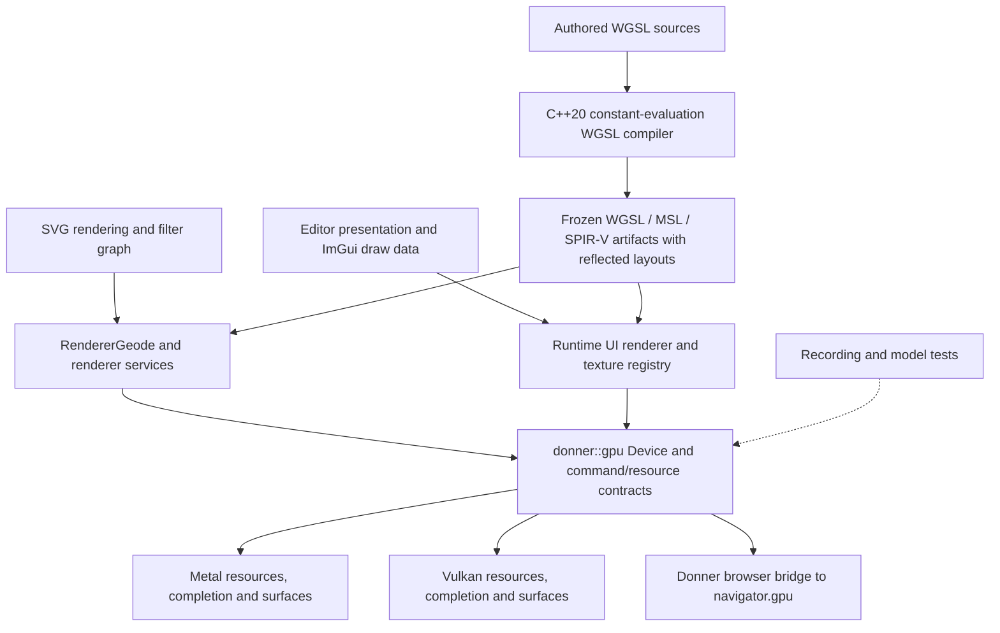

# Design: Donner Native GPU Runtime and Rust-Independent Build

**Status:** Implementing. The shader compiler, native drawing and mapping, Metal and Vulkan
surfaces, browser backend, runtime UI renderer, native shader linkage, filter command recording,
checkerboard targeting, texture-cache uploads, and compositor-debug uploads are merged and
qualified. Shared physical-root ownership is published for review: native UI and worker contexts
share lifetime and loss while preserving independent logical runtime state. Selected `gpu::Device`
ownership, backend-neutral renderer services, presentation cutover, and dependency removal remain
open.\
**Created:** 2026-07-05\
**Updated:** 2026-09-18\
**Author:** Claude Fable 5.1\
**Drafted by:** GPT-5.6 Sol

## Summary

Donner's GPU runtime is the interface between Geode/editor rendering and Metal, Vulkan, or browser
WebGPU. The remaining work is to make production callers use that interface end to end, supply the
missing draw, mapping, upload, and presentation operations, and remove the transitional WebGPU
implementation from the dependency closure.

`donner::gpu` provides the foundation for resource validation, command recording, submission,
backend execution, and compile-time shader artifacts: every production shader is authored as WGSL
and compiled during C++ constant evaluation into the WGSL, MSL, or SPIR-V projection its consumer
links, with the host interface reflected from the same compile
([WGSL shader compilation](../wgsl_compiler.md)). Production `GeodeDevice`, filter resource
plumbing, texture caches, and editor presentation still depend on concrete WebGPU objects. Native shader
execution tests therefore establish individual capabilities; they do not establish a complete
native editor or a Rust-independent build.

The target is an original C++20 runtime serving Donner's own rendering requirements. It is not a
WebGPU C ABI implementation, and its shader compiler accepts a documented WGSL profile at build time
rather than arbitrary shader text at runtime.

## Current Delivery State

Merged work now includes checked destination origins across the runtime and browser backend
([#1262](https://github.com/jwmcglynn/donner/pull/1262) and
[#1274](https://github.com/jwmcglynn/donner/pull/1274)), Metal and Vulkan host-buffer mapping
([#1264](https://github.com/jwmcglynn/donner/pull/1264)), Metal and Vulkan surface presentation
([#1265](https://github.com/jwmcglynn/donner/pull/1265) and
[#1272](https://github.com/jwmcglynn/donner/pull/1272)), the Donner browser backend and JavaScript
bridge ([#1266](https://github.com/jwmcglynn/donner/pull/1266)), and runtime texture handles for the
first filter-intermediate slice ([#1268](https://github.com/jwmcglynn/donner/pull/1268)). These
capabilities are integrated foundations; they do not by themselves complete the editor cutover.

Results belong to the named source revisions. Later source changes need affected qualification;
documentation-only updates need their own current-head checks. The UI font-atlas follow-up and
native shader linkage, filter recording, checkerboard targeting, texture-cache upload, and
compositor-debug upload are merged and qualified. Those four recent migration units completed all
26 hosted checks. Shared physical-root ownership is published for review; the remaining production
migrations continue in dependency order.

| Unit                                                                                                                                               | Current state                                                                                                                                                                                                                                                                                         | Remaining gate                                                                                                                                                                                |
| -------------------------------------------------------------------------------------------------------------------------------------------------- | ----------------------------------------------------------------------------------------------------------------------------------------------------------------------------------------------------------------------------------------------------------------------------------------------------- | --------------------------------------------------------------------------------------------------------------------------------------------------------------------------------------------- |
| [UI renderer #1267](https://github.com/jwmcglynn/donner/pull/1267) and [font-atlas follow-up #1284](https://github.com/jwmcglynn/donner/pull/1284) | Both are merged. Atlas invalidation uploads the replacement texture; retired backing and bindings survive until exact release.                                                                                                                                                                        | Frame-composition migration and final dependency cleanup remain separate items below.                                                                                                         |
| [Native shader artifact linkage #1279](https://github.com/jwmcglynn/donner/pull/1279)                                                              | Merged as `559cb1fb`. Production shader constructors select the device projection, native libraries link MSL or SPIR-V, and WebAssembly keeps WGSL-only artifacts.                                                                                                                                    | Native production pixel qualification still depends on the ownership cutover; linkage completion does not establish a native editor.                                                          |
| [Filter runtime command recording #1298](https://github.com/jwmcglynn/donner/pull/1298)                                                            | Merged as `9d65e188`. Runtime-owned filter command encoders preserve frame batching, exact host generations, the 64-pass boundary, completion-aware retirement, and terminal device-loss behavior.                                                                                                    | Wasm payload-size acceptance remains deferred until the production cutover removes the transitional Rust WebGPU dependency.                                                                   |
| [Texture-cache upload migration #1299](https://github.com/jwmcglynn/donner/pull/1299)                                                              | Merged as `fc8692a7`. Editor bitmap uploads create, update, reuse, and retire textures through validated runtime handles with bounded staging and cleared reusable backing.                                                                                                                           | Backend ownership and final dependency cleanup continue below.                                                                                                                                |
| [Checkerboard target boundary #1300](https://github.com/jwmcglynn/donner/pull/1300)                                                                | Merged as `15364179`. The shared pass accepts a validated borrowed runtime texture and extent; raw surface import remains at presentation, with device, generation, format, usage, extent, lifetime, and host-stream checks.                                                                          | Remaining target/readback and presentation bridges continue below.                                                                                                                            |
| [Compositor-debug upload migration #1302](https://github.com/jwmcglynn/donner/pull/1302)                                                           | Merged as `37716f09`. Debug-panel bitmaps upload through the shared bounded runtime path, replace registrations transactionally, and retire superseded backing after use.                                                                                                                             | Backend ownership and final dependency cleanup continue below.                                                                                                                                |
| [Shared physical-device ownership #1303](https://github.com/jwmcglynn/donner/pull/1303)                                                            | The implementation at `d53f62fb` is published for review. Native UI and worker contexts share one physical root and sticky loss while retaining separate tables, serials, caches, counters, and retirement. Borrowed external roots and the browser's one-context alias retain their prior contracts. | Affected renderer, editor, browser, sanitizer, and full qualification checks pass. Hosted CI and review gates remain before merge; selected `gpu::Device` ownership is a later cutover below. |

### Remaining work

| Order | Unit                                                                                           | Completion boundary                                                                                                                                                    |
| ----- | ---------------------------------------------------------------------------------------------- | ---------------------------------------------------------------------------------------------------------------------------------------------------------------------- |
| 1     | Existing UI, shader linkage, filter, checkerboard, upload, and compositor units - **complete** | PRs #1267, #1279, #1284, #1298, #1299, #1300, and #1302 are merged and qualified. Preserve their batching, identity, lifetime, and retirement contracts.               |
| 2     | Shared physical-device ownership - **published**                                               | Full qualification passes. Complete hosted CI and review for #1303 while preserving distinct logical state, borrowed external ownership, and the browser alias.        |
| 3     | Selected runtime-device ownership                                                              | Make the selected `gpu::Device` the backend owner and move shared renderer services behind backend-neutral ownership before platform presentation callers switch.      |
| 4     | Snapshot, target, and readback identity                                                        | Remove transitional registrations and raw target binding; use validated runtime or acquired-surface textures through readback and presentation.                        |
| 5     | `EditorWindow` surface integration                                                             | Connect platform windows to acquired runtime textures and cover resize, minimized, outdated/lost, timeout, device-loss, and invalidation behavior.                     |
| 6     | Browser production bridge cutover                                                              | Select the merged browser backend in the WebAssembly editor path and remove the C WebGPU wrapper only after its final consumer moves.                                  |
| 7     | Final platform selection                                                                       | Select Metal, Vulkan, or browser as the default through one production path only after resources, UI, surfaces, and browser presentation qualify together.             |
| 8     | Dependency removal and final audits                                                            | Remove transitional adapter and Rust-built native GPU dependencies, then close source, dependency, memory, performance, artifact, and integrated qualification audits. |

The merged units through compositor-debug upload are complete. Shared physical-root ownership is
published and preserves separate native logical contexts; it does not make the selected runtime
device the backend owner. Snapshot/readback, backend-neutral services, presentation, browser
selection, and dependency removal remain active in dependency order.

The shared fill, gradient, mask, image, snapshot, checkerboard, texture-cache, and compositor-debug
paths now use their reviewed runtime resource boundaries. Cross-context readback and presentation
bridges remain transitional.

Wasm-size qualification is deferred until the production RHI cutover and removal of the Rust-built
WebGPU dependencies. Intermediate package growth does not block these migration units. Keep the
measurements and existing budgets for final acceptance; this deferral does not relax functional,
lifetime, synchronization, memory-residency, security or privacy requirements.

## Goals

- Run native Geode/editor rendering through Metal on macOS and Vulkan on Linux.
- Preserve browser rendering through a Donner-owned bridge to the browser's WebGPU service.
- Give renderer targets, snapshots, uploads, readback, and UI textures one runtime ownership model.
- Preserve pixels, frame ordering, alpha interpretation, bounded resource use, and editor behavior.
- Remove transitional adapters, raw WebGPU API dependencies, and Rust-built native GPU libraries
  from production source, builds, and shipped artifacts.
- Complete the remaining GPU audit acceptance on the exact integrated implementation.

## Non-Goals

- Implementing the WebGPU standard, its C ABI, or arbitrary runtime WGSL parsing.
- Supporting user-supplied shaders or a public command-stream deserializer.
- Replacing SVG traversal, Slug coverage, or the compositor with a second rendering engine.
- Adding Windows or a native iOS host to this cutover; physical browser iOS qualification remains
  part of the browser presentation matrix.
- Expanding this plan into unrelated editor features or a project-wide release/audit backlog.
- Deleting the isolated tiny-skia Rust cross-validation fixture or inert upstream reference source.
  Their containment requirements are described below.

## Next Steps

1. Complete all hosted checks and review for the fully qualified shared physical-device ownership
   change.
2. Make the selected `gpu::Device` the backend owner and move shared renderer services behind
   backend-neutral ownership without merging logical tables, serials, caches, or retirement.
3. Remove transitional snapshot/readback registrations and raw presentation-target binding, then
   select the native and browser backends through the production editor paths.
4. Remove the transitional WebGPU implementation and Rust-built GPU dependencies, then run final
   integrated pixel, memory, performance, artifact-size, and dependency-closure acceptance.

## Implementation Plan

Checked items identify integrated capabilities; unchecked items still require implementation or
qualification. A backend-only test does not close a production migration item. Keep regression
commits and their fixes together in a focused reviewable change.

### Native drawing

- [x] Metal supports all eight vertex-buffer slots, instancing and buffer/offset updates while
      retaining 29 shader-buffer bindings and refusing binding collisions.
      [PR #1139](https://github.com/jwmcglynn/donner/pull/1139) is merged; the native vertex-layout
      targets below cover these contracts.
- [x] `setIndexBuffer` and `drawIndexed` are part of the shared command contract and platform
      backends, with index formats, byte bounds, first-index/base-vertex semantics, resource
      retirement, empty-binding validation and texture-copy-to-index synchronization covered by the
      encoder contract tests and the Vulkan execution suite.
      [PR #1154](https://github.com/jwmcglynn/donner/pull/1154) is merged. Metal and browser
      execution of indexed geometry join the UI-rendering work below.

### Compiled shaders and production selection

- [x] Every production shader family is authored as WGSL under `donner/gpu/shader/programs/` and
      compiled during constant evaluation into frozen artifacts with a reflected host interface:
      blur, convolution, Slug mask/fill/gradients, offset, filter resolve, diffuse and specular
      lighting, turbulence, image blit, feBlend, feFlood, feMerge, feComposite, feColorMatrix, feMorphology, feComponentTransfer,
      feDisplacementMap, feDropShadow, feImage, feTile, subregion clipping, color-space conversion,
      snapshot unpremultiply and the transparency checkerboard. The filter engine, checkerboard
      pipeline and snapshot readback derive bindings, entry points and workgroup shapes from
      reflection, and the build-time emitter tool, generated descriptor headers and IR builders are
      removed. The typed IR remains only as an emitter and native-execution test fixture.
      [PR #1195](https://github.com/jwmcglynn/donner/pull/1195) is merged; it supersedes the earlier
      per-family typed-program changes (blur #1142, checkerboard #1140, shadow #1146, component
      transfer #1148, displacement #1149, turbulence #1151, lighting #1150, image #1152,
      convolution #1157) and the prepared blend program.
- [x] Descriptor construction can select the projection for the chosen backend:
      `MakeShaderDescriptor(view, device.shaderSourceKind(), label)` supplies WGSL text, MSL text or
      SPIR-V words, and a device refuses a descriptor whose projection is absent from the linked
      artifact instead of compiling nothing. The filter engine, the shared render pipeline and the
      checkerboard pipeline pass the device's kind, and so do the Slug fill, gradient, mask and
      image-blit module constructors in `GeodeShaders.cc`. The filter engine and shared render
      pipeline select the matching artifact view as well as passing the device kind.
- [x] The native artifact library (`<family>_native_artifact`, MSL on Apple platforms and SPIR-V
      on Linux) is linked into the Geode libraries for every production family, and every site
      that builds a shader module selects the projection its device consumes. Integrated
      in [PR #1279](https://github.com/jwmcglynn/donner/pull/1279): platform selection covers the
      Geode device, module constructors, geometry encoder, filter engine and shared render
      pipeline, while WebAssembly links WGSL-only artifacts.
      `//donner/gpu/shader/artifact_tests:geode_linkage_isolation_tests` proves the linked native
      projection is present and the other platform projection is absent;
      `//donner/svg/renderer/geode:geode_shader_projection_tests` covers per-device selection and
      refusal of unavailable projections. The linkage capability is complete; end-to-end native
      production pixel acceptance remains the separate item below.
- [ ] Qualify each family through the selected native backend with strict pixel acceptance:
      resvg filter cases, chained filters, fractional alpha, nonzero subregions, refusal paths and
      DPR2. The native Metal and Vulkan execution suites establish per-shader correctness today; they
      do not close this item on their own. Native artifact linkage and projection selection are
      merged; this item remains open until production device ownership and its callers use the
      selected native backend and pass the integrated pixel matrix.
- [ ] Shader profile additions follow the compiler's rules: a construct the v1 profile rejects is
      added to the compiler with tests across all three projections rather than worked around, and
      the UI renderer's shaders are authored as WGSL sources under the same contract.

### Snapshot and target identity

- [x] Owning snapshots retain their runtime texture identity for same-context drawing; adoption
      checks device identity, backing ownership, format and bounds before consuming the handle.
      Detached and frame-borrowed lifetime, producer teardown and retirement contracts are covered
      by the renderer snapshot tests.
      [PR #1141](https://github.com/jwmcglynn/donner/pull/1141) is merged.
- [ ] Remove transitional cross-context registrations from presentation and readback as device
      ownership migrates. The current bridge requires matching physical device and queue identities;
      capture uses an isolated readback context and retains source backing. This intermediate path
      does not complete the native mapping or no-reimport cutover.
- [ ] Replace raw target binding in `RendererGeode` and `EditorShellPresentation` with validated
      runtime textures or acquired surface textures, retaining embedder ownership where applicable.

### Resource plumbing and uploads

- [x] `GeodeFilterEngine::FilterResourceArena` and its intermediates use runtime textures.
      [PR #1268](https://github.com/jwmcglynn/donner/pull/1268) also migrated color-space cache
      identity, transparent clears, tile copies, and explicit output detach/release through the
      issuing allocator. SourceGraphic and output ownership remain distinct.
- [x] Replace the filter engine's borrowed raw WebGPU command encoder with an owned runtime
      encoder. [PR #1298](https://github.com/jwmcglynn/donner/pull/1298) is merged as `9d65e188`.
      It preserves host-frame batching below the 64-pass boundary, exact owner/generation leases,
      source-render/filter/composite order, positive-completion retirement, terminal loss behavior,
      and sibling unsubmitted host ranges. Abandoned frames allocate and record nothing; uncertain
      accepted backing remains retained, and a browser task yield is not completion proof. Wasm-size
      qualification remains deferred until the production cutover removes the Rust-built WebGPU
      dependencies.
- [x] Shared fill, gradient, mask, image and snapshot pipeline resources and `GeoEncoder` use runtime
      handles and command recording.
- [x] Move the checkerboard pass's raw target import to `EditorShellPresentation`; accept a
      validated borrowed runtime texture and extent in the pass. [PR #1300](https://github.com/jwmcglynn/donner/pull/1300)
      is merged as `15364179`. General renderer target/readback ownership remains a separate caller
      migration.
- [x] Add a checked destination origin to `Device::writeTexture` and implement the same
      subrectangle semantics in each backend. Extent, row-stride, data-size and overflow validation
      are shared across Metal, Vulkan and browser execution.
      [PR #1262](https://github.com/jwmcglynn/donner/pull/1262) and
      [PR #1274](https://github.com/jwmcglynn/donner/pull/1274) are merged.
- [x] Move `GlTextureCache` bitmap/thumbnail uploads, border replication, clear operations, and
      allocation reuse onto runtime resources. [PR #1299](https://github.com/jwmcglynn/donner/pull/1299)
      is merged as `fc8692a7`; bounded staging, transactional replacement, and deferred retirement
      preserve exact pixels and consuming-frame lifetime.
- [x] Move `CompositorDebugPanel` bitmap replacement onto the shared bounded runtime upload path.
      [PR #1302](https://github.com/jwmcglynn/donner/pull/1302) is merged as `37716f09`; failed
      replacements preserve the prior registration, and superseded backing retires after use.

### Native mapping and completion

- [x] Implement native Metal and Vulkan hooks for `mapBufferAsync`, mapping readiness,
      `mappedBytes`, and unmap/invalidation using the existing public runtime contract.
      [PR #1264](https://github.com/jwmcglynn/donner/pull/1264) is merged. Both backends use the
      shared mapping table to tie readiness to the submission serial filling the buffer and enforce
      bounds, one open mapping per buffer, no reads before readiness, and invalidation when the
      buffer is destroyed. Metal and Vulkan execution passed, including Khronos synchronization
      validation.
- [ ] Route renderer readback and completion through those hooks, with the relevant submission
      serial, bounded waits, cancellation, and device-loss outcomes. `RendererGeode` already
      expresses its readback entirely in runtime mapping calls, with a caller-owned deadline, one
      slice per wait, a cancellation predicate and distinct device-loss handling, and those hooks
      now have native implementations. The renderer still binds the transitional adapter type
      statically for four operations with no runtime equivalent (`destroyBufferBacking`,
      `mappingUsedTimedWaitAny`, `importExternalTexture`, `submitStandalone`), so a native device
      does not yet serve production readback; replacing that reference belongs with device
      ownership below.
- [ ] Verify that cancelled mappings do not reenter the reusable readback pool while still active,
      and that unmap, retirement, and loss invalidate access at the documented boundary. Native
      cancellation, device-loss and invalidation tests pass with the merged mapping hooks. Renderer
      regressions cover abandoned capture, device loss during mapping, and subsequent pooled-buffer
      reuse through the current adapter. Production readback through a selected native device
      remains part of the ownership cutover.

### UI rendering

- [x] Replace raw WebGPU texture-view IDs in `GlTextureCache` and `CompositorDebugPanel` with runtime
      UI texture registrations carrying device identity, alpha mode, and frame lifetime.
      Integrated in [PR #1267](https://github.com/jwmcglynn/donner/pull/1267), including bounded
      registration, exact-generation retirement and retained backing lifetime. Follow-up
      [#1284](https://github.com/jwmcglynn/donner/pull/1284) repairs font-atlas invalidation within
      the same ownership contract.
- [x] Implement the ImGui renderer over compiled WGSL shaders, indexed draws, bounded vertex/index uploads,
      texture/sampler bindings, scissors, and renderer-state reset operations. Integrated in
      [PR #1267](https://github.com/jwmcglynn/donner/pull/1267); follow-up
      [#1284](https://github.com/jwmcglynn/donner/pull/1284) preserves retired atlas backing and
      bindings until exact release.
- [x] Remove the `imgui_wgpu_backend` dependency and its obsolete patches. The target had no C++
      consumer once the runtime ImGui renderer landed, so the vendored ImGui WebGPU backend target,
      the three patches that customized it, and the duplicated copy in the examples module are
      deleted.
- [ ] Migrate frame composition off the raw WebGPU frame encoder so the editor records its whole
      frame through the runtime.

### Native surfaces

- [x] Implement Metal surface creation/configuration, drawable acquisition, presentation, and
      abandonment through `Device` surface hooks.
      [PR #1265](https://github.com/jwmcglynn/donner/pull/1265) is merged.
- [x] Implement Vulkan platform surface and swapchain support, required queue/extension selection,
      acquisition/presentation synchronization, and recreation through the same hooks.
      [PR #1272](https://github.com/jwmcglynn/donner/pull/1272) is merged, including owner-lifetime,
      synchronization and failure-retention repairs. Native qualification passes 674 cases across
      12 targets, including 69 surface cases, with no skips or synchronization diagnostics.
      Production window integration remains a separate item.
- [x] Update `EditorWindow` to use acquired runtime textures directly. One presentation surface
      serves every platform through the `Device` surface hooks; a frame is carried as a runtime
      texture borrowed for that frame, and the surface reports its format and usage as runtime
      values. Resize, minimized windows, outdated/lost surfaces, timeout, device loss,
      frame-handle invalidation after present and abandon, and a second acquisition before either
      are covered by `//donner/editor/tests:editor_window_tests` and its `geode` variant. The
      window still reaches the backend device for the platform object and for the passes that
      have not moved to the presentation boundary; selecting a native device beneath this seam is
      the ownership item below.

### Browser bridge

- [x] Implement checked browser object IDs, worker ownership, asynchronous device requests, surface
      configuration, completion, mapping, and device-loss propagation behind the runtime contract.
      `donner/gpu/browser` supplies a `gpu::Device` whose hooks express validated operations to
      `navigator.gpu` through `library_donner_gpu.js`. Browser objects are named by identifiers
      drawn from a space that is never reused, and both sides check the identifier and its object
      kind; a device request settles asynchronously; presentation follows the browser's own frame
      loop, so an explicit present is refused and a frame ends by abandoning its acquired texture.
      The backend and its bridge contract carry no Emscripten dependency, so `browser_tests` covers
      identifier reuse, ownership, request outcomes, mapping, device loss and command-stream
      mirroring on every host. [PR #1266](https://github.com/jwmcglynn/donner/pull/1266) is merged;
      selecting it in the production editor remains the next item.
- [ ] Replace the C WebGPU wrapper with that bridge in the WebAssembly production path: the
      renderer and editor Wasm targets reach WebGPU through `GeodeDevice` and the transitional
      adapter, so selecting the browser backend is part of making the selected `gpu::Device` the
      backend owner below. The compiled WGSL projections remain trusted build input.
- [ ] Run the complete browser editor path and remove emdawnwebgpu, `webgpu-cpp`, and remaining
      generated C-ABI glue when no consumer needs them.

### Device ownership and dependency closure

- [x] Share one physical WebGPU root and sticky loss state across native editor contexts while
      preserving their independent handle tables, serials, caches, counters, and retirement.
      Headless creation uses the same owner; borrowed embedders retain host ownership; the browser
      keeps its existing single-context alias.
- [ ] Make the selected `gpu::Device` the backend owner. Turn `GeodeDevice` into backend-neutral
      renderer services for counters, caches, dummy resources, and deferred retirement; update
      headless and embedded construction.
- [ ] Select Metal, Vulkan, or the browser backend through one production path per platform after
      resources, shaders, mapping, UI rendering, and surfaces qualify together.
- [ ] Remove the transitional adapter, native `wgpu-native` archives/overlays, unused headers,
      obsolete build rules, and orphaned code with their final callers.
- [ ] Make every no-Rust-dependency verifier category blocking and verify clean Bazel/CMake source
      archive builds without a Rust toolchain. Inspect link/dependency and packaged-artifact evidence.

### Remaining GPU audit acceptance

- [ ] Inspect the integrated source/dependency graph for concrete adapter access, raw handles outside
      backend boundaries, duplicate ownership, shader compiler or emitter symbols in application
      binaries, and dead code.
- [ ] Compare logical allocation accounting with actual CPU RAM/GPU residency for pending uploads,
      scratch, parameter storage, cached textures, and deferred retirement under overlapping frames.
- [ ] Verify representative DPR2 filter/thumbnail workloads under the existing 128 MiB Wasm and
      256 MiB native working-set caps. Investigate regressions rather than raising the caps.
- [ ] Run paired rendering/overlap, startup, clean/incremental build, and artifact-size measurements
      on the same host and configuration; qualify the exact integrated candidate against the gates
      below and resolve actionable review findings.

## Proposed Architecture

```mermaid
flowchart TD
    SVG[SVG rendering and filter graph] --> GEODE[RendererGeode and renderer services]
    EDITOR[Editor presentation and ImGui draw data] --> UI[Runtime UI renderer and texture registry]
    GEODE --> GPU[donner::gpu Device and command/resource contracts]
    UI --> GPU
    GPU --> METAL[Metal resources, completion and surfaces]
    GPU --> VULKAN[Vulkan resources, completion and surfaces]
    GPU --> WEB[Donner browser bridge to navigator.gpu]
    WGSL[Authored WGSL sources] --> COMPILER[C++20 constant-evaluation WGSL compiler]
    COMPILER --> ARTIFACTS[Frozen WGSL / MSL / SPIR-V artifacts with reflected layouts]
    ARTIFACTS --> GEODE
    ARTIFACTS --> UI
    TESTS[Recording and model tests] -.-> GPU
```

The runtime stays under `donner/gpu/`; `RendererInterface` remains the SVG-level renderer contract.
Recording support is test-only. Production renderer and UI code consume the selected device rather
than a concrete transition adapter. The initial GPU interface remains internal to Donner; exposing
native device adoption to embedders is a separate API decision after lifetime and threading
contracts qualify.

### Resource and frame contracts

Resource handles are move-only values associated with a device and slot generation. `Device` owns
validation and backend dispatch; operations return `gpu::Result<T>` or status values. Backend
resources referenced by submitted work require retirement through completion serials.

The remaining migration must preserve three distinct texture roles:

| Role                       | Required ownership and validity                                                                                       |
| -------------------------- | --------------------------------------------------------------------------------------------------------------------- |
| Detached renderer snapshot | Own backing through sampling/readback and producer teardown; keep content extent distinct from allocation extent.     |
| Borrowed frame texture     | Borrow without taking backing ownership; validity ends at the documented frame boundary.                              |
| Acquired surface texture   | Belong to one surface acquisition; present, abandon, reconfigure, or surface destruction invalidates the acquisition. |

Host-provided native objects enter through a trusted embedding boundary with explicit ownership.
An imported registration does not imply ownership of its backing. Device, generation, format, usage,
and range checks remain necessary when replacing aliases with direct runtime handles. The test
matrix below is the acceptance boundary for each migration; this table is not a claim that every
remaining caller already enforces it.

### Command ordering and concurrency

A frame records render, compute, and copy work in the intended order through runtime encoders. The
migration must not introduce per-pipeline queue submissions or lose ordering around layer copies.
Completion of a recorded frame and completion of submitted GPU work are distinct events.

Thread affinity remains explicit. The async renderer retains worker-owned device operations;
cross-thread presentation passes only documented frame/snapshot forms. UI registrations and mapping
requests retain their resources until their consuming work or cancellation completes.

Native drawing and shader migration can proceed alongside resource migration and platform hooks.
UI migration depends on indexed drawing and runtime textures/uploads. Device ownership switches only
after shader selection, resources, mapping, UI, and platform presentation work together.

### Shader and build boundary

Production shaders are authored as inline WGSL and compiled by Donner's C++20 `consteval` compiler
into frozen artifacts during the ordinary C++ build ([WGSL shader compilation](../wgsl_compiler.md)).
Each artifact library retains exactly the projection its consumer uses: the WebGPU adapter links
WGSL-only artifacts, native Apple consumers link MSL-only artifacts, native Linux consumers link
SPIR-V-only artifacts, and all-projection artifacts are test controls. Linked-binary isolation
probes prove that a production artifact carries no other projection; the absence of compiler and
emitter symbols from application binaries is part of the audit acceptance below.
The compiler implements a documented v1 profile of WGSL; source outside the profile fails C++
compilation with a named diagnostic, and there is no runtime parser, generator or fallback.

Host parameter layouts, binding slots, entry names and workgroup shapes are reflected from the
same compile and checked against the host structures with `static_assert`, so an interface edit
fails the build instead of changing the bytes a shader reads. The shipped WGSL projection is the
authored source without comments, indentation or blank lines; MSL and SPIR-V are emitted from the
parsed module. Committed shader text is the authored source; emitted projections are never
committed as goldens. Verification uses the compiler's own tests, offline Metal and SPIR-V
validation, native execution, and strict renderer pixel comparisons. The typed IR and its emitters
remain as test fixtures only.

Bazel is the primary build. CMake must describe the same native sources, shader artifacts, platform
libraries, and feature flags. Tiny renderer profiles must remain independent of GPU backend linkage.
The browser WebGPU implementation and native drivers are host services outside Donner's source and
binary closure; the bridge and backend code calling them belong to Donner.

## Clean-Room and Dependency Requirements

Implementation inputs are Donner requirements, algorithms, tests and black-box renderer outputs;
the public [WebGPU](https://gpuweb.github.io/gpuweb/), [WGSL](https://www.w3.org/TR/WGSL/),
[Vulkan](https://registry.khronos.org/vulkan/), and [SPIR-V](https://registry.khronos.org/SPIR-V/)
specifications; and official Metal documentation/SDK interfaces.

Do not copy, translate, vendor, link, or retain implementation code or internal tests from `wgpu`,
`wgpu-native`, Naga, Dawn, or Tint in the completed runtime, shader tooling, tests, or CI. Record the
requirement/specification, algorithm choices, verification targets, and SDK/tool inputs for each
implementation change. Keep transition reference pixels/counters as test data; remove the legacy
implementation when it no longer has a migration caller.

The no-Rust requirement applies to build and artifact closure. No shipped artifact or non-test
closure may fetch/invoke Rust tooling or depend on a Rust-built GPU library. Inert reference material
is confined to the reviewed resvg/tiny-skia prefixes. The tiny-skia Rust cross-validation fixture is
confined to the vendored workspace's own tests, without consumers or re-exports outside that test workspace. No Donner target, including tests,
may reach the fixture or its Rust-built objects.
A transitive module declaration alone is not evidence that a Rust toolchain executes.

`tools/gpu_inventory/check_no_rust_dependencies.py` and its tests enforce the tracked-tree rules;
`tools/cmake/gen_cmakelists.py --check` also validates generated CMake output. Final closure acceptance
additionally requires all verifier categories blocking, analyzed dependency/link evidence, and
source-archive builds without `rustc` or `cargo`. Do not treat a lexical scan as complete proof of
transitive build or artifact contents.

## Security and Reliability

Untrusted SVG controls geometry, images, filter graphs, dimensions, and repetition. It does not
provide native handles, arbitrary shader source, or serialized GPU commands. The remaining runtime
operations must preserve release-build validation of sizes, arithmetic, usage, device identity,
resource generation, and binding/copy ranges, plus bounded allocations and waits.

New mapping, indexed-draw, upload-origin, surface, and browser-ID paths require negative cases for
invalid ranges, stale handles, cancellation, resource refusal, and loss. Use bounded structured
command tests and backend fault injection; do not rely on driver errors or optional diagnostic
assertions to enforce the contract. Capture output must not contain pointers, native handles, private paths, or
process addresses. Backend failures must propagate without corrupting editor/DOM ownership.

The Vulkan surface failure contract requires the swapchain-maintenance extension and its matching
feature, separate fences for presentation and runtime submissions, and completion proof for the
whole owner graph before any teardown releases shared prerequisites. If a proof fails, the runtime
retains that complete graph and refuses future Vulkan device creation until restart. This contract
is implemented in merged PR #1272 and qualified by the native Vulkan surface tests; it does
not use a process-abort path.

The required owning tests and missing enforcement surfaces are listed below. Optional diagnostics
and physical-hardware observations are evidence with their stated limits, not universal guarantees.

## Testing and Validation

Extend existing targets where they own the changed behavior. The native mapping, Metal/Vulkan surface and
browser backend targets own their merged hooks. Production window integration and the browser
cutover remain active qualification work. The GPU operation and shader manifests must use the
complete repository input set, with
`//tools/gpu_inventory:manifest_freshness_tests` as the freshness gate.

| Contract / remaining work                                      | Owning verification                                                                                                                                                                                                                                                                                                                                                                                            |
| -------------------------------------------------------------- | -------------------------------------------------------------------------------------------------------------------------------------------------------------------------------------------------------------------------------------------------------------------------------------------------------------------------------------------------------------------------------------------------------------- |
| Indexed draws, resource identity, command/lifetime validation  | `//donner/gpu:gpu_tests`; extend native Metal/Vulkan execution tests and browser contract tests for indexed draws.                                                                                                                                                                                                                                                                                             |
| Compiled shader artifacts, reflection and projection isolation | `//donner/gpu/shader/wgsl:wgsl_tests` and `wgsl_diagnostics_tests`, `//donner/gpu/shader:shader_tests`, `generated_program_descriptor_tests`, `msl_xcrun_validation_tests`, `spirv_val_validation_tests`, `wgsl_emitter_geode_validation_tests` (each shipped WGSL projection through the Geode WebGPU device), the linked isolation probes under `//donner/gpu/shader/artifact_tests`, and the parser fuzzer. |
| Native vertex layouts and pixels                               | `//donner/gpu/metal/tests:metal_solid_fill_tests`, `//donner/gpu/vulkan/tests:vulkan_solid_fill_tests`; add the matching browser execution cases.                                                                                                                                                                                                                                                              |
| Snapshot/target lifetime, alpha, cropping, refusal             | `//donner/svg/renderer/tests:renderer_geode_tests`; replace adapter-only coverage with native runtime execution as each caller migrates.                                                                                                                                                                                                                                                                       |
| Filter resource ordering, scratch and working sets             | `//donner/svg/renderer/geode:geode_filter_engine_tests`, `//donner/svg/renderer/tests:renderer_geode_tests`, and native filter execution suites.                                                                                                                                                                                                                                                               |
| Upload reuse, UI texture lifetime and thumbnails               | `//donner/editor/tests:gl_texture_cache_tests`, `//donner/editor/tests:layer_thumbnail_golden_tests`; extend them for runtime-backed resources.                                                                                                                                                                                                                                                                |
| Mapping, loss, cancellation and native surfaces                | Shared `gpu_tests`, native mapping suites and owning Metal/Vulkan surface tests; actual editor surface execution remains required. `//donner/gpu/browser:browser_tests` owns the browser backend's identifier, ownership, mapping and device-loss behavior; browser execution of that backend joins the browser lanes with the production cutover.                                                             |
| Editor ordering and presentation                               | The explicit Geode editor lane below, plus the browser rendering/interaction lanes for the selected bridge.                                                                                                                                                                                                                                                                                                    |
| Structural counters, memory, timing and size                   | `//donner/gpu/baseline:baseline_counters_tests`, `//donner/svg/renderer/geode:geode_perf_tests`, and the paired measurements required by the cutover gates.                                                                                                                                                                                                                                                    |
| Dependency closure                                             | `//tools/gpu_inventory:check_no_rust_dependencies_tests`, the blocking verifier invocation, generated CMake validation, and analyzed/source-archive/artifact evidence.                                                                                                                                                                                                                                         |

Run the full `bazel test //...` gate and, separately, these targets with `--config=geode`:

- `//donner/editor/tests:editor_window_tests_geode`
- `//donner/editor/tests:layer_thumbnail_golden_tests_geode`
- `//donner/editor/tests:async_renderer_tests_geode`
- `//donner/editor/tests:rnr_replay_tests_geode`
- `//donner/editor/tests:gl_rnr_replay_tests_geode`

Use strict pixelmatch for image acceptance. Include existing resvg filter cases for the migrated
families, chained filters, fractional alpha, nonzero subregions, clips/masks, and DPR2 workloads.
Unsupported-device skips and compile-only jobs must remain distinguishable from actual execution.
The physical adapter/browser matrix and size budgets are maintained in
[0064: GPU release matrix](0064-gpu_release_matrix.md).

## Cutover Acceptance

The exact integrated candidate must satisfy all applicable platform gates:

- Zero unexpected pixel regressions across renderer, resvg, editor replay, and conformance suites;
  structural counters match exactly where backend-independent and meet explicitly reviewed
  expectations where backend APIs differ; existing steady-state budgets also remain enforced.
- No Metal API or Vulkan synchronization-validation errors in the exercised native workloads;
  no failures in bounded invalid-input, device-loss, cancellation, or create/destroy stress cases.
- No unbounded frame allocations, pending uploads, submissions, or retirement growth; representative
  DPR2 workloads fit the existing working-set caps and physical residency is measured separately.
- Same-host/configuration frame time is no worse than 5% at the median and 10% at p95 against the
  agreed reference corpus unless a quality/size tradeoff is explicitly accepted. Add enforcing
  performance targets where this comparison is not yet automated.
- Native and Wasm artifacts meet the measured budgets in the GPU matrix and editor build rules;
  comparable clean/incremental build and startup measurements accompany the cutover.
- Browser presentation qualifies on Chromium, WebKit, and the agreed physical iOS matrix. Device or
  browser-profile simulation alone does not establish physical-device coverage.
- Production consumers and dependency/artifact evidence satisfy the runtime and no-Rust boundaries;
  the concrete adapter and obsolete WebGPU/Rust implementation paths have no remaining consumers.
- Independent security and implementation-provenance review of the RHI has no unresolved critical
  or high findings.
- Required tests and checks execute successfully on the candidate, and actionable RHI/GPU review
  findings are resolved. Publish the ownership, embedding, backend and failure-mode documentation
  that the integrated implementation supports.

## Decisions Needed Before Platform Cutover

- Which physical GPU/driver combinations are mandatory versus best-effort in the qualification matrix?
- What trusted native embedding surface is exposed after cutover, if any, beyond internal callers?
- Which actual Vulkan allocation patterns justify suballocation, based on the residency measurements?

## Related Designs

- [0017: Geode renderer](0017-geode_renderer.md)
- [0025: Composited rendering](0025-composited_rendering.md)
- [0030: Geode performance](0030-geode_performance.md)
- [0042: Geode Slug conformance](0042-geode_slug_conformance.md)
- [0043: Deterministic replay testing](0043-deterministic_replay_testing.md)
- [0064: GPU release matrix and binary-size budgets](0064-gpu_release_matrix.md)
- [WGSL shader compilation](../wgsl_compiler.md)
