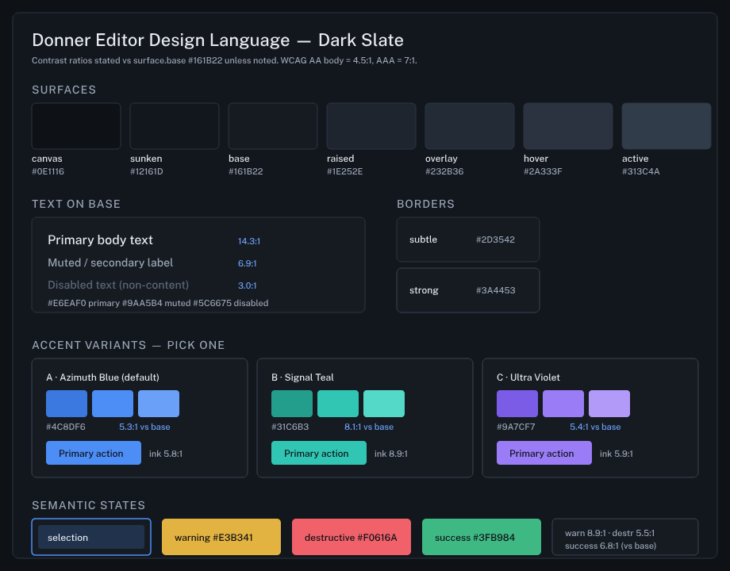
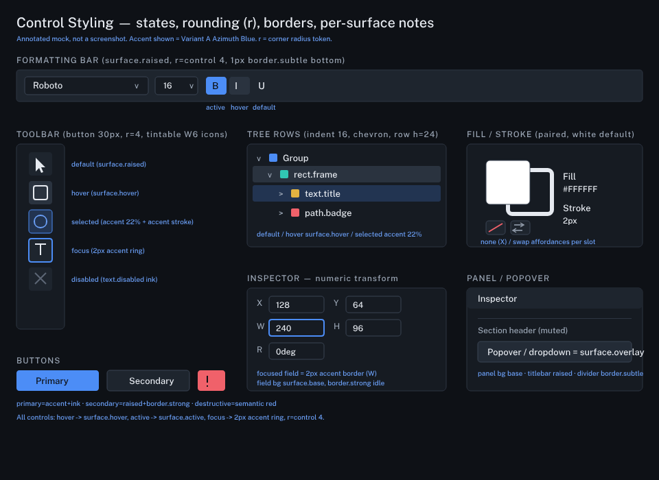

# Design: Donner Editor Design Language

**Status:** Draft (proposal for operator review; no application yet)
**Author:** Claude Opus 4.8
**Created:** 2026-07-06

## Summary

- The editor's chrome is styled by a single `ImGui::StyleColorsDark()` call
  (`donner/editor/gui/EditorWindow.cc:744`) plus roughly 111 color literals and
  every rounding/padding/spacing value scattered as per-widget `PushStyleVar` /
  `PushStyleColor` calls and file-local `constexpr`. There is no theme module,
  no shared token names, and no central `ImGuiStyle` configuration.
- This document proposes one opinionated design direction (a dark slate base
  with a single accent, three accent variants for the operator to pick from,
  and a small semantic-state set), a 4 px spacing grid, a type scale for the
  embedded faces, an icon/stroke spec that aligns to the W6 art spec, and a
  control-styling spec for every surface that exists today.
- It then specifies an `EditorTheme` module that consolidates the scattered
  constants into a named token table and maps those tokens onto ImGui style
  overrides. Application is a **separate, later** packet gated on operator
  approval of this proposal.
- Scope boundary: this packet ships the proposal doc plus swatch/mockup assets
  and their rendered PNGs (produced through Donner's own raster path). It
  changes nothing under `donner/editor/` source and nothing under
  `donner/svg/compositor/`. The editor tree still builds (verified below).

## Goals

- One coherent palette with real hex values, contrast-checked for text
  legibility, stating body-text and muted-text ratios on the base surface.
- One primary accent plus 2-3 accent variants the operator picks between, all
  meeting AA for their intended use.
- A 4 px spacing grid, a type scale for the embedded faces (Roboto UI, Fira
  Code mono; W3 adds more faces the scale governs by size), and an icon grid +
  stroke rule that matches the W6 suite spec so tool icons and cursors read as
  one family.
- A control-styling spec (rounding, borders, hover/active/focus states) with
  per-control notes for every surface: toolbar, panels, tree rows, inspector
  fields, the Fill/Stroke widget, and the formatting bar.
- An implementation plan for an `EditorTheme` module: the token table
  (name -> value), which scattered constants each token consolidates (with
  `file:line` anchors), and how ImGui style overrides map to tokens.
- Honestly-produced visuals: swatch sheets and annotated control mockups
  authored as SVG and rasterized through Donner's own tool, committed with the
  doc.

## Non-Goals

- No application of the theme to the editor in this packet. Not a single style
  literal is changed. Application is the follow-up packet, gated on approval.
- No new UI framework and no widget rewrite. This is a token layer over the
  existing ImGui shell.
- No fabricated editor screenshots. A truly themed screenshot cannot be
  produced without applying the theme, so this proposal ships swatches and
  annotated mocks (rendered by Donner) instead, and says so plainly.
- No light theme in v1. The tokens are structured so a light variant is a
  future palette swap, but only the dark direction is specified here.
- No change to the canvas artwork rendering, only editor chrome.

## Next Steps

- Operator reviews this proposal and answers the approval question set (see
  Open Questions), primarily: which accent variant, and confirm the spacing /
  rounding / type defaults.
- On approval, a follow-up packet implements the `EditorTheme` module per the
  Implementation Plan and migrates the inventoried constants token-by-token.

## Implementation Plan

- [ ] Milestone 1: Approve the design language (this doc)
  - [ ] Operator picks the accent variant (A / B / C)
  - [ ] Operator confirms spacing base (4 px), control radius (4 px), and the
        type scale defaults, or edits them
  - [ ] Operator confirms the semantic-state hues (selection = accent,
        warning, destructive, success)
- [ ] Milestone 2: Land the `EditorTheme` module skeleton (follow-up packet)
  - [ ] Add `donner/editor/EditorTheme.{h,cc}` with the token struct and
        `EditorTheme::Dark(Accent)` factory
  - [ ] Add `ApplyToImGuiStyle(ImGuiStyle&)` and call it in place of
        `StyleColorsDark()` at `EditorWindow.cc:744`
  - [ ] Unit test: token completeness + AA contrast assertions on text tokens
- [ ] Milestone 3: Migrate scattered constants to tokens (follow-up packets,
      serialized on `EditorShell.cc`)
  - [ ] Replace the overlay/selection literals (`OverlayRenderer.cc`) with
        `theme.selection*` accessors
  - [ ] Replace toolbar/chip/scrollbar literals in `EditorShell.cc`
  - [ ] Replace the perf-graph `k*Color` constants in `RenderPanePresenter.cc`
  - [ ] Replace the `getDarkPalette()` array in `TextEditor.cc` with a
        theme-derived syntax palette
  - [ ] Replace `LayersPanel.cc` / `CompositorDebugPanel.cc` / `DialogPresenter.cc`
        literals

## Background

- Inventory basis: a full survey of `donner/editor/` (excluding tests) on the
  `qa/polish-wave1` tree, 2026-07-06. Findings that shape the proposal:
  - The only central theme call is `StyleColorsDark()` at
    `EditorWindow.cc:744`. No `ImGuiStyle` field (rounding, padding, spacing) is
    configured anywhere; every value is a local `PushStyleVar` or magic number.
  - ~111 color literal occurrences (~90-95 distinct RGBA values). The heaviest
    files are `TextEditor.cc` (39, of which 30 are the `getDarkPalette()`
    syntax array at lines 4096-4125), `EditorShell.cc` (~32 colors plus the
    entire layout-dimension block at lines 69-110 and all font setup), and
    `RenderPanePresenter.cc` (18, with 13 named `k*Color` perf-graph constants).
  - Recurring ad-hoc hues: a selection cyan `0x00c8ff` (`OverlayRenderer.cc`),
    teal chip backgrounds (`0,111,149` / `0,135,170` in `EditorShell.cc`), and
    the `IM_COL32(30,30,30,*)` / `IM_COL32(255,255,255,*)` families. These are
    exactly the values a token layer replaces.
- The W6 art spec (`donner/editor/art/STYLE.md`, branch
  `polish/w6-cursors-icons`) already governs cursors and tool icons. This
  proposal aligns to it and does not restate or diverge from its grid, hotspot,
  or two-tone rules.

## Proposed Architecture

### 1. Palette (Dark Slate)

Contrast ratios are WCAG 2.1, computed against `surface.base` `#161B22` unless
noted (AA body text = 4.5:1, AAA = 7:1).



**Surfaces** (dark slate ramp, deepest to lightest):

| Token             | Hex       | Use                                             |
|-------------------|-----------|-------------------------------------------------|
| `surface.canvas`  | `#0E1116` | Artboard letterbox / deepest backdrop           |
| `surface.sunken`  | `#12161D` | Scroll troughs, wells, inset regions            |
| `surface.base`    | `#161B22` | Panels, sidebar, primary window background       |
| `surface.raised`  | `#1E252E` | Toolbar, menu bar, panel titlebars, field idle  |
| `surface.overlay` | `#232B36` | Popovers, dropdowns, tooltips                   |
| `surface.hover`   | `#2A333F` | Row / button hover                              |
| `surface.active`  | `#313C4A` | Pressed / selected row background               |

**Borders:**

| Token           | Hex       | Contrast vs base | Use                              |
|-----------------|-----------|------------------|----------------------------------|
| `border.subtle` | `#2D3542` | 1.40:1           | Hairline dividers, panel edges   |
| `border.strong` | `#3A4453` | 1.76:1           | Field outlines, focused container|

**Text** (on `surface.base`):

| Token           | Hex       | Contrast | Grade            | Use                    |
|-----------------|-----------|----------|------------------|------------------------|
| `text.primary`  | `#E6EAF0` | 14.33:1  | AAA              | Body text, values      |
| `text.muted`    | `#9AA5B4` | 6.93:1   | AA (near AAA)    | Secondary labels, meta |
| `text.disabled` | `#5C6675` | 2.98:1   | intentional sub  | Disabled controls only |

`text.disabled` is deliberately below the 4.5:1 threshold: it marks
non-interactive, non-content text and must read as inert. On `surface.canvas`
the primary/muted ratios rise slightly (15.66:1 / 7.58:1).

**Accent — primary direction is Variant A; operator picks one:**

| Variant           | Hex       | On base | Ink on accent | Ink color | Character              |
|-------------------|-----------|---------|---------------|-----------|------------------------|
| A · Azimuth Blue  | `#4C8DF6` | 5.31:1  | 5.81:1        | `#0E1116` | Default; classic, calm |
| B · Signal Teal   | `#31C6B3` | 8.12:1  | 8.88:1        | `#0E1116` | Highest contrast; cool |
| C · Ultra Violet  | `#9A7CF7` | 5.44:1  | 5.94:1        | `#0E1116` | Warmer, creative       |

Each variant carries three tints — `accent.active` (darker, pressed),
`accent.default`, `accent.hover` (lighter):

- A: `#3B79E0` / `#4C8DF6` / `#6BA0F8`
- B: `#249E8C` / `#31C6B3` / `#54D9C8`
- C: `#7B5CE6` / `#9A7CF7` / `#B29AF9`

Accent-filled controls (primary buttons, active toggles) use **dark ink**
`#0E1116` for their label, not white: on all three variants dark ink clears AA
(5.81 / 8.88 / 5.94) while white does not (3.26 / 2.13 / 3.18). Accent used as
foreground (icons, focus ring, links) sits on `surface.base` and clears AA for
all three (5.31 / 8.12 / 5.44).

**Semantic states:**

| Token         | Hex       | On base | Dark-ink | Use                                        |
|---------------|-----------|---------|----------|--------------------------------------------|
| `selection`   | = accent  | 5.3:1+  | -        | Marquee/handle stroke; fill = accent @ 20% |
| `warning`     | `#E3B341` | 8.89:1  | 9.72:1   | Amber: promote-refused, over-budget frames |
| `destructive` | `#F0616A` | 5.46:1  | 5.96:1   | Red: delete, errors, stalls                |
| `success`     | `#3FB984` | 6.99:1  | 7.64:1   | Green (optional): committed / in-budget    |

`selection` is derived from the chosen accent (stroke = `accent.default`, fill =
`accent.default` at 20% alpha), which replaces the ad-hoc cyan `0x00c8ff` in
`OverlayRenderer.cc`. Semantic hues are used as background chips (with dark ink)
or as foreground text/stroke (they clear AA on base in either role).

### 2. Grid, Type, and Icons

**Spacing — 4 px grid.** Every gap, pad, and inset snaps to a multiple of 4:

| Token      | px | Typical use                                   |
|------------|----|-----------------------------------------------|
| `space.0`  | 0  | Flush (splitter windows, minimap)             |
| `space.1`  | 4  | Icon-to-label, tight inline gaps              |
| `space.2`  | 8  | Frame padding X, item spacing, panel padding  |
| `space.3`  | 12 | Scrollbar size, group padding                 |
| `space.4`  | 16 | Tree indent, section spacing                  |
| `space.6`  | 24 | Row height, block separation                  |
| `space.8`  | 32 | Toolbar button, large touch targets           |

Concrete ImGui defaults: `FramePadding = (8, 4)`, `ItemSpacing = (8, 6)`,
`WindowPadding = (8, 8)`, `IndentSpacing = 16`, `ScrollbarSize = 12`. Existing
odd values (chip padding `6/3`, `8/5`; scrollbar thumb padding `2`) round to the
grid on migration.

**Rounding.** Three radius tokens replace the ad-hoc `2f`/`3f`/`5f`/`6f`/`7f`:

| Token            | px  | Use                                              |
|------------------|-----|--------------------------------------------------|
| `radius.control` | 4   | Buttons, fields, toggles, swatches, chips        |
| `radius.container`| 6  | Panels, cards, popovers, tooltips                |
| `radius.pill`    | 999 | FPS pill, status pills (fully rounded)           |

**Type scale.** Faces today are Roboto Regular/Bold (UI) and Fira Code (mono),
embedded TTFs loaded at `EditorShell.cc:760-776`. W3 adds more faces; the scale
governs *sizes and roles*, faces are pluggable. Sizes are logical px, multiplied
by `displayScale` at load (as today):

| Role         | px | Face             | Use                                    |
|--------------|----|------------------|----------------------------------------|
| `type.caption`| 12| Roboto Regular   | Meta, perf pill, chip labels           |
| `type.body`  | 15 | Roboto Regular   | Default UI text (current default)      |
| `type.strong`| 15 | Roboto Bold      | Emphasis, active section headers       |
| `type.title` | 17 | Roboto Bold      | Panel titlebars                        |
| `type.code`  | 14 | Fira Code        | Source editor, numeric fields (current)|

The scale intentionally includes today's 15 px / 14 px sizes so migration does
not resize existing text; it only names the sizes and adds `caption`/`title`.

**Icons and cursors — aligned to W6 (`donner/editor/art/STYLE.md`).** This
proposal does not restate the W6 grid; it adopts it and adds the theme's tint
tokens:

- Toolbar tool icons: `viewBox 0 0 24 24`, single-ink mask, stroke weight 2 on
  the 24 grid, round joins/caps (per W6). Tinted at draw time with
  `text.primary` (idle) or `accent.default` (selected). Matches the Bootstrap
  affordance icons already on the 24 grid.
- Inline affordance icons (Layers/Sidebar): 16 px logical, same 24-grid art
  downsampled, tinted `text.muted` idle / `text.primary` hover.
- Cursors: `viewBox 0 0 32 32`, two-tone black core `#000000` + white halo
  `#ffffff` (per W6), rasterized 4x through `RotateCursorSet`. Theme does **not**
  recolor cursors — they must stay legible on any canvas, so W6's two-tone rule
  wins over palette tinting. This is the one deliberate carve-out from
  tokenized color, and it matches W6 exactly.

### 3. Control Styling



Global rules for every control: `radius.control` (4 px) corners; idle border
`border.strong`; **hover -> `surface.hover`**, **active/pressed ->
`surface.active`**, **focus -> 2 px `accent.default` ring**. Per-surface notes:

- **Toolbar:** `surface.base` rail, `radius.container`. Buttons 30 px square,
  `surface.raised` idle, W6 tool-icon masks tinted `text.primary`. Selected tool
  = `accent.default` at 22% fill with a full `accent.default` stroke (not a solid
  accent fill, so the icon stays legible). Focus ring 2 px accent.
  (Replaces hand-drawn `ImDrawList` icon literals at `EditorShell.cc:251-276`.)
- **Panels:** `surface.base` body, `surface.raised` titlebar at `type.title`,
  `border.subtle` dividers, `radius.container`. Section headers in `text.muted`.
- **Tree rows:** 24 px (`space.6`), 16 px indent (`space.4`), one chevron style
  (resolves the divergent `v`/`>` SmallButton vs native-arrow split noted in
  Design 0013). Hover row = `surface.hover`; selected row = `accent.default` at
  22% fill. (Consolidates `LayersPanel.cc:131-132,543-567`.)
- **Inspector fields:** editable numeric fields (X, Y, W, H, rotation) on
  `surface.base` with `border.strong` idle, `text.code` (Fira Code) values,
  `radius.control`. Focused field = 2 px accent border. (Unifies the read-only
  `ImGui::Text` transform vs editable `DragFloat` split from Design 0013;
  consolidates `SidebarPresenter.cc:286` field width.)
- **Fill/Stroke widget:** paired overlapping swatches (fill in front, stroke
  behind as a ring), white default fill `#FFFFFF`, `radius.container` swatches.
  Per-slot none (red-slash) and swap affordances on `surface.raised` chips.
  (Replaces the swatch literals at `EditorShell.cc:464-478`.)
- **Formatting bar:** `surface.raised` strip under the menu bar, `border.subtle`
  bottom. Font-family dropdown and size combo on `surface.base` fields; B/I/U
  toggles use the global toggle states (active = accent fill + dark-ink glyph).
- **Buttons:** primary = `accent.default` fill + `#0E1116` ink; secondary =
  `surface.raised` + `border.strong`; destructive = `destructive` fill + dark
  ink.
- **Perf pill / graphs:** pill on `surface.overlay` at `radius.pill`; graph
  buckets recolored from the 13 `k*Color` literals to a small semantic set
  (render = accent, UI = success, host = warning, other = muted; misses =
  destructive). (Replaces `RenderPanePresenter.cc:44-57`.)

### 4. The `EditorTheme` module

New `donner/editor/EditorTheme.{h,cc}`. A plain struct of named tokens plus a
factory and two appliers:

```cpp
namespace donner::editor {

enum class Accent { AzimuthBlue, SignalTeal, UltraViolet };

struct EditorTheme {
  // Surfaces / borders / text / accent tints / semantic — ImU32 (IM_COL32).
  ImU32 surfaceCanvas, surfaceSunken, surfaceBase, surfaceRaised,
        surfaceOverlay, surfaceHover, surfaceActive;
  ImU32 borderSubtle, borderStrong;
  ImU32 textPrimary, textMuted, textDisabled;
  ImU32 accentDefault, accentHover, accentActive, accentInk;
  ImU32 selectionStroke; float selectionFillAlpha;  // 0.20
  ImU32 warning, destructive, success;

  // Metrics — px (logical, callers multiply by displayScale as today).
  float space1{4}, space2{8}, space3{12}, space4{16}, space6{24}, space8{32};
  float radiusControl{4}, radiusContainer{6};
  float toolButtonSize{30}, treeRowHeight{24}, scrollbarSize{12};

  static EditorTheme Dark(Accent accent = Accent::AzimuthBlue);

  // Map tokens onto ImGuiStyle (colors + rounding/padding/spacing vars).
  void applyToImGuiStyle(ImGuiStyle& style) const;
};

}  // namespace donner::editor
```

`Dark()` replaces `StyleColorsDark()` at `EditorWindow.cc:744`:
`EditorTheme::Dark(accent).applyToImGuiStyle(ImGui::GetStyle())`. Widgets that
draw raw `ImDrawList` colors (overlay, perf graphs, cursors' non-tinted art)
read the struct's `ImU32` tokens directly instead of local literals.

**Token -> ImGui style-var mapping** (`applyToImGuiStyle`):

| ImGui field                 | Token                                   |
|-----------------------------|-----------------------------------------|
| `ImGuiCol_WindowBg`         | `surfaceBase`                           |
| `ImGuiCol_ChildBg`          | `surfaceBase`                           |
| `ImGuiCol_PopupBg`          | `surfaceOverlay`                        |
| `ImGuiCol_MenuBarBg`        | `surfaceRaised`                         |
| `ImGuiCol_TitleBgActive`    | `surfaceRaised`                         |
| `ImGuiCol_FrameBg`          | `surfaceRaised`                         |
| `ImGuiCol_FrameBgHovered`   | `surfaceHover`                          |
| `ImGuiCol_FrameBgActive`    | `surfaceActive`                         |
| `ImGuiCol_Button`           | `surfaceRaised`                         |
| `ImGuiCol_ButtonHovered`    | `surfaceHover`                          |
| `ImGuiCol_ButtonActive`     | `surfaceActive`                         |
| `ImGuiCol_Header`           | `surfaceActive` (selected row)          |
| `ImGuiCol_HeaderHovered`    | `surfaceHover`                          |
| `ImGuiCol_Border`           | `borderSubtle`                          |
| `ImGuiCol_Separator`        | `borderSubtle`                          |
| `ImGuiCol_Text`             | `textPrimary`                           |
| `ImGuiCol_TextDisabled`     | `textDisabled`                          |
| `ImGuiCol_CheckMark`        | `accentDefault`                         |
| `ImGuiCol_SliderGrab`       | `accentDefault`                         |
| `ImGuiCol_SliderGrabActive` | `accentHover`                           |
| `ImGuiCol_NavHighlight`     | `accentDefault` (focus ring)            |
| `ImGuiCol_ScrollbarBg`      | `surfaceSunken`                         |
| `ImGuiCol_ScrollbarGrab`    | `surfaceHover`                          |
| `style.FrameRounding`       | `radiusControl` (4)                     |
| `style.GrabRounding`        | `radiusControl` (4)                     |
| `style.WindowRounding`      | `radiusContainer` (6)                   |
| `style.PopupRounding`       | `radiusContainer` (6)                   |
| `style.FramePadding`        | `(space2, space1)` = (8, 4)             |
| `style.ItemSpacing`         | `(space2, 6)`                           |
| `style.WindowPadding`       | `(space2, space2)` = (8, 8)             |
| `style.IndentSpacing`       | `space4` (16)                           |
| `style.ScrollbarSize`       | `scrollbarSize` (12)                    |

**Consolidated constants — top-10 targets** (from the inventory; each row is a
literal the token replaces):

| # | Token                     | Replaces (file:line -> literal)                                   |
|---|---------------------------|-------------------------------------------------------------------|
| 1 | `surface.*` / `Col_WindowBg` | `EditorWindow.cc:744` `StyleColorsDark()` (whole default ramp)  |
| 2 | `selectionStroke`+fill    | `OverlayRenderer.cc:60,73,91,103,111,125,159` cyan `0x00c8ff*`     |
| 3 | syntax palette (theme-derived) | `TextEditor.cc:4096-4125` `getDarkPalette()` 30-entry array   |
| 4 | perf-graph bucket set      | `RenderPanePresenter.cc:44-57` 13 `k*Color` (`57,135,229` etc.)   |
| 5 | `surfaceOverlay` chips     | `EditorShell.cc:3065,3846-3848` teal chip bgs `34,48,54`/`0,135,170`|
| 6 | `accentDefault` button     | `EditorShell.cc:2275-2277` `ImVec4(0.18,0.43,0.90,1)` accent btn   |
| 7 | scrollbar tokens           | `EditorShell.cc:3082-3084` `kRail/Thumb/ThumbActiveColor`          |
| 8 | selection swatch border    | `EditorShell.cc:469,473-474` white `95`/`230` + blue `91,189,255`  |
| 9 | tree row hover/disclosure  | `LayersPanel.cc:131-132,543,552` gray `120/90`, white `60`         |
|10 | `destructive`              | `DialogPresenter.cc:68,96`; `CompositorDebugPanel.cc:427,430`; `EditorShell.cc:478` reds |

The full inventory (~111 literals across `EditorShell.cc`, `TextEditor.cc`,
`RenderPanePresenter.cc`, `OverlayRenderer.cc`, `LayersPanel.cc`,
`CompositorDebugPanel.cc`, `DialogPresenter.cc`, plus the layout-dimension block
`EditorShell.cc:69-110` and font setup `EditorShell.cc:760-776`) migrates over
Milestone 3's serialized packets.

### 5. Visuals — how they were produced

Both images in this doc were authored as SVG
(`docs/img/0054-editor-theme/palette_swatches.svg`,
`control_mockups.svg`) and rasterized to PNG through Donner's own tool:

```
bazel run //donner/svg/tool:donner-svg -- \
  docs/img/0054-editor-theme/palette_swatches.svg \
  --output docs/img/0054-editor-theme/palette_swatches.png
```

That is the brand story: the design language is presented in pixels the engine
itself produced (including the text, set in the embedded Roboto/Fira Code
faces). Both SVG sources and rendered PNGs are committed.

**Honesty note:** these are swatch sheets and *annotated control mockups*, not
screenshots of the running editor. A real themed screenshot cannot exist until
the theme is applied, which this packet deliberately does not do. The mockups
depict the intended token application (Variant A shown) but are hand-composed
SVG, not captured chrome. No fabricated editor screenshots appear anywhere in
this proposal.

## Testing and Validation

- Proposal packet: `bazel build //donner/editor --config=re` passes (the tree is
  unchanged apart from `docs/`), confirming no accidental source edits. Verified:
  2023 actions, build succeeded.
- Follow-up (application) packet will add `EditorTheme_tests.cc`:
  - Token completeness: every `Accent` value yields a fully-populated struct.
  - Contrast assertions: `text.primary` >= 7:1 and `text.muted` >= 4.5:1 on
    `surface.base` for every accent (the ratios are accent-independent, but the
    test guards regressions when surfaces are tuned).
  - `applyToImGuiStyle` sets every mapped `ImGuiCol_` and style var (golden
    compare against the table above).
  - The editor suite baseline (234 passing) must hold.

## Security / Privacy

- None. This is presentation-layer styling of local editor chrome. No untrusted
  input, no network, no persisted secrets. The rendered PNGs are generated from
  in-repo SVG by the in-repo tool.

## Open Questions

The operator must answer these to approve application:

1. **Accent variant:** A · Azimuth Blue `#4C8DF6` (default), B · Signal Teal
   `#31C6B3` (highest contrast), or C · Ultra Violet `#9A7CF7`?
2. **Spacing base:** confirm the 4 px grid and the concrete ImGui defaults
   (`FramePadding (8,4)`, `ItemSpacing (8,6)`, `WindowPadding (8,8)`,
   `IndentSpacing 16`, `ScrollbarSize 12`), or adjust.
3. **Control radius:** confirm `radius.control = 4` / `radius.container = 6`
   (this replaces today's mix of 2/3/5/6/7 px), or pick different values.
4. **Type scale:** keep body at 15 px / code at 14 px (no resize of existing
   text) and add `caption 12` / `title 17`, or restyle sizes now.
5. **Semantic set:** confirm `selection = accent`, `warning #E3B341`,
   `destructive #F0616A`, and whether `success #3FB984` is in scope for v1.
6. **Selected-tool / selected-row treatment:** confirm accent-at-22%-fill +
   accent stroke (icon/label stays legible) over a solid accent fill.
7. **Scope of first application packet:** ship the `EditorTheme` module +
   `applyToImGuiStyle` only (chrome ramp), then migrate raw-`ImDrawList`
   literals in later serialized packets — or migrate everything at once?

## Alternatives Considered

- **Two or three full palette directions** instead of one direction + accent
  variants: rejected per the Design 0013 plan assumption (one opinionated
  direction). Accent variants give the operator a real choice on the most
  visible axis (brand hue) without tripling the surface-ramp review surface.
- **White ink on accent buttons:** rejected; fails AA on all three accents
  (3.26 / 2.13 / 3.18). Dark ink clears AA and reads as intentional and modern.
- **Solid accent fill for selected tool/row:** rejected; it fights the tinted
  W6 icon mask and the row label legibility. 22% accent fill + accent stroke
  keeps content readable while reading clearly as selected.
- **Recoloring cursors from the palette:** rejected; W6's two-tone black-core /
  white-halo rule exists so cursors stay legible over arbitrary canvas art. The
  theme defers to W6 here.

## Related

- Design 0013 - Donner Editor UI Polish Pass (W8 workstream; this is the W8
  deliverable).
- `donner/editor/art/STYLE.md` (W6 art spec; icon/cursor grid this doc aligns to).
- Inventory anchors throughout reference the `qa/polish-wave1` tree,
  2026-07-06.
