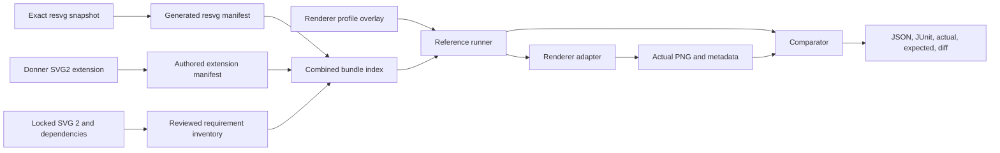

# Design: Donner SVG2 Test Suite

**Status:** Draft
**Author:** Claude Fable 5 (reviewed; drafted by GPT-5.6 Sol)
**Created:** 2026-07-12

## Summary

Create a reusable `donner-svg2-test-suite` whose governing objective is measurable SVG 2
specification compliance. The suite combines a complete, reviewed inventory of SVG 2 normative
requirements with executable tests from the upstream `resvg-test-suite`, Donner-authored gap
cases, and other approved conformance sources. A renderer integrator consumes one versioned bundle
and gets both initial corpora:

- the unmodified resvg base suite, pinned to an exact upstream revision; and
- Donner-authored SVG 2 cases for behavior that resvg does not cover or cannot isolate.

The suite is not tied to Donner's C++ test fixture. Test inputs, resources, reference images,
normative requirement IDs, and specification assertions live in portable manifests. Each library
supplies adapters for the conformance surfaces it implements, beginning with static rendering and
expanding to parsing, DOM behavior, computed style, accessibility, animation, resource loading,
and interaction. A reference runner validates manifests, invokes adapters without shell
interpolation, compares typed results, and emits machine-readable compliance evidence.

Engine-specific skips, expected failures, thresholds, and alternate goldens are profile overlays,
not properties of the canonical corpus. This keeps a Donner limitation from becoming a claim about
SVG 2 or about another renderer.

The upstream resvg suite is a valuable base corpus, not the definition of SVG 2 compliance. The
normative requirement inventory is the source of truth: imported tests receive requirement links,
missing requirements remain visible gaps, and skips never count as coverage. WPT and future
scripted or DOM tests plug into the same requirement model rather than forming a separate
compliance story.

This design is the portable suite and adapter layer within the broader conformance program in
[0026](0026-svg_conformance_testing.md).

## Goals

- Provide one composable distribution that runs the resvg base and Donner SVG 2 extension with the
  same command, result schema, and reporting pipeline.
- Audit every normative SVG 2 requirement, including conformance classes and processing modes, and
  give each requirement a stable ID, applicability classification, and evidence state.
- Track every normative dependency used by SVG 2 or by the suite, migrate to the latest published
  non-draft specification where one exists, and expose draft-only dependencies as blockers rather
  than silently treating them as stable.
- Let any SVG library integrate by implementing a documented render adapter rather than porting
  Donner's Bazel or GoogleTest code.
- Add focused SVG 2 tests where resvg lacks coverage, with a specification citation and a single
  stated assertion for every case.
- Preserve upstream resvg paths and goldens byte-for-byte so base-suite updates remain auditable.
- Separate canonical test facts from renderer-specific expectation policy.
- Make corpus releases deterministic, offline-runnable, license-complete, and bound to exact source
  revisions and file hashes.
- Give Donner a generated adapter to its existing renderer configurations without creating a
  second image-comparison implementation.
- Make stale override detection routine by supporting a strict audit mode in the reference runner.
- Generate scoped compliance reports that state the exact SVG 2 baseline, dependency lock,
  conformance class, processing mode, adapter capabilities, passed requirements, and open gaps.

## Non-Goals

- Forking or rewriting `resvg-test-suite`.
- Treating a PNG match, test count, percentage, unsupported feature, expected failure, or skip as
  proof of complete SVG 2 conformance.
- Replacing WPT, the W3C SVG 1.1 corpus, or the multi-source plan in [0026].
- Supporting scripted DOM, events, animation timing, browser layout, or JavaScript in the first
  release. These remain required surfaces for the complete SVG 2 program and cannot be removed
  from the requirement inventory or compliance report.
- Standardizing one rasterizer's anti-aliasing as the only conforming output.
- Publishing a new repository or release artifact before its security, licensing, provenance, and
  reproducibility gates are implemented and reviewed.
- Moving Donner's current implementation-profile exceptions into the canonical extension manifest.
- Making an unqualified "SVG 2 compliant" claim while any applicable mandatory requirement is
  missing, failing, unsupported, tied only to a draft dependency, or unreviewed.

## Next Steps

- Complete the chapter-by-chapter SVG 2 normative requirement audit and the direct and transitive
  specification dependency ledger before selecting pilot cases.
- Complete the current resvg override audit and map every retained policy and base test to the
  audited requirement IDs it exercises.
- Build a small pilot bundle with representative resvg cases and 10 focused Donner SVG 2 cases,
  while retaining the full uncovered-requirement inventory.
- Validate the adapter protocol with Donner and one independent renderer integration before freezing
  schema version 1.

## Implementation Plan

- [ ] Milestone 0: Establish the SVG 2 compliance baseline
  - [ ] Pin the exact SVG 2 formal publication and current-editorial-delta revisions.
  - [ ] Inventory every normative requirement by chapter, conformance class, and processing mode.
  - [ ] Build and review the complete direct dependency ledger and the transitive dependencies used
        by applicable SVG 2 requirements.
  - [ ] Resolve each dependency to its latest published non-draft edition or record a visible
        draft-only blocker.
  - [ ] Publish the initial requirement-to-test gap report without converting unsupported or
        untested requirements into exclusions.
- [ ] Milestone 1: Define the portable corpus, requirement, dependency, and profile schemas
  - [ ] Specify stable test IDs, oracle types, requirements, resources, and spec assertions.
  - [ ] Specify stable normative requirement IDs, applicability, evidence states, and dependency
        edges.
  - [ ] Specify renderer profile overlays and precedence rules.
  - [ ] Add schema validation and path-safety tests.
- [ ] Milestone 2: Build the reference runner and adapter protocol
  - [ ] Implement structured adapter invocation without shell command templates.
  - [ ] Reuse Donner's pixel comparison implementation for the Donner adapter.
  - [ ] Emit JSON and JUnit result files with actual, expected, and diff artifacts.
- [ ] Milestone 3: Package the resvg base layer
  - [ ] Pin an exact upstream commit and preserve upstream files unchanged.
  - [ ] Generate the base manifest from the upstream tree.
  - [ ] Include upstream license, font licenses, source revision, and file hashes.
- [ ] Milestone 4: Author the Donner SVG 2 extension
  - [ ] Select audited requirements not isolated by resvg or WPT and assign stable test IDs.
  - [ ] Add minimal SVGs, deterministic resources, goldens, and spec citations.
  - [ ] Require independent oracle review for every committed reference image.
- [ ] Milestone 5: Expand beyond static raster conformance
  - [ ] Add typed adapters and oracles for parsing, DOM, computed style, accessibility, resources,
        deterministic animation, and interaction.
  - [ ] Import applicable WPT tests without weakening their assertions or metadata.
  - [ ] Cover every applicable mandatory requirement or retain it as an explicit failing gap.
- [ ] Milestone 6: Integrate and distribute
  - [ ] Add Donner Bazel targets for base, extension, combined, and strict-audit lanes.
  - [ ] Validate the portable CLI with a second renderer adapter.
  - [ ] Produce a reproducible bundle and candidate record for release review.

## User Stories

- As an SVG library maintainer, I can implement one render adapter and run both the resvg corpus and
  Donner's SVG 2 extension without adopting Donner's build system.
- As a test author, I can add one minimal SVG 2 case with its assertion and oracle without editing a
  renderer-specific C++ policy map.
- As a maintainer, I can audit all expected failures and tolerances against current output and see
  which policies have become stale.
- As a release reviewer, I can identify the exact upstream resvg revision, extension revision,
  manifest schema, licenses, and hashes in a test-bundle artifact.

## Background

Donner currently discovers the upstream resvg corpus in
`donner/svg/renderer/tests/resvg_test_suite.cc`. That integration provides valuable broad rendering
coverage, but its C++ override map combines several different kinds of information:

- corpus requirements, such as text or filter support;
- Donner implementation gaps;
- undefined or deprecated input policy;
- numeric rasterization budgets;
- alternate reference images; and
- backend-specific expectations.

Those are necessary for Donner's current CI, but they are not a reusable test-suite interface. A
second renderer should not inherit Donner's expected failures, and a canonical SVG 2 case should not
silently change meaning because one backend needs a different edge-rasterization oracle.

The resvg suite is MIT-licensed and already separates tests, resources, fonts, and reference PNGs.
The Donner extension follows that useful filesystem pattern while adding explicit manifests,
profile overlays, stable IDs, and a renderer adapter contract.

## SVG 2 Baseline and Compliance Scope

The canonical SVG 2 entry point is [the W3C technical report](https://www.w3.org/TR/SVG2/). At the
time of this design, it resolves to the 4 October 2018 Candidate Recommendation. Its own status
section says that it remains a draft and work in progress. There is no SVG 2 W3C Recommendation to
use as a final, non-draft standard. The suite therefore makes the limitation explicit instead of
silently treating an Editor's Draft as a released standard:

- the **formal baseline** is an exact, dated W3C SVG 2 publication with a content digest;
- the **editorial delta baseline** is an exact SVG Working Group source revision used to audit
  changes since the formal publication; and
- compliance reports name the exact baseline and never shorten a scoped result to an unqualified
  "SVG 2 compliant" claim.

The editorial delta lane detects new, changed, and removed requirements. It is advisory until a
reviewed baseline-upgrade packet classifies every delta and updates affected tests. An Editor's
Draft change cannot silently alter the compliance denominator.

SVG 2 defines conformance by software class and processing mode. The audit covers all software
classes named by the specification: generator, authoring tool, server, interpreter, viewer, and
high-quality viewer. It also covers dynamic interactive, animated, secure animated, static, and
secure static processing modes. An integration profile declares the classes and modes it
implements. The initial render adapter exercises interpreter and viewer requirements in static and
secure static modes, but requirements for other classes and modes remain in the matrix as visible
gaps until typed adapters cover them.

## Full Normative Compliance Audit

The suite begins from requirements, not from available tests. A reproducible audit tool reads the
locked SVG 2 source and emits candidate normative statements. Reviewers then inspect every chapter,
table, algorithm, IDL block, processing-mode rule, error rule, and conformance-class rule. Keyword
search alone is insufficient because SVG 2 uses normative language without always capitalizing RFC
2119 terms.

Each reviewed requirement record contains:

- a stable requirement ID derived from the locked specification ID, section anchor, and reviewed
  ordinal;
- exact source specification revision, section, anchor, and a short paraphrased assertion;
- normative strength and subject, such as user agent, viewer, author, or generator;
- applicable software classes, processing modes, feature flags, and security mode;
- direct dependency requirement IDs where behavior is defined by another specification;
- one or more typed oracle kinds capable of proving the assertion;
- linked test IDs and independent review state; and
- evidence state with rationale and artifact references.

Requirement IDs do not contain prose hashes, so editorial wording changes do not churn test IDs.
The audit records a source-text hash separately and requires review whenever it changes. The planned
`//tools/donner_svg2_suite:spec_coverage_lint` target fails for duplicate IDs, orphaned tests, stale
anchors, unreviewed source changes, requirements without a state, tests without requirements, and
requirements incorrectly mapped across conformance modes.

Evidence states are deliberately non-interchangeable:

- `covered-pass`: all required typed assertions pass in the named profile;
- `covered-fail`: a test exists and demonstrates non-conforming behavior;
- `missing-test`: the requirement is applicable but has no adequate test;
- `unsupported`: the implementation declares the applicable feature absent;
- `not-applicable`: the requirement is outside the explicitly selected software class or mode;
- `not-directly-testable`: objective automated evidence is unavailable and reviewed manual evidence
  is required;
- `spec-ambiguity`: the requirement cannot be made into one defensible assertion; and
- `draft-dependency`: the requirement depends on a specification without an approved stable
  baseline.

Only `covered-pass` contributes passing compliance evidence. `unsupported`, `missing-test`,
`covered-fail`, `not-directly-testable` without current manual evidence, `spec-ambiguity`, and
`draft-dependency` remain visible blockers. `not-applicable` requires a cited conformance rule and
review; a renderer profile cannot use it to hide an implemented-but-wrong feature.

The audit produces three versioned artifacts:

1. `requirements.json`, the complete SVG 2 normative inventory;
2. `coverage.json`, requirement-to-test and test-to-requirement edges; and
3. `gaps.json`, all failing, unsupported, untested, ambiguous, or blocked requirements.

The planned `//tools/donner_svg2_suite:spec_audit_reproducibility_tests` target regenerates these
artifacts from the locked sources and fails on differences. The generated compliance report always
includes all three artifact digests.

## Normative Dependency Ledger

The formal SVG 2
[normative references](https://www.w3.org/TR/2018/CR-SVG2-20181004/refs.html) span multiple
standards organizations and include references that have newer stable successors as well as
references that remain drafts. The dependency ledger starts with every direct normative reference
and follows the transitive references actually needed by applicable SVG 2 requirements. It groups
the direct families below, while the lock enumerates every reference individually:

| Family                   | Direct SVG 2 dependency surface                                                                                                                                                                                                                                                    |
| ------------------------ | ---------------------------------------------------------------------------------------------------------------------------------------------------------------------------------------------------------------------------------------------------------------------------------- |
| CSS and graphics         | CSS 2, Cascade, Color, Fonts, Inline Layout, Text, Text Decoration, Masking, CSSOM, DOM Level 2 Style, Basic UI, Transforms, Values and Units, Images, Overflow, Shapes, Writing Modes, Scoping, Compositing and Blending, Filter Effects, Geometry Interfaces, and Web Animations |
| Web platform             | DOM, HTML, Fetch, URL, Web IDL, ECMAScript, Clipboard, UI Events, and Referrer Policy                                                                                                                                                                                              |
| Accessibility            | ATAG, WAI-ARIA, Graphics ARIA, and SVG Accessibility API Mappings                                                                                                                                                                                                                  |
| XML, media, and language | XML, Namespaces in XML, XML Base, XML Stylesheet, XLink, XML media types, MIME, Media Fragments, PNG, JPEG, WOFF, sRGB, Unicode, BCP 47, SMIL, and SMIL Animation                                                                                                                  |
| Internet protocols       | The URI, IRI, data URL, HTTP, media type, compression, ABNF, and normative-keyword RFC chains referenced by SVG 2                                                                                                                                                                  |

The ledger resolves each family to the latest published non-draft standard that defines the needed
behavior, not merely the older citation copied into SVG 2. Resolution policy is deterministic:

- W3C dependencies target the latest Recommendation. If no Recommendation covers the required
  behavior, the latest dated Candidate Recommendation Snapshot may be tracked provisionally, but it
  remains a `draft-dependency` blocker because W3C identifies Candidate Recommendations as drafts.
- WHATWG Living Standards target the current standard while pinning an exact source revision and
  retrieval date for reproducibility.
- IETF dependencies follow `Updates` and `Obsoletes` relationships to the current RFC, BCP, or STD
  series and pin exact RFC numbers.
- Ecma, ISO, IEC, Unicode, and other standards target the latest published edition that defines the
  required behavior and record the exact edition identifier.
- A draft, Editor's Draft, nightly URL, or floating branch is never selected as a stable target. If
  no non-draft source exists, the ledger records the gap and the affected requirements cannot be
  reported as passing stable compliance.

Each lock entry records the canonical URL, organization, title, status, publication or edition,
immutable revision or content digest, successor relationship, SVG 2 requirement IDs that use it,
last audit revision, and whether the baseline is stable or provisional. The normal test runner is
offline and consumes only the lock. A separate updater contacts official standards sources and
produces a reviewable upgrade packet containing source diffs, requirement deltas, affected tests,
and compatibility findings.

Dependency upgrades are never automatic edits. The packet must update the lock, requirement
inventory, affected oracles, and gap report together. The planned
`//tools/donner_svg2_suite:spec_dependency_tests` target rejects floating URLs, unpinned Living
Standards, stale successor relationships recorded in the reviewed update packet, and requirements
whose dependency revision is absent from the result metadata.

## Requirements and Constraints

- The combined suite must run without public network access after the bundle is fetched. Tests for
  external-resource behavior use runner-controlled, manifest-declared synthetic origins inside the
  case sandbox.
- Every input and reference must be addressable through a path relative to its declared corpus root.
- A manifest may not escape its corpus root through `..`, symlinks, absolute paths, URLs, or archive
  entries.
- Test IDs remain stable across file renames and are globally namespaced as `resvg/...` or
  `donner-svg2/...`.
- The resvg layer preserves upstream bytes. Local policy belongs in a profile overlay.
- The extension uses deterministic, redistributable fonts and resources with recorded licenses.
- Canonical cases do not contain renderer names or implementation-specific expected outcomes.
- The runner accepts explicit adapter executables and argument arrays. It does not evaluate shell
  strings.
- Result artifacts identify the bundle digest, adapter identity, profile, test ID, and comparison
  policy.
- Result artifacts identify the exact SVG 2 formal baseline, editorial delta, specification
  dependency lock, requirement IDs, conformance classes, and processing modes.
- Schema evolution is versioned and backward-compatible within a major version.

## Proposed Architecture



### Repository and bundle layout

```text
bundle/
  bundle.json
  LICENSES/
  specifications/
    baseline.lock.json
    requirements.json
    coverage.json
    gaps.json
  corpora/
    resvg/
      manifest.json
      tests/
      resources/
      fonts/
    donner-svg2/
      manifest.json
      tests/
      resources/
      fonts/
  schemas/
    corpus-v1.schema.json
    profile-v1.schema.json
    result-v1.schema.json
```

The canonical extension should ultimately live in a standalone public repository so consumers do
not need to fetch Donner's engine source. Donner may incubate the pilot under `third_party/` and
`tools/` while the schema changes quickly, but the first public suite release must have a stable
repository, independent version, and immutable release artifact.

### Corpus manifest

The manifest records facts about tests, not expectations for a particular renderer.

```json
{
  "schema": "https://donner.graphics/svg2-suite/corpus-v1.schema.json",
  "corpus": "donner-svg2",
  "revision": "<git-sha>",
  "tests": [
    {
      "id": "donner-svg2/painting/paint-order/tspan-boundary",
      "input": "tests/painting/paint-order/tspan-boundary.svg",
      "oracle": {
        "kind": "png",
        "path": "tests/painting/paint-order/tspan-boundary.png",
        "width": 500,
        "height": 500,
        "provenance": "independently-reviewed-reference"
      },
      "assertion": "paint-order does not split shaping across a paint-only tspan",
      "spec_requirements": ["svg2-cr-20181004/painting/paint-order/req-03"],
      "capabilities": ["text", "paint-order"],
      "resources": ["fonts/NotoSans-Regular.ttf"]
    }
  ]
}
```

Required test fields are `id`, `input`, `oracle`, `assertion`, `spec_requirements`, and
`capabilities`. The manifest validator rejects duplicate IDs, missing files, undeclared resources,
hash mismatches, unsafe paths, unsupported schema versions, unknown requirement IDs, and tests whose
assertion does not have a reviewed coverage edge. The planned
`//tools/donner_svg2_suite:manifest_validation_tests` CI target enforces these rules.

PNG is one typed oracle, not the universal protocol. The schema also supports parse/error results,
DOM queries, computed-style records, accessibility trees, resource-request traces, event traces,
and deterministic animation samples. Each oracle declares which adapter capability it needs and
which part of the linked normative assertion it proves. Compound requirements may link multiple
tests and oracle kinds.

### Renderer profile overlay

A profile expresses what one engine configuration currently expects:

```json
{
  "schema": "https://donner.graphics/svg2-suite/profile-v1.schema.json",
  "profile": "donner-geode",
  "cases": {
    "resvg/text/textPath/simple-case": {
      "expectation": "pass",
      "comparison": { "threshold": 0.02, "max_mismatched_pixels": 100 }
    },
    "resvg/text/direction/rtl": {
      "expectation": "unsupported",
      "reason": "requires bidi-shaping"
    }
  }
}
```

Profile states are intentionally small:

- `pass`: render and compare with the selected oracle and comparison policy;
- `unsupported`: skip before render because a declared capability is absent;
- `expected-fail`: run and require a comparison failure while retaining artifacts;
- `render-only`: require parse and render success where the canonical oracle is intentionally not
  meaningful.

`expected-fail` is preferable to an unconditional skip for implemented-but-wrong behavior because
it detects both crashes and unexpected fixes. When an expected failure passes, the runner fails the
audit lane and asks the maintainer to remove or narrow the policy.

Profile states describe execution policy only. They do not replace requirement evidence states:
an `unsupported`, `expected-fail`, or `render-only` profile case remains non-passing in the
compliance matrix.

Profiles may override comparison budgets or select an alternate exact oracle, but every such entry
requires a machine-readable reason category and a human-readable rationale. The canonical corpus
never inherits those overrides.

### Adapter protocol

The reference runner invokes an adapter executable with structured arguments:

```text
svg-render-adapter render
  --request request.json
  --response response.json
```

The request contains the typed operation, normalized input path, output paths, resource root, font
root, processing mode, deterministic clock and event inputs where applicable, and declared
capabilities. The response contains typed results, diagnostics, and timing. Render responses include
dimensions and pixel format; other operations return their declared structured oracle data. Paths
are absolute only after runner-side validation and always point inside a per-case sandbox.

Adapter and runner statuses are explicit and non-overlapping: `pass`, `comparison-fail`,
`unsupported`, `expected-fail`, `render-only`, `adapter-error`, `timeout`, and
`infrastructure-error`. The result schema records one status per test and backend. Aggregate
process exit status is never used to infer that individual cases passed, because a successful test
process may contain skipped or unsupported cases.

The runner never concatenates a shell command. Adapter exit status and response status are both
checked. A render operation must return an 8-bit RGBA PNG with the requested dimensions; every
other operation must return data conforming to its typed result schema. A renderer may provide a
native in-process integration for performance, but it must pass the same adapter contract tests as
the process implementation.

### Composition and precedence

`bundle.json` lists corpus manifests in order and verifies their hashes. Test IDs are namespaced, so
the extension cannot shadow an upstream resvg case. Profile overlays key by stable ID and may apply
to either corpus.

Policy precedence is:

1. locked specification requirements and applicability rules;
2. corpus facts and required capabilities;
3. selected renderer profile; and
4. command-line test selection only.

Command-line flags may select tests or enable strict audit mode, but may not silently relax a
comparison budget. This is enforced by planned runner tests under
`//tools/donner_svg2_suite:runner_tests`.

### Oracle governance

Donner-authored extension cases prefer the narrowest typed oracle that proves the linked normative
assertion. Static rendering cases prefer exact reference PNGs. Each reference records how it was
produced and requires review independent of the implementation under test. Acceptable provenance
includes a second conforming renderer plus specification inspection, or a manually constructed
expected image for a simple geometric assertion.

Imported corpus membership is not sufficient provenance. A resvg or WPT case contributes
`covered-pass` evidence only after its assertion, applicability, requirement mapping, and oracle are
reviewed under the same rules as a Donner-authored case. Until then it remains useful regression
coverage but does not reduce the SVG 2 gap count. In particular, a resvg reference image is not
assumed conforming merely because it is the upstream golden.

Rasterization differences are handled in renderer profiles, not by multiplying canonical goldens.
An alternate backend golden is acceptable only when the geometry and compositing are independently
verified and the remaining difference is an isolated rasterization policy. The profile records that
diagnosis and the strict audit lane continues comparing it against the canonical oracle.

## Override Audit and Maintenance

The reference runner provides two audit modes:

- `--audit-policy`: run every profile-bearing case with its policy removed and report policies that
  are no longer needed.
- `--audit-oracles`: compare alternate oracles and renderer output against the canonical oracle,
  retaining all images and mismatch measurements.

Audit output classifies each profile entry as:

- `confirmed`: strict comparison still fails for the stated reason;
- `stale`: strict comparison passes in every applicable configuration;
- `over-broad`: the policy is needed only for a subset of configurations;
- `misdiagnosed`: output still fails, but evidence contradicts the recorded cause;
- `inconclusive`: the run lacks a required backend, font tier, or independent oracle.

The planned `//donner/svg/renderer/tests:resvg_override_audit` target runs the Donner profiles across
TinySkia, Geode, simple text, and full text. It fails when a policy becomes stale or when its reason
category is missing. This turns override cleanup from a manual campaign into a recurring gate.
The audit consumes machine-readable per-test statuses and reports pass, fail, and unsupported skip
counts separately. An unsupported backend result is `inconclusive` for that profile entry, never a
strict pass and never evidence that an override is stale.

## Versioning and Distribution

The suite has five independently visible versions:

- bundle version;
- manifest schema major/minor version;
- exact SVG 2 formal and editorial-delta revisions;
- specification dependency-lock digest; and
- exact resvg and Donner-extension source revisions.

A release artifact is content-addressed and includes manifests, files, licenses, source revisions,
and SHA-256 hashes. Building the same release from the same lock must produce the same archive
digest; `//tools/donner_svg2_suite:bundle_reproducibility_tests` enforces that property.

The first supported distribution formats are a `.tar.zst` bundle and a Git checkout. Bazel modules,
CMake helpers, and package-manager wrappers consume the same archive rather than repackaging the
corpora differently.

## Security and Privacy

SVG inputs and bundled resources are untrusted. The runner must assume malformed XML, decompression
bombs, cyclic references, pathological paths, oversized filters, and resource-exhaustion attempts.

- Rendering defaults to no network and uses explicit CPU, memory, output-size, and wall-time limits.
- External-resource tests receive isolated synthetic origins with no public egress. Only URLs and
  responses declared by the case manifest are served, and the result includes the complete request
  trace.
- File resource lookup is rooted in the case sandbox. Undeclared URLs, public egress, absolute
  paths, path traversal, and symlink escapes are rejected before adapter invocation.
- Archive extraction validates every entry before writing it.
- Adapter commands are executable-plus-argument arrays, never shell strings.
- Manifests and bundle contents are verified against hashes before execution.
- Results redact host paths and do not include input bytes unless explicitly requested.
- Fonts and other redistributable assets retain their licenses and attribution.

The planned `//tools/donner_svg2_suite:security_tests` target covers traversal, symlink escape,
archive escape, undeclared URL rejection, public-egress denial, synthetic-origin isolation, output
spoofing, malformed responses, timeouts, and resource caps. Parser and manifest code receives
structured fuzz coverage before the first public release.

## Testing and Validation

- `//tools/donner_svg2_suite:spec_audit_reproducibility_tests`: complete normative inventory,
  stable requirement IDs, reviewed source hashes, and deterministic audit output.
- `//tools/donner_svg2_suite:spec_coverage_lint`: bidirectional requirement/test links,
  conformance applicability, explicit gap states, and no skip-as-pass accounting.
- `//tools/donner_svg2_suite:spec_dependency_tests`: exact specification locks, stable-baseline
  policy, successor tracking, and result provenance.
- `//tools/donner_svg2_suite:manifest_validation_tests`: schemas, stable IDs, file existence,
  resources, hashes, requirement links, and path safety.
- `//tools/donner_svg2_suite:adapter_contract_tests`: request/response compatibility, dimensions,
  typed oracle data, error handling, timeout behavior, and deterministic fixtures.
- `//tools/donner_svg2_suite:runner_tests`: profile precedence, expected-fail semantics, strict audit,
  pass/fail/skip separation, artifact naming, and JSON/JUnit output.
- `//tools/donner_svg2_suite:compliance_report_tests`: exact baseline identity, complete gap
  disclosure, scoped claim language, and reproducible evidence digests.
- `//tools/donner_svg2_suite:security_tests`: hostile manifest, archive, path, and adapter cases.
- `//tools/donner_svg2_suite:bundle_reproducibility_tests`: byte-identical archive production and
  complete license/provenance records.
- `//donner/svg/renderer/tests:donner_svg2_suite`: Donner adapter against the extension corpus.
- `//donner/svg/renderer/tests:resvg_test_suite`: Donner adapter against the pinned resvg base.
- `//donner/svg/renderer/tests:combined_svg2_suite`: both manifests through one bundle and report.
- A second renderer adapter must pass the adapter contract and pilot corpus before schema v1 is
  frozen.

## Rollout Plan

1. Lock the SVG 2 formal and editorial-delta baselines, complete the chapter-by-chapter normative
   audit, and review the latest-stable dependency ledger.
2. Map existing resvg, Donner, and applicable WPT tests to the requirement inventory and publish the
   complete initial gap report.
3. Land schemas and a 10-case pilot without changing Donner's existing resvg gate.
4. Add the Donner adapter and prove result parity with the existing fixture for the pilot resvg
   subset.
5. Add a second renderer adapter and resolve portability findings.
6. Generate the complete resvg base manifest and run it in advisory CI beside the existing target.
7. Add non-raster adapters in requirement-risk order until all applicable SVG 2 surfaces have an
   executable or reviewed manual evidence path.
8. Switch Donner to the combined runner only after both paths produce equivalent test selection,
   comparison policy, and artifacts.
9. Complete release security, licensing, and reproducibility review before publishing the first
   standalone bundle.

Rollback keeps the existing `resvg_test_suite` target until combined-runner parity is proven. A
bundle release is immutable; rollback selects an earlier reviewed bundle digest rather than
rebuilding old source.

## Alternatives Considered

### Keep extending `resvg_test_suite.cc`

This is efficient for Donner but not reusable. It also continues mixing corpus facts with one
engine's policy and makes non-Bazel integrations unnecessarily difficult.

### Fork `resvg-test-suite`

A fork would obscure upstream identity and make updates harder to review. Composition preserves a
clean base and gives extension cases their own namespace and governance.

### Put all policy in the canonical manifest

That would make Donner's limitations look universal. Renderer profiles preserve portability and
allow strict audits without mutating corpus data.

### Require each renderer to embed a language-specific library

That offers speed but excludes projects with incompatible build systems or languages. A process
adapter is the interoperability baseline; native bindings remain optional optimizations.

## Open Questions

- Which independent renderer should validate the pilot adapter contract?
- Should schema v1 standardize pixelmatch parameters or define a smaller comparison-policy enum?
- Which first 10 SVG 2 gaps best demonstrate value without duplicating WPT?
- Which reviewed manual-evidence format is acceptable for normative requirements that cannot be
  automated without implementation internals?
- Should the editorial delta lane follow every SVG Working Group commit or a scheduled reviewed
  snapshot?
- Should the standalone repository vendor the exact resvg snapshot in releases or fetch it from the
  locked revision during bundle construction?
- What public namespace and domain should host schemas before the first release?

## Future Work

- [ ] Add generators and authoring-tool adapters after interpreter and viewer profiles are mature.
- [ ] Publish a support dashboard generated from result JSON without making dashboard generation a
      test dependency.
- [ ] Provide adapters for common SVG libraries as examples, maintained independently of the
      canonical corpus.
