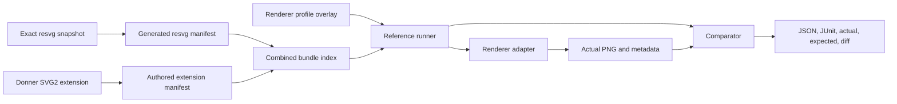

# Design: Donner SVG2 Test Suite

**Status:** Draft
**Author:** GPT-5.6 Sol
**Created:** 2026-07-12

## Summary

Create a reusable `donner-svg2-test-suite` that extends the upstream
`resvg-test-suite` with focused SVG 2 coverage and a vendor-neutral adapter layer. A renderer
integrator consumes one versioned bundle and gets both corpora:

- the unmodified resvg base suite, pinned to an exact upstream revision; and
- Donner-authored SVG 2 cases for behavior that resvg does not cover or cannot isolate.

The suite is not tied to Donner's C++ test fixture. Test inputs, resources, reference images,
requirements, and specification assertions live in portable manifests. Each renderer supplies an
adapter that implements a small render-to-PNG protocol. A reference runner validates manifests,
invokes the adapter without shell interpolation, compares output, and emits machine-readable
results.

Engine-specific skips, expected failures, thresholds, and alternate goldens are profile overlays,
not properties of the canonical corpus. This keeps a Donner limitation from becoming a claim about
SVG 2 or about another renderer.

This design is the reusable static-rendering layer within the broader conformance program in
[0026](0026-svg_conformance_testing.md). It does not replace WPT or scripted DOM conformance.

## Goals

- Provide one composable distribution that runs the resvg base and Donner SVG 2 extension with the
  same command, result schema, and reporting pipeline.
- Let any SVG library integrate by implementing a documented render adapter rather than porting
  Donner's Bazel or GoogleTest code.
- Add focused SVG 2 tests where resvg lacks coverage, with a specification citation and a single
  stated assertion for every case.
- Preserve upstream resvg paths and goldens byte-for-byte so base-suite updates remain auditable.
- Separate canonical test facts from renderer-specific expectation policy.
- Make corpus releases deterministic, offline-runnable, license-complete, and bound to exact source
  revisions and file hashes.
- Give Donner a generated adapter to its existing renderer configurations without creating a
  second image-comparison implementation.
- Make stale override detection routine by supporting a strict audit mode in the reference runner.

## Non-Goals

- Forking or rewriting `resvg-test-suite`.
- Claiming that a PNG match alone proves complete SVG 2 conformance.
- Replacing WPT, the W3C SVG 1.1 corpus, or the multi-source plan in [0026].
- Supporting scripted DOM, events, animation timing, browser layout, or JavaScript in the first
  release.
- Standardizing one rasterizer's anti-aliasing as the only conforming output.
- Publishing a new repository or release artifact before its security, licensing, provenance, and
  reproducibility gates are implemented and reviewed.
- Moving Donner's current implementation-profile exceptions into the canonical extension manifest.

## Next Steps

- Complete the current resvg override audit and use its findings to finalize profile semantics.
- Build a small pilot bundle with representative resvg cases and 10 focused Donner SVG 2 cases.
- Validate the adapter protocol with Donner and one independent renderer integration before freezing
  schema version 1.

## Implementation Plan

- [ ] Milestone 1: Define the portable corpus and profile schemas
  - [ ] Specify stable test IDs, oracle types, requirements, resources, and spec assertions.
  - [ ] Specify renderer profile overlays and precedence rules.
  - [ ] Add schema validation and path-safety tests.
- [ ] Milestone 2: Build the reference runner and adapter protocol
  - [ ] Implement structured adapter invocation without shell command templates.
  - [ ] Reuse Donner's pixel comparison implementation for the Donner adapter.
  - [ ] Emit JSON and JUnit result files with actual, expected, and diff artifacts.
- [ ] Milestone 3: Package the resvg base layer
  - [ ] Pin an exact upstream commit and preserve upstream files unchanged.
  - [ ] Generate the base manifest from the upstream tree.
  - [ ] Include upstream license, font licenses, source revision, and file hashes.
- [ ] Milestone 4: Author the Donner SVG 2 extension
  - [ ] Select gaps not isolated by resvg and assign stable feature IDs.
  - [ ] Add minimal SVGs, deterministic resources, goldens, and spec citations.
  - [ ] Require independent oracle review for every committed reference image.
- [ ] Milestone 5: Integrate and distribute
  - [ ] Add Donner Bazel targets for base, extension, combined, and strict-audit lanes.
  - [ ] Validate the portable CLI with a second renderer adapter.
  - [ ] Produce a reproducible bundle and candidate record for release review.

## User Stories

- As an SVG library maintainer, I can implement one render adapter and run both the resvg corpus and
  Donner's SVG 2 extension without adopting Donner's build system.
- As a test author, I can add one minimal SVG 2 case with its assertion and oracle without editing a
  renderer-specific C++ policy map.
- As a maintainer, I can audit all expected failures and tolerances against current output and see
  which policies have become stale.
- As a release reviewer, I can identify the exact upstream resvg revision, extension revision,
  manifest schema, licenses, and hashes in a test-bundle artifact.

## Background

Donner currently discovers the upstream resvg corpus in
`donner/svg/renderer/tests/resvg_test_suite.cc`. That integration provides valuable broad rendering
coverage, but its C++ override map combines several different kinds of information:

- corpus requirements, such as text or filter support;
- Donner implementation gaps;
- undefined or deprecated input policy;
- numeric rasterization budgets;
- alternate reference images; and
- backend-specific expectations.

Those are necessary for Donner's current CI, but they are not a reusable test-suite interface. A
second renderer should not inherit Donner's expected failures, and a canonical SVG 2 case should not
silently change meaning because one backend needs a different edge-rasterization oracle.

The resvg suite is MIT-licensed and already separates tests, resources, fonts, and reference PNGs.
The Donner extension follows that useful filesystem pattern while adding explicit manifests,
profile overlays, stable IDs, and a renderer adapter contract.

## Requirements and Constraints

- The combined suite must run without network access after the bundle is fetched.
- Every input and reference must be addressable through a path relative to its declared corpus root.
- A manifest may not escape its corpus root through `..`, symlinks, absolute paths, URLs, or archive
  entries.
- Test IDs remain stable across file renames and are globally namespaced as `resvg/...` or
  `donner-svg2/...`.
- The resvg layer preserves upstream bytes. Local policy belongs in a profile overlay.
- The extension uses deterministic, redistributable fonts and resources with recorded licenses.
- Canonical cases do not contain renderer names or implementation-specific expected outcomes.
- The runner accepts explicit adapter executables and argument arrays. It does not evaluate shell
  strings.
- Result artifacts identify the bundle digest, adapter identity, profile, test ID, and comparison
  policy.
- Schema evolution is versioned and backward-compatible within a major version.

## Proposed Architecture



### Repository and bundle layout

```text
bundle/
  bundle.json
  LICENSES/
  corpora/
    resvg/
      manifest.json
      tests/
      resources/
      fonts/
    donner-svg2/
      manifest.json
      tests/
      resources/
      fonts/
  schemas/
    corpus-v1.schema.json
    profile-v1.schema.json
    result-v1.schema.json
```

The canonical extension should ultimately live in a standalone public repository so consumers do
not need to fetch Donner's engine source. Donner may incubate the pilot under `third_party/` and
`tools/` while the schema changes quickly, but the first public suite release must have a stable
repository, independent version, and immutable release artifact.

### Corpus manifest

The manifest records facts about tests, not expectations for a particular renderer.

```json
{
  "schema": "https://donner.graphics/svg2-suite/corpus-v1.schema.json",
  "corpus": "donner-svg2",
  "revision": "<git-sha>",
  "tests": [
    {
      "id": "donner-svg2/painting/paint-order/tspan-boundary",
      "input": "tests/painting/paint-order/tspan-boundary.svg",
      "oracle": {
        "kind": "png",
        "path": "tests/painting/paint-order/tspan-boundary.png",
        "width": 500,
        "height": 500,
        "provenance": "independently-reviewed-reference"
      },
      "assertion": "paint-order does not split shaping across a paint-only tspan",
      "spec": ["https://svgwg.org/svg2-draft/painting.html#PaintOrder"],
      "requirements": ["text", "paint-order"],
      "resources": ["fonts/NotoSans-Regular.ttf"]
    }
  ]
}
```

Required test fields are `id`, `input`, `oracle`, `assertion`, `spec`, and `requirements`. The
manifest validator rejects duplicate IDs, missing files, undeclared resources, hash mismatches,
unsafe paths, and unsupported schema versions. The planned
`//tools/donner_svg2_suite:manifest_validation_tests` CI target enforces these rules.

### Renderer profile overlay

A profile expresses what one engine configuration currently expects:

```json
{
  "schema": "https://donner.graphics/svg2-suite/profile-v1.schema.json",
  "profile": "donner-geode",
  "cases": {
    "resvg/text/textPath/simple-case": {
      "expectation": "pass",
      "comparison": { "threshold": 0.02, "max_mismatched_pixels": 100 }
    },
    "resvg/text/direction/rtl": {
      "expectation": "unsupported",
      "reason": "requires bidi-shaping"
    }
  }
}
```

Profile states are intentionally small:

- `pass`: render and compare with the selected oracle and comparison policy;
- `unsupported`: skip before render because a declared capability is absent;
- `expected-fail`: run and require a comparison failure while retaining artifacts;
- `render-only`: require parse and render success where the canonical oracle is intentionally not
  meaningful.

`expected-fail` is preferable to an unconditional skip for implemented-but-wrong behavior because
it detects both crashes and unexpected fixes. When an expected failure passes, the runner fails the
audit lane and asks the maintainer to remove or narrow the policy.

Profiles may override comparison budgets or select an alternate exact oracle, but every such entry
requires a machine-readable reason category and a human-readable rationale. The canonical corpus
never inherits those overrides.

### Adapter protocol

The reference runner invokes an adapter executable with structured arguments:

```text
svg-render-adapter render
  --request request.json
  --response response.json
```

The request contains the normalized input path, output PNG path, resource root, font root, canvas
size, device scale, and declared capabilities. The response contains status, dimensions, pixel
format, diagnostics, and timing. Paths are absolute only after runner-side validation and always
point inside a per-case sandbox.

Adapter and runner statuses are explicit and non-overlapping: `pass`, `comparison-fail`,
`unsupported`, `expected-fail`, `render-only`, `adapter-error`, `timeout`, and
`infrastructure-error`. The result schema records one status per test and backend. Aggregate
process exit status is never used to infer that individual cases passed, because a successful test
process may contain skipped or unsupported cases.

The runner never concatenates a shell command. Adapter exit status and response status are both
checked. Output must be an 8-bit RGBA PNG with the requested dimensions. A renderer may provide a
native in-process integration for performance, but it must pass the same adapter contract tests as
the process implementation.

### Composition and precedence

`bundle.json` lists corpus manifests in order and verifies their hashes. Test IDs are namespaced, so
the extension cannot shadow an upstream resvg case. Profile overlays key by stable ID and may apply
to either corpus.

Policy precedence is:

1. corpus facts and required capabilities;
2. selected renderer profile;
3. command-line test selection only.

Command-line flags may select tests or enable strict audit mode, but may not silently relax a
comparison budget. This is enforced by planned runner tests under
`//tools/donner_svg2_suite:runner_tests`.

### Oracle governance

Donner-authored extension cases prefer exact reference PNGs for static rendering. Each reference
records how it was produced and requires review independent of the implementation under test.
Acceptable provenance includes a second conforming renderer plus spec inspection, or a manually
constructed expected image for a simple geometric assertion.

Rasterization differences are handled in renderer profiles, not by multiplying canonical goldens.
An alternate backend golden is acceptable only when the geometry and compositing are independently
verified and the remaining difference is an isolated rasterization policy. The profile records that
diagnosis and the strict audit lane continues comparing it against the canonical oracle.

## Override Audit and Maintenance

The reference runner provides two audit modes:

- `--audit-policy`: run every profile-bearing case with its policy removed and report policies that
  are no longer needed.
- `--audit-oracles`: compare alternate oracles and renderer output against the canonical oracle,
  retaining all images and mismatch measurements.

Audit output classifies each profile entry as:

- `confirmed`: strict comparison still fails for the stated reason;
- `stale`: strict comparison passes in every applicable configuration;
- `over-broad`: the policy is needed only for a subset of configurations;
- `misdiagnosed`: output still fails, but evidence contradicts the recorded cause;
- `inconclusive`: the run lacks a required backend, font tier, or independent oracle.

The planned `//donner/svg/renderer/tests:resvg_override_audit` target runs the Donner profiles across
TinySkia, Geode, simple text, and full text. It fails when a policy becomes stale or when its reason
category is missing. This turns override cleanup from a manual campaign into a recurring gate.
The audit consumes machine-readable per-test statuses and reports pass, fail, and unsupported skip
counts separately. An unsupported backend result is `inconclusive` for that profile entry, never a
strict pass and never evidence that an override is stale.

## Versioning and Distribution

The suite has three independently visible versions:

- bundle version;
- manifest schema major/minor version; and
- exact resvg and Donner-extension source revisions.

A release artifact is content-addressed and includes manifests, files, licenses, source revisions,
and SHA-256 hashes. Building the same release from the same lock must produce the same archive
digest; `//tools/donner_svg2_suite:bundle_reproducibility_tests` enforces that property.

The first supported distribution formats are a `.tar.zst` bundle and a Git checkout. Bazel modules,
CMake helpers, and package-manager wrappers consume the same archive rather than repackaging the
corpora differently.

## Security and Privacy

SVG inputs and bundled resources are untrusted. The runner must assume malformed XML, decompression
bombs, cyclic references, pathological paths, oversized filters, and resource-exhaustion attempts.

- Rendering occurs without network access and with explicit CPU, memory, output-size, and wall-time
  limits.
- Resource lookup is rooted in the case sandbox. URL fetches, absolute paths, path traversal, and
  symlink escapes are rejected before adapter invocation.
- Archive extraction validates every entry before writing it.
- Adapter commands are executable-plus-argument arrays, never shell strings.
- Manifests and bundle contents are verified against hashes before execution.
- Results redact host paths and do not include input bytes unless explicitly requested.
- Fonts and other redistributable assets retain their licenses and attribution.

The planned `//tools/donner_svg2_suite:security_tests` target covers traversal, symlink escape,
archive escape, URL rejection, output spoofing, malformed responses, timeouts, and resource caps.
Parser and manifest code receives structured fuzz coverage before the first public release.

## Testing and Validation

- `//tools/donner_svg2_suite:manifest_validation_tests`: schemas, stable IDs, file existence,
  resources, hashes, spec links, and path safety.
- `//tools/donner_svg2_suite:adapter_contract_tests`: request/response compatibility, dimensions,
  error handling, timeout behavior, and deterministic fixtures.
- `//tools/donner_svg2_suite:runner_tests`: profile precedence, expected-fail semantics, strict audit,
  pass/fail/skip separation, artifact naming, and JSON/JUnit output.
- `//tools/donner_svg2_suite:security_tests`: hostile manifest, archive, path, and adapter cases.
- `//tools/donner_svg2_suite:bundle_reproducibility_tests`: byte-identical archive production and
  complete license/provenance records.
- `//donner/svg/renderer/tests:donner_svg2_suite`: Donner adapter against the extension corpus.
- `//donner/svg/renderer/tests:resvg_test_suite`: Donner adapter against the pinned resvg base.
- `//donner/svg/renderer/tests:combined_svg2_suite`: both manifests through one bundle and report.
- A second renderer adapter must pass the adapter contract and pilot corpus before schema v1 is
  frozen.

## Rollout Plan

1. Land schemas and a 10-case pilot without changing Donner's existing resvg gate.
2. Add the Donner adapter and prove result parity with the existing fixture for the pilot resvg
   subset.
3. Add a second renderer adapter and resolve portability findings.
4. Generate the complete resvg base manifest and run it in advisory CI beside the existing target.
5. Switch Donner to the combined runner only after both paths produce equivalent test selection,
   comparison policy, and artifacts.
6. Complete release security, licensing, and reproducibility review before publishing the first
   standalone bundle.

Rollback keeps the existing `resvg_test_suite` target until combined-runner parity is proven. A
bundle release is immutable; rollback selects an earlier reviewed bundle digest rather than
rebuilding old source.

## Alternatives Considered

### Keep extending `resvg_test_suite.cc`

This is efficient for Donner but not reusable. It also continues mixing corpus facts with one
engine's policy and makes non-Bazel integrations unnecessarily difficult.

### Fork `resvg-test-suite`

A fork would obscure upstream identity and make updates harder to review. Composition preserves a
clean base and gives extension cases their own namespace and governance.

### Put all policy in the canonical manifest

That would make Donner's limitations look universal. Renderer profiles preserve portability and
allow strict audits without mutating corpus data.

### Require each renderer to embed a language-specific library

That offers speed but excludes projects with incompatible build systems or languages. A process
adapter is the interoperability baseline; native bindings remain optional optimizations.

## Open Questions

- Which independent renderer should validate the pilot adapter contract?
- Should schema v1 standardize pixelmatch parameters or define a smaller comparison-policy enum?
- Which first 10 SVG 2 gaps best demonstrate value without duplicating WPT?
- Should the standalone repository vendor the exact resvg snapshot in releases or fetch it from the
  locked revision during bundle construction?
- What public namespace and domain should host schemas before the first release?

## Future Work

- [ ] Import selected static SVG WPT reftests through the typed corpus interface from [0026].
- [ ] Add animation and scripted oracle kinds after Donner has deterministic virtual time and a
      script host.
- [ ] Publish a support dashboard generated from result JSON without making dashboard generation a
      test dependency.
- [ ] Provide adapters for common SVG libraries as examples, maintained independently of the
      canonical corpus.
