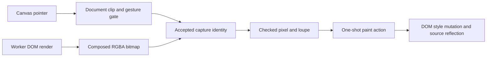

# Design: Editor Document Eyedropper

**Status:** Implementing. The document sampler and active Fill/Stroke toolbar control pass focused
native Geode tests, and [PR #1376](https://github.com/jwmcglynn/donner/pull/1376) is open for
review. Browser validation, full qualification, and green CI remain pending.
**Author:** GPT-6 Sol
**Created:** 2026-09-22
**Related:** [Issue #1304](https://github.com/jwmcglynn/donner/issues/1304)

## Summary

The editor needs a one-shot eyedropper that samples a rendered document pixel and applies its color
to the current paint. A user can sample the color of the Donner text in the showcase, choose the
Text tool, and create new text reading "SVG" with that sampled fill. The loupe makes the exact
source pixel and its alpha visible before the user commits the sample.

The source is document content inside the editor canvas. The tool does not sample app chrome,
selection handles, the transparency checkerboard, another window, or pixels outside the document.

## Goals

- Make Fill or Stroke the active foreground toolbar paint. The toolbar eyedropper and `I` sample
  into that role; a popup eyedropper explicitly activates and targets its own role.
- Let the overlapping paint control select a role without changing the document, swap paint values,
  and set the active role to `none` through one button.
- Preview the document pixel under the pointer with a legible loupe, without changing paint on
  hover.
- Apply one sampled RGBA value to the active authoring paint and, when there is a selection, to that
  selection's matching paint property through the DOM editing path.
- Preserve the alpha in the sampled SVG color and make one selected-element edit undoable as one
  document operation. Changing an authoring default alone creates no document undo entry.
- Work in native and browser Geode editor builds without a synchronous readback for each pointer
  move. A stale or unavailable sample remains visibly pending and cannot be committed.
- Make the showcase journey and the sampled document-pixel contract observable in editor tests.

## Non-Goals

- Operating-system, desktop, browser EyeDropper API, other-window, or outside-canvas sampling.
- Copying an SVG element's specified style, gradient definition, `opacity`, CSS inheritance, or
  object identity. The sampled value is a rendered pixel, including overlap and antialiasing.
- Changing target element opacity, stroke width, selection, or document geometry.
- The reference image's default-colors reset, gradient, and drawing-mode controls.
- Continuous painting, dragging to sample a range, averaging pixels, or color management changes.
- A new general-purpose GPU region-readback API or a second document compositor solely for this
  feature unless validation shows the existing worker snapshot cannot meet the contract.

## Next Steps

1. Run the browser WebGPU journeys and verify document color and alpha against the visible output.
2. Complete the affected qualification and independent review at the final source revision.
3. Resolve review and CI findings within the open pull request.

## Implementation Plan

- [x] Paint and tool interaction
  - [x] Add eyedropper tool identity, toolbar/popup entry points, shortcut capture, and cancellation.
  - [x] Share the color application path with the picker and record one selection undo entry.
  - [x] Render the loupe and pending/unavailable feedback without hover mutations.
- [x] Active Fill/Stroke foreground control
  - [x] Anchor Fill upper-left and Stroke lower-right; draw and hit-test the active role in front.
  - [x] Make the first click on the rear swatch activate it, and an active-swatch click open its picker.
  - [x] Draw the angled swap arrow and one None control that clears the active role.
  - [x] Route toolbar and shortcut sampling through the active role, with popup-specific targeting.
- [x] Worker-owned document capture
  - [x] Request a bounded composed CPU snapshot when armed or the accepted frame changes.
  - [x] Bind capture to the accepted document, font, viewport, canvas commit, and session identities.
  - [x] Validate RGBA layout, alpha conversion, memory cap, and edge sampling.
- [ ] Validation and delivery
  - [x] Add focused native tests for paint, input, capture freshness, and pixel mapping.
  - [x] Add native Geode window and browser WebGPU journey/pixel regressions.
  - [x] Publish the reviewed change as [PR #1376](https://github.com/jwmcglynn/donner/pull/1376).
  - [ ] Execute the browser target and confirm the captured SVG style and visible pixels.
  - [ ] Run final affected gates, inspect exact evidence, resolve review comments, and drive CI green.

## Background and Constraints

The namespace-level `ActivePaintStyle` owns SVG-string Fill and Stroke defaults for new elements.
`TextTool::beginEditingSession` uses the active Fill for new text; `PenTool::startNewPath` uses both
active paint slots. `EditorShell::renderFillStrokeToolbarWidget` already resolves selected paint,
opens the Fill/Stroke color popups, updates the active slot, and calls
`EditorApp::setStylePropertyOnSelection`. That method queues DOM style-attribute edits, which the
existing structured-editing path reflects into source.

`EditorShell` routes Select, Pen, and Text input, while `ToolKeybinding.h` owns their shortcut
labels. `RenderPanePresenter` draws document tiles and chrome separately. WebGPU builds composite
tiles
directly into the framebuffer under the UI; native GL builds can use
`DocumentPresentationCompositor`. Its GL texture is therefore not a shared browser/native source.
Whole-frame `EditorWindow::endFrameAndReadPixels()` captures app UI and checkerboard and is intended
for replay diagnostics, not a document-only picker.

The namespace-level `RenderRequest::captureCpuSnapshot` requests a fully composed worker bitmap
even when paint-order tiles are available. It also disables the split-frame optimization that can
leave the main renderer's bitmap stale. `RenderResult` carries the raster mapping, viewport,
document version and generation, and font-resource revision needed to reject an obsolete capture.
The worker path is the candidate shared pixel source; browser WebGPU readback and equality with
the finally presented tiles still require proof.

## Proposed Architecture

### Interaction and paint target

The toolbar presents Eyedropper beside the existing tools. Fill is initially active for an editor
session. The paired paint widget anchors Fill upper-left and Stroke lower-right, following the
reference control; their colors never trade slots merely because the foreground changes. The
active role is drawn above the rear swatch and wins their overlap hit test. Clicking the rear
swatch brings that role forward without opening a popup, changing source, or recording undo;
clicking the already-active swatch opens its existing color picker. The angled top-right swap
arrow retains the existing action of swapping Fill and Stroke paint values while leaving the active
role unchanged. One None button below it clears whichever role is active; the reference image's
default-colors reset and gradient/drawing-mode controls are outside this feature.

The toolbar eyedropper and `I` arm for the active role. The shortcut uses
the existing keyboard ownership checks: it cannot arm while source editing, in-canvas text editing,
or an ImGui text field captures typing. A button inside each existing color popup arms it for that
popup's Fill or Stroke role, makes that role active, and closes the popup so the canvas can receive
input. Choosing a different foreground role during sampling cancels the old capture first and keeps
the new role active; late worker results cannot affect it. The action stores
the previous idle tool and target role. Switching away from an active Pen or Text session follows
the existing visible commit policy; activation is refused while a transform or another gesture
cannot be safely completed. No session is committed silently.

While armed, the pointer only previews. A left click on a ready pixel applies the color once, then
restores the previous tool. Escape, right click, or a left click outside the eligible document area
cancels and restores the previous tool without changing paint. Document replacement, selection
change, window focus loss, and an explicit switch to another tool also cancel the session. An
explicit tool switch keeps the newly chosen tool. Panning and canvas chrome keep their existing
input precedence. The eyedropper does no element hit test and
leaves selection intact. A session identity prevents a late worker result from re-arming a cancelled
session or changing the target of a newer one.

An application-level paint action shared with the current color popup updates the active target
slot and selected elements' corresponding CSS style property. A selected-element change records one
source-based undo entry before the queued DOM mutations flush, including multi-selection; the
active authoring default alone stays outside document undo. This requires explicit undo handling:
the current color-popup mutation path queues style writes but does not itself call
`recordDocumentSourceUndoOnNextFlush`.

### Pixel source and freshness

Arming requests one worker render with `captureCpuSnapshot=true` for the current raster viewport.
The scheduler needs a one-shot reason to render even when the document is otherwise idle. While the
tool remains armed, document edits, font-resource changes, and relevant viewport changes invalidate
the capture and coalesce to the latest requested epoch. Pointer motion only indexes an accepted
immutable CPU bitmap; it does not request a render or GPU readback. Keep at most one eyedropper
request active, coalescing new invalidations into its latest successor. Discard an invalid capture
before accepting its replacement. Keep at most one retained accepted capture and release it when
the tool exits; worker staging and normal render buffers have separate lifetimes.

The capture identity includes document generation, exact document frame version, font-resource
revision, semantic canvas-size commit generation, raster mapping, and the presentation epoch
accepted for the canvas. A delayed canvas-size commit keeps the loupe Pending even if an earlier
capture finishes. Its idle deadline schedules the post-commit render and invalidates that earlier
capture even when the document frame version is unchanged. A result that passes
the editor's broad viewport-presentability test can still be unsuitable for sampling: a high-zoom
bounded raster may cover only part of the pane, and an overview infill or transformed drag preview
may differ from the main composed bitmap. Sampling therefore requires a settled, crisp current
frame and a pointer inside both the document clip and captured raster. While those conditions are
unmet, the loupe says Pending or Unavailable. A click during that state is ignored; it is never
replayed after an asynchronous result arrives.

Map the logical pointer through the accepted `ViewportState::screenToDocument`, then through
`EditorRasterViewport::outputFromDocument`. Convert to the containing integer device pixel and
index `RendererBitmap::pixels` with its checked dimensions and `rowBytes`. The same mapping drives
the loupe and the committed color. The 11 x 11 neighborhood is enlarged with nearest-neighbor
sampling and marks its center pixel with a crosshair. At a raster edge, keep the pointed pixel in
the center cell and show missing neighbors as empty/transparent cells; do not recenter a truncated
neighborhood. Place the loupe within the pane without moving the sampled coordinate. Display the
`#rrggbb` or `#rrggbbaa` value and an explicit alpha indication.

The bitmap's `AlphaType` controls conversion to a straight-alpha `css::RGBA` for the SVG color.
Unpremultiply RGB for nonzero alpha with clamping/rounding; canonicalize zero-alpha pixels to
transparent black. Transparent black is a color, not SVG `none`. Sampling a translucent overlap or
antialiased edge takes the document composite at that pixel before the checkerboard and chrome.
The final window framebuffer is opaque where the checkerboard appears, so its alpha is not the
sampled alpha. The loupe can show transparency over a checkerboard without writing that
checkerboard into the color.

The existing raster viewport caps dimensions at 8192 pixels per axis and bounds high-zoom captures
to the visible pane plus margin. A tight RGBA8 capture can still reach 256 MiB at that cap; a
3840 x 2160 capture is about 32 MiB. Use 256 MiB as the provisional maximum CPU pixel payload,
including row padding; reject larger dimensions or a planned row stride times height beyond the
cap before readback. Check the actual `rowBytes * height` and payload length before indexing. A
retained capture is one payload, not a total-memory ceiling: GPU readback staging, the worker
result, and ordinary render buffers can raise peak memory above 256 MiB. If the capture exceeds the
cap or readback fails, show Unavailable
and leave paint unchanged. Measure real native/browser peak memory and activation latency before
finalizing this limit.

### Frame and trust flow

## Security / Privacy

The tool has no access to desktop pixels, cross-origin browser content, or an operating-system
screen-capture permission. It reads only the editor's rendered SVG document through an existing
worker result. Untrusted SVG content can influence pixel values and raster dimensions; existing
renderer resource limits apply, and the new pixel-indexing boundary checks stride, size, overflow,
and payload completeness before reading. The sampled color remains local to the document/editor;
diagnostics should not log bitmap bytes or sampled document content.

The browser regression URL may explicitly opt into `testControl=eyedropper`. Only that URL
publishes active Fill/Stroke, the active paint role, source-pane focus and selection booleans,
current undo-entry count, document generation, source and selection byte lengths, diagnostic count
and sync-pending state, and the first selected element's style/text to the same page for assertions.
Byte lengths
are computed without copying the source; each string field is capped at 512 bytes before copying.
The bridge publishes no whole SVG source or bitmap. Ordinary editor URLs expose no eyedropper
test-state object; the browser test checks this negative boundary. The same opt-in URL may publish
bounded, content-free shortcut-gate
snapshots to diagnose whether a browser key reached the editor before a focus or popup gate.
Ordinary URLs expose no such probe.

Negative tests should exercise an empty bitmap, truncated rows, zero/overflowing dimensions,
premultiplied and straight alpha, document replacement, selection change, focus loss, stale
version/font/viewport result, outside-document points, edge loupe cells, and cancellation before a
late result. Browser acceptance must show that the implementation does not call a platform
eyedropper or capture the final UI framebuffer.

## Testing and Validation

- Add cases to `//donner/editor/tests:editor_shell_tests` and
  `//donner/editor/tests:tool_keybinding_tests` for one-shot routing, shortcut text-input capture,
  popup target, previous-tool restore, gesture policy, cancellation, and late-result rejection.
- Add cases to `//donner/editor/tests:editor_app_tests` for Fill/Stroke defaults, selected style
  mutation, multi-selection single undo, and selection preservation. Add a new-text inheritance
  case to `//donner/editor/tests:text_tool_tests`.
- Add cases to `//donner/editor/tests:async_renderer_tests` and
  `//donner/editor/tests:render_coordinator_tests` for forced idle capture, composed promoted
  layers, exact-epoch acceptance, coalescing, memory cap, and bounded-raster mapping. A focused
  pixel conversion/indexing unit target may be added when its module exists.
- Add cases to `//donner/editor/tests:gl_rnr_replay_tests_geode` and
  `//donner/editor/tests:editor_window_tests` for document-pixel sampling, loupe placement,
  checkerboard exclusion, and the showcase Donner-text -> new "SVG" text journey.
- Add eyedropper scenarios to `//donner/editor/wasm/tests:browser_presentation_regression_test`
  or a focused Bazel-owned browser target: repeat the actual canvas journey in WebGPU, including
  alpha, stale-frame rejection, visible loupe behavior, and absence of opt-in state on an ordinary
  URL. Browser screenshots alone do not prove WebGPU swapchain pixels; assert through the editor's
  readback/diagnostic surface and the resulting SVG style as well.

Native and browser checks compare sampled pre-checkerboard document RGBA with an independent
document-only pixel reference, and test its visible correspondence to the presented content.
They do not compare alpha with the opaque checkerboard framebuffer. If main-renderer CPU snapshots
differ from presenter-composited tiles at the same epoch, this design's source choice must be
revisited before shipping. UI/browser tests run through the repository's Bazel-owned remote test
lane. No new runtime dependency is proposed.

## Alternatives Considered

- **Read the final window framebuffer on hover:** includes checkerboard, handles, and UI; repeats a
  costly readback and cannot express document alpha.
- **Read `DocumentPresentationCompositor`'s GL texture:** useful on one native path but absent from
  the WebGPU browser path, where tile composition happens directly in the framebuffer.
- **Read a small GPU region from the presentation target:** could reduce bandwidth, but requires
  new cross-backend synchronization, lifetime, and crop behavior. Revisit if measured worker
  snapshots exceed the accepted latency or memory budget.
- **Read the source element's style:** misses rendered overlap, filters, antialiasing, and alpha;
  it also changes the meaning of picking a visible pixel.

## Open Questions

- Can browser Geode complete an explicit worker CPU snapshot within its bounded GPU wait on all
  supported WebGPU paths? Existing native tests do not prove this browser behavior.
- Are worker main-frame pixels exactly equal to the document pixels presented from compositor
  tiles at the same settled epoch, including filters and promoted layers? The proposed native and
  browser pixel tests are the decision gate.
- Do native and browser peak memory and activation latency measurements support the provisional
  256 MiB payload cap? The implementation should fail visibly above that cap.
