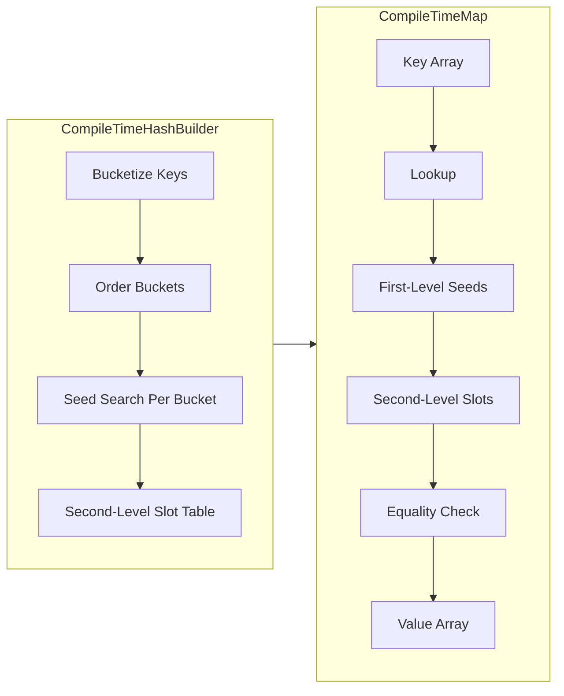

# CompileTimeMap {#CompileTimeMap}

## Overview
- `CompileTimeMap` provides a header-only, constexpr associative container for fixed key/value
  sets in Donner. Perfect hashing guarantees collision-free lookup without allocations while
  matching existing base naming and ownership patterns.
- Callers rely on deterministic initialization, pointer-stable storage for keys/values, and
  release assertions on missing keys through `at`.

## Testing
- Run core tests with:
  ```bash
  bazel test //donner/base:base_tests --test_filter=CompileTimeMapTest.*
  ```
- Consumer suites (e.g., CSS named colors, SVG property registries, shape/layout components)
  validate parity through their existing Bazel targets such as:
  ```bash
  bazel test //donner/css:css_tests
  bazel test //donner/svg/properties/tests:properties_tests
  ```
- Unit tests live in `donner/base/tests/CompileTimeMap_tests.cc`, covering constexpr construction,
  perfect-hash lookups, diagnostics, and fallback behaviors.

## Architecture Snapshot
- `CompileTimeMap<Key, Value, N, Hasher, KeyEqual>` stores keys and values in constexpr arrays
  alongside two perfect-hash tables: a first-level bucket/seed table and a second-level slot
  table. Lookup hashes with a global seed, uses per-bucket seeds when needed, and resolves to a
  slot index before verifying equality.
- `CompileTimeHashBuilder` constructs the tables at compile time: bucketizes keys, orders buckets
  by size, and searches deterministic seeds until every bucket maps to unique slots.
- `makeCompileTimeMap` and `makeCompileTimeMapFromArray` wrap the builder, exposing constexpr
  factories that accept initializer lists or arrays and return the fully wired map object.
- Diagnostic metadata (status codes, seed attempts, fallback markers) is embedded in the map to
  surface seed-search outcomes in tests and static assertions.

```cpp
constexpr auto kMap = makeCompileTimeMap(
    std::pair{std::string_view{"circle"}, ShapeTag::kCircle},
    std::pair{std::string_view{"rect"}, ShapeTag::kRect},
    std::pair{std::string_view{"ellipse"}, ShapeTag::kEllipse});

constexpr ShapeTag const* tag = kMap.map.at("rect");
static_assert(tag != nullptr && *tag == ShapeTag::kRect);
```



## API Surface
- `constexpr Value const* find(Key const& key) const;` returns `nullptr` on misses after equality
  verification.
- `constexpr Value const& at(Key const& key) const;` returns the value or triggers
  `UTILS_RELEASE_ASSERT` when the key is absent.
- `constexpr bool contains(Key const& key) const;` wraps `find` for convenience.
- `static constexpr auto makeCompileTimeMap(...)` and `makeCompileTimeMapFromArray(...)` accept
  key/value pairs plus optional `Hasher` and `KeyEqual` functors; they build perfect-hash tables at
  compile time and return the map alongside construction status.
- Supported key types include `std::string_view`, `RcString`, enums, and integral types. Values can
  be non-default-constructible due to index-sequence initialization inside the factories.

## Security and Safety
- Inputs are compile-time constants; threat surface is limited to developer mistakes. Final
  equality checks guard against false positives even if a hash seed misroutes.
- `at` uses `UTILS_RELEASE_ASSERT` on misses to keep failure modes obvious during development and in
  production builds.

## Performance Notes
- Perfect-hash lookups require two hash evaluations and one equality check, offering O(1) access
  with no dynamic allocations.
- Seed search is deterministic and bounded to keep compile-time costs predictable; maps fall back to
  direct indexing for singleton buckets.

## Integration Guidance
- Prefer `CompileTimeMap` for fixed token maps such as presentation attributes, CSS color names, and
  property parser registries. Replace legacy constexpr maps by wiring key/value arrays into
  `makeCompileTimeMap` and switching call sites to pointer-returning `find`.
- Keep keys stable across translation units; string keys should use `std::string_view` or `RcString`
  literals to ensure compile-time hashing and storage.

## Maintainer Checklist
- Maintain deterministic seed search and status reporting so failures are observable at compile time
  or in tests.
- Keep line-length, naming, and namespace conventions aligned with `donner/base` guidance.
- Ensure new consumers avoid runtime allocations and use pointer-based lookups rather than copying
  values out of the map.

## Limitations and Future Extensions
- The container targets fixed key sets; mutable or runtime-insertable variants remain out of scope.
- A potential `CompileTimeSet` wrapper can reuse the same perfect-hash infrastructure if demand
  appears.
