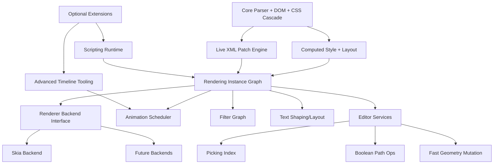
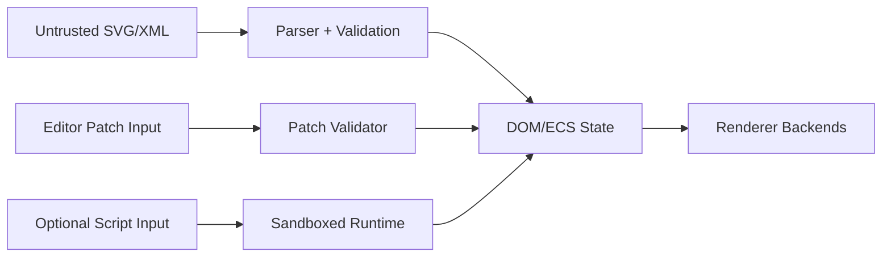

# Design: Donner Project Roadmap to v1.0 and v2.0 {#DonnerProjectRoadmap}

**Status:** Design
**Author:** GPT-5.2-Codex
**Created:** 2026-02-15

## Summary

This roadmap defines a phased plan for Donner from the current static-focused state to a robust
SVG platform. It aligns with existing project status notes and open issues, then extends them into
a concrete delivery sequence from active pre-v1 milestones into v1.0 and v2.0.

The roadmap explicitly incorporates the existing project milestones: closed v0.1 as the shipped
static baseline and open v0.2 for text support plus cached rendering. Building from that, v1.0
focuses on finishing standards-critical rendering support: backend abstraction, text, filters,
animation, SVG2 conformance review, and API usability for creation/edit/save workflows. v2.0
extends Donner into interactive authoring and runtime experiences: real-time editor backend
capabilities, geometry tooling for graphical editors, and modular advanced runtime extensions such
as JavaScript.

## Goals

- Ship a practical v1.0 for production SVG rendering with broad SVG2 compatibility.
- Prioritize missing high-impact gaps already tracked by the project (text, filters, rendering API).
- Improve API ergonomics for creating, editing, and serializing SVG programmatically.
- Establish architecture that keeps advanced capabilities modular and opt-in for binary
  size control.
- Define a credible path to a v2.0 platform suitable for interactive editor and game workflows.

## Non-Goals

- Guarantee 100% SVG2 conformance by v1.0.
- Commit to a single editor product UX in this roadmap (focus is backend/runtime enablers).
- Require JavaScript runtime support in core library builds.
- Define every low-level class signature in this document.

## Next Steps

- Confirm v0.2 exit criteria against the existing milestone scope and open issues.
- Add explicit pre-v1 checkpoints (v0.3/v0.4) that roll up into v1.0 readiness gates.
- Start with renderer interface and text completion tasks that directly unblock v0.2.

## Implementation Plan

- [ ] Milestone 0: Roadmap design-doc backlog setup
  - [ ] Create a tracking table linking each roadmap feature to a dedicated design doc.
  - [ ] Define design-doc review owners and readiness gates for each feature.
  - [ ] Prioritize design-doc drafting order by milestone risk and dependency.

- [ ] Milestone 1: Pre-v1 design docs (v0.2-v0.4)
  - [ ] Design Doc: Renderer backend abstraction and driver API (`v0.2`, issue #168).
  - [ ] Design Doc: Text rendering architecture and CSS text subset (`v0.2`, issue #242).
  - [ ] Design Doc: Cached rendering invalidation model and performance instrumentation.
  - [ ] Design Doc: Filter graph foundation and first filter primitive tranche (`v0.3`, issue #151).
  - [ ] Design Doc: SVG2/CSS conformance scorecard methodology and audit workflow (`v0.3`).
  - [ ] Design Doc: Animation MVP scheduler and invalidation strategy (`v0.4`).
  - [ ] Design Doc: API usability pass for create/edit/save workflows (`v0.4`).

- [ ] Milestone 2: v1.0 release-readiness design docs
  - [ ] Design Doc: v1.0 conformance gap-closure plan and release threshold policy.
  - [ ] Design Doc: Optimization and code-size strategy, including text on/off build profile.
  - [ ] Design Doc: v1.0 release criteria, compatibility guarantees, and deprecation policy.

- [ ] Milestone 3: v2.x interactive/editor design docs
  - [ ] Design Doc: Bidirectional XML <-> runtime graph synchronization architecture.
  - [ ] Design Doc: Real-time patch pipeline for high-frequency editing operations.
  - [ ] Design Doc: Editor services for mouse picking acceleration structures.
  - [ ] Design Doc: Boolean path operations and fast in-memory geometry mutation APIs.
  - [ ] Design Doc: Modular advanced runtime extensions (optional scripting/Flash-like tooling).
  - [ ] Design Doc: Game-runtime suitability profile (latency, frame pacing, memory budgets).

- [ ] Milestone 4: Ongoing design-doc maintenance
  - [ ] Convert shipped feature design docs into developer-facing architecture docs.
  - [ ] Keep roadmap and feature-doc checkboxes synced with implementation progress.
  - [ ] Review all open roadmap docs quarterly and re-rank based on milestone changes.

## User Stories

- As an application developer, I want a stable renderer interface so I can target
  different backends.
- As a graphics engineer, I want text, filters, and animation in v1.0 so modern SVG content renders.
- As a tool developer, I want real-time SVG edit APIs plus XML sync so I can build live editors.
- As an integrator, I want optional subsystems so I can control binary size and startup overhead.

## Background

The current public project status identifies text, filters, animation, and rendering API
evolution as core roadmap topics. This roadmap builds directly on those signals:

- README states v0.1.0 shipped static SVG core and calls out text/filter/animation on roadmap.
- Project Status issue tracks SVG feature support and missing text/filter/animation capabilities.
- Existing milestones: v0.1 is complete (static baseline) and v0.2 is open (text + cached
  rendering focus).
- Open issues include renderer interface abstraction, text support, filter support,
  in-place editing, and boolean path operations.

References:

- https://github.com/jwmcglynn/donner/issues/149
- https://github.com/jwmcglynn/donner/milestone/1
- https://github.com/jwmcglynn/donner/milestone/2
- https://github.com/jwmcglynn/donner/issues/168
- https://github.com/jwmcglynn/donner/issues/242
- https://github.com/jwmcglynn/donner/issues/151
- https://github.com/jwmcglynn/donner/issues/395
- https://github.com/jwmcglynn/donner/issues/392

## Requirements and Constraints

- Preserve current exception-free API style and ECS-based architecture.
- Keep lines of responsibility clear between parsing, style, layout, and rendering stages.
- Maintain deterministic behavior for malformed/untrusted SVG/XML input.
- Ensure optional feature sets can be compiled out for footprint-sensitive targets.
- Avoid introducing heavyweight dependencies without strong justification.

## Proposed Architecture

Roadmap work is organized into capability layers:

### Phase boundaries

- pre-v1 scope (v0.2-v0.4): D/E1 and I first, then initial H/G with conformance tracking.
- v1.0 scope: complete D/E1/I/H/G plus conformance, API polish, and optimization across A/B/C.
- v2.0 scope: F and J, plus K as opt-in modules for advanced authoring/runtime scenarios.

## API / Interfaces

Planned interface families:

- Renderer abstraction: backend-neutral render context and submission contracts.
- Animation runtime API: timeline controls, play/pause/seek, and invalidation hooks.
- Editing API: transactional DOM mutations with efficient incremental update propagation.
- Serialization API: full-document and patch-based XML export.
- Feature configuration API: compile-time/runtime toggles for text and optional extensions.

## Data and State

- Keep ECS components as source of truth for runtime rendering state.
- Introduce patch journals to bridge XML text edits and ECS graph updates bidirectionally.
- Maintain per-frame caches keyed by dirty-region and dependency invalidation sets.

## Error Handling

- Continue ParseResult-style diagnostics for parse/edit/serialization operations.
- Add explicit error categories for patch conflicts in bidirectional sync paths.
- Keep unsupported-feature reporting structured to feed conformance scorecards.

## Performance

Target themes:

- Real-time update path for editor workloads with minimal full-tree rebuilds.
- Animation frame scheduling that scales with scene complexity and dirty region size.
- Binary-size profiles with optional text and scripting modules disabled.
- Backend abstraction overhead kept near-zero in hot render loops.

## Security / Privacy

Primary trust boundaries involve untrusted SVG/XML input and optional scripting modules.

Controls:

- Enforce size/depth/complexity limits in parser and patch processors.
- Add fuzzing for XML/parser/edit patch surfaces and malformed animation/filter payloads.
- Keep scripting fully opt-in and sandboxed behind explicit build/runtime flags.

## Testing and Validation

- Conformance: expand and triage resvg test suite coverage by feature area.
- Unit tests: backend interface contracts, text/layout units, filter primitives,
  animation scheduler.
- Integration tests: full parse -> style -> render -> save flows for create/edit/save usability.
- Regression tests: XML bidirectional sync and incremental patch correctness.
- Performance gates: frame-time benchmarks, memory regressions, and binary-size tracking.

## Dependencies

- Prefer existing Donner subsystems and utilities first.
- Treat font shaping and scripting dependencies as optional and modular.
- Keep backend adapters isolated so backend-specific dependencies stay contained.

## Rollout Plan

### v0.1 (complete): Static rendering baseline

- Delivered core static SVG path/shape rendering and CSS cascade foundation.
- Established the architecture baseline used by subsequent text/filter/animation work.

### v0.2 (active): Text + cached rendering foundations

Primary focus:

- Complete `<text>` baseline support and close v0.2 milestone issues.
- Land renderer interface/driver abstraction for backend decoupling.
- Improve cached rendering invalidation behavior for frame-to-frame stability.

Expected deliverables:

- Text MVP for common Latin-script cases and core text-related style handling.
- Renderer API abstraction integrated with existing Skia backend.
- Regression tests for cache invalidation and mutable DOM rendering updates.

Exit criteria:

- v0.2 milestone issues are closed or explicitly re-scoped.
- Resvg text subset coverage demonstrates measurable pass-rate improvement.
- Cached rendering correctness checks pass for targeted edit/re-render scenarios.

### v0.3 (planned): Filter tranche + conformance baseline

Primary focus:

- Deliver first production-ready filter subset for common artwork.
- Publish SVG2/CSS conformance scorecard and establish baseline metrics.

Expected deliverables:

- Filter graph plumbing and a first tranche of high-value filter primitives.
- Conformance matrix grouped by feature category and test suite references.
- Documented gap list with priorities and owners for v0.4/v1.0 closure.

Exit criteria:

- Core filter scenarios render correctly in golden/regression tests.
- Conformance scorecard is published and linked from project status docs.
- Remaining blocker list for v1.0 is ranked and actively tracked.

### v0.4 (planned): Animation MVP + API usability hardening

Primary focus:

- Ship animation MVP with frame scheduling and incremental invalidation.
- Improve authoring APIs for create/edit/save and in-place document workflows.

Expected deliverables:

- Initial animation subsystem for key SVG animation paths.
- API ergonomics pass for programmatic authoring and serialization.
- Performance baselines for frame times, memory, and binary-size profiles.

Exit criteria:

- Animation MVP passes targeted integration tests and stability checks.
- API usability pass closes top ergonomics issues from maintainers/users.
- v1.0 release gates are agreed and tracked as explicit checklist items.

### v1.0 (target): Feature-complete rendering release

Primary focus:

- Finalize standards-critical scope: renderer abstraction, text, filters, animation.
- Complete SVG2/CSS audit closure for prioritized high-impact feature gaps.
- Execute optimization pass (performance, memory, and code size).

Expected deliverables:

- Published v1.0 conformance report with known limitations and rationale.
- Stable API surface for rendering and core authoring operations.
- Build-time feature toggles (including text on/off profile) documented.

Exit criteria:

- All v1.0 must-have issues are closed.
- Conformance and performance targets meet release thresholds.
- Release documentation is complete for embedders and maintainers.

### v2.x (post-v1): Interactive/editor and advanced runtime track

Primary focus:

- Build real-time editor backend capabilities and bidirectional XML/runtime sync.
- Add editor geometry services (picking acceleration, boolean path operations).
- Explore optional advanced extensions, including modular scripting support.

Expected deliverables:

- Patch-based live editing pipeline with deterministic graph updates.
- Authoring-performance toolchain for high-frequency geometry edits.
- Deployment profiles for editor-grade and game-runtime use cases.

Exit criteria:

- Interactive editing benchmarks meet latency/throughput objectives.
- Game-backend suitability checks pass representative workload scenarios.
- Advanced extensions remain modular and opt-in for size-sensitive builds.

## Alternatives Considered

- Big-bang v2-style editor architecture before v1.0 completeness.
  - Rejected: delays standards-critical support and risks adoption.
- Monolithic runtime with always-on advanced features.
  - Rejected: conflicts with embeddability and binary-size requirements.

## Open Questions

- Which secondary renderer backend should be first after Skia abstraction completion?
- Which filter primitives are mandatory for v1.0 versus post-v1.
- What minimum scripting capability, if any, is needed in early v2 milestones?

# Future Work

- [ ] GPU-native scene graph path for very large animated documents.
- [ ] Collaboration-ready patch protocol for multi-user editor sessions.
