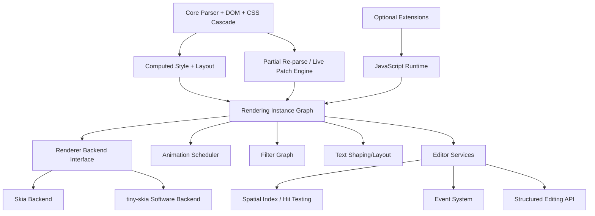

# Donner Project Roadmap {#DonnerProjectRoadmap}

**Status:** Active
**Updated:** 2026-03-13

## Summary

Donner is an SVG rendering library targeting broad SVG2 compatibility, high performance, and
interactive editing workflows.

After v0.1 established the static rendering baseline, a large body of work landed covering renderer
abstraction, a complete software rasterizer, text shaping, all 17 SVG filter primitives, animation,
composited rendering, and interactivity. This is collected as **v0.5**, skipping intermediate
milestones that were overtaken by the pace of development. The next target is **v1.0**: a
production-quality release focused on interactive editing, conformance, parser hardening, and
ecosystem integration.

---

## v0.1 — Static Rendering Baseline (shipped)

Core static SVG path/shape rendering and CSS cascade foundation. Established the ECS architecture,
XML parser, CSS parser, and Skia-based renderer.

---

## v0.5 — Rendering Engine (shipped)

Everything completed since v0.1, collected into a single release milestone.

### Renderer Architecture

- **Renderer interface abstraction** — `RendererInterface` / `RendererSkia` split with
  `RendererDriver` traversing a flat render tree. Enables future backend swaps.
  ([design](renderer_interface_design.md))
- **tiny-skia software renderer** — Full software rasterizer (fill, stroke, gradients, patterns,
  shaders, lowp/highp pipeline) as an alternative to Skia. All render operations within 1.5× of
  Skia performance.

### Text Rendering

- Phases 1–5: stb_truetype font loading, glyph outlines, `TextLayout`, WOFF2 support,
  `dominant-baseline`.
- Phase 6: Optional HarfBuzz text shaping tier (`--config=text-shaping`).
- ([design](text_rendering.md))

### SVG Filter Effects

- All 17 SVG filter primitives implemented in both Skia (native `SkImageFilter` lowering) and
  tiny-skia backends.
- Float-precision filter pipeline with SIMD optimizations (NEON): Gaussian blur, morphology,
  color matrix, turbulence, convolution, blend, composite, lighting, displacement map, component
  transfer, flood, offset, merge, tile.
- All 23 filter benchmarks within 1.5× of Skia; 21 of 23 are faster.
- ([design](filter_effects.md), [perf](filter_performance.md))

### SVG Animation

- Phases 1–9: timing model, interpolation engine, sandwich composition, attribute targeting,
  `<animate>`, `<animateTransform>`, `<animateMotion>`, `<set>`, event-based timing.
- ([design](animation.md))

### Composited Rendering

- Layer-based caching architecture for animation and editing performance.
- ([design](composited_rendering.md))

### Interactivity

- Phases 1–6: `EventSystem` with `SpatialGrid`-accelerated hit testing, event dispatch (mouse,
  pointer), CSS cursor property, `DonnerController` public API (`addEventListener`,
  `elementFromPoint`, `findIntersectingRect`, `getWorldBounds`), incremental spatial index updates.
- ([design](interactivity.md))

### Infrastructure

- Auto-detect font backends, crash handling hardening.
- Filter and render benchmark suites with perf regression tests (1.5× threshold enforcement).
- resvg test suite integration for golden image validation.

---

## v1.0 — Production Release (in progress)

Focus: interactive editing, conformance, parser hardening, and ecosystem integration.

### Interactive SVG Editing

Flagship v1.0 feature: a hybrid structured/freeform SVG editor workflow.

- [ ] **Import donner-editor** — Move the `donner-editor` project into this repository and polish
  for release.
- [ ] **Structured editing API** — Programmatic DOM mutations that propagate through ECS with
  incremental re-render (building on composited rendering + interactivity).
- [ ] **Partial re-parsing** — Parser support for updating a document in-place from modified SVG
  source. When a user edits source text, parse only the changed region and splice updates into
  the live document.
- [ ] **Reverse serialization** — From interactive editor operations, surgically splice updated
  SVG content back into the source text, preserving surrounding structure and formatting. Enables
  round-trip editing: source → DOM → visual edit → source.
- [ ] **Invalid-region tolerance** — Graceful handling of temporarily invalid SVG during freeform
  text editing. The editor should not crash or lose state when the user is mid-keystroke. This is
  a hybrid approach — not a "true" structured editor, but a text editor with syntax-aware support.

### Parser Improvements

- [ ] **`ParseWarning` type** — Introduce a first-class `ParseWarning` type (or `ParseWarnings`
  container) replacing the current `vector<ParseError>` pattern. Warnings vs errors should be
  distinct at the type level.
- [ ] **Source location audit** — Review all current parse errors to verify correct source
  locations are reported.
- [ ] **Full source ranges** — Extend parse errors/warnings to carry full source ranges
  (start + end), not just the start index.
- [ ] **CSS parser update** — Consider making the CSS parser streaming, potentially using C++20
  coroutines (`co_await`). Reduce places where we tokenize to a vector. Add support for source
  ranges and incremental updates matching the XML parser's capabilities.
- [ ] **XML parser conformance** — Fix bugs like non-conforming `Name` token acceptance
  ([#304](https://github.com/jwmcglynn/donner/issues/304)).

### Entity Lifecycle

- [ ] **Node removal cleanup** — Implement proper cleanup for nodes removed from the document
  graph. Currently removed entities are leaked in the ECS registry. Add destruction hooks that
  tear down components, release resources, and remove entities from spatial indices and caches.

### DOM Support

- [ ] **SVG2 DOM gap analysis** — Audit current DOM implementation against the full SVG2 DOM
  specification. Identify missing interfaces, attributes, and methods across all element types.
- [ ] **Close DOM gaps** — Implement missing DOM interfaces and properties identified by the audit,
  prioritizing those needed for interactive editing and JavaScript integration.

### Conformance & Testing

- [ ] **SVG2 conformance pass** — Systematic audit of SVG2 spec coverage. Identify and close
  high-impact gaps across all element categories.
- [ ] **Animation test suite** — Comprehensive test coverage for the animation system
  (Phases 1–9), including timing edge cases, interpolation correctness, and event-based triggers.
- [ ] **Update resvg test suite** — The upstream resvg test suite had a major refactor/rename of
  all tests. Update our integration to match the new test naming and structure.
- [ ] **Enable text resvg tests** — Currently skipped. Enable and validate text rendering tests
  against resvg golden images.
- [ ] **Add Donner to resvg test harness** — Contribute Donner as a backend in the upstream resvg
  test suite repository (external repo contribution).

### SVG Feature Gaps

- [ ] **`<symbol>` refX/refY units** — Support `<length>` values and keyword tokens
  (left/center/right, top/center/bottom) per SVG2 spec
  ([#318](https://github.com/jwmcglynn/donner/issues/318)).
- [ ] **`<marker>` attribute units** — Support `<length-percentage>`, `<number>`, and keyword
  tokens for refX/refY/markerWidth/markerHeight per SVG2
  ([#316](https://github.com/jwmcglynn/donner/issues/316)).
- [ ] **`<clipPath>` `<use>` support** — Resolve `<use>` children referencing path/shape elements
  inside `<clipPath>`, per CSS Masking spec
  ([#238](https://github.com/jwmcglynn/donner/issues/238)).

### Security

- [ ] **AI-assisted security pass** — Comprehensive security audit using AI-assisted analysis.
  Add new fuzzers for under-covered parser surfaces (CSS, filter parameters, animation timing,
  edit/patch paths). Scan for vulnerabilities across all input-handling code (XML, CSS, SVG
  attributes, external references).

### Optional Extensions

- [ ] **JavaScript support** — Identify a small embeddable JavaScript engine and integrate as an
  optional feature (similar to how filters are optional). Enable scripted SVG content for
  interactive applications.

### Optimization

- [ ] **Performance profiling** — Profile end-to-end render paths and identify remaining
  bottlenecks. Target hot paths in parsing, style resolution, layout, and rasterization.
- [ ] **Code size reduction** — Audit binary size contributions by subsystem. Reduce template
  bloat, eliminate dead code, and ensure optional features (text, filters, JS) compile out cleanly.
- [ ] **Memory usage** — Reduce peak and steady-state memory consumption. Audit ECS component
  sizes, pixmap allocations, and intermediate buffers in filter/render pipelines.
- [ ] **Compile time** — Reduce build times. Audit heavy template instantiations, consider
  explicit template instantiation, forward declarations, and pimpl patterns where header
  fan-out is excessive.

### Ecosystem

- [ ] **Comparison with other SVG libraries** — Publish a detailed comparison of Donner against
  lunasvg and resvg, covering feature support, conformance, performance, API design, binary size,
  and build complexity. Include reproducible benchmarks and conformance test results.

### Documentation

- [ ] **Design docs → developer docs** — Convert all shipped design documents into
  developer-facing architecture documentation. Remove planning/status artifacts, focus on
  how-it-works descriptions for contributors and embedders.
- [ ] **In-code documentation cleanup** — Review and update code comments, Doxygen annotations,
  and API documentation across public headers. Ensure all public APIs have clear documentation
  ready for consumption.
- [ ] **Embedding guide** — End-to-end guide for integrating Donner into applications, covering
  build configuration, feature toggles, rendering setup, and common workflows.

### Release Criteria

- All v1.0 issues closed.
- SVG2 conformance report published with known limitations documented.
- Stable API surface for rendering, editing, and authoring operations.
- Performance and binary-size profiles documented.
- Release documentation complete for embedders.

---

## Future Work (post-v1.0)

- **"Geode" GPU-accelerated renderer** — Custom GPU rendering backend targeting modern graphics
  APIs, replacing Skia dependency for high-performance and embedded use cases.
- **Multithreading** — Thread-safe access to documents and rendering. Define ownership and
  concurrency model for ECS registry access, enable parallel rendering and background parsing.
- Boolean path operations and geometry mutation APIs for graphical editors.
- Multi-user collaboration patch protocol.
- Game-runtime suitability profile (latency, frame pacing, memory budgets).

---

## Architecture

```mermaid
flowchart TD
  A[Core Parser + DOM + CSS Cascade] --> B[Computed Style + Layout]
  B --> C[Rendering Instance Graph]
  C --> D[Renderer Backend Interface]
  D --> E1[Skia Backend]
  D --> E2[tiny-skia Software Backend]

  A --> F[Partial Re-parse / Live Patch Engine]
  F --> C

  C --> G[Animation Scheduler]
  C --> H[Filter Graph]
  C --> I[Text Shaping/Layout]

  C --> J[Editor Services]
  J --> J1[Spatial Index / Hit Testing]
  J --> J2[Event System]
  J --> J3[Structured Editing API]

  K[Optional Extensions] --> K1[JavaScript Runtime]
  K1 --> C
```

## Design Documents

| Document | Status |
|----------|--------|
| [Renderer Interface](renderer_interface_design.md) | Shipped (Phases 1–2a) |
| [Text Rendering](text_rendering.md) | Shipped (Phases 1–6) |
| [Filter Effects](filter_effects.md) | Shipped (17/17 primitives) |
| [Filter Performance](filter_performance.md) | Shipped (all within 1.5×) |
| [Animation](animation.md) | Shipped (Phases 1–9) |
| [Composited Rendering](composited_rendering.md) | Shipped |
| [Interactivity](interactivity.md) | Shipped (Phases 1–6) |
| [External SVG References](external_svg_references.md) | Design |
