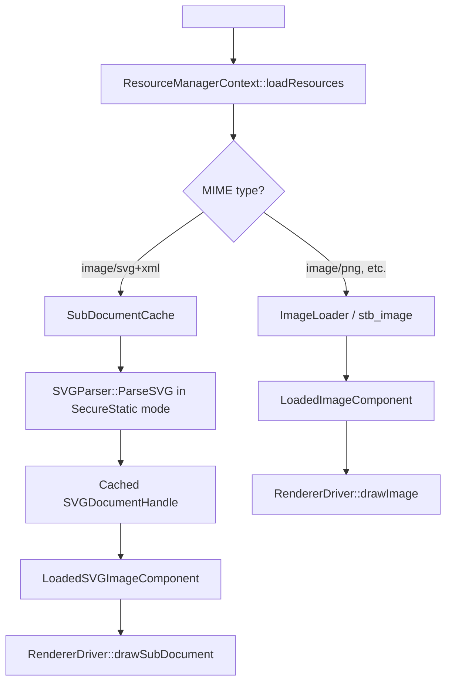
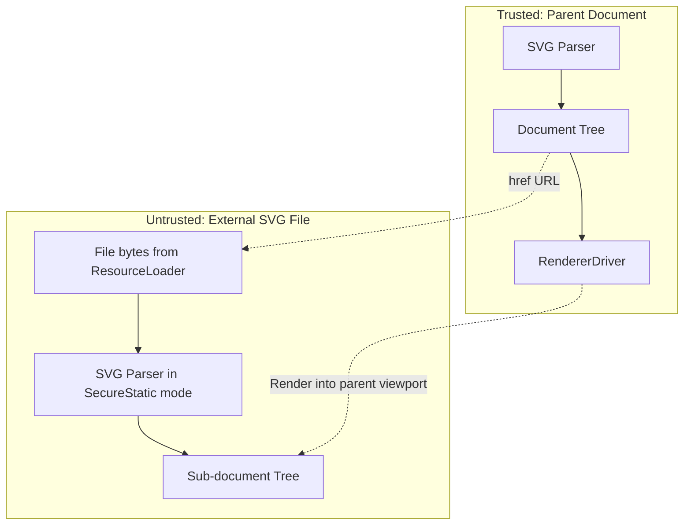

# Design: External SVG Document References

**Status:** Design
**Author:** Claude Opus 4.6
**Created:** 2026-03-10

## Summary

Add support for loading and rendering external `.svg` files when referenced by `<image>` and
`<use>` elements. Donner already supports raster images for `<image>` and same-document fragment
references for `<use>`. This work adds:

- `<image href="file.svg">`: render the external SVG as an atomic image into the `<image>`
  viewport, with no CSS inheritance across the document boundary.
- `<use href="file.svg">` and `<use href="file.svg#id">`: render an external SVG document, or a
  specific referenced element, as a nested sub-document.

This change also adds shared infrastructure for URL parsing with fragments, sub-document caching,
and secure resource-loading policy for referenced SVGs.

## Goals

- Parse and render external SVG files referenced by `<image href="file.svg">`.
- Parse and render external SVG files referenced by `<use href="file.svg">`.
- Support fragment references via `<use href="file.svg#elementId">`.
- Enforce secure static processing for referenced sub-documents.
- Cache parsed sub-documents by resolved URL.
- Preserve the existing sandboxed resource loading model.

## Non-Goals

- `<feImage>` support for external SVGs. That remains out of scope for this change.
- Network fetching. Only local file references and data URLs are supported.
- Secure animated mode beyond the policy plumbing already needed for secure static mode.
- SVG view specification fragments such as `file.svg#svgView(...)`.
- Interactive sub-documents or event propagation into referenced SVGs.
- Recursive external resource loading from within sub-documents.

## Implementation Plan

- [x] Milestone 1: URL and resource infrastructure
  - [x] Extend `UrlLoader::Result` to carry MIME type information.
  - [x] Detect SVG MIME types in `ImageLoader` and route SVG content separately from raster image
    decoding.
  - [x] Add `SubDocumentCache` as an ECS context component keyed by resolved URL.
  - [x] Add `ProcessingMode` plumbing for secure static sub-document loading.
  - [x] Block external resource loading in secure processing modes.

- [x] Milestone 2: `<image>` with external SVG
  - [x] Add `LoadedSVGImageComponent`.
  - [x] Parse external SVG image content through `SubDocumentCache`.
  - [x] Use the `<image>` positioning rectangle as the sub-document viewport.
  - [x] Apply the `<image>` element's own `preserveAspectRatio` when rendering the sub-document.
  - [x] Render the nested sub-document through `RendererDriver`.

- [x] Milestone 3: `<use>` with external SVG references
  - [x] Extend `Reference` with `isExternal()`, `documentUrl()`, `fragment()`, and
    `resolveFragment()`.
  - [x] Load external SVG documents via `SubDocumentCache` during shadow tree setup.
  - [x] Render external `<use>` references as nested sub-documents.
  - [x] Support fragment references into the external SVG.
  - [x] Propagate `context-fill` and `context-stroke` into the sub-document render context.
  - [x] Reject data URLs for external `<use>` references by treating them as non-external.

- [x] Milestone 4: Testing
  - [x] Golden tests for external SVG `<image>`.
  - [x] Golden tests for external SVG `<use>`.
  - [x] Golden tests for fragment references through `<use>`.
  - [x] Golden tests for `context-fill` and `context-stroke` with external `<use>`.
  - [x] Unit tests for `SubDocumentCache`.
  - [x] Unit tests for `Reference` parsing.
  - [x] Unit tests for URL loader MIME detection.

## Architecture

### Data Flow



### Key Components

`SubDocumentCache`

- Stored on `Registry::ctx()`.
- Owns parsed sub-documents by `SVGDocumentHandle`.
- Guards against recursive loads via a `loading_` set.

```cpp
class SubDocumentCache {
public:
  std::optional<SVGDocumentHandle> getOrParse(
      const RcString& resolvedUrl,
      const std::vector<uint8_t>& svgContent,
      const ParseCallback& parseCallback,
      std::vector<ParseError>* outWarnings);

  std::optional<SVGDocumentHandle> get(const RcString& resolvedUrl) const;
  bool isLoading(const RcString& resolvedUrl) const;
};
```

`LoadedSVGImageComponent`

```cpp
struct LoadedSVGImageComponent {
  SVGDocumentHandle subDocument;
};
```

`ExternalUseComponent`

```cpp
struct ExternalUseComponent {
  SVGDocumentHandle subDocument;
  RcString fragment;
};
```

### Integration

`ResourceManagerContext`

- Detects `image/svg+xml` content during resource loading.
- Uses `SubDocumentCache` instead of raster image decoding for SVG content.
- Stores `ProcessingMode` on the resource manager, not on `SVGDocument`.

`RendererDriver`

- When an `<image>` entity has `LoadedSVGImageComponent`, it renders the referenced document
  inside the `<image>` viewport.
- When a `<use>` entity has `ExternalUseComponent`, it renders either the whole external SVG or a
  referenced fragment.
- Passes `context-fill` and `context-stroke` into external `<use>` sub-documents.

`Reference`

- Supports `file.svg`, `file.svg#id`, and same-document `#id`.
- Exposes the document path and fragment separately.

## Security / Privacy

### Trust Boundaries



### Threat Model

| Threat | Mitigation |
|--------|------------|
| Path traversal (`../../etc/passwd`) | Existing `SandboxedFileResourceLoader` rejects escaping paths |
| Infinite recursion (A→B→A) | `SubDocumentCache::isLoading()` recursion guard |
| Resource exhaustion | Sub-documents inherit existing parser and loader limits |
| Information leak via sub-doc | Secure mode blocks nested external resource loading |
| Cross-origin escalation | Out of scope because only local file loading is supported |

### Invariants

1. Sub-documents in secure mode never load their own external resources.
2. `SubDocumentCache` never re-enters the same URL while it is already being loaded.
3. `<image>` rendering does not inherit CSS state from the parent document.
4. `<use>` fragment rendering resolves the fragment against the external document, not the parent.

## Testing And Validation

### Golden Tests

- `image-external-svg-basic.svg`
- `image-external-svg-viewbox.svg`
- `image-external-svg-par.svg`
- `use-external-svg.svg`
- `use-external-svg-fragment.svg`
- `use-external-context-paint.svg`

### Unit Tests

- `SubDocumentCache`: cache hit/miss, recursion detection, secure mode enforcement.
- `Reference`: parsing and fragment extraction.
- `UrlLoader`: MIME detection for SVG and raster extensions.

### Negative Cases

- Missing external file.
- Malformed SVG content.
- Circular reference chains.
- Non-SVG content mislabeled as SVG.
- Data URL rejection for external `<use>`.

## Alternatives Considered

### Render External SVG To A Temporary Raster First

Rejected because it loses vector quality and introduces extra memory churn for the normal `<image>`
and `<use>` paths.

### Store Referenced Entities In The Parent Registry

Rejected because it pollutes the parent ID namespace and weakens the document boundary that SVG2
expects.

### Lazy Load Sub-Documents During Rendering

Rejected because it introduces render-time I/O and makes render latency unpredictable.

## Future Work

- `<feImage>` support for external SVGs.
- SVG view specification fragments.
- Network-backed resource loading.
- More explicit same-origin policy controls if network loading is introduced later.
