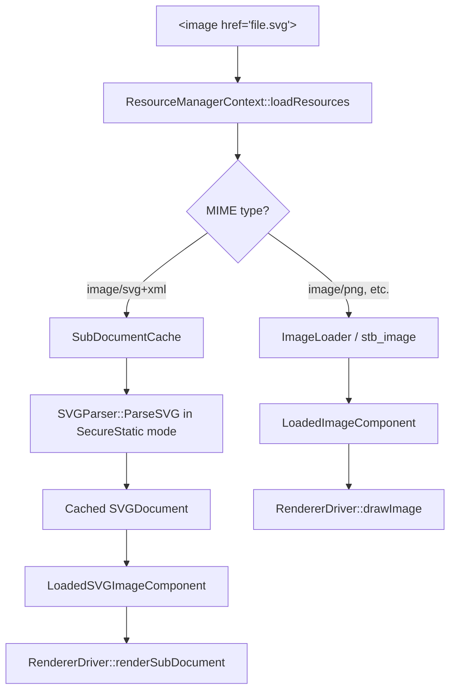
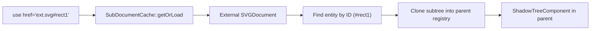
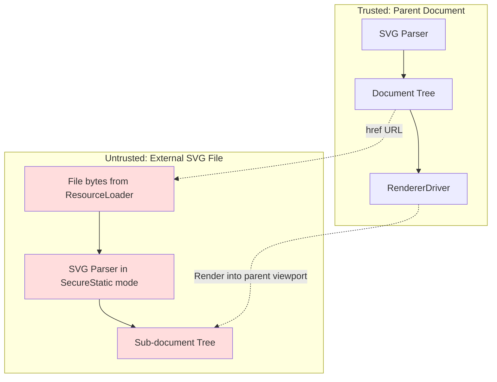

# Design: External SVG Document References

**Status:** Design
**Author:** Claude Opus 4.6
**Created:** 2026-03-10

## Summary

Add support for loading and rendering external `.svg` files when referenced by `<image>`, `<use>`, and `<feImage>` elements. Today, Donner only supports raster images (PNG/JPEG/GIF) for `<image>` and fragment-only (`#id`) references for `<use>`. The SVG2 spec requires that all three elements can reference external SVG documents, each with different processing semantics:

- **`<image>`**: Renders the external SVG as an atomic image into a viewport, in secure animated/static mode. The referenced SVG is a separate document with no property inheritance.
- **`<use>`**: Clones the referenced element (or root `<svg>`) into a shadow tree within the current document. Same-origin only, no data URLs.
- **`<feImage>`**: Renders the external SVG into filter space as a raster input to the filter pipeline.

This work also introduces shared infrastructure: URL parsing with fragment support, a sub-document cache, and the SVG2 processing mode concept (secure static/animated).

## Goals

- Parse and render external SVG files referenced via `<image href="file.svg">`.
- Support `<use href="file.svg">` and `<use href="file.svg#elementId">` for external element cloning.
- Support `<feImage href="file.svg">` for filter input from external SVGs.
- Implement SVG2 secure static mode for sub-documents (no scripts, no external references, no animation, no interactivity).
- Cache parsed sub-documents to avoid redundant parsing when the same file is referenced multiple times.
- Maintain the existing sandboxed resource loading security model.

## Non-Goals

- **Network fetching**: Only local file references (via `ResourceLoaderInterface`) and data URLs are supported. HTTP/HTTPS fetching is out of scope.
- **Secure animated mode**: Animation support is not yet implemented in Donner, so secure animated mode is equivalent to secure static mode for now.
- **Cross-origin restrictions**: Since we only support local files, CORS is not applicable. The `crossorigin` attribute will be parsed but not enforced.
- **SVG view specification fragments**: Fragment identifiers like `file.svg#svgView(viewBox(...))` are deferred to future work. Only bare-name fragments (`file.svg#elementId`) are supported.
- **Interactive sub-documents**: No event propagation, scripting, or user interaction in referenced SVGs.
- **Recursive external references**: Sub-documents loaded in secure mode cannot themselves load external resources (per SVG2 spec), preventing infinite recursion.

## Next Steps

All milestones complete. Future work items are listed at the bottom of this document.

## Implementation Plan

- [x] Milestone 1: URL and resource infrastructure
  - [x] Extend `UrlLoader::Result` to carry MIME type information so callers can distinguish SVG from raster
  - [x] Add SVG MIME type detection (`image/svg+xml`) in `ImageLoader`, routing SVG content to a separate path
  - [x] Implement `SubDocumentCache` component to store parsed `SVGDocument` instances keyed by resolved URL
  - [x] Add `ProcessingMode` enum (`DynamicInteractive`, `Animated`, `SecureAnimated`, `SecureStatic`) to `SVGDocument`
  - [x] Enforce secure static mode in sub-documents: skip external resource loading in `ResourceManagerContext::loadResources()` when mode is `SecureStatic`

- [x] Milestone 2: `<image>` with external SVG
  - [x] Add `LoadedSVGImageComponent` ECS component to hold a reference to a parsed sub-document
  - [x] Extend `ResourceManagerContext::loadResources()` to detect SVG content and parse into `SubDocumentCache`
  - [x] Implement sub-document viewport calculation: the `<image>` element's positioning rectangle defines the SVG viewport
  - [x] Override referenced SVG's root `preserveAspectRatio` to `none` (per SVG2 spec); apply the `<image>` element's own `preserveAspectRatio`
  - [x] Implement sub-document rendering in `RendererDriver`: render the external SVG's tree into the current canvas within the computed viewport
  - [x] Add `RendererInterface::drawSubDocument()` or reuse existing infrastructure to render nested document trees

- [x] Milestone 3: `<use>` with external SVG references
  - [x] Extend `Reference` to parse URLs with both document path and fragment components (`isExternal()`, `documentUrl()`, `fragment()`, `resolveFragment()`)
  - [x] Fetch and parse external SVG documents via `SubDocumentCache` during shadow tree creation
  - [x] Render external `<use>` references as sub-documents (via `ExternalUseComponent` + `drawSubDocument`)
  - [x] Fragment-based element lookup: render specific elements from external SVGs (`file.svg#elementId`)
  - [x] CSS property inheritance from `<use>` element (context-fill, context-stroke) — `RenderingContext::setInitialContextPaint()` passes parent `<use>` element's fill/stroke to sub-document render tree as initial context values
  - [x] Make relative URLs in cloned attributes absolute (per SVG2 spec) — N/A: sub-document rendering approach resolves URLs within the sub-document's own context
  - [x] Enforce same-origin restriction: reject cross-origin and data URL references for `<use>` — `isExternal()` returns false for data URLs; cross-origin N/A for local-only files

- [x] Milestone 4: `<feImage>` with external SVG
  - [x] Extend `feImage` processing to detect SVG content from `href` — `FilterSystem` checks `LoadedSVGImageComponent` and stores `svgSubDocument` pointer in `filter_primitive::Image`
  - [x] Render external SVG into a filter-space raster buffer — `RendererDriver::preRenderSvgFeImages()` uses `createOffscreenInstance()` to render sub-document to pixels before filter execution
  - [x] Apply `preserveAspectRatio` to map the SVG into the filter primitive subregion — handled by existing `FilterGraphExecutor` feImage processing with pre-rendered pixel data

- [x] Milestone 5: Testing and edge cases
  - [x] Golden image tests for `<image>` with external SVG (various viewBox/preserveAspectRatio combinations)
  - [x] Golden image tests for `<use>` with external SVG (whole document)
  - [x] Golden image tests for `<use>` with external SVG element references (fragment)
  - [x] Golden image test for `<feImage>` with external SVG
  - [x] Golden image test for context-fill/context-stroke with external `<use>`
  - [x] Unit tests for `SubDocumentCache` lifecycle and caching behavior
  - [x] Unit tests for secure mode enforcement (sub-documents cannot load external resources)
  - [x] Unit tests for recursion protection (A.svg references B.svg references A.svg)
  - [x] Tests for missing file, malformed SVG, and non-SVG content error paths
  - [x] Unit tests for `Reference` URL parsing (same-document, external, data URLs)

## Background

### Current State

Donner's `<image>` element supports raster formats (PNG, JPEG, GIF) via `stb_image`. The loading pipeline is:

```
href attribute → UrlLoader (data URL or ResourceLoaderInterface) → ImageLoader (stb_image decode) → ImageResource (RGBA pixels)
```

Reference resolution (`Reference::resolve()`) only supports same-document fragment identifiers (`#id`). External URL references are explicitly unsupported, with a TODO noting "Full parsing support for URL references."

### SVG2 Spec Requirements

**Processing modes** (SVG2 §2.7.1): SVG documents can be processed in several modes. Sub-documents referenced by `<image>` must use **secure animated mode** (or secure static mode in static contexts). Both secure modes disable:
- Script execution
- External resource loading (except data URLs and same-document references)
- User interactivity

Secure static mode additionally disables declarative animations.

**`<image>` with SVG** (SVG2 §5.4): The referenced SVG is a "separate document which generates its own parse tree and document object model." Key rules:
- No CSS property inheritance across the document boundary
- The `<image>` element's positioning rectangle defines the SVG viewport
- The root `<svg>` element's `preserveAspectRatio` is overridden to `none`; the `<image>` element's own `preserveAspectRatio` controls scaling
- Cannot reference individual elements within the SVG (unlike `<use>`)

**`<use>` with external SVG** (SVG2 §5.6): May reference elements in external SVG files. The element (or root `<svg>` if no fragment) is cloned into a shadow tree. Relative URLs in cloned attributes must be made absolute. Cross-origin and data URL references are disallowed.

## Requirements and Constraints

### Functional

- External SVG referenced by `<image>` must render identically to the same SVG rendered standalone at the same viewport size.
- Sub-documents must be fully isolated: no CSS inheritance, no ID namespace collision with the parent document.
- `<use>` shadow tree cloning from external documents must behave identically to same-document cloning.
- Circular reference chains must be detected and broken (not infinite loop).

### Performance

- Parsed sub-documents should be cached by resolved URL to avoid redundant parsing.
- Sub-document rendering should reuse the existing `RendererDriver` traversal, not require a separate rendering pipeline.
- Memory usage: sub-document `SVGDocument` instances are kept alive for the lifetime of the parent document's render cycle, then eligible for eviction.

### Security

- Sub-documents in secure mode must not load external resources (enforced, not advisory).
- Path traversal protection via existing `SandboxedFileResourceLoader`.
- Recursion depth limit to prevent stack overflow from deeply nested document chains.

## Proposed Architecture

### Data Flow



### Key Components

**`SubDocumentCache`** — New ECS context component (`Registry::ctx()`) that owns parsed sub-documents.

```cpp
class SubDocumentCache {
public:
  /// Get or parse an external SVG document. Returns nullptr on failure.
  /// Documents are parsed in SecureStatic mode.
  SVGDocument* getOrLoad(const RcString& resolvedUrl,
                         ResourceLoaderInterface& loader);

  /// Check if a URL is currently being loaded (for recursion detection).
  bool isLoading(const RcString& resolvedUrl) const;

private:
  std::unordered_map<RcString, SVGDocument> cache_;
  std::unordered_set<RcString> loading_;  // Recursion guard
};
```

**`ProcessingMode`** — Added to `SVGDocument` to control feature availability.

```cpp
enum class ProcessingMode {
  DynamicInteractive,  // Full features (default for top-level documents)
  SecureAnimated,      // No scripts, no external refs, animations allowed
  SecureStatic,        // No scripts, no external refs, no animations
};
```

**`LoadedSVGImageComponent`** — New ECS component for image elements referencing SVG content.

```cpp
struct LoadedSVGImageComponent {
  SVGDocument* subDocument = nullptr;  // Non-owning; owned by SubDocumentCache
};
```

### Integration with Existing Systems

**ResourceManagerContext**: Extended to detect SVG MIME type during `loadResources()`. When SVG content is detected, it routes to `SubDocumentCache` instead of `ImageLoader`, and attaches `LoadedSVGImageComponent` instead of `LoadedImageComponent`.

**RendererDriver**: When rendering an `<image>` entity, checks for `LoadedSVGImageComponent` first. If present, sets up the sub-document's viewport from the `<image>` element's positioning rectangle, then recursively renders the sub-document's tree using a nested `RendererDriver` invocation on the sub-document's registry.

**Reference**: Extended to parse `path/to/file.svg#elementId` into a document URL + fragment pair. `resolve()` gains an overload that accepts a `SubDocumentCache*` for cross-document resolution.

### Sub-Document Rendering for `<image>`

```
Parent RendererDriver
  ├── save()
  ├── clipRect(imagePositioningRect)
  ├── applyTransform(preserveAspectRatio transform)
  ├── Create child RendererDriver for subDocument.registry()
  │   └── Render sub-document tree (full traversal)
  └── restore()
```

The sub-document gets its own flat render tree computation (via `TreeComponent` traversal on its own registry), and the parent's `RendererInterface` is shared — drawing commands from the sub-document go to the same canvas/surface.

### Sub-Document Rendering for `<use>`

For `<use>`, the external element's subtree is cloned into the current document's registry as shadow tree nodes (same as today's same-document `<use>`). The key difference is that the source entities come from a different registry, requiring a cross-registry clone operation in `ShadowTreeSystem::populateInstance()`.



## Security / Privacy

### Trust Boundaries



### Threat Model

| Threat | Mitigation |
|--------|------------|
| Path traversal (`../../etc/passwd`) | Existing `SandboxedFileResourceLoader` rejects paths escaping root |
| Infinite recursion (A→B→A) | `SubDocumentCache::isLoading()` recursion guard; depth limit |
| Resource exhaustion (huge SVG) | Sub-documents inherit parent's resource limits; parser size limits |
| Billion laughs / entity expansion | SVG parser already limits entity expansion |
| Information leak via sub-doc | Secure mode prevents sub-document from loading further external resources |
| Cross-origin escalation | `<use>` rejects cross-origin references; `<image>` renders opaquely |

### Invariants

1. A sub-document in `SecureStatic` mode **never** calls `ResourceLoaderInterface::fetchExternalResource()`.
2. `SubDocumentCache::getOrLoad()` **never** enters a recursive loading cycle (enforced by `loading_` set).
3. No CSS properties or computed styles cross the document boundary for `<image>`.
4. `<use>` cloned elements from external documents have all relative URLs resolved to absolute before insertion.

## Testing and Validation

### Golden Image Tests

- `image-external-svg-basic.svg`: `<image>` referencing a simple external SVG with shapes
- `image-external-svg-viewbox.svg`: External SVG with `viewBox`, testing viewport mapping
- `image-external-svg-par.svg`: Various `preserveAspectRatio` values on the `<image>` element
- `image-external-svg-no-dimensions.svg`: External SVG without explicit width/height (default 300×150)
- `use-external-svg.svg`: `<use>` referencing an element in an external SVG
- `use-external-svg-root.svg`: `<use>` referencing external SVG without fragment (whole document)

### Unit Tests

- `SubDocumentCache`: cache hit/miss, recursion detection, secure mode enforcement
- `Reference::resolve()`: URL parsing with fragments, external resolution, error cases
- `RendererDriver`: mock-based tests for sub-document render calls
- `ResourceManagerContext`: SVG MIME detection, routing to sub-document path

### Negative / Edge Case Tests

- Missing external file → graceful fallback (element not rendered)
- Malformed SVG content → parse error, element not rendered
- Circular reference chain → detected, element not rendered
- Non-SVG content with `image/svg+xml` MIME → parser rejects, fallback
- Sub-document attempting to load external resources → blocked by secure mode
- `<use>` with data URL → rejected per SVG2 spec

## Alternatives Considered

### Render-to-texture for `<image>` SVG

Render the external SVG to an offscreen raster buffer first, then draw as a regular image. This would be simpler but loses quality at different zoom levels and wastes memory for large viewports. The chosen approach (direct rendering into the parent canvas) preserves vector quality.

### Shared registry for sub-documents

Store sub-document entities in the parent's ECS registry with a document-ID tag. Rejected because it would pollute the parent's ID namespace, complicate lifecycle management, and break the isolation guarantee required by SVG2.

### Lazy sub-document loading

Load sub-documents on first render rather than during `loadResources()`. Rejected because it would introduce rendering-time I/O and make render timing unpredictable. The current bulk-loading approach in `loadResources()` is a better fit.

## Open Questions

1. **Cache eviction**: Should sub-documents be cached indefinitely, or evicted after rendering? For static rendering (Donner's current use case), indefinite caching during a render cycle is fine. For future interactive use, an LRU or weak-reference strategy may be needed.

2. **Cross-registry cloning for `<use>`**: Cloning entities from one `entt::registry` to another is not a built-in entt operation. Need to determine which components to copy and how to remap entity references. This may require a component visitor or explicit copy-list.

3. **MIME type detection without server**: When loading local files, there's no HTTP `Content-Type` header. Should we detect SVG by file extension (`.svg`, `.svgz`), by content sniffing (XML declaration + `<svg>` root), or both?

4. **`<use>` external reference scope**: SVG2 allows `<use>` to reference external SVGs, but some implementations (e.g., Chrome) restrict this for security. Should Donner support it from the start, or gate it behind a flag?

## Future Work

- [ ] Secure animated mode (when Donner gains animation support)
- [ ] SVG view specification fragments (`#svgView(viewBox(...))`)
- [ ] HTTP/HTTPS resource fetching via user-provided fetch callback
- [ ] `crossorigin` attribute enforcement for network-loaded resources
- [ ] SVGZ (gzip-compressed SVG) decompression support
- [ ] Media fragment identifiers (`#xywh=...`) for spatial sub-regions
- [ ] Sub-document invalidation when external file changes (watch/reload)
