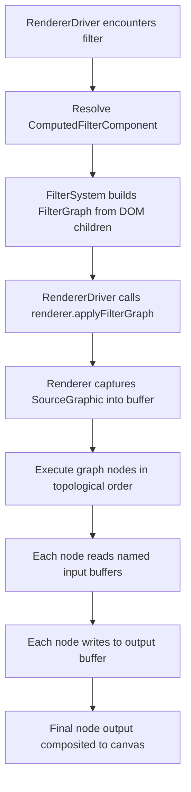

# Design: SVG Filter Effects

**Status:** Shipped (Milestones 1-5 complete; all 17 primitives implemented)
**Author:** Claude Opus 4.6
**Created:** 2026-03-07
**Last Updated:** 2026-03-17
**Tracking:** [#151](https://github.com/jwmcglynn/donner/issues/151)

## Summary

Implement full SVG filter support aligned with the
[Filter Effects Module Level 1](https://drafts.fxtf.org/filter-effects/) spec
(referenced by [SVG2 §11](https://www.w3.org/TR/SVG2/render.html#FilteringPaintedRegions)).
Donner now supports all 17 filter primitives with a working filter graph execution model,
`in`/`result` routing, and `SourceGraphic`/`SourceAlpha` standard inputs on both backends.
All filter pixel operations are implemented natively in the `tiny-skia-cpp` library
(`third_party/tiny-skia-cpp/src/tiny_skia/filter/`), keeping the renderer thin
(graph routing only). This design now tracks the remaining conformance debt,
CSS shorthand filter functions, color space cleanup, and future backend optimization work.

Filters are a high-impact gap for v1.0. Most real-world SVG artwork uses at least drop shadows or blur; icon sets and data visualizations use color matrix transforms and compositing. Without filter support these render as unfiltered content, which is visually wrong.

## Goals

- Implement all 17 filter primitives from the Filter Effects Level 1 spec.
- Support filter chains with `in`/`result` routing between primitives.
- Support CSS shorthand filter functions (`blur()`, `drop-shadow()`, `brightness()`, etc.).
- Work on both Skia and TinySkia backends.
- Pass the resvg test suite filter tests and targeted W3C filter test cases.
- Remove the experimental gate on `<filter>`.

## Non-Goals

- Filter Effects Module Level 2 features (e.g., `BackgroundImage`/`BackgroundAlpha` inputs via CSS compositing isolation — these are complex and rarely used).
- CSS `backdrop-filter`.
- GPU-accelerated filter pipelines (future optimization).
- Animation of filter parameters (separate animation milestone).

## Current State

**Implemented (TinySkia backend):**
- Filter graph execution model with named buffer routing (`in`/`result`)
- Standard inputs: `SourceGraphic`, `SourceAlpha`
- Filter region computation with `objectBoundingBox` and `userSpaceOnUse` `filterUnits`
- Filter region clipping on output
- Primitive subregion computation (explicit attributes; TODO: union-of-inputs default)
- `color-interpolation-filters` property with float `linearRGB` / `sRGB` conversion
- All 17 primitives: `feGaussianBlur`, `feFlood`, `feOffset`, `feComposite`, `feMerge`, `feColorMatrix`, `feBlend`, `feComponentTransfer`, `feDropShadow`, `feMorphology`, `feTile`, `feConvolveMatrix`, `feTurbulence`, `feDisplacementMap`, `feDiffuseLighting`, `feSpecularLighting`, `feImage`
- Light sources: `feDistantLight`, `fePointLight`, `feSpotLight` with coordinate scaling for non-1:1 viewBox/canvas ratios
- Native tiny-skia-cpp filter library with all implemented operations

**Implemented (Skia backend):**
- Offscreen filter capture using raster `SkSurface` layers
- Shared CPU fallback via `FilterGraphExecutor` for graph execution and filter region clipping
- Transformed local-raster execution for eligible blur chains
- CPU luminance-mask execution aligned with TinySkia for filter + mask interactions
- Native fast path for simple single-node `feGaussianBlur` graphs
- Clip stack replay into offscreen filter surfaces before filter execution
- Full `resvg_test_suite` passes on Skia

**Known gaps:**
- `primitiveUnits` coordinate space handling
- Some identity-like `linearRGB` cases still rely on thresholds because Donner's float pipeline
  does not bit-match resvg's quantized round-trip behavior
- Blur edge clipping: blur operates on full pixmap then clips, causing edge differences
- Skia backend still routes most graphs through the shared CPU executor
- Skia native `saveLayer` blur is currently restricted to no-crop cases; transformed blur chains use
  the shared local-raster executor instead
- `feImage` fragment references (`href="#elementId"`) render through 8-bit intermediate buffer, causing edge-pixel differences vs resvg's direct float rendering
- `feImage` external image subregion placement under host rotation (`e-feImage-011`, 2548 px edge misalignment)
- Light coordinate scaling: z and surfaceScale interaction at non-1:1 pixel density causes minor diffs for some spot light configurations (~3K pixels for cone-boundary cases)
- Invalid named result fallback: resolved — now falls back to previous result per SVG spec
- Filter + clip-path rendering order: resolved — clip-path now correctly clips the filter output,
  not the SourceGraphic input

## Open Issues and Current Findings

As of 2026-03-11:

- `bazel test //donner/svg/renderer/tests:resvg_test_suite` passes on the default TinySkia
  backend.
- `bazel test //donner/svg/renderer/tests:resvg_test_suite --config=skia` also passes.

### Resolved During This Investigation

- TinySkia now evaluates eligible blur chains in a transformed local raster instead of device
  space. This fixed the transformed blur family on the default backend:
  `e-feGaussianBlur-012.svg`, `e-filter-026.svg`, `e-filter-027.svg`, and `e-filter-058.svg`.
- Skia now uses the same transformed local-raster fallback for eligible simple blur chains.
  This fixed the remaining transformed Skia blur/filter cases in the full suite.
- Skia's native `saveLayer` blur path was narrowed after it produced incorrect results for plain
  anisotropic blur with a computed filter region (`e-feGaussianBlur-008.svg`,
  `e-feGaussianBlur-009.svg`, `e-feGaussianBlur-010.svg`). Those cases now use the shared CPU
  executor instead.
- Skia mask execution now mirrors TinySkia's CPU luminance-mask extraction and application model.
  This resolved the remaining Skia filter regression in `e-filter-053.svg`.
- Skia pattern rendering now uses the same supersampled raster-tile strategy as TinySkia instead of
  `SkPicture` shaders. This resolved the Skia pattern regressions in `e-pattern-008.svg`,
  `e-pattern-010.svg`, and `e-pattern-019.svg`, including the nested pattern case.
- Fixed invalid named result fallback in filter graph executor: when `in` references a non-existent
  named result, the spec says to treat it as if `in` was not specified (i.e., use previous result
  for non-first primitives, or SourceGraphic for the first). Previously fell back to SourceGraphic
  unconditionally. This fixed `e-filter-056.svg` (97,365 → 8 pixels).
- Fixed SVG rendering order for filter + clip-path: the spec defines the order as
  paint → filter → clip-path → mask → opacity. Previously clip-path was applied to the
  SourceGraphic before filtering, causing blurred edges on clipped content. Now pushFilterLayer
  saves/clears the clip mask so SourceGraphic is unclipped, and popFilterLayer restores the clip
  mask and applies it when compositing the filter output. This fixed `e-filter-052.svg`
  (42,888 → <100 pixels) and `e-filter-054.svg` (34,305 → 50 pixels).
- Tightened stale thresholds for tests that improved over time: `e-fePointLight-004.svg`
  (53,000 → 120), `e-feSpotLight-012.svg` (68,000 → 15,200), `e-feFlood-008.svg`
  (46,600 → 18,000), `e-feMerge-003.svg` (28,000 → 10,500), `e-feOffset-008.svg`
  (5,700 → 2,000).
- Fixed `feComponentTransfer` transparent pixel handling: when a pixel has alpha=0 and the
  transfer function produces non-zero output, the RGB transfer functions are now applied (instead
  of forcing RGB to black). This fixed `e-feComponentTransfer-020.svg` (70,400 → ~0 pixels).
- Fixed lighting color space: `lighting-color` CSS property values are now converted from sRGB
  to linearRGB when the filter primitive operates in linearRGB color space, per the SVG spec
  requirement to convert `lighting-color` to the filter primitive's color-interpolation-filters
  color space. No visible diff change for current tests (all use white light or sRGB mode), but
  this is spec-correct for non-white lighting colors in linearRGB mode.
- Tightened stale threshold: `e-feTurbulence-018.svg` (109,500 → 70,000).
- Fixed `feSpecularLighting` out-of-range `specularExponent` handling: values < 1.0 now skip the
  primitive entirely (produce transparent output), values > 128.0 are clamped to 128. This matches
  resvg's behavior (confirmed via source inspection). Previously all values were clamped to [1, 128]
  which produced a visible highlight for `specularExponent="0"` while resvg produced transparent.
  This fixed `e-feSpecularLighting-007.svg` (157,470 → 0 pixels).
- Fixed `feSpotLight` negative `specularExponent` handling: non-positive values now fall back to
  the default (1.0), matching resvg's `PositiveF32` validation. This enabled the previously-skipped
  `e-feSpotLight-005.svg` test (specularExponent="-10") which now passes at 0 pixel diff.

## Remaining Resvg Filter Debt

The full resvg suite now passes on both backends, but filter coverage still relies on a meaningful
set of skips and large thresholds. The remaining debt divides into feature gaps, conformance
investigations, and intentional skips for UB or pathological cases.

### Remaining Feature Gaps

- [x] Finish `primitiveUnits` and percentage primitive-subregion handling in the shared executor.
  Status: user-space and object-bounding-box primitive subregions now resolve correctly through the
  executor, including percentage coordinates and sizes, and the targeted OBB/percentage regression
  coverage lives in `FilterGraphExecutor_tests.cc`.
  Result: `e-feTile-006.svg`, `e-filter-010.svg`, `e-filter-012.svg`, and `e-filter-055.svg`
  pass on both backends without the old skip/large-threshold handling.
- [x] Add filter templating / `href` inheritance for `<filter>`.
  Affected tests: `e-filter-017.svg`, `e-filter-018.svg`, `e-filter-019.svg`.
  Status: inherited filter attributes and primitive children now resolve on both backends, and the
  tests are enabled. Their remaining tolerances are now tracked under the blur edge-clipping debt
  below.
- [x] Add the standard filter inputs that are still in scope for ordinary rendered content.
  Status: `FillPaint` and `StrokePaint` are now captured through the shared filter executor on both
  backends, with deterministic renderer coverage in
  `donner/svg/renderer/testdata/filter_fill_paint.svg` and
  `donner/svg/renderer/testdata/filter_stroke_paint.svg`.
  Resvg note: `e-filter-034.svg`, `e-filter-035.svg`, `e-filter-036.svg`,
  `e-filter-037.svg`, `e-filter-038.svg`, and `e-filter-065.svg` remain skipped because their
  titles explicitly mark them as UB, so they are no longer treated as actionable feature debt.
  Remaining gap: keep `BackgroundImage` / `BackgroundAlpha` (`e-filter-032.svg`,
  `e-filter-033.svg`) explicitly deferred unless scope changes.
- [x] Extend `feImage` with fragment references (`href="#elementId"`).
  Fragment references render the referenced element subtree into an offscreen pixmap via
  `instantiateSubtreeForStandaloneRender` + `traverseRange`, with a recursion guard to prevent
  infinite loops. Elements inside `<defs>` are handled by ignoring `Nonrenderable` behavior.
  Subregion support (OBB, percentage width, absolute coords) works for non-rotated cases
  (`e-feImage-007.svg` through `e-feImage-010.svg`). Remaining gap: `e-feImage-011.svg` (rotated
  subregion) has a filter region sizing mismatch with the rotation transform.
- [ ] Support filter application on the root `<svg>`.
  Affected tests: `e-filter-060.svg`.
  Plan: define root-surface capture semantics in `RendererDriver` and ensure viewport clipping is
  applied after the filtered root result is composited back.
- [x] Revalidate the remaining diffuse-lighting skips.
  Status: `e-feDiffuseLighting-022.svg` now passes on both backends and has been re-enabled.
  `e-feDiffuseLighting-021.svg` remains skipped because it is still a real transformed-lighting
  bug, not a `kernelUnitLength` issue.
  Note: `kernelUnitLength` itself is still not covered by a dedicated resvg case here; treat it
  as future spec-completeness work if a real repro or targeted fixture appears.

### Threshold Reduction Investigations

- [ ] Decide how closely we want to match resvg's quantized `linearRGB` behavior and then tighten
  the remaining color-space thresholds.
  Affected tests: `a-color-interpolation-filters-001.svg`, `e-feColorMatrix-001.svg` through
  `e-feColorMatrix-007.svg`, `e-feColorMatrix-010.svg` through `e-feColorMatrix-012.svg`,
  `e-feColorMatrix-015.svg`, `e-feDropShadow-001.svg` through `e-feDropShadow-006.svg`,
  `e-feMerge-001.svg` through `e-feMerge-003.svg`, `e-feImage-003.svg`, `e-feImage-004.svg`,
  `e-filter-028.svg`, `e-filter-046.svg`, and `e-feTurbulence-019.svg`.
  Plan: measure which diffs come from resvg's uint8 quantization versus real rendering errors,
  then either keep the current float path and tighten only the defensible thresholds or add an
  explicit compatibility mode for the no-op / identity-like cases.
- [x] Fix SVG rendering order for filter + clip-path/mask.
  The rendering pipeline now correctly implements the SVG spec order: paint → filter → clip-path →
  mask → opacity. `pushFilterLayer` saves/clears the clip mask so the SourceGraphic is unclipped,
  and `popFilterLayer` restores the clip mask for compositing. This resolved the clip-path and
  mask interaction cases:
  `e-filter-052.svg` (42,888 → <100px), `e-filter-054.svg` (34,305 → 50px).
  Remaining blur edge-clipping cases are now purely about the blur kernel extent, not rendering
  order: `e-filter-002.svg`, `e-filter-003.svg`, `e-filter-009.svg`, `e-filter-017.svg`,
  `e-filter-018.svg`, `e-filter-019.svg`, `e-filter-039.svg`, `e-filter-040.svg`,
  `e-filter-041.svg`, `e-filter-053.svg`, `e-filter-058.svg`, and `e-filter-059.svg`.
- [ ] Match blur edge-clipping semantics more closely to the spec.
  Remaining affected tests: `e-filter-009.svg`, `e-filter-017.svg`, `e-filter-018.svg`,
  `e-filter-019.svg`, `e-filter-046.svg`.
  Plan: stop treating the full pixmap as the blur extent, compute primitive subregions from the
  union of inputs, and crop the blur kernel to the primitive region rather than blurring first and
  clipping afterward.
- [ ] Close the remaining coordinate-space and transform threshold cases.
  Affected tests: `e-feFlood-008.svg`, `e-feGaussianBlur-012.svg`, `e-feOffset-007.svg`,
  `e-feOffset-008.svg`, `e-filter-004.svg`, `e-filter-010.svg`, `e-filter-011.svg`,
  `e-filter-012.svg`, `e-filter-014.svg`, `e-filter-026.svg`,
  `e-filter-027.svg`, `e-filter-055.svg`, `e-filter-058.svg`, `e-filter-059.svg`,
  and `e-feTurbulence-018.svg`.
  Plan: audit the remaining `deviceFromFilter` conversions for OBB and transformed inputs, and add
  transform-specific regression tests around filter-region clipping.
- [ ] Investigate the remaining high-threshold graph-routing and arithmetic cases.
  Affected tests: `e-feComponentTransfer-020.svg`, `e-feConvolveMatrix-014.svg`,
  `e-feConvolveMatrix-018.svg`, `e-feConvolveMatrix-022.svg`, `e-feConvolveMatrix-024.svg`,
  `e-feTile-001.svg`, `e-feTile-002.svg`, `e-feTile-004.svg`, `e-feTile-005.svg`.
  Status: `e-filter-056.svg` resolved (invalid named result fallback fixed, 97K → 8px).
  `e-filter-052.svg` and `e-filter-054.svg` resolved (rendering order fix, clip-path now applied
  to filter output). Several stale geometry thresholds tightened.
  Plan: add small golden fixtures for each primitive in isolation, then debug whether the diffs
  come from arithmetic mismatch, tile seam sampling, or invalid-input fallback behavior.
- [ ] Reduce the remaining lighting tolerances.
  Affected tests: `e-fePointLight-004.svg`, `e-feSpecularLighting-002.svg`,
  `e-feSpecularLighting-004.svg`, `e-feSpecularLighting-005.svg`,
  `e-feSpecularLighting-007.svg`, `e-feSpotLight-007.svg`, `e-feSpotLight-008.svg`,
  and `e-feSpotLight-012.svg`.
  Plan: separate alpha-clipping differences from lighting-vector math, then investigate spotlight
  cone boundaries, coordinate scaling, and any remaining mismatch between float lighting and the
  resvg reference images.

### Skip Triage: Keep, Fix, or Reclassify

- [x] Fix parser or validation bugs that are currently hidden by skips.
  Affected tests: `e-feComponentTransfer-009.svg`.
  Status: invalid unit-suffixed `tableValues` entries on `feFunc*` elements are now rejected at
  parse time, and `e-feComponentTransfer-009.svg` is enabled on both backends.
- [ ] Decide which current skips are genuine non-goals or external-integration work.
  Affected tests: `e-feImage-001.svg`, `e-feImage-002.svg`, `e-filter-032.svg`,
  `e-filter-033.svg`.
  Plan: keep these documented as deferred if scope remains unchanged; otherwise split external
  resource loading from standard-input compositing into separate milestones.
- [ ] Keep UB / pathological cases explicitly classified until we choose to emulate resvg quirks.
  Affected tests: `e-feColorMatrix-008.svg`, `e-feColorMatrix-009.svg`,
  `e-feConvolveMatrix-015.svg`, `e-feConvolveMatrix-016.svg`,
  `e-feConvolveMatrix-017.svg`, `e-feConvolveMatrix-023.svg`, `e-feSpotLight-005.svg`,
  `e-feTile-007.svg`, and `e-feTurbulence-017.svg`.
  Plan: leave these skipped with comments unless we decide to chase browser-compat behavior over
  spec-defined UB.
- [ ] Revisit performance-only skips with dedicated fast paths or separate stress coverage.
  Affected tests: `e-feGaussianBlur-002.svg` and `e-feMorphology-012.svg`.
  Plan: either add asymptotically faster implementations for huge kernels or keep them out of the
  normal suite and cover them with dedicated perf/stress tests instead of image-compare tests.

## Next Steps

- Finish the remaining resvg filter debt in the order above: first real feature gaps, then
  threshold-reduction investigations, then skip reclassification.
- Treat color-space threshold cleanup and blur-edge clipping as the next highest-leverage
  conformance tasks because they unlock multiple thresholded cases at once.
- Begin Milestone 6 once the highest-cost resvg skips and thresholds are retired.

## Implementation Plan

### Milestone 1: Filter graph plumbing

Replace the current `std::vector<FilterEffect>` linear chain with a proper filter graph that supports named inputs/outputs and standard input keywords.

- [x] Define `FilterGraph` data structure with nodes, edges, and named buffers (`FilterGraph.h`)
- [x] Add `in` attribute parsing to `SVGFilterPrimitiveStandardAttributes` (keyword or result name)
- [x] Implement `result` attribute routing (implicit chaining when omitted)
- [x] Replace `pushFilterLayer`/`popFilterLayer` interface with graph-aware execution (`FilterGraph` passed through interface)
- [x] Move Gaussian blur to native tiny-skia-cpp filter library (`tiny_skia::filter::gaussianBlur`)
- [x] Add `in2` attribute parsing for two-input primitives
- [x] Implement standard input resolution (`SourceGraphic`, `SourceAlpha`, `FillPaint`,
  `StrokePaint`) with multi-buffer routing
- [x] Add filter templating / `href` inheritance for `<filter>`
- [x] Implement filter region clipping (x/y/width/height on `<filter>`, with objectBoundingBox defaults)
- [x] Implement primitive subregion computation (explicit x/y/width/height on each primitive; TODO: union-of-inputs default)
- [x] Add `primitiveUnits` coordinate space handling (`userSpaceOnUse` vs `objectBoundingBox`)
- [x] Add `color-interpolation-filters` property support (`linearRGB` default vs `sRGB`)
- [ ] Remove legacy `effectChain` from `ComputedFilterComponent`

### Milestone 2: High-frequency primitives (Tranche 1)

The most commonly used filter primitives in real-world SVG content.

- [x] `feFlood` — solid color fill (trivial; foundation for drop shadows)
- [x] `feOffset` — translate an image buffer by dx/dy
- [x] `feMerge` / `feMergeNode` — layer multiple buffers with Source Over compositing
- [x] `feColorMatrix` — 5x4 matrix, saturate, hueRotate, luminanceToAlpha modes
- [x] `feComposite` — Porter-Duff operators (over/in/out/atop/xor/lighter) + arithmetic mode
- [x] `feBlend` — CSS blend modes (normal, multiply, screen, darken, lighten)
- [x] `feDropShadow` — convenience primitive (blur + offset + flood + composite + merge)
- [x] `feComponentTransfer` / `feFuncR/G/B/A` — per-channel transfer functions (identity, table, discrete, linear, gamma)

### Milestone 3: Spatial and generative primitives (Tranche 2)

Less common but required for full spec compliance.

- [x] `feConvolveMatrix` — arbitrary convolution kernel with edgeMode handling
- [x] `feMorphology` — erode/dilate operations
- [x] `feTile` — tile input to fill primitive subregion
- [x] `feTurbulence` — Perlin/fractal noise generation
- [x] `feImage` — external image rendering, fragment references (`href="#elementId"`), and primitive subregion placement (OBB, percentage, absolute coords) complete; rotated subregion sizing still open (`e-feImage-011.svg`)
- [x] `feDisplacementMap` — spatial displacement using a channel map
- [x] `feGaussianBlur` — `edgeMode` attribute (none/duplicate/wrap)

### Milestone 4: Lighting primitives

- [x] `feDiffuseLighting` — diffuse reflection using bump map from alpha channel
- [x] `feSpecularLighting` — specular highlights using bump map
- [x] `feDistantLight` — directional light source (child of lighting primitives)
- [x] `fePointLight` — point light source
- [x] `feSpotLight` — spotlight source with coordinate scaling (x/y/z scaled to pixel space)
- [x] `lighting-color` CSS property parsing and resolution

### Milestone 5: Skia backend integration

- [x] Land the bridge layer: raster `SkSurface` capture, clip replay, and shared CPU fallback
- [x] Add a native Skia fast path for simple single-node `feGaussianBlur`
- [x] Add transformed local-raster execution for blur-chain cases that do not match `saveLayer`
- [x] Align Skia mask handling with TinySkia's CPU luminance-mask execution
- [x] Resolve Skia regressions uncovered during filter bring-up so the full `resvg_test_suite`
  passes on Skia
- [ ] Expand native lowering for simple linear chains (`feOffset`, `feDropShadow`,
      `feColorMatrix`, `feComposite`, `feBlend`, `feMorphology`, `feDisplacementMap`,
      `feTile`)
- [ ] Partition graphs into maximal native Skia subgraphs and CPU fallback islands
- [x] Keep unsupported graphs on the shared executor until native lowering is behaviorally correct

### Milestone 6: CSS shorthand filter function conformance

CSS shorthand filter functions (`blur()`, `brightness()`, `drop-shadow()`, etc.) are parsed and
mapped to filter graph nodes. This milestone tracks the conformance bugs found during the v0.5
filter-on-text pixel diff burndown.

**Investigation findings (2026-03-16):**

The `a-filter-*` resvg tests apply CSS filter functions to text elements. Most diffs fall into
distinct categories:

- **No-diff tests:** a-filter-006/007/008/009/010/014 (0–1px) — invalid filter syntax, both
  renderers show unfiltered content. a-filter-017–030, 041–043 (0px) — simple filters on rects,
  exact match.
- **Font-only diffs:** a-filter-031–036 (~2.8K px each) — color-adjust functions on rects with
  text labels. The diff is entirely from stb_truetype vs FreeType glyph differences. Irreducible.
- **Blur algorithm diffs:** a-filter-002/003/004 (~5K px) — `drop-shadow()` on circles. The
  three-pass box blur approximation in tiny-skia-cpp produces slightly different blur halos than
  resvg. Small per-pixel diffs (~1–3 values) across the entire halo. Irreducible without matching
  resvg's exact blur implementation.

**Bugs found:**

1. **Negative value validation** (a-filter-037, 42K px) — `brightness()`, `contrast()`, and
   `saturate()` accept negative values. Per CSS Filter Effects Level 1, negative values are not
   allowed and should make the function (and thus the entire filter list) invalid. Donner applies
   them, producing wrong colors; resvg ignores the invalid filter.
   - File: `donner/svg/properties/PropertyRegistry.cc` lines 779–824
   - Fix: Return parse error for negative values in these three functions.

2. **Drop-shadow default color** (a-filter-011, 16K px) — The CSS spec says the default shadow
   color is `currentColor`, not black. Donner defaults to `css::RGBA(0, 0, 0, 0xFF)`.
   `a-filter-012` uses explicit `currentColor` and has only 5px diff, confirming the resolution
   path works.
   - Files: `donner/svg/properties/PropertyRegistry.cc` line 840,
     `donner/svg/components/filter/FilterEffect.h` line 116
   - Fix: Change default from `css::RGBA(0, 0, 0, 0xFF)` to `css::Color::CurrentColor{}`.

3. **Relative units in CSS filter lengths** (a-filter-015, 35K px) — `lengthToPixels()` in
   `RendererDriver.cc` returns raw values for `em`/`ex`/`rem` units instead of resolving them
   against the element's computed font size. For `drop-shadow(blue 0.2em 0.3em 0.1em)` with
   `font-size="64"`, offsets become 0.2px instead of 12.8px.
   - File: `donner/svg/renderer/RendererDriver.cc` lines 152–166
   - Fix: Plumb font metrics into `resolveFilterGraph()` so `lengthToPixels()` can resolve
     `em` = computed font size, `rem` = root font size, `ex` = x-height.

4. **Color space in url()+CSS filter chains** (a-filter-038, 145K px) — When
   `filter="url(#f) grayscale()"` is used, the `url()` graph inherits `linearRGB` (SVG default)
   but the `grayscale()` CSS function uses `sRGB` (CSS default). The spec is ambiguous about
   chained `url()` + CSS functions. The per-pixel diff is ~7 values (~2.7%), but it affects every
   pixel in the rect.
   - File: `donner/svg/renderer/RendererDriver.cc` lines 191–207
   - Fix: Needs spec interpretation decision. Lowest priority.

**Implementation plan:**

- [x] Parse CSS `filter` property function syntax: `blur()`, `brightness()`, `contrast()`,
  `drop-shadow()`, `grayscale()`, `hue-rotate()`, `invert()`, `opacity()`, `saturate()`, `sepia()`
- [x] Map each function to equivalent filter graph nodes
- [x] Support chained function lists (e.g., `filter: blur(5px) brightness(1.2)`)
- [x] **Bug 1: Reject negative values** in `brightness()`, `contrast()`, `saturate()` parsing.
  In `PropertyRegistry.cc` (lines 779–824), after `ParseNumberPercentage` succeeds, check
  `result.result() < 0.0` and return `ParseError`. This makes the entire `filter` property
  invalid, causing the element to render unfiltered (matching spec). Result: a-filter-037
  42K→0px.
- [x] **Bug 2: Drop-shadow default color → currentColor.** Changed default from
  `css::RGBA(0, 0, 0, 0xFF)` to `css::Color::CurrentColor{}` in `FilterEffect.h` line 116
  (struct default) and `PropertyRegistry.cc` line 840 (parse default). The resolution path
  (`resolveFilterGraph()` → `e.color.resolve(currentColor, 1.0f)`) substitutes the element's
  computed color for `CurrentColor`. Result: a-filter-011 16K→~5px (font diff only).
- [x] **Bug 3: Resolve relative units in CSS filter lengths.** Replaced `lengthToPixels()`
  (absolute-only) with `Lengthd::toPixels(viewBox, fontMetrics)` (full unit resolution). Added
  `FontMetrics` and `Boxd viewBox` parameters to `resolveFilterGraph()`. At each call site,
  compute font metrics following the `toStrokeParams()` pattern: get viewBox from `LayoutSystem`,
  resolve `fontSize` from `style.properties->fontSize`, build `FontMetrics` using
  `FontMetrics::DefaultsWithFontSize()`. Reference: `fontMetricsForElement()` in
  `ShapeSystem.cc` for the full pattern including root font size and viewport size resolution.
  Result: a-filter-015 35K→~5K (remaining diff is font rendering).
- [ ] **Bug 4: Color space in url()+CSS chains** — Deferred. Spec-ambiguous: when
  `filter="url(#f) grayscale()"` is used, the `url()` graph uses linearRGB (SVG default) but
  the CSS function uses sRGB (CSS default). Documented as known limitation (a-filter-038: 145K).
- [x] Tighten `a-filter-*` test thresholds after fixes. Reductions: a-filter-037 (43K→0,
  override removed), a-filter-011 (17K→~5K), a-filter-015 (35K→~5K), a-filter-013 (24K→~5K).

### Milestone 7: Polish and conformance

- [ ] Remove experimental flag from `<filter>` and all `<fe*>` elements
- [ ] Enable all resvg filter test cases
- [ ] Add targeted W3C SVG test suite filter cases
- [ ] Performance optimization pass (avoid unnecessary buffer copies, in-place operations)
- [ ] Fuzz filter attribute parsing

## Proposed Architecture

### Filter Graph Model

The current implementation passes a flat `std::vector<FilterEffect>` to the renderer. This is insufficient for multi-input primitives (`feBlend`, `feComposite`) and named routing (`in`/`result`). The new model introduces a `FilterGraph`:

```
FilterGraph
  nodes: vector<FilterNode>       // One per primitive, in document order
  lastNodeIndex: size_t            // Output node (last primitive in DOM)

FilterNode
  primitive: FilterPrimitive       // Variant of all primitive types
  inputs: vector<FilterInput>      // Named or implicit inputs
  subregion: optional<Rect>        // Computed primitive subregion
  result: optional<string>         // Named output buffer
  colorSpace: ColorSpace           // linearRGB or sRGB

FilterInput = variant<
  StandardInput,                   // SourceGraphic, SourceAlpha, FillPaint, StrokePaint
  PreviousResult,                  // Implicit: output of preceding node
  NamedResult(string)              // Explicit: references another node's `result`
>
```

### Data Flow



### Renderer Interface Changes

The push/pop filter layer interface now accepts a `FilterGraph` instead of a flat effect chain:

```cpp
// Current (implemented):
virtual void pushFilterLayer(const components::FilterGraph& filterGraph) = 0;
virtual void popFilterLayer() = 0;
```

`pushFilterLayer` captures the current transform/clip state and creates an offscreen buffer.
Content is rendered into the buffer between push and pop. On `popFilterLayer`, the graph is
executed against the captured content (SourceGraphic) and the result is composited back.

Future evolution: once multi-buffer routing is complete, the executor will allocate intermediate
buffers for each named result, resolve standard inputs, and execute nodes in document order.
The push/pop structure remains since SourceGraphic capture requires rendering content into an
isolated surface first.

### ECS Components

New components for each primitive type, following the existing `FEGaussianBlurComponent` pattern:

| Component | Key Fields |
|---|---|
| `FEColorMatrixComponent` | `type`, `values` (matrix/saturate/hueRotate/luminanceToAlpha) |
| `FECompositeComponent` | `operator`, `k1`-`k4` |
| `FEBlendComponent` | `mode` |
| `FEFloodComponent` | `floodColor`, `floodOpacity` |
| `FEOffsetComponent` | `dx`, `dy` |
| `FEMergeComponent` | (children are `FEMergeNodeComponent` with `in`) |
| `FEDropShadowComponent` | `dx`, `dy`, `stdDeviation`, `floodColor`, `floodOpacity` |
| `FEComponentTransferComponent` | (children are `FEFuncComponent` with `type`, `tableValues`, etc.) |
| `FEConvolveMatrixComponent` | `order`, `kernelMatrix`, `divisor`, `bias`, `targetX/Y`, `edgeMode`, `preserveAlpha` |
| `FEMorphologyComponent` | `operator`, `radiusX`, `radiusY` |
| `FETileComponent` | (no additional attributes) |
| `FETurbulenceComponent` | `type`, `baseFrequencyX/Y`, `numOctaves`, `seed`, `stitchTiles` |
| `FEImageComponent` | `href`, `preserveAspectRatio` |
| `FEDisplacementMapComponent` | `scale`, `xChannelSelector`, `yChannelSelector` |
| `FEDiffuseLightingComponent` | `surfaceScale`, `diffuseConstant`, `lightingColor` |
| `FESpecularLightingComponent` | `surfaceScale`, `specularConstant`, `specularExponent`, `lightingColor` |
| `FEDistantLightComponent` | `azimuth`, `elevation` |
| `FEPointLightComponent` | `x`, `y`, `z` |
| `FESpotLightComponent` | `x`, `y`, `z`, `pointsAtX/Y/Z`, `specularExponent`, `limitingConeAngle` |

### Where Each Layer Lives

| Layer | Location | Responsibility |
|---|---|---|
| SVG element classes | `donner/svg/SVGFe*.h` | DOM API, attribute accessors |
| Attribute parsing | `donner/svg/parser/AttributeParser.cc` | XML attribute -> component |
| ECS components | `donner/svg/components/filter/` | Data storage |
| Filter system | `donner/svg/components/filter/FilterSystem.cc` | DOM -> FilterGraph construction |
| Renderer driver | `donner/svg/renderer/RendererDriver.cc` | Orchestrates capture + graph execution |
| Skia backend | `donner/svg/renderer/RendererSkia.cc` | Skia-specific buffer ops |
| TinySkia backend | `donner/svg/renderer/RendererTinySkia.cc` | Pixmap-based buffer ops |

### Color Space Handling

Filter primitives default to operating in `linearRGB` color space (per `color-interpolation-filters` property). The renderer must:

1. Convert `SourceGraphic` from sRGB to linearRGB on capture (unless `color-interpolation-filters: sRGB`).
2. Execute all primitives in the specified color space.
3. Convert back to sRGB before compositing the result.

CSS shorthand filter functions always operate in sRGB regardless of this property.

### TinySkia Native Filter Library

All filter pixel operations are implemented natively inside `third_party/tiny-skia-cpp` as a
reusable library that operates on `tiny_skia::Pixmap` buffers. This architecture provides:

1. **Separation of concerns:** The SVG renderer handles graph execution (buffer allocation, input
   resolution, subregion clipping, coordinate transforms) while the library handles pure pixel
   math. The renderer never manipulates pixel data directly — it delegates every operation to a
   library function.

2. **Independent testability:** Each filter function can be unit-tested with synthetic pixmaps
   without requiring SVG parsing or a render pipeline. Tests live in
   `third_party/tiny-skia-cpp/src/tiny_skia/tests/`.

3. **Reusability:** The library is not SVG-specific. Any application using `tiny_skia::Pixmap`
   can use the filter functions for image processing.

**Location:** `third_party/tiny-skia-cpp/src/tiny_skia/filter/`

Each filter primitive maps to the library in one of three ways:

- **Direct 1:1 mapping:** Most primitives have a single library function that performs the entire
  operation (e.g., `filter::gaussianBlur`, `filter::colorMatrix`, `filter::morphology`). The
  renderer calls the function with the resolved inputs and transform-adjusted parameters.

- **Decomposition into existing functions:** Some primitives are syntactic sugar over a pipeline
  of simpler operations. `feDropShadow` decomposes into `flood()` → `composite(in)` → `offset()`
  → `gaussianBlur()` → `merge()` entirely within the renderer's graph executor. No dedicated
  library function is needed.

- **Renderer-only operations:** `feImage` requires access to the SVG document and image loading
  infrastructure, so it is handled entirely in the renderer layer. The library provides no
  function for it.

#### API Summary

| Operation | tiny-skia-cpp API | Status |
|---|---|---|
| Blur | `filter::gaussianBlur(pixmap, sigmaX, sigmaY)` | Done |
| Flood | `filter::flood(dst, r, g, b, a)` | Done |
| Offset | `filter::offset(src, dst, dx, dy)` | Done |
| ColorMatrix | `filter::colorMatrix(pixmap, matrix)` | Done |
| ColorMatrix helpers | `filter::saturateMatrix(s)`, `hueRotateMatrix(deg)`, `luminanceToAlphaMatrix()`, `identityMatrix()` | Done |
| ComponentTransfer | `filter::componentTransfer(pixmap, funcR, funcG, funcB, funcA)` | Done |
| Blend | `filter::blend(bg, fg, dst, mode)` | Done |
| Composite | `filter::composite(in1, in2, dst, op, k1-k4)` | Done |
| Merge | `filter::merge(layers, dst)` | Done |
| ColorSpace | `filter::srgbToLinear(pixmap)` / `filter::linearToSrgb(pixmap)` | Done |
| ConvolveMatrix | `filter::convolveMatrix(src, dst, params)` | Done |
| Morphology | `filter::morphology(src, dst, op, rx, ry)` | Done |
| Tile | `filter::tile(src, dst, tileX, tileY, tileW, tileH)` | Done |
| Turbulence | `filter::turbulence(dst, params)` | Done |
| DisplacementMap | `filter::displacementMap(src, map, dst, scale, xCh, yCh)` | Done |
| DiffuseLighting | `filter::diffuseLighting(src, dst, params)` | Done |
| SpecularLighting | `filter::specularLighting(src, dst, params)` | Done |
| DropShadow | *(decomposed in renderer: flood+composite+offset+blur+merge)* | Done |

**All library functions are implemented.** The lighting primitives (`diffuseLighting`,
`specularLighting`) share a common infrastructure for computing surface normals from the alpha
channel (Sobel-like kernels per SVG spec) and evaluating light sources. The light source
(distant/point/spot) is passed as a `LightSourceParams` struct. Both functions share the same
normal computation code; they differ only in the reflection model (Lambertian diffuse vs. Phong
specular).

**Light coordinate scaling:** When the canvas resolution differs from the SVG user space (e.g.,
viewBox="0 0 200 200" rendered at 500x500), point/spot light coordinates (x, y, z, pointsAtX/Y/Z)
are transformed from user space to pixel space using `currentTransform_`. The z coordinates are
scaled by the uniform pixel scale factor (RMS of transform scale factors) to preserve correct 3D
light direction vectors. `surfaceScale` is NOT scaled — it controls bump map height which works
correctly at any pixel density since the Sobel kernel already adapts to the pixel grid.

#### Graph Executor (`RendererTinySkia`)

The `RendererTinySkia` implements graph execution in the renderer layer (not in the tiny-skia-cpp
library, since graph routing is SVG-specific):

```
applyFilterGraph(sourceGraphic, filterGraph):
  buffers = {}
  previousOutput = sourceGraphic

  for each node in filterGraph.nodes:
    // 1. Resolve inputs
    inputs = []
    for each input in node.inputs:
      match input:
        Previous       -> inputs.push(previousOutput)
        SourceGraphic  -> inputs.push(sourceGraphic)
        SourceAlpha    -> inputs.push(extractAlpha(sourceGraphic))
        FillPaint      -> inputs.push(currentFillPaintBuffer())
        StrokePaint    -> inputs.push(currentStrokePaintBuffer())
        Named(name)    -> inputs.push(buffers[name])

    // 2. Allocate output buffer (same dimensions as filter region)
    output = allocatePixmap(filterRegion)

    // 3. Execute primitive via tiny-skia-cpp filter library
    executePrimitive(node.primitive, inputs, output)

    // 4. Store named result
    if node.result:
      buffers[node.result] = output
    previousOutput = output

  // 5. Composite final output onto canvas
  compositePixmap(previousOutput, 1.0)
```

**Buffer management:** Each intermediate result is a `tiny_skia::Pixmap`. Buffers are allocated on
demand and reused when a named result is no longer referenced by subsequent nodes. The executor
tracks reference counts for named results and frees buffers when their last consumer has executed.

#### Implementation Details Per Primitive

##### feGaussianBlur (done)

**Algorithm:** Separable 1D convolution. For sigma < 2.0, uses a discrete Gaussian kernel
(compute weights from `exp(-x^2 / 2*sigma^2)`, normalize). For sigma >= 2.0, uses a 3-pass box
blur approximation matching Skia's behavior: compute box window size from
`floor(sigma * 3*sqrt(2*pi)/4 + 0.5)`, convolve three box kernels together to get a piecewise
quadratic approximation.

**Complexity:** O(w*h*k) where k is kernel radius; box blur approximation is O(w*h) regardless of
sigma since box blur can use a running sum (future optimization).

**Edge handling:** Currently clamps to border (pixels outside the image are skipped in the kernel
sum, and the kernel is renormalized). TODO: add `edgeMode` support (none = transparent black,
duplicate = clamp, wrap = tile).

##### feFlood

**Algorithm:** Fill the output buffer with a solid premultiplied RGBA color. Trivially simple —
iterate all pixels and set to the flood color * flood opacity.

```cpp
void flood(Pixmap& dst, RGBA8 color);
```

##### feOffset

**Algorithm:** Copy source pixels shifted by (dx, dy) in integer pixel coordinates. Pixels that
shift outside the buffer are discarded; uncovered pixels become transparent black. When dx/dy are
non-integer, use bilinear interpolation between the four nearest source pixels.

```cpp
void offset(const Pixmap& src, Pixmap& dst, double dx, double dy);
```

##### feColorMatrix

**Algorithm:** Apply a 5x4 color matrix to each pixel. The matrix transforms
`[R, G, B, A, 1] -> [R', G', B', A']`. Operates on unpremultiplied values: unpremultiply input,
apply matrix, clamp to [0, 255], re-premultiply.

The four modes map to specific matrices:
- **matrix:** Direct 20-value matrix from attribute.
- **saturate(s):** A 3x3 luminance-preserving saturation matrix (ITU-R BT.601 weights: 0.2126,
  0.7152, 0.0722) with identity alpha row.
- **hueRotate(angle):** Rotation in the RGB color space around the luminance axis, constructed from
  cos/sin of the angle combined with luminance weights.
- **luminanceToAlpha:** Sets `A' = 0.2126*R + 0.7152*G + 0.0722*B`, sets `R'=G'=B'=0`.

```cpp
void colorMatrix(Pixmap& pixmap, std::span<const double, 20> matrix);
```

##### feComponentTransfer

**Algorithm:** Apply independent transfer functions to each RGBA channel. Unpremultiply input,
apply the per-channel function, clamp to [0, 1], re-premultiply.

Transfer function types (per channel):
- **identity:** `C' = C`
- **table:** Piecewise linear interpolation into `tableValues` (n values define n-1 equal
  segments; `C' = v_k + (C*n - k) * (v_{k+1} - v_k)` where `k = floor(C * (n-1))`).
- **discrete:** Step function into `tableValues` (`C' = v_k` where `k = floor(C * n)`).
- **linear:** `C' = slope * C + intercept`
- **gamma:** `C' = amplitude * pow(C, exponent) + offset`

**Optimization:** Pre-compute a 256-entry LUT for each channel, then apply as a table lookup per
pixel. This makes all function types O(1) per pixel regardless of table size.

```cpp
struct TransferFunc { FuncType type; std::span<const double> tableValues; double slope, intercept, amplitude, exponent, offset; };
void componentTransfer(Pixmap& pixmap, const TransferFunc& r, const TransferFunc& g, const TransferFunc& b, const TransferFunc& a);
```

##### feBlend

**Algorithm:** Per-pixel blend of two inputs using CSS blend modes. The `in` input is the
foreground (Cs), `in2` is the background (Cb). Both must be unpremultiplied for the blend
formula, then the result is premultiplied for storage.

General formula: `Cr = (1-Ab)*Cs + (1-As)*Cb + As*Ab*B(Cb, Cs)` where B is the blend function.

Blend functions:
- **normal:** `B(Cb,Cs) = Cs`
- **multiply:** `B(Cb,Cs) = Cb*Cs`
- **screen:** `B(Cb,Cs) = Cb + Cs - Cb*Cs`
- **overlay:** `B(Cb,Cs) = HardLight(Cs, Cb)` (swap order)
- **darken:** `B(Cb,Cs) = min(Cb, Cs)`
- **lighten:** `B(Cb,Cs) = max(Cb, Cs)`
- **color-dodge:** `B(Cb,Cs) = Cb==0 ? 0 : Cs==1 ? 1 : min(1, Cb/(1-Cs))`
- **color-burn:** `B(Cb,Cs) = Cb==1 ? 1 : Cs==0 ? 0 : 1-min(1, (1-Cb)/Cs)`
- **hard-light:** `B(Cb,Cs) = Cs<=0.5 ? 2*Cb*Cs : screen(Cb, 2*Cs-1)`
- **soft-light:** Pegtop formula
- **difference:** `B(Cb,Cs) = |Cb - Cs|`
- **exclusion:** `B(Cb,Cs) = Cb + Cs - 2*Cb*Cs`
- **hue/saturation/color/luminosity:** HSL-based non-separable blend modes

```cpp
void blend(const Pixmap& bg, const Pixmap& fg, Pixmap& dst, BlendMode mode);
```

##### feComposite

**Algorithm:** Porter-Duff compositing of two inputs. The `in` input is source, `in2` is
destination. Operates on premultiplied values (Porter-Duff formulas assume premultiplied alpha).

Operators (Fa, Fb are source/dest factors):
- **over:** `Fa=1, Fb=1-As` -> `Co = Cs + Cd*(1-As)`
- **in:** `Fa=Ad, Fb=0` -> `Co = Cs*Ad`
- **out:** `Fa=1-Ad, Fb=0` -> `Co = Cs*(1-Ad)`
- **atop:** `Fa=Ad, Fb=1-As` -> `Co = Cs*Ad + Cd*(1-As)`
- **xor:** `Fa=1-Ad, Fb=1-As` -> `Co = Cs*(1-Ad) + Cd*(1-As)`
- **lighter:** `Co = Cs + Cd` (clamped to [0,1])
- **arithmetic:** `Co = k1*Cs*Cd + k2*Cs + k3*Cd + k4` (clamped to [0,1])

```cpp
void composite(const Pixmap& in1, const Pixmap& in2, Pixmap& dst, CompositeOp op, double k1, double k2, double k3, double k4);
```

##### feMerge

**Algorithm:** Composite N input layers using Source Over, bottom to top. Equivalent to
successive `feComposite operator="over"` operations. Each `feMergeNode` child specifies an `in`
attribute referencing a named result or standard input.

Implementation: initialize output to transparent black, then for each layer composite with
Source Over (`dst = src + dst*(1-srcA)`).

```cpp
void merge(std::span<const Pixmap*> layers, Pixmap& dst);
```

##### feDropShadow

**Algorithm:** Convenience primitive equivalent to the following pipeline:
1. Flood the shadow color at the given opacity
2. Composite (in) the source alpha with the flood to colorize the shadow
3. Offset by (dx, dy)
4. Gaussian blur with stdDeviation
5. Merge the blurred shadow under the original SourceGraphic

Implemented by decomposing into calls to `flood()`, `composite()`, `offset()`,
`gaussianBlur()`, and `merge()` in the graph executor rather than as a single library function.

##### feConvolveMatrix

**Algorithm:** 2D convolution with a user-specified kernel of size `orderX * orderY`. For each
output pixel `(x,y)`:
```
result[c] = bias + (1/divisor) * sum_{i,j}( kernel[i,j] * src[x-targetX+i, y-targetY+j][c] )
```
If `divisor` is 0, defaults to the sum of all kernel values (or 1.0 if sum is 0).

Edge modes for out-of-bounds pixel access:
- **duplicate:** Clamp to nearest edge pixel.
- **wrap:** Wrap around (modular arithmetic).
- **none:** Treat as transparent black (0,0,0,0).

If `preserveAlpha` is true, only convolve RGB channels; alpha passes through unchanged.

**Note:** Unlike the existing blur kernel infrastructure, this is a full 2D convolution (not
separable). For large kernels this is O(w*h*orderX*orderY).

```cpp
struct ConvolveParams { int orderX, orderY; std::span<const double> kernel; double divisor, bias; int targetX, targetY; EdgeMode edgeMode; bool preserveAlpha; };
void convolveMatrix(const Pixmap& src, Pixmap& dst, const ConvolveParams& params);
```

##### feMorphology (done)

**Algorithm:** For each pixel, examine a rectangular window of radius (rx, ry):
- **erode:** Output is the per-channel minimum of all pixels in the window.
- **dilate:** Output is the per-channel maximum.

The window is `(2*rx+1) x (2*ry+1)` pixels. Operates on premultiplied values.

**Edge cases:**
- Negative radius (either axis): transparent black output (per SVG spec).
- Both radii zero: transparent black output.
- One radius zero, other positive: apply 1D filter in the non-zero direction (zero radius means
  a 1-pixel window, so no change in that direction).
- Radius capped to image dimensions to prevent O(w*h*r²) perf blowup on extreme values.

**Future optimization:** Separable min/max filter using a sliding window with a deque for O(w*h)
total work regardless of radius (van Herk/Gil-Werman algorithm). The current implementation is
O(w*h*rx*ry).

```cpp
void morphology(const Pixmap& src, Pixmap& dst, MorphologyOp op, int radiusX, int radiusY);
```

##### feTile

**Algorithm:** Tile the input image to fill the entire filter primitive subregion. The input
subregion defines the tile; the output repeats it using modular arithmetic:
```
dst[x, y] = src[(x - tileX) % tileW + tileX, (y - tileY) % tileH + tileY]
```

```cpp
void tile(const Pixmap& src, Pixmap& dst, int tileX, int tileY, int tileW, int tileH);
```

##### feTurbulence

**Algorithm:** Perlin noise / fractal Brownian motion generator. Produces a procedural texture
without any input image.

Implementation follows the SVG spec's reference Perlin noise algorithm:
1. Initialize permutation table from seed using `setup()` / `random()` as defined in the spec.
2. For each pixel, compute noise at the coordinate `(x*baseFrequencyX, y*baseFrequencyY)`.
3. For `fractalNoise`: sum `numOctaves` octaves with halving amplitude and doubling frequency.
   Output is `(noise + 1) / 2` scaled to [0, 255].
4. For `turbulence`: sum `numOctaves` octaves of `|noise|` with halving amplitude and doubling
   frequency. Output is the absolute value sum scaled to [0, 255].
5. If `stitchTiles` is true, adjust the noise function to tile seamlessly at the filter region
   boundaries.

Each RGBA channel uses independent noise with offset seeds.

```cpp
struct TurbulenceParams { TurbulenceType type; double baseFreqX, baseFreqY; int numOctaves; double seed; bool stitch; int width, height; };
void turbulence(Pixmap& dst, const TurbulenceParams& params);
```

##### feImage

**Algorithm:** Render an external image or SVG fragment reference into the filter output buffer.
Two cases:
1. **External image URL:** Load via existing `ImageResource` pipeline, draw into the output buffer
   with `preserveAspectRatio` scaling into the primitive subregion.
2. **Fragment reference (`#elementId`):** Re-entrant rendering of the referenced element subtree
   into an offscreen pixmap via `instantiateSubtreeForStandaloneRender` + `traverseRange`. Elements
   inside `<defs>` are handled by ignoring `Nonrenderable` behavior. A recursion guard
   (`feImageFragmentGuard_`) prevents infinite loops when the referenced element itself uses the
   same filter. The rendered pixmap is placed at (0,0) with 1:1 pixel mapping in device space,
   then the filter pipeline clips to the filter region.

Primitive subregion placement (x/y/width/height on the `<feImage>` element) is handled by the
shared `resolvePrimitivePosition`/`resolvePrimitiveSize` infrastructure in `FilterGraphExecutor`,
supporting both `objectBoundingBox` and `userSpaceOnUse` `primitiveUnits` modes.

This primitive is handled in the renderer layer (not the tiny-skia-cpp filter library) because it
requires access to the SVG document and image loading infrastructure.

###### Fragment reference coordinate system

Per the SVG spec ([Filter Effects §15.4](https://drafts.fxtf.org/filter-effects/#feImageElement)),
a same-document fragment reference is rendered with the filter primitive subregion as its viewport.
The referenced element's coordinates are interpreted in the subregion's coordinate system, where
`(0,0)` corresponds to the subregion's top-left corner.

The correct transform chain for rendering a fragment element is:

1. Apply the element's own `transform` attribute to its content (in element-local space)
2. Translate by `subregion.topLeft` (positioning in user space, AFTER the element transform)
3. Apply the viewBox scale to device pixels

Mathematically: `devicePos = viewBoxScale(elementTransform(P) + subregion.topLeft)`
= `entityFromWorldTransform(P) + viewBoxScale * subregion.topLeft`

This is a device-space **post-translation** by `viewBoxScale * subregion.topLeft`.

**Bug (fixed 2026-04-05):** The original implementation applied the subregion offset as a
**pre-translation** in user space: `Translate(subregion.topLeft) * entityFromWorldTransform`.
For pure scale transforms this is equivalent (translation commutes with scale), so axis-aligned
tests passed. But for skew/rotation, pre-translation changes the element's shape:
`skewX(θ)(P + offset) ≠ skewX(θ)(P) + offset` because skew adds `offset.y * tan(θ)` to the
x-component. This caused 4 test failures:

| Test | Description | Pixel diff | Issue |
|------|-------------|-----------|-------|
| `e-feImage-011` | Data URI on rotated host rect | 2,548 | Rotation on host affects subregion mapping |
| `e-feImage-019` | Fragment with `skewX(50)` | 34,014 | Pre-translate corrupts parallelogram shape |
| `e-feImage-021` | Host has `skewX(50) translate(-90)` | 26,021 | Host transform + pre-translate = wrong position |
| `e-feImage-024` | Chained feImage filters | 21,696 | Nested filter region offsets compound errors |

**Fix:** Render the fragment at its natural position (no `layerBaseTransform_` offset), then apply
a device-space offset via `SkImageFilters::Offset` in `applyFilterPrimitive`. The offset is
`userToPixelScale * filterRegion.topLeft`, computed from the `FilterGraph::userToPixelScale` and
`FilterGraph::filterRegion` fields available during filter DAG construction.

##### feDisplacementMap

**Algorithm:** Spatially displaces pixels from `in` using channel values from `in2` as a
displacement map:
```
dst[x, y] = src[x + scale * (map[x,y].xChannel/255 - 0.5),
                 y + scale * (map[x,y].yChannel/255 - 0.5)]
```
where `xChannel`/`yChannel` select R/G/B/A from the displacement map pixel.

Source sampling uses bilinear interpolation. Out-of-bounds samples produce transparent black.

Per spec, if `in2` comes from a different origin (cross-origin), the entire output must be
transparent black (security restriction).

```cpp
void displacementMap(const Pixmap& src, const Pixmap& map, Pixmap& dst, double scale, Channel xCh, Channel yCh);
```

##### feDiffuseLighting

**Algorithm:** Computes diffuse reflection using the alpha channel of the input as a bump map
(surface height field).

1. **Compute surface normals:** For each pixel, compute the normal from the alpha gradient using
   central differences: `nx = -surfaceScale * dA/dx`, `ny = -surfaceScale * dA/dy`, `nz = 1`.
   Normalize the vector.
2. **Compute light vector (L):** Depends on light source type:
   - `feDistantLight`: `L = (cos(azimuth)*cos(elevation), sin(azimuth)*cos(elevation), sin(elevation))` — constant for all pixels.
   - `fePointLight`: `L = normalize(lightPos - surfacePoint)` — varies per pixel.
   - `feSpotLight`: Like point light but modulated by `pow(max(0, -L.S), spotExponent)` where S is
     the spot direction, and zeroed outside the limiting cone angle.
3. **Diffuse term:** `kd * lightColor * max(0, N.L)` where kd = diffuseConstant.
4. Output RGBA: `(R*kd*N.L, G*kd*N.L, B*kd*N.L, 1.0)`.

At image borders, use modified normal computation kernels (spec-defined edge pixel formulas using
fewer neighbors).

```cpp
struct LightSource { /* variant of Distant, Point, Spot with their parameters */ };
void diffuseLighting(const Pixmap& src, Pixmap& dst, const LightSource& light, double surfaceScale, double diffuseConstant, RGBA8 lightColor);
```

##### feSpecularLighting

**Algorithm:** Same surface normal and light vector computation as diffuse lighting, but uses the
Phong specular reflection model:

1. Compute normal N and light vector L as in diffuse lighting.
2. Compute halfway vector: `H = normalize(L + (0, 0, 1))` (eye at infinity along +Z).
3. **Specular term:** `ks * lightColor * pow(max(0, N.H), specularExponent)` where
   ks = specularConstant.
4. Output alpha is `max(R', G', B')` to allow the specular highlight to be composited
   (spec requirement).

The specular exponent must be clamped to [1, 128].

```cpp
void specularLighting(const Pixmap& src, Pixmap& dst, const LightSource& light, double surfaceScale, double specularConstant, double specularExponent, RGBA8 lightColor);
```

#### Color Space Handling

Filter primitives default to operating in `linearRGB` color space per the
`color-interpolation-filters` property. The filter library provides conversion utilities:

```cpp
// Convert each pixel from sRGB to linear RGB (inverse gamma).
// Formula: C_linear = C_srgb <= 0.04045 ? C_srgb/12.92 : pow((C_srgb+0.055)/1.055, 2.4)
void srgbToLinear(Pixmap& pixmap);

// Convert each pixel from linear RGB to sRGB (apply gamma).
// Formula: C_srgb = C_linear <= 0.0031308 ? 12.92*C_linear : 1.055*pow(C_linear, 1/2.4)-0.055
void linearToSrgb(Pixmap& pixmap);
```

The graph executor wraps each node's execution:
1. Convert inputs to the node's target color space if they differ.
2. Execute the primitive.
3. Tag the output buffer with its color space.
4. Convert the final output back to sRGB before compositing onto the canvas.

**Optimization:** Use a 256-entry LUT for sRGB-to-linear and a 4096-entry LUT for linear-to-sRGB
to avoid per-pixel `pow()` calls.

#### Coordinate Space Handling

`primitiveUnits` affects how primitive subregion coordinates and attribute values are interpreted:

- **`userSpaceOnUse` (default):** Values are in the user coordinate system (CSS pixels).
- **`objectBoundingBox`:** Values are fractions of the filtered element's bounding box. The
  executor scales coordinates by bbox dimensions before passing to filter operations.

The graph executor computes absolute pixel coordinates for each node's subregion before invoking
the filter library function, so the library itself always works in pixel coordinates.

#### Testing Strategy for Filter Library

Each filter operation in `tiny_skia::filter` gets its own unit test file in
`third_party/tiny-skia-cpp/src/tiny_skia/tests/`:

- Construct a known input pixmap (solid color, gradient, checkerboard, etc.).
- Apply the filter operation.
- Verify specific output pixels against hand-calculated expected values.
- Test edge cases: zero-size input, identity parameters, max radius, boundary pixels.

This ensures correctness at the library level independent of SVG parsing or graph execution.

### Skia Backend Strategy

The Skia backend should use a hybrid execution model:

1. **Native lowering when possible:** Build an `SkImageFilter` chain for simple graphs that map
   directly to Skia and preserve transform semantics.
2. **Shared CPU fallback:** Render to a raster `SkSurface`, execute the shared
   `FilterGraphExecutor`, and composite the filtered result back when the graph cannot be lowered
   cleanly.
3. **Native special cases first:** Prefer native Skia for primitives where transform-space behavior
   matters, especially anisotropic `feGaussianBlur`.

#### Native lowering candidates

| Primitive | Skia API |
|---|---|
| `feGaussianBlur` | `SkImageFilters::Blur` |
| `feColorMatrix` | `SkImageFilters::ColorFilter` + `SkColorFilters::Matrix` |
| `feOffset` | `SkImageFilters::Offset` |
| `feBlend` | `SkImageFilters::Blend` |
| `feComposite` | `SkImageFilters::Blend` (Porter-Duff) / `SkImageFilters::Arithmetic` |
| `feMerge` | `SkImageFilters::Merge` / nested `Blend(kSrcOver)` |
| `feFlood` | `SkImageFilters::ColorFilter` with solid color |
| `feMorphology` | `SkImageFilters::Dilate` / `SkImageFilters::Erode` |
| `feDisplacementMap` | `SkImageFilters::DisplacementMap` |
| `feTile` | `SkImageFilters::Tile` |
| `feImage` | `SkImageFilters::Image` |
| Lighting | Investigate `SkImageFilters::*Lit*` coverage and SVG behavior differences |

Primitives without a direct or behaviorally-correct Skia equivalent (`feComponentTransfer`,
`feTurbulence`, some `feConvolveMatrix` cases, or graphs with SVG-specific routing) should stay on
the shared CPU executor.

#### Lowering eligibility

Lower a graph to native Skia only when all of the following hold:

- Inputs are limited to `SourceGraphic` and implicit previous-result chaining.
- The graph is a simple linear chain or a merge/blend tree that Skia can express directly.
- No `result` fan-out, named intermediate reuse, or SVG-only standard inputs
  (`FillPaint`, `StrokePaint`, `BackgroundImage`, `BackgroundAlpha`) are present.
- Primitive subregions, per-node color-space overrides, and edge modes are either absent or known
  to match Skia semantics.
- The expected output should remain correct when Skia evaluates the filter in layer-local space.

#### Phased integration plan

**Phase 1: Land the bridge layer**

- [x] Capture filtered content into raster `SkSurface` layers.
- [x] Replay the active clip stack into the offscreen surface.
- [x] Execute unsupported graphs through the shared `FilterGraphExecutor`.
- [x] Add a native fast path for single-node `feGaussianBlur`.

**Phase 2: Expand native linear-chain lowering**

- [ ] Add native lowering for `feOffset`.
- [ ] Add native lowering for `feDropShadow`.
- [ ] Add native lowering for `feColorMatrix`.
- [ ] Add native lowering for Porter-Duff `feComposite`.
- [ ] Add native lowering for `feMorphology`.
- [ ] Add native lowering for `feDisplacementMap`.
- [ ] Add native lowering for `feTile`.

**Phase 3: Add mixed native/raster execution**

- [ ] Partition graphs into maximal native Skia subgraphs and CPU fallback islands.
- [ ] Materialize native subgraph outputs into raster snapshots when a fallback island needs them.
- [ ] Preserve filter-region clipping and color-space boundaries across native/fallback transitions.
- [ ] Reuse the shared executor only for the unsupported islands instead of the whole graph.

**Phase 4: Close the known conformance gaps**

- [ ] Fix Skia `mask` + filter interaction (`e-filter-053.svg`).
- [ ] Reduce or remove Skia-specific thresholds for transformed blur cases.
- [ ] Add focused regression tests for native vs. fallback path selection.
- [ ] Document the final primitive support matrix for Skia-native lowering.

#### Immediate priorities

The next Skia-native primitives should be:

- `feOffset`, because it is simple and commonly appears next to blur.
- `feDropShadow`, because it is high-impact and transform-sensitive.
- `feColorMatrix`, because it covers many CSS shorthand filter functions.
- `feComposite` and `feBlend`, because they unlock more native linear chains.

## Security / Privacy

SVG filter attributes are untrusted input from potentially hostile SVG files.

- **Resource exhaustion:** Unbounded filter regions, extreme blur radii, large convolution kernels, or deep filter chains can exhaust memory. Enforce maximum filter region size (e.g., 4096x4096 pixels), maximum kernel dimensions, and maximum chain depth.
- **`feImage` fetching:** The `href` attribute can reference external resources. Follow existing resource loading security policy (same-origin restrictions). `feDisplacementMap` with cross-origin `in2` must produce transparent black per spec.
- **Numeric overflow:** Filter matrix values and arithmetic coefficients are attacker-controlled floats. Clamp intermediate pixel values to [0, 1] or [0, 255] at each pipeline stage.
- **Parsing:** All new attribute parsers must be fuzz-tested. Add filter attribute parsing to the existing fuzzing harness.

## Testing and Validation

- **Unit tests:** Each filter primitive gets dedicated tests for attribute parsing, default values, and edge cases (zero radius, identity matrix, empty kernel, etc.).
- **Golden image tests:** Use the resvg test suite filter test cases (currently skipped). The suite includes tests for each primitive type. Compare against resvg golden images with appropriate per-pixel thresholds.
- **Enable resvg tests as primitives are implemented:** When adding a new filter primitive, immediately add the corresponding `INSTANTIATE_TEST_SUITE_P` entry in `resvg_test_suite.cc`. Run the tests, mark failing cases with `Params::Skip()` and a reason comment (e.g., "Not impl: filter region"), and leave passing tests enabled. This ensures we track progress and catch regressions from the start.
- **Cross-backend parity:** Run all filter tests with both `--config=skia` and `--config=tiny-skia` (default). Use the existing shared-golden architecture.
- **Fuzzing:** Add filter attribute strings to the SVG parser fuzzing corpus. Fuzz filter graph construction with random topologies.
- **Conformance:** Targeted tests from the W3C SVG test suite filter section.

## Alternatives Considered

**Flat effect chain (current design) vs. filter graph:**
The current `std::vector<FilterEffect>` is simple but cannot represent multi-input primitives or named routing. A proper graph is required by the spec. The graph is still executed linearly (topological order) so implementation complexity is modest.

**Skia `SkImageFilter` DAG vs. manual buffer management:**
Skia's `SkImageFilter` already supports DAG composition via `makeWithChildren`. We could build the entire filter graph as a composed `SkImageFilter` tree and let Skia execute it in one `saveLayer`. This is simpler for the Skia backend but doesn't help TinySkia. The design uses a shared graph model with backend-specific node execution, keeping the architecture uniform.

**Implement only CSS shorthand functions first:**
CSS filter functions (`blur()`, `brightness()`, etc.) cover common use cases and are simpler to implement (no graph routing). However, real SVG content uses `<filter>` elements with multiple primitives, and the graph plumbing is needed regardless. CSS functions are implemented as syntactic sugar over the same graph in Milestone 6.

## Open Questions

- Should we support `BackgroundImage`/`BackgroundAlpha` standard inputs? These require CSS compositing isolation groups and are rarely used in practice. Proposed: defer to future work.
- What is the maximum filter region size we should enforce? 4096x4096 seems reasonable for an SVG library but may need tuning.
- ~~Should `feImage` support referencing SVG fragments (not just external images)?~~ **Resolved:** implemented via re-entrant rendering with recursion guard.

## Future Work

- [x] `feImage` fragment reference coordinate system fix — pre-translate offset was incorrect for skew/rotation transforms on both the referenced element and host element (`e-feImage-019`, `e-feImage-021`, `e-feImage-024`); replaced with device-space post-translation (simple case) and `RasterizeTransformedImagePremultiplied` (host transform with shear)
- [ ] `feImage` fragment precision: render directly into float filter buffer instead of 8-bit intermediate to eliminate edge-pixel differences
- [ ] `BackgroundImage` / `BackgroundAlpha` standard inputs via CSS isolation groups
- [ ] GPU-accelerated filter execution for large filter regions
- [ ] Filter parameter animation support
- [ ] `backdrop-filter` CSS property
- [ ] Filter region auto-expansion heuristics (analyze primitive chain to determine minimum region)
