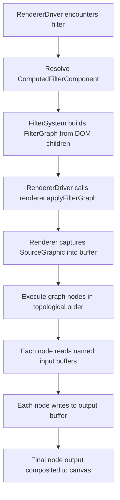

# Design: SVG Filter Effects

**Status:** In Progress (Milestones 1-4 complete, Milestone 5 next)
**Author:** Claude Opus 4.6
**Created:** 2026-03-07
**Last Updated:** 2026-03-08
**Tracking:** [#151](https://github.com/jwmcglynn/donner/issues/151)

## Summary

Implement full SVG filter support aligned with the [Filter Effects Module Level 1](https://drafts.fxtf.org/filter-effects/) spec (referenced by [SVG2 §11](https://www.w3.org/TR/SVG2/render.html#FilteringPaintedRegions)). Donner currently supports 15 of 17 filter primitives with a working filter graph execution model, `in`/`result` routing, and `SourceGraphic`/`SourceAlpha` standard inputs on the TinySkia backend. All filter pixel operations are implemented natively in the `tiny-skia-cpp` library (`third_party/tiny-skia-cpp/src/tiny_skia/filter/`), keeping the renderer thin (graph routing only). This design covers the remaining 6 primitives, CSS shorthand filter functions, color space handling, and the Skia backend.

Filters are a high-impact gap for v1.0. Most real-world SVG artwork uses at least drop shadows or blur; icon sets and data visualizations use color matrix transforms and compositing. Without filter support these render as unfiltered content, which is visually wrong.

## Goals

- Implement all 17 filter primitives from the Filter Effects Level 1 spec.
- Support filter chains with `in`/`result` routing between primitives.
- Support CSS shorthand filter functions (`blur()`, `drop-shadow()`, `brightness()`, etc.).
- Work on both Skia and TinySkia backends.
- Pass the resvg test suite filter tests and targeted W3C filter test cases.
- Remove the experimental gate on `<filter>`.

## Non-Goals

- Filter Effects Module Level 2 features (e.g., `BackgroundImage`/`BackgroundAlpha` inputs via CSS compositing isolation — these are complex and rarely used).
- CSS `backdrop-filter`.
- GPU-accelerated filter pipelines (future optimization).
- Animation of filter parameters (separate animation milestone).

## Current State

**Implemented (TinySkia backend):**
- Filter graph execution model with named buffer routing (`in`/`result`)
- Standard inputs: `SourceGraphic`, `SourceAlpha`
- Filter region computation with `objectBoundingBox` and `userSpaceOnUse` `filterUnits`
- Filter region clipping on output
- Primitive subregion computation (explicit attributes; TODO: union-of-inputs default)
- `color-interpolation-filters` property (linearRGB/sRGB conversion via LUT)
- All 17 primitives: `feGaussianBlur`, `feFlood`, `feOffset`, `feComposite`, `feMerge`, `feColorMatrix`, `feBlend`, `feComponentTransfer`, `feDropShadow`, `feMorphology`, `feTile`, `feConvolveMatrix`, `feTurbulence`, `feDisplacementMap`, `feDiffuseLighting`, `feSpecularLighting`, `feImage`
- Light sources: `feDistantLight`, `fePointLight`, `feSpotLight` with coordinate scaling for non-1:1 viewBox/canvas ratios
- Native tiny-skia-cpp filter library with all implemented operations

**Known gaps:**
- `primitiveUnits` coordinate space handling
- linearRGB LUT operates at 8-bit precision (should be float for accuracy)
- Blur edge clipping: blur operates on full pixmap then clips, causing edge differences
- Skia backend not yet updated for filter graph model
- `feImage` fragment references (`href="#elementId"`) — deferred to future work, depends on nested SVG rendering (e.g. `<use>` element support)
- Light coordinate scaling: z and surfaceScale interaction at non-1:1 pixel density causes minor diffs for some spot light configurations (~3K pixels for cone-boundary cases)

## Next Steps

- Begin Milestone 5: CSS shorthand filter functions (`blur()`, `brightness()`, etc.).
- Add `primitiveUnits` coordinate space handling.
- Upgrade linearRGB conversion to float precision (fix 8-bit LUT rounding diffs).
- Fix blur edge clipping to match spec behavior.
- Improve `feImage` external image rendering (subregion/OBB tests).

## Implementation Plan

### Milestone 1: Filter graph plumbing

Replace the current `std::vector<FilterEffect>` linear chain with a proper filter graph that supports named inputs/outputs and standard input keywords.

- [x] Define `FilterGraph` data structure with nodes, edges, and named buffers (`FilterGraph.h`)
- [x] Add `in` attribute parsing to `SVGFilterPrimitiveStandardAttributes` (keyword or result name)
- [x] Implement `result` attribute routing (implicit chaining when omitted)
- [x] Replace `pushFilterLayer`/`popFilterLayer` interface with graph-aware execution (`FilterGraph` passed through interface)
- [x] Move Gaussian blur to native tiny-skia-cpp filter library (`tiny_skia::filter::gaussianBlur`)
- [x] Add `in2` attribute parsing for two-input primitives
- [x] Implement standard input resolution (`SourceGraphic`, `SourceAlpha`) with multi-buffer routing (TODO: `FillPaint`, `StrokePaint`)
- [x] Implement filter region clipping (x/y/width/height on `<filter>`, with objectBoundingBox defaults)
- [x] Implement primitive subregion computation (explicit x/y/width/height on each primitive; TODO: union-of-inputs default)
- [ ] Add `primitiveUnits` coordinate space handling (`userSpaceOnUse` vs `objectBoundingBox`)
- [x] Add `color-interpolation-filters` property support (`linearRGB` default vs `sRGB`)
- [ ] Remove legacy `effectChain` from `ComputedFilterComponent`

### Milestone 2: High-frequency primitives (Tranche 1)

The most commonly used filter primitives in real-world SVG content.

- [x] `feFlood` — solid color fill (trivial; foundation for drop shadows)
- [x] `feOffset` — translate an image buffer by dx/dy
- [x] `feMerge` / `feMergeNode` — layer multiple buffers with Source Over compositing
- [x] `feColorMatrix` — 5x4 matrix, saturate, hueRotate, luminanceToAlpha modes
- [x] `feComposite` — Porter-Duff operators (over/in/out/atop/xor/lighter) + arithmetic mode
- [x] `feBlend` — CSS blend modes (normal, multiply, screen, darken, lighten)
- [x] `feDropShadow` — convenience primitive (blur + offset + flood + composite + merge)
- [x] `feComponentTransfer` / `feFuncR/G/B/A` — per-channel transfer functions (identity, table, discrete, linear, gamma)

### Milestone 3: Spatial and generative primitives (Tranche 2)

Less common but required for full spec compliance.

- [x] `feConvolveMatrix` — arbitrary convolution kernel with edgeMode handling
- [x] `feMorphology` — erode/dilate operations
- [x] `feTile` — tile input to fill primitive subregion
- [x] `feTurbulence` — Perlin/fractal noise generation
- [x] `feImage` — external image rendering complete; fragment references (`href="#elementId"`) deferred to future work (depends on nested SVG/`<use>` support)
- [x] `feDisplacementMap` — spatial displacement using a channel map
- [x] `feGaussianBlur` — `edgeMode` attribute (none/duplicate/wrap)

### Milestone 4: Lighting primitives

- [x] `feDiffuseLighting` — diffuse reflection using bump map from alpha channel
- [x] `feSpecularLighting` — specular highlights using bump map
- [x] `feDistantLight` — directional light source (child of lighting primitives)
- [x] `fePointLight` — point light source
- [x] `feSpotLight` — spotlight source with coordinate scaling (x/y/z scaled to pixel space)
- [x] `lighting-color` CSS property parsing and resolution

### Milestone 5: CSS shorthand filter functions

- [ ] Parse CSS `filter` property function syntax: `blur()`, `brightness()`, `contrast()`, `drop-shadow()`, `grayscale()`, `hue-rotate()`, `invert()`, `opacity()`, `saturate()`, `sepia()`
- [ ] Map each function to equivalent filter graph nodes
- [ ] Support chained function lists (e.g., `filter: blur(5px) brightness(1.2)`)

### Milestone 6: Polish and conformance

- [ ] Remove experimental flag from `<filter>` and all `<fe*>` elements
- [ ] Enable all resvg filter test cases
- [ ] Add targeted W3C SVG test suite filter cases
- [ ] Performance optimization pass (avoid unnecessary buffer copies, in-place operations)
- [ ] Fuzz filter attribute parsing

## Proposed Architecture

### Filter Graph Model

The current implementation passes a flat `std::vector<FilterEffect>` to the renderer. This is insufficient for multi-input primitives (`feBlend`, `feComposite`) and named routing (`in`/`result`). The new model introduces a `FilterGraph`:

```
FilterGraph
  nodes: vector<FilterNode>       // One per primitive, in document order
  lastNodeIndex: size_t            // Output node (last primitive in DOM)

FilterNode
  primitive: FilterPrimitive       // Variant of all primitive types
  inputs: vector<FilterInput>      // Named or implicit inputs
  subregion: optional<Rect>        // Computed primitive subregion
  result: optional<string>         // Named output buffer
  colorSpace: ColorSpace           // linearRGB or sRGB

FilterInput = variant<
  StandardInput,                   // SourceGraphic, SourceAlpha, FillPaint, StrokePaint
  PreviousResult,                  // Implicit: output of preceding node
  NamedResult(string)              // Explicit: references another node's `result`
>
```

### Data Flow



### Renderer Interface Changes

The push/pop filter layer interface now accepts a `FilterGraph` instead of a flat effect chain:

```cpp
// Current (implemented):
virtual void pushFilterLayer(const components::FilterGraph& filterGraph) = 0;
virtual void popFilterLayer() = 0;
```

`pushFilterLayer` captures the current transform/clip state and creates an offscreen buffer.
Content is rendered into the buffer between push and pop. On `popFilterLayer`, the graph is
executed against the captured content (SourceGraphic) and the result is composited back.

Future evolution: once multi-buffer routing is complete, the executor will allocate intermediate
buffers for each named result, resolve standard inputs, and execute nodes in document order.
The push/pop structure remains since SourceGraphic capture requires rendering content into an
isolated surface first.

### ECS Components

New components for each primitive type, following the existing `FEGaussianBlurComponent` pattern:

| Component | Key Fields |
|---|---|
| `FEColorMatrixComponent` | `type`, `values` (matrix/saturate/hueRotate/luminanceToAlpha) |
| `FECompositeComponent` | `operator`, `k1`-`k4` |
| `FEBlendComponent` | `mode` |
| `FEFloodComponent` | `floodColor`, `floodOpacity` |
| `FEOffsetComponent` | `dx`, `dy` |
| `FEMergeComponent` | (children are `FEMergeNodeComponent` with `in`) |
| `FEDropShadowComponent` | `dx`, `dy`, `stdDeviation`, `floodColor`, `floodOpacity` |
| `FEComponentTransferComponent` | (children are `FEFuncComponent` with `type`, `tableValues`, etc.) |
| `FEConvolveMatrixComponent` | `order`, `kernelMatrix`, `divisor`, `bias`, `targetX/Y`, `edgeMode`, `preserveAlpha` |
| `FEMorphologyComponent` | `operator`, `radiusX`, `radiusY` |
| `FETileComponent` | (no additional attributes) |
| `FETurbulenceComponent` | `type`, `baseFrequencyX/Y`, `numOctaves`, `seed`, `stitchTiles` |
| `FEImageComponent` | `href`, `preserveAspectRatio` |
| `FEDisplacementMapComponent` | `scale`, `xChannelSelector`, `yChannelSelector` |
| `FEDiffuseLightingComponent` | `surfaceScale`, `diffuseConstant`, `lightingColor` |
| `FESpecularLightingComponent` | `surfaceScale`, `specularConstant`, `specularExponent`, `lightingColor` |
| `FEDistantLightComponent` | `azimuth`, `elevation` |
| `FEPointLightComponent` | `x`, `y`, `z` |
| `FESpotLightComponent` | `x`, `y`, `z`, `pointsAtX/Y/Z`, `specularExponent`, `limitingConeAngle` |

### Where Each Layer Lives

| Layer | Location | Responsibility |
|---|---|---|
| SVG element classes | `donner/svg/SVGFe*.h` | DOM API, attribute accessors |
| Attribute parsing | `donner/svg/parser/AttributeParser.cc` | XML attribute -> component |
| ECS components | `donner/svg/components/filter/` | Data storage |
| Filter system | `donner/svg/components/filter/FilterSystem.cc` | DOM -> FilterGraph construction |
| Renderer driver | `donner/svg/renderer/RendererDriver.cc` | Orchestrates capture + graph execution |
| Skia backend | `donner/svg/renderer/RendererSkia.cc` | Skia-specific buffer ops |
| TinySkia backend | `donner/svg/renderer/RendererTinySkia.cc` | Pixmap-based buffer ops |

### Color Space Handling

Filter primitives default to operating in `linearRGB` color space (per `color-interpolation-filters` property). The renderer must:

1. Convert `SourceGraphic` from sRGB to linearRGB on capture (unless `color-interpolation-filters: sRGB`).
2. Execute all primitives in the specified color space.
3. Convert back to sRGB before compositing the result.

CSS shorthand filter functions always operate in sRGB regardless of this property.

### TinySkia Native Filter Library

All filter pixel operations are implemented natively inside `third_party/tiny-skia-cpp` as a
reusable library that operates on `tiny_skia::Pixmap` buffers. This architecture provides:

1. **Separation of concerns:** The SVG renderer handles graph execution (buffer allocation, input
   resolution, subregion clipping, coordinate transforms) while the library handles pure pixel
   math. The renderer never manipulates pixel data directly — it delegates every operation to a
   library function.

2. **Independent testability:** Each filter function can be unit-tested with synthetic pixmaps
   without requiring SVG parsing or a render pipeline. Tests live in
   `third_party/tiny-skia-cpp/src/tiny_skia/tests/`.

3. **Reusability:** The library is not SVG-specific. Any application using `tiny_skia::Pixmap`
   can use the filter functions for image processing.

**Location:** `third_party/tiny-skia-cpp/src/tiny_skia/filter/`

Each filter primitive maps to the library in one of three ways:

- **Direct 1:1 mapping:** Most primitives have a single library function that performs the entire
  operation (e.g., `filter::gaussianBlur`, `filter::colorMatrix`, `filter::morphology`). The
  renderer calls the function with the resolved inputs and transform-adjusted parameters.

- **Decomposition into existing functions:** Some primitives are syntactic sugar over a pipeline
  of simpler operations. `feDropShadow` decomposes into `flood()` → `composite(in)` → `offset()`
  → `gaussianBlur()` → `merge()` entirely within the renderer's graph executor. No dedicated
  library function is needed.

- **Renderer-only operations:** `feImage` requires access to the SVG document and image loading
  infrastructure, so it is handled entirely in the renderer layer. The library provides no
  function for it.

#### API Summary

| Operation | tiny-skia-cpp API | Status |
|---|---|---|
| Blur | `filter::gaussianBlur(pixmap, sigmaX, sigmaY)` | Done |
| Flood | `filter::flood(dst, r, g, b, a)` | Done |
| Offset | `filter::offset(src, dst, dx, dy)` | Done |
| ColorMatrix | `filter::colorMatrix(pixmap, matrix)` | Done |
| ColorMatrix helpers | `filter::saturateMatrix(s)`, `hueRotateMatrix(deg)`, `luminanceToAlphaMatrix()`, `identityMatrix()` | Done |
| ComponentTransfer | `filter::componentTransfer(pixmap, funcR, funcG, funcB, funcA)` | Done |
| Blend | `filter::blend(bg, fg, dst, mode)` | Done |
| Composite | `filter::composite(in1, in2, dst, op, k1-k4)` | Done |
| Merge | `filter::merge(layers, dst)` | Done |
| ColorSpace | `filter::srgbToLinear(pixmap)` / `filter::linearToSrgb(pixmap)` | Done |
| ConvolveMatrix | `filter::convolveMatrix(src, dst, params)` | Done |
| Morphology | `filter::morphology(src, dst, op, rx, ry)` | Done |
| Tile | `filter::tile(src, dst, tileX, tileY, tileW, tileH)` | Done |
| Turbulence | `filter::turbulence(dst, params)` | Done |
| DisplacementMap | `filter::displacementMap(src, map, dst, scale, xCh, yCh)` | Done |
| DiffuseLighting | `filter::diffuseLighting(src, dst, params)` | Done |
| SpecularLighting | `filter::specularLighting(src, dst, params)` | Done |
| DropShadow | *(decomposed in renderer: flood+composite+offset+blur+merge)* | Done |

**All library functions are implemented.** The lighting primitives (`diffuseLighting`,
`specularLighting`) share a common infrastructure for computing surface normals from the alpha
channel (Sobel-like kernels per SVG spec) and evaluating light sources. The light source
(distant/point/spot) is passed as a `LightSourceParams` struct. Both functions share the same
normal computation code; they differ only in the reflection model (Lambertian diffuse vs. Phong
specular).

**Light coordinate scaling:** When the canvas resolution differs from the SVG user space (e.g.,
viewBox="0 0 200 200" rendered at 500x500), point/spot light coordinates (x, y, z, pointsAtX/Y/Z)
are transformed from user space to pixel space using `currentTransform_`. The z coordinates are
scaled by the uniform pixel scale factor (RMS of transform scale factors) to preserve correct 3D
light direction vectors. `surfaceScale` is NOT scaled — it controls bump map height which works
correctly at any pixel density since the Sobel kernel already adapts to the pixel grid.

#### Graph Executor (`RendererTinySkia`)

The `RendererTinySkia` implements graph execution in the renderer layer (not in the tiny-skia-cpp
library, since graph routing is SVG-specific):

```
applyFilterGraph(sourceGraphic, filterGraph):
  buffers = {}
  previousOutput = sourceGraphic

  for each node in filterGraph.nodes:
    // 1. Resolve inputs
    inputs = []
    for each input in node.inputs:
      match input:
        Previous       -> inputs.push(previousOutput)
        SourceGraphic  -> inputs.push(sourceGraphic)
        SourceAlpha    -> inputs.push(extractAlpha(sourceGraphic))
        FillPaint      -> inputs.push(currentFillPaintBuffer())
        StrokePaint    -> inputs.push(currentStrokePaintBuffer())
        Named(name)    -> inputs.push(buffers[name])

    // 2. Allocate output buffer (same dimensions as filter region)
    output = allocatePixmap(filterRegion)

    // 3. Execute primitive via tiny-skia-cpp filter library
    executePrimitive(node.primitive, inputs, output)

    // 4. Store named result
    if node.result:
      buffers[node.result] = output
    previousOutput = output

  // 5. Composite final output onto canvas
  compositePixmap(previousOutput, 1.0)
```

**Buffer management:** Each intermediate result is a `tiny_skia::Pixmap`. Buffers are allocated on
demand and reused when a named result is no longer referenced by subsequent nodes. The executor
tracks reference counts for named results and frees buffers when their last consumer has executed.

#### Implementation Details Per Primitive

##### feGaussianBlur (done)

**Algorithm:** Separable 1D convolution. For sigma < 2.0, uses a discrete Gaussian kernel
(compute weights from `exp(-x^2 / 2*sigma^2)`, normalize). For sigma >= 2.0, uses a 3-pass box
blur approximation matching Skia's behavior: compute box window size from
`floor(sigma * 3*sqrt(2*pi)/4 + 0.5)`, convolve three box kernels together to get a piecewise
quadratic approximation.

**Complexity:** O(w*h*k) where k is kernel radius; box blur approximation is O(w*h) regardless of
sigma since box blur can use a running sum (future optimization).

**Edge handling:** Currently clamps to border (pixels outside the image are skipped in the kernel
sum, and the kernel is renormalized). TODO: add `edgeMode` support (none = transparent black,
duplicate = clamp, wrap = tile).

##### feFlood

**Algorithm:** Fill the output buffer with a solid premultiplied RGBA color. Trivially simple —
iterate all pixels and set to the flood color * flood opacity.

```cpp
void flood(Pixmap& dst, RGBA8 color);
```

##### feOffset

**Algorithm:** Copy source pixels shifted by (dx, dy) in integer pixel coordinates. Pixels that
shift outside the buffer are discarded; uncovered pixels become transparent black. When dx/dy are
non-integer, use bilinear interpolation between the four nearest source pixels.

```cpp
void offset(const Pixmap& src, Pixmap& dst, double dx, double dy);
```

##### feColorMatrix

**Algorithm:** Apply a 5x4 color matrix to each pixel. The matrix transforms
`[R, G, B, A, 1] -> [R', G', B', A']`. Operates on unpremultiplied values: unpremultiply input,
apply matrix, clamp to [0, 255], re-premultiply.

The four modes map to specific matrices:
- **matrix:** Direct 20-value matrix from attribute.
- **saturate(s):** A 3x3 luminance-preserving saturation matrix (ITU-R BT.601 weights: 0.2126,
  0.7152, 0.0722) with identity alpha row.
- **hueRotate(angle):** Rotation in the RGB color space around the luminance axis, constructed from
  cos/sin of the angle combined with luminance weights.
- **luminanceToAlpha:** Sets `A' = 0.2126*R + 0.7152*G + 0.0722*B`, sets `R'=G'=B'=0`.

```cpp
void colorMatrix(Pixmap& pixmap, std::span<const double, 20> matrix);
```

##### feComponentTransfer

**Algorithm:** Apply independent transfer functions to each RGBA channel. Unpremultiply input,
apply the per-channel function, clamp to [0, 1], re-premultiply.

Transfer function types (per channel):
- **identity:** `C' = C`
- **table:** Piecewise linear interpolation into `tableValues` (n values define n-1 equal
  segments; `C' = v_k + (C*n - k) * (v_{k+1} - v_k)` where `k = floor(C * (n-1))`).
- **discrete:** Step function into `tableValues` (`C' = v_k` where `k = floor(C * n)`).
- **linear:** `C' = slope * C + intercept`
- **gamma:** `C' = amplitude * pow(C, exponent) + offset`

**Optimization:** Pre-compute a 256-entry LUT for each channel, then apply as a table lookup per
pixel. This makes all function types O(1) per pixel regardless of table size.

```cpp
struct TransferFunc { FuncType type; std::span<const double> tableValues; double slope, intercept, amplitude, exponent, offset; };
void componentTransfer(Pixmap& pixmap, const TransferFunc& r, const TransferFunc& g, const TransferFunc& b, const TransferFunc& a);
```

##### feBlend

**Algorithm:** Per-pixel blend of two inputs using CSS blend modes. The `in` input is the
foreground (Cs), `in2` is the background (Cb). Both must be unpremultiplied for the blend
formula, then the result is premultiplied for storage.

General formula: `Cr = (1-Ab)*Cs + (1-As)*Cb + As*Ab*B(Cb, Cs)` where B is the blend function.

Blend functions:
- **normal:** `B(Cb,Cs) = Cs`
- **multiply:** `B(Cb,Cs) = Cb*Cs`
- **screen:** `B(Cb,Cs) = Cb + Cs - Cb*Cs`
- **overlay:** `B(Cb,Cs) = HardLight(Cs, Cb)` (swap order)
- **darken:** `B(Cb,Cs) = min(Cb, Cs)`
- **lighten:** `B(Cb,Cs) = max(Cb, Cs)`
- **color-dodge:** `B(Cb,Cs) = Cb==0 ? 0 : Cs==1 ? 1 : min(1, Cb/(1-Cs))`
- **color-burn:** `B(Cb,Cs) = Cb==1 ? 1 : Cs==0 ? 0 : 1-min(1, (1-Cb)/Cs)`
- **hard-light:** `B(Cb,Cs) = Cs<=0.5 ? 2*Cb*Cs : screen(Cb, 2*Cs-1)`
- **soft-light:** Pegtop formula
- **difference:** `B(Cb,Cs) = |Cb - Cs|`
- **exclusion:** `B(Cb,Cs) = Cb + Cs - 2*Cb*Cs`
- **hue/saturation/color/luminosity:** HSL-based non-separable blend modes

```cpp
void blend(const Pixmap& bg, const Pixmap& fg, Pixmap& dst, BlendMode mode);
```

##### feComposite

**Algorithm:** Porter-Duff compositing of two inputs. The `in` input is source, `in2` is
destination. Operates on premultiplied values (Porter-Duff formulas assume premultiplied alpha).

Operators (Fa, Fb are source/dest factors):
- **over:** `Fa=1, Fb=1-As` -> `Co = Cs + Cd*(1-As)`
- **in:** `Fa=Ad, Fb=0` -> `Co = Cs*Ad`
- **out:** `Fa=1-Ad, Fb=0` -> `Co = Cs*(1-Ad)`
- **atop:** `Fa=Ad, Fb=1-As` -> `Co = Cs*Ad + Cd*(1-As)`
- **xor:** `Fa=1-Ad, Fb=1-As` -> `Co = Cs*(1-Ad) + Cd*(1-As)`
- **lighter:** `Co = Cs + Cd` (clamped to [0,1])
- **arithmetic:** `Co = k1*Cs*Cd + k2*Cs + k3*Cd + k4` (clamped to [0,1])

```cpp
void composite(const Pixmap& in1, const Pixmap& in2, Pixmap& dst, CompositeOp op, double k1, double k2, double k3, double k4);
```

##### feMerge

**Algorithm:** Composite N input layers using Source Over, bottom to top. Equivalent to
successive `feComposite operator="over"` operations. Each `feMergeNode` child specifies an `in`
attribute referencing a named result or standard input.

Implementation: initialize output to transparent black, then for each layer composite with
Source Over (`dst = src + dst*(1-srcA)`).

```cpp
void merge(std::span<const Pixmap*> layers, Pixmap& dst);
```

##### feDropShadow

**Algorithm:** Convenience primitive equivalent to the following pipeline:
1. Flood the shadow color at the given opacity
2. Composite (in) the source alpha with the flood to colorize the shadow
3. Offset by (dx, dy)
4. Gaussian blur with stdDeviation
5. Merge the blurred shadow under the original SourceGraphic

Implemented by decomposing into calls to `flood()`, `composite()`, `offset()`,
`gaussianBlur()`, and `merge()` in the graph executor rather than as a single library function.

##### feConvolveMatrix

**Algorithm:** 2D convolution with a user-specified kernel of size `orderX * orderY`. For each
output pixel `(x,y)`:
```
result[c] = bias + (1/divisor) * sum_{i,j}( kernel[i,j] * src[x-targetX+i, y-targetY+j][c] )
```
If `divisor` is 0, defaults to the sum of all kernel values (or 1.0 if sum is 0).

Edge modes for out-of-bounds pixel access:
- **duplicate:** Clamp to nearest edge pixel.
- **wrap:** Wrap around (modular arithmetic).
- **none:** Treat as transparent black (0,0,0,0).

If `preserveAlpha` is true, only convolve RGB channels; alpha passes through unchanged.

**Note:** Unlike the existing blur kernel infrastructure, this is a full 2D convolution (not
separable). For large kernels this is O(w*h*orderX*orderY).

```cpp
struct ConvolveParams { int orderX, orderY; std::span<const double> kernel; double divisor, bias; int targetX, targetY; EdgeMode edgeMode; bool preserveAlpha; };
void convolveMatrix(const Pixmap& src, Pixmap& dst, const ConvolveParams& params);
```

##### feMorphology (done)

**Algorithm:** For each pixel, examine a rectangular window of radius (rx, ry):
- **erode:** Output is the per-channel minimum of all pixels in the window.
- **dilate:** Output is the per-channel maximum.

The window is `(2*rx+1) x (2*ry+1)` pixels. Operates on premultiplied values.

**Edge cases:**
- Negative radius (either axis): transparent black output (per SVG spec).
- Both radii zero: transparent black output.
- One radius zero, other positive: apply 1D filter in the non-zero direction (zero radius means
  a 1-pixel window, so no change in that direction).
- Radius capped to image dimensions to prevent O(w*h*r²) perf blowup on extreme values.

**Future optimization:** Separable min/max filter using a sliding window with a deque for O(w*h)
total work regardless of radius (van Herk/Gil-Werman algorithm). The current implementation is
O(w*h*rx*ry).

```cpp
void morphology(const Pixmap& src, Pixmap& dst, MorphologyOp op, int radiusX, int radiusY);
```

##### feTile

**Algorithm:** Tile the input image to fill the entire filter primitive subregion. The input
subregion defines the tile; the output repeats it using modular arithmetic:
```
dst[x, y] = src[(x - tileX) % tileW + tileX, (y - tileY) % tileH + tileY]
```

```cpp
void tile(const Pixmap& src, Pixmap& dst, int tileX, int tileY, int tileW, int tileH);
```

##### feTurbulence

**Algorithm:** Perlin noise / fractal Brownian motion generator. Produces a procedural texture
without any input image.

Implementation follows the SVG spec's reference Perlin noise algorithm:
1. Initialize permutation table from seed using `setup()` / `random()` as defined in the spec.
2. For each pixel, compute noise at the coordinate `(x*baseFrequencyX, y*baseFrequencyY)`.
3. For `fractalNoise`: sum `numOctaves` octaves with halving amplitude and doubling frequency.
   Output is `(noise + 1) / 2` scaled to [0, 255].
4. For `turbulence`: sum `numOctaves` octaves of `|noise|` with halving amplitude and doubling
   frequency. Output is the absolute value sum scaled to [0, 255].
5. If `stitchTiles` is true, adjust the noise function to tile seamlessly at the filter region
   boundaries.

Each RGBA channel uses independent noise with offset seeds.

```cpp
struct TurbulenceParams { TurbulenceType type; double baseFreqX, baseFreqY; int numOctaves; double seed; bool stitch; int width, height; };
void turbulence(Pixmap& dst, const TurbulenceParams& params);
```

##### feImage

**Algorithm:** Render an external image or SVG fragment reference into the filter output buffer.
Two cases:
1. **External image URL (implemented):** Load via existing `ImageResource` pipeline, draw into the
   output buffer with `preserveAspectRatio` scaling.
2. **Fragment reference (`#elementId`) (future work):** Requires re-entrant rendering of the
   referenced element subtree into a temporary pixmap. This depends on nested SVG rendering
   infrastructure (similar to `<use>` element support) and is deferred to future work.

This primitive is handled in the renderer layer (not the tiny-skia-cpp filter library) because it
requires access to the SVG document and image loading infrastructure.

##### feDisplacementMap

**Algorithm:** Spatially displaces pixels from `in` using channel values from `in2` as a
displacement map:
```
dst[x, y] = src[x + scale * (map[x,y].xChannel/255 - 0.5),
                 y + scale * (map[x,y].yChannel/255 - 0.5)]
```
where `xChannel`/`yChannel` select R/G/B/A from the displacement map pixel.

Source sampling uses bilinear interpolation. Out-of-bounds samples produce transparent black.

Per spec, if `in2` comes from a different origin (cross-origin), the entire output must be
transparent black (security restriction).

```cpp
void displacementMap(const Pixmap& src, const Pixmap& map, Pixmap& dst, double scale, Channel xCh, Channel yCh);
```

##### feDiffuseLighting

**Algorithm:** Computes diffuse reflection using the alpha channel of the input as a bump map
(surface height field).

1. **Compute surface normals:** For each pixel, compute the normal from the alpha gradient using
   central differences: `nx = -surfaceScale * dA/dx`, `ny = -surfaceScale * dA/dy`, `nz = 1`.
   Normalize the vector.
2. **Compute light vector (L):** Depends on light source type:
   - `feDistantLight`: `L = (cos(azimuth)*cos(elevation), sin(azimuth)*cos(elevation), sin(elevation))` — constant for all pixels.
   - `fePointLight`: `L = normalize(lightPos - surfacePoint)` — varies per pixel.
   - `feSpotLight`: Like point light but modulated by `pow(max(0, -L.S), spotExponent)` where S is
     the spot direction, and zeroed outside the limiting cone angle.
3. **Diffuse term:** `kd * lightColor * max(0, N.L)` where kd = diffuseConstant.
4. Output RGBA: `(R*kd*N.L, G*kd*N.L, B*kd*N.L, 1.0)`.

At image borders, use modified normal computation kernels (spec-defined edge pixel formulas using
fewer neighbors).

```cpp
struct LightSource { /* variant of Distant, Point, Spot with their parameters */ };
void diffuseLighting(const Pixmap& src, Pixmap& dst, const LightSource& light, double surfaceScale, double diffuseConstant, RGBA8 lightColor);
```

##### feSpecularLighting

**Algorithm:** Same surface normal and light vector computation as diffuse lighting, but uses the
Phong specular reflection model:

1. Compute normal N and light vector L as in diffuse lighting.
2. Compute halfway vector: `H = normalize(L + (0, 0, 1))` (eye at infinity along +Z).
3. **Specular term:** `ks * lightColor * pow(max(0, N.H), specularExponent)` where
   ks = specularConstant.
4. Output alpha is `max(R', G', B')` to allow the specular highlight to be composited
   (spec requirement).

The specular exponent must be clamped to [1, 128].

```cpp
void specularLighting(const Pixmap& src, Pixmap& dst, const LightSource& light, double surfaceScale, double specularConstant, double specularExponent, RGBA8 lightColor);
```

#### Color Space Handling

Filter primitives default to operating in `linearRGB` color space per the
`color-interpolation-filters` property. The filter library provides conversion utilities:

```cpp
// Convert each pixel from sRGB to linear RGB (inverse gamma).
// Formula: C_linear = C_srgb <= 0.04045 ? C_srgb/12.92 : pow((C_srgb+0.055)/1.055, 2.4)
void srgbToLinear(Pixmap& pixmap);

// Convert each pixel from linear RGB to sRGB (apply gamma).
// Formula: C_srgb = C_linear <= 0.0031308 ? 12.92*C_linear : 1.055*pow(C_linear, 1/2.4)-0.055
void linearToSrgb(Pixmap& pixmap);
```

The graph executor wraps each node's execution:
1. Convert inputs to the node's target color space if they differ.
2. Execute the primitive.
3. Tag the output buffer with its color space.
4. Convert the final output back to sRGB before compositing onto the canvas.

**Optimization:** Use a 256-entry LUT for sRGB-to-linear and a 4096-entry LUT for linear-to-sRGB
to avoid per-pixel `pow()` calls.

#### Coordinate Space Handling

`primitiveUnits` affects how primitive subregion coordinates and attribute values are interpreted:

- **`userSpaceOnUse` (default):** Values are in the user coordinate system (CSS pixels).
- **`objectBoundingBox`:** Values are fractions of the filtered element's bounding box. The
  executor scales coordinates by bbox dimensions before passing to filter operations.

The graph executor computes absolute pixel coordinates for each node's subregion before invoking
the filter library function, so the library itself always works in pixel coordinates.

#### Testing Strategy for Filter Library

Each filter operation in `tiny_skia::filter` gets its own unit test file in
`third_party/tiny-skia-cpp/src/tiny_skia/tests/`:

- Construct a known input pixmap (solid color, gradient, checkerboard, etc.).
- Apply the filter operation.
- Verify specific output pixels against hand-calculated expected values.
- Test edge cases: zero-size input, identity parameters, max radius, boundary pixels.

This ensures correctness at the library level independent of SVG parsing or graph execution.

### Skia Backend Strategy

The Skia backend can leverage `SkImageFilter` subclasses for several primitives:

| Primitive | Skia API |
|---|---|
| `feGaussianBlur` | `SkImageFilters::Blur` (already used) |
| `feColorMatrix` | `SkImageFilters::ColorFilter` + `SkColorFilters::Matrix` |
| `feOffset` | `SkImageFilters::Offset` |
| `feBlend` | `SkImageFilters::Blend` |
| `feComposite` | `SkImageFilters::Blend` (Porter-Duff) / `SkImageFilters::Arithmetic` |
| `feMerge` | `SkImageFilters::Merge` |
| `feFlood` | `SkImageFilters::ColorFilter` with solid color |
| `feMorphology` | `SkImageFilters::Dilate` / `SkImageFilters::Erode` |
| `feDisplacementMap` | `SkImageFilters::DisplacementMap` |
| `feTile` | `SkImageFilters::Tile` |
| `feImage` | `SkImageFilters::Image` |
| Lighting | `SkImageFilters::DistantLitDiffuse`, etc. |

For primitives without direct Skia API equivalents (`feComponentTransfer`, `feTurbulence`, `feConvolveMatrix`), render to an `SkBitmap`, apply the pixel operation, and wrap as an `SkImage`.

## Security / Privacy

SVG filter attributes are untrusted input from potentially hostile SVG files.

- **Resource exhaustion:** Unbounded filter regions, extreme blur radii, large convolution kernels, or deep filter chains can exhaust memory. Enforce maximum filter region size (e.g., 4096x4096 pixels), maximum kernel dimensions, and maximum chain depth.
- **`feImage` fetching:** The `href` attribute can reference external resources. Follow existing resource loading security policy (same-origin restrictions). `feDisplacementMap` with cross-origin `in2` must produce transparent black per spec.
- **Numeric overflow:** Filter matrix values and arithmetic coefficients are attacker-controlled floats. Clamp intermediate pixel values to [0, 1] or [0, 255] at each pipeline stage.
- **Parsing:** All new attribute parsers must be fuzz-tested. Add filter attribute parsing to the existing fuzzing harness.

## Testing and Validation

- **Unit tests:** Each filter primitive gets dedicated tests for attribute parsing, default values, and edge cases (zero radius, identity matrix, empty kernel, etc.).
- **Golden image tests:** Use the resvg test suite filter test cases (currently skipped). The suite includes tests for each primitive type. Compare against resvg golden images with appropriate per-pixel thresholds.
- **Enable resvg tests as primitives are implemented:** When adding a new filter primitive, immediately add the corresponding `INSTANTIATE_TEST_SUITE_P` entry in `resvg_test_suite.cc`. Run the tests, mark failing cases with `Params::Skip()` and a reason comment (e.g., "Not impl: filter region"), and leave passing tests enabled. This ensures we track progress and catch regressions from the start.
- **Cross-backend parity:** Run all filter tests with both `--config=skia` and `--config=tiny-skia` (default). Use the existing shared-golden architecture.
- **Fuzzing:** Add filter attribute strings to the SVG parser fuzzing corpus. Fuzz filter graph construction with random topologies.
- **Conformance:** Targeted tests from the W3C SVG test suite filter section.

## Alternatives Considered

**Flat effect chain (current design) vs. filter graph:**
The current `std::vector<FilterEffect>` is simple but cannot represent multi-input primitives or named routing. A proper graph is required by the spec. The graph is still executed linearly (topological order) so implementation complexity is modest.

**Skia `SkImageFilter` DAG vs. manual buffer management:**
Skia's `SkImageFilter` already supports DAG composition via `makeWithChildren`. We could build the entire filter graph as a composed `SkImageFilter` tree and let Skia execute it in one `saveLayer`. This is simpler for the Skia backend but doesn't help TinySkia. The design uses a shared graph model with backend-specific node execution, keeping the architecture uniform.

**Implement only CSS shorthand functions first:**
CSS filter functions (`blur()`, `brightness()`, etc.) cover common use cases and are simpler to implement (no graph routing). However, real SVG content uses `<filter>` elements with multiple primitives, and the graph plumbing is needed regardless. CSS functions are implemented as syntactic sugar over the same graph in Milestone 5.

## Open Questions

- Should we support `BackgroundImage`/`BackgroundAlpha` standard inputs? These require CSS compositing isolation groups and are rarely used in practice. Proposed: defer to future work.
- What is the maximum filter region size we should enforce? 4096x4096 seems reasonable for an SVG library but may need tuning.
- Should `feImage` support referencing SVG fragments (not just external images)? The spec allows `href="#elementId"` to render a subtree. This requires re-entrant rendering.

## Future Work

- [ ] `feImage` fragment references (`href="#elementId"`) — requires re-entrant rendering of referenced element subtrees into pixmaps; depends on nested SVG rendering infrastructure (e.g. `<use>` element)
- [ ] `BackgroundImage` / `BackgroundAlpha` standard inputs via CSS isolation groups
- [ ] GPU-accelerated filter execution for large filter regions
- [ ] Filter parameter animation support
- [ ] `backdrop-filter` CSS property
- [ ] Filter region auto-expansion heuristics (analyze primitive chain to determine minimum region)
