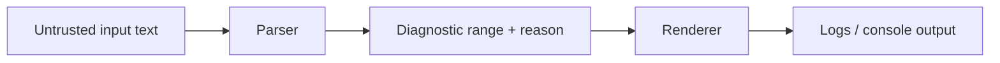

# Design: Parser Diagnostics v2 {#ParserDiagnosticsV2}

**Status:** Implemented
**Author:** Claude Opus 4.6
**Created:** 2026-04-05
**Issue:** https://github.com/jwmcglynn/donner/issues/442

## Summary

Replace the existing `ParseError` / `std::vector<ParseError>*` diagnostics infrastructure with a
unified `ParseDiagnostic` type that carries severity, source ranges (not just a single offset), and
human-readable messages. Introduce `ParseWarningSink` as a first-class abstraction that replaces
the ad-hoc `std::vector<ParseError>* outWarnings` pattern, with implicit zero-cost suppression of
formatting overhead when warnings are disabled. The goal is clang-quality diagnostics: every parser
reports precise source ranges, and a console formatter can render errors with source text and
caret/tilde indicators.

No backward compatibility with the existing `ParseError` API is required.

## Goals

- **Unified diagnostic type** (`ParseDiagnostic`) shared across all parsers: XML, SVG, CSS, path,
  transform, etc.
- **Full source ranges**: every diagnostic carries a `SourceRange` (`[start, end)` half-open
  interval), not just a single `FileOffset`.
- **Severity levels**: distinguish errors (fatal) from warnings (non-fatal).
- **First-class warning collection**: `ParseWarningSink` is always passed to parser entry points.
  When disabled, warning emission is near-zero-cost---formatting overhead is implicitly avoided
  without the caller doing anything special.
- **Console rendering**: a diagnostic renderer that prints source context with caret/tilde
  indicators (similar to clang/rustc output).
- **Comprehensive test coverage**: every parser has tests verifying that reported ranges are
  accurate.

## Non-Goals

- Backward compatibility with the existing `ParseError` struct or `ParseResult<T>` API.
- Structured error codes or an error-code enum system (string reasons remain the primary message;
  codes can be added later if programmatic error handling is needed).
- Fixit suggestions or auto-correction (future work).
- Internationalization of error messages.
- LSP/IDE protocol support or machine-readable JSON diagnostics in this phase.
- Redesigning non-parser error types outside ParseResult/ParseError flows (e.g.
  `ResourceLoaderError`, `UrlLoaderError`).

## Implementation Plan

- [x] **Milestone 1: Introduce base diagnostics model in `donner/base`**
  - [x] Add `SourceRange` with half-open `[start, end)` semantics (renamed from `FileOffsetRange`
    in `FileOffset.h`).
  - [x] Add `ParseDiagnostic` value type with severity, reason, range.
  - [x] Add `ParseWarningSink` with no-op and collecting implementations, lazy-format API.
  - [x] Add `RcString::fromFormat` using C++20 `std::format`.
  - [x] Update `ParseResult<T>` to use `ParseDiagnostic` instead of `ParseError`.
  - [x] Update `ParseResultTestUtils.h` matchers for the new types.
  - [x] Migrate all `ParseError` references across the entire codebase (~95 files).
  - [x] Delete `ParseError.h` / `ParseError.cc`.
  - [x] Unit tests for `ParseDiagnostic` invariants and `ParseWarningSink` behavior.
- [x] **Milestone 2: Range-correctness migration for parsers**
  - [x] Update `ParserBase` to track end offsets and produce `SourceRange` with both start and end.
  - [x] Migrate `NumberParser`, `IntegerParser`, `LengthParser` to emit accurate ranges.
  - [x] Migrate `PathParser` (key test case: partial results with accurate ranges).
  - [x] Migrate `TransformParser`, `ViewBoxParser`, `AngleParser`.
  - [x] Migrate `LengthPercentageParser`, `PreserveAspectRatioParser`, `Number2dParser`,
    `PointsListParser`, `CssTransformParser`, `ListParser`.
  - [ ] Migrate `DataUrlParser` to use `ParseDiagnostic` (remove `DataUrlParserError` enum).
    (Deferred: uses `std::variant<Result, DataUrlParserError>` touching UrlLoader, too much scope.)
  - [x] Add range-accuracy tests for each parser.
- [x] **Milestone 3: Warning plumbing migration**
  - [x] Migrate `SVGParserContext` to hold `ParseWarningSink&` instead of
    `std::vector<ParseDiagnostic>*`.
  - [x] Migrate `SVGParser` public API: replace `std::vector<ParseDiagnostic>* outWarnings` with
    `ParseWarningSink&` (with convenience overloads).
  - [x] Migrate all systems (`ShapeSystem`, `StyleSystem`, `PaintSystem`, `LayoutSystem`,
    `FilterSystem`, `TextSystem`, `ShadowTreeSystem`), resources (`SubDocumentCache`,
    `ResourceManagerContext`), rendering (`RenderingContext`, `RendererUtils`), and all
    callers/tests/tools/examples.
  - [x] Standardize subparser remapping with `SourceRange`-aware composition helpers
    (`ParseWarningSink::mergeFromSubparser`).
  - [x] Make `StylesheetParser` report diagnostics via `ParseWarningSink`.
  - [ ] Add range-accuracy tests for CSS/XML parsers.
- [x] **Milestone 4: Diagnostic rendering utilities**
  - [x] Implement `DiagnosticRenderer` for single-line and multi-line source highlights.
  - [x] Add severity labels (error/warning) and optional filename prefixes.
  - [x] Add golden/snapshot tests for renderer output.
  - [x] Support ANSI colorized output.

## Proposed Architecture

### Type Hierarchy

```
donner/base/
  FileOffset.h          (MODIFIED - FileOffset unchanged, SourceRange added replacing FileOffsetRange)
  ParseDiagnostic.h     (NEW - replaces ParseError.h)
  ParseWarningSink.h    (NEW - replaces std::vector<ParseDiagnostic>*)
  ParseResult.h         (MODIFIED - uses ParseDiagnostic)
  RcString.h            (MODIFIED - added fromFormat using std::format)
  DiagnosticRenderer.h  (NEW - console rendering with source context)
```

### High-level data flow


### Core Types

#### `SourceRange`

`SourceRange` lives in `donner/base/FileOffset.h` alongside `FileOffset`. It is a simple struct
with no factory methods---ranges are constructed directly:

```cpp
// donner/base/FileOffset.h
namespace donner {

/**
 * Holds a selection range for a region in the source text, as a half-open interval [start, end).
 */
struct SourceRange {
  FileOffset start;  ///< Start of the range (inclusive).
  FileOffset end;    ///< End of the range (exclusive).
};

}  // namespace donner
```

Ranges are constructed directly, e.g.:
```cpp
SourceRange{FileOffset::Offset(startPos), FileOffset::Offset(endPos)}
```

Subparser offset remapping is done per-field via `FileOffset::addParentOffset()`.

#### `ParseDiagnostic`

```cpp
// donner/base/ParseDiagnostic.h
namespace donner {

/// Severity level for a parser diagnostic.
enum class DiagnosticSeverity : uint8_t {
  Warning,  ///< Non-fatal issue; parsing continues.
  Error,    ///< Fatal issue; parsing may stop or produce partial results.
};

std::ostream& operator<<(std::ostream& os, DiagnosticSeverity severity);

/**
 * A diagnostic message from a parser, with severity, source range, and human-readable reason.
 *
 * This is the shared diagnostic type used across all donner parsers (XML, SVG, CSS, etc.).
 */
struct ParseDiagnostic {
  /// Severity of this diagnostic.
  DiagnosticSeverity severity = DiagnosticSeverity::Error;

  /// Human-readable description of the problem.
  RcString reason;

  /// Source range that this diagnostic applies to.
  SourceRange range;

  /// Create an error diagnostic at a single offset.
  static ParseDiagnostic Error(RcString reason, FileOffset location);

  /// Create an error diagnostic with a source range.
  static ParseDiagnostic Error(RcString reason, SourceRange range);

  /// Create a warning diagnostic at a single offset.
  static ParseDiagnostic Warning(RcString reason, FileOffset location);

  /// Create a warning diagnostic with a source range.
  static ParseDiagnostic Warning(RcString reason, SourceRange range);

  /// Ostream output operator.
  friend std::ostream& operator<<(std::ostream& os, const ParseDiagnostic& diag);
};

}  // namespace donner
```

#### `ParseWarningSink`

The key design requirement is that **callers should not need to do anything special to avoid
formatting overhead when warnings are disabled**. This is achieved with a template `add` method
that accepts a callable (factory). The callable is only invoked when the sink is enabled, so the
`RcString` formatting inside the lambda body is never executed when warnings are suppressed.

```cpp
// donner/base/ParseWarningSink.h
namespace donner {

/**
 * Collects parse warnings during parsing. Always safe to call `add()` on---when disabled,
 * warnings are silently dropped without invoking the factory callable, implicitly avoiding
 * string formatting overhead.
 *
 * Replaces the `std::vector<ParseError>* outWarnings` pattern.
 *
 * Usage:
 * @code
 * // The lambda is only invoked if the sink is enabled---no formatting overhead when disabled.
 * sink.add([&] {
 *   return ParseDiagnostic::Warning(
 *       RcString::fromFormat("Unknown attribute '{}'", std::string_view(name)), range);
 * });
 * @endcode
 */
class ParseWarningSink {
public:
  /// Construct a sink that collects warnings.
  ParseWarningSink() = default;

  /// Construct a disabled sink that discards all warnings (no-op).
  static ParseWarningSink Disabled();

  /// Returns true if the sink is enabled (will store warnings).
  bool isEnabled() const { return enabled_; }

  /**
   * Add a warning via a factory callable. The callable is only invoked when the sink is enabled,
   * implicitly avoiding formatting overhead when warnings are disabled.
   *
   * @tparam Factory A callable returning ParseDiagnostic.
   */
  template <typename Factory>
    requires std::invocable<Factory> &&
             std::same_as<std::invoke_result_t<Factory>, ParseDiagnostic>
  void add(Factory&& factory) {
    if (enabled_) {
      warnings_.push_back(std::forward<Factory>(factory)());
    }
  }

  /// Add a pre-constructed warning (for cases where the diagnostic is already built).
  void add(ParseDiagnostic&& warning);

  /// Access the collected warnings.
  const std::vector<ParseDiagnostic>& warnings() const { return warnings_; }

  /// Returns true if any warnings have been added.
  bool hasWarnings() const { return !warnings_.empty(); }

  /// Merge all warnings from another sink into this one.
  void merge(ParseWarningSink&& other);

  /**
   * Merge warnings from a subparser, remapping source ranges using the given parent offset.
   * Replaces SVGParserContext::addSubparserWarning.
   */
  void mergeFromSubparser(ParseWarningSink&& other, FileOffset parentOffset);

private:
  std::vector<ParseDiagnostic> warnings_;
  bool enabled_ = true;
};

}  // namespace donner
```

**Why a template `add` with a callable?** The current pattern requires callers to explicitly guard
formatting:
```cpp
// OLD: caller must remember to check, easy to forget
if (warnings_) {
  warnings_->push_back(ParseError{RcString("Bad '" + name + "'"), offset});
}
```

With `ParseWarningSink`, the zero-cost behavior is implicit:
```cpp
// NEW: formatting is automatically skipped when disabled
sink.add([&] {
  return ParseDiagnostic::Warning(
      RcString::fromFormat("Bad '{}'", std::string_view(name)), range);
});
```

The lambda body (including the `RcString::fromFormat` call) is never executed when the sink is
disabled. Callers don't need to check `isEnabled()` or wrap anything in conditionals.

For the common case where the diagnostic string is a literal (no formatting needed), the
direct `add(ParseDiagnostic&&)` overload avoids lambda boilerplate:
```cpp
sink.add(ParseDiagnostic::Warning("Missing attribute", range));
```

#### Updated `ParseResult<T>`

```cpp
// donner/base/ParseResult.h
namespace donner {

template <typename T>
class ParseResult {
public:
  /* implicit */ ParseResult(T&& result);
  /* implicit */ ParseResult(const T& result);
  /* implicit */ ParseResult(ParseDiagnostic&& error);
  /* implicit */ ParseResult(const ParseDiagnostic& error);

  /// Partial result + error.
  ParseResult(T&& result, ParseDiagnostic&& error);

  T& result() &;
  T&& result() &&;
  const T& result() const&;

  ParseDiagnostic& error() &;
  ParseDiagnostic&& error() &&;
  const ParseDiagnostic& error() const&;

  bool hasResult() const noexcept;
  bool hasError() const noexcept;

  template <typename Target, typename Functor>
  ParseResult<Target> map(const Functor& functor) &&;

  template <typename Target, typename Functor>
  ParseResult<Target> mapError(const Functor& functor) &&;

private:
  std::optional<T> result_;
  std::optional<ParseDiagnostic> error_;
};

}  // namespace donner
```

The API shape is identical to today. Only the contained error type changes from `ParseError` to
`ParseDiagnostic`. Fatal errors still flow through `ParseResult<T>`, while non-fatal warnings
flow through `ParseWarningSink`.

### SVGParserContext Changes

`SVGParserContext` currently owns the `std::vector<ParseError>*` and does offset remapping. It will
hold a `ParseWarningSink&` reference instead:

```cpp
class SVGParserContext {
public:
  SVGParserContext(std::string_view input, ParseWarningSink& warningSink,
                   const SVGParser::Options& options);

  /// The warning sink for this parse session.
  ParseWarningSink& warningSink() { return warningSink_; }

  /// Add a warning from a subparser, remapping source ranges to absolute coordinates.
  void addSubparserWarning(ParseDiagnostic&& diag, ParserOrigin origin);

  /// Remap a diagnostic from a subparser back to the original input string.
  ParseDiagnostic fromSubparser(ParseDiagnostic&& diag, ParserOrigin origin);

  // ... rest unchanged (getAttributeLocation, offsetToLine, etc.)

private:
  ParseWarningSink& warningSink_;
  // ...
};
```

### SVGParser Public API

All parser entry points require an explicit `ParseWarningSink&` parameter---there are no
convenience overloads that silently discard warnings. This makes warning collection explicit at
every call site.

```cpp
class SVGParser {
public:
  static ParseResult<SVGDocument> ParseSVG(
      std::string_view source,
      ParseWarningSink& warningSink,
      Options options = {},
      SVGDocument::Settings settings = {}) noexcept;
};
```

Similarly, `StylesheetParser::Parse` and `CSS::ParseStylesheet` require `ParseWarningSink&`.

### Diagnostic Renderer

```cpp
// donner/base/DiagnosticRenderer.h
namespace donner {

class DiagnosticRenderer {
public:
  struct Options {
    std::string_view filename;    ///< Optional filename for the header (e.g. "test.svg").
    bool colorize = false;        ///< Enable ANSI color codes.
  };

  /// Format a single diagnostic against source text.
  static std::string format(std::string_view source, const ParseDiagnostic& diag,
                            const Options& options);
  static std::string format(std::string_view source, const ParseDiagnostic& diag);

  /// Format all warnings in a sink against source text.
  static std::string formatAll(std::string_view source, const ParseWarningSink& sink,
                               const Options& options);
  static std::string formatAll(std::string_view source, const ParseWarningSink& sink);

private:
  /// Reuses a pre-computed LineOffsets to avoid redundant construction in formatAll().
  static std::string formatWithLineOffsets(std::string_view source,
                                           const parser::LineOffsets& lineOffsets,
                                           const ParseDiagnostic& diag, const Options& options);
};

}  // namespace donner
```

Note: Default arguments (`Options options = {}`) caused a GCC error with aggregate default member
initializers, so separate overloads are used instead.

Renderer behavior:
- **Single-line range**: caret at start + tildes for span width.
- **Zero-length (point)**: caret at insertion point.
- **No offset (EndOfString)**: only the severity label and message are shown, no source context.
- **Resilient fallback**: best-effort output if the offset is past end-of-source.

Example output:

```text
warning: Invalid paint server value
  --> 4:12
   |
 4 | <path fill="url(#)"/>
   |             ^~~~~~
```

### Migration Pattern for Parsers

**Before (return error):**
```cpp
return ParseError{RcString("Unexpected character"), FileOffset::Offset(pos)};
```

**After (return error):**
```cpp
return ParseDiagnostic::Error("Unexpected character",
    SourceRange{FileOffset::Offset(startPos), FileOffset::Offset(endPos)});
```

**Before (emit warning):**
```cpp
context.addWarning(ParseError{RcString("Bad '" + name + "'"), offset});
```

**After (emit warning, lazy):**
```cpp
context.warningSink().add([&] {
  return ParseDiagnostic::Warning(
      RcString::fromFormat("Bad '{}'", std::string_view(name)), range);
});
```

## API / Interfaces

### Public API Surface

| Type | Header | Role |
|------|--------|------|
| `SourceRange` | `donner/base/FileOffset.h` | Half-open `[start, end)` source span |
| `ParseDiagnostic` | `donner/base/ParseDiagnostic.h` | Shared diagnostic value type |
| `DiagnosticSeverity` | `donner/base/ParseDiagnostic.h` | Error vs Warning enum |
| `ParseWarningSink` | `donner/base/ParseWarningSink.h` | Warning collector/sink |
| `ParseResult<T>` | `donner/base/ParseResult.h` | Result-or-error (uses `ParseDiagnostic`) |
| `DiagnosticRenderer` | `donner/base/DiagnosticRenderer.h` | Console rendering utility |
| `FileOffset` | `donner/base/FileOffset.h` | Single source position (unchanged) |

### Removed Types

| Type | Replacement |
|------|-------------|
| `ParseError` | `ParseDiagnostic` |
| `FileOffsetRange` | `SourceRange` (in `FileOffset.h`) |

Note: `DataUrlParserError` migration was deferred (uses `std::variant<Result, DataUrlParserError>`
touching `UrlLoader`, too much scope for this phase).

## Performance

- **Zero-cost when disabled**: `ParseWarningSink::Disabled()` creates a sink where the template
  `add(factory)` method short-circuits before invoking the factory callable. No `RcString`
  formatting, no allocations, no virtual dispatch.
- **Implicit for callers**: Unlike the old pattern where callers had to remember to check
  `if (warnings_)`, the lazy-factory API makes zero-cost suppression automatic.
- **No additional allocations on success path**: `ParseResult<T>` still uses `std::optional`.
  `ParseDiagnostic` is slightly larger than `ParseError` (adds severity + one extra `FileOffset`
  for range end), but this only matters on error paths.
- **Reuse existing line-offset indexing**: `SVGParserContext` already maintains `LineOffsets`;
  the same data is reused for `SourceRange` construction.

## Security / Privacy

Parsers process untrusted SVG/XML/CSS input, so diagnostics must avoid introducing amplification
or data-leak risks.



- Clamp/validate ranges before rendering to prevent out-of-bounds access.
- Truncate rendered source excerpts and reason length in logging paths.
- Avoid echoing unrelated large input regions in diagnostics.
- Add negative tests for malformed ranges and very long lines.

## Testing and Validation

### Unit tests (`donner/base`)

- `SourceRange` construction, offset math, parent-offset remapping, edge cases (empty, single-char,
  end-of-string).
- `ParseDiagnostic` invariants: severity, copy/move, factory methods.
- `ParseWarningSink`: no-op vs collecting behavior, lazy-factory suppression (verify factory is not
  invoked when disabled), merge and subparser remapping.

### Parser tests

Every parser gets range-accuracy tests using the `ParseErrorRange` matcher:

```cpp
TEST(PathParser, RangeInvalidFlag) {
  auto result = PathParser::Parse("M 0,0 a 1 1 0 2 0 1 1");
  ASSERT_THAT(result, AllOf(
      ParseErrorIs("Failed to parse arc flag, expected '0' or '1'"),
      ParseErrorRange(Optional(13u), Optional(14u))));
}
```

Key test matchers (in `ParseResultTestUtils.h`):

```cpp
// Matches a ParseResult that has an error with the given message.
MATCHER_P(ParseErrorIs, messageMatcher, "");

// Matches the source range offsets on a ParseResult error.
MATCHER_P2(ParseErrorRange, startOffsetMatcher, endOffsetMatcher, "");
```

### Golden/snapshot tests

Renderer output is tested with inline golden strings to catch formatting regressions:

```cpp
TEST(DiagnosticRenderer, SingleCharError) {
  const std::string_view source = R"(<path d="M 100 100 h 2!" />)";
  auto diag = ParseDiagnostic::Error(
      "Unexpected character",
      SourceRange{FileOffset::Offset(24), FileOffset::Offset(25)});
  DiagnosticRenderer::Options options;
  options.filename = "test.svg";
  EXPECT_EQ(DiagnosticRenderer::format(source, diag, options),
            "error: Unexpected character\n"
            "  --> test.svg:1:25\n"
            "   |\n"
            " 1 | <path d=\"M 100 100 h 2!\" />\n"
            "   |                         ^\n");
}
```

### Fuzz / negative tests

- Extend parser fuzz harnesses to assert no crashes with malformed ranges.
- Add renderer robustness tests for adversarial range values (past end-of-string, reversed
  start/end, very long lines).

## Alternatives Considered

### 1. Keep `ParseError`, just add an `endOffset` field

- Pros: smallest API diff.
- Cons: warnings remain ad hoc; harder to share renderer and severity model.
- **Rejected**: doesn't address the warning plumbing problem.

### 2. Keep `ParseError` and add `ParseWarning` as a separate type

- Pros: explicit type distinction.
- Cons: duplicated infrastructure (two types, two sets of matchers, two collection patterns).
- **Rejected**: a severity field on a unified type is simpler.

### 3. `std::expected`-based `ParseResult`

- Pros: standard library type.
- Cons: C++23 (Donner targets C++20); doesn't support partial-result pattern.
- **Rejected**.

### 4. Virtual `ParseWarningSink` interface

- Pros: extensible (custom sink implementations).
- Cons: virtual dispatch overhead on every `add()` call; harder to inline the enabled check.
- **Rejected**: concrete class with template `add` gives zero-cost inlining without virtual
  dispatch. A virtual interface can be added later if custom sinks are needed.

### 5. Global thread-local diagnostics collector

- Pros: minimal signature churn.
- Cons: hidden state, poor testability, unsafe in concurrent scenarios.
- **Rejected**.

## Resolved Questions

1. **`SourceRange` location**: `SourceRange` was added directly to `donner/base/FileOffset.h`
   alongside `FileOffset`, replacing the old `FileOffsetRange`. No separate header needed.

2. **Renderer location**: `DiagnosticRenderer` lives in `donner/base/` since it only depends on
   base types (`ParseDiagnostic`, `ParseWarningSink`, `LineOffsets`).

3. **No convenience overloads**: All parser entry points (`SVGParser::ParseSVG`,
   `StylesheetParser::Parse`, `CSS::ParseStylesheet`) require an explicit `ParseWarningSink&`.
   This was chosen over convenience overloads to make warning collection visible at every call site.

4. **Truncation limits**: Not implemented in this phase. The renderer outputs full source lines
   without truncation. Can be added later if needed for logging paths.

## Future Work

- [ ] Migrate `DataUrlParserError` to `ParseDiagnostic` (deferred: touches `UrlLoader` scope).
- [ ] Range-accuracy tests for CSS/XML parsers.
- [ ] Structured error codes for programmatic error handling.
- [ ] Fixit suggestions ("did you mean ...?").
- [ ] Multi-line range rendering in the renderer.
- [ ] Source line truncation for very long lines in renderer output.
- [ ] LSP-compatible diagnostic output (JSON) for editor integration.
- [ ] Machine-readable diagnostic serialization for CI tooling.
