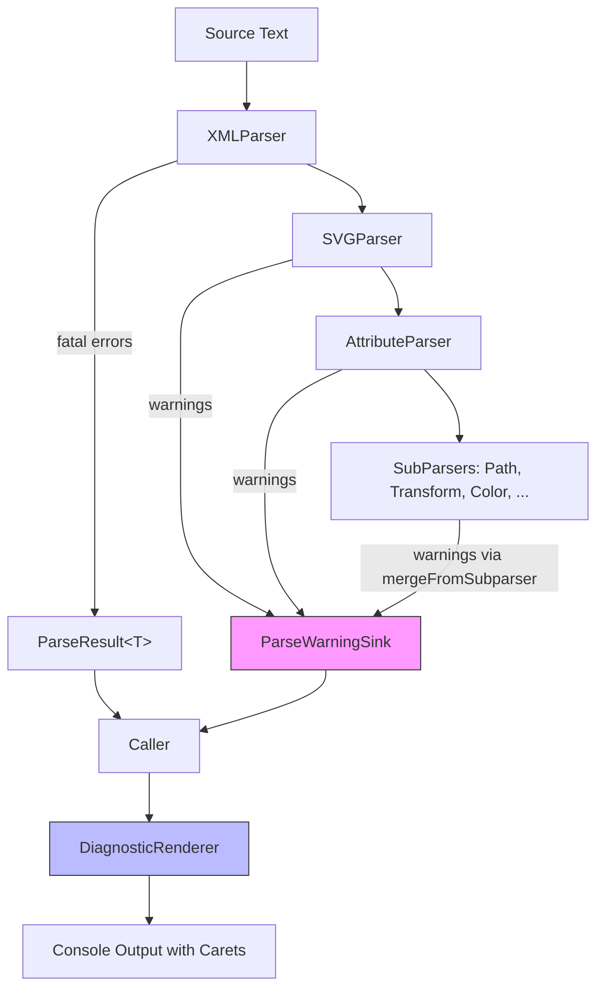

# Parser Diagnostics {#ParserDiagnostics}

Donner uses a unified diagnostics system for all parsers (XML, SVG, CSS, path, transform, etc.).
Every diagnostic carries a severity level, a human-readable message, and a precise source range
indicating exactly where in the input the problem occurred. A console renderer can display
diagnostics with source context and caret/tilde indicators, similar to clang or rustc output.

**Issue:** https://github.com/jwmcglynn/donner/issues/442

## Overview

The diagnostics system has two channels:

- **Fatal errors** flow through `ParseResult<T>`, which holds either a successful result, a
  `ParseDiagnostic` error, or both (partial result with error).
- **Non-fatal warnings** flow through `ParseWarningSink`, a collector passed to parser entry points.
  When disabled, warning emission is near-zero-cost---the factory callable is never invoked.



## Headers

| Type | Header | Role |
|------|--------|------|
| `FileOffset` | `donner/base/FileOffset.h` | Single source position |
| `SourceRange` | `donner/base/FileOffset.h` | Half-open `[start, end)` source span |
| `ParseDiagnostic` | `donner/base/ParseDiagnostic.h` | Diagnostic value type (severity + reason + range) |
| `DiagnosticSeverity` | `donner/base/ParseDiagnostic.h` | `Error` / `Warning` enum |
| `ParseWarningSink` | `donner/base/ParseWarningSink.h` | Warning collector with zero-cost suppression |
| `ParseResult<T>` | `donner/base/ParseResult.h` | Result-or-error wrapper |
| `DiagnosticRenderer` | `donner/base/DiagnosticRenderer.h` | Console rendering with source context |

## Core Types

### `SourceRange`

A half-open interval `[start, end)` of `FileOffset` values. Lives in `donner/base/FileOffset.h`.

```cpp
struct SourceRange {
  FileOffset start;  ///< Start of the range (inclusive).
  FileOffset end;    ///< End of the range (exclusive).
};
```

Construct ranges directly:
```cpp
SourceRange{FileOffset::Offset(startPos), FileOffset::Offset(endPos)}
```

### `ParseDiagnostic`

A diagnostic message with severity, reason string, and source range.

```cpp
enum class DiagnosticSeverity : uint8_t {
  Warning,  ///< Non-fatal issue; parsing continues.
  Error,    ///< Fatal issue; parsing may stop or produce partial results.
};

struct ParseDiagnostic {
  DiagnosticSeverity severity = DiagnosticSeverity::Error;
  RcString reason;
  SourceRange range;

  // Factory methods:
  static ParseDiagnostic Error(RcString reason, FileOffset location);
  static ParseDiagnostic Error(RcString reason, SourceRange range);
  static ParseDiagnostic Warning(RcString reason, FileOffset location);
  static ParseDiagnostic Warning(RcString reason, SourceRange range);
};
```

The `FileOffset` overloads create a point range (zero-width) at the given location.

### `ParseWarningSink`

Collects non-fatal warnings during parsing. The key design property is **implicit zero-cost
suppression**: the `add(Factory&&)` overload accepts a callable that is only invoked when the
sink is enabled. This means `RcString::fromFormat` and other formatting work inside the lambda
is automatically skipped when warnings are disabled---callers don't need to check anything.

```cpp
class ParseWarningSink {
public:
  ParseWarningSink() = default;                // Enabled sink (collects warnings).
  static ParseWarningSink Disabled();          // No-op sink (discards everything).

  bool isEnabled() const;

  // Lazy factory: callable is only invoked when enabled.
  template <typename Factory>
    requires std::invocable<Factory> &&
             std::same_as<std::invoke_result_t<Factory>, ParseDiagnostic>
  void add(Factory&& factory);

  // Direct add: for pre-constructed diagnostics.
  void add(ParseDiagnostic&& warning);

  const std::vector<ParseDiagnostic>& warnings() const;
  bool hasWarnings() const;

  // Merge all warnings from another sink.
  void merge(ParseWarningSink&& other);

  // Merge from a subparser, remapping ranges into parent coordinates.
  void mergeFromSubparser(ParseWarningSink&& other, FileOffset parentOffset);
};
```

### `ParseResult<T>`

Holds either a successful result, a `ParseDiagnostic` error, or both (partial result with error).
Fatal errors flow through this type; non-fatal warnings flow through `ParseWarningSink`.

```cpp
template <typename T>
class ParseResult {
public:
  /* implicit */ ParseResult(T&& result);
  /* implicit */ ParseResult(ParseDiagnostic&& error);
  ParseResult(T&& result, ParseDiagnostic&& error);  // Partial result + error.

  bool hasResult() const noexcept;
  bool hasError() const noexcept;

  T& result() &;
  ParseDiagnostic& error() &;

  template <typename Target, typename Functor>
  ParseResult<Target> map(const Functor& functor) &&;
};
```

## Usage

### Returning errors from a parser

Return a `ParseDiagnostic` via `ParseResult`:

```cpp
return ParseDiagnostic::Error("Unexpected character",
    SourceRange{FileOffset::Offset(startPos), FileOffset::Offset(endPos)});
```

### Emitting warnings

Use the lazy factory to avoid formatting overhead when warnings are disabled:

```cpp
warningSink.add([&] {
  return ParseDiagnostic::Warning(
      RcString::fromFormat("Unknown attribute '{}'", std::string_view(name)), range);
});
```

For literal messages (no formatting), use the direct overload:

```cpp
warningSink.add(ParseDiagnostic::Warning("Missing attribute", range));
```

### Calling a parser

All parser entry points require an explicit `ParseWarningSink&` parameter. There are no
convenience overloads---warning collection is always visible at the call site.

```cpp
ParseWarningSink warningSink;
auto result = SVGParser::ParseSVG(svgSource, warningSink);
if (result.hasError()) {
  // Handle fatal error via result.error()
}
// Non-fatal warnings are in warningSink.warnings()
```

To discard warnings:

```cpp
auto disabled = ParseWarningSink::Disabled();
auto result = SVGParser::ParseSVG(svgSource, disabled);
```

### Subparser warning remapping

When a subparser operates on a substring of the parent input, its warnings have local offsets
that need remapping to the parent's coordinate space:

```cpp
ParseWarningSink subSink;
auto subResult = SubParser::Parse(substring, subSink);
// Remap sub-warnings into parent coordinates and merge.
parentSink.mergeFromSubparser(std::move(subSink), parentOffset);
```

### Rendering diagnostics

`DiagnosticRenderer` formats diagnostics with source context, caret/tilde indicators, and
optional ANSI colors:

```cpp
DiagnosticRenderer::Options options;
options.filename = "input.svg";
options.colorize = true;

// Format a single diagnostic:
std::string output = DiagnosticRenderer::format(source, diag, options);

// Format all warnings from a sink:
std::string allWarnings = DiagnosticRenderer::formatAll(source, warningSink, options);
```

Example output:

```text
error: Unexpected character
  --> input.svg:1:25
   |
 1 | <path d="M 100 100 h 2!" />
   |                         ^
```

For multi-character ranges, tildes indicate the span:

```text
warning: Invalid paint server value
  --> 4:12
   |
 4 | <path fill="url(#)"/>
   |             ^~~~~~
```

The renderer handles edge cases gracefully:
- **Zero-length (point) ranges**: single caret at the insertion point.
- **EndOfString offsets**: severity label and message only, no source context.
- **Out-of-bounds offsets**: severity label and message only.

## Testing

### Test matchers

`ParseResultTestUtils.h` provides gmock matchers for diagnostics:

```cpp
// Match error message on a ParseResult:
EXPECT_THAT(result, ParseErrorIs("Unexpected character"));

// Match error source range offsets on a ParseResult:
EXPECT_THAT(result, ParseErrorRange(Optional(13u), Optional(14u)));
```

### Range-accuracy tests

Each parser has tests verifying that reported ranges point to the correct span:

```cpp
TEST(PathParser, RangeInvalidFlag) {
  auto result = PathParser::Parse("M 0,0 a 1 1 0 2 0 1 1");
  ASSERT_THAT(result, AllOf(
      ParseErrorIs("Failed to parse arc flag, expected '0' or '1'"),
      ParseErrorRange(Optional(13u), Optional(14u))));
}
```

### Renderer golden tests

`DiagnosticRenderer_tests.cc` uses inline golden strings to catch formatting regressions:

```cpp
TEST(DiagnosticRenderer, SingleCharError) {
  const std::string_view source = R"(<path d="M 100 100 h 2!" />)";
  auto diag = ParseDiagnostic::Error(
      "Unexpected character",
      SourceRange{FileOffset::Offset(24), FileOffset::Offset(25)});
  DiagnosticRenderer::Options options;
  options.filename = "test.svg";
  EXPECT_EQ(DiagnosticRenderer::format(source, diag, options),
            "error: Unexpected character\n"
            "  --> test.svg:1:25\n"
            "   |\n"
            " 1 | <path d=\"M 100 100 h 2!\" />\n"
            "   |                         ^\n");
}
```

## Architecture Notes

### SVGParserContext

`SVGParserContext` holds a `ParseWarningSink&` reference for the parse session. It provides
`addSubparserWarning()` and `fromSubparser()` methods for remapping diagnostics from attribute
subparsers (which operate on substrings) back to the original input coordinates.

### Performance

- **Zero-cost when disabled**: `ParseWarningSink::Disabled()` short-circuits before invoking
  the factory callable. No formatting, no allocations, no virtual dispatch.
- **No additional allocations on success path**: `ParseResult<T>` uses `std::optional`.
  `ParseDiagnostic` is slightly larger than the old `ParseError` (adds severity + range end),
  but this only matters on error paths.
- **LineOffsets reuse**: `DiagnosticRenderer::formatAll()` computes `LineOffsets` once and
  shares it across all diagnostics via the private `formatWithLineOffsets()` method.

### Design decisions

- **No convenience overloads**: All parser entry points require explicit `ParseWarningSink&` to
  make warning collection visible at every call site.
- **Concrete class, not virtual**: `ParseWarningSink` is a concrete class with a template `add`
  method, not a virtual interface. This enables zero-cost inlining of the enabled check. A
  virtual interface can be added later if custom sinks are needed.
- **Separate overloads instead of default arguments**: `DiagnosticRenderer` uses overloaded
  methods rather than `Options options = {}` default arguments because GCC rejects default
  member initializers in aggregates used as default function arguments before the class is
  complete.
