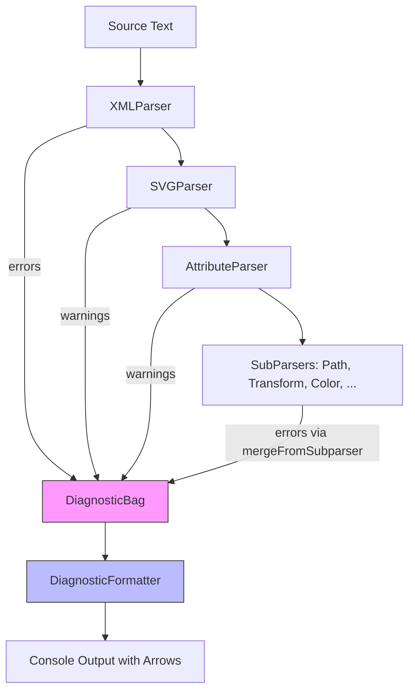

# Design: Parser Diagnostics v2

**Status:** Design
**Author:** Claude Opus 4.6
**Created:** 2026-04-05
**Issue:** https://github.com/jwmcglynn/donner/issues/442

## Summary

Replace the existing `ParseError` / `std::vector<ParseError>*` diagnostics infrastructure with a
unified `ParseDiagnostic` type that carries severity, source ranges (not just a single offset), and
structured metadata. Introduce a `DiagnosticBag` collector that replaces the ad-hoc
`std::vector<ParseError>* outWarnings` pattern used throughout the parser stack. The goal is
clang-quality diagnostics: every parser reports precise source ranges, and a console formatter can
render errors with source text and underline arrows.

No backward compatibility with the existing `ParseError` API is required.

## Goals

- **Unified diagnostic type** (`ParseDiagnostic`) shared across all parsers: XML, SVG, CSS, path,
  transform, etc.
- **Full source ranges**: every diagnostic carries a `FileOffsetRange` (start + end), not just a
  single `FileOffset`.
- **Severity levels**: distinguish errors (fatal) from warnings (non-fatal).
- **First-class collection**: `DiagnosticBag` always accepts diagnostics but can be configured to
  discard them, avoiding string formatting overhead when diagnostics are disabled.
- **Console rendering**: a utility that prints diagnostics with source context and caret/underline
  arrows (similar to clang/rustc output).
- **Comprehensive test coverage**: every parser has tests verifying that reported ranges are accurate.

## Non-Goals

- Backward compatibility with the existing `ParseError` struct or `ParseResult<T>` API.
- Structured error codes or an error-code enum system (string reasons remain the primary message;
  codes can be added later if programmatic error handling is needed).
- Fixit suggestions or auto-correction (future work).
- Internationalization of error messages.
- Changing the CSS tokenizer's `ErrorToken` system (it operates at a different layer and can be
  bridged to `ParseDiagnostic` at the parser boundary).

## Next Steps

1. Implement the core types: `ParseDiagnostic`, `DiagnosticBag`, updated `ParseResult<T>`.
2. Migrate `ParserBase` and one concrete parser (e.g. `PathParser`) to validate the design
   end-to-end.
3. Add the console diagnostic formatter and verify it produces readable output.

## Implementation Plan

- [ ] **Milestone 1: Core types**
  - [ ] Create `ParseDiagnostic` struct in `donner/base/ParseDiagnostic.h`
  - [ ] Create `DiagnosticBag` class in `donner/base/DiagnosticBag.h`
  - [ ] Update `ParseResult<T>` to use `ParseDiagnostic` instead of `ParseError`
  - [ ] Update `ParseResultTestUtils.h` matchers for the new types
  - [ ] Delete `ParseError.h` / `ParseError.cc` (replaced by `ParseDiagnostic`)
- [ ] **Milestone 2: Migrate base parsers**
  - [ ] Update `ParserBase` to produce `ParseDiagnostic` with ranges
  - [ ] Migrate `NumberParser`, `IntegerParser`, `LengthParser`
  - [ ] Migrate `DataUrlParser` to use `ParseDiagnostic` (remove `DataUrlParserError` enum)
  - [ ] Add range-accuracy tests for each base parser
- [ ] **Milestone 3: Migrate SVG parsers**
  - [ ] Migrate `PathParser` (key test case: partial results with accurate ranges)
  - [ ] Migrate `TransformParser`, `ViewBoxParser`, `AngleParser`
  - [ ] Migrate `LengthPercentageParser`, `PreserveAspectRatioParser`, `Number2dParser`,
    `PointsListParser`, `CssTransformParser`, `ListParser`
  - [ ] Migrate `AttributeParser` (change `std::optional<ParseError>` return to
    `std::optional<ParseDiagnostic>`)
  - [ ] Replace `SVGParserContext` warnings storage with `DiagnosticBag`
  - [ ] Migrate `SVGParser` public API: replace `std::vector<ParseError>* outWarnings`
  - [ ] Add range-accuracy tests for each SVG parser
- [ ] **Milestone 4: Migrate XML and CSS parsers**
  - [ ] Migrate `XMLParser` to produce `ParseDiagnostic`
  - [ ] Migrate CSS `ColorParser`, `SelectorParser` to produce `ParseDiagnostic`
  - [ ] Bridge CSS tokenizer `ErrorToken` to `ParseDiagnostic` at parser boundary
  - [ ] Make `StylesheetParser` report diagnostics via `DiagnosticBag` (currently silent)
  - [ ] Add range-accuracy tests for CSS/XML parsers
- [ ] **Milestone 5: Console diagnostic formatter**
  - [ ] Implement `DiagnosticFormatter` that renders diagnostics with source context and
    caret/underline arrows
  - [ ] Add golden tests for formatter output
- [ ] **Milestone 6: Cleanup**
  - [ ] Remove all references to old `ParseError` type
  - [ ] Audit and remove any remaining `std::vector<ParseError>*` patterns
  - [ ] Update documentation

## Proposed Architecture

### Type Hierarchy

```
donner/base/
  FileOffset.h          (unchanged - keep FileOffset and FileOffsetRange)
  ParseDiagnostic.h     (NEW - replaces ParseError.h)
  DiagnosticBag.h       (NEW - replaces std::vector<ParseError>*)
  ParseResult.h         (MODIFIED - uses ParseDiagnostic)
```

### Core Types

#### `ParseDiagnostic` (replaces `ParseError`)

```cpp
// donner/base/ParseDiagnostic.h
namespace donner {

/// Severity level for a parser diagnostic.
enum class DiagnosticSeverity : uint8_t {
  Warning,  ///< Non-fatal issue; parsing continues.
  Error,    ///< Fatal issue; parsing may stop or produce partial results.
};

/// Ostream output operator for DiagnosticSeverity.
std::ostream& operator<<(std::ostream& os, DiagnosticSeverity severity);

/**
 * A diagnostic message from a parser, with severity, source range, and human-readable reason.
 *
 * This is the shared diagnostic type used across all donner parsers (XML, SVG, CSS, etc.).
 */
struct ParseDiagnostic {
  /// Severity of this diagnostic.
  DiagnosticSeverity severity = DiagnosticSeverity::Error;

  /// Human-readable description of the problem.
  RcString reason;

  /// Source range that this diagnostic applies to. For point diagnostics where
  /// the end is unknown, start == end.
  FileOffsetRange range = {FileOffset::Offset(0), FileOffset::Offset(0)};

  /// Create an error diagnostic at a single offset (convenience).
  static ParseDiagnostic Error(RcString reason, FileOffset location) {
    return {DiagnosticSeverity::Error, std::move(reason), {location, location}};
  }

  /// Create an error diagnostic with a source range.
  static ParseDiagnostic Error(RcString reason, FileOffsetRange range) {
    return {DiagnosticSeverity::Error, std::move(reason), range};
  }

  /// Create a warning diagnostic at a single offset.
  static ParseDiagnostic Warning(RcString reason, FileOffset location) {
    return {DiagnosticSeverity::Warning, std::move(reason), {location, location}};
  }

  /// Create a warning diagnostic with a source range.
  static ParseDiagnostic Warning(RcString reason, FileOffsetRange range) {
    return {DiagnosticSeverity::Warning, std::move(reason), range};
  }

  /// Ostream output operator.
  friend std::ostream& operator<<(std::ostream& os, const ParseDiagnostic& diag);
};

}  // namespace donner
```

Key design decisions:
- **`FileOffsetRange` instead of `FileOffset`**: Every diagnostic has a start and end. For
  point-level diagnostics where we only know the start, `start == end`. This is forward-compatible
  with parsers that don't yet track end positions.
- **Static factory methods**: `Error(...)` and `Warning(...)` make call sites readable and prevent
  accidentally constructing a warning with error severity.
- **No error codes**: String reasons remain the primary message. Adding an optional error code enum
  is future work if programmatic matching is needed beyond tests.

#### `DiagnosticBag` (replaces `std::vector<ParseError>*`)

```cpp
// donner/base/DiagnosticBag.h
namespace donner {

/**
 * Collects ParseDiagnostic instances during parsing. Always safe to call addWarning/addError
 * on; when constructed in "discard" mode, diagnostics are silently dropped without formatting
 * overhead.
 *
 * Replaces the `std::vector<ParseError>* outWarnings` pattern.
 */
class DiagnosticBag {
public:
  /// Construct a bag that stores diagnostics.
  DiagnosticBag() = default;

  /// Construct a bag that discards all diagnostics (no-op sink).
  static DiagnosticBag Discard();

  /// Add a diagnostic.
  void add(ParseDiagnostic&& diag);

  /// Convenience: add an error.
  void addError(RcString reason, FileOffset location);
  void addError(RcString reason, FileOffsetRange range);

  /// Convenience: add a warning.
  void addWarning(RcString reason, FileOffset location);
  void addWarning(RcString reason, FileOffsetRange range);

  /// Returns true if any error-severity diagnostics have been added.
  bool hasErrors() const;

  /// Returns true if any diagnostics have been added.
  bool hasDiagnostics() const;

  /// Returns true if this bag is in discard mode.
  bool isDiscarding() const;

  /// Access the collected diagnostics.
  const std::vector<ParseDiagnostic>& diagnostics() const;

  /// Access only warnings.
  std::vector<ParseDiagnostic> warnings() const;

  /// Access only errors.
  std::vector<ParseDiagnostic> errors() const;

  /// Merge all diagnostics from another bag into this one.
  void merge(DiagnosticBag&& other);

  /**
   * Merge diagnostics from a subparser, remapping offsets using the given ParserOrigin-style
   * parent offset. Replaces SVGParserContext::addSubparserWarning.
   */
  void mergeFromSubparser(DiagnosticBag&& other, FileOffset parentOffset);

private:
  std::vector<ParseDiagnostic> diagnostics_;
  bool discarding_ = false;
};

}  // namespace donner
```

Key design decisions:
- **Always-safe API**: `DiagnosticBag` never requires a null check. The `Discard()` factory creates
  a no-op sink, replacing the `if (warnings_) { ... }` null-pointer pattern throughout
  `SVGParserContext`.
- **Lazy formatting optimization**: When `isDiscarding()` is true, callers can skip expensive string
  formatting. This can be wrapped in a macro or inline helper:
  ```cpp
  // In hot paths, avoid formatting when discarding:
  if (!bag.isDiscarding()) {
    bag.addWarning(RcString::fromFormat("Unknown attribute '%s'", name), range);
  }
  ```
- **Subparser merging**: `mergeFromSubparser` replaces `SVGParserContext::fromSubparser` and
  `addSubparserWarning`, centralizing the offset remapping logic.

#### Updated `ParseResult<T>`

```cpp
// donner/base/ParseResult.h
namespace donner {

template <typename T>
class ParseResult {
public:
  /* implicit */ ParseResult(T&& result);
  /* implicit */ ParseResult(const T& result);
  /* implicit */ ParseResult(ParseDiagnostic&& error);
  /* implicit */ ParseResult(const ParseDiagnostic& error);

  /// Partial result + error.
  ParseResult(T&& result, ParseDiagnostic&& error);

  T& result() &;
  T&& result() &&;
  const T& result() const&;

  ParseDiagnostic& error() &;
  ParseDiagnostic&& error() &&;
  const ParseDiagnostic& error() const&;

  bool hasResult() const noexcept;
  bool hasError() const noexcept;

  template <typename Target, typename Functor>
  ParseResult<Target> map(const Functor& functor) &&;

  template <typename Target, typename Functor>
  ParseResult<Target> mapError(const Functor& functor) &&;

private:
  std::optional<T> result_;
  std::optional<ParseDiagnostic> error_;
};

}  // namespace donner
```

This is a drop-in replacement: the API shape is identical, only the contained error type changes
from `ParseError` to `ParseDiagnostic`.

### Data Flow



### Console Diagnostic Formatter

The formatter renders diagnostics against source text, producing output like:

```
error: Failed to parse number: Unexpected character
  --> input.svg:2:24
   |
 2 |   <path d="M 100 100 h 2!" />
   |                         ^ unexpected character
```

For range diagnostics:

```
warning: Unknown attribute 'user-attribute' (disableUserAttributes: true)
  --> input.svg:2:18
   |
 2 |   <rect stroke="red" user-attribute="value" />
   |                       ^^^^^^^^^^^^^^^^^^^^^^^^ unknown attribute
```

```cpp
// donner/base/DiagnosticFormatter.h
namespace donner {

class DiagnosticFormatter {
public:
  struct Options {
    /// Maximum number of context lines to show before/after the diagnostic.
    int contextLines = 1;
    /// Enable colorized output (ANSI escape codes).
    bool colorize = false;
    /// Optional filename to display in the header.
    std::string_view filename;
  };

  /**
   * Format a single diagnostic against the source text.
   *
   * @param source The full source text that was parsed.
   * @param diag The diagnostic to format.
   * @param options Formatting options.
   * @return Formatted diagnostic string.
   */
  static std::string format(std::string_view source, const ParseDiagnostic& diag,
                            const Options& options = {});

  /**
   * Format all diagnostics in a bag against the source text.
   */
  static std::string formatAll(std::string_view source, const DiagnosticBag& bag,
                               const Options& options = {});
};

}  // namespace donner
```

### Migration Pattern for Parsers

Each parser migration follows the same pattern:

**Before:**
```cpp
// NumberParser returning single-offset error
return ParseError{RcString("Unexpected character"), FileOffset::Offset(pos)};
```

**After:**
```cpp
// NumberParser returning range error
return ParseDiagnostic::Error(
    RcString("Unexpected character"),
    FileOffsetRange{currentOffset(), currentOffset(1)});
```

**SVGParser before:**
```cpp
static ParseResult<SVGDocument> ParseSVG(
    std::string_view source,
    std::vector<ParseError>* outWarnings = nullptr,
    Options options = {});
```

**SVGParser after:**
```cpp
static ParseResult<SVGDocument> ParseSVG(
    std::string_view source,
    DiagnosticBag& diagnostics,
    Options options = {});

// Overload for callers that don't need diagnostics:
static ParseResult<SVGDocument> ParseSVG(
    std::string_view source,
    Options options = {});
```

### SVGParserContext Changes

`SVGParserContext` currently owns the `std::vector<ParseError>*` and does offset remapping. It will
be updated to hold a `DiagnosticBag&` reference instead:

```cpp
class SVGParserContext {
public:
  SVGParserContext(std::string_view input, DiagnosticBag& diagnostics,
                   const SVGParser::Options& options);

  /// Add a warning diagnostic.
  void addWarning(RcString reason, FileOffsetRange range);

  /// Add a warning from a subparser, remapping offsets.
  void addSubparserWarning(ParseDiagnostic&& diag, ParserOrigin origin);

  // ... rest unchanged
private:
  DiagnosticBag& diagnostics_;
  // ...
};
```

## API / Interfaces

### Public API Surface

| Type | Header | Role |
|------|--------|------|
| `ParseDiagnostic` | `donner/base/ParseDiagnostic.h` | Shared diagnostic value type |
| `DiagnosticSeverity` | `donner/base/ParseDiagnostic.h` | Error vs Warning enum |
| `DiagnosticBag` | `donner/base/DiagnosticBag.h` | Diagnostic collector/sink |
| `ParseResult<T>` | `donner/base/ParseResult.h` | Result-or-error (uses `ParseDiagnostic`) |
| `DiagnosticFormatter` | `donner/base/DiagnosticFormatter.h` | Console rendering utility |
| `FileOffset` | `donner/base/FileOffset.h` | Single source position (unchanged) |
| `FileOffsetRange` | `donner/base/FileOffset.h` | Source range (unchanged) |

### Removed Types

| Type | Replacement |
|------|-------------|
| `ParseError` | `ParseDiagnostic` |
| `DataUrlParserError` | `ParseDiagnostic` returned via `ParseResult` |

## Testing and Validation

### Range Accuracy Tests

Every parser gets a dedicated test verifying that the reported range accurately covers the
problematic source text. The test pattern:

```cpp
TEST(PathParser, ErrorRangeAccuracy) {
  auto result = PathParser::Parse("M 100 100 h 2!");
  ASSERT_THAT(result, HasDiagnostic(
      DiagnosticSeverity::Error,
      "Failed to parse number: Unexpected character",
      SourceRange(13, 14)));  // covers "!"
}
```

New test matchers:

```cpp
// Matches a ParseDiagnostic by severity, message, and range.
MATCHER_P3(DiagnosticIs, severity, messageMatcher, rangeMatcher, "");

// Matches the source range of a diagnostic.
MATCHER_P2(SourceRange, startOffset, endOffset, "");

// Matches that a DiagnosticBag contains a specific diagnostic.
MATCHER_P(HasDiagnostic, diagnosticMatcher, "");
```

### Formatter Golden Tests

The `DiagnosticFormatter` output is tested with golden files to prevent regressions in formatting:

```cpp
TEST(DiagnosticFormatter, ErrorWithRange) {
  const auto source = R"(<path d="M 100 100 h 2!" />)";
  ParseDiagnostic diag = ParseDiagnostic::Error(...);
  EXPECT_EQ(DiagnosticFormatter::format(source, diag, options), R"(
error: Failed to parse number: Unexpected character
  --> test.svg:1:24
   |
 1 | <path d="M 100 100 h 2!" />
   |                         ^ unexpected character
)");
}
```

### Test Matrix

| Parser | Error ranges | Warning ranges | Partial results |
|--------|:---:|:---:|:---:|
| `NumberParser` | yes | - | - |
| `IntegerParser` | yes | - | - |
| `PathParser` | yes | - | yes |
| `TransformParser` | yes | - | - |
| `ViewBoxParser` | yes | - | - |
| `AngleParser` | yes | - | - |
| `LengthPercentageParser` | yes | - | - |
| `PreserveAspectRatioParser` | yes | - | - |
| `CssTransformParser` | yes | - | - |
| `ColorParser` | yes | - | - |
| `SelectorParser` | yes | - | - |
| `XMLParser` | yes | - | - |
| `SVGParser` | yes | yes | - |
| `AttributeParser` | yes | yes | - |
| `StylesheetParser` | - | yes | - |

## Performance

- **Zero-cost when disabled**: `DiagnosticBag::Discard()` drops all diagnostics without allocation.
  Callers should check `isDiscarding()` before doing expensive string formatting.
- **No additional allocations on success path**: `ParseResult<T>` still uses `std::optional` for
  both the result and the diagnostic. The `ParseDiagnostic` struct is slightly larger than
  `ParseError` (adds severity enum + one extra `FileOffset` for end), but this is only allocated on
  error paths.
- **DiagnosticBag** uses a `std::vector` internally, same as the current `std::vector<ParseError>*`
  pattern but with one fewer level of indirection (no null-pointer check on each add).

## Alternatives Considered

### 1. Error code enum per parser

Each parser could define its own `enum class` of error types (like `DataUrlParserError`). This
would enable exhaustive `switch` handling but adds significant boilerplate for little practical
benefit---most callers just log the message. String matching in tests is sufficient for now.

**Rejected**: Too much boilerplate, low practical benefit.

### 2. Keep `ParseError` and add `ParseWarning` as a separate type

Instead of a unified `ParseDiagnostic` with severity, keep `ParseError` for errors and add a
separate `ParseWarning` struct.

**Rejected**: Leads to duplicated infrastructure (two bag types, two sets of matchers, etc.) for
types that are structurally identical. A severity field is simpler.

### 3. `std::expected`-based `ParseResult`

Replace custom `ParseResult<T>` with `std::expected<T, ParseDiagnostic>` (C++23).

**Rejected**: Donner targets C++20. Also, `std::expected` doesn't support the "both result AND
error" partial-result pattern that `PathParser` relies on.

## Open Questions

1. **Should `DiagnosticBag` be thread-safe?** Currently all parsing is single-threaded. If parallel
   parsing is added later, `DiagnosticBag` would need a mutex or per-thread bags that merge.
   Recommendation: keep it single-threaded for now.

2. **Should the formatter support multi-line ranges?** For v1, single-line underlines are
   sufficient. Multi-line range rendering (like rustc's `|` markers) can be added later.

## Future Work

- [ ] Structured error codes for programmatic error handling.
- [ ] Fixit suggestions ("did you mean ...?").
- [ ] Multi-line range rendering in the formatter.
- [ ] LSP-compatible diagnostic output (JSON) for editor integration.
- [ ] Thread-safe `DiagnosticBag` for parallel parsing.
