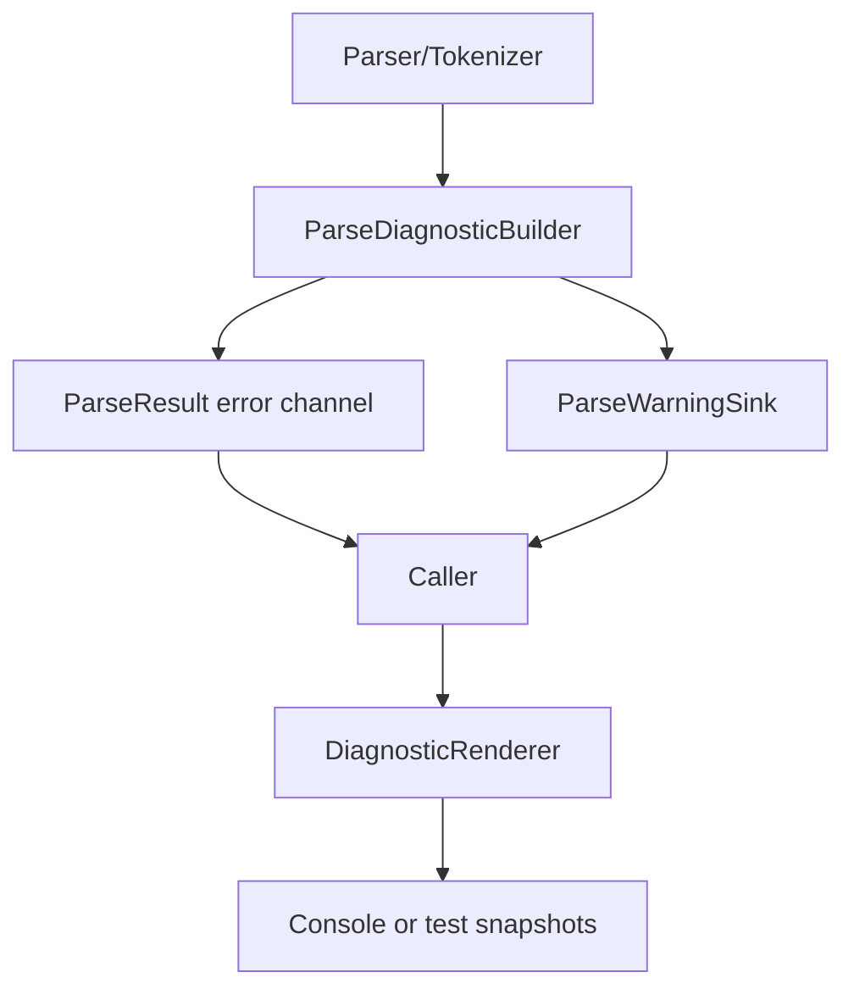
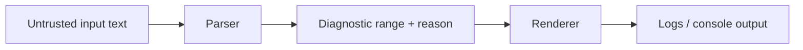

# Design: Parser Diagnostics v2 {#ParserDiagnosticsV2}

**Status:** Design
**Author:** GPT-5.3-Codex
**Created:** 2026-04-05
**Issue:** https://github.com/jwmcglynn/donner/issues/442

## Summary

Parser Diagnostics v2 upgrades Donner's parsing diagnostics from single-point failures to richer,
source-aware reports that include full character ranges, standardized warning collection, and
human-friendly rendering for console output. The design keeps the existing ParseResult-style
ergonomics while introducing a first-class diagnostics channel that is always available to parser
entry points.

This work targets parser-facing APIs in `donner/base` and `donner/svg/parser` plus parser
callers that currently thread `std::vector<ParseError>*` manually.

## Goals

- Represent parse failures and warnings with full source ranges instead of only a start location.
- Make warning collection a first-class parser concern with a stable API and optional suppression.
- Preserve partial-result behavior (`ParseResult<T>` may hold both value and error).
- Improve consistency of range attribution across subparsers and nested parse contexts.
- Provide CLI-quality diagnostic rendering (line snippets + caret/tilde indicators).
- Add broad parser test coverage for location/range correctness.

## Non-Goals

- Replacing all existing `ParseError` call sites in one CL with breaking API changes.
- Adding LSP/IDE protocol support in this phase.
- Emitting machine-readable JSON diagnostics in v2.
- Redesigning non-parser error types outside ParseResult/ParseError flows.

## Next Steps

- Confirm API naming for `ParseWarningSink` and the concrete `ParseDiagnostic` representation.
- Land base types (`SourceRange`, `ParseDiagnostic`, warning sink) behind adapter shims.
- Migrate one parser vertical end-to-end (PathParser + SVGParserContext) as a proving path.

### Immediate execution step (requested)

- Start **Milestone 1** by introducing the new base diagnostics model in `donner/base` with
  compile-safe compatibility shims.

## Implementation Plan

- [ ] Milestone 1: Introduce base diagnostics model in `donner/base`
  - [ ] Add `SourceRange` (or equivalent) that supports start/end offsets and line metadata.
  - [ ] Extend `ParseError` to store an explicit range while preserving source compatibility.
  - [ ] Introduce a shared `ParseDiagnostic` value type for warning/error payloads.
- [ ] Milestone 2: Introduce first-class warning plumbing
  - [ ] Add `ParseWarningSink` (always passed, no-op when disabled).
  - [ ] Migrate `SVGParserContext` to use the sink instead of raw warning vectors.
  - [ ] Add lazy-format hooks to avoid constructing warning strings when disabled.
- [ ] Milestone 3: Range-correctness migration for parsers
  - [ ] Migrate `PathParser`, `TransformParser`, and property parsers to emit full ranges.
  - [ ] Standardize subparser remapping with parent range composition helpers.
  - [ ] Add tests for each parser family validating exact range behavior.
- [ ] Milestone 4: Diagnostic rendering utilities
  - [ ] Implement formatter for single-line and multi-line source highlights.
  - [ ] Add severity labels (error/warning) and optional parser-origin prefixes.
  - [ ] Provide convenience helpers for tests and CLI logging paths.

### Milestone 1 kickoff checklist (expanded)

- [ ] Create `SourceRange` in `donner/base`:
  - [ ] Define half-open range semantics (`[start, end)`).
  - [ ] Add constructors for `offset + length` and `start/end`.
  - [ ] Add parent-offset remapping helper used by nested parsers.
  - [ ] Add unit tests for empty, single-char, and multi-char ranges.
- [ ] Extend `ParseError` compatibly:
  - [ ] Add a range field while preserving existing `location` access patterns.
  - [ ] Add adapter helpers for old callers that only set a start location.
  - [ ] Add tests proving old and new constructors preserve behavior.
- [ ] Add `ParseDiagnostic` and severity enum:
  - [ ] Keep representation allocation-light and value-semantic.
  - [ ] Validate invariants in tests (severity/value copy/move).
- [ ] Introduce warning sink interface:
  - [ ] Add no-op sink and vector-collecting sink implementations.
  - [ ] Add lazy-emission helper tests to verify no formatting when disabled.
- [ ] Milestone 1 acceptance criteria:
  - [ ] Existing parser tests compile without broad call-site churn.
  - [ ] New base tests pass for range math + warning sink behavior.
  - [ ] No regression in current `ParseResult<T>` semantics.

## User Stories

- As a developer debugging malformed SVG input, I want diagnostics with exact highlighted spans
  so I can quickly identify and fix the offending text.
- As a library user, I want to disable warnings with near-zero overhead when I only care about
  hard failures.
- As a maintainer, I want deterministic range tests so parser regressions are caught early.

## Background

Issue #442 identifies three pain points in the current system:

1. Errors report only a single index instead of a full range.
2. Range attribution likely has bugs and lacks comprehensive test coverage.
3. Warning propagation currently depends on optional vectors and is not uniformly plumbed.

Today, `ParseError` stores a message plus a `FileOffset` location, and `SVGParserContext` remaps
nested parser errors/warnings by offset translation. This provides basic diagnostics but makes
precise highlighting and reliable warning plumbing difficult as parser complexity grows.

## Requirements and Constraints

### Functional requirements

- Every parser diagnostic must include:
  - severity (error/warning),
  - reason text,
  - source range (`start`, `end`) with line-aware derivation when input is available.
- Subparser diagnostics must remap correctly into the parent source.
- Existing parse APIs should remain source compatible where practical, with incremental migration.

### Quality requirements

- Warning-disabled mode should avoid expensive formatting work.
- Diagnostic rendering should be deterministic and testable without terminal dependencies.
- Core utility APIs should stay allocation-conscious and avoid heavyweight dependencies.

### Compatibility constraints

- Maintain `ParseResult<T>` semantics and partial-result support.
- Support both parser-local use and top-level document parsing (`SVGParser`).

## Proposed Architecture

### High-level model



### Proposed core types

- **`SourceRange`**: value type representing half-open character ranges `[start, end)`.
  - Can be constructed from offset + length or start/end offsets.
  - Supports `addParentOffset(...)` to remap nested parser ranges.
- **`ParseDiagnostic`**: common payload for errors and warnings.
  - Fields: `severity`, `reason`, `range`, optional `parserTag`.
- **`ParseError`**:
  - Either becomes a typedef/wrapper of `ParseDiagnostic` with `severity=Error`, or remains a
    dedicated type with an added `SourceRange` field.
  - Keeps existing APIs available via compatibility accessors (`location()` from `range.start`).
- **`ParseWarningSink`**:
  - Always passed to parse entry points.
  - Implementations: collecting sink, no-op sink.
  - Provides `isEnabled()` and lazy-add helpers.

### Parser context integration

`SVGParserContext` owns or references a warning sink and line-offset mapping. It provides:

- `fromSubparser(...)` remapping for diagnostic ranges (not only start offsets).
- `addWarning(...)` forwarding into `ParseWarningSink`.
- optional helpers to derive attribute-name/value ranges from XML node metadata.

### Rendering utility

A dedicated diagnostic renderer takes `(input, ParseDiagnostic)` and emits text such as:

```text
warning: Invalid paint server value
  --> line 4, col 12
4 | <path fill="url(#)"/>
  |            ^~~~
```

Renderer behavior:

- single-line: caret + tildes for span width,
- zero-length spans: caret at insertion point,
- multi-line spans: first/last line emphasis with bounded context,
- resilient fallback when source text is unavailable.

## API / Interfaces

```cpp
struct SourceRange {
  FileOffset start;
  FileOffset end;

  static SourceRange OffsetAndLength(size_t offset, size_t length);
  SourceRange addParentOffset(const FileOffset& parent) const;
};

enum class DiagnosticSeverity { Error, Warning };

struct ParseDiagnostic {
  DiagnosticSeverity severity;
  RcString reason;
  SourceRange range;
  RcString parserTag;  // optional
};

class ParseWarningSink {
 public:
  virtual ~ParseWarningSink() = default;
  virtual bool isEnabled() const = 0;
  virtual void add(ParseDiagnostic&& warning) = 0;
};
```

Notes:

- Final signatures may be adjusted to match existing ownership/value conventions.
- We may keep `ParseError` as public API while using `ParseDiagnostic` internally during migration.

## Error Handling

- Fatal parser failures continue through `ParseResult<T>::error()`.
- Recoverable issues use warning sink emission.
- Partial parse results remain supported for tolerant parsers.
- Diagnostics must never crash formatting; renderer returns best-effort output for malformed ranges.

## Performance

- Use no-op sink to make disabled warnings close to zero-cost.
- Support lazy reason construction via callable overload:
  `addLazy([&]() -> ParseDiagnostic { ... })`.
- Reuse existing line-offset indexing from parser context to avoid repeated scans.

## Security / Privacy

Parsers process untrusted SVG/XML/CSS input, so diagnostics must avoid introducing amplification
or data-leak risks.



Security controls:

- Clamp/validate ranges before rendering to prevent out-of-bounds access.
- Truncate rendered source excerpts and reason length in logging paths.
- Avoid echoing unrelated large input regions in diagnostics.
- Add negative tests for malformed ranges and very long lines.

Privacy note:

- Diagnostic output may include user-provided SVG snippets; callers decide whether/how to surface
  these logs in sensitive environments.

## Testing and Validation

- **Unit tests (`donner/base`)**
  - `SourceRange` construction, offset math, parent remap behavior.
  - `ParseDiagnostic` invariants and severity handling.
  - warning sink no-op vs collecting behavior, including lazy formatting.
- **Parser tests (`donner/svg/parser/tests`)**
  - Add precise range assertions for `PathParser`, `TransformParser`, `PreserveAspectRatioParser`,
    and `LengthPercentageParser` errors.
  - Add subparser remap tests via `SVGParserContext` for nested attribute parsing.
- **Golden/approval tests**
  - Snapshot diagnostic-renderer output for representative error/warning cases.
  - Include single-line, zero-length, and multi-line span examples.
- **Fuzz / negative tests**
  - Extend parser fuzz harnesses to assert no crashes with malformed ranges.
  - Add renderer robustness tests for adversarial range values.

## Alternatives Considered

1. **Keep `ParseError` only, add `endOffset` field directly**
   - Pros: smallest API diff.
   - Cons: warnings remain ad hoc; harder to share renderer and severity model.
2. **Global thread-local diagnostics collector**
   - Pros: minimal signature churn.
   - Cons: hidden state, poor testability, unsafe in concurrent parse scenarios.
3. **Immediate full migration of all parsers in one change**
   - Pros: fast conceptual cleanup.
   - Cons: high risk, large PR surface, harder bisectability.

## Open Questions

- Should `ParseWarningSink` be a virtual interface, a type-erased callable, or a concrete class?
- Do we expose `ParseDiagnostic` publicly now, or keep it internal until API stabilizes?
- Should renderer output be part of `donner/base` or parser-layer utilities?
- What default truncation limits should be used for diagnostic reason/source excerpts?

## Future Work

- [ ] Add machine-readable diagnostic serialization (JSON) for editor tooling.
- [ ] Add fix-it hint support for common parse failures where safe.
- [ ] Add parser feature metrics (warning/error counts by parser type).
