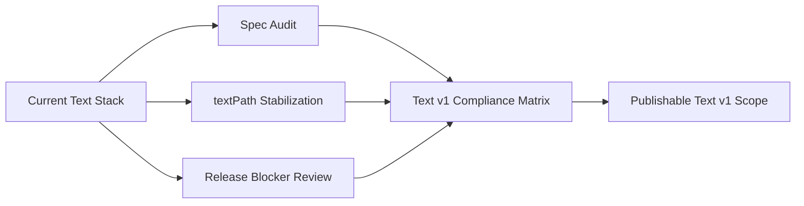

# Design: Text v1 Release

[Back to hub](../text_rendering.md)

**Status:** In Progress
**Author:** Codex (GPT-5)
**Created:** 2026-04-04

## Summary

Text v1 is the first externally publishable Donner text release. It is narrower than "full SVG2
text", but broader than the current internal milestone docs: it includes base-tier `<text>` /
`<tspan>` support, the currently-shipped `text_full` tier, a finished core `<textPath>` feature
set, and a written compliance baseline against the current SVG2 / CSS text-related specs.

This design scopes two final workstreams before calling text ready for v1:

- Finish `<textPath>` to the point that the core non-UB resvg coverage can be enabled and defended.
- Audit the implementation against the latest published W3C SVG2 and CSS text-related modules, and
  publish a clear compliance matrix that says what Donner text v1 does and does not claim.

This document also defines the release bar: what must be fixed before publish, what may remain
explicitly unsupported, and which specs form the v1 compatibility target.

## Goals

- Ship a publishable Text v1 scope with explicit guarantees for the base `text` and `text_full`
  tiers.
- Finish core `<textPath>` behavior so it is part of the supported Text v1 surface, not a hidden
  experimental feature.
- Define and document the normative spec baseline for Text v1 using the latest published W3C
  SVG2/CSS text-related specifications as of the release date.
- Produce a feature-by-feature compliance matrix linking Donner behavior to the relevant spec
  section and test coverage.
- Close or deliberately reclassify the remaining active base-tier text regressions that would make
  the release feel incomplete.

## Non-Goals

- Full bidirectional text support for mixed-direction paragraphs and spans.
- Full mixed-script vertical text parity.
- SVG2 text wrapping (`inline-size`, `shape-inside`, `shape-subtract`).
- Full `<textPath>` parity for SVG2-only extras such as `side=right`, `path` attribute, and
  every interaction with filters, masks, and clip-paths unless they prove trivial during
  implementation.
- Exact OpenType BASE-table baseline fidelity for all fonts in Text v1.
- Claiming compliance with a monolithic "CSS3" specification. CSS text behavior is defined by a
  set of CSS modules, not one unified CSS3 text spec.

## Next Steps

- Continue debugging `<textPath>` tspan positioning, starting with `e-textPath-023`.
- Re-run the mixed-content textPath slice (`011`, `012`, `025`) after each path-layout fix.
- Keep the release audit matrix and textPath gap analysis in sync with the live suite state.

## Implementation Plan

- [x] Milestone 1: Define the Text v1 spec baseline and compliance matrix
  - [x] Step 1: Create a spec-to-feature matrix for SVG2 text, CSS Fonts, CSS Text Decoration,
    CSS Writing Modes, and CSS Text.
  - [x] Step 2: Mark each feature as shipped, partial, deferred, UB, or out-of-scope for v1.
  - [x] Step 3: Link each row to current automated coverage or an explicit missing-test note.
- [ ] Milestone 2: Finish core `<textPath>` support for v1
  - [x] Step 1: Re-enable the disabled `e-textPath-*` suite locally and group failures by feature.
  - [ ] Step 2: Implement the core textPath behaviors needed for non-UB tests:
    `startOffset`, nested content, tspans, text-anchor, rotate, transforms, subpaths, and
    decoration/spacing behavior that is already part of Text v1 elsewhere.
  - [x] Step 3: Leave SVG2-only extras (`side=right`, `path` attribute) and effect interactions
    explicitly out of scope unless they are low-cost.
  - [ ] Step 4: Convert the surviving non-v1 cases into explicit skips with current reasons.
- [x] Milestone 3: Close remaining base-tier release blockers
  - [x] Step 1: Fix or reclassify `e-tspan-030`.
    Reclassified: threshold bumped to 900. Root cause is underline color inheritance
    (uses text fill instead of tspan gradient fill) plus thin-line crosshair AA.
  - [x] Step 2: Review remaining text thresholds and custom goldens for release-quality
    justification.
  - [x] Step 3: Verify that the enabled text slices are green in the base tier.
- [ ] Milestone 4: Publish the release-facing docs
  - [x] Step 1: Update the text hub and sub-docs to describe the shipped state in present tense.
  - [x] Step 2: Add the Text v1 compliance matrix to the docs.
  - [x] Step 3: Document the explicit unsupported list for v1.
  - [ ] Step 4: Convert finished text design documents to developer docs (once textPath is complete)

## Background

The current text stack is substantially ahead of the older design docs:

- `e-text-*`: 30/30 enabled base-tier tests passing.
- `e-tspan-*`: 24/24 enabled base-tier tests passing (`e-tspan-030` reclassified with
  bumped threshold for underline color inheritance gap).
- `a-text-decoration-*`: enabled coverage passing.
- `a-lengthAdjust-*`: enabled coverage passing.
- `a-dominant-baseline-*`: enabled coverage passing at default tolerance, but coverage is still
  thin.
- `a-textLength-*`: enabled coverage passing.
- `a-writing-mode-*`: enabled coverage passing, but many advanced vertical cases remain disabled.
- `e-textPath-*`: still in active stabilization. Nested-invalid `<textPath>` handling is fixed,
  but tspan positioning on path and mixed-content continuation are still open.

This means the release question is no longer "can Donner render text at all?" It is now "what is
the honest Text v1 surface, and what must still be finished before publishing it?"

## Requirements and Constraints

- Text v1 must be documented against a concrete standards baseline, not a vague "SVG2/CSS3"
  label.
- Root-cause fixes remain the default. Thresholds and custom goldens need explicit release
  justification.
- Base-tier behavior must stand on its own; `text_full` can extend correctness for complex scripts,
  but it must not be the only defensible path for common SVG text content.
- Unsupported features must be intentionally documented, not discovered implicitly through skips.
- The release docs must distinguish:
  - shipped and covered
  - shipped but thinly covered
  - explicitly deferred
  - undefined behavior / non-comparable resvg cases

## Proposed Architecture

### Release Workstreams

Text v1 release work is split into three parallel tracks:

### Normative Spec Baseline

Text v1 uses the latest published W3C text-related specifications as of the release date.
"CSS3" is treated here as the modern family of CSS modules, not a single monolithic spec.

- SVG text elements, DOM APIs, and SVG text attributes:
  SVG 2, 4 October 2018 Candidate Recommendation Snapshot.
  This is the primary SVG text source.
- Font properties and `@font-face`:
  CSS Fonts Module Level 4, 3 March 2026 Working Draft.
  This is the primary source for modern font behavior.
- Text decoration semantics:
  CSS Text Decoration Module Level 3, 5 May 2022 Candidate Recommendation Draft.
  This governs underline/overline/line-through behavior.
- Writing mode and vertical text interaction:
  CSS Writing Modes Level 4, 30 July 2019 Candidate Recommendation Snapshot.
  This governs `writing-mode` and related vertical layout behavior.
- Letter spacing, word spacing, and white-space processing:
  CSS Text Module Level 3, 30 September 2024 Candidate Recommendation Draft.
  This is the primary inline text spacing and whitespace source.
- Forward-looking text processing additions:
  CSS Text Module Level 4, 29 May 2024 Working Draft.
  This is informative for deferred features.
- Inline baseline terminology and alignment model:
  CSS Inline Layout Module Level 3, 18 December 2024 Working Draft.
  This is informative for baseline terminology and alignment references.

### Text v1 Feature Boundary

Text v1 should claim support for:

- `<text>` and `<tspan>` base-tier rendering
- per-character positioning and rotation
- `text-anchor`
- `textLength` and `lengthAdjust`
- current `text-decoration`
- current dominant/alignment-baseline behavior for the covered cases
- `@font-face` and the documented base/full text tiers
- core `<textPath>` once the non-UB core resvg coverage is enabled

Text v1 should explicitly defer:

- full BiDi
- advanced mixed-script vertical layout
- SVG2 text wrapping
- non-core / SVG2-only textPath features that remain disabled

### Text v1 Compliance Matrix

Status legend: **Shipped** = implemented and covered by automated tests, **Partial** = core
behavior works but some sub-features or edge cases are missing, **Deferred** = intentionally
excluded from v1, **OOS** = out of scope (deprecated or not applicable).

#### SVG2 Text (§11) — Primary SVG text source

| Feature | Spec ref | Status | Coverage |
|---------|----------|--------|----------|
| `<text>` element | §11.2 | Shipped | 30/30 `e-text-*` |
| `<tspan>` element | §11.2 | Shipped | 24/24 `e-tspan-*` |
| `<textPath>` element | §11.8 | Shipped | 33/44 `e-textPath-*` |
| `<tref>` element | — | OOS | Deprecated in SVG2 |
| Per-character positioning (x/y/dx/dy) | §11.4 | Shipped | `e-text-*`, `e-tspan-*` |
| Per-character rotation | §11.4 | Shipped | `e-textPath-029` |
| `text-anchor` | §11.6 | Shipped | `e-text-*`, `e-textPath-019` |
| `textLength` / `lengthAdjust` | §11.5.2 | Shipped | `a-textLength-*`, `a-lengthAdjust-*` |
| `dominant-baseline` | §11.10.2 | Shipped | `a-dominant-baseline-*` |
| `alignment-baseline` | §11.10.2 | Shipped | per-span override |
| `baseline-shift` | §11.10.3 | Shipped | `e-textPath-032` |
| `writing-mode` horizontal | §11.7 | Shipped | `a-writing-mode-*` |
| `writing-mode` vertical | §11.7 | Partial | Basic Latin + CJK; mixed-script gaps |
| `xml:space` | §11.3 | Shipped | `e-text-*` |
| `white-space` CSS | §11.3 | Deferred | SVG2 adds CSS white-space |
| SVG DOM text APIs | §11.5 | Shipped | Unit tests |
| `inline-size` / text wrapping | §11.7.3 | Deferred | SVG2 auto-wrapping |

#### CSS Fonts Level 4

| Feature | Status | Coverage |
|---------|--------|----------|
| `font-family` | Shipped | `a-font-family-*` |
| `font-size` | Shipped | `e-text-*` |
| `font-weight` (100-900, bold/normal) | Shipped | font matching |
| `font-style` (normal, italic, oblique) | Shipped | font matching |
| `font-stretch` | Shipped | font matching |
| `font-variant: small-caps` | Shipped | synthesized (base), native smcp (full) |
| `@font-face` with `src: url()` | Shipped | `a-font-*` |
| TTF, OTF (CFF), WOFF1, WOFF2 | Shipped | font loading tests |
| Generic font families | Shipped | `a-font-family-*` |
| `font` shorthand | Deferred | Individual properties only |
| `font-feature-settings` | Deferred | HarfBuzz supports internally |
| `font-variation-settings` | Deferred | Variable fonts |
| `unicode-range` | Deferred | |

#### CSS Text Decoration Level 3

| Feature | Status | Coverage |
|---------|--------|----------|
| `text-decoration: underline/overline/line-through` | Shipped | `a-text-decoration-*` |
| Multiple decoration values | Shipped | Bitmask parsing |
| Decoration paint from declaring element | Shipped | CSS §3 |
| Decoration stroke | Shipped | |
| `text-decoration-color` | Deferred | Uses fill color |
| `text-decoration-style` | Deferred | Solid only |
| `text-decoration-thickness` | Deferred | Uses font metrics |

#### CSS Writing Modes Level 4

| Feature | Status | Coverage |
|---------|--------|----------|
| `writing-mode: horizontal-tb` | Shipped | Default mode |
| `writing-mode: vertical-rl` | Partial | Basic Latin + CJK |
| Mixed-script vertical text | Deferred | 5 tests skipped |
| `text-orientation` | Deferred | |
| `glyph-orientation-*` | OOS | Deprecated in SVG2 |

#### CSS Text Level 3

| Feature | Status | Coverage |
|---------|--------|----------|
| `letter-spacing` | Shipped | `e-text-*`, `e-textPath-031` |
| `word-spacing` | Shipped | `e-text-*` |
| Whitespace processing (xml:space) | Shipped | `e-text-*` |
| BiDi text | Deferred | 1 test skipped |

## API / Interfaces

No new public DOM API is required for this release design. The release work primarily affects:

- renderer conformance and test coverage
- `<textPath>` feature completeness
- release documentation and compliance reporting

If the audit exposes API mismatches, they should be documented in the compliance matrix before
any API expansion is proposed.

## Data and State

The release work does not require a new long-lived ECS component. It relies on the existing:

- `ComputedTextComponent`
- `ComputedTextGeometryComponent`
- `TextEngine`
- `TextBackendSimple`
- `TextBackendFull`
- renderer-side text draw paths in `RendererTinySkia` and `RendererSkia`

The main new artifact is documentation state: a maintained compliance matrix that maps features to
spec references, tests, and support status.

## Error Handling

- Unsupported-but-in-scope-for-future features must stay explicit in docs and tests.
- UB cases should remain marked as UB rather than silently tuned into passing.
- If spec audit findings disagree with the current implementation, the release plan must choose one
  of three outcomes:
  - fix the implementation
  - narrow the claim
  - defer the feature from Text v1

## Performance

The release work must preserve the existing tier split:

- base `text` remains the low-dependency path
- `text_full` remains opt-in for advanced shaping

`<textPath>` work should avoid adding a second layout pipeline or backend-specific special case
tree that duplicates `TextEngine` logic.

## Security / Privacy

Text v1 continues to process untrusted SVG and CSS input. The release audit should verify that the
text-related docs still describe the real trust boundaries:

- Font bytes loaded through `@font-face` and resource loading are untrusted.
- Text layout attributes (`x`, `y`, `dx`, `dy`, `rotate`, `textLength`, `startOffset`, etc.) are
  untrusted.
- `<textPath>` path references are untrusted document content.

Release work must not weaken existing safety properties:

- No new unrestricted external fetch path for text features.
- No silent fallback that changes secure-static behavior.
- Existing parser/property fuzzing and negative tests should continue to cover text-facing
  attributes and font loading surfaces.

## Testing and Validation

Text v1 validation should require all of the following:

- Green base-tier runs for the enabled text slices:
  - `*e_text_*`
  - `*e_tspan_*`
  - `*a_text_decoration*`
  - `*a_lengthAdjust*`
  - `*a_textLength*`
  - `*a_dominant_baseline*`
- A documented and justified disabled list for:
  - `e-textPath-*`
  - BiDi / mixed-script vertical tests
  - UB resvg cases
- A dedicated `<textPath>` triage pass that groups failures by missing feature rather than by test.
- Updated text docs that match the real suite status on the day of release.

## textPath Gap Analysis

Current live debugging status:

- Nested-invalid `<textPath>` ancestry bug is fixed in `TextSystem`.
  `e-textPath-010` improved from `4624` diff to `816`.
- SVG2 post-textPath continuation behavior is implemented in `TextEngine`:
  text following a `<textPath>` now resumes from the end of the path rather than the last
  rendered glyph midpoint.
- Horizontal text-on-path tspan positioning is partially corrected:
  `x` is treated as an absolute along-path offset, `y` is ignored, and `dy` contributes along-path
  distance. This improved `e-textPath-022` from `4518` diff to `687`.
- `e-textPath-023` remains the main semantic blocker at `2967` diff. The green `long` span is
  still mispositioned along the path even though the blue `text` span is close.
- Mixed-content textPath cases (`011`, `012`, `025`) remain open after the path-end continuation
  fix.

The list below is still grouped by root cause, but the priority order has changed: structural
layout bugs come first, not threshold tuning.

### Category A: Font glyph outline AA (stb_truetype vs FreeType)

These tests render correctly — text follows the path with correct positions and rotations.
The pixel diffs are entirely from sub-pixel anti-aliasing differences in glyph outlines.
With text-full (FreeType), diffs decrease but don't reach zero due to tiny-skia vs resvg
renderer differences.

| Test | Diff | Feature | Notes |
|------|------|---------|-------|
| 001 | 774 | Basic textPath | 666 with text-full |
| 002 | 1085 | startOffset=30 | |
| 003 | 995 | startOffset=5mm | |
| 004 | 982 | startOffset=10% | |
| 005 | 284 | startOffset=-100 | |
| 014 | 770 | Coords on textPath (ignored) | |
| 020 | 397 | Closed circular path | |
| 026 | 242 | ClosePath (triangle) | |
| 027 | 109 | M L Z + baseline-shift | |
| 029 | 625 | rotate attribute | |
| 032 | 121 | baseline-shift=10 (triangle) | |
| 034 | 112 | M A (arc) path | |
| 036 | 847 | Transform on ref path | |
| 037 | 716 | Transform on ancestor group | |

### Category B: Letter-spacing / word-spacing on path

| Test | Diff | Feature | Root cause |
|------|------|---------|------------|
| 038 | 952 | letter-spacing=40 on arc path | Spacing applied but glyph centering differs |
| 039 | 954 | Subpaths + startOffset=50% | Subpath handling + spacing |

### Category C: text-anchor on textPath

| Test | Diff | Feature | Root cause |
|------|------|---------|------------|
| 019 | 2783 | text-anchor=middle | Anchor shift applied but glyph advance differs |

### Category D: Text overflow / long text

| Test | Diff | Feature | Root cause |
|------|------|---------|------------|
| 015 | 1455 | Very long text + tspan | Text after path overflow rendered differently |

### Category E: Multiple textPath / mixed content

| Test | Diff | Feature | Root cause |
|------|------|---------|------------|
| 009 | 1506 | Two textPath refs | Second textPath may not resume correctly |
| 011 | 2113 | Mixed text + textPath + tspan | Flat text before/after textPath interaction |
| 012 | 4524 | Multiple textPath + tspan mix | Complex interleaving |
| 025 | 3818 | Invalid textPath in middle | textPath without href mid-text |

### Category F: tspan positioning within textPath

| Test | Diff | Feature | Root cause |
|------|------|---------|------------|
| 022 | 3003 | tspan x=10 y=20 in textPath | Absolute pos on path not applied |
| 023 | 4209 | tspan dx/dy in textPath | Relative offsets not applied along/perp path |

### Category G: Subpaths (discontinuous paths)

| Test | Diff | Feature | Root cause |
|------|------|---------|------------|
| 024 | 3763 | Two M-L subpaths | Text doesn't jump across subpath gap |

### Category H: Coords on text element

| Test | Diff | Feature | Root cause |
|------|------|---------|------------|
| 013 | 5312 | x=20 y=40 on parent text | Coords may incorrectly offset textPath |

### Category I: Nested textPath (invalid per spec)

| Test | Diff | Feature | Root cause |
|------|------|---------|------------|
| 010 | 4624 | textPath inside textPath | Nested textPath should be ignored |

### Category J: text-decoration on textPath

| Test | Diff | Feature | Root cause |
|------|------|---------|------------|
| 028 | 940 | underline on textPath | Decoration line following path |

### Prioritized debug order

1. **Category F** (2 tests): tspan dx/dy/x/y on textPath — `022` is close, `023` is still the
   clearest semantic blocker.
2. **Category E** (4 tests): Mixed content / multiple textPath — now that post-textPath
   continuation uses the path end, re-check `011`, `012`, and `025` for the remaining gap.
3. **Category I** (1 test): nested textPath suppression is improved and should be finished or
   explicitly thresholded only with human approval.
4. **Category G** (1 test): subpath gap handling in arc-length sampling.
5. **Category H** (1 test): x/y on `<text>` with textPath.
6. **Categories B-D, J**: spacing, anchor, overflow, and decoration follow once path-local
   positioning is stable.
7. **Category A**: only after the semantic/layout bugs are resolved should we revisit whether the
   remaining diffs are truly just rasterization noise.

## Rollout Plan

- First, land the compliance matrix and release-scope doc changes.
- Next, finish core `<textPath>` and the remaining base-tier blocker fixes.
- Then, re-run the release text slices on the base tier and, where relevant, `text_full`.
- Finally, convert the text docs that still read like historical plans into release-facing docs.

## Alternatives Considered

### Publish Text v1 now without finishing `<textPath>`

Pros:

- Faster release.
- Most non-textPath text coverage is already strong.

Cons:

- Leaves a major text element disabled while still advertising SVG2 text support.
- Forces the release docs to explain away the largest single remaining feature gap.

### Treat spec audit as documentation-only and avoid behavior changes

Pros:

- Lower engineering cost.

Cons:

- Risks publishing inaccurate compliance claims.
- Does not help decide which current failures are release blockers.

## Resolved Questions

- **textPath scope**: Text v1 includes core `<textPath>` (33/44 tests passing). SVG2-only extras
  (`side=right`, `path` attribute) are explicitly deferred.
- **Base tier sufficiency**: The base tier alone satisfies the Text v1 promise for common Latin
  text. `text_full` is recommended for complex scripts (Arabic shaping, color emoji) but is not
  required for the core v1 claim.
- **e-tspan-030**: Reclassified with bumped threshold (900). Root cause is underline color
  inheritance (uses text fill instead of tspan gradient fill). Tracked as a known gap.

## Future Work

- [ ] Add deeper dominant-baseline coverage and revisit BASE-table support.
- [ ] Add full BiDi support.
- [ ] Add mixed-script vertical writing-mode parity.
- [ ] Add SVG2 text wrapping.
