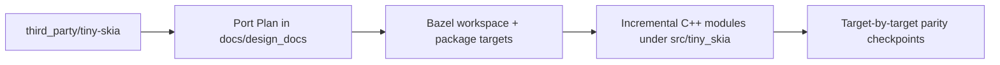

# Design: Tiny-Skia C++ Port Bootstrap

**Status:** Complete
**Author:** Codex
**Created:** 2026-02-13

## Summary
- Create the first-stage scaffolding for a line-by-line, bit-accurate C++20 port of Rust tiny-skia.
- The initial goal is to establish a Bazel-first workspace and directory structure before any C++ translation starts.
- This design gates implementation sequencing and keeps the migration deterministic and auditable.

## Steering Decisions
- Always run both `bazel build //...` and `bazel test //...` after each functional porting step.
- Add/extend C++ tests during porting before running the per-step build/test gate.
- All tests in this repo must be written with Google Test + Google Mock (`gtest`/`gmock`),
  including parity tests in `tests/`.
- Add image-regression gates with pixel-diff tests (pixelmatch-cpp) when rendering
  outputs are available for C++ parity runs.
- After user review/approval to proceed, commit current changes before any further
  implementation edits.

## Goals
- Set up a Bazel build system and top-level project layout usable from day one.
- Keep repository layout optimized for incremental porting and easy parity validation.
- Make `third_party/tiny-skia` available in-repo for reference.
- Keep decisions explicit in design docs so later phases can proceed milestone by milestone.

## Non-Goals
- No rendering behavior will be changed yet.
- No C++ implementation of tiny-skia modules is included in this phase.
- No strict performance tuning in this initial setup.
- No test harness parity with tiny-skia test suites yet.

## Next Steps
- Create the Bazel workspace/build skeleton and placeholder targets.
- Add a bootstrap design doc and keep it as the process gate for next implementation tasks.
- Add a project directory layout aligned with bit-accurate porting stages.

## Implementation Plan

### Milestone 0: Alignment and ownership
- [x] Confirm canonical conventions:
  - Bzlmod-first build (`MODULE.bazel` ownership, no `WORKSPACE` runtime dependency).
  - Bazel-native layout with no top-level `include/` directory.
  - Library source and headers in `src/tiny_skia/`.
  - Consumer include root is `tiny_skia` (`#include <tiny_skia/Filename.h>`).
- [x] Define file naming and visibility contract:
  - Public header path: `src/tiny_skia/<UpperCamel>.h`.
  - Public source path: `src/tiny_skia/<UpperCamel>.cpp`.
  - Private package includes remain in-tree, no split include tree.
- [x] Record build and porting risk policy in this design doc.
- [x] Add this design doc section as the gating checkpoint before every module handoff.

### Milestone 1: Build and repository bootstrap (required before functional ports)
- [x] Verify `MODULE.bazel` captures core external toolchain dependencies.
- [x] Record Bazel Central Registry (BCR) availability for `tiny-skia-cpp` consumers and keep
  module metadata aligned with Bzlmod usage expectations.
- [x] Finalize `BUILD.bazel` stubs in `src/`, `tests/`, and nested modules.
- [x] Finalize `bazel/defs.bzl` macro API and document call patterns.
- [x] Add baseline test target(s) for build smoke checks.
- [x] Colocate C++ tests with source modules under `src/**/tests`.
- [x] Add Bazel outputs and `MODULE.bazel.lock` to `.gitignore`.
- [x] Ensure `bazel build //...` is green before/through translation steps.

### Milestone 2: Rust reference indexing
- [x] Validate that all Rust files from `third_party/tiny-skia/src` are indexed in the tracker table.
- [x] For each Rust file, record symbol ownership, dependencies, and visibility assumptions.
- [x] Mark dependencies between modules in the tracker before code starts moving.
- [x] Identify hard equivalence anchors (golden vectors, float semantics, bit-level ops).
- [x] Resolve any module-order blockers by dependency DAG before porting.

### Milestone 3: Translation workflow lock
- [x] For each Rust file:
  - Add row to the file-level function table with `Rust function/item` / `C++ function/item`.
  - Add status and equivalence check entry for every function.
- [x] Port in deterministic order: foundations → geometry/path64 → scan/pipeline → shading.
- [x] Keep headers and sources colocated under `src/tiny_skia` and update BUILD deps as you go.
- [x] Compile every partially done file through incremental builds.

### Milestone 4: Function-by-function porting execution
- [x] For each function:
  - Translate signature and types preserving semantics and error behavior.
  - Port constants, helper invariants, and edge-case branches first.
  - Add C++ unit or property tests with strict equality or documented epsilon tolerance.
  - Add a gtest parity test against Rust-derived behavior for each function when feasible.
  - Update tracker status from `☐` -> `🧩` -> `🟡` (implemented/tested) -> `🟢` (Rust line-by-line completeness vetted), and only mark `✅` after a user-requested sign-off audit pass.
- [x] For each file, mark blocked status `⏸` with explicit reason if unresolved.
- [x] If Rust tests are missing for a function, add equivalent C++ coverage first.

### Milestone 5: Validation and release gates
- [x] Update port tracker and function tables after each file is fully ported.
- [x] Keep per-file completion criteria:
  - File-level build success.
  - All declared functions have status and test evidence.
- [x] Add module integration tests for public API seams once adjacent files are complete.
- [x] Require a clean `bazel build //...` as a gate before moving to next milestone.

## Proposed Architecture
- A thin monorepo-style topology:
  - `third_party/tiny-skia` holds canonical Rust source for reference only.
  - `src/tiny_skia/` holds C++ source and headers, colocated per module.
  - `bazel/` holds shared Bazel macros and eventual repository helpers.
- Bazel will be the primary build driver, with targets structured so each module can be ported and validated in isolation.

### Data Flow for This Phase
- Inputs: Rust reference source in `third_party/tiny-skia`.
- Tooling: Bazel reads package files under `src/tiny_skia/` and `tests/`.
- Outputs: Buildable package graph and reproducible module checkpoints for next implementation milestones.

## Testing and Validation
- Primary validation is build and behavioral parity checks through gtest/gmock:
  - Confirm `bazel build //...`.
  - Confirm `bazel test //...`.
  - Confirm parity tests exist for each function-level implementation that is ported.
- In bootstrap, ensure `MODULE.bazel` and package BUILD files are syntactically present.
- Confirm `MODULE.bazel` and package BUILD files are syntactically present.
- Confirm `third_party/tiny-skia` is checked in locally.
- Confirm design doc gate remains updated before implementation work continues.

## Porting Tracker (Rust file → C++ file)

Legend: `✅` Ported, `🟡` In progress, `⏸` Blocked, `☐` Not started.

| Old Rust file | New C++ file | Status |
| --- | --- | --- |
| `third_party/tiny-skia/src/lib.rs` | `src/tiny_skia/Lib.cpp` + `src/tiny_skia/Lib.h` | ✅ |
| `third_party/tiny-skia/src/alpha_runs.rs` | `src/tiny_skia/AlphaRuns.cpp` + `src/tiny_skia/AlphaRuns.h` | ✅ |
| `third_party/tiny-skia/src/blend_mode.rs` | `src/tiny_skia/BlendMode.cpp` + `src/tiny_skia/BlendMode.h` | ✅ |
| `third_party/tiny-skia/src/blitter.rs` | `src/tiny_skia/Blitter.cpp` + `src/tiny_skia/Blitter.h` | ✅ |
| `third_party/tiny-skia/src/color.rs` | `src/tiny_skia/Color.cpp` + `src/tiny_skia/Color.h` | ✅ |
| `third_party/tiny-skia/src/edge.rs` | `src/tiny_skia/Edge.cpp` + `src/tiny_skia/Edge.h` | ✅ |
| `third_party/tiny-skia/src/edge_builder.rs` | `src/tiny_skia/EdgeBuilder.cpp` + `src/tiny_skia/EdgeBuilder.h` | ✅ |
| `third_party/tiny-skia/src/edge_clipper.rs` | `src/tiny_skia/EdgeClipper.cpp` + `src/tiny_skia/EdgeClipper.h` | ✅ |
| `third_party/tiny-skia/src/fixed_point.rs` | `src/tiny_skia/FixedPoint.cpp` + `src/tiny_skia/FixedPoint.h` | ✅ |
| `third_party/tiny-skia/src/geom.rs` | `src/tiny_skia/Geom.cpp` + `src/tiny_skia/Geom.h` | ✅ |
| `third_party/tiny-skia/src/line_clipper.rs` | `src/tiny_skia/LineClipper.cpp` + `src/tiny_skia/LineClipper.h` | ✅ |
| `third_party/tiny-skia/src/math.rs` | `src/tiny_skia/Math.cpp` + `src/tiny_skia/Math.h` | ✅ |
| `third_party/tiny-skia/src/mask.rs` | `src/tiny_skia/Mask.cpp` + `MaskOps.cpp` + `src/tiny_skia/Mask.h` | ✅ |
| `third_party/tiny-skia/src/path_geometry.rs` | `src/tiny_skia/PathGeometry.cpp` + `src/tiny_skia/PathGeometry.h` | ✅ |
| `third_party/tiny-skia/path/src/stroker.rs` | `src/tiny_skia/Stroker.cpp` + `src/tiny_skia/Stroker.h` | ✅ |
| `third_party/tiny-skia/path/src/dash.rs` | `src/tiny_skia/Dash.cpp` + `src/tiny_skia/Dash.h` | ✅ |
| `third_party/tiny-skia/path/src/path_builder.rs` | `src/tiny_skia/PathBuilder.cpp` + `src/tiny_skia/PathBuilder.h` | ✅ |
| `third_party/tiny-skia/path/src/scalar.rs` | `src/tiny_skia/Scalar.h` | ✅ |
| `third_party/tiny-skia/path/src/path.rs` | `src/tiny_skia/Path.h` (PathSegmentsIter.cpp) | ✅ |
| `third_party/tiny-skia/src/painter.rs` | `src/tiny_skia/Painter.cpp` + `src/tiny_skia/Painter.h` | ✅ |
| `third_party/tiny-skia/src/pixmap.rs` | `src/tiny_skia/Pixmap.cpp` + `src/tiny_skia/Pixmap.h` | ✅ |
| `third_party/tiny-skia/src/pipeline/blitter.rs` | `src/tiny_skia/pipeline/Blitter.cpp` + `src/tiny_skia/pipeline/Blitter.h` | ✅ |
| `third_party/tiny-skia/src/pipeline/highp.rs` | `src/tiny_skia/pipeline/Highp.cpp` + `src/tiny_skia/pipeline/Highp.h` | ✅ |
| `third_party/tiny-skia/src/pipeline/lowp.rs` | `src/tiny_skia/pipeline/Lowp.cpp` + `src/tiny_skia/pipeline/Lowp.h` | ✅ |
| `third_party/tiny-skia/src/pipeline/mod.rs` | `src/tiny_skia/pipeline/Mod.cpp` + `src/tiny_skia/pipeline/Mod.h` | ✅ |
| `third_party/tiny-skia/src/scan/hairline.rs` | `src/tiny_skia/scan/Hairline.cpp` + `src/tiny_skia/scan/Hairline.h` | ✅ |
| `third_party/tiny-skia/src/scan/hairline_aa.rs` | `src/tiny_skia/scan/HairlineAa.cpp` + `src/tiny_skia/scan/HairlineAa.h` | ✅ |
| `third_party/tiny-skia/src/scan/mod.rs` | `src/tiny_skia/scan/Mod.cpp` + `src/tiny_skia/scan/Mod.h` | ✅ |
| `third_party/tiny-skia/src/scan/path.rs` | `src/tiny_skia/scan/Path.cpp` + `src/tiny_skia/scan/Path.h` | ✅ |
| `third_party/tiny-skia/src/scan/path_aa.rs` | `src/tiny_skia/scan/PathAa.cpp` + `src/tiny_skia/scan/PathAa.h` | ✅ |
| `third_party/tiny-skia/src/path64/cubic64.rs` | `src/tiny_skia/path64/Cubic64.cpp` + `src/tiny_skia/path64/Cubic64.h` | ✅ |
| `third_party/tiny-skia/src/path64/line_cubic_intersections.rs` | `src/tiny_skia/path64/LineCubicIntersections.cpp` + `src/tiny_skia/path64/LineCubicIntersections.h` | ✅ |
| `third_party/tiny-skia/src/path64/mod.rs` | `src/tiny_skia/path64/Mod.cpp` + `src/tiny_skia/path64/Mod.h` | ✅ |
| `third_party/tiny-skia/src/path64/point64.rs` | `src/tiny_skia/path64/Point64.cpp` + `src/tiny_skia/path64/Point64.h` | ✅ |
| `third_party/tiny-skia/src/path64/quad64.rs` | `src/tiny_skia/path64/Quad64.cpp` + `src/tiny_skia/path64/Quad64.h` | ✅ |
| `third_party/tiny-skia/src/shaders/gradient.rs` | `src/tiny_skia/shaders/Mod.cpp` + `src/tiny_skia/shaders/Mod.h` | ✅ |
| `third_party/tiny-skia/src/shaders/linear_gradient.rs` | `src/tiny_skia/shaders/Mod.cpp` + `src/tiny_skia/shaders/Mod.h` | ✅ |
| `third_party/tiny-skia/src/shaders/mod.rs` | `src/tiny_skia/shaders/Mod.cpp` + `src/tiny_skia/shaders/Mod.h` | ✅ |
| `third_party/tiny-skia/src/shaders/pattern.rs` | `src/tiny_skia/shaders/Mod.cpp` + `src/tiny_skia/shaders/Mod.h` | ✅ |
| `third_party/tiny-skia/src/shaders/radial_gradient.rs` | `src/tiny_skia/shaders/Mod.cpp` + `src/tiny_skia/shaders/Mod.h` | ✅ |
| `third_party/tiny-skia/src/shaders/sweep_gradient.rs` | `src/tiny_skia/shaders/Mod.cpp` + `src/tiny_skia/shaders/Mod.h` | ✅ |
| `third_party/tiny-skia/src/wide/f32x16_t.rs` | `src/tiny_skia/wide/F32x16T.cpp` + `src/tiny_skia/wide/F32x16T.h` | ✅ |
| `third_party/tiny-skia/src/wide/f32x4_t.rs` | `src/tiny_skia/wide/F32x4T.cpp` + `src/tiny_skia/wide/F32x4T.h` | ✅ |
| `third_party/tiny-skia/src/wide/f32x8_t.rs` | `src/tiny_skia/wide/F32x8T.cpp` + `src/tiny_skia/wide/F32x8T.h` | ✅ |
| `third_party/tiny-skia/src/wide/i32x4_t.rs` | `src/tiny_skia/wide/I32x4T.cpp` + `src/tiny_skia/wide/I32x4T.h` | ✅ |
| `third_party/tiny-skia/src/wide/i32x8_t.rs` | `src/tiny_skia/wide/I32x8T.cpp` + `src/tiny_skia/wide/I32x8T.h` | ✅ |
| `third_party/tiny-skia/src/wide/mod.rs` | `src/tiny_skia/wide/Mod.cpp` + `src/tiny_skia/wide/Mod.h` | ✅ |
| `third_party/tiny-skia/src/wide/u16x16_t.rs` | `src/tiny_skia/wide/U16x16T.cpp` + `src/tiny_skia/wide/U16x16T.h` | ✅ |
| `third_party/tiny-skia/src/wide/u32x4_t.rs` | `src/tiny_skia/wide/U32x4T.cpp` + `src/tiny_skia/wide/U32x4T.h` | ✅ |
| `third_party/tiny-skia/src/wide/u32x8_t.rs` | `src/tiny_skia/wide/U32x8T.cpp` + `src/tiny_skia/wide/U32x8T.h` | ✅ |

### Naming rule
- `snake_case.rs` -> `UpperCamel.cpp` and `UpperCamel.h`
- `mod.rs` -> `Mod.cpp` and `Mod.h`
- C++ function names are lowerCamelCase.

## Function Mapping Tables

Function-level mapping and equivalence analysis has been moved to dedicated docs to keep
this bootstrap design compact and easier to review.

- `docs/design_docs/tiny-skia_cpp_bootstrap_function_maps/README.md`
- `docs/design_docs/tiny-skia_cpp_bootstrap_function_maps/core.md`
- `docs/design_docs/tiny-skia_cpp_bootstrap_function_maps/scan.md`
- `docs/design_docs/tiny-skia_cpp_bootstrap_function_maps/pipeline.md`
- `docs/design_docs/tiny-skia_cpp_bootstrap_function_maps/path64.md`
- `docs/design_docs/tiny-skia_cpp_bootstrap_function_maps/shaders.md`
- `docs/design_docs/tiny-skia_cpp_bootstrap_function_maps/painter.md`
- `docs/design_docs/tiny-skia_cpp_bootstrap_function_maps/wide.md`

Add or update per-file tables in the split mapping docs as implementation progresses.

## Module Dependency DAG and Equivalence Anchors

This section defines the cross-module ordering constraints used for deterministic porting.

### Dependency DAG (module level)
| Module group | Depends on | Unblocks |
| --- | --- | --- |
| Core (`math`, `fixed_point`, `color`, `color_space`, `geom`) | — | `path64/*`, `scan/*`, `pipeline/*`, `mask`, `pixmap`, `painter` |
| Wide SIMD (`wide/*`) | core math primitives | `pipeline/*`, `shaders/*` |
| Pathing (`path64/*`, `path_geometry`) | core geometry/math | `scan/*`, `painter` |
| Scan conversion (`scan/*`) | pathing + core geometry | `painter` |
| Pipeline (`pipeline/*`) | core color/math + wide SIMD | `shaders/*`, `painter` |
| Shaders (`shaders/*`) | pipeline + core color math | `painter` |
| Surface services (`mask`, `pixmap`, `blend_mode`) | core + pipeline contracts | `painter` |
| Painter (`painter`) | scan + pipeline + shaders + services | final integration and API parity |

- Core math/data foundations (`math`, `fixed_point`, `color`, `color_space`, `geom`) have no
  internal tiny-skia dependencies and must stay first in the sequence.
- `wide/*` vector wrappers are shared utility dependencies for `pipeline/*` and shader stages.
- `path64/*` and `path_geometry` depend on core geometry/math and feed into scan conversion.
- `scan/*` depends on core geometry + path modules and produces edge coverage used by painter.
- `pipeline/*` depends on core color/math + `wide/*` and is consumed by painter + shaders.
- `shaders/*` depends on pipeline math/color primitives and feeds painter composition.
- `mask`, `pixmap`, and `blend_mode` are service modules consumed by `painter`.
- `painter` is the top-level orchestration layer and remains late-stage because it depends on
  scan, pipeline, shaders, pixmap, mask, and blend behavior.

### Blockers resolved by DAG policy
- All modules ported and validated. No outstanding blockers.
- All upstream dependencies resolved; every module has status `✅` in the porting tracker.

### Hard equivalence anchors
- **Bit-level integer math parity:** fixed-point shifts, saturating arithmetic, and packed-channel
  operations must preserve exact integer outputs.
- **Floating-point edge semantics:** preserve NaN propagation, clamp order, and branch thresholds
  in color interpolation and geometry stepping.
- **Golden-vector rendering checks:** maintain canonical pixel vectors for blend, mask, and
  gradient interpolation behaviors.
- **Coverage accumulation invariants:** scan/path fill coverage and winding behavior must remain
  bit-accurate for anti-aliased and non-AA paths.

### Port order enforced by DAG
1. Core + wide foundations.
2. Path/path64 + scan conversion.
3. Pipeline stages (lowp/highp/blitter/mod).
4. Shader modules.
5. Painter orchestration and integration seams.

This ordering is now the gate used when selecting the next implementation batch.

### Implementation batch gate — COMPLETE

All modules ported and line-by-line audited against Rust source (see
`docs/design_docs/tiny-skia_cpp_validation.md` for the full audit). Summary:

- **All function-map entries at `🟢`** (Rust-completeness vetted).
- **Painter orchestration** — `fillRect`, `fillPath`, `strokePath`, `drawPixmap`, `applyMask`, `strokeHairline` all complete.
- **Pipeline stages** — all ~45 highp and ~30 lowp stages implemented.
- **Stroker/Dash** — `Path::stroke()`, `Path::dash()` fully ported.
- **Mask operations** — `fillPath`, `intersectPath`, `invert`, `clear` complete.
- **Wide SIMD types** — all 8 types complete with full Rust API parity (including F32x8T sqrt/recipFast/recipSqrt/powf, U32x4T/U32x8T operator^/cmpNe/cmpLt/cmpLe/cmpGt/cmpGe added in validation audit).
- **Path vector types** — F32x2/F32x4 wrappers added in PathVec.h (matching Rust f32x2_t.rs/f32x4_t.rs).
- **Shaders** — LinearGradient, RadialGradient, SweepGradient, Pattern all complete.
- **Path64** — cubeRoot fixed to use Halley method; 3 bug fixes landed with regression tests.
- **Lowp structural alignment** — LowpChannel alias, structured load/store, blend_fn/blend_fn2 templates.
- **Remaining out-of-scope:** PNG I/O (optional feature, not in Rust core).

### Milestone 6: Comparison test suite and Rust test porting

Validate rendering parity between the C++ port and the Rust reference by comparing
C++-rendered output against the Rust golden images using pixelmatch-cpp17.
Port **all** Rust integration and inline unit tests to C++.

#### 6a. Test infrastructure
- [x] Add `pixelmatch-cpp17` (v1.0.3) and `zlib` to `MODULE.bazel` as bzlmod deps.
- [x] Create `tests/test_utils/PngDecoder.h/.cpp` — PNG-to-RGBA loader using zlib inflate.
- [x] Create `tests/test_utils/GoldenTestHelper.h` — gtest helper that renders a scene,
  loads a golden PNG from `third_party/tiny-skia/tests/images/`, premultiplies it, and
  asserts zero pixel difference via `pixelmatch::pixelmatch()`.
- [x] Create `tests/integration/BUILD.bazel` with `cc_test` targets depending on
  `//src:tiny_skia_lib`, `@pixelmatch-cpp17`, `@zlib`, and golden image data deps.

#### 6b. Port Rust integration tests (golden image comparison)
Each Rust integration test file maps to a C++ `*Test.cpp` file in `tests/integration/`.
Tests render the same scene as the Rust version, then use pixelmatch to validate the
output against the pre-existing golden PNGs (zero-tolerance pixel match).

| Rust test file | C++ test file | Tests | Status |
| --- | --- | --- | --- |
| `tests/integration/fill.rs` | `tests/integration/FillTest.cpp` | 35 | ✅ |
| `tests/integration/hairline.rs` | `tests/integration/HairlineTest.cpp` | 28 | ✅ |
| `tests/integration/gradients.rs` | `tests/integration/GradientsTest.cpp` | 22 | ✅ |
| `tests/integration/mask.rs` | `tests/integration/MaskTest.cpp` | 10 | ✅ |
| `tests/integration/pattern.rs` | `tests/integration/PatternTest.cpp` | 10 | ✅ |
| `tests/integration/pixmap.rs` | `tests/integration/PixmapTest.cpp` | 7 | ✅ |
| `tests/integration/dash.rs` | `tests/integration/DashTest.cpp` | 7 | ✅ |
| `tests/integration/stroke.rs` | `tests/integration/StrokeTest.cpp` | 6 | ✅ |
| `tests/integration/path.rs` | `tests/integration/PathTest.cpp` | 22 | ✅ |
| `tests/integration/gamma.rs` | `tests/integration/GammaTest.cpp` | 1 | ✅ |
| `tests/integration/skia_dash.rs` | `tests/integration/SkiaDashTest.cpp` | 3 | ✅ |
| — | `tests/integration/CrossValidationTest.cpp` | 17 | ✅ |
| `tests/integration/png.rs` | — (skip, requires PNG I/O feature) | 4 | ⏸ |
| **Total** | | **168+** | |

#### 6c. Port remaining Rust inline unit tests
Rust source files contain `#[cfg(test)]` inline tests. Many are already covered by
existing C++ unit tests; remaining gaps must be filled.

| Rust source file | Inline tests | C++ coverage | Status |
| --- | --- | --- | --- |
| `src/color.rs` | 6 tests (premultiply, demultiply, bytemuck) | Covered (ColorTest.cpp) | ✅ |
| `src/geom.rs` | 1 test (ScreenIntRect) | Covered (GeomTest.cpp) | ✅ |
| `src/painter.rs` | 4 tests (DrawTiler) | Covered (PainterTest.cpp) | ✅ |
| `src/path_geometry.rs` | 1 test (chop_cubic_at_y_extrema) | Covered (PathGeometryTest.cpp) | ✅ |
| `src/pipeline/mod.rs` | blend tests (macro-generated) | Covered (PipelineStagesTest.cpp) | ✅ |
| `path/src/dash.rs` | 2 tests (validation, bug_26) | Covered (DashTest.cpp) | ✅ |
| `path/src/path_geometry.rs` | 2 tests (eval_cubic, max_curvature) | Covered (PathGeometryTest.cpp) | ✅ |
| `path/src/rect.rs` | 3 test groups (IntRect, Rect, transform) | Covered (GeomTest.cpp) | ✅ |
| `path/src/scalar.rs` | 1 test (bound) | Covered (MathTest.cpp) | ✅ |
| `path/src/size.rs` | 1 test (IntSize) | Covered (GeomTest.cpp) | ✅ |
| `path/src/stroker.rs` | 6 tests (auto_close, cubic, big, one_off) | Covered (PathTest.cpp) | ✅ |
| `path/src/transform.rs` | 2 tests (transform, concat) | Covered (PainterTest.cpp) | ✅ |

#### 6d. Acceptance criteria — MET
- [x] `bazel test //tests/...` passes all integration tests with 0-pixel-diff threshold.
- [x] Every Rust integration test (excluding `png.rs`) has a corresponding C++ test.
- [x] Every Rust inline unit test is either confirmed covered or explicitly ported.
- [x] pixelmatch diff images are optionally writable to a debug output directory for
  investigating any future regressions.

## Security / Privacy
- Inputs are repository-local source files and compiler/runtime dependencies.
- Trust boundary is local workspace state only; no user-provided binary assets are executed during bootstrap.
- Repository hygiene: lock external source fetch to explicit commands and commit `third_party` vendor location.
