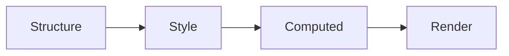

# Entity Component System (ECS)

Donner uses a data-oriented Entity Component System (ECS) design pattern to store and manipulate the SVG document. This is a common pattern in game development, since it optimizes for performance via cache-friendly data structures and parallelism.

## Entities

Entities are the primary data structure in ECS. They are simply a unique identifier for a set of components. In Donner, entities are represented by a 32-bit unsigned integer.

```cpp
enum class Entity : std::uint32_t {};
```

An entity is created by calling `registry.create()` without any components.  Here is how the `Entity` is created for SVG elements.

```cpp
EntityHandle SVGElement::CreateEntity(Registry& registry, RcString typeString, ElementType type) {
  Entity entity = registry.create();
  registry.emplace<TreeComponent>(entity, type, std::move(typeString));
  registry.emplace<TransformComponent>(entity);
  return EntityHandle(registry, entity);
}
```

## Components

Components are the data associated with an entity, which are efficiently stored to allow for both fast lookup and iteration.

```cpp
// Get an entity's component by reference.
TransformComponent& transform = registry.get<TransformComponent>(entity);

// Iterate over all TransformComponents for all entities.
for (auto entity : registry.view<TransformComponent>()) {
  TransformComponent& transform = view.get(entity);
}
```

Each component may only have one instance per entity, and each entity has an independent list of components. For example, it's easy to add a component to an entity to tag them or add data.

```cpp
struct InvalidateRenderTree {};

// Add a tag component to an entity.
registry.emplace<InvalidateRenderTree>(entity);
```

For a real-world example, here is how the `ViewboxComponent` is created for SVG elements.

```cpp
struct ViewboxComponent {
  // Contains viewbox dimensions.
  std::optional<Boxd> viewbox;

  /*
   * Computes the transform for the given Viewbox per
   * https://www.w3.org/TR/SVG2/coords.html#ComputingAViewportsTransform
   */
  Transformd computeTransform(Boxd size, PreserveAspectRatio preserveAspectRatio) const;
};
```

The same system is used to implement the tree structure, where a `TreeComponent` is added to each entity that contains `Entity` references to its parent and children.

## Systems

Systems are singletons within the `Registry`, and are used to hold global state and operate on the component-system.  Donner calls these contexts, for example `DocumentContext` and `RenderingContext`.

# Donner ECS Architecture

In Donner, each Entity corresponds to a single SVGElement.

<svg class="e2ecs" viewBox="0 0 600 300" xmlns="http://www.w3.org/2000/svg">
  <style>
    .e2ecs { background: white; }
    .e2ecs circle { fill: white; stroke: black; stroke-width: 2px; vector-effect:
    non-scaling-stroke; }
    .e2ecs rect { stroke: black; stroke-width: 2px; fill: none; }
    .e2ecs text { font-family: Arial, sans-serif; fill: #333; font-size: 18px; }
    .e2ecs line { fill: #d8d8d8; stroke: black; stroke-width: 2px; vector-effect:
    non-scaling-stroke; }
  </style>
  <g id="tree">
    <circle cx="150" cy="100" r="25" />
    <circle cx="200" cy="200" r="25" />
    <circle cx="100" cy="200" r="25" />
    <line x1="163" y1="122" x2="190" y2="177" />
    <line x1="137" y1="122" x2="110" y2="177" />
  </g>
  <text x="114" y="65">&lt;svg ...&gt;</text>
  <text x="35" y="248">&lt;path ...&gt;</text>
  <text x="181" y="248">&lt;path...&gt;</text>
  <path d="M 259 137 L 284 137 L 284 123 L 329 150 L 284 177 L 284 162 L 259 162 Z"
    style="stroke-width: 2px; fill: rgba(216, 216, 216, 0.48); stroke: rgb(137, 137, 137);" />
  <text x="380" y="65">Entities</text>
  <rect x="380" y="74" width="40" height="40" />
  <rect x="440" y="74" width="40" height="40" />
  <rect x="500" y="74" width="40" height="40" />
  <rect x="517" y="186" width="26" height="26" />
  <rect x="543" y="186" width="26" height="26" />
  <rect x="459" y="186" width="26" height="26" />
  <rect x="379" y="187" width="26" height="26" />
  <rect x="405" y="187" width="26" height="26" />
  <rect x="353" y="187" width="26" height="26" />
  <line x1="400" y1="114" x2="367" y2="186" />
  <line x1="461" y1="114" x2="390" y2="186" />
  <line x1="519" y1="114" x2="418" y2="186" />
  <line x1="405" y1="114" x2="471" y2="186" />
  <line x1="465" y1="114" x2="528" y2="186" />
  <line x1="528" y1="114" x2="555" y2="186" />
  <use href="#tree" transform="matrix(0.24, 0, 0, 0.24, 355, 200)" />
  <text x="458" y="231">SVG</text>
  <text x="516" y="231">Path</text>
</svg>

_[Diagram: Illustration of how a document tree is represented as Entities and Components]_

Donner groups its components into categories, based on transformations that occur as the document is parsed and rendered.


